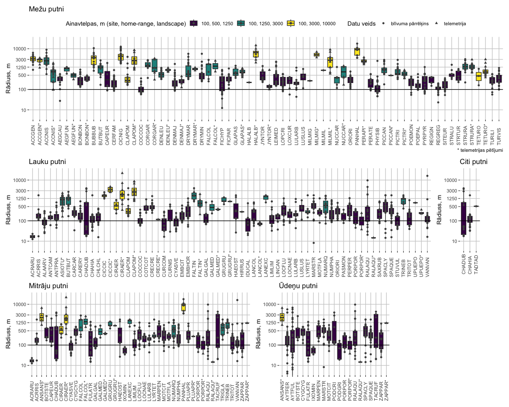

# Sugu saraksts un pamata apraksti  {#Chapter1}

Šajā nodaļā sniegts analīzei izvēlēto sugu saraksta pamatojums un demonstrēta informācijas apkopošanas gaita sugu bioloģijas un ekoloģijas aprakstiem, kas tālāk izmantoti modelēšanā.

Saskaņā ar projekta pieteikumu, uzdevums ir izstrādāt vismaz 70 slāņus ar dzīvotņu piemērotības analīzes rezultātiem. Sākotnēji analīzei izvēlēto sugu loks ir 116, lai samazinātu spriedzi ap ik sugas rezultāta uzticamību un pielietojamību mērķim.

## Analizējamo sugu izvēle

No 375 Latvijā jebkad konstatētajām putnu sugām [@PutniLV], 335 ir uzskatāmas par (šobrīd vai vismaz vienu desmitgadi kopš 1900. gada) ligzdotājām [@Avotins_etal_2024a:LfS_Conference]. Tomēr tas nebūt nenozīmē, ka visām par ligzdotājām uzskatāmajām putnu sugām ir pieejami dati (un projektam - resursi) modelēšanai. Tādēļ vaikta tālāka sugu atlase.

No visām ligzdojošo putnu sugām atlasītas jeb modelēšanai paredzētas:

1. Putnu Direktīvas (Eiropas Parlamenta un Padomes Direktīva 2009/147/EK ( 2009. gada 30. novembris ) par savvaļas putnu aizsardzību) 1. pielikumā iekļautās sugas;

2. Life for Species projektā [@LifeForSpecies] par aizsargājamām klasificētās;

3. Life for Species projektā [@LifeForSpecies] par apdraudētām klasificētās;

4. ES aizsargājamo biotopu rokasgrāmatā iekļautās sugas [@ESbiotopurokasgramata];

5. Bioloģiski vērtīgo zālāju indikatorsugas [@BVZmetodika];

6. Lauku putnu indeksā iekļautās sugas [@LPU2020];

7. Latvijas vai boreālā reģiona meža putnu indeksā iekļautās sugas [@LPU2020];

8. Sugas, kurām ir izstrādāti aizsardzības plāni, kuros iekļauta dzīvotņu piemērotības modelēšana [@PucuPlans], [@DzenuPlans];

Pēc primārā saraksta, kurš raksturo vispārēju nepieciešamību (vai iespējas) modelēšanai, sagatavošanas, tas papildināts ar izslēgšanas kritērijiem:

1. Sugas ekoloģiskā niša ir saistīta ar dzīvotnēm, kuru raksturošanai nepieciešami sevišķi specifiski ekoģeogrāfiskie mainīgie, kuru izstrādei ir sevišķi ierobežota ģeodatu pieejamība. Šeit uzsveram, ka šī projekta uzdevums nav aptvert visas putnu sugas, tas arī nav atrisināt valsts līmenī iztrūkstošu ģeoreferencētu informāciju par specifiskiem vides apstākļiem;

2. Ar ligzdošanu (sugai specifiskiem ligzdošanas ticamības kategorijas sliekšņiem) saistītu novērojumu indikatīvā pieejamība. Šai indikācijai izmantojām Life for Species [@LifeForSpecies] projektā veiktās datu tīrīšanas rezultātus, kas aptvēra laika periodu no 2012. līdz 2021. gadam, kurus agregējām 1 km Latvijas koordinātu sistēmas kvadrātos. Par minimālo indikatīvo novērojumu apjoma slieksmi pieņēmām 20 kvadrātus ar vismaz iespējamu ligzdošanu sugām, kuras vides datu pieejamības dēļ netika izslēgtas. Tik zems slieksnis izvēlēts, lai gadījumā, ja daļai sugu neizdotos sasniegt izmantošanas vērtu modeļa sniegumu, vēl joprojām būtu sasniegts projekta mērķis (70 slāņi).

Sākotnējais modelēšanai izvēlēto sugu saraksts (ar nomenklatūru un saīsinājumu kodiem) un iekļaušanas pamatojums ir sniegts sekojošajā tabulā \@ref(tab:SuguIzvele).

```{r SuguIzvele,echo=FALSE}
suppressPackageStartupMessages(library(kableExtra))
suppressPackageStartupMessages(library(tidyverse))
opts <- options(knitr.kable.NA = "")
suguizvele=readxl::read_excel("./Papilddati/SuguIzvele.xlsx")
suguizvele=suguizvele %>% dplyr::select(-Numurs)
tabula=kableExtra::kbl(suguizvele, caption = 'Sākotnējais sugu saraksts (sugas kods; nosaukums; atbilstība iekļaušanas kritērijiem un 1 km kvadrātu, kuros projekta Life for Species atlasē saglabājusies sugas klātbūtne, skaits)', 
                    booktabs = TRUE, 
                    longtable = TRUE) 
tabula %>%
  kable_styling(latex_options = "scale_down") %>%
  scroll_box(width = "100%", box_css = "border: 0px;")
```


## Pamata apraksti analīzei

Analīzes plānošanai - potenciālo vidi raksturojošo ekoģeogrāfisko mainīgo (EGV) sagatavošanai, to sugām specifisko telpisko mērogu identificēšanai un sugu saistīšanai ar vispārīgām ekosistēmas grupām gan EGV sākotnējai izvēlei, gan kompleksas biodaudzveidības aizsardzības telpiskajai plānošanai - sugas iedalītas principiālās tām raksturīgajās ekosistēmās un, balstoties literatūras analīzē, piešķirtas tām raksturīgās izmantotās ainavas telpas.

Kā principiālās ekosistēmas izvēlētas plašas grupas: meži, lauksaimniecības ainava (lauki), mitrāji un ūdeņi, tomēr daļai sugu raksturīga kāda šaura specifiskāka vide, tādēļ tām izdalīta atsevišķa kategorija - "cita". Mozaīkveida ainavu apdzīvojošām sugām un sugām ar kompleksu ekoloģisko nišu, piemēram, atšķirīgu ligzdošanas un barošanās ekosistēmu, vienlaikus piešķirtas vairākas grupas. Ekosistēmu grupu piešķiršanai izmantota vispārīgā literatūra  un projekta ornitologu (A. Avotiņa un A. Auniņa) ekspertīze.

Par raksturīgo izmantoto ainavas telpu visbiežāk uzskatāma ligzdošanas iecirkņa platība. Tomēr, atkarībā no sugas ligzdošanas ekoloģijas, var būt telpiski apjomīga atšķirība starp ligzdas aizsardzības zonu un barošanās iecirkni. Turklāt katras šīs teritorijas platība mainās līdz ar vides apstākļiem (dzīvotņu piemērotību). Visuzticamākā informācija būtu, izmantojot Latvijā veiktus telemetrijas pētījumus, tomēr sugu loks, kurām šādi dati ir pieejami ir ārkārtīgi ierobežots un tas ir gandrīz neeksistējošs publicētu datu veidā. Tādēļ pieņemts lēmums veikt literatūras analīzi (resursu ierobežotības un mērķa vispārības jeb zemās nepieciešamības pret augstu precizitāti dēļ, ne sistemātiska pārskata ik sugai veidā), kas ierobežota nosacījumiem (prioritārā secībā):

1. meklēt informāciju par ligzdošanas iecirkņa (*home range*) platību vismaz pieciem Eiropā (Latvijai iespējami līdzīgākos apstākļos) veiktiem telemetrijas pētījumiem;

2. paplašināt meklējumus ārpus Eiropas veiktiem telemetrijas pētījumiem, tos kombinējot ar no sastopamības blīvuma izrietošiem teritorijas lieluma aprēķiniem;

3. apkopot Latvijai telpiski tuvāko un ekoloģiski līdzīgāko vidējo ligzdošans blīvumu rādītājus, kas pārrēķināti vidējai ligzdošanas iecirkņa platībai.

Šī uzdevuma mērķis bija vispārīga sugu grupēšana izmantotās ainavas telpās un sagatavojamo EGV apjoma ierobežana, iegūtais rezultāts nepretendē uz sistemātiskā pārskata statusu. Kopējais aptverto informācijas avotu skaits ir 232 (vidēji sugai informācija no 5.86 (IQR: 4 - 7) avotiem, vidēji sugai ir 16.97 (IQR: 9 - 22) ieraksti), tomēr izmantojot apkopojošos darbus (piemēram, monogrāfijas un pārskata rakstus) nav mēģināts referencēt ik oriģinālo darbu - atsauce sniegta uz izmantoto pārskatu.

Darba gaitas vienkāršošanai, situācijās, kad sniegta informācija gan par centrālo tendenci, gan variabilitāti, izmantots tikai centrālās tendences mērs. Situācijās, kurās pieejama informācija tikai par robežlielumiem (piemēram, minimālais un maksimālais), aprēķināts ģeometriskais vidējais. Visi ligzdošanas iecirkņu raksturojumi izteikti hektāros un ik ierakstam aprēķināts rādiuss metros, pieņemot, ka ligzdošanas iecirknis ir aplis. Lai gan šis pieņēmums ir nenoliedzami aplams gandrīz jebkurā situācijā, iegūtais rezultāts ļauj vispārīgi plānot analīzes gaitu un grupēt sugas ligzdošanas iecirkņu grupās, tādā veidā limitējot sagatavojamo EGV skaitu.

Sugām raksturīgo ekosistēmu dalījums un izdalītās ligzdošanas iecirkņu grupas ir redzamas sekojošajā attēlā \@ref(fig:AinavTelpas). Visas sugas iedalītas kādā no trīs ligzdošanas iecirkņa rādiusa grupām pēc vērtības mediānā un trešajā kvartilē: līdz/ap 500 m, līdz/ap 1250 m, līdz/ap 3000 m. Katrai ligzdošanas iecirkņa platībai piešķirts plašāks ainavas telpas mērogs (EGV sagatavošanai un modelēšanai), tie attiecīgi ir: 1250 m, 3000 m, 10 000 m. Atsevišķos gadījumos - komunāli riestojošajām sugām - ligzdošanas iecirkņa rādiuss palielināts par vienu soli (un atbilstoši arī ainavas telpa) sugas vairošanās bioloģijas - nepieciešamības spēt uzturēt vairākus iecirkņus, kuru indivīdiem satikties uz riestu - dēļ. Līdzīgi arī sugām ar izteikti plašiem medību iecirkņiem, mērogi pieņemti par vienas grupas soli uz augšu. Gadījumos, kad telemetrijas rezultāti ierosināja atšķirīgu ligzdošanas iecirkņa rādiusa grupu nekā vidējā blīvuma pārrēķins, lēmums pieņemts, balstoties telemetrijas pētījumos.

```{r AinavTelpas, echo=FALSE, fig.cap="Sugu dalījums ekosistēmās un ainavas platībās (sugu kodi ar zvaigznīti, raksturo telemetrijas pētījumu rezultātus; telemetrijas pētījumu un citiem rezultātiem ir atšķirīgi simboli; sugu kodi kā 2.1. tabulā)", out.width = '100%'}

```

<br>


## Pamata apraksti novērojumu atlasei

Vispārīgi, tomēr strukturēti, apraksti sagatavoti arī modelēšanā izmantojamo novērojumu atlasei. Šie apraksti ietver divas daļas: sugai nepiemērotā vide (Corine Land Cover klase, CLC) un ligzdošanas sezonas robežas. Novērojumu atlases procedūra detalizēti izklāstīta nodaļā [Novērojumu atlase](#Chapter6), sugām specifiskie kritēriji sniegti [šajā tabulā](./Papilddati/SuguApraksti_NoverojumuAtlasei.xlsx), zemāk raksturota to izstrādes gaita.

### Nepiemērota vide 

Tā kā ievērojama daļa modelēšanai potenciāli izmantojamo novērojumu ir sabiedrības zinātnes ceļā iegūti, tiem ir sagaidāmas ievērojamas novietojuma telpā neprecizitātes. No tām nav pasargātas arī profesionāļu ievāktās ziņas, piemēram, mērierīcas kļūdas dēļ. Ņemot vērā datu apjomu (skatīt, piemēram, https://dabasdati.lv/lv/article/dabasdatilv-zinojumu-apkopojums-2024-gada-aprilis-junijs/2024/), nav iespējams apskatīt un izvērtēt novērojuma lokācijas kļūdu katram vienam novērojumam. Tomēr pat idealizējot situācijām, kad tas būtu iespējams, ir nepieciešami skaidri kritēriji nosacījumiem, kad lokācija nav uzskatāma par drošu. Tā kā vide ir heterogēna, loģiski ir novērojumus pārbaudīt attiecībā pret zemes seguma vai zemes lietojuma (LULC) veidiem. Tomēr, lai cik intuitīvi pareizi tas nešķistu, nav jēgas tos vērtēt attiecībā pret piemērotajām LULC klasēm, jo piemērotība ir gradients un bez papildu analīzēm, kuru veikšana ir šī projekta uzdevums, nav iespējams pietiekoši uzticami nodalīt dažādas šī piemērotības gradienta daļas. Tomēr gandrīz jebkurai sugai ir iespējams definēt vidi (LULC klasi), kas nekādā gadījumā nav tieši saistāma ar ligzdošanu, jo sevišķi, ja telpiski šī klase ir tik plaša, lai daudzkārt pārsniegtu vispārīgo labas veiktspējas mērierīces precizitāti (zem 10 m labos apstākļos). Šādu iespēju nodrošina, piemēram, Corine Land Cover dati, kuru minimālā kartēšanas izšķirtspēja ir plankums ar laukumu vismaz 25 ha un ne šaurāks par 100 m (https://land.copernicus.eu/en/products/corine-land-cover). Lai gan šobrīd aktuālākā CLC versija raksturo 2018. gadu, bet modelēšanā aptvertais laika periods ir līdz 2023. gadam (ieskaitot), tomēr tā nav uzskatāma par problēmu, jo *plašas* (no 25 ha) pārmaiņas starp diametrāli atšķirīgām klasēm (no piemērotas vai suboptimās uz noteikti nepierētoru) nav sagaidāmas par biežām, bet vēl vairāk - datu atlasē vides pārmaiņas tik iekļautas kā atsevišķs solis. Tā kā šajā uzdevumā svarīgas ir plašas LULC kategorijas, izmantots CLC pirmā līmeņa dalījums (pirmais cipars no trīsciparu LULC klases koda). Tātad, novērojumi attiecināti pret CLC kategorijām: mākslīgās virsmas (CLC 1; pazīme "Maksligie"), izņemot pilsētu zaļās zonas, kas pievienotas kokiem klātām platībām (CLC 141 -> CLC 3); lauksaimniecības zemes, dabiskie zālāji, virsāji, kāpas un smiltāji (CLC 2, CLC 321, CLC 322, CLC 331; pazīme "Atvertie"); meži un pus-dabiskās platības, kurām pievienotas pilsētu zaļās zonas un izslēgtas klases dabiskie zālāji, virsāji un kāpas un smiltāji (CLC 3 un CLC 141, bet CLC 321 -> CLC 2, CLC 322 -> CLC 2, CLC 331 -> CLC 2; pazīme "Koki"); mitrāji (CLC 4; pazīme "Mitraji"); ūdeņi (CLC 5; pazīme "Udeni").

Vidē, kurā ar ligzdošanu saistīta sugas sastopamība ir sevišķi nesagaidāma, atbilstošajā pazīmē ir ievietota vērtība "-1". Šo vērtību piešķiršanas gaitā domāts arī par plankumu izmēriem - ja sugai ir neliels ligzdošanas iecirknis (Fig. \@ref(fig:AinavTelpas)), kura platība var būt mazāka par CLC kartēšanas vienību, var nebūt atzīmju nevienā pazīmē. Līdzīgi, atzīmes va rnebūt situācijās, kad sugai ir raksturīgi dažādi robežbiotopi, piemēram, suga neligzdo ūdeņos, bet apdzīvo to visdažādākās to malas - CLC kartēšanas robežkļūdas
dēļ, nav pamata veikt atzīmi nevienā no pazīmēm.

### Ligzdošanas sezona {#Chapter1.3.2}

Ligzdošanas sezonas raksturošanai izmantota detalizētākā pieejamā informācija no Eiropas [@KrampisVol1], [@KrampisVol2], [@KrampisVol3], [@KrampisVol4], [@KrampisVol5], [@KrampisVol6], [@KrampisVol7], [@KrampisVol8], [@KrampisVol9]. Lai gan šī informācija ir uzskatāma par vismaz pusgadsmitu senu un gandrīz nekad ne Latvijā iegūtu, tā tomēr spēj raksturot laiku, kad sugām principā ir sagaidāmi ar ligzdošanu saistāmi novērojumi. Ievērojama daļa aprakstu nāko no Eiropas reģioniem ar okeāniskāku klimatu vai vairāk uz dienvidiem, kas saistībā ar klimata pārmaiņām vairāk asociējas ar situāciju Latvijā šobrīd (salīdznot ar laiku pirms vairāk nekā pusgadsimta), tomēr plaši izplatītām sugām ar lielu informācijas apjomu, šie dati var būt iegūti arī Ziemeļāfrikā kā aiz Ziemeļu polārā loka. Tādēļ priekšroka dota (sekojošajā secībā) datiem no Centrāleiropas (1); platlapju  un jauktu koku mežu reģiona (2); boreālās zonas (3); vai kopumā sugu raksturojošie neatkarīgi no reģiona. Ligzdošanas sezonas sākums noteikts pēc agrākā minētā olu dēšanas sākuma, ligzdošanas sezonas beigas rēķinātas, ņemot vērā tekstā norādīto ligzdošanas laiku (vēlāko ligzdošans uzsākšanu), olu inkubācijas ilgumu, laiku starp izdētām olām, inkubācijas uzsākšanu attiecībā pret dējuma pilnību, perēšanas ilgumu, mazuļu ligzdā pavadīto laiku, laiku līdz lidspējai, atkārtotos dējumus u. tml.

## Pamata apraksti starpsugu svarošanai

Veicot vietu prioritizēšanu sugu aizsardzībai (nodaļa [Vietu prioritizēšana aizsardzībai](#Chapter9)) ik sugai individuāli, *a priori* nav nepieciešama nekāda informācija papildus dzīvotņu piemērotības slāņiem. Tomēr, plānojot dabas vai biodaudaudzveidības aizsardzību plašākā kontekstā, ņemot vērā dažādos telpas ierobežojumus un telpiskās pārklāšanās un atšķirības starp sugu dzīvotnēm kā arī faktu, ka dāžādām sugām ir atšķirīga nozīme dabas aizsardzībā, ir nepieciešams veidot kompleksāku pieeju. Pieejas pamatā ir atšķirīgu nozīmes svaru piešķiršana ik sugai projicētajiem dzīvotņu piemērotības slāņiem. Šos svaru var iegūt dažādi, tomēr labāk to darīt ir izmantojot iespējami salīdzināmas kvantitātes, kurās apkopota gan sugas bioloģija un ekoloģija, gan dažādi politiskie vai juridiskie un sociālie apsvērumi.

Sociālos apsvērumus ir labi risināt, piemēram, ar ekosistēmu pakalpojumu pieeju, ko visērtāk iestrādāt vietu hierarhiskā prioritizācijā kā atsevišķu latento faktoru, vai pielietot prioritizācijas rezultātu komunikācijā. Šajā materiālā tie tiešā viedā nav iestrādāti.

Ar politiskajiem un juridiskajiem apsvērumiem var saprast, piemēram, likumdošanu - ar sugām var būt saistīti dažādi apsaimniekošanas ierobežojumi vai būt regulēta pati apsaimniekošana. Tomēr nereti šie dokumenti ir novecojuši, salīdzinot ar populāciju ekoloģijas atziņām, piemēram, relatīvi neilgā laikā (pat mazāk kā desmitgadē), sugu populācijas no stabilām vai pieaugošām var kļūst par sarūkošām un pat līdz tādam līmenim, ka kļūst apdraudētas, bet normatīvie akti tam nespēj izsekot. Neiedziļinoties jautājumu par nepieciešamību ik gadu pārskatīt nacionālos un starptautiskos tiesību aktus, šo aspektu tiešā veidā (citādi kā sugu loka izvēlē) sugu svarošanā neiekļāvām. Tā vietā izmantojām kvantitatīvu sugu bioloģijas un ekoloģijas informāciju, kas varētu būt pamatā juridiskajiem statusiem un to atšķirībām.

Ir skaidrs, ka mažakas populācijas ir vairāk apdraudētas un tām var būt nepieciešama stingrāka aizsardzība. Tāpat arī ir skaidrs, ka par sugām, kuru populācijas ir proporcionāli vairāk koncentrētas Lativjā, ir augstāka nacionālā atbildība. Kā arī, stingrāka aizsardzība ir nepieciešama saŗukošām populāicjām un sugām ar retāku vairošanos un zemāku mūža reproduktīvo sasniegumu. Šī ir sugu pamata bioloģijas un ekoloģijas informācija, kas ir iegūstama ar literatūras analīzes palīdzību (skaidrota sekojošajās apakšnodaļās) un izmantojama kā dāla no nepieciešamajiem datiem starpsugu svarošanai vietu prioritizēšanai. Sagatavotie apraksti ir apskatāmi [šajā tabulā](./Papilddati/SuguApraksti_SvarosanaiEkologija.xlsx), zemāk skaidrota to izstrādes gaita un izmantotie informācijas avoti.

### Populācijas lielums un pārmaiņas 

Dati par putnu sugu populāicju lielumiem un to pārmaiņām Eiropas Savienībā un tās dalībvalstīs ir pieejami un regulāri atjaunoti Putnu Direktīvas (Eiropas Parlamenta un Padomes Direktīva 2009/147/EK ( 2009. gada 30. novembris ) par savvaļas putnu aizsardzību) 12. panta ziņojumu ietvaros. Šajā pārskatā izmantoti 2012.-2018. gada pārskata perioda rezultāti (sugu kopsavilkumi par katru dalībvalsti: https://nature-art12.eionet.europa.eu/article12/report?period=3&country= ; sugu kopsavilkumi Eiropā kopumā: https://nature-art12.eionet.europa.eu/article12/summary?period=3&subject=&reported_name=). Apkopojumā ir sekojoši svarošanai izmantojamie lauki:

- `Populacija_LV`, kurā raksturots sugas Latvijas populācijas lielums. Sugām, kurām ziņoti intervāli, aprēķināts ģeometriskais vidējais, pārējos gadījumos, izmantots ziņojumā sniegtais putnka vērtējums;

- `Populacija_Eiropa`, kurā raksturots sugas Eiropas populāicjas lielums. Tas aprēķināts kā ģeometriskais vidējais no minimālā un maksimālā rādītāja;

- `PopProp_LV`, kurā raksturtos Latvijā ligzdojošās populācijas īpatsvars (`Populacija_LV`) no Eiropas populāicjas (`Populacija_Eiropa`);

- `Parmainas_proc`, kurā norādīts populācijas pārmaiņu apjoms (izteikts procentos). Kad iespējams, izmantots īstermiņa pārmaiņu punkta vērtējums Latvijā; kad tas nebija pieejams, tas aprēķināts no intervāla robežām. Ja nebija pieejams īstermiņa pārmaiņu vērtējums, izmantots iltermiņa vērtētjums ar to pašu pieeju. Vienai sugai (kuitalai) nebija pieejami Latvijas populācijas pārmaiņu vērtējumi, tādēļ izmantots Igaunijas ziņotais;

- `Parmainu_periods`, kurā raksturots izmantotā populācijas pārmaiņu apjoma (`Parmainas_proc`) aprēķinu periods;

- `Parmainu_gadi`, kurā raksturots pārmaiņu ilgums, kas nepieciešams multiplikatīvā pārmaiņu rādītāja aprēķināšanai;

- `Valsts`, kurā raksturota valsts, kuras dati populācijas pārmaiņu raksturošanai;

- `Parmainas_mult`, kurā ievietots aprēķinātais eksponenciālo populāicja spārmaiņu raksturojums. Aprēķiniem izmantota formula $(\frac{100+\Delta}{100})^\frac{1}{T},$ kur $\Delta$ ir populācijas pārmaiņu apjoms un $T$ ir pārmaiņu ilgums gados.

### Mūža reproduktīvais ieguldījums

Pilnvērtīgam mūža reproduktīvā ieguldījuma aprēķinam būtu nepieciešama vismaz informācija  par individiem raksturīgo reproduktīvā mūža ilgumu, izdēto olu skaitu, izšķīlušos un izvesto mazuļu skaitu, varbūtību tiem sasniegt ligzdošanas uzsākšanas vecumu un varbūtību ligzdot ik gadu turpmāk. Diemžēl visa šī informācija nav pieejama par katru no sugām, tādēļ izvēlēta apkopojoša pieeja, kur izmantojot vispārīgo informāicju un monitoringu rezultātus, apkopots minimālais informācijas apjoms ik ligzdošanas iecirkņa (kuru aizsardzības plānošanai šis tiek darīts) atšķirību starp sugām indikāciju raksturošanai. Zemāk skaidrota apkopotā informācija (datu tabulas lauki):

- `Paaudzes_garums`, kurā norādīts sugai raksturīgais dzīves ilgums (dzīves gados). Informāicja iegūta no *BirdLife International* *European Red List of Birds* (http://datazone.birdlife.org/info/euroredlist2021) [skatīts: 2023-10-08];

- `Pirmas_ligzdosanas_vecums`, kurā raksturots pirmās ligzdošanass vecums (kalendārais gads). Informācija apkopota no [@KrampisVol1], [@KrampisVol2], [@KrampisVol3], [@KrampisVol4], [@KrampisVol5], [@KrampisVol6], [@KrampisVol7], [@KrampisVol8], [@KrampisVol9]. Atsevišķos gadījumos šī informācija izmantotajos avotos nebija pieejama, tad tā pielīdzināta no ekoloģiski un pēc dzīves ilguma līdzīgajām sugām, kas skaidrots saistītajā laukā `Vecuma_piezimes`;

- `Vecuma_piezimes`, kurā skaidroti apsvērumi pieņemtajam lirmās ligzdošanas vecumam, kad tas nav norādīts izmantotajos literatūras avotos. Saistīts ar lauku `Pirmas_ligzdosanas_vecums`;

- `Olu_skaits`, kurā norādīts raksturīgais vidējais izdēto olu skaits. Visbiežāk informācija apkopota no [@KrampisVol1], [@KrampisVol2], [@KrampisVol3], [@KrampisVol4], [@KrampisVol5], [@KrampisVol6], [@KrampisVol7], [@KrampisVol8], [@KrampisVol9]. Atsevišķos gadījumos izmantoti citi avoti, kas individuāli norādīti sekojošajā laukā (`Avots`), šie avoti ir: [@NumResp_2023], [@SomuPlesi], [@Lipsis2011].

- `Avots`, kurā norādīts olu skaita informācijas avots, saistībā ar lauka `Olu_skaits` skaidrojumu;

- `Dejumu_skaits`, kurā norādīts sugai raksturīgais dējumu skaits (sekojot prioritātēm, kas aprakstītas nodaļā [Ligzdošanas sezona](#Chapter1.3.2)), neieskaitot aizvietojošos dējumus.

