# *Dynamic World* izpēte  {#Chapter4}

*Dynamic World* (DW) ir relatīvi nesens Zemes novērošanas sistēmu produkts, kurš klasificē zemes segumu un lietojumu (LULC) deviņās kategorijās (0=water, 1=trees, 2=grass, 3=flooded_vegetation, 4=crops, 5=shrub_and_scrub, 6=built, 7=bare, 8=snow_and_ice), katram ESA Copernicus Sentinel-2 attēlam ar identificēto mākoņainību $\le35%$, pieļaujot filtrēšanu un dažādu agregāciju veidošanu [@DynWorld]. Salīdzinot ar dažādiem statiskākiem (produktu veidā sagatavotiem konkrētiem gadiem ar smagnēju projicēšanu citiem gadiem) un/vai konkrētu ekosistēmas daļu raksturošanai paredzētiem, piemēram *EU Crop Map* [@CropMap2022] un *ELULC-10* [@ELULC10], DW neapšaubāmi ir ar lielākām sagaidāmajām kļūdām pie klašu (gēotelpiskajām) robežām, tomēr labāku telpisko (klasificēti ir visas izmantojamās satelītainas, nevis vadoties pēc kādas vidi atpazīstošas maskas) un temporālo pārklājumu (dinamiska un tuvu reāllaikam klasifikācijas pieejamība ik satelītainai, nevis atsevišķas projekcijas laikā). Dažādu nesen radīto augstas izšķirtspējas LULC klasifikatoru salīdzinājumos, piemēram, [@LULC10salidzinajums_Venter] un [@LULC10salidzinajums_Xu], ir konstatētas dažādas atšķirības starp tiem, turklāt DW nav bijis uzskatāms par precīzāko, jo sevišķi spējā detektēt relatīvi šaurus līnijaveida objektus un saistībā ar neironu tīklos balstīto pieeju tieksmi pārspīlēt vertikāli strukturētās klases, tomēr tam ir augstākā temporālā pieejamība. Par šajos salīdzinājumos precīzāko uzskatāmajam *ESA WorldCover* brīvi pieejama ir informācijai tikai par 2020. un 2021. gadiem (https://collections.sentinel-hub.com/worldcover/). Augstās temporālās pieejamības dēļ, DW izpēte turpināta, jo pat, ja klases nav vienmēr korekti atpazītas, ir vērts izpētīt spēju atpazīt pārmaiņas to sastopamībā.

Tā kā šī projekta komandai nav zināmi izsekojami (caurspīdīgi, reproducējami) Latvijā veikti DW klasifikācijas un tās pārmaiņu uzticamības pētījumi, šī resursa izpēte veikta projekta ietvaros. Izpētei ir sekojoši **mērķi**:

1. noskaidrot DW izmantošanas iespējas LĢIA topogrāfiskās kartes (un citu ierobežotas pieejamības resursu) aizstāšanai sugu izplatības modelēšanai;

2. noskaidrot labāko sezonu (mēnešu griezumā) Latvijas ainavas (un tās pārmaiņu) raksturošanai dzīvnieku vairošanās un veģetācijas sezonā;

3. iegūt informāciju par DW spēju raksturot ainavas pārmaiņas starp gadiem.

Izpēti fokusējām dzīvnieku vairošanās sezonai, kuras plaši pārklājas ar veģetācijas sezonu, kurā ir sagaidāma augstākā klasifikatoru spēja sniegt informatīvu rezultātu. **Sezonas sākums: aprīlis**, jo:

- šis ir mēnesis, kurā daļa valsts teritorijas vēl var būt zem sniega segas, bet lielākajā teritorijas daļā tas jau būs nokusis;

- šajā mēnesī sākas lapu koku plaukšana, bet tikai sākas, tomēr visbiežāk jau visā valsts teritorijā;

- lakstaugu veģetācija būs sazaļojusi galvenokārt ziemājos, bet ne dabiskajā veģetācijā; protams, uz mēneša beigām dažādi mauriņi u. tml., bet tas vēl nebūs noticis mēneša sākumā;

- vajadzētu būt vēl saglabājušamies sniega kušanas ūdeņiem, ja tādi bija uzkrājušies;

**Sezonas beigas: augusts**, jo:

- tas labi sakrīt ar laiku, kad ligzdošanas un vairošanās sezona ir noslēgusies *vairumam* dzīvnieku sugu;

- sākas migrāciju sezona, kas gan ierosina, ka jūlijs varētu būt labāks beigu punkts, bet ir vērts pārbaudīt dažādas kombinācijas;

- intensīvi sākas rudens aršanas darbi, kas veido (t.sk. iznīcina) dzīvotnes nākošajai sezonai (pat, ja ietekmēta ziemošana, tās reproduktīvā vai teritoriju aizņemtības izpausme būs novērojama nākošajā sezonā); arī šis sliecas ierosināt, ka jūlijs būtu labāks beigu punkts, bet ir vērts pārbaudīt dažādas kombinācijas;

- šis mēnesis vēl ir svarīgs daudzām bezmugurkaulnieku sugām, to konstatēšanai;

**Soļa garums analīzēm: 2-5 secīgi mēneši**, jo

- tikai viena mēneša izmantošana nebūtu sevišķi laba doma, ja tas ir, piemēram, tikai viens aprīļa mēnesis, varētu būt problēmas ar jebkādu veģetāciju, bet vasaras mēnešos ar ūdeņainajām vietām utml.;

- secīgi, jo savādāk nav loģiski;

- pieci, jo periodā ir tikai pieci;

- kopējais kombināciju skaits sezonalitātes pārbaudēm sanāk desmit (turpmākajos apzīmējumos lietots pirmā un pēdējā mēneša trīs burtu saīsinājumu angļu valodā apvienojums bez atdalītājiem):

  - apr-may;

  - apr-may-jun;

  - apr-may-jun-jul;

  - apr-may-jun-jul-aug;

  - may-jun;

  - may-jun-jul;

  - may-jun-jul-aug;

  - jun-jul;

  - jun-jul-aug;

  - jul-aug

Mērķa sasniegšanai ir izvirzāmi vairāki **izpētes jautājumi**, kuri ir risināti šīs nodaļas sekojošajās daļās:

0. Kuros gados un kādos griezumos DW slāņi nosedz visu Latviju, kāda ir datu multi-temporālā un telpiskā pieejamība?;

1. Cik labi tiek atpazītas lauksaimniecības kultūras plašās grupās - nepieciešams, lai šo izmantotu par pamatu turpmākam darbam ainavas klasificēšanā par kultūrām, par kurām nav izpratnes, un vietām, par kurām nav pieejama reģistru informācija, raksturošanai;

2. Kāda ir mežaudzes augstuma (atkarībā no valdošās koku sugas) saistība ar DW mežu/koku un krūmu klasēm - nepieciešama, lai veiktu ainavas klasifikāciju par vietām, kurām nav reģistru, izdalītu koku un krūmu pudurus;

3. Kāds ir topogrāfiskās kartes ar mitrājiem saistāmo klašu sadalījums DW klasēs, kad ir labākā saistība ar vēlamo klasi (un kura tad tā būtu augstajiem purviem un ūdeņu veģetācijai) - nepieciešams gan ainavas, gan pārmaiņu raksturošanai;

4. Kāda ir topogrāfiskās kartes karjeru un kūdras ieguves vietu, kā arī dažādu ceļu saistība ar DW klasēm - nepieciešams gan ainavas, gan pārmaiņu raksturošanai;

5. Kāda ir izcirtuma izmēra (un formas) saistība ar DW klasēm - nepieciešams gan ainavas, gan pārmaiņu raksturošanai;

6. Kāda DW klase tiek piešķirta aramzemēm, kuras pirms gada transformētas no zālājiem - nepieciešams ainavas pārmaiņām.


**Kopējie uzstādījumi analīžu veikšanai**

- poligonu atlasei izmantojam 'set.seed(0)', lai nodrošinātu rezultātu reproducējamību;

- laika taupīšanai, ik analizei nejauši izlozējam 999 vai izmantojam visus pieejamos poligonus;

- ik analīzi veicam kā zonālo statistiku, aptverot visu pētāmo plankumu;

- DW ik periodam ir resamplēts sakritībai ar references 10 m šūnu un ietver tikai Latvijas teritoriju.

DW ievades informācija - rastra slānis katrai sezonai katrā gadā - sagtavots Google Earth Engine (GEE) platformā [@GEEpaper], izmantojot [replicēšanas skriptu](https://code.earthengine.google.com/941bb1a16331727787bb3fc1bbbda95b?noload=true). Lai izmantotu šo skriptu, ir nepieciešams [GEE konts un projekts](https://code.earthengine.google.com/register) un pietiekošs apjoms vietas Google Drive diskā. Izpildot komandrindas tiks piedāvāta lejuplāde failam, kas aptver laika periodu no vērtības 7. rindā līdz vērtībai 8. rindā (faila nosaukums norādāms 32. rindā, tā apraksts - 33. rindā un direktorija Google diskā - 31. rindā vai tas viss norādāms apstiprinot saglabāšanau) - šis skripts nav optimizēts visu sezonālo griezumu visiem gadiem sagatavošanai, lai reproducētu vai paplašinātu šo izpēti, tās nepieciešams manuāli izmainīt.

Pēc komandrindu izpildes un rezultātu sagatavošanas Google Drive diskā, ir redzams, ka katrs visu Latviju aptverošais slānis ir sadalīts vairākās lapās. Tas ir tādēļ, ka, lai nodrošinātu nulles patieso vērtību (klase "water", nevis fons), slāņi kodēti kā *Float*, nevis veselie skaitļi. Visas šīs lapas ir nepieciešams lejuplādēt, sekojošās R komandrindas tās apvieno, nodrošinot koordinātu sistēmas un pikseļu atbilstību references rastram.

```{r, eval=FALSE}
if(!require(tidyverse)) {install.packages("tidyverse"); require(tidyverse)}
if(!require(terra)) {install.packages("terra"); require(terra)}

# reference
paraugs=rast("./LV10m_10km.tif")

# saraksts ar lejupielādētajiem failiem, pieņemot, ka tie atrodas direktorijā 
# "DWE_float"
faili=data.frame(faili=list.files("./DWE_float/"))
faili$celi_sakums=paste0("./DWE_float/",faili$faili)

# Korekti projicētu mozaīku sagatavošana
# failu nosaukumi un ceļš saglabāšanai
faili=faili %>% 
  separate(faili,into=c("DW","gads","periods","parejais"),sep="_",remove = FALSE) %>% 
  mutate(unikalais=paste0(DW,"_",gads,"_",periods),
         mosaic_name=paste0(unikalais,".tif"),
         masaic_cels=paste0("./DWE_mosaic/",mosaic_name))

# unikālie failu nosaukumi cikla vadībai
unikalie=levels(factor(faili$unikalais))

# cikls uzdevuma veikšanai
for(i in seq_along(unikalie)){
  unikalais=faili %>% filter(unikalais==unikalie[i])
  beigu_cels=unique(unikalais$masaic_cels)
  
  # ik slānis sastāv no divām lapām
  viens=rast(unikalais$celi_sakums[1])
  divi=rast(unikalais$celi_sakums[2])
  
  viens2=project(viens,paraugs)
  divi2=project(divi,paraugs)
  
  mozaika=mosaic(viens2,divi2,fun="first")
  maskets=mask(mozaika,paraugs,filename=beigu_cels,overwrite=TRUE)
}
```


## Q0: DW nosegums

Katram gadam (2015-2023) ik iepriekš minētajam sezonas griezumam DW datu pārklājum ir apskatāmi zemāk esošajā attēlā  \@ref(fig:DWq00). Kā jau sagaidāms, 2015. gadā ir trūcīgs nosegums. Pārskata periodā resurss ir samērā droši izmantojams kopš 2018. gada, kopš 2016. gada pielietojamība ir vērtējama, atkarībā no mērķiem un vērtējama saistībā ar sezonas griezumiem.

```{r DWq00, echo=FALSE, out.width = '100%', fig.cap='DW rezultātu pieejamība dažādos sezonālajos griezumos kopš Sentinel-2 programmas datu pieejamības. Pikseļu krāsa attēla daļās raksturo 1 km šūnās esošo klasifikācijas iztrūkumu īpatsvaru, savukārt skaitļi attēla daļās - kopējo klasifikācijas robu īpatsvaru procentos (%).'}
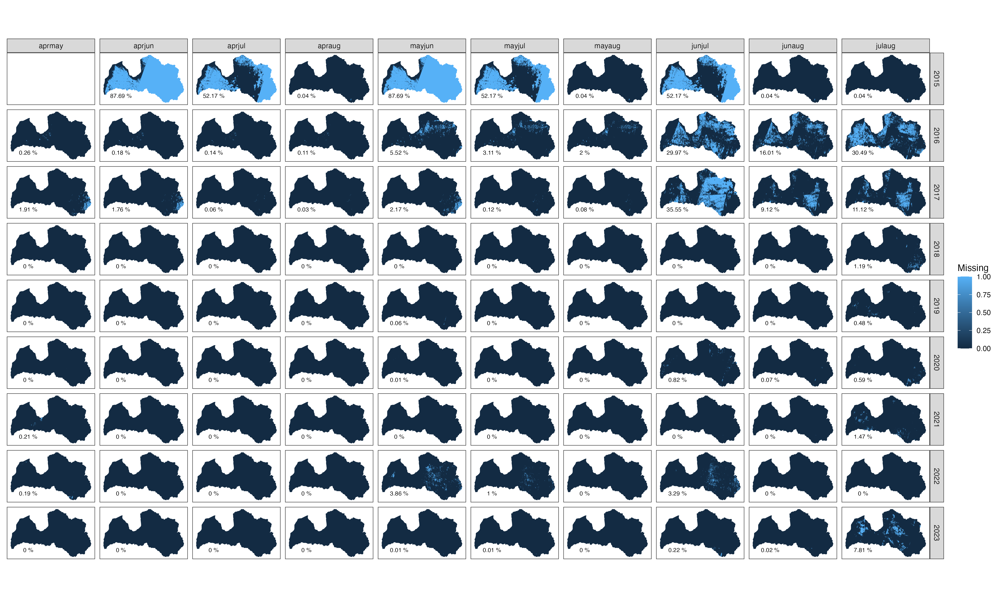
```

<br>

Komandu rindas reproducēšanai:

```{r, eval=FALSE}
# libs
if(!require(terra)) {install.packages("terra"); require(terra)}
if(!require(tidyverse)) {install.packages("tidyverse"); require(tidyverse)}
if(!require(arrow)) {install.packages("arrow"); require(arrow)}
if(!require(sfarrow)) {install.packages("sfarrow"); require(sfarrow)}
if(!require(exactextractr)) {install.packages("exactextractr"); require(exactextractr)}
if(!require(openxlsx)) {install.packages("openxlsx"); require(openxlsx)}

# 10 m rastra template
paraugs=rast("./LV10m_10km.tif")

# 100 m režģis
kvadrati=st_read_parquet("./tikls1k_sauzeme.parquet")

# robu analīze
failu_objekts2=data.frame(faili=list.files("./DWE_mosaic/"))
failu_objekts2$celi_sakums=paste0("./DWE_mosaic/",failu_objekts2$faili)
failu_objekts2$celi_beigas=paste0("./DWEm_missing/","missing_",failu_objekts2$faili)
failu_objekts2=failu_objekts2 %>% 
  separate(faili,into=c("DW","gads","sezona","ext"),remove = FALSE)
failu_objekts2$celi_parquet=paste0("./DWEm_missing/","missing_","DW_",
                                   failu_objekts2$gads,"_",
                                   failu_objekts2$sezona,
                                   ".parquet")
failu_objekts2$missings=NA_real_
for(j in 1:length(failu_objekts2$faili)){
    print(j)
  cels=failu_objekts2$celi_sakums[j]
  cels_beigas=failu_objekts2$celi_beigas[j]
  cels_parquet=failu_objekts2$celi_parquet[j]
  gads=failu_objekts2$gads[j]
  sezona=failu_objekts2$sezona[j]
  print(cels)
  print(cels_beigas)
  dw1=terra::rast(cels)
  dw2=classify(dw1,cbind(0,10,0))
  dw3=terra::cover(dw2,paraugs,filename=cels_beigas,overwrite=TRUE)
  iztrukumi=global(dw3, "mean", na.rm=TRUE)
  failu_objekts2$missings[j]=round(iztrukumi$mean*100,2)
  robi_tikla=exact_extract(dw3,kvadrati,"mean",max_cells_in_memory=1300000000)
  kvadrati2=kvadrati
  kvadrati2$robi_tikla=robi_tikla
  kvadrati2$gads=gads
  kvadrati2$sezona=sezona
  st_write_parquet(kvadrati2,cels_parquet)
}
write.xlsx(failu_objekts2,"./DWmc_missing.xlsx")

# parquet savienošana
robu_kvadrati <- map_dfr(list.files("./DWEm_missing/",pattern=".parquet",
                                    full.names = TRUE), 
                 sfarrow::st_read_parquet, show_col_types = FALSE)

robu_kvadrati2=robu_kvadrati %>% 
  mutate(gads2=as.numeric(gads),
         sezona2=factor(sezona,ordered=TRUE,
                        levels=c("aprmay","aprjun","aprjul","apraug","mayjun",
                                 "mayjul","mayaug","junjul","junaug","julaug")))

failu_objekts2=failu_objekts2 %>% 
  mutate(gads2=as.numeric(gads),
         sezona2=factor(sezona,ordered=TRUE,
                        levels=c("aprmay","aprjun","aprjul","apraug","mayjun",
                                 "mayjul","mayaug","junjul","junaug","julaug"))) %>% 
  mutate(x=410000,y=210000,
         missings2=paste0(missings," %"))

# rezultāta vizualizācija
ggplot()+
  geom_sf(data=robu_kvadrati2,aes(fill=robi_tikla,col=robi_tikla))+
  facet_grid(gads2~sezona2)+
  theme_bw()+
  coord_sf(datum=sf::st_crs(3059))+
  geom_text(data=failu_objekts2,aes(x=x,y=y,label=missings2),size=2.5)+
  labs(fill="Missing",col="Missing")+
  theme(axis.ticks = element_blank(),
        axis.text = element_blank(),
        axis.title = element_blank(),
        panel.grid.major = element_blank())
ggsave("./pic_missings.png",height = 3000,width=5000,units="px")

```


## Q1: Lauksaimniecības kultūras

Ir tādas kultūras, par kurām ir skaidrs, ka tām ir jāsakrīt ar DW klasēm, tās ir apskatāmas, lai pārbaudītu šīs Zemes novērošanas sistēmu (EO) klasifikācijas korektumu.

Ir tādas kultūras, par kurām nav īsti skaidra šī atbilstība, to ir jānoskaidro pēc pirmās grupas izpētes rezultāta.

Bet ir arī tādas kultūras, par kurām ir zināmas bažas par EO datu klasifikācijas rezultātu precizitātes iespējamību, piemēram, kukurūza un auzas.

Aplūkojam sekojošas izpētes grupas:

- ziemāji aramzemēs, kur nav sagaidāmas problēmas, piemēram, rudzi, ziemas mieži, ziemas kvieši, ziemas tritikāle;

- ziemas rapsis;

- vasarāji aramzemēs, kur nav sagaidāmas problēmas, piemēram, vasaras mieži, vasaras kvieši, vasaras tritikāle;

- vasaras rapsis;

- auzas, jo dažādā izpratnē un pētījumos sarežģīti klasificējas EO datos;

- kukurūza, jo tur ir visādi jautājumi ar augšanu, augstumu un novākšanu - katrā no trim veidiem, lai labāk saprastu šo ainavā un dabas aizsardzībā nozīmīgo grupu;

- papuves, lai labāk izprastu šo klasi;

- ilggadīgi zālāji;

- kultivētās pļavas, lai labāk saprastu šo klasi;

- augļukoki, kur apvieno, augļu koki, ābeles, bumbieres, lai labāk saprastu šo klasi;

- ogu-krūmi, kur apvieno avenes, upenes, jāņogas, ērkšķogas, krūmcidonijas, kazenes, lai labāk saprastu šo klasi;

- zemās ogas, kur apvieno krūmmellenes un lieogu dzērvenes,

- bezatbalsta platības, kur apvieno kodus 620 un 792

- vagu un rušināmkultūras, kuru ilustrēšanai izmantošu kodus 821, 825, 843, 844

- īscirtmeta atvasāji un enerģijas augi, kurā apvienoti kodi 644, 645, 646, 641, 642

Izmantojam 2023. gada DW sezonālos slāņus. Lai gan šajā izpētes solī fokuss ir uz augstāk minētajām grupām, sugu izplatības modelēšanai ir nepieciešams klasificēt visas kultūras, tādēļ jau uzreiz skatām visas kultūras. 

Komandu rindas DW klašu sastopamības izpētei ir zemāk. To ietvaros izmantota [LAD lauku informācija](#Chapter3.1.2) un šajā nodaļā (augstāk) sagatavotās 2023. gada DW sezonālās mozaīkas.

```{r, eval=FALSE}
# libs
if(!require(terra)) {install.packages("terra"); require(terra)}
if(!require(tidyverse)) {install.packages("tidyverse"); require(tidyverse)}
if(!require(arrow)) {install.packages("arrow"); require(arrow)}
if(!require(sfarrow)) {install.packages("sfarrow"); require(sfarrow)}
if(!require(exactextractr)) {install.packages("exactextractr"); require(exactextractr)}
if(!require(ggview)) {install.packages("ggview"); require(ggview)}
if(!require(readxl)) {install.packages("readxl"); require(readxl)}
if(!require(ggrepel)) {install.packages("ggrepel"); require(ggrepel)}

# ievades dati
LAD <- st_read_parquet("./LAD_lauki.parquet")

AprAug <- rast("./DW_2023_apraug.tif")
AprJul <- rast("./DW_2023_aprjul.tif")
AprJun <- rast("./DW_2023_aprjun.tif")
AprMay <- rast("./DW_2023_aprmay.tif")
JulAug <- rast("./DW_2023_julaug.tif")
JunAug <- rast("./DW_2023_julaug.tif")
JunJul <- rast("./DW_2023_junjul.tif")
MayAug <- rast("./DW_2023_mayaug.tif")
MayJul <- rast("./DW_2023_mayjul.tif")
MayJun <- rast("./DW_2023_mayjun.tif")

# utility
darbiba <- function(raster, vector, period) {
  exact_extract(raster, vector, function(value, coverage_fraction) {
    data.frame(value = value,
               frac = coverage_fraction / sum(coverage_fraction, na.rm = TRUE)) %>%
      group_by(value) %>%
      summarize(freq = sum(frac, na.rm = TRUE), .groups = 'drop') %>%
      pivot_wider(names_from = 'value',
                  names_prefix = 'freq_',
                  values_from = 'freq')
  }) %>%
    mutate(across(starts_with('freq'), ~replace_na(., 0))) %>%
    mutate(periods = period) 
}


# DW klašu ekstrakcija ik lauka kultūru nejauši izlozētiem plankumiem
# kultūru kodi
kodi=data.frame(kodi=levels(factor(LAD$PRODUCT_CODE)))
# saglabāšanas datu pamatne
dati=LAD[1,]
dati=dati %>% 
  mutate(periods=NA_character_,
         id=NA_real_,
         freq_0=NA_real_,
         freq_1=NA_real_,
         freq_2=NA_real_,
         freq_3=NA_real_,
         freq_4=NA_real_,
         freq_5=NA_real_,
         freq_6=NA_real_,
         freq_7=NA_real_,
         freq_8=NA_real_,
         freq_NA=NA_real_)
# ekstrakcija ik kodams, veicot izlozi
for (i in 1:length(kodi$kodi)){
  kods=kodi$kodi[i]
  # nejaušo plankumu izloze
  set.seed(0)
  lauki <- LAD %>% filter(`PRODUCT_CODE` == kods)
  if (nrow(lauki) < 999) {rand_l <- lauki} else {rand_l <- lauki %>% sample_n(999)}
  rand_l <- rand_l %>%  mutate(id = row_number())
  # ekstrakcija
  a=cbind(rand_l,darbiba(AprAug, rand_l, "AprAug"))
  b=cbind(rand_l,darbiba(AprJul, rand_l, "AprJul"))
  c=cbind(rand_l,darbiba(AprJun, rand_l, "AprJun"))
  d=cbind(rand_l,darbiba(AprMay, rand_l, "AprMay"))
  e=cbind(rand_l,darbiba(JulAug, rand_l, "JulAug"))
  f=cbind(rand_l,darbiba(JunAug, rand_l, "JunAug"))
  g=cbind(rand_l,darbiba(JunJul, rand_l, "JunJul"))
  h=cbind(rand_l,darbiba(MayAug, rand_l, "MayAug"))
  i=cbind(rand_l,darbiba(MayJul, rand_l, "MayJul"))
  j=cbind(rand_l,darbiba(MayJun, rand_l, "MayJun"))
  # rezultātu apvienošana
  rez=bind_rows(a,b,c,d,e,f,g,h,i,j)
  dati <- bind_rows(dati, rez)
  }
# ērtāki lauku nosaukumi
dati=dati %>% 
  mutate(water=freq_0,
         trees=freq_1,
         grass=freq_2,
         flooded_vegetation=freq_3,
         crops=freq_4,
         shrub_and_scrub=freq_5,
         built=freq_6,
         bare=freq_7,
         snow_and_ice=freq_8)
# atbrīvošanās no liekā ieraksta
dati_real=dati[-1,]
# rezultāta saglabāšana
sfarrow::st_write_parquet(dati_real,"./Q1_kulturas.parquet")

```


### Q1.1: Ziemāji aramzemēs


Sekojošajā attēlā \@ref(fig:DWq11) ir ilustrēta ziemāju aramzemēs (kultūru kodi "121","122","132","112","116","151") saistība ar DW klasēm dažādos temporālajos griezumos. Skaitļi attēlu daļās norāda klases "crops" ar lauka platību svērto vidējo īpatsvaru. Redzams, ka zemākā atbilstība ir izmantojot tikai vasaras mēnešus. Ievērojami zemāka par atlikušajām klasēm ir arī tikai pavasara klasifikācija. Atlikušās ir visai līdzīgas, nedaudz pārāki temporālie griezumi šķiet maijā-jūnijā un maijā-jūlijā.

```{r DWq11, echo=FALSE, out.width = '100%', fig.cap='Lauksaimniecības kultūru grupas "ziemāji" saistība ar DW klasēm.'}
knitr::include_graphics("./Atteli/ch004_q11.png")
```

<br>


Komandu rindas attēla sagatavošanas reproducēšanai:

```{r, eval=FALSE}
dati=sfarrow::st_read_parquet("./Q1_kulturas.parquet")
dati=dati %>% 
  mutate(sezona=factor(periods,ordered=TRUE,
                       levels=c("AprMay","AprJun","AprJul","AprAug","MayJun",
                                "MayJul","MayAug","JunJul","JunAug","JulAug")))

ziemaji_aramzemes=c("121","122","132","112","116","151")

q11data=data.frame(dati) %>% 
  filter(PRODUCT_CODE %in% ziemaji_aramzemes) %>% 
  dplyr::select(PRODUCT_CODE,PRODUCT_DESCRIPTION,SHAPE.AREA,sezona,water:snow_and_ice) %>% 
  group_by(PRODUCT_CODE) %>% 
  mutate(skaits=n()/10) %>% 
  ungroup() %>% 
  mutate(nosaukums=paste0(PRODUCT_DESCRIPTION,"\n","n=",skaits)) %>% 
  pivot_longer(cols=water:snow_and_ice,names_to = "klase",values_to = "proporcija")

q11data2=q1data %>% 
  group_by(nosaukums,sezona,klase) %>% 
  summarise(vertiba=round(weighted.mean(proporcija,w=SHAPE.AREA,na.rm=TRUE)*100,0)) %>% 
  ungroup() %>% 
  filter(klase=="crops")

ggplot(q11data,aes(sezona,proporcija,col=klase))+
  facet_wrap(~nosaukums)+
  geom_point(position=position_dodge(width=0.75),alpha=0.2)+
  theme_bw()+
  theme(axis.text.x = element_text(angle=90,vjust=0.5),
        axis.title.y = element_blank(),
        legend.title = element_blank())+
  geom_text(data=q11data2,aes(sezona,y=1.1,label=vertiba),size=3)+
  scale_color_viridis_d()+
  scale_y_continuous(labels=scales::label_percent(),breaks=seq(0,1,by=.1))+
  labs(x="Sezona")
ggview(width=300,height=150,units="mm",dpi=600,device="png")
ggsave(filename="./pic_q11.png",width=300,height=150,units="mm",dpi=600)

```


### Q1.2: Ziemas rapsis

Sekojošajā attēlā \@ref(fig:DWq12) ir ilustrēta ziemas rapša (kultūras kods "212") saistība ar Dynamic World klasēm dažādos temporālajos griezumos. Skaitļi attēlu daļās norāda klases "crops" ar lauka platību svērto vidējo īpatsvaru. Redzams, ka zemākā atbilstība ir izmantojot tikai vasaras mēnešus.


```{r DWq12, echo=FALSE, out.width = '60%', fig.cap='Lauksaimniecības kultūru grupas "ziemas rapsis" saistība ar DW klasēm.'}
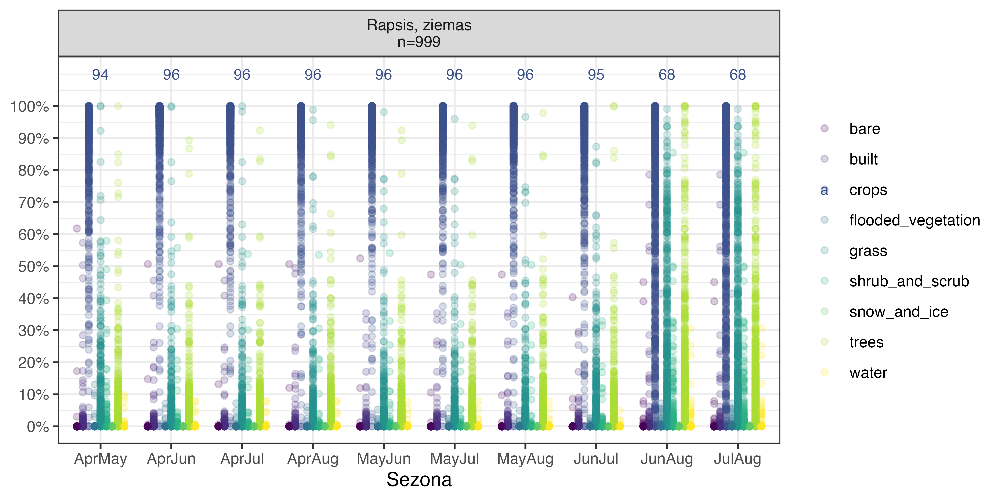
```

<br>


Komandu rindas attēla sagatavošanas reproducēšanai:

```{r, eval=FALSE}
dati=sfarrow::st_read_parquet("./Q1_kulturas.parquet")
dati=dati %>% 
  mutate(sezona=factor(periods,ordered=TRUE,
                       levels=c("AprMay","AprJun","AprJul","AprAug","MayJun",
                                "MayJul","MayAug","JunJul","JunAug","JulAug")))
ziemas_rapsis=c("212")

q12data=data.frame(dati) %>% 
  filter(PRODUCT_CODE %in% ziemas_rapsis) %>% 
  dplyr::select(PRODUCT_CODE,PRODUCT_DESCRIPTION,SHAPE.AREA,sezona,water:snow_and_ice) %>% 
  group_by(PRODUCT_CODE) %>% 
  mutate(skaits=n()/10) %>% 
  ungroup() %>% 
  mutate(nosaukums=paste0(PRODUCT_DESCRIPTION,"\n","n=",skaits)) %>% 
  pivot_longer(cols=water:snow_and_ice,names_to = "klase",values_to = "proporcija")

q12data2=q12data %>% 
  group_by(nosaukums,sezona,klase) %>% 
  summarise(vertiba=round(weighted.mean(proporcija,w=SHAPE.AREA,na.rm=TRUE)*100,0)) %>% 
  ungroup() %>% 
  filter(klase=="crops")

ggplot(q12data,aes(sezona,proporcija,col=klase))+
  facet_wrap(~nosaukums)+
  geom_point(position=position_dodge(width=0.75),alpha=0.2)+
  theme_bw()+
  theme(axis.title.y = element_blank(),
        legend.title = element_blank())+
  geom_text(data=q12data2,aes(sezona,y=1.1,label=vertiba),size=3)+
  scale_color_viridis_d()+
  scale_y_continuous(labels=scales::label_percent(),breaks=seq(0,1,by=.1))+
  labs(x="Sezona")
ggview(width=200,height=100,units="mm",dpi=600,device="png")
ggsave(filename="./pic_q12.png",width=200,height=100,units="mm",dpi=600)


```


### Q1.3: Vasarāji aramzemēs

Sekojošajā attēlā \@ref(fig:DWq13) ir ilustrēta vasarāju aramzemēs (kultūru kodi "131","111","150") saistība ar Dynamic World klasēm dažādos temporālajos griezumos. Skaitļi attēlu daļās norāda klases "crops" ar lauka platību svērto vidējo īpatsvaru. Redzams, ka zemākā atbilstība ir izmantojot tikai vasaras mēnešus.


```{r DWq13, echo=FALSE, out.width = '100%', fig.cap='Lauksaimniecības kultūru grupas "vasarāji aramzemēs" saistība ar DW klasēm.'}
knitr::include_graphics("./Atteli/ch004_q13.png")
```

<br>

Komandu rindas attēla sagatavošanas reproducēšanai:

```{r, eval=FALSE}
dati=sfarrow::st_read_parquet("./Q1_kulturas.parquet")
dati=dati %>% 
  mutate(sezona=factor(periods,ordered=TRUE,
                       levels=c("AprMay","AprJun","AprJul","AprAug","MayJun",
                                "MayJul","MayAug","JunJul","JunAug","JulAug")))
vasaraji_aramzemes=c("131","111","150")
q13data=data.frame(dati) %>% 
  filter(PRODUCT_CODE %in% vasaraji_aramzemes) %>% 
  dplyr::select(PRODUCT_CODE,PRODUCT_DESCRIPTION,SHAPE.AREA,sezona,water:snow_and_ice) %>% 
  group_by(PRODUCT_CODE) %>% 
  mutate(skaits=n()/10) %>% 
  ungroup() %>% 
  mutate(nosaukums=paste0(PRODUCT_DESCRIPTION,"\n","n=",skaits)) %>% 
  pivot_longer(cols=water:snow_and_ice,names_to = "klase",values_to = "proporcija")

q13data2=q13data %>% 
  group_by(nosaukums,sezona,klase) %>% 
  summarise(vertiba=round(weighted.mean(proporcija,w=SHAPE.AREA,na.rm=TRUE)*100,0)) %>% 
  ungroup() %>% 
  filter(klase=="crops")

ggplot(q13data,aes(sezona,proporcija,col=klase))+
  facet_wrap(~nosaukums)+
  geom_point(position=position_dodge(width=0.75),alpha=0.2)+
  theme_bw()+
  theme(axis.text.x = element_text(angle=90,vjust=0.5),
        axis.title.y = element_blank(),
        legend.title = element_blank())+
  geom_text(data=q13data2,aes(sezona,y=1.1,label=vertiba),size=3)+
  scale_color_viridis_d()+
  scale_y_continuous(labels=scales::label_percent(),breaks=seq(0,1,by=.1))+
  labs(x="Sezona")
ggview(width=300,height=100,units="mm",dpi=600,device="png")
ggsave(filename="./pic_q13.png",width=300,height=100,units="mm",dpi=600)

```


### Q1.4: Vasaras rapsis


Sekojošajā attēlā \@ref(fig:DWq14) ir ilustrēta vasaras rapša (kultūras kods "211") saistība ar Dynamic World klasēm dažādos temporālajos griezumos. Skaitļi attēlu daļās norāda klases "crops" ar lauka platību svērto vidējo īpatsvaru. Redzams, ka zemākā atbilstība ir izmantojot tikai vasaras mēnešus.


```{r DWq14, echo=FALSE, out.width = '60%', fig.cap='Lauksaimniecības kultūru grupas "vasaras rapsis" saistība ar DW klasēm.'}
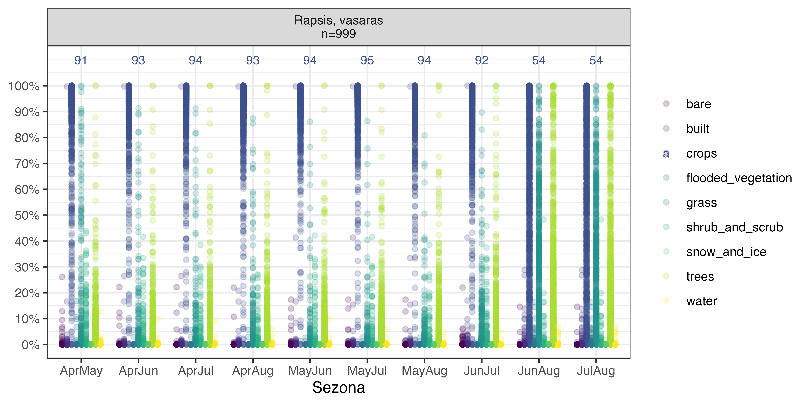
```

<br>

Komandu rindas attēla sagatavošanas reproducēšanai:

```{r, eval=FALSE}
dati=sfarrow::st_read_parquet("./Q1_kulturas.parquet")
dati=dati %>% 
  mutate(sezona=factor(periods,ordered=TRUE,
                       levels=c("AprMay","AprJun","AprJul","AprAug","MayJun",
                                "MayJul","MayAug","JunJul","JunAug","JulAug")))
vasaras_rapsis=c("211")
q14data=data.frame(dati) %>% 
  filter(PRODUCT_CODE %in% vasaras_rapsis) %>% 
  dplyr::select(PRODUCT_CODE,PRODUCT_DESCRIPTION,SHAPE.AREA,sezona,water:snow_and_ice) %>% 
  group_by(PRODUCT_CODE) %>% 
  mutate(skaits=n()/10) %>% 
  ungroup() %>% 
  mutate(nosaukums=paste0(PRODUCT_DESCRIPTION,"\n","n=",skaits)) %>% 
  pivot_longer(cols=water:snow_and_ice,names_to = "klase",values_to = "proporcija")

q14data2=q14data %>% 
  group_by(nosaukums,sezona,klase) %>% 
  summarise(vertiba=round(weighted.mean(proporcija,w=SHAPE.AREA,na.rm=TRUE)*100,0)) %>% 
  ungroup() %>% 
  filter(klase=="crops")

ggplot(q14data,aes(sezona,proporcija,col=klase))+
  facet_wrap(~nosaukums)+
  geom_point(position=position_dodge(width=0.75),alpha=0.2)+
  theme_bw()+
  theme(axis.title.y = element_blank(),
        legend.title = element_blank())+
  geom_text(data=q14data2,aes(sezona,y=1.1,label=vertiba),size=3)+
  scale_color_viridis_d()+
  scale_y_continuous(labels=scales::label_percent(),breaks=seq(0,1,by=.1))+
  labs(x="Sezona")
ggview(width=200,height=100,units="mm",dpi=600,device="png")
ggsave(filename="./pic_q14.png",width=200,height=100,units="mm",dpi=600)

```


### Q1.5: Auzas

Sekojošajā attēlā \@ref(fig:DWq15) ir ilustrēta auzu (kultūras kods "140") saistība ar Dynamic World klasēm dažādos temporālajos griezumos. Skaitļi attēlu daļās norāda klases "crops" ar lauka platību svērto vidējo īpatsvaru. Redzams, ka zemākā atbilstība ir izmantojot tikai vasaras mēnešus.


```{r DWq15, echo=FALSE, out.width = '60%', fig.cap='Lauksaimniecības kultūru grupas "auzas" saistība ar DW klasēm.'}
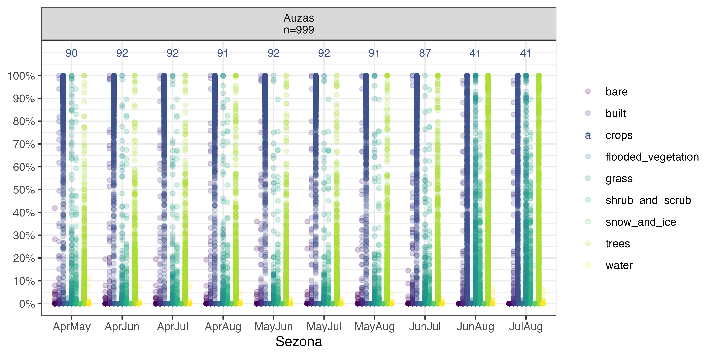
```

<br>

Komandu rindas attēla sagatavošanas reproducēšanai:

```{r, eval=FALSE}
dati=sfarrow::st_read_parquet("./Q1_kulturas.parquet")
dati=dati %>% 
  mutate(sezona=factor(periods,ordered=TRUE,
                       levels=c("AprMay","AprJun","AprJul","AprAug","MayJun",
                                "MayJul","MayAug","JunJul","JunAug","JulAug")))
auzas=c("140")
q15data=data.frame(dati) %>% 
  filter(PRODUCT_CODE %in% auzas) %>% 
  dplyr::select(PRODUCT_CODE,PRODUCT_DESCRIPTION,SHAPE.AREA,sezona,water:snow_and_ice) %>% 
  group_by(PRODUCT_CODE) %>% 
  mutate(skaits=n()/10) %>% 
  ungroup() %>% 
  mutate(nosaukums=paste0(PRODUCT_DESCRIPTION,"\n","n=",skaits)) %>% 
  pivot_longer(cols=water:snow_and_ice,names_to = "klase",values_to = "proporcija")

q15data2=q15data %>% 
  group_by(nosaukums,sezona,klase) %>% 
  summarise(vertiba=round(weighted.mean(proporcija,w=SHAPE.AREA,na.rm=TRUE)*100,0)) %>% 
  ungroup() %>% 
  filter(klase=="crops")

ggplot(q15data,aes(sezona,proporcija,col=klase))+
  facet_wrap(~nosaukums)+
  geom_point(position=position_dodge(width=0.75),alpha=0.2)+
  theme_bw()+
  theme(axis.title.y = element_blank(),
        legend.title = element_blank())+
  geom_text(data=q15data2,aes(sezona,y=1.1,label=vertiba),size=3)+
  scale_color_viridis_d()+
  scale_y_continuous(labels=scales::label_percent(),breaks=seq(0,1,by=.1))+
  labs(x="Sezona")
ggview(width=200,height=100,units="mm",dpi=600,device="png")
ggsave(filename="./pic_q15.png",width=200,height=100,units="mm",dpi=600)

```


### Q1.6: Kukurūza


Sekojošajā attēlā \@ref(fig:DWq16) ir ilustrēta kukurūzas (kultūru kodi "791","741") saistība ar Dynamic World klasēm dažādos temporālajos griezumos. Skaitļi attēlu daļās norāda klases "crops" ar lauka platību svērto vidējo īpatsvaru. Redzams, ka zemākā atbilstība ir izmantojot tikai vasaras mēnešus.


```{r DWq16, echo=FALSE, out.width = '80%', fig.cap='Lauksaimniecības kultūru grupas "kukurūza" saistība ar DW klasēm.'}
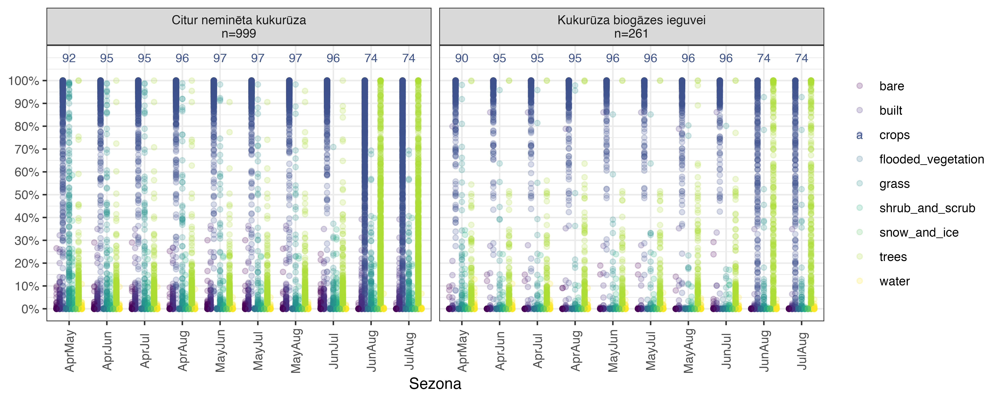
```

<br>

Komandu rindas attēla sagatavošanas reproducēšanai:

```{r, eval=FALSE}
dati=sfarrow::st_read_parquet("./Q1_kulturas.parquet")
dati=dati %>% 
  mutate(sezona=factor(periods,ordered=TRUE,
                       levels=c("AprMay","AprJun","AprJul","AprAug","MayJun",
                                "MayJul","MayAug","JunJul","JunAug","JulAug")))
kukuruza=c("791","741")
q16data=data.frame(dati) %>% 
  filter(PRODUCT_CODE %in% kukuruza) %>% 
  dplyr::select(PRODUCT_CODE,PRODUCT_DESCRIPTION,SHAPE.AREA,sezona,water:snow_and_ice) %>% 
  group_by(PRODUCT_CODE) %>% 
  mutate(skaits=n()/10) %>% 
  ungroup() %>% 
  mutate(nosaukums=paste0(PRODUCT_DESCRIPTION,"\n","n=",skaits)) %>% 
  pivot_longer(cols=water:snow_and_ice,names_to = "klase",values_to = "proporcija")

q16data2=q16data %>% 
  group_by(nosaukums,sezona,klase) %>% 
  summarise(vertiba=round(weighted.mean(proporcija,w=SHAPE.AREA,na.rm=TRUE)*100,0)) %>% 
  ungroup() %>% 
  filter(klase=="crops")

ggplot(q16data,aes(sezona,proporcija,col=klase))+
  facet_wrap(~nosaukums)+
  geom_point(position=position_dodge(width=0.75),alpha=0.2)+
  theme_bw()+
  theme(axis.text.x = element_text(angle=90,vjust=0.5),
        axis.title.y = element_blank(),
        legend.title = element_blank())+
  geom_text(data=q16data2,aes(sezona,y=1.1,label=vertiba),size=3)+
  scale_color_viridis_d()+
  scale_y_continuous(labels=scales::label_percent(),breaks=seq(0,1,by=.1))+
  labs(x="Sezona")
ggview(width=250,height=100,units="mm",dpi=600,device="png")
ggsave(filename="./pic_q16.png",width=250,height=100,units="mm",dpi=600)

```


### Q1.7: Papuves


Sekojošajā attēlā \@ref(fig:DWq17a) ir ilustrēta papuvju (kultūru kodi "610","612") saistība ar Dynamic World klasēm dažādos temporālajos griezumos. Skaitļi attēlu daļās norāda klases "crops" ar lauka platību svērto vidējo īpatsvaru. Redzams, ka zemākā atbilstība ir izmantojot tikai vasaras mēnešus. Dominējošā klase ir "crops", tomēr nereti pikseļi ir klasificēti kā "grass". Atkarībā no sezonas, par "grass" biežāk sastopama var būt klase "trees", kas, visai droši ir saistāms ar lauka konfigurāciju, kas kā perimetra-laukuma attiecība ir demonstrēts zemāk \@ref(fig:DWq17b).


```{r DWq17a, echo=FALSE, out.width = '80%', fig.cap='Lauksaimniecības kultūru grupas "papuves" saistība ar DW klasēm.'}
knitr::include_graphics("./Atteli/ch004_q17.png")
```

<br>

```{r DWq17b, echo=FALSE, out.width = '100%', fig.cap='Lauksaimniecības kultūru grupas "papuves" perimetra-laukuma attiecības saistība ar DW klasēm.'}
knitr::include_graphics("./Atteli/ch004_q17b.png")
```

<br>

Komandu rindas attēlu sagatavošanas reproducēšanai:

```{r, eval=FALSE}
dati=sfarrow::st_read_parquet("./Q1_kulturas.parquet")
dati=dati %>% 
  mutate(sezona=factor(periods,ordered=TRUE,
                       levels=c("AprMay","AprJun","AprJul","AprAug","MayJun",
                                "MayJul","MayAug","JunJul","JunAug","JulAug")))
papuve=c("610","612")

q17data=data.frame(dati) %>% 
  filter(PRODUCT_CODE %in% papuve) %>% 
  dplyr::select(PRODUCT_CODE,PRODUCT_DESCRIPTION,SHAPE.AREA,sezona,water:snow_and_ice) %>% 
  group_by(PRODUCT_CODE) %>% 
  mutate(skaits=n()/10) %>% 
  ungroup() %>% 
  mutate(nosaukums=paste0(PRODUCT_DESCRIPTION,"\n","n=",skaits)) %>% 
  pivot_longer(cols=water:snow_and_ice,names_to = "klase",values_to = "proporcija")

q17data2=q17data %>% 
  group_by(nosaukums,sezona,klase) %>% 
  summarise(vertiba=round(weighted.mean(proporcija,w=SHAPE.AREA,na.rm=TRUE)*100,0)) %>% 
  ungroup() %>% 
  filter(klase=="crops")

ggplot(q17data,aes(sezona,proporcija,col=klase))+
  facet_wrap(~nosaukums)+
  geom_point(position=position_dodge(width=0.75),alpha=0.2)+
  theme_bw()+
  theme(axis.text.x = element_text(angle=90,vjust=0.5),
        axis.title.y = element_blank(),
        legend.title = element_blank())+
  geom_text(data=q17data2,aes(sezona,y=1.1,label=vertiba),size=3)+
  scale_color_viridis_d()+
  scale_y_continuous(labels=scales::label_percent(),breaks=seq(0,1,by=.1))+
  labs(x="Sezona")
ggview(width=250,height=100,units="mm",dpi=600,device="png")
ggsave(filename="./pic_q17.png",width=250,height=100,units="mm",dpi=600)


q17data3=data.frame(dati) %>% 
  filter(PRODUCT_CODE %in% papuve) %>% 
  mutate(PAr=SHAPE.LEN/SHAPE.AREA) %>% 
  dplyr::select(PRODUCT_CODE,PRODUCT_DESCRIPTION,PAr,SHAPE.AREA,sezona,water:snow_and_ice) %>% 
  group_by(PRODUCT_CODE) %>% 
  mutate(skaits=n()/10) %>% 
  ungroup() %>% 
  mutate(nosaukums=paste0(PRODUCT_DESCRIPTION,"\n","n=",skaits)) %>% 
  pivot_longer(cols=water:snow_and_ice,names_to = "klase",values_to = "proporcija")

ggplot(q17data3,aes(PAr,proporcija,col=klase))+
  facet_wrap(~sezona,ncol=5)+
  geom_point(alpha=0.2)+
  geom_smooth()+
  theme_bw()+
  coord_cartesian(ylim=c(0,1),xlim=c(0,0.75))+
  scale_color_viridis_d()+
  scale_y_continuous(labels=scales::label_percent(),breaks=seq(0,1,by=.1))+
  theme(axis.title.y = element_blank(),
        legend.title = element_blank())+
  labs(x="Perimetra-laukuma attiecība")
ggview(width=300,height=150,units="mm",dpi=600,device="png")
ggsave(filename="./pic_q17b.png",width=300,height=150,units="mm",dpi=600)

```


### Q1.8: Ilggadīgie zālāji


Sekojošajā attēlā \@ref(fig:DWq18a) ir ilustrēta ilggadīgo zālāju (kultūru kods "710") saistība ar Dynamic World klasēm dažādos temporālajos griezumos. Skaitļi attēlu daļās norāda klases "crops" ar lauka platību svērto vidējo īpatsvaru. Redzams, ka zemākā atbilstība ir izmantojot tikai vasaras mēnešus, tomēr neatkarīgi no temporālā griezuma tā ir uzskatāma par vāju.

Viens no iespējamajiem iemesliem ir laukos un to malās esošie koki un krūmi. Lai par to pārliecinātos, veidoju saistību ar perimetra-laukuma attiecību (sekojošajā attēlā). Kā redzams \@ref(fig:DWq18b), tieši koku piesātinājums laukiem ar proporcionāli garāku malu ir iemesls misklasifikācijai. Tomēr arī šādā griezumā ir redzama sezonālā mainība - pavasara mēnešiem ir nozīme. 

```{r DWq18a, echo=FALSE, out.width = '60%', fig.cap='Lauksaimniecības kultūru grupas "ilggadīgi zālāji" saistība ar DW klasēm.'}
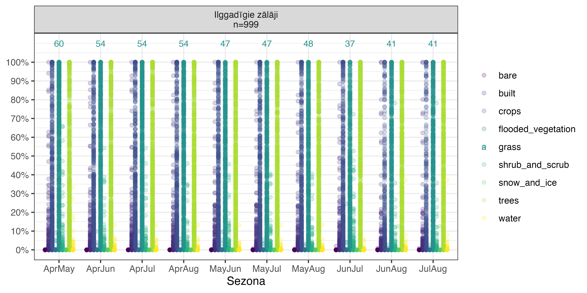
```

<br>

```{r DWq18b, echo=FALSE, out.width = '100%', fig.cap='Lauksaimniecības kultūru grupas "ilggadīgi zālāji" perimetra-laukuma attiecības saistība ar DW klasēm.'}
knitr::include_graphics("./Atteli/ch004_q18b.png")
```

<br>

Komandu rindas attēlu sagatavošanas reproducēšanai:

```{r, eval=FALSE}
dati=sfarrow::st_read_parquet("./Q1_kulturas.parquet")
dati=dati %>% 
  mutate(sezona=factor(periods,ordered=TRUE,
                       levels=c("AprMay","AprJun","AprJul","AprAug","MayJun",
                                "MayJul","MayAug","JunJul","JunAug","JulAug")))
ilggadigi_zalaji=c("710")
q18data=data.frame(dati) %>% 
  filter(PRODUCT_CODE %in% ilggadigi_zalaji) %>% 
  dplyr::select(PRODUCT_CODE,PRODUCT_DESCRIPTION,SHAPE.AREA,sezona,water:snow_and_ice) %>% 
  group_by(PRODUCT_CODE) %>% 
  mutate(skaits=n()/10) %>% 
  ungroup() %>% 
  mutate(nosaukums=paste0(PRODUCT_DESCRIPTION,"\n","n=",skaits)) %>% 
  pivot_longer(cols=water:snow_and_ice,names_to = "klase",values_to = "proporcija")

q18data2=q18data %>% 
  group_by(nosaukums,sezona,klase) %>% 
  summarise(vertiba=round(weighted.mean(proporcija,w=SHAPE.AREA,na.rm=TRUE)*100,0)) %>% 
  ungroup() %>% 
  filter(klase=="grass")

ggplot(q18data,aes(sezona,proporcija,col=klase))+
  facet_wrap(~nosaukums)+
  geom_point(position=position_dodge(width=0.75),alpha=0.2)+
  theme_bw()+
  theme(axis.title.y = element_blank(),
        legend.title = element_blank())+
  geom_text(data=q18data2,aes(sezona,y=1.1,label=vertiba),size=3)+
  scale_color_viridis_d()+
  scale_y_continuous(labels=scales::label_percent(),breaks=seq(0,1,by=.1))+
  labs(x="Sezona")
ggview(width=200,height=100,units="mm",dpi=600,device="png")
ggsave(filename="./pic_q18.png",width=200,height=100,units="mm",dpi=600)

q18data3=data.frame(dati) %>% 
  filter(PRODUCT_CODE %in% ilggadigi_zalaji) %>% 
  mutate(PAr=SHAPE.LEN/SHAPE.AREA) %>% 
  dplyr::select(PRODUCT_CODE,PRODUCT_DESCRIPTION,PAr,SHAPE.AREA,sezona,water:snow_and_ice) %>% 
  group_by(PRODUCT_CODE) %>% 
  mutate(skaits=n()/10) %>% 
  ungroup() %>% 
  mutate(nosaukums=paste0(PRODUCT_DESCRIPTION,"\n","n=",skaits)) %>% 
  pivot_longer(cols=water:snow_and_ice,names_to = "klase",values_to = "proporcija")

ggplot(q18data3,aes(PAr,proporcija,col=klase))+
  facet_wrap(~sezona,ncol=5)+
  geom_point(alpha=0.2)+
  geom_smooth()+
  theme_bw()+
  coord_cartesian(ylim=c(0,1))+
  scale_color_viridis_d()+
  scale_x_continuous(breaks=seq(0,0.2,by=0.1))+
  scale_y_continuous(labels=scales::label_percent(),breaks=seq(0,1,by=.1))+
  theme(axis.title.y = element_blank(),
        legend.title = element_blank())+
  labs(x="Perimetra-laukuma attiecība")
ggview(width=300,height=150,units="mm",dpi=600,device="png")
ggsave(filename="./pic_q18b.png",width=300,height=150,units="mm",dpi=600)

```


### Q1.9: Kultivētie zālāji


Sekojošajā attēlā \@ref(fig:DWq19) ir ilustrēta kultivēto zālāju (kultūru kodi "720","760") saistība ar Dynamic World klasēm dažādos temporālajos griezumos. Skaitļi attēlu daļās norāda klašu "crops" un "grass" ar lauka platību svērto vidējo īpatsvaru. Redzama izteikta mainība starp abām dominējošajām klasēm, kas liecina, ka ne katru galu katrs zālājs tiek ielabots aršanai līdzīgā apjomā. Šī mainība, protams, nav ērta, bet ir pamats izdalīt šo biotopu grupu atsevišķi.


```{r DWq19, echo=FALSE, out.width = '100%', fig.cap='Lauksaimniecības kultūru grupas "kultivēti zālāji" saistība ar DW klasēm.'}
knitr::include_graphics("./Atteli/ch004_q19.png")
```

<br>

Komandu rindas attēla sagatavošanas reproducēšanai:

```{r, eval=FALSE}
dati=sfarrow::st_read_parquet("./Q1_kulturas.parquet")
dati=dati %>% 
  mutate(sezona=factor(periods,ordered=TRUE,
                       levels=c("AprMay","AprJun","AprJul","AprAug","MayJun",
                                "MayJul","MayAug","JunJul","JunAug","JulAug")))
kultiveti_zalaji=c("720","760")
q19data=data.frame(dati) %>% 
  filter(PRODUCT_CODE %in% kultiveti_zalaji) %>% 
  dplyr::select(PRODUCT_CODE,PRODUCT_DESCRIPTION,SHAPE.AREA,sezona,water:snow_and_ice) %>% 
  group_by(PRODUCT_CODE) %>% 
  mutate(skaits=n()/10) %>% 
  ungroup() %>% 
  mutate(nosaukums=paste0(PRODUCT_DESCRIPTION,"\n","n=",skaits)) %>% 
  pivot_longer(cols=water:snow_and_ice,names_to = "klase",values_to = "proporcija")

q19data2=q19data %>% 
  group_by(nosaukums,sezona,klase) %>% 
  summarise(vertiba=round(weighted.mean(proporcija,w=SHAPE.AREA,na.rm=TRUE)*100,0)) %>% 
  ungroup() %>% 
  filter(klase=="grass")
q19data3=q19data %>% 
  group_by(nosaukums,sezona,klase) %>% 
  summarise(vertiba=round(weighted.mean(proporcija,w=SHAPE.AREA,na.rm=TRUE)*100,0)) %>% 
  ungroup() %>% 
  filter(klase=="crops")

ggplot(q19data,aes(sezona,proporcija,col=klase))+
  facet_wrap(~nosaukums)+
  geom_point(position=position_dodge(width=0.75),alpha=0.2)+
  theme_bw()+
  theme(axis.text.x = element_text(angle=90,vjust=0.5),
        axis.title.y = element_blank(),
        legend.title = element_blank())+
  geom_text(data=q19data2,aes(sezona,y=1.1,label=vertiba),size=3)+
  geom_text(data=q19data3,aes(sezona,y=1.05,label=vertiba),size=3)+
  scale_color_viridis_d()+
  scale_y_continuous(labels=scales::label_percent(),breaks=seq(0,1,by=.1))+
  labs(x="Sezona")
ggview(width=300,height=100,units="mm",dpi=600,device="png")
ggsave(filename="./pic_q19.png",width=300,height=100,units="mm",dpi=600)

```


### Q1.10: Agļukoki


Sekojošajā attēlā \@ref(fig:DWq110) ir ilustrēta augļukoku (kultūru kodi "911","912","932","914") saistība ar Dynamic World klasēm dažādos temporālajos griezumos. Skaitļi attēlu daļās norāda klašu "trees" un "grass" ar lauka platību svērto vidējo īpatsvaru. Redzams, ka, atkarībā no kultūras, nereti lauki ir klasificēti kā zālāji, nevis koki. No vienas puses tas ir skaidrojams ar telpu starp kokiem, bet var arī būt saistāms ar pašu augļukoku augstumu (šis vairāk tiks apskatīts pie mežaudzēm).


```{r DWq110, echo=FALSE, out.width = '100%', fig.cap='Lauksaimniecības kultūru grupas "augļukoki" saistība ar DW klasēm.'}
knitr::include_graphics("./Atteli/ch004_q110.png")
```

<br>

Komandu rindas attēla sagatavošanas reproducēšanai:

```{r, eval=FALSE}
dati=sfarrow::st_read_parquet("./Q1_kulturas.parquet")
dati=dati %>% 
  mutate(sezona=factor(periods,ordered=TRUE,
                       levels=c("AprMay","AprJun","AprJul","AprAug","MayJun",
                                "MayJul","MayAug","JunJul","JunAug","JulAug")))
auglukoki=c("911","912","932","914")
q110data=data.frame(dati) %>% 
  filter(PRODUCT_CODE %in% auglukoki) %>% 
  dplyr::select(PRODUCT_CODE,PRODUCT_DESCRIPTION,SHAPE.AREA,sezona,water:snow_and_ice) %>% 
  group_by(PRODUCT_CODE) %>% 
  mutate(skaits=n()/10) %>% 
  ungroup() %>% 
  mutate(nosaukums=paste0(PRODUCT_DESCRIPTION,"\n","n=",skaits)) %>% 
  pivot_longer(cols=water:snow_and_ice,names_to = "klase",values_to = "proporcija")

q110data2=q110data %>% 
  group_by(nosaukums,sezona,klase) %>% 
  summarise(vertiba=round(weighted.mean(proporcija,w=SHAPE.AREA,na.rm=TRUE)*100,0)) %>% 
  ungroup() %>% 
  filter(klase=="grass")

q110data3=q110data %>% 
  group_by(nosaukums,sezona,klase) %>% 
  summarise(vertiba=round(weighted.mean(proporcija,w=SHAPE.AREA,na.rm=TRUE)*100,0)) %>% 
  ungroup() %>% 
  filter(klase=="trees")

ggplot(q110data,aes(sezona,proporcija,col=klase))+
  facet_wrap(~nosaukums)+
  geom_point(position=position_dodge(width=0.75),alpha=0.2)+
  theme_bw()+
  theme(axis.text.x = element_text(angle=90,vjust=0.5),
        axis.title.y = element_blank(),
        legend.title = element_blank())+
  geom_text(data=q110data2,aes(sezona,y=1.15,label=vertiba),size=3)+
  geom_text(data=q110data3,aes(sezona,y=1.07,label=vertiba),size=3)+
  scale_color_viridis_d()+
  scale_y_continuous(labels=scales::label_percent(),breaks=seq(0,1,by=.1))+
  labs(x="Sezona")
ggview(width=300,height=150,units="mm",dpi=600,device="png")
ggsave(filename="./pic_q110.png",width=300,height=150,units="mm",dpi=600)

```


### Q1.11: Ogu-krūmi

Sekojošajā attēlā \@ref(fig:DWq111) ir ilustrēta ogu-krūmu (kultūru kodi "921","922","933","927","928","929") saistība ar Dynamic World klasēm dažādos temporālajos griezumos. Skaitļi attēlu daļās norāda klašu "crops", "grass" un "trees" ar lauka platību svērto vidējo īpatsvaru. Redzams, ka, atkarībā no kultūras, nereti lauki ir klasificēti kā zālāji, vai pat aramzemes, nevis koki vai krūmi. No vienas puses tas ir skaidrojams ar telpu starp kultūras augiem, bet var arī būt saistāms ar pašu augu augstumu (šis vairāk tiks apskatīts pie mežaudzēm). Noteikti ir pamats to izdalīt atsevišķā klasē no aramzemēm un zālājiem, domājot par sugu izplatības modelēšanu.

```{r DWq111, echo=FALSE, out.width = '100%', fig.cap='Lauksaimniecības kultūru grupas "ogu-krūmi" saistība ar DW klasēm.'}
knitr::include_graphics("./Atteli/ch004_q111.png")
```

<br>

Komandu rindas attēla sagatavošanas reproducēšanai:

```{r, eval=FALSE}
dati=sfarrow::st_read_parquet("./Q1_kulturas.parquet")
dati=dati %>% 
  mutate(sezona=factor(periods,ordered=TRUE,
                       levels=c("AprMay","AprJun","AprJul","AprAug","MayJun",
                                "MayJul","MayAug","JunJul","JunAug","JulAug")))
ogukrumi=c("921","922","933","927","928","929")
q111data=data.frame(dati) %>% 
  filter(PRODUCT_CODE %in% ogukrumi) %>% 
  dplyr::select(PRODUCT_CODE,PRODUCT_DESCRIPTION,SHAPE.AREA,sezona,water:snow_and_ice) %>% 
  group_by(PRODUCT_CODE) %>% 
  mutate(skaits=n()/10) %>% 
  ungroup() %>% 
  mutate(nosaukums=paste0(PRODUCT_DESCRIPTION,"\n","n=",skaits)) %>% 
  pivot_longer(cols=water:snow_and_ice,names_to = "klase",values_to = "proporcija")

q111data2=q111data %>% 
  group_by(nosaukums,sezona,klase) %>% 
  summarise(vertiba=round(weighted.mean(proporcija,w=SHAPE.AREA,na.rm=TRUE)*100,0)) %>% 
  ungroup() %>% 
  filter(klase=="grass")

q111data3=q111data %>% 
  group_by(nosaukums,sezona,klase) %>% 
  summarise(vertiba=round(weighted.mean(proporcija,w=SHAPE.AREA,na.rm=TRUE)*100,0)) %>% 
  ungroup() %>% 
  filter(klase=="trees")

q111data4=q111data %>% 
  group_by(nosaukums,sezona,klase) %>% 
  summarise(vertiba=round(weighted.mean(proporcija,w=SHAPE.AREA,na.rm=TRUE)*100,0)) %>% 
  ungroup() %>% 
  filter(klase=="crops")

ggplot(q111data,aes(sezona,proporcija,col=klase))+
  facet_wrap(~nosaukums)+
  geom_point(position=position_dodge(width=0.75),alpha=0.2)+
  theme_bw()+
  theme(axis.text.x = element_text(angle=90,vjust=0.5),
        axis.title.y = element_blank(),
        legend.title = element_blank())+
  geom_text(data=q111data2,aes(sezona,y=1.15,label=vertiba),size=3)+
  geom_text(data=q111data3,aes(sezona,y=1.07,label=vertiba),size=3)+
  geom_text(data=q111data4,aes(sezona,y=1.22,label=vertiba),size=3)+
  scale_color_viridis_d()+
  scale_y_continuous(labels=scales::label_percent(),breaks=seq(0,1,by=.1))+
  labs(x="Sezona")
ggview(width=300,height=150,units="mm",dpi=600,device="png")
ggsave(filename="./pic_q111.png",width=300,height=150,units="mm",dpi=600)

```


### Q1.12: Zemās ogas

Sekojošajā attēlā \@ref(fig:DWq112) ir ilustrēta zema auguma ogu (kultūru kodi "924","934") saistība ar Dynamic World klasēm dažādos temporālajos griezumos. Skaitļi attēlu daļās norāda klašu "crops", "grass", "shrub_and_scrub" un "trees" ar lauka platību svērto vidējo īpatsvaru. Šī klase ir samērā reti sastopama un tās ietvaros ir izteikta heterogenitāte.

```{r DWq112, echo=FALSE, out.width = '100%', fig.cap='Lauksaimniecības kultūru grupas "zemās ogas" saistība ar DW klasēm.'}
knitr::include_graphics("./Atteli/ch004_q112.png")
```

<br>

Komandu rindas attēla sagatavošanas reproducēšanai:

```{r, eval=FALSE}
dati=sfarrow::st_read_parquet("./Q1_kulturas.parquet")
dati=dati %>% 
  mutate(sezona=factor(periods,ordered=TRUE,
                       levels=c("AprMay","AprJun","AprJul","AprAug","MayJun",
                                "MayJul","MayAug","JunJul","JunAug","JulAug")))
zemas_ogas=c("924","934")
q112data=data.frame(dati) %>% 
  filter(PRODUCT_CODE %in% zemas_ogas) %>% 
  dplyr::select(PRODUCT_CODE,PRODUCT_DESCRIPTION,SHAPE.AREA,sezona,water:snow_and_ice) %>% 
  group_by(PRODUCT_CODE) %>% 
  mutate(skaits=n()/10) %>% 
  ungroup() %>% 
  mutate(nosaukums=paste0(PRODUCT_DESCRIPTION,"\n","n=",skaits)) %>% 
  pivot_longer(cols=water:snow_and_ice,names_to = "klase",values_to = "proporcija")

q112data2=q112data %>% 
  group_by(nosaukums,sezona,klase) %>% 
  summarise(vertiba=round(weighted.mean(proporcija,w=SHAPE.AREA,na.rm=TRUE)*100,0)) %>% 
  ungroup() %>% 
  filter(klase=="grass")

q112data3=q112data %>% 
  group_by(nosaukums,sezona,klase) %>% 
  summarise(vertiba=round(weighted.mean(proporcija,w=SHAPE.AREA,na.rm=TRUE)*100,0)) %>% 
  ungroup() %>% 
  filter(klase=="shrub_and_scrub")

q112data4=q112data %>% 
  group_by(nosaukums,sezona,klase) %>% 
  summarise(vertiba=round(weighted.mean(proporcija,w=SHAPE.AREA,na.rm=TRUE)*100,0)) %>% 
  ungroup() %>% 
  filter(klase=="crops")

q112data5=q112data %>% 
  group_by(nosaukums,sezona,klase) %>% 
  summarise(vertiba=round(weighted.mean(proporcija,w=SHAPE.AREA,na.rm=TRUE)*100,0)) %>% 
  ungroup() %>% 
  filter(klase=="trees")

ggplot(q112data,aes(sezona,proporcija,col=klase))+
  facet_wrap(~nosaukums)+
  geom_point(position=position_dodge(width=0.75),alpha=0.2)+
  theme_bw()+
  theme(axis.text.x = element_text(angle=90,vjust=0.5),
        axis.title.y = element_blank(),
        legend.title = element_blank())+
  geom_text(data=q112data3,aes(sezona,y=1.15,label=vertiba),size=3)+
  geom_text(data=q112data5,aes(sezona,y=1.07,label=vertiba),size=3)+
  geom_text(data=q112data2,aes(sezona,y=1.23,label=vertiba),size=3)+
  geom_text(data=q112data4,aes(sezona,y=1.30,label=vertiba),size=3)+
  scale_color_viridis_d()+
  scale_y_continuous(labels=scales::label_percent(),breaks=seq(0,1,by=.1))+
  labs(x="Sezona")
ggview(width=250,height=100,units="mm",dpi=600,device="png")
ggsave(filename="./pic_q112.png",width=250,height=100,units="mm",dpi=600)

```


### Q1.13: Bezatbalsta platība

Sekojošajā attēlā \@ref(fig:DWq113) ir ilustrēta lauku blokos iekļauto platību, par kurām netiek izmaksāts atbalsts (kultūru kodi "620","792") saistība ar Dynamic World klasēm dažādos temporālajos griezumos. Skaitļi attēlu daļās norāda klašu "crops", "grass", "shrub_and_scrub" un "trees" ar lauka platību svērto vidējo īpatsvaru. Šī klase ir samērā reti sastopama un tās ietvaros ir izteikta heterogenitāte.

```{r DWq113, echo=FALSE, out.width = '100%', fig.cap='Lauksaimniecības kultūru grupas "bezatbalsta platības" saistība ar DW klasēm.'}
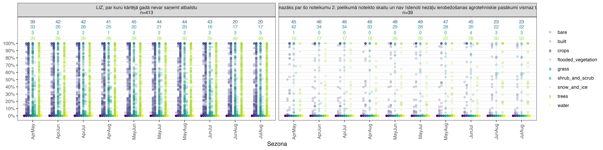
```

<br>

Komandu rindas attēla sagatavošanas reproducēšanai:

```{r, eval=FALSE}
dati=sfarrow::st_read_parquet("./Q1_kulturas.parquet")
dati=dati %>% 
  mutate(sezona=factor(periods,ordered=TRUE,
                       levels=c("AprMay","AprJun","AprJul","AprAug","MayJun",
                                "MayJul","MayAug","JunJul","JunAug","JulAug")))
bezatbalsta=c("620","792")
q113data=data.frame(dati) %>% 
  filter(PRODUCT_CODE %in% bezatbalsta) %>% 
  dplyr::select(PRODUCT_CODE,PRODUCT_DESCRIPTION,SHAPE.AREA,sezona,water:snow_and_ice) %>% 
  group_by(PRODUCT_CODE) %>% 
  mutate(skaits=n()/10) %>% 
  ungroup() %>% 
  mutate(nosaukums=paste0(PRODUCT_DESCRIPTION,"\n","n=",skaits)) %>% 
  pivot_longer(cols=water:snow_and_ice,names_to = "klase",values_to = "proporcija")

q113data2=q113data %>% 
  group_by(nosaukums,sezona,klase) %>% 
  summarise(vertiba=round(weighted.mean(proporcija,w=SHAPE.AREA,na.rm=TRUE)*100,0)) %>% 
  ungroup() %>% 
  filter(klase=="grass")

q113data3=q113data %>% 
  group_by(nosaukums,sezona,klase) %>% 
  summarise(vertiba=round(weighted.mean(proporcija,w=SHAPE.AREA,na.rm=TRUE)*100,0)) %>% 
  ungroup() %>% 
  filter(klase=="shrub_and_scrub")

q113data4=q113data %>% 
  group_by(nosaukums,sezona,klase) %>% 
  summarise(vertiba=round(weighted.mean(proporcija,w=SHAPE.AREA,na.rm=TRUE)*100,0)) %>% 
  ungroup() %>% 
  filter(klase=="crops")

q113data5=q113data %>% 
  group_by(nosaukums,sezona,klase) %>% 
  summarise(vertiba=round(weighted.mean(proporcija,w=SHAPE.AREA,na.rm=TRUE)*100,0)) %>% 
  ungroup() %>% 
  filter(klase=="trees")

ggplot(q113data,aes(sezona,proporcija,col=klase))+
  facet_wrap(~nosaukums)+
  geom_point(position=position_dodge(width=0.75),alpha=0.2)+
  theme_bw()+
  theme(axis.text.x = element_text(angle=90,vjust=0.5),
        axis.title.y = element_blank(),
        legend.title = element_blank())+
  geom_text(data=q113data3,aes(sezona,y=1.15,label=vertiba),size=3)+
  geom_text(data=q113data5,aes(sezona,y=1.07,label=vertiba),size=3)+
  geom_text(data=q113data2,aes(sezona,y=1.23,label=vertiba),size=3)+
  geom_text(data=q113data4,aes(sezona,y=1.30,label=vertiba),size=3)+
  scale_color_viridis_d()+
  scale_y_continuous(labels=scales::label_percent(),breaks=seq(0,1,by=.1))+
  labs(x="Sezona")
ggview(width=400,height=100,units="mm",dpi=600,device="png")
ggsave(filename="./pic_q113.png",width=400,height=100,units="mm",dpi=600)

```


### Q1.14: Vagu un rušināmkultūras

Sekojošajā attēlā \@ref(fig:DWq114) ir ilustrēta rušināmkultūru (kultūru kodi "821","825", "843", "844") saistība ar Dynamic World klasēm dažādos temporālajos griezumos. Skaitļi attēlu daļās norāda klašu "crops", "grass" un "trees" ar lauka platību svērto vidējo īpatsvaru. Šīs klases piemēri samērā stabili klasificējas kā aramzemes.

```{r DWq114, echo=FALSE, out.width = '100%', fig.cap='Lauksaimniecības kultūru grupas "vagu un rušināmkultūras" saistība ar DW klasēm.'}
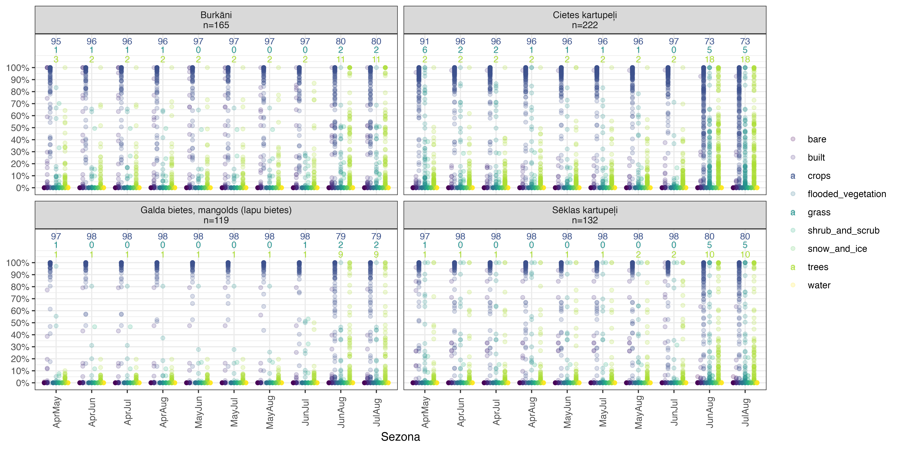
```

<br>

Komandu rindas attēla sagatavošanas reproducēšanai:

```{r, eval=FALSE}
dati=sfarrow::st_read_parquet("./Q1_kulturas.parquet")
dati=dati %>% 
  mutate(sezona=factor(periods,ordered=TRUE,
                       levels=c("AprMay","AprJun","AprJul","AprAug","MayJun",
                                "MayJul","MayAug","JunJul","JunAug","JulAug")))
rusinamkulturas=c("821","825", "843", "844")
q114data=data.frame(dati) %>% 
  filter(PRODUCT_CODE %in% rusinamkulturas) %>% 
  dplyr::select(PRODUCT_CODE,PRODUCT_DESCRIPTION,SHAPE.AREA,sezona,water:snow_and_ice) %>% 
  group_by(PRODUCT_CODE) %>% 
  mutate(skaits=n()/10) %>% 
  ungroup() %>% 
  mutate(nosaukums=paste0(PRODUCT_DESCRIPTION,"\n","n=",skaits)) %>% 
  pivot_longer(cols=water:snow_and_ice,names_to = "klase",values_to = "proporcija")

q114data2=q114data %>% 
  group_by(nosaukums,sezona,klase) %>% 
  summarise(vertiba=round(weighted.mean(proporcija,w=SHAPE.AREA,na.rm=TRUE)*100,0)) %>% 
  ungroup() %>% 
  filter(klase=="grass")

q114data3=q114data %>% 
  group_by(nosaukums,sezona,klase) %>% 
  summarise(vertiba=round(weighted.mean(proporcija,w=SHAPE.AREA,na.rm=TRUE)*100,0)) %>% 
  ungroup() %>% 
  filter(klase=="trees")

q114data4=q114data %>% 
  group_by(nosaukums,sezona,klase) %>% 
  summarise(vertiba=round(weighted.mean(proporcija,w=SHAPE.AREA,na.rm=TRUE)*100,0)) %>% 
  ungroup() %>% 
  filter(klase=="crops")

ggplot(q114data,aes(sezona,proporcija,col=klase))+
  facet_wrap(~nosaukums)+
  geom_point(position=position_dodge(width=0.75),alpha=0.2)+
  theme_bw()+
  theme(axis.text.x = element_text(angle=90,vjust=0.5),
        axis.title.y = element_blank(),
        legend.title = element_blank())+
  geom_text(data=q114data2,aes(sezona,y=1.15,label=vertiba),size=3)+
  geom_text(data=q114data3,aes(sezona,y=1.07,label=vertiba),size=3)+
  geom_text(data=q114data4,aes(sezona,y=1.22,label=vertiba),size=3)+
  scale_color_viridis_d()+
  scale_y_continuous(labels=scales::label_percent(),breaks=seq(0,1,by=.1))+
  labs(x="Sezona")
ggview(width=300,height=150,units="mm",dpi=600,device="png")
ggsave(filename="./pic_q114.png",width=300,height=150,units="mm",dpi=600)

```


### Q1.15: Īscirtmeta atvasāji un enerģijas kultūras

Sekojošajā attēlā \@ref(fig:DWq115) ir ilustrēta īscirtmeta atvasāju un enerģijas kultūru (kultūru kodi "644", "645", "646", "641", "642") saistība ar Dynamic World klasēm dažādos temporālajos griezumos. Skaitļi attēlu daļās norāda klašu "crops", "grass" un "trees" ar lauka platību svērto vidējo īpatsvaru. Šīs klases piemēri ir visai heterogēni. Miežabrālis ir lakstaugs, tādēļ skaidra ir samērā izteiktā zālāju klases dominance, tomēr neatkarīgi no sezonas, plaša pārstāvniecība ir arī citām klasēm, kas apgrūtina tā stratificēšanu. Līdzīgi ar kokaugiem, tomēr dominē atbilstošā koku klase, kur pārējās, visticamāk, ir saistītas ar kultūras vecumu, kas tīri teorētiski būtu pieņemami no sugu izplatības modelēšanas viedokļa.

```{r DWq115, echo=FALSE, out.width = '100%', fig.cap='Lauksaimniecības kultūru grupas "īscirtmeta atvasāji un enerģijas kultūras" saistība ar DW klasēm.'}
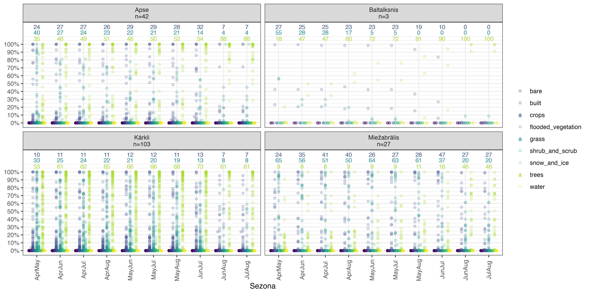
```

<br>

Komandu rindas attēla sagatavošanas reproducēšanai:

```{r, eval=FALSE}
dati=sfarrow::st_read_parquet("./Q1_kulturas.parquet")
dati=dati %>% 
  mutate(sezona=factor(periods,ordered=TRUE,
                       levels=c("AprMay","AprJun","AprJul","AprAug","MayJun",
                                "MayJul","MayAug","JunJul","JunAug","JulAug")))
atvasaji_energy=c("644", "645", "646", "641", "642")
q115data=data.frame(dati) %>% 
  filter(PRODUCT_CODE %in% atvasaji_energy) %>% 
  dplyr::select(PRODUCT_CODE,PRODUCT_DESCRIPTION,SHAPE.AREA,sezona,water:snow_and_ice) %>% 
  group_by(PRODUCT_CODE) %>% 
  mutate(skaits=n()/10) %>% 
  ungroup() %>% 
  mutate(nosaukums=paste0(PRODUCT_DESCRIPTION,"\n","n=",skaits)) %>% 
  pivot_longer(cols=water:snow_and_ice,names_to = "klase",values_to = "proporcija")

q115data2=q115data %>% 
  group_by(nosaukums,sezona,klase) %>% 
  summarise(vertiba=round(weighted.mean(proporcija,w=SHAPE.AREA,na.rm=TRUE)*100,0)) %>% 
  ungroup() %>% 
  filter(klase=="grass")

q115data3=q115data %>% 
  group_by(nosaukums,sezona,klase) %>% 
  summarise(vertiba=round(weighted.mean(proporcija,w=SHAPE.AREA,na.rm=TRUE)*100,0)) %>% 
  ungroup() %>% 
  filter(klase=="trees")

q115data4=q115data %>% 
  group_by(nosaukums,sezona,klase) %>% 
  summarise(vertiba=round(weighted.mean(proporcija,w=SHAPE.AREA,na.rm=TRUE)*100,0)) %>% 
  ungroup() %>% 
  filter(klase=="crops")

ggplot(q115data,aes(sezona,proporcija,col=klase))+
  facet_wrap(~nosaukums)+
  geom_point(position=position_dodge(width=0.75),alpha=0.2)+
  theme_bw()+
  theme(axis.text.x = element_text(angle=90,vjust=0.5),
        axis.title.y = element_blank(),
        legend.title = element_blank())+
  geom_text(data=q115data2,aes(sezona,y=1.15,label=vertiba),size=3)+
  geom_text(data=q115data3,aes(sezona,y=1.07,label=vertiba),size=3)+
  geom_text(data=q115data4,aes(sezona,y=1.22,label=vertiba),size=3)+
  scale_color_viridis_d()+
  scale_y_continuous(labels=scales::label_percent(),breaks=seq(0,1,by=.1))+
  labs(x="Sezona")
ggview(width=300,height=150,units="mm",dpi=600,device="png")
ggsave(filename="./pic_q115.png",width=300,height=150,units="mm",dpi=600)

```


### Q1: LAD kultūru stratificēšanai

Ainavas aprakstu veidošanā sugu izplatības modelēšanai ir jācenšas interpretēt to kā sugas uztver vidi un to kombinēt ar pašas vides aprakstiem (datubāzu informāciju), lai izveidotu atbilstošas pazīmes. Attiecībā uz lauksaimniecībā izmantojamām zemēm, mūsu plāns ir veidot sekojošas grupas (smalkākais dalījums, kuru pēc nepieciešamības apvienot):

- aramzemes (labība-vasarāji);

- aramzemes (labība-ziemāji);

- aramzemes (vagu un rušināmkultūras);

- aramzemes (vasaras rapsis un rispsis, kukurūzas, zirņi un pupas, soja, kaņepes);

- aramzemes (ziemas rapsis un ripsis);

- aramzemes (citur neiekļautās);

- augļudārzi;

- krūmveida ilggadīgie stādījumi;

- papuves;

- zālāji (ilggadīgie);

- zālāji (kultivētie);

- zālāji (ārpus lauku blokiem un bezatbalsta platības).

Lai gan šīs klases daļēji atbilst LAD grupām, ir atšķirības un ne vienmēr ir viennozīmīgi skaidrs, kurā grupā konkrētās kultūras iekļaut. Tādēļ veicu principiālo komponentu analīzi (PCA) un K-vidējo (k=12) klāsteranalīzi, lai apskatītu sākotnējo dalījumu un veiktu nepieciešamās korekcijas.

Grupēšanās izpētei, izmantoju (1) Aprīļa-Augusta kultūras kodu vidējās vērtības katrā no Dynamic World klasēm un (2) katras Dynamic World klases ik divu mēnešu ("AprMay","MayJun","JunJul","JulAug") vidējo aritmētisko agregāciju vienotā standartnovirzē kā ievades matricu PCA analīzē. PCA pirmā ass izskaidro 75.5% un otrā ass - 8.4% no kopējās mainības. Kā sekojošajā attēlā \@ref(fig:DWq1klasteri) redzams, starp sākotnēji izdalītajām grupām ir plaša pārklāšanās, jo sevišķi pirmās ass kreisajā malā. Lai gan K-vidējo klāsteranalīze spēj atrast grupas, to apvienošana klāsteranalīzes rezultātos nozīmētu ekoloģiskās jēgas zaudēšanu. Savukārt sugu bioloģijas un ekoloģijas zināšanās un izpratnē par kultūru apsaimniekošanu un veģetācijas attīstības gaitu balstīto grupu sadalīšana smalkākās, radītu nopietnus izaicinājumus sugu izplatības modelēšanā EGV sastopamības dēļ. Tomēr šis vingrinājums arī skaidri uzrādīja atsevišķus kutūru kodus, kuri krasi atšķīrās no pārējām kultūrām savā grupā, tādēļ tie ir pārklasificēti:

- kultūru kodi 924, 934 un 950 ievietoti pie augļudārziem;

- kultūru kodi 878, 930 un 940 ievietoti pie kultivētajiem zālājiem.

Šis vingrinājums demonstrē, ka, ja nepieciešams izdalīt lauksaimniecības kultūras ekoloģisko atšķirību dēļ, DW nav sevišķi izpalīdzīgs. Protams, eksistē arī citi risinājumi, kas ir sevišķi uzmanīgi pret biežākajām lauksaimniecības kultūrām (un to klasēm), tomēr arī tie neveic tādu dalījumu kā šajās analīzēs ir paredzēts. Tādēļ no LAD datubāzes izmantošanas izvairīties nav iespējams.

Šobrīd šķiet, ka Dynamic World varētu sniegt atbalstu platību, kas nav lauku blokos (vai Meža Valsts reģistrā) grupēšanai plašās klasēs, bet, lai par to pārliecinātos, ir jāturpina izpēte.


```{r DWq1klasteri, echo=FALSE, out.width = '100%', fig.cap='PCA rezultāti DW klašu sastopamībai sugu izplatības modelēšanai paredzētajā lauku kultūru dalījumā.'}
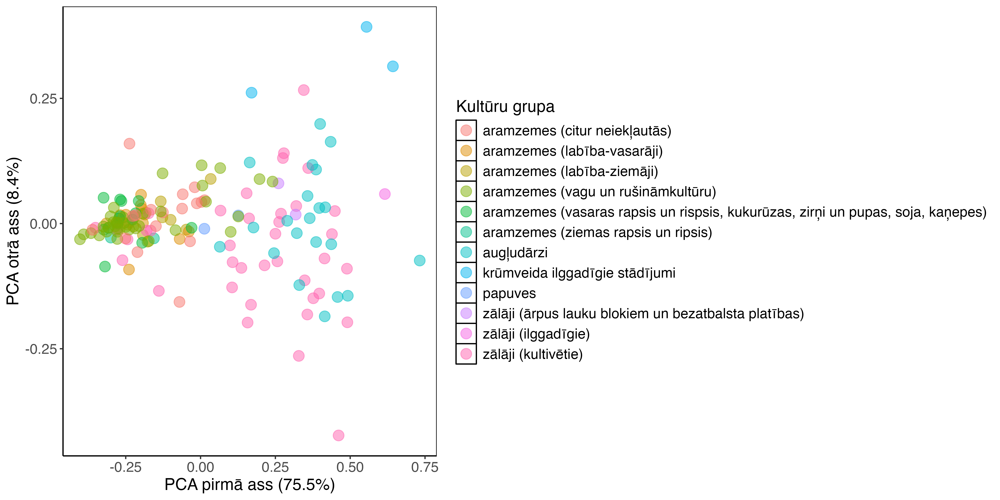
```

<br>

Komandu rindas attēla sagatavošanas un veiktās analīzes reproducēšanai (papildus fails - [sagatavotais un pēc klāsteranalīzes koriģētais kultūru grupējums](./Papilddati/KulturuKodi_2024.xlsx)):

```{r, eval=FALSE}
dati=sfarrow::st_read_parquet("./Q1_kulturas.parquet")
dati=dati %>% 
  mutate(sezona=factor(periods,ordered=TRUE,
                       levels=c("AprMay","AprJun","AprJul","AprAug","MayJun",
                                "MayJul","MayAug","JunJul","JunAug","JulAug")))
kulturam=read_excel("./KulturuKodi_2024.xlsx")
kulturam$kods=as.character(kulturam$kods)
dati_means=data.frame(dati) %>% 
  select(PRODUCT_CODE,sezona,water:snow_and_ice) %>% 
  filter(sezona %in% c("AprAug")) %>% # izvēlos vienu - garāko sezonu
  group_by(PRODUCT_CODE) %>% 
  summarise(across(water:snow_and_ice,mean, .names="mean_{col}")) %>% 
  ungroup()
dati_sds=data.frame(dati) %>% 
  select(PRODUCT_CODE,sezona,water:snow_and_ice) %>% 
  filter(sezona %in% c("AprMay","MayJun","JunJul","JulAug")) %>% 
  group_by(PRODUCT_CODE,sezona) %>% 
  summarise_if(is.numeric,mean) %>% 
  group_by(PRODUCT_CODE) %>% 
  summarise(across(water:snow_and_ice,sd, .names="sd_{col}")) %>% 
  ungroup()
dati2=dati_means %>% 
  left_join(dati_sds,by="PRODUCT_CODE") %>% 
  left_join(kulturam,by=c("PRODUCT_CODE"="kods"))

matrica=dati2 %>% 
  select(mean_water:sd_snow_and_ice)

klasteri <- kmeans(matrica, centers = 12, nstart = 160/12, iter.max = 999)
rez_pca = princomp(matrica)
summary(rez_pca)
rezultati = data.frame(rez_pca$scores,
                       klasteris=klasteri$cluster,
                       SDMgrupa=dati2$SDM_grupa_sakums,
                       kods=dati2$PRODUCT_CODE)

ggplot(rezultati,aes(Comp.1,Comp.2,col=SDMgrupa,label=kods))+
  geom_point(alpha=0.5,size=4)+
  theme_classic()+
  theme(panel.background = element_rect(color="black"))+
  labs(x="PCA pirmā ass (75.5%)",y="PCA otrā ass (8.4%)",col="Kultūru grupa")+
  theme(axis.title = element_text(size=14),
        axis.text=element_text(size=12),
        legend.title = element_text(size=14),
        legend.text=element_text(size=12))
ggview(width=300,height=150,units="mm",dpi=600,device="png")
ggsave(filename="./pic_q1klasteri.png",
       width=300,height=150,units="mm",dpi=600)

```


## Q2: Mežaudzes augstums sugu grupās

Lai labāk saprastu potenciālās atšķirības saistībā ar sezonalitāti, pārbaudi veicām dažādām koku sugām (un to grupām) atsevišķi:

- priedes - tīraudzes;

- egles - tīraudzes;

- apses - tīraudzes;

- bērzi - tīraudzes;

- melnalksnis - tīraudzes;

- platlapji - audzes, kurās platlapju krājas koeficientu summa ir >=8;

- citi - pārējās mežaudzes;


Katrā no šīm sugu-grupām veicām nogabalu izlozi katrā vecumgrupā (jaunaudzes, vidēja vecuma audzes, biestaudzes, pieaugušas audzes, pāraugušas audzes) pilnā izlases apjomā, neatkarīgi no apsaimniekošanas vēstures. Tas tad arī veido kokaudzes augstuma gradientu (jaunaudzes, vidēja vecuma un briestaudzes) un ļauj labāk arī saprast veco galu, kurā var būt notikuši jau dažādi dabiskie procesi (pāraugušās audzes).

Izmantojām 2023. gada DW sezonālos slāņus. Lai gan primārā interese ir par to no kāda augstuma mežaudzes ir klasificētas kā "trees", sākumā izmantojām visas DW klases. Kopumā ir novērojama (\@ref(fig:DWq21) att.) augsta Dynamic World klases 'trees' sastopamība. Otrā biežākā klase ir 'grass', izplatīta jaunaudzēs, savukārt jaunaudzēs sagaidāmā 'shrub_and_scrub' ir samērā reti sastopama, tomēr arī jaunaudzēs. Vājākā 'trees' pārstāvniecība ir platlapju mežaudzēs. Rodas iespaids, ka labākā atbilstība ir tikai vasaras sezonā, kas ir pretēji lauksaimniecības zemju analīzē novērotajam. Tādēļ turpinu izpēti saistībā ar kokaudzes augstumu.

Detalizētāka analīze liecina, ka vasaras mēneši, tomēr nav optimālākie, jo sevišķi platlapju un bērzu audzēs, kur augstākajās uzrādās ievērojams 'trees' ar platību svērtā īpatsvara samazinājums (\@ref(fig:DWq22trees) att.). Arī citu koku sugu audzēs jūlija-augusta sezonā ir zemākā atbilstība sagaidāmajai vērtībai.

Mežaudzes virs 10 m augstuma pārējās sezonās ir gandrīz perfekti klasificētas kā 'trees'. Vidējās vērtības pārsniedz 50% jau no zemākajām audzēs (0.1 m) un kopš apmēram 5 m augstuma tās ir vismaz 80% platības klasificētas kā 'trees'. Biežāk sastopamā sekojošā klase ir 'grass', kas ir loģiski saistāms ar zemiem un relatīvi reti izvietotiem kokiem, kas ieauguši zālē. Tomēr tas arī nozīmē, ka aizaugoši zālāji, kas bagāti ar koku atvasēm līdzīgiem augiem bieži būs klasificēti kā 'trees'.

```{r DWq21, echo=FALSE, out.width = '100%', fig.cap='DW klašu sastopamība meža nogabalos ar atšķirīgām valdošajām koku sugu grupām.'}
knitr::include_graphics("./Atteli/ch004_q21.png")
```

<br>

```{r DWq22trees, echo=FALSE, out.width = '100%', fig.cap='Ar platību svērtā DW klases "koki" sastapšanas varbūtība dažādās koku sugu grupās, atkarībā no kokaudzes augstuma.'}
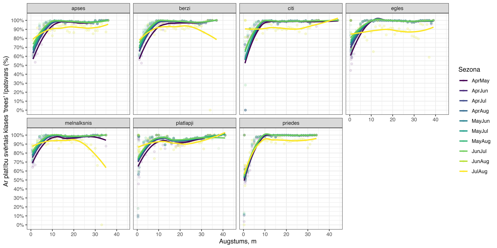
```

<br>

Komandu rindas attēlu sagatavošanas un veiktās analīzes reproducēšanai (tiek izmantoti [Meža Valsts reģistrs](#Chapter3.1.1) dati):


```{r, eval=FALSE}
# libs
if(!require(terra)) {install.packages("terra"); require(terra)}
if(!require(tidyverse)) {install.packages("tidyverse"); require(tidyverse)}
if(!require(arrow)) {install.packages("arrow"); require(arrow)}
if(!require(sf)) {install.packages("sf"); require(sf)}
if(!require(sfarrow)) {install.packages("sfarrow"); require(sfarrow)}
if(!require(exactextractr)) {install.packages("exactextractr"); require(exactextractr)}
if(!require(ggview)) {install.packages("ggview"); require(ggview)}
if(!require(readxl)) {install.packages("readxl"); require(readxl)}
if(!require(ggrepel)) {install.packages("ggrepel"); require(ggrepel)}

# meža dati
MVR <- st_read_parquet("./nogabali_2024janv.parquet")

priedes=c("1","14","22")
egles=c("3","13","15","23")
apses=c("8","19","68")
berzi=c("4")
melnalksni=c("6")
platlapji=c("10","11","12","16","17","18","24","25","26","27","28","29","61",
            "62","63","64","65","66","67","69")
citi=c("9","20","21","32","35","50")

mvr=MVR %>% 
  filter(vgr>0&vgr<=5) %>% 
  mutate(priezu_kk=if_else(s10 %in% priedes,k10,0)+if_else(s11 %in% priedes,k11,0)+
           if_else(s12 %in% priedes,k12,0)+if_else(s13 %in% priedes,k13,0)+
           if_else(s14 %in% priedes,k14,0),
         eglu_kk=if_else(s10 %in% egles,k10,0)+if_else(s11 %in% egles,k11,0)+
           if_else(s12 %in% egles,k12,0)+if_else(s13 %in% egles,k13,0)+
           if_else(s14 %in% egles,k14,0),
         apsu_kk=if_else(s10 %in% apses,k10,0)+if_else(s11 %in% apses,k11,0)+
           if_else(s12 %in% apses,k12,0)+if_else(s13 %in% apses,k13,0)+
           if_else(s14 %in% apses,k14,0),
         berzu_kk=if_else(s10 %in% berzi,k10,0)+if_else(s11 %in% berzi,k11,0)+
           if_else(s12 %in% berzi,k12,0)+if_else(s13 %in% berzi,k13,0)+
           if_else(s14 %in% berzi,k14,0),
         melnalksna_kk=if_else(s10 %in% melnalksni,k10,0)+
           if_else(s11 %in% melnalksni,k11,0)+if_else(s12 %in% melnalksni,k12,0)+
           if_else(s13 %in% melnalksni,k13,0)+if_else(s14 %in% melnalksni,k14,0),
         platlapju_kk=if_else(s10 %in% platlapji,k10,0)+
           if_else(s11 %in% platlapji,k11,0)+if_else(s12 %in% platlapji,k12,0)+
           if_else(s13 %in% platlapji,k13,0)+if_else(s14 %in% platlapji,k14,0),
         citu_kk=if_else(s10 %in% citi,k10,0)+if_else(s11 %in% citi,k11,0)+
           if_else(s12 %in% citi,k12,0)+if_else(s13 %in% citi,k13,0)+
           if_else(s14 %in% citi,k14,0)) %>% 
  mutate(sugai=if_else(priezu_kk==10,"priedes",
                       if_else(eglu_kk==10,"egles",
                               if_else(apsu_kk==10,"apses",
                                       if_else(berzu_kk==10,"berzi",
                                               if_else(melnalksna_kk==10,"melnalksnis",
                                                       if_else(platlapju_kk>=8,"platlapji",
                                                               "citi"))))))) %>% 
  mutate(vecumgrupas=factor(if_else(vgr==1,"jaunaudze",
                                    if_else(vgr==2,"vidēja vecuma",
                                            if_else(vgr==3,"briestaudze",
                                                    if_else(vgr==4,"pieaugusi audze",
                                                            "pāraugusi audze")))),
                            ordered=TRUE,levels=c("jaunaudze","vidēja vecuma",
                                                  "briestaudze","pieaugusi audze",
                                                  "pāraugusi audze"))) %>% 
  mutate(suga_vgr=paste0(sugai,"_",vgr)) %>% 
  select(sugai,vecumgrupas,suga_vgr,a10,h10,priezu_kk:citu_kk)


# DW
AprAug <- rast("./DW_2023_apraug.tif")
AprJul <- rast("./DW_2023_aprjul.tif")
AprJun <- rast("./DW_2023_aprjun.tif")
AprMay <- rast("./DW_2023_aprmay.tif")
JulAug <- rast("./DW_2023_julaug.tif")
JunAug <- rast("./DW_2023_julaug.tif")
JunJul <- rast("./DW_2023_junjul.tif")
MayAug <- rast("./DW_2023_mayaug.tif")
MayJul <- rast("./DW_2023_mayjul.tif")
MayJun <- rast("./DW_2023_mayjun.tif")

# utility 
darbiba <- function(raster, vector, period) {
  exact_extract(raster, vector, function(value, coverage_fraction) {
    data.frame(value = value,
               frac = coverage_fraction / sum(coverage_fraction, na.rm = TRUE)) %>%
      group_by(value) %>%
      summarize(freq = sum(frac, na.rm = TRUE), .groups = 'drop') %>%
      pivot_wider(names_from = 'value',
                  names_prefix = 'freq_',
                  values_from = 'freq')
  }) %>%
    mutate(across(starts_with('freq'), ~replace_na(., 0))) %>%
    mutate(periods = period) 
}


# DW extraction 
kodi=data.frame(kods=levels(factor(mvr$suga_vgr)))
dati=mvr[1,]
for (i in 1:length(kodi$kods)){
  kods=kodi$kods[i]
  set.seed(0)
  vietas <- mvr %>% filter(suga_vgr == kods)
  if (nrow(vietas) < 999) {rand_locs <- vietas} else {rand_locs <- vietas %>% sample_n(999)}
  
  rand_locs <- rand_locs %>%  mutate(id = row_number())
  
  a=cbind(rand_locs,darbiba(AprAug, rand_locs, "AprAug"))
  b=cbind(rand_locs,darbiba(AprJul, rand_locs, "AprJul"))
  c=cbind(rand_locs,darbiba(AprJun, rand_locs, "AprJun"))
  d=cbind(rand_locs,darbiba(AprMay, rand_locs, "AprMay"))
  e=cbind(rand_locs,darbiba(JulAug, rand_locs, "JulAug"))
  f=cbind(rand_locs,darbiba(JunAug, rand_locs, "JunAug"))
  g=cbind(rand_locs,darbiba(JunJul, rand_locs, "JunJul"))
  h=cbind(rand_locs,darbiba(MayAug, rand_locs, "MayAug"))
  i=cbind(rand_locs,darbiba(MayJul, rand_locs, "MayJul"))
  j=cbind(rand_locs,darbiba(MayJun, rand_locs, "MayJun"))
  
  
  rez=bind_rows(a,b,c,d,e,f,g,h,i,j)
  dati <- bind_rows(dati, rez)
}

dati=dati %>% 
  mutate(water=freq_0,
         trees=freq_1,
         grass=freq_2,
         flooded_vegetation=freq_3,
         crops=freq_4,
         shrub_and_scrub=freq_5,
         built=freq_6,
         bare=freq_7,
         snow_and_ice=freq_8)
dati_real=dati[-1,]

dati_real[is.na(dati_real)]=0
dati_real$area=as.numeric(st_area(dati_real))
dati_real$perimeter=as.numeric(st_perimeter(dati_real))

sfarrow::st_write_parquet(dati_real,"./Q2_mezaudzes.parquet")

# DW klases MVR grupās 
dati=sfarrow::st_read_parquet("./Q2_mezaudzes.parquet")

dati=dati %>% 
  mutate(sezona=factor(periods,ordered=TRUE,
                       levels=c("AprMay","AprJun","AprJul","AprAug","MayJun",
                                "MayJul","MayAug","JunJul","JunAug","JulAug")))


q21data=data.frame(dati) %>% 
  select(sugai:suga_vgr,sezona,water:snow_and_ice) %>% 
  group_by(sugai,vecumgrupas,suga_vgr) %>% 
  mutate(skaits=n()/10) %>% 
  ungroup() %>% 
  pivot_longer(cols=water:snow_and_ice,names_to = "klase",values_to = "proporcija")

ggplot(q21data,aes(sezona,proporcija,col=klase))+
  facet_grid(vecumgrupas~sugai)+
  geom_point(position=position_dodge(width=0.75),alpha=0.2)+
  theme_bw()+
  theme(axis.text.x = element_text(angle=90,vjust=0.5),
        axis.title.y = element_blank(),
        legend.title = element_blank(),
        axis.title = element_text(size=14),
        axis.text=element_text(size=12),
        legend.text=element_text(size=12),
        strip.text = element_text(size=11))+
  scale_y_continuous(labels=scales::label_percent(),breaks=seq(0,1,by=.1))+
  scale_color_viridis_d()+
  labs(x="Sezona")

ggview(width=400,height=250,units="mm",dpi=600,device="png")
ggsave(filename="./pic_q21.png",width=400,height=250,units="mm",dpi=600)


# Augstumi ----

q22data_trees=data.frame(dati) %>% 
  select(sugai,vecumgrupas,suga_vgr,sezona,h10,area,trees)  %>% 
  group_by(sugai,sezona,h10) %>% 
  summarise(vid_prop=weighted.mean(x=trees,w=area)) %>% 
  ungroup()

ggplot(q22data_trees,aes(h10,vid_prop,col=sezona))+
  theme_bw()+
  facet_wrap(~sugai,nrow=2)+
  geom_point(alpha=0.1)+
  geom_smooth(method="loess",se=FALSE)+
  scale_y_continuous(labels=scales::label_percent(),breaks=seq(0,1,by=.1))+
  labs(x="Augstums, m",y="Ar platību svērtais klases 'trees' īpatsvars (%)",col="Sezona")+
  theme(axis.title = element_text(size=14),
        axis.text=element_text(size=12),
        strip.text = element_text(size=11),
        legend.title = element_blank(size=14),
        legend.text=element_text(size=12))


ggview(width=300,height=150,units="mm",dpi=600,device="png")
ggsave(filename="./pic_q22_trees.png",width=300,height=150,units="mm",dpi=600)

```


## Q3: Topogrāfiskās kartes mitrāji

Pieejamie topogrāfiskās kartes laukumi ir no 2016. gada vasaras beigu versijas. Līdz 2023. gadam ir sagaidāms, ka var būt notikušas dažādas hidroloģiskās izmaiņas, piemēram meliorācija un meliorācijas sistēmu atjaunošana, kā arī kūdras ieguves vietu paplašināšanās. Tajā pašā laikā, iespējams, arī kādu teritoriju applūšana meliorācijas sistēmu aizsērēšanas (u.tml.) dēļ. Diemžēl 2016. un 2017. gados ir bijušas mākoņainas vasaras kā dēļ plašās valsts daļās nav pieejama Dynamic World klasifikācija. Tuvākais relatīvi labi nosegtais gads ir 2018., kas, protams, ir pēc topogrāfiskās kartes sagatavošanas, tomēr tuvāk par citiem pieejamajiem.

Ar mitrājiem saistāmie topogrāfiskās kartes laukumi (lauka `FNAME` klases):

- Meldrājs_ūdenī_poligons (n=951);

- poligons_Grīslājs (n=29811);

- poligons_Meldrājs (n=9246);

- poligons_Nec_purvs_grīslājs (n=25);

- poligons_Nec_purvs_meldrājs (n=142);

- poligons_Nec_purvs_sūnājs (n=103);

- poligons_Sūnājs (n=5136).

Zemāk esošajā attēlā \@ref(fig:DWq31) ir raksturoša šo topogrāfiskās kartes klašu klasifikācijas sarežģītība. Lielākā daļa "poligons_Sūnājs" ir atpazīta kā "shrub_and_scrub", kas ir ļautu korekti izdalīt augstos purvus un arī pēc biežuma sekojošās klases "trees" un "grass" ir saprotams, jo augstajos purvos var būt vietas ar lielāku koku augstumu un sastopamību un lāmu rajoni, kuros ir ar lakstaugiem bagātāka veģetācija. Līdzīgi varētu domāt par "poligons_Nec_purvs_sūnājs". Tomēr meldrāju un grīslāju klases pārspīlēti bieži ir klasificējušās kā "trees". Ja daļā dadījumu tas noteikti ir korketi, lielākoties tomēr tā nav - var izteikt pieņēmumu, ka jebkura augumā augstāka lakstaugu veģetācija klasificējusies par kokiem, kas daļēji sakrīt ar LAD kultūru izpēti.

```{r DWq31, echo=FALSE, out.width = '100%', fig.cap='Topogrāfiskās kartes mitrāju plankumu saistība ar DW klasēm.'}
knitr::include_graphics("./Atteli/ch004_q31.png")
```

Komandu rindas attēlu sagatavošanas un veiktās analīzes reproducēšanai (tiek izmantoti [LĢIA topogrāfiskā karte](#Chapter3.1.3) dati):


```{r, eval=FALSE}
# libs
if(!require(terra)) {install.packages("terra"); require(terra)}
if(!require(tidyverse)) {install.packages("tidyverse"); require(tidyverse)}
if(!require(arrow)) {install.packages("arrow"); require(arrow)}
if(!require(sf)) {install.packages("sf"); require(sf)}
if(!require(sfarrow)) {install.packages("sfarrow"); require(sfarrow)}
if(!require(exactextractr)) {install.packages("exactextractr"); require(exactextractr)}
if(!require(ggview)) {install.packages("ggview"); require(ggview)}
if(!require(readxl)) {install.packages("readxl"); require(readxl)}
if(!require(ggrepel)) {install.packages("ggrepel"); require(ggrepel)}

# topogrāfiskās kartes dati
topo=sfarrow::st_read_parquet("./Topo_landus_A.parquet")
mitraji=topo %>% 
  filter(FNAME %in% c("Meldrājs_ūdenī_poligons","poligons_Grīslājs",
                      "poligons_Meldrājs","poligons_Nec_purvs_grīslājs",
                      "poligons_Nec_purvs_meldrājs","poligons_Nec_purvs_sūnājs",
                      "poligons_Sūnājs"))


# DW
AprAug <- rast("./DW_2023_apraug.tif")
AprJul <- rast("./DW_2023_aprjul.tif")
AprJun <- rast("./DW_2023_aprjun.tif")
AprMay <- rast("./DW_2023_aprmay.tif")
JulAug <- rast("./DW_2023_julaug.tif")
JunAug <- rast("./DW_2023_julaug.tif")
JunJul <- rast("./DW_2023_junjul.tif")
MayAug <- rast("./DW_2023_mayaug.tif")
MayJul <- rast("./DW_2023_mayjul.tif")
MayJun <- rast("./DW_2023_mayjun.tif")

# utility 
darbiba <- function(raster, vector, period) {
  exact_extract(raster, vector, function(value, coverage_fraction) {
    data.frame(value = value,
               frac = coverage_fraction / sum(coverage_fraction, na.rm = TRUE)) %>%
      group_by(value) %>%
      summarize(freq = sum(frac, na.rm = TRUE), .groups = 'drop') %>%
      pivot_wider(names_from = 'value',
                  names_prefix = 'freq_',
                  values_from = 'freq')
  }) %>%
    mutate(across(starts_with('freq'), ~replace_na(., 0))) %>%
    mutate(periods = period) 
}


# DW extraction 
kodi=data.frame(kods=levels(factor(mitraji$FNAME)))
dati=mitraji[1,]
for (i in 1:length(kodi$kods)){
  kods=kodi$kods[i]
  set.seed(0)
  vietas <- mitraji %>% filter(FNAME == kods)
  if (nrow(vietas) < 999) {rand_locs <- vietas} else {rand_locs <- vietas %>% sample_n(999)}
  rand_locs <- rand_locs %>%  mutate(id = row_number())
  
  a=cbind(rand_locs,darbiba(AprAug, rand_locs, "AprAug"))
  b=cbind(rand_locs,darbiba(AprJul, rand_locs, "AprJul"))
  c=cbind(rand_locs,darbiba(AprJun, rand_locs, "AprJun"))
  d=cbind(rand_locs,darbiba(AprMay, rand_locs, "AprMay"))
  e=cbind(rand_locs,darbiba(JulAug, rand_locs, "JulAug"))
  f=cbind(rand_locs,darbiba(JunAug, rand_locs, "JunAug"))
  g=cbind(rand_locs,darbiba(JunJul, rand_locs, "JunJul"))
  h=cbind(rand_locs,darbiba(MayAug, rand_locs, "MayAug"))
  i=cbind(rand_locs,darbiba(MayJul, rand_locs, "MayJul"))
  j=cbind(rand_locs,darbiba(MayJun, rand_locs, "MayJun"))
  
  rez=bind_rows(a,b,c,d,e,f,g,h,i,j)
  dati <- bind_rows(dati, rez)
}

dati=dati %>% 
  mutate(water=freq_0,
         trees=freq_1,
         grass=freq_2,
         flooded_vegetation=freq_3,
         crops=freq_4,
         shrub_and_scrub=freq_5,
         built=freq_6,
         bare=freq_7,
         snow_and_ice=freq_8)
dati_real=dati[-1,]
dati_real[is.na(dati_real)]=0
dati_real$area=as.numeric(st_area(dati_real))
dati_real$perimeter=as.numeric(st_perimeter(dati_real))

sfarrow::st_write_parquet(dati_real,"./Q3_TopoMitraji.parquet")


dati=sfarrow::st_read_parquet("./Q3_TopoMitraji.parquet")

dati=dati %>% 
  mutate(sezona=factor(periods,ordered=TRUE,
                       levels=c("AprMay","AprJun","AprJul","AprAug","MayJun",
                                "MayJul","MayAug","JunJul","JunAug","JulAug")))


q31data=data.frame(dati) %>% 
  select(FNAME,sezona,water:snow_and_ice) %>% 
  group_by(FNAME) %>% 
  mutate(skaits=n()/10) %>% 
  ungroup() %>% 
  pivot_longer(cols=water:snow_and_ice,names_to = "klase",values_to = "proporcija")

q31_props=data.frame(dati) %>% 
  pivot_longer(cols=water:snow_and_ice,names_to = "klase",values_to = "proporcija") %>% 
  filter(klase %in% c("flooded_vegetation","grass","shrub_and_scrub","trees")) %>% 
  group_by(FNAME,sezona,klase) %>% 
  summarise(proporcija=round(weighted.mean(proporcija,area)*100,0)) %>% 
  ungroup()

ggplot(q31data,aes(sezona,proporcija,col=klase))+
  facet_wrap(~FNAME,nrow=2)+
  geom_point(position=position_dodge(width=0.75),alpha=0.2)+
  theme_bw()+
  geom_text(data=q31_props[q31_props$klase=="flooded_vegetation",],
            aes(sezona,y=1.25,label=proporcija),size=3)+
  geom_text(data=q31_props[q31_props$klase=="grass",],
            aes(sezona,y=1.2,label=proporcija),size=3)+
  geom_text(data=q31_props[q31_props$klase=="shrub_and_scrub",],
            aes(sezona,y=1.15,label=proporcija),size=3)+
  geom_text(data=q31_props[q31_props$klase=="trees",],
            aes(sezona,y=1.1,label=proporcija),size=3)+
  theme(axis.text.x = element_text(angle=90,vjust=0.5),
        axis.title.y = element_blank(),
        legend.title = element_blank(),
        axis.title = element_text(size=14),
        axis.text=element_text(size=12),
        legend.text=element_text(size=12),
        strip.text = element_text(size=11))+
  scale_y_continuous(labels=scales::label_percent(),breaks=seq(0,1,by=.1))+
  scale_color_viridis_d()+
  labs(x="Sezona")

ggview(width=300,height=200,units="mm",dpi=600,device="png")
ggsave(filename="./pic_q31.png",width=300,height=200,units="mm",dpi=600)

```


## Q4: Karjeri, kūdras ieguves vietas un ceļi

Arī šeit izmantojām 2018. gada DW rezultātus. Ceļu gadījumā, protams, ir lielas pārmaiņas, jo sevišķi LVM apsaimniekotajās zemēs, bet šajā izpētes līmeni būs pietiekoši tikai ar topogrāfiskās kartes datiem.

Izmantotas slāņa LandUse laukumi (lyr="landus_A") klases:

- poligons_Grants (n=5);

- poligons_Kūdra (n=1227);

- poligons_Smiltājs (n=885).

Ceļu laukumi (lyr="road_A") - ir trīs grupas, tās arī izpētījām. Itkā jau ir arī līniju slāņi ar smalkākām kategorijām, bet laukuma ģeometrijas labāk iederas šajā analīzē.

Ceļi ir samērā šauri objekti un DW tiecās tos nepamanīt - sekojošajā attēlā \@ref(fig:DWq41) augšējā rindā klašu sadalījums lielā mērā atspoguļo piegulošās teritorijas. Tas nozīmē, ka bez ārējas informācijas par ceļiem iztikt nevarēs. Attiecībā uz liedagiem un dažādiem karjeriem (kūdras, grants, smilšu u.tml.), situācija ir nedaudz labāka - visur, kur ir kaut vai skraja veģetācija, tā dominē pār ar atklātu augsni saistāmo klasi. Pats par sevi tas nav nekas pārsteidzošs, tomēr, veidojot ekoģeogrāfiskos mainīgos tas jāņem vērā un ir jābūt piesardzīgiem analīžu rezultātu interpretācijā.

```{r DWq41, echo=FALSE, out.width = '100%', fig.cap='Topogrāfiskās kartes atklātās augsnes un ceļu plankumu saistība ar DW klasēm.'}
knitr::include_graphics("./Atteli/ch004_q41.png")
```

Komandu rindas attēlu sagatavošanas un veiktās analīzes reproducēšanai (tiek izmantoti [LĢIA topogrāfiskā karte](#Chapter3.1.3) dati):


```{r, eval=FALSE}
# libs
if(!require(terra)) {install.packages("terra"); require(terra)}
if(!require(tidyverse)) {install.packages("tidyverse"); require(tidyverse)}
if(!require(arrow)) {install.packages("arrow"); require(arrow)}
if(!require(sf)) {install.packages("sf"); require(sf)}
if(!require(sfarrow)) {install.packages("sfarrow"); require(sfarrow)}
if(!require(exactextractr)) {install.packages("exactextractr"); require(exactextractr)}
if(!require(ggview)) {install.packages("ggview"); require(ggview)}
if(!require(readxl)) {install.packages("readxl"); require(readxl)}
if(!require(ggrepel)) {install.packages("ggrepel"); require(ggrepel)}

# topogrāfiskās kartes dati
topo=sfarrow::st_read_parquet("./Topo_landus_A.parquet")
atvertie=topo %>% 
  filter(FNAME %in% c("poligons_Grants","poligons_Kūdra","poligons_Smiltājs"))
celi=sfarrow::st_read_parquet("./Topo_road_A.parquet")
abi=rbind(atvertie,celi)

# DW
AprAug <- rast("./DW_2023_apraug.tif")
AprJul <- rast("./DW_2023_aprjul.tif")
AprJun <- rast("./DW_2023_aprjun.tif")
AprMay <- rast("./DW_2023_aprmay.tif")
JulAug <- rast("./DW_2023_julaug.tif")
JunAug <- rast("./DW_2023_julaug.tif")
JunJul <- rast("./DW_2023_junjul.tif")
MayAug <- rast("./DW_2023_mayaug.tif")
MayJul <- rast("./DW_2023_mayjul.tif")
MayJun <- rast("./DW_2023_mayjun.tif")

# utility 
darbiba <- function(raster, vector, period) {
  exact_extract(raster, vector, function(value, coverage_fraction) {
    data.frame(value = value,
               frac = coverage_fraction / sum(coverage_fraction, na.rm = TRUE)) %>%
      group_by(value) %>%
      summarize(freq = sum(frac, na.rm = TRUE), .groups = 'drop') %>%
      pivot_wider(names_from = 'value',
                  names_prefix = 'freq_',
                  values_from = 'freq')
  }) %>%
    mutate(across(starts_with('freq'), ~replace_na(., 0))) %>%
    mutate(periods = period) 
}


# DW extraction 
kodi=data.frame(kods=levels(factor(abi$FNAME)))
dati=abi[1,]

for (i in 1:length(kodi$kods)){
  kods=kodi$kods[i]
  set.seed(0)
  vietas <- abi %>% filter(FNAME == kods)
  if (nrow(vietas) < 999) {rand_locs <- vietas} else {rand_locs <- vietas %>% sample_n(999)}
  rand_locs <- rand_locs %>%  mutate(id = row_number())
  
  a=cbind(rand_locs,darbiba(AprAug, rand_locs, "AprAug"))
  b=cbind(rand_locs,darbiba(AprJul, rand_locs, "AprJul"))
  c=cbind(rand_locs,darbiba(AprJun, rand_locs, "AprJun"))
  d=cbind(rand_locs,darbiba(AprMay, rand_locs, "AprMay"))
  e=cbind(rand_locs,darbiba(JulAug, rand_locs, "JulAug"))
  f=cbind(rand_locs,darbiba(JunAug, rand_locs, "JunAug"))
  g=cbind(rand_locs,darbiba(JunJul, rand_locs, "JunJul"))
  h=cbind(rand_locs,darbiba(MayAug, rand_locs, "MayAug"))
  i=cbind(rand_locs,darbiba(MayJul, rand_locs, "MayJul"))
  j=cbind(rand_locs,darbiba(MayJun, rand_locs, "MayJun"))
  
  rez=bind_rows(a,b,c,d,e,f,g,h,i,j)
  dati <- bind_rows(dati, rez)
}

dati=dati %>% 
  mutate(water=freq_0,
         trees=freq_1,
         grass=freq_2,
         flooded_vegetation=freq_3,
         crops=freq_4,
         shrub_and_scrub=freq_5,
         built=freq_6,
         bare=freq_7,
         snow_and_ice=freq_8)
dati_real=dati[-1,]
dati_real[is.na(dati_real)]=0
dati_real$area=as.numeric(st_area(dati_real))
dati_real$perimeter=as.numeric(st_perimeter(dati_real))

sfarrow::st_write_parquet(dati_real,"./Q4_TopoAtvertie.parquet")

dati=sfarrow::st_read_parquet("./Q4_TopoAtvertie.parquet")

dati=dati %>% 
  mutate(sezona=factor(periods,ordered=TRUE,
                       levels=c("AprMay","AprJun","AprJul","AprAug","MayJun",
                                "MayJul","MayAug","JunJul","JunAug","JulAug")))

q41data=data.frame(dati) %>% 
  select(FNAME,sezona,water:snow_and_ice) %>% 
  group_by(FNAME) %>% 
  mutate(skaits=n()/10) %>% 
  ungroup() %>% 
  pivot_longer(cols=water:snow_and_ice,names_to = "klase",values_to = "proporcija")

q41_props=data.frame(dati) %>% 
  pivot_longer(cols=water:snow_and_ice,names_to = "klase",values_to = "proporcija") %>% 
  filter(klase %in% c("bare","built","crops","grass","shrub_and_scrub")) %>% 
  group_by(FNAME,sezona,klase) %>% 
  summarise(proporcija=round(weighted.mean(proporcija,area)*100,0)) %>% 
  ungroup()

ggplot(q41data,aes(sezona,proporcija,col=klase))+
  facet_wrap(~FNAME,nrow=2)+
  geom_point(position=position_dodge(width=0.75),alpha=0.2)+
  theme_bw()+
  geom_text(data=q41_props[q41_props$klase=="bare",],
            aes(sezona,y=1.25,label=proporcija),size=3)+
  geom_text(data=q41_props[q41_props$klase=="built",],
            aes(sezona,y=1.2,label=proporcija),size=3)+
  geom_text(data=q41_props[q41_props$klase=="crops",],
            aes(sezona,y=1.15,label=proporcija),size=3)+
  geom_text(data=q41_props[q41_props$klase=="grass",],
            aes(sezona,y=1.1,label=proporcija),size=3)+
  geom_text(data=q41_props[q41_props$klase=="shrub_and_scrub",],
            aes(sezona,y=1.05,label=proporcija),size=3)+
  theme(axis.text.x = element_text(angle=90,vjust=0.5),
        axis.title.y = element_blank(),
        legend.title = element_blank(),
        axis.title = element_text(size=14),
        axis.text=element_text(size=12),
        legend.text=element_text(size=12),
        strip.text = element_text(size=11))+
  scale_y_continuous(labels=scales::label_percent(),breaks=seq(0,1,by=.1))+
  scale_color_viridis_d()+
  labs(x="Sezona")

ggview(width=300,height=200,units="mm",dpi=600,device="png")
ggsave(filename="./pic_q41.png",width=300,height=200,units="mm",dpi=600)

```


## Q5: Izcirtuma izmērs un forma

Šo aplūkojām divās daļās:

- nesen veidoti izcirtumi, papētot dažādus ciršanas veidus;

- senāki izcirtumi, bet tikai kailcirtes, lai labāk saprastu pārmaiņas.

Visos gadījumos salīdzinājumi pret 2023. gada DW slāņiem.


### Q5.1: 2022. gada izcirtumi

Tā kā mums ir 2024.gada janvāra MVR, bet 2023. gadā reģistrēta pēdējā ciršana var būt jebkad 2023. gadā notikusi, par kritēriju izmantoju pēdējo ciršanu (`p_cirg`) 2022. gadā. Šāda atlase rada visai lielu burzmu ar dažādiem pēdējās ciršanas paņēmieniem (`p_cirp`), tādēļ atlasi papildinu arī ar kritēriju, ka pēdējais ciršanas paņēmiens ir:

- kailcirte (p_cirp=="11"; n=28878);

- kailcirte pēc caurmēra (p_cirp=="17"; n=5051);

- cirte pēc VMD sanitārā atzinuma (p_cirp=="31"; n=2741);

- atmežošanas cirte (p_cirp=="81"; n=304).

Meža nogabalos, kuriem zemes kategorija ir izcirtums, biežāk reģistrētā klase ir "trees" (\@ref(fig:DWq51) att.).

```{r DWq51, echo=FALSE, out.width = '100%', fig.cap='2023. gada DW klases dažādos 2022. gada izcirtumos.'}
knitr::include_graphics("./Atteli/ch004_q51.png")
```

Līdzīgi kā iepriekš, šīs klases uzpūstās vērtības ir saistītas ar blakus esošajiem nogabaliem (uz ko norāda pozitīvā perimetra-laukuma attiecība), saglabāto koku efektiem un paša nogabala izmēru (\@ref(fig:DWq51b) att.).

```{r DWq51b, echo=FALSE, out.width = '100%', fig.cap='Ar platību svērtā 2023. gada DW klases "koki" sastapšanas varbūtība dažādos 2022. gada izcirtumos, atkarībā no to perimetra-laukuma attiecības.'}
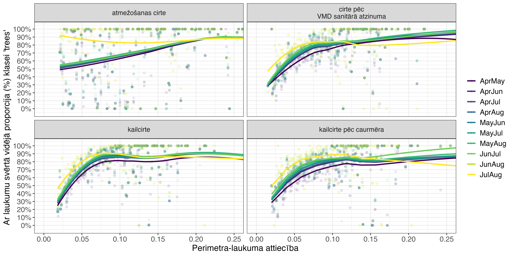
```

Zemāk esošais attēls (\@ref(fig:DWq51c) att.) demonstrē precīzāku klasifikāciju lielākiem nogabaliem.

```{r DWq51c, echo=FALSE, out.width = '100%', fig.cap='Ar platību svērtā 2023. gada DW klases "koki" sastapšanas varbūtība dažādos 2022. gada izcirtumos, atkarībā no to platības.'}
knitr::include_graphics("./Atteli/ch004_q51c.png")
```

<br>

Komandu rindas attēlu sagatavošanas un veiktās analīzes reproducēšanai (tiek izmantoti [Meža Valsts reģistrs](#Chapter3.1.1) dati):


```{r, eval=FALSE}
# libs
if(!require(terra)) {install.packages("terra"); require(terra)}
if(!require(tidyverse)) {install.packages("tidyverse"); require(tidyverse)}
if(!require(arrow)) {install.packages("arrow"); require(arrow)}
if(!require(sf)) {install.packages("sf"); require(sf)}
if(!require(sfarrow)) {install.packages("sfarrow"); require(sfarrow)}
if(!require(exactextractr)) {install.packages("exactextractr"); require(exactextractr)}
if(!require(ggview)) {install.packages("ggview"); require(ggview)}
if(!require(readxl)) {install.packages("readxl"); require(readxl)}
if(!require(ggrepel)) {install.packages("ggrepel"); require(ggrepel)}

# meža dati
MVR <- st_read_parquet("./IevadesDati/MVR/nogabali_2024janv.parquet")
mvr=MVR %>% 
  filter(zkat=="14"&(p_cirp=="11"|p_cirp=="17"|p_cirp=="31"|p_cirp=="81")&p_cirg==2021)


# DW
AprAug <- rast("./DW_2023_apraug.tif")
AprJul <- rast("./DW_2023_aprjul.tif")
AprJun <- rast("./DW_2023_aprjun.tif")
AprMay <- rast("./DW_2023_aprmay.tif")
JulAug <- rast("./DW_2023_julaug.tif")
JunAug <- rast("./DW_2023_julaug.tif")
JunJul <- rast("./DW_2023_junjul.tif")
MayAug <- rast("./DW_2023_mayaug.tif")
MayJul <- rast("./DW_2023_mayjul.tif")
MayJun <- rast("./DW_2023_mayjun.tif")

# utility 
darbiba <- function(raster, vector, period) {
  exact_extract(raster, vector, function(value, coverage_fraction) {
    data.frame(value = value,
               frac = coverage_fraction / sum(coverage_fraction, na.rm = TRUE)) %>%
      group_by(value) %>%
      summarize(freq = sum(frac, na.rm = TRUE), .groups = 'drop') %>%
      pivot_wider(names_from = 'value',
                  names_prefix = 'freq_',
                  values_from = 'freq')
  }) %>%
    mutate(across(starts_with('freq'), ~replace_na(., 0))) %>%
    mutate(periods = period) 
}


# DW extraction 
kodi=data.frame(kods=levels(factor(mvr$p_cirp)))

dati=mvr[1,]

for (i in 1:length(kodi$kods)){
  kods=kodi$kods[i]
  print(kods)
  
  set.seed(0)
  vietas <- mvr %>% filter(p_cirp == kods)
  if (nrow(vietas) < 999) {rand_locs <- vietas} else {rand_locs <- vietas %>% sample_n(999)}
  
  rand_locs <- rand_locs %>%  mutate(id = row_number())
  
  a=cbind(rand_locs,darbiba(AprAug, rand_locs, "AprAug"))
  b=cbind(rand_locs,darbiba(AprJul, rand_locs, "AprJul"))
  c=cbind(rand_locs,darbiba(AprJun, rand_locs, "AprJun"))
  d=cbind(rand_locs,darbiba(AprMay, rand_locs, "AprMay"))
  e=cbind(rand_locs,darbiba(JulAug, rand_locs, "JulAug"))
  f=cbind(rand_locs,darbiba(JunAug, rand_locs, "JunAug"))
  g=cbind(rand_locs,darbiba(JunJul, rand_locs, "JunJul"))
  h=cbind(rand_locs,darbiba(MayAug, rand_locs, "MayAug"))
  i=cbind(rand_locs,darbiba(MayJul, rand_locs, "MayJul"))
  j=cbind(rand_locs,darbiba(MayJun, rand_locs, "MayJun"))
  
  
  rez=bind_rows(a,b,c,d,e,f,g,h,i,j)
  dati <- bind_rows(dati, rez)
}

dati=dati %>% 
  mutate(water=freq_0,
         trees=freq_1,
         grass=freq_2,
         flooded_vegetation=freq_3,
         crops=freq_4,
         shrub_and_scrub=freq_5,
         built=freq_6,
         bare=freq_7,
         snow_and_ice=freq_8)
dati_real=dati[-1,]

dati_real[is.na(dati_real)]=0
dati_real$area=as.numeric(st_area(dati_real))
dati_real$perimeter=as.numeric(st_perimeter(dati_real))

sfarrow::st_write_parquet(dati_real,"./Q51_Izcirtumi.parquet")

dati=sfarrow::st_read_parquet("./Q51_Izcirtumi.parquet")

dati=dati %>% 
  mutate(sezona=factor(periods,ordered=TRUE,
                       levels=c("AprMay","AprJun","AprJul","AprAug","MayJun",
                                "MayJul","MayAug","JunJul","JunAug","JulAug"))) %>% 
  mutate(veids=if_else(p_cirp=="11","kailcirte",
                       if_else(p_cirp=="17","kailcirte pēc caurmēra",
                               if_else(p_cirp=="31","cirte pēc\nVMD sanitārā atzinuma",
                                       if_else(p_cirp=="81","atmežošanas cirte","draza")))))
q51data=data.frame(dati) %>% 
  select(veids,sezona,water:snow_and_ice) %>% 
  group_by(veids) %>% 
  mutate(skaits=n()/10) %>% 
  ungroup() %>% 
  pivot_longer(cols=water:snow_and_ice,names_to = "klase",
               values_to = "proporcija")

q51_props=data.frame(dati) %>% 
  pivot_longer(cols=water:snow_and_ice,names_to = "klase",
               values_to = "proporcija") %>% 
  filter(klase %in% c("crops","grass","shrub_and_scrub","trees")) %>% 
  group_by(veids,sezona,klase) %>% 
  summarise(proporcija=round(weighted.mean(proporcija,area)*100,0)) %>% 
  ungroup()

ggplot(q51data,aes(sezona,proporcija,col=klase))+
  facet_wrap(~veids,nrow=2)+
  geom_point(position=position_dodge(width=0.75),alpha=0.2)+
  theme_bw()+
  geom_text(data=q51_props[q51_props$klase=="crops",],
            aes(sezona,y=1.2,label=proporcija),size=3)+
  geom_text(data=q51_props[q51_props$klase=="grass",],
            aes(sezona,y=1.15,label=proporcija),size=3)+
  geom_text(data=q51_props[q51_props$klase=="shrub_and_scrub",],
            aes(sezona,y=1.1,label=proporcija),size=3)+
  geom_text(data=q51_props[q51_props$klase=="trees",],
            aes(sezona,y=1.05,label=proporcija),size=3)+
  theme(axis.text.x = element_text(angle=90,vjust=0.5),
        axis.title.y = element_blank(),
        legend.title = element_blank(),
        axis.title = element_text(size=14),
        axis.text=element_text(size=12),
        legend.text=element_text(size=12),
        strip.text = element_text(size=11))+
  scale_y_continuous(labels=scales::label_percent(),breaks=seq(0,1,by=.1))+
  scale_color_viridis_d()+
  labs(x="Sezona")

ggview(width=300,height=250,units="mm",dpi=600,device="png")
ggsave(filename="./pic_q51.png",width=300,height=250,units="mm",dpi=600)


q51b=data.frame(dati) %>% 
  select(veids,sezona,trees,perimeter,area) %>% 
  mutate(PAr=round(perimeter/area,3)) %>% 
  group_by(veids,sezona,PAr) %>% 
  summarise(propocija=weighted.mean(trees,area))

ggplot(q51b,aes(PAr,propocija,col=sezona))+
  facet_wrap(~veids,nrow=2)+
  geom_point(alpha=0.1)+
  geom_smooth(method="loess",se=FALSE)+
  theme_bw()+
  theme(legend.title = element_blank(),
        axis.title = element_text(size=14),
        axis.text=element_text(size=12),
        legend.text=element_text(size=12),
        strip.text = element_text(size=11))+
  scale_y_continuous(labels=scales::label_percent(),breaks=seq(0,1,by=.1))+
  scale_color_viridis_d()+
  labs(x="Perimetra-laukuma attiecība",
       y="Ar laukumu svērtā vidējā proporcija (%) klasei 'trees'")+
  coord_cartesian(xlim=c(0,0.25))

ggview(width=300,height=150,units="mm",dpi=600,device="png")
ggsave(filename="./pic_q51b.png",width=300,height=150,units="mm",dpi=600)


q51c=data.frame(dati) %>% 
  select(veids,sezona,trees,perimeter,area) %>% 
  group_by(veids,sezona,area) %>% 
  mutate(proporcija=weighted.mean(trees,area))

ggplot(q51c,aes(area,proporcija,col=sezona))+
  geom_point(alpha=0.1)+
  geom_smooth(method="loess",se=FALSE)+
  facet_wrap(~veids,nrow=2)+
  theme_bw()+
  theme(legend.title = element_blank(),
        axis.title = element_text(size=14),
        axis.text=element_text(size=12),
        legend.text=element_text(size=12),
        strip.text = element_text(size=11))+
  scale_y_continuous(labels=scales::label_percent(),breaks=seq(0,1,by=.1))+
  scale_color_viridis_d()+
  labs(x=expression(paste("Platība, ",m^2)),y="Proporcija (%) klasei 'trees'")+
  coord_cartesian(xlim=c(0,75000))
ggview(width=300,height=150,units="mm",dpi=600,device="png")
ggsave(filename="./pic_q51c.png",width=300,height=150,units="mm",dpi=600)

```


### Q5.2: senākas kailcirtes, bet vēl joprojām izcirtumi

Nogabali, kuros pēdējā ciršana ir kailcirtē (p_cirp=="11") un pēdējās darbības veids ir koku ciršana (p_darbv=="1") ar nejaušu izlozi nogabaliem kopš 2013. gada, kad ik gadu ir vismaz 300 nogabali. 

Šīs analīzes rezultāti (\@ref(fig:DWq52) att.) saistās ar iepriekšējām - ir izteikti malas efekti, kur blakus esošās mežaudzes ietekmē izpētes audžu klasifikācijas rezultātu un pārspīlētā koku sastopamība, kas ir izpaudusies jau vairākkārt - tikko mežaudzēs ir vismaz 0.1 m augsti kokaugi vai sastopamie augstie lakstaugi, tās klasificētas kā 'trees'.

Augstā koku sastopamība šo resursu padara par otršķirīgu vidi raksturojošu ekoģeogrāfisko mainīgo sagatavošanā. Tomēr vides pārmaiņu analīzē (novērojumu atlasē) to varētu lietot, lai samazinātu (bet ne pilnībā izskaustu) novērojumus vietās, kurās notikušas vides pārmaiņas.

```{r DWq52, echo=FALSE, out.width = '100%', fig.cap='Ar platību svērtā 2023. gada DW klašu sastopamība kopš 2013. gada veiktās kailcirtēs.'}
knitr::include_graphics("./Atteli/ch004_q52.png")
```

<br>

Komandu rindas attēlu sagatavošanas un veiktās analīzes reproducēšanai (tiek izmantoti [Meža Valsts reģistrs](#Chapter3.1.1) dati):


```{r, eval=FALSE}
# libs
if(!require(terra)) {install.packages("terra"); require(terra)}
if(!require(tidyverse)) {install.packages("tidyverse"); require(tidyverse)}
if(!require(arrow)) {install.packages("arrow"); require(arrow)}
if(!require(sf)) {install.packages("sf"); require(sf)}
if(!require(sfarrow)) {install.packages("sfarrow"); require(sfarrow)}
if(!require(exactextractr)) {install.packages("exactextractr"); require(exactextractr)}
if(!require(ggview)) {install.packages("ggview"); require(ggview)}
if(!require(readxl)) {install.packages("readxl"); require(readxl)}
if(!require(ggrepel)) {install.packages("ggrepel"); require(ggrepel)}

# meža dati
MVR <- st_read_parquet("./IevadesDati/MVR/nogabali_2024janv.parquet")
mvr=MVR %>% 
  filter(p_cirp=="11"&p_cirg>=2013&p_darbv=="1") %>% 
  mutate(p_cirg=as.character(p_cirg))


# DW
AprAug <- rast("./DW_2023_apraug.tif")
AprJul <- rast("./DW_2023_aprjul.tif")
AprJun <- rast("./DW_2023_aprjun.tif")
AprMay <- rast("./DW_2023_aprmay.tif")
JulAug <- rast("./DW_2023_julaug.tif")
JunAug <- rast("./DW_2023_julaug.tif")
JunJul <- rast("./DW_2023_junjul.tif")
MayAug <- rast("./DW_2023_mayaug.tif")
MayJul <- rast("./DW_2023_mayjul.tif")
MayJun <- rast("./DW_2023_mayjun.tif")

# utility 
darbiba <- function(raster, vector, period) {
  exact_extract(raster, vector, function(value, coverage_fraction) {
    data.frame(value = value,
               frac = coverage_fraction / sum(coverage_fraction, na.rm = TRUE)) %>%
      group_by(value) %>%
      summarize(freq = sum(frac, na.rm = TRUE), .groups = 'drop') %>%
      pivot_wider(names_from = 'value',
                  names_prefix = 'freq_',
                  values_from = 'freq')
  }) %>%
    mutate(across(starts_with('freq'), ~replace_na(., 0))) %>%
    mutate(periods = period) 
}


# DW extraction 
kodi=data.frame(kods=levels(factor(mvr$p_cirg)))
dati=mvr[1,]
for (i in 1:length(kodi$kods)){
  kods=kodi$kods[i]
  set.seed(0)
  vietas <- mvr %>% filter(p_cirg == kods)
  if (nrow(vietas) < 999) {rand_locs <- vietas} else {rand_locs <- vietas %>% sample_n(999)}
  rand_locs <- rand_locs %>%  mutate(id = row_number())
  
  a=cbind(rand_locs,darbiba(AprAug, rand_locs, "AprAug"))
  b=cbind(rand_locs,darbiba(AprJul, rand_locs, "AprJul"))
  c=cbind(rand_locs,darbiba(AprJun, rand_locs, "AprJun"))
  d=cbind(rand_locs,darbiba(AprMay, rand_locs, "AprMay"))
  e=cbind(rand_locs,darbiba(JulAug, rand_locs, "JulAug"))
  f=cbind(rand_locs,darbiba(JunAug, rand_locs, "JunAug"))
  g=cbind(rand_locs,darbiba(JunJul, rand_locs, "JunJul"))
  h=cbind(rand_locs,darbiba(MayAug, rand_locs, "MayAug"))
  i=cbind(rand_locs,darbiba(MayJul, rand_locs, "MayJul"))
  j=cbind(rand_locs,darbiba(MayJun, rand_locs, "MayJun"))

  rez=bind_rows(a,b,c,d,e,f,g,h,i,j)
  dati <- bind_rows(dati, rez)
}
dati=dati %>% 
  mutate(water=freq_0,
         trees=freq_1,
         grass=freq_2,
         flooded_vegetation=freq_3,
         crops=freq_4,
         shrub_and_scrub=freq_5,
         built=freq_6,
         bare=freq_7,
         snow_and_ice=freq_8)
dati_real=dati[-1,]
dati_real[is.na(dati_real)]=0
dati_real$area=as.numeric(st_area(dati_real))
dati_real$perimeter=as.numeric(st_perimeter(dati_real))
sfarrow::st_write_parquet(dati_real,"./Q52_Izcirtumi.parquet")

dati=sfarrow::st_read_parquet("./Q52_Izcirtumi.parquet")

dati=dati %>% 
  mutate(sezona=factor(periods,ordered=TRUE,
                       levels=c("AprMay","AprJun","AprJul","AprAug","MayJun",
                                "MayJul","MayAug","JunJul","JunAug","JulAug")))

q52data=data.frame(dati) %>% 
  select(p_cirg,sezona,perimeter,area,water:snow_and_ice) %>% 
  pivot_longer(cols=water:snow_and_ice,names_to = "klase",values_to = "proporcija")
  
q52_props=data.frame(dati) %>% 
  pivot_longer(cols=water:snow_and_ice,names_to = "klase",values_to = "proporcija") %>% 
  filter(klase %in% c("crops","grass","shrub_and_scrub","trees")) %>% 
  group_by(p_cirg,sezona,klase) %>% 
  summarise(proporcija=round(weighted.mean(proporcija,area)*100,0)) %>% 
  ungroup()

ggplot(q52data,aes(sezona,proporcija,col=klase))+
  facet_wrap(~p_cirg,nrow=2)+
  geom_point(position=position_dodge(width=0.75),alpha=0.2)+
  theme_bw()+
  geom_text(data=q52_props[q52_props$klase=="crops",],
            aes(sezona,y=1.2,label=proporcija),size=3)+
  geom_text(data=q52_props[q52_props$klase=="grass",],
            aes(sezona,y=1.15,label=proporcija),size=3)+
  geom_text(data=q52_props[q52_props$klase=="shrub_and_scrub",],
            aes(sezona,y=1.1,label=proporcija),size=3)+
  geom_text(data=q52_props[q52_props$klase=="trees",],
            aes(sezona,y=1.05,label=proporcija),size=3)+
  theme(axis.text.x = element_text(angle=90,vjust=0.5),
        axis.title.y = element_blank(),
        legend.title = element_blank(),
        axis.title = element_text(size=14),
        axis.text=element_text(size=12),
        legend.text=element_text(size=12),
        strip.text = element_text(size=11))+
  scale_y_continuous(labels=scales::label_percent(),breaks=seq(0,1,by=.1))+
  scale_color_viridis_d()+
  labs(x="Sezona")

ggview(width=300,height=200,units="mm",dpi=600,device="png")
ggsave(filename="./pic_q52.png",width=300,height=200,units="mm",dpi=600)

```


## Q6: Zālāju transformācija uz aramzemēm

Projekta komandai pieejama informācija par 2017. un 2018. gadu (tomēr skatīt arī lejupielādes iespējas LAD atvērto datu portālā), kas izmantoti attiecināšanai pret 2018. gada DW sezonālajiem slāņiem. 

Lauku atlasē izmantojām tos laukus, kuros 2017. gadā bija reģistrēti ilglaicīgie zālāji (PIETEIKTAIS_KULTURAS_KODS=="710"), bet 2018. gadā tam pašam numuram reģistrēts kāds no sekojošajiem:

- rudzi (PIETEIKTAIS_KULTURAS_KODS=="121");

- ziemas mieži (PIETEIKTAIS_KULTURAS_KODS=="132");

- ziemas kvieši (PIETEIKTAIS_KULTURAS_KODS=="112");

- ziemas tritikāle (PIETEIKTAIS_KULTURAS_KODS=="151");

- ziemas rapsis (PIETEIKTAIS_KULTURAS_KODS=="212");

- vasaras mieži (PIETEIKTAIS_KULTURAS_KODS=="131");

- vasaras kvieši (PIETEIKTAIS_KULTURAS_KODS=="111");

- vasaras tritikāle (PIETEIKTAIS_KULTURAS_KODS=="150");

- vasaras rapsis (PIETEIKTAIS_KULTURAS_KODS=="211").

Šāda atlase atgriež 2828 laukus. Lai samazinātu malas efektus, atlasījām tikai tos, kuriem laukums ir lielāks par mediānu un perimetra-laukuma attiecība ir mazāka par mediānu - šāda atlase atgriež 1255 laukus, kuri saglabāti analīzei.

Atlasītajās vietās izteikti dominē klase 'crops' (\@ref(fig:DWq6) att.), kas atspoguļo sagaidāmo rezultātu, apstiprinot iespējas šo resursu izmantot vides pārmaiņu analīzē.


```{r DWq6, echo=FALSE, out.width = '100%', fig.cap='Ar platību svērtā 2018. gada DW klašu sastopamība 2018. gadā par aramzemēm kļuvušajos ilggadīgajos zālājos.'}
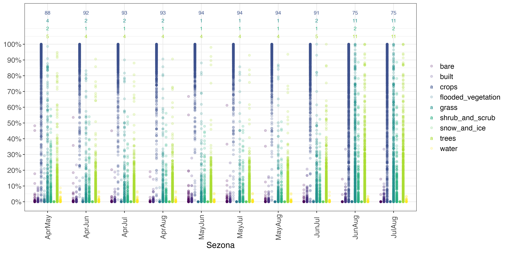
```

<br>

Komandu rindas attēlu sagatavošanas un veiktās analīzes reproducēšanai (tiek izmantoti [Meža Valsts reģistrs](#Chapter3.1.1) dati):


```{r, eval=FALSE}
# libs
if(!require(terra)) {install.packages("terra"); require(terra)}
if(!require(tidyverse)) {install.packages("tidyverse"); require(tidyverse)}
if(!require(arrow)) {install.packages("arrow"); require(arrow)}
if(!require(sf)) {install.packages("sf"); require(sf)}
if(!require(sfarrow)) {install.packages("sfarrow"); require(sfarrow)}
if(!require(exactextractr)) {install.packages("exactextractr"); require(exactextractr)}
if(!require(ggview)) {install.packages("ggview"); require(ggview)}
if(!require(readxl)) {install.packages("readxl"); require(readxl)}
if(!require(ggrepel)) {install.packages("ggrepel"); require(ggrepel)}

# lauku dati
lauki_old=st_read("LAUKI_2012-2020.gdb/",layer="LRGIS_LAUKI") 
lauki_old=lauki_old %>% 
  filter(PIETEIKUMA_GADS=="2017"|PIETEIKUMA_GADS=="2018")
lauki17=lauki_old  %>% 
  filter(PIETEIKUMA_GADS=="2017")%>% 
  filter(PIETEIKTAIS_KULTURAS_KODS=="710")
lauki17_pts=st_centroid(lauki17)
lauki18=lauki_old %>% 
  filter(PIETEIKUMA_GADS=="2018") %>% 
  filter(PIETEIKTAIS_KULTURAS_KODS=="121"|
           PIETEIKTAIS_KULTURAS_KODS=="132"|
           PIETEIKTAIS_KULTURAS_KODS=="112"|
           PIETEIKTAIS_KULTURAS_KODS=="151"|
           PIETEIKTAIS_KULTURAS_KODS=="212"|
           PIETEIKTAIS_KULTURAS_KODS=="131"|
           PIETEIKTAIS_KULTURAS_KODS=="111"|
           PIETEIKTAIS_KULTURAS_KODS=="150"|
           PIETEIKTAIS_KULTURAS_KODS=="211")
lauki_parbaudei=lauki18[lauki17_pts,,]
lauki_parbaudei$PAr=lauki_parbaudei$SHAPE_Length/lauki_parbaudei$SHAPE_Area
lauki_parbaudei2=lauki_parbaudei %>% 
  filter(SHAPE_Area>median(SHAPE_Area)&PAr<median(PAr))
st_write(lauki_parbaudei2,"./zalaju_parmainam.gpkg")

# DW
AprAug <- rast("./DW_2023_apraug.tif")
AprJul <- rast("./DW_2023_aprjul.tif")
AprJun <- rast("./DW_2023_aprjun.tif")
AprMay <- rast("./DW_2023_aprmay.tif")
JulAug <- rast("./DW_2023_julaug.tif")
JunAug <- rast("./DW_2023_julaug.tif")
JunJul <- rast("./DW_2023_junjul.tif")
MayAug <- rast("./DW_2023_mayaug.tif")
MayJul <- rast("./DW_2023_mayjul.tif")
MayJun <- rast("./DW_2023_mayjun.tif")

# utility 
darbiba <- function(raster, vector, period) {
  exact_extract(raster, vector, function(value, coverage_fraction) {
    data.frame(value = value,
               frac = coverage_fraction / sum(coverage_fraction, na.rm = TRUE)) %>%
      group_by(value) %>%
      summarize(freq = sum(frac, na.rm = TRUE), .groups = 'drop') %>%
      pivot_wider(names_from = 'value',
                  names_prefix = 'freq_',
                  values_from = 'freq')
  }) %>%
    mutate(across(starts_with('freq'), ~replace_na(., 0))) %>%
    mutate(periods = period) 
}

# DW extraction 
dati=lauki_parbaudei2[1,]
rand_locs <- lauki_parbaudei2 %>%  mutate(id = row_number())
a=cbind(rand_locs,darbiba(AprAug, rand_locs, "AprAug"))
b=cbind(rand_locs,darbiba(AprJul, rand_locs, "AprJul"))
c=cbind(rand_locs,darbiba(AprJun, rand_locs, "AprJun"))
d=cbind(rand_locs,darbiba(AprMay, rand_locs, "AprMay"))
e=cbind(rand_locs,darbiba(JulAug, rand_locs, "JulAug"))
f=cbind(rand_locs,darbiba(JunAug, rand_locs, "JunAug"))
g=cbind(rand_locs,darbiba(JunJul, rand_locs, "JunJul"))
h=cbind(rand_locs,darbiba(MayAug, rand_locs, "MayAug"))
i=cbind(rand_locs,darbiba(MayJul, rand_locs, "MayJul"))
j=cbind(rand_locs,darbiba(MayJun, rand_locs, "MayJun"))

rez=bind_rows(a,b,c,d,e,f,g,h,i,j)
  dati <- bind_rows(dati, rez)
dati=dati %>% 
  mutate(water=freq_0,
         trees=freq_1,
         grass=freq_2,
         flooded_vegetation=freq_3,
         crops=freq_4,
         shrub_and_scrub=freq_5,
         built=freq_6,
         bare=freq_7,
         snow_and_ice=freq_8)
dati_real=dati[-1,]
dati_real[is.na(dati_real)]=0
dati_real$area=as.numeric(st_area(dati_real))
dati_real$perimeter=as.numeric(st_perimeter(dati_real))
sfarrow::st_write_parquet(dati_real,"./Q6_ZalajuTransformacijas.parquet")

# DW klases pārmaiņu vietās
dati=sfarrow::st_read_parquet("./Q6_ZalajuTransformacijas.parquet")
dati=dati %>% 
  mutate(sezona=factor(periods,ordered=TRUE,
                       levels=c("AprMay","AprJun","AprJul","AprAug","MayJun",
                                "MayJul","MayAug","JunJul","JunAug","JulAug")))
q6data=data.frame(dati) %>% 
  select(sezona,perimeter,area,water:snow_and_ice) %>% 
  pivot_longer(cols=water:snow_and_ice,names_to = "klase",
               values_to = "proporcija")

q6_props=data.frame(dati) %>% 
  pivot_longer(cols=water:snow_and_ice,names_to = "klase",
               values_to = "proporcija") %>% 
  filter(klase %in% c("crops","grass","shrub_and_scrub","trees")) %>% 
  group_by(sezona,klase) %>% 
  summarise(proporcija=round(weighted.mean(proporcija,area)*100,0)) %>% 
  ungroup()

ggplot(q6data,aes(sezona,proporcija,col=klase))+
  geom_point(position=position_dodge(width=0.75),alpha=0.2)+
  theme_bw()+
  geom_text(data=q6_props[q6_props$klase=="crops",],
            aes(sezona,y=1.2,label=proporcija),size=3)+
  geom_text(data=q6_props[q6_props$klase=="grass",],
            aes(sezona,y=1.15,label=proporcija),size=3)+
  geom_text(data=q6_props[q6_props$klase=="shrub_and_scrub",],
            aes(sezona,y=1.1,label=proporcija),size=3)+
  geom_text(data=q6_props[q6_props$klase=="trees",],
            aes(sezona,y=1.05,label=proporcija),size=3)+
  theme(axis.text.x = element_text(angle=90,vjust=0.5),
        axis.title.y = element_blank(),
        legend.title = element_blank(),
        axis.title = element_text(size=14),
        axis.text=element_text(size=12),
        legend.text=element_text(size=12),
        strip.text = element_text(size=11))+
  scale_y_continuous(labels=scales::label_percent(),breaks=seq(0,1,by=.1))+
  scale_color_viridis_d()+
  labs(x="Sezona")

ggview(width=300,height=150,units="mm",dpi=600,device="png")
ggsave(filename="./pic_q6.png",width=300,height=150,units="mm",dpi=600)

```


## Secinājumi

1. Kā sagaidāms, DW izteikti pārspīlē vertikāli strukturēto klašu (piemēram, 'trees' un 'built', kura šajā analīzē nav sevišķi uzsvērta) sastopamību. Sevišķi izteikti tas parādās jaunaudžu un izcirtumu analīzēs. Tas nozīmē, ka, izmantojot tikai šo resursu vides raksturošanai, ir sagaidāma krietns troksnis visiem parametriem, kas saistās ar kokiem. To varētu risināt, pārskatot varbūtību sliekšņus katrai no klasēm, lai optimizētu Latvijas apstākļiem un sugu izplatības modelēšanas mērķim. Tomēr tas pieprasa liela apjoma specifisku analīzi, kas šī darba ietvaros netiks veikta.

2. Mitrāji, kas definēti topogrāfiskajā kartē, visai slikti uzrādās DW, galvenokārt augsto lakstaugu, kas klasificēti kā 'trees' dēļ. Tā kā daudzām ar mitrājiem saistītajām sugām koku klātbūtne ir uzskatāma par nozīmīgu negatīvi ietekmējošu mainīgo, paļauties uz DW viltus pozitīvo koku klātbūtni nozīmētu samazināt dzīvotņu piemērotības modeļu skaidrojamību un potenciāli arī projekciju uzticamību. Šo nāksies risināt kombinējot dažādākus slāņus, piemēram *Global Forest Watch* un *PALSAR* klasifikāciju informācijai par kokiem - šie resursi un to uzticamība Latvijai ir jau pētīti (piemēram, [@PucuPlans] un [@Avotins_LU2019]).

3. Lai gan vides klasifikāciju nevar balstīt tikai DW rezultātos, tie pietiekoši labi demonstrē zālāju transformāciju un vismaz lielāka mēroga koku vainagu seguma izzušanu. Tā kā arī apbūves teritoriju klases sastopamības troksnis ir līdzīgs koku klasei, tas pietiekoši aptver nozīmīgākās pārmaiņas vidē, lai varētu izmantot novērojumu atlasē.

4. Tikai vasaras mēnešu izmantošana sniedz zemāko atbalstu sagaidāmajiem rezultātiem. Nedaudz zemāks atbalsts par pārējām klasēm ir tikai pavasara mēnešiem. Tādēļ pārmaiņu analīzē izmantojama sezona, kas aptver gan pavasara, gan vasaras mēnešus. Tā kā atlikušajos sezonas griezumos Dynamic World rezultātos ir tikai marginālas atšķirības, analīzēm izmantosim Aprīļa-Augusta klašu vidējās varbūtības, jo šis periods sniedz klasifikācijas labāko telpisko pārklājumu (\@ref(fig:DWq00) att.).
