# Rezultāti {#Chapter10}

Šajā nodaļā apkopoti iegūtie sugu izplatības modelēšanas un to prioritizācijas aizsardzībai rezultāti. Tā ir strukturēta divās daļās - [individuālu sugu rezultāti](#Chapter10.1) un sugu sabiedrībā, nozīmīgo dzīvotņu  aizsardzības prioritizēšanas rezultāti, kas izmantojami kā ekosistēmas aizsardzībi ([apkopotie valsts līmeņa rezultāti](#Chapter10.2)). Matriāliem, kuri savas informatīvās, telpiskās un temporālās izšķirtspējas dēļ nav uzskatāmi par sugu aizsardzību apdraudošiem, sniegta piekļuve lejupielādei.

## Individuālu sugu rezultāti {#Chapter10.1}

Apkopotā formā ik sugas rezultāti ar hiperstaitēm lejupielādei ir [šajā (šobrīd neaktīvajā) tabulā (xlsx)]().

Sekojošajās nodaļās informācija par katru sugu ir apkopota pēc vienotas pieejas:

- sākumā ir sniegta informācija par pieejamajiem klātbūtnes novērojumiem, to izvietojumu un samazinānijumu [atlases gaitā](). Šajā attēla ir arī iestrāda vizualizācija modelēšanai (modeļu apmācībai, iekļaujot telpisko bloku krosvalidāciju, un neatkarīgai testēšanai izmantotās datu kopas);

- sugām, kurām, datu apjoma dēļ, pieņemts lēmums modelēšanu neveikt, tas ir skaidri norādīts tekstā. Pārējām sugām turpinās piedāvātā informācija. 

Modelētajām sugām piedāvāta papildus informācija:

- labākā modeļa izvēle (kreisajā - A daļā), sekojot nodaļā [Sugu izplatības (dzīvotņu piemērotības) modeļi](#Chapter7) aprakstītajai pieejai un (labajā - B daļā) šī modeļa salīdzinājums ar labākā modeļa EGV , klātbūtnes un iztrūkumu veidotajā informācijas telpā radītiem nejaušajiem (nulles) modeļiem (n=100). Attēlos irkļauti sekojoši raksturojumi:

  - Neatkarīgā testa TSS *attēla A daļā*, kas raksturo 
  
  - Apmācību un validācijas TSS starpība *attēla A daļā*, kas raksturo
  
  - Validācijas TSS *attēla A daļā*, kas raksturo
  
  - Apmācību TSS *attēla A daļā*, kas raksturo
  
  - Neatkarīgā testa AUC *attēla A daļā*, kas raksturo
  
  - AUC (validācijas) *attēla B daļā*, kas raksturo
  
  - Continuous Boyce Index (validācijas) *attēla B daļā*, kas raksturo
  
  - 10% training omission rate *attēla B daļā*, kas raksturo
  
  - Minimum training omission rate *attēla B daļā*, kas raksturo

- tabula ar raksturojumu atsvišķiem biežāk lietotajiem projicētās dzīvotņu piemērotības izvērtējumiem dalījumam piemērotajās un nepiemērotajās:

  - rindas raksturo sekojošus sliekšņa līmeņus:
  
    -- Minimum training presence - 
  
    -- Equal training sensitivity and specificity - 
  
    -- Maximum training sensitivity plus specificity - 
  
    -- Equal test sensitivity and specificity - 
  
    -- Maximum test sensitivity plus specificity - 
  
  - katram no tiem sniegts sekojošs izvērtējums:
  
    -- Cloglog value - 
    
    -- Fractional predicted area - 
    
    -- Training omission rate - 
    
    -- Test omission rate - 
    
    -- P-values - 

- projicētā (cloglog) dzīvotņu piemērotības karte diapozonam no 0 (nepiemērotāka) līdz 1 (piemērotāka) ar centrālā dalījuma vietu atbilstoši iepriekšējās tabulas "Equal training sensitivity and specificity" sliekšņa līmenim;

- pēc projekcijas sniegts īss komentārs par modeļa kvalitāti, kas dalīta sekojošās klasēs:

  - 

- noslēguma daļā ir sagatavota iespēja lejupielādēt sekojošus datu objektus:

  - Projicētā (cloglog) dzīvotņu piemērotība kā GEOTIFF slānis;
  
  - Par labāko atzītais modelis (krosvalidāciju objekts kā *.RDS fails);
  
  - Par labāko atzītais modelis (kombinēts krosvalidāciju objekts kā *.RDS fails);
  
  - Par labāko atzītais modelis (tikai ietekmīgās pazīmes kombinētajā krosvalidāciju objektā, lai atvieglotu turpmāku izplatības projicēšanu kā *.RDS fails);
  
  - Tabula ar ekoģeogrāfisko mainīgo izvēles gaitu, to VIF (savstarpējās prognozētspējas raksturojuma) vērtībām un ietekmes modelī (permutāciju procedūrā) raksturojums (kā *.xlsx fails);
  
- Pēc failu pieejamības, piedāvāts attēls ar marginālajām atbildes funkcijām krosvalidāciju modelī, pārējās pazīmes turot to vidējo vērtību līmenī, veicot ik citas pazīmes raksturojumu.


### COTCOT - paipala *Coturnix coturnix* {#Chapter10.1.001}


```{r NovAtlaseCOTCOT, echo=FALSE, out.width = '100%', fig.cap='Novērojumu atlases gaita un modelēšanā izmantojamie paipalas *Coturnix coturnix* novērojumi un fona punkti: A - novērojumu saglabāšanās atlases gaitā; B - visu pieejamo novērojumu (solis 1) izvietojums; C - ar vismaz iespējamu ligzdošanu skaitītie novēorjumi, kas izturējuši līdz septītā soļa beigām (punkti ir unikālie 1 km kvadrāti, krusti ir unikālie 100 m kvadrāti); D - ar vismaz ticamu ligzdošanu skaitītie novēorjumi, kas izturējuši līdz septītā soļa beigām (punkti ir unikālie 1 km kvadrāti, krusti ir unikālie 100 m kvadrāti); E - ar pierādītu ligzdošanu skaitītie novēorjumi, kas izturējuši līdz septītā soļa beigām (punkti ir unikālie 1 km kvadrāti, krusti ir unikālie 100 m kvadrāti); F - modelēšanā izmantojamā apmācību kopa (punkti ir sugas klātbūtnes, krusti ir fona raksturošanai); G - modelēšanā izmantojamā neatkarīgās testēšanas kopa (punkti ir sugas klātbūtnes, krusti ir fona raksturošanai)'}
knitr::include_graphics("./Atteli/IzvelesAtteli/ObsSelection_COTCOT.png")
```

<br>


```{r ModelaRaksturojumsCOTCOT, echo=FALSE, out.width = '100%', fig.cap='Labākā modeļa izvēle un uzvērtējums: A - labākā modeļa (ar treknu melnu punktu) salīdzinājums ar citiem pielāgotajiem modeļiem (pelēkie punkti un to sastopamības blīvuma funkcijas); B - labākā modeļa izvērtējums, to salīdzinot ar nejauši ģenerētiem nulles modeļiem (n=100) tajā pašā EGV, klātbūtnez un fona punktu veidotajā informācijas telpā.'}
knitr::include_graphics("./Atteli/Beigam_IzvelesAttels/IzvelesAttels_COTCOT.png")
```

<br>

```{r SlieksniCOTCOT,echo=FALSE}
suppressPackageStartupMessages(library(kableExtra))
suppressPackageStartupMessages(library(tidyverse))
opts <- options(knitr.kable.NA = "")
slieksni=readxl::read_excel("./Papilddati/BestThresholds/BestThs_COTCOT.xlsx")
tabula=kableExtra::kbl(slieksni, caption = 'Biežāk lietotie projicētās dzīvotņu piemērotības sliekšņa līmeņi un to izvērtējums', 
                    booktabs = TRUE, 
                    longtable = TRUE) 
tabula %>%
  kable_styling(latex_options = "scale_down") %>%
  scroll_box(width = "100%", box_css = "border: 0px;")
```


<br>


```{r HSprojCOTCOT, echo=FALSE, out.width = '100%', fig.cap='Labākā modeļa projekcija suga sdzīvotņu piemērotībai. Krāsu skala reprezentē cloglog vērtību no 0 līdz 1, kur starp galapunktiem esošā atzīme ir vienādas sensitivātes un specifiskuma treniņdatos slieksnis iepriekšējā tabulā (izvēlēts vizualizēšanas mērķiem un skaidrošanas ērtumam).'}
  knitr::include_graphics("./Atteli/Beigam_KarteNebal/BeiguKarteiNebal_COTCOT.png")
```

<br>


[**Vēl nē:** Dzīvotņu piemērotība (GeoTIFF)]()

[**Vēl nē:** Par labāko atzītais modelis (krosvalidācijas; *.RDS)]()

[**Vēl nē:** Par labāko atzītais modelis (kombinēts; *.RDS)]()

[**Vēl nē:** Par labāko atzītais modelis (tikai ietekmīgās pazīmes; *.RDS)]()

[**Vēl nē:** Ekoģeogrāfisko mainīgo izvēles gaita, to VIF (savstarpējās prognozētspējas raksturojums) un ietekmes modelī (permutāciju procedūrā) raksturojums (*.xlsx)]()

**Attēls EGV marginālajām atbildēm**

<br>


### PERPER - laukirbe *Perdix perdix* {#Chapter10.1.002}


```{r NovAtlasePERPER, echo=FALSE, out.width = '100%', fig.cap='Novērojumu atlases gaita un modelēšanā izmantojamie laukirbes *Perdix perdix* novērojumi un fona punkti: A - novērojumu saglabāšanās atlases gaitā; B - visu pieejamo novērojumu (solis 1) izvietojums; C - ar vismaz iespējamu ligzdošanu skaitītie novēorjumi, kas izturējuši līdz septītā soļa beigām (punkti ir unikālie 1 km kvadrāti, krusti ir unikālie 100 m kvadrāti); D - ar vismaz ticamu ligzdošanu skaitītie novēorjumi, kas izturējuši līdz septītā soļa beigām (punkti ir unikālie 1 km kvadrāti, krusti ir unikālie 100 m kvadrāti); E - ar pierādītu ligzdošanu skaitītie novēorjumi, kas izturējuši līdz septītā soļa beigām (punkti ir unikālie 1 km kvadrāti, krusti ir unikālie 100 m kvadrāti); F - modelēšanā izmantojamā apmācību kopa (punkti ir sugas klātbūtnes, krusti ir fona raksturošanai); G - modelēšanā izmantojamā neatkarīgās testēšanas kopa (punkti ir sugas klātbūtnes, krusti ir fona raksturošanai)'}
knitr::include_graphics("./Atteli/IzvelesAtteli/ObsSelection_PERPER.png")
```


<br>


```{r ModelaRaksturojumsPERPER, echo=FALSE, out.width = '100%', fig.cap='Labākā modeļa izvēle un uzvērtējums: A - labākā modeļa (ar treknu melnu punktu) salīdzinājums ar citiem pielāgotajiem modeļiem (pelēkie punkti un to sastopamības blīvuma funkcijas); B - labākā modeļa izvērtējums, to salīdzinot ar nejauši ģenerētiem nulles modeļiem (n=100) tajā pašā EGV, klātbūtnez un fona punktu veidotajā informācijas telpā.'}
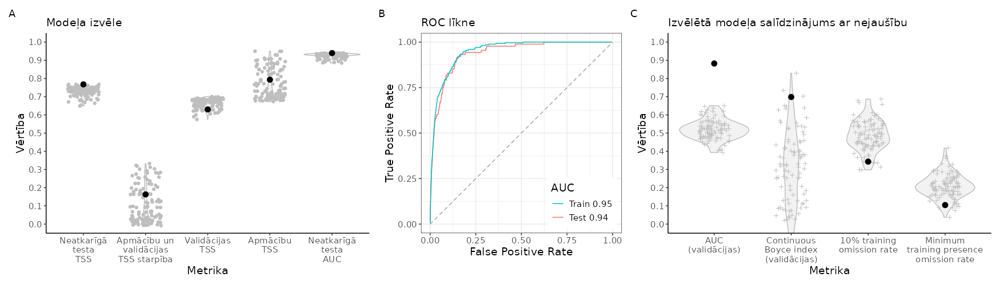
```

<br>

```{r SlieksniPERPER,echo=FALSE}
suppressPackageStartupMessages(library(kableExtra))
suppressPackageStartupMessages(library(tidyverse))
opts <- options(knitr.kable.NA = "")
slieksni=readxl::read_excel("./Papilddati/BestThresholds/BestThs_PERPER.xlsx")
tabula=kableExtra::kbl(slieksni, caption = 'Biežāk lietotie projicētās dzīvotņu piemērotības sliekšņa līmeņi un to izvērtējums', 
                    booktabs = TRUE, 
                    longtable = TRUE) 
tabula %>%
  kable_styling(latex_options = "scale_down") %>%
  scroll_box(width = "100%", box_css = "border: 0px;")
```


<br>


```{r HSprojPERPER, echo=FALSE, out.width = '100%', fig.cap='Labākā modeļa projekcija suga sdzīvotņu piemērotībai. Krāsu skala reprezentē cloglog vērtību no 0 līdz 1, kur starp galapunktiem esošā atzīme ir vienādas sensitivātes un specifiskuma treniņdatos slieksnis iepriekšējā tabulā (izvēlēts vizualizēšanas mērķiem un skaidrošanas ērtumam).'}
  
```

<br>


[**Vēl nē:** Dzīvotņu piemērotība (GeoTIFF)]()

[**Vēl nē:** Par labāko atzītais modelis (krosvalidācijas; *.RDS)]()

[**Vēl nē:** Par labāko atzītais modelis (kombinēts; *.RDS)]()

[**Vēl nē:** Par labāko atzītais modelis (tikai ietekmīgās pazīmes - projicēšanai; *.RDS)]()

[**Vēl nē:** Ekoģeogrāfisko mainīgo izvēles gaita, to VIF (savstarpējās prognozētspējas raksturojums) un ietekmes modelī (permutāciju procedūrā) raksturojums (*.xlsx)]()

**Attēls EGV marginālajām atbildēm**


<br>


### BONBON - mežirbe *Bonasa bonasia* {#Chapter10.1.003}


```{r NovAtlaseBONBON, echo=FALSE, out.width = '100%', fig.cap='Novērojumu atlases gaita un modelēšanā izmantojamie mežirbes *Bonasa bonasia* novērojumi un fona punkti: A - novērojumu saglabāšanās atlases gaitā; B - visu pieejamo novērojumu (solis 1) izvietojums; C - ar vismaz iespējamu ligzdošanu skaitītie novēorjumi, kas izturējuši līdz septītā soļa beigām (punkti ir unikālie 1 km kvadrāti, krusti ir unikālie 100 m kvadrāti); D - ar vismaz ticamu ligzdošanu skaitītie novēorjumi, kas izturējuši līdz septītā soļa beigām (punkti ir unikālie 1 km kvadrāti, krusti ir unikālie 100 m kvadrāti); E - ar pierādītu ligzdošanu skaitītie novēorjumi, kas izturējuši līdz septītā soļa beigām (punkti ir unikālie 1 km kvadrāti, krusti ir unikālie 100 m kvadrāti); F - modelēšanā izmantojamā apmācību kopa (punkti ir sugas klātbūtnes, krusti ir fona raksturošanai); G - modelēšanā izmantojamā neatkarīgās testēšanas kopa (punkti ir sugas klātbūtnes, krusti ir fona raksturošanai)'}
knitr::include_graphics("./Atteli/IzvelesAtteli/ObsSelection_BONBON.png")
```


<br>


```{r ModelaRaksturojumsBONBON, echo=FALSE, out.width = '100%', fig.cap='Labākā modeļa izvēle un uzvērtējums: A - labākā modeļa (ar treknu melnu punktu) salīdzinājums ar citiem pielāgotajiem modeļiem (pelēkie punkti un to sastopamības blīvuma funkcijas); B - labākā modeļa izvērtējums, to salīdzinot ar nejauši ģenerētiem nulles modeļiem (n=100) tajā pašā EGV, klātbūtnez un fona punktu veidotajā informācijas telpā.'}
knitr::include_graphics("./Atteli/Beigam_IzvelesAttels/IzvelesAttels_BONBON.png")
```

<br>

```{r SlieksniBONBON,echo=FALSE}
suppressPackageStartupMessages(library(kableExtra))
suppressPackageStartupMessages(library(tidyverse))
opts <- options(knitr.kable.NA = "")
slieksni=readxl::read_excel("./Papilddati/BestThresholds/BestThs_BONBON.xlsx")
tabula=kableExtra::kbl(slieksni, caption = 'Biežāk lietotie projicētās dzīvotņu piemērotības sliekšņa līmeņi un to izvērtējums', 
                    booktabs = TRUE, 
                    longtable = TRUE) 
tabula %>%
  kable_styling(latex_options = "scale_down") %>%
  scroll_box(width = "100%", box_css = "border: 0px;")
```


<br>


```{r HSprojBONBON, echo=FALSE, out.width = '100%', fig.cap='Labākā modeļa projekcija suga sdzīvotņu piemērotībai. Krāsu skala reprezentē cloglog vērtību no 0 līdz 1, kur starp galapunktiem esošā atzīme ir vienādas sensitivātes un specifiskuma treniņdatos slieksnis iepriekšējā tabulā (izvēlēts vizualizēšanas mērķiem un skaidrošanas ērtumam).'}
  
```

<br>


[**Vēl nē:** Dzīvotņu piemērotība (GeoTIFF)]()

[**Vēl nē:** Par labāko atzītais modelis (krosvalidācijas; *.RDS)]()

[**Vēl nē:** Par labāko atzītais modelis (kombinēts; *.RDS)]()

[**Vēl nē:** Par labāko atzītais modelis (tikai ietekmīgās pazīmes; *.RDS)]()

[**Vēl nē:** Ekoģeogrāfisko mainīgo izvēles gaita, to VIF (savstarpējās prognozētspējas raksturojums) un ietekmes modelī (permutāciju procedūrā) raksturojums (*.xlsx)]()

**Attēls EGV marginālajām atbildēm**


<br>


### TETURO - mednis *Tetrao urogallus* {#Chapter10.1.004}


```{r NovAtlaseTETURO, echo=FALSE, out.width = '100%', fig.cap='Novērojumu atlases gaita un modelēšanā izmantojamie medņa *Tetrao urogallus* novērojumi un fona punkti: A - novērojumu saglabāšanās atlases gaitā; B - visu pieejamo novērojumu (solis 1) izvietojums; C - ar vismaz iespējamu ligzdošanu skaitītie novēorjumi, kas izturējuši līdz septītā soļa beigām (punkti ir unikālie 1 km kvadrāti, krusti ir unikālie 100 m kvadrāti); D - ar vismaz ticamu ligzdošanu skaitītie novēorjumi, kas izturējuši līdz septītā soļa beigām (punkti ir unikālie 1 km kvadrāti, krusti ir unikālie 100 m kvadrāti); E - ar pierādītu ligzdošanu skaitītie novēorjumi, kas izturējuši līdz septītā soļa beigām (punkti ir unikālie 1 km kvadrāti, krusti ir unikālie 100 m kvadrāti); F - modelēšanā izmantojamā apmācību kopa (punkti ir sugas klātbūtnes, krusti ir fona raksturošanai); G - modelēšanā izmantojamā neatkarīgās testēšanas kopa (punkti ir sugas klātbūtnes, krusti ir fona raksturošanai)'}
knitr::include_graphics("./Atteli/IzvelesAtteli/ObsSelection_TETURO.png")
```


<br>


```{r ModelaRaksturojumsTETURO, echo=FALSE, out.width = '100%', fig.cap='Labākā modeļa izvēle un uzvērtējums: A - labākā modeļa (ar treknu melnu punktu) salīdzinājums ar citiem pielāgotajiem modeļiem (pelēkie punkti un to sastopamības blīvuma funkcijas); B - labākā modeļa izvērtējums, to salīdzinot ar nejauši ģenerētiem nulles modeļiem (n=100) tajā pašā EGV, klātbūtnez un fona punktu veidotajā informācijas telpā.'}
knitr::include_graphics("./Atteli/Beigam_IzvelesAttels/IzvelesAttels_TETURO.png")
```

<br>

```{r SlieksniTETURO,echo=FALSE}
suppressPackageStartupMessages(library(kableExtra))
suppressPackageStartupMessages(library(tidyverse))
opts <- options(knitr.kable.NA = "")
slieksni=readxl::read_excel("./Papilddati/BestThresholds/BestThs_TETURO.xlsx")
tabula=kableExtra::kbl(slieksni, caption = 'Biežāk lietotie projicētās dzīvotņu piemērotības sliekšņa līmeņi un to izvērtējums', 
                    booktabs = TRUE, 
                    longtable = TRUE) 
tabula %>%
  kable_styling(latex_options = "scale_down") %>%
  scroll_box(width = "100%", box_css = "border: 0px;")
```


<br>


```{r HSprojTETURO, echo=FALSE, out.width = '100%', fig.cap='Labākā modeļa projekcija suga sdzīvotņu piemērotībai. Krāsu skala reprezentē cloglog vērtību no 0 līdz 1, kur starp galapunktiem esošā atzīme ir vienādas sensitivātes un specifiskuma treniņdatos slieksnis iepriekšējā tabulā (izvēlēts vizualizēšanas mērķiem un skaidrošanas ērtumam).'}
  knitr::include_graphics("./Atteli/Beigam_KarteNebal/BeiguKarteiNebal_TETURO.png")
```

<br>


[**Vēl nē:** Dzīvotņu piemērotība (GeoTIFF)]()

[**Vēl nē:** Par labāko atzītais modelis (krosvalidācijas; *.RDS)]()

[**Vēl nē:** Par labāko atzītais modelis (kombinēts; *.RDS)]()

[**Vēl nē:** Par labāko atzītais modelis (tikai ietekmīgās pazīmes; *.RDS)]()

[**Vēl nē:** Ekoģeogrāfisko mainīgo izvēles gaita, to VIF (savstarpējās prognozētspējas raksturojums) un ietekmes modelī (permutāciju procedūrā) raksturojums (*.xlsx)]()

**Attēls EGV marginālajām atbildēm**

<br>


### LYRTET - rubenis *Lyrurus tetrix* {#Chapter10.1.005}


```{r NovAtlaseLYRTET, echo=FALSE, out.width = '100%', fig.cap='Novērojumu atlases gaita un modelēšanā izmantojamie rubeņa *Lyrurus tetrix* novērojumi un fona punkti: A - novērojumu saglabāšanās atlases gaitā; B - visu pieejamo novērojumu (solis 1) izvietojums; C - ar vismaz iespējamu ligzdošanu skaitītie novēorjumi, kas izturējuši līdz septītā soļa beigām (punkti ir unikālie 1 km kvadrāti, krusti ir unikālie 100 m kvadrāti); D - ar vismaz ticamu ligzdošanu skaitītie novēorjumi, kas izturējuši līdz septītā soļa beigām (punkti ir unikālie 1 km kvadrāti, krusti ir unikālie 100 m kvadrāti); E - ar pierādītu ligzdošanu skaitītie novēorjumi, kas izturējuši līdz septītā soļa beigām (punkti ir unikālie 1 km kvadrāti, krusti ir unikālie 100 m kvadrāti); F - modelēšanā izmantojamā apmācību kopa (punkti ir sugas klātbūtnes, krusti ir fona raksturošanai); G - modelēšanā izmantojamā neatkarīgās testēšanas kopa (punkti ir sugas klātbūtnes, krusti ir fona raksturošanai)'}
knitr::include_graphics("./Atteli/IzvelesAtteli/ObsSelection_LYRTET.png")
```


<br>


```{r ModelaRaksturojumsLYRTET, echo=FALSE, out.width = '100%', fig.cap='Labākā modeļa izvēle un uzvērtējums: A - labākā modeļa (ar treknu melnu punktu) salīdzinājums ar citiem pielāgotajiem modeļiem (pelēkie punkti un to sastopamības blīvuma funkcijas); B - labākā modeļa izvērtējums, to salīdzinot ar nejauši ģenerētiem nulles modeļiem (n=100) tajā pašā EGV, klātbūtnez un fona punktu veidotajā informācijas telpā.'}
knitr::include_graphics("./Atteli/Beigam_IzvelesAttels/IzvelesAttels_LYRTET.png")
```

<br>

```{r SlieksniLYRTET,echo=FALSE}
suppressPackageStartupMessages(library(kableExtra))
suppressPackageStartupMessages(library(tidyverse))
opts <- options(knitr.kable.NA = "")
slieksni=readxl::read_excel("./Papilddati/BestThresholds/BestThs_LYRTET.xlsx")
tabula=kableExtra::kbl(slieksni, caption = 'Biežāk lietotie projicētās dzīvotņu piemērotības sliekšņa līmeņi un to izvērtējums', 
                    booktabs = TRUE, 
                    longtable = TRUE) 
tabula %>%
  kable_styling(latex_options = "scale_down") %>%
  scroll_box(width = "100%", box_css = "border: 0px;")
```


<br>


```{r HSprojLYRTET, echo=FALSE, out.width = '100%', fig.cap='Labākā modeļa projekcija suga sdzīvotņu piemērotībai. Krāsu skala reprezentē cloglog vērtību no 0 līdz 1, kur starp galapunktiem esošā atzīme ir vienādas sensitivātes un specifiskuma treniņdatos slieksnis iepriekšējā tabulā (izvēlēts vizualizēšanas mērķiem un skaidrošanas ērtumam).'}
  knitr::include_graphics("./Atteli/Beigam_KarteNebal/BeiguKarteiNebal_LYRTET.png")
```

<br>


[**Vēl nē:** Dzīvotņu piemērotība (GeoTIFF)]()

[**Vēl nē:** Par labāko atzītais modelis (krosvalidācijas; *.RDS)]()

[**Vēl nē:** Par labāko atzītais modelis (kombinēts; *.RDS)]()

[**Vēl nē:** Par labāko atzītais modelis (tikai ietekmīgās pazīmes; *.RDS)]()

[**Vēl nē:** Ekoģeogrāfisko mainīgo izvēles gaita, to VIF (savstarpējās prognozētspējas raksturojums) un ietekmes modelī (permutāciju procedūrā) raksturojums (*.xlsx)]()

**Attēls EGV marginālajām atbildēm**

<br>


### CYGCYG - ziemeļu gulbis *Cygnus cygnus* {#Chapter10.1.006}


```{r NovAtlaseCYGCYG, echo=FALSE, out.width = '100%', fig.cap='Novērojumu atlases gaita un modelēšanā izmantojamie ziemeļu gulbja *Cygnus cygnus* novērojumi un fona punkti: A - novērojumu saglabāšanās atlases gaitā; B - visu pieejamo novērojumu (solis 1) izvietojums; C - ar vismaz iespējamu ligzdošanu skaitītie novēorjumi, kas izturējuši līdz septītā soļa beigām (punkti ir unikālie 1 km kvadrāti, krusti ir unikālie 100 m kvadrāti); D - ar vismaz ticamu ligzdošanu skaitītie novēorjumi, kas izturējuši līdz septītā soļa beigām (punkti ir unikālie 1 km kvadrāti, krusti ir unikālie 100 m kvadrāti); E - ar pierādītu ligzdošanu skaitītie novēorjumi, kas izturējuši līdz septītā soļa beigām (punkti ir unikālie 1 km kvadrāti, krusti ir unikālie 100 m kvadrāti); F - modelēšanā izmantojamā apmācību kopa (punkti ir sugas klātbūtnes, krusti ir fona raksturošanai); G - modelēšanā izmantojamā neatkarīgās testēšanas kopa (punkti ir sugas klātbūtnes, krusti ir fona raksturošanai)'}
knitr::include_graphics("./Atteli/IzvelesAtteli/ObsSelection_CYGCYG.png")
```


<br>


```{r ModelaRaksturojumsCYGCYG, echo=FALSE, out.width = '100%', fig.cap='Labākā modeļa izvēle un uzvērtējums: A - labākā modeļa (ar treknu melnu punktu) salīdzinājums ar citiem pielāgotajiem modeļiem (pelēkie punkti un to sastopamības blīvuma funkcijas); B - labākā modeļa izvērtējums, to salīdzinot ar nejauši ģenerētiem nulles modeļiem (n=100) tajā pašā EGV, klātbūtnez un fona punktu veidotajā informācijas telpā.'}

```

<br>

```{r SlieksniCYGCYG,echo=FALSE}
suppressPackageStartupMessages(library(kableExtra))
suppressPackageStartupMessages(library(tidyverse))
opts <- options(knitr.kable.NA = "")
slieksni=readxl::read_excel("./Papilddati/BestThresholds/BestThs_CYGCYG.xlsx")
tabula=kableExtra::kbl(slieksni, caption = 'Biežāk lietotie projicētās dzīvotņu piemērotības sliekšņa līmeņi un to izvērtējums', 
                    booktabs = TRUE, 
                    longtable = TRUE) 
tabula %>%
  kable_styling(latex_options = "scale_down") %>%
  scroll_box(width = "100%", box_css = "border: 0px;")
```


<br>


```{r HSprojCYGCYG, echo=FALSE, out.width = '100%', fig.cap='Labākā modeļa projekcija suga sdzīvotņu piemērotībai. Krāsu skala reprezentē cloglog vērtību no 0 līdz 1, kur starp galapunktiem esošā atzīme ir vienādas sensitivātes un specifiskuma treniņdatos slieksnis iepriekšējā tabulā (izvēlēts vizualizēšanas mērķiem un skaidrošanas ērtumam).'}
  
```

<br>


[**Vēl nē:** Dzīvotņu piemērotība (GeoTIFF)]()

[**Vēl nē:** Par labāko atzītais modelis (krosvalidācijas; *.RDS)]()

[**Vēl nē:** Par labāko atzītais modelis (kombinēts; *.RDS)]()

[**Vēl nē:** Par labāko atzītais modelis (tikai ietekmīgās pazīmes; *.RDS)]()

[**Vēl nē:** Ekoģeogrāfisko mainīgo izvēles gaita, to VIF (savstarpējās prognozētspējas raksturojums) un ietekmes modelī (permutāciju procedūrā) raksturojums (*.xlsx)]()

**Attēls EGV marginālajām atbildēm**

<br>


### ANSANS - meža zoss *Anser anser* {#Chapter10.1.007}


```{r NovAtlaseANSANS, echo=FALSE, out.width = '100%', fig.cap='Novērojumu atlases gaita un modelēšanā izmantojamie meža zoss *Anser anser* novērojumi un fona punkti: A - novērojumu saglabāšanās atlases gaitā; B - visu pieejamo novērojumu (solis 1) izvietojums; C - ar vismaz iespējamu ligzdošanu skaitītie novēorjumi, kas izturējuši līdz septītā soļa beigām (punkti ir unikālie 1 km kvadrāti, krusti ir unikālie 100 m kvadrāti); D - ar vismaz ticamu ligzdošanu skaitītie novēorjumi, kas izturējuši līdz septītā soļa beigām (punkti ir unikālie 1 km kvadrāti, krusti ir unikālie 100 m kvadrāti); E - ar pierādītu ligzdošanu skaitītie novēorjumi, kas izturējuši līdz septītā soļa beigām (punkti ir unikālie 1 km kvadrāti, krusti ir unikālie 100 m kvadrāti); F - modelēšanā izmantojamā apmācību kopa (punkti ir sugas klātbūtnes, krusti ir fona raksturošanai); G - modelēšanā izmantojamā neatkarīgās testēšanas kopa (punkti ir sugas klātbūtnes, krusti ir fona raksturošanai)'}

```


<br>


```{r ModelaRaksturojumsANSANS, echo=FALSE, out.width = '100%', fig.cap='Labākā modeļa izvēle un uzvērtējums: A - labākā modeļa (ar treknu melnu punktu) salīdzinājums ar citiem pielāgotajiem modeļiem (pelēkie punkti un to sastopamības blīvuma funkcijas); B - labākā modeļa izvērtējums, to salīdzinot ar nejauši ģenerētiem nulles modeļiem (n=100) tajā pašā EGV, klātbūtnez un fona punktu veidotajā informācijas telpā.'}
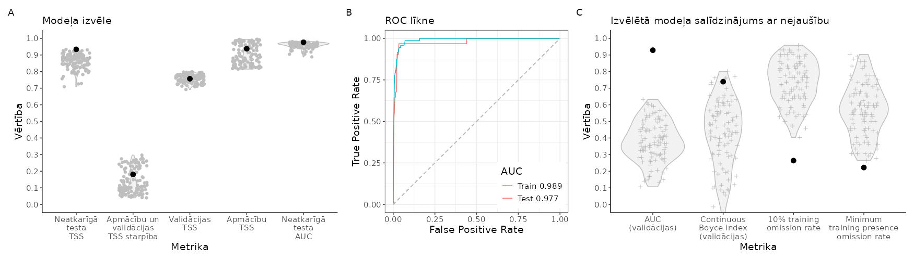
```

<br>

```{r SlieksniANSANS,echo=FALSE}
suppressPackageStartupMessages(library(kableExtra))
suppressPackageStartupMessages(library(tidyverse))
opts <- options(knitr.kable.NA = "")
slieksni=readxl::read_excel("./Papilddati/BestThresholds/BestThs_ANSANS.xlsx")
tabula=kableExtra::kbl(slieksni, caption = 'Biežāk lietotie projicētās dzīvotņu piemērotības sliekšņa līmeņi un to izvērtējums', 
                    booktabs = TRUE, 
                    longtable = TRUE) 
tabula %>%
  kable_styling(latex_options = "scale_down") %>%
  scroll_box(width = "100%", box_css = "border: 0px;")
```


<br>


```{r HSprojANSANS, echo=FALSE, out.width = '100%', fig.cap='Labākā modeļa projekcija suga sdzīvotņu piemērotībai. Krāsu skala reprezentē cloglog vērtību no 0 līdz 1, kur starp galapunktiem esošā atzīme ir vienādas sensitivātes un specifiskuma treniņdatos slieksnis iepriekšējā tabulā (izvēlēts vizualizēšanas mērķiem un skaidrošanas ērtumam).'}
  knitr::include_graphics("./Atteli/Beigam_KarteNebal/BeiguKarteiNebal_ANSANS.png")
```

<br>


[**Vēl nē:** Dzīvotņu piemērotība (GeoTIFF)]()

[**Vēl nē:** Par labāko atzītais modelis (krosvalidācijas; *.RDS)]()

[**Vēl nē:** Par labāko atzītais modelis (kombinēts; *.RDS)]()

[**Vēl nē:** Par labāko atzītais modelis (tikai ietekmīgās pazīmes; *.RDS)]()

[**Vēl nē:** Ekoģeogrāfisko mainīgo izvēles gaita, to VIF (savstarpējās prognozētspējas raksturojums) un ietekmes modelī (permutāciju procedūrā) raksturojums (*.xlsx)]()

**Attēls EGV marginālajām atbildēm**

<br>


### TADTAD - Sāmsalas dižpīle *Tadorna tadorna* {#Chapter10.1.008}


```{r NovAtlaseTADTAD, echo=FALSE, out.width = '100%', fig.cap='Novērojumu atlases gaita un modelēšanā izmantojamie Sāmsalas dižpīles *Tadorna tadorna* novērojumi un fona punkti: A - novērojumu saglabāšanās atlases gaitā; B - visu pieejamo novērojumu (solis 1) izvietojums; C - ar vismaz iespējamu ligzdošanu skaitītie novēorjumi, kas izturējuši līdz septītā soļa beigām (punkti ir unikālie 1 km kvadrāti, krusti ir unikālie 100 m kvadrāti); D - ar vismaz ticamu ligzdošanu skaitītie novēorjumi, kas izturējuši līdz septītā soļa beigām (punkti ir unikālie 1 km kvadrāti, krusti ir unikālie 100 m kvadrāti); E - ar pierādītu ligzdošanu skaitītie novēorjumi, kas izturējuši līdz septītā soļa beigām (punkti ir unikālie 1 km kvadrāti, krusti ir unikālie 100 m kvadrāti); F - modelēšanā izmantojamā apmācību kopa (punkti ir sugas klātbūtnes, krusti ir fona raksturošanai); G - modelēšanā izmantojamā neatkarīgās testēšanas kopa (punkti ir sugas klātbūtnes, krusti ir fona raksturošanai)'}
knitr::include_graphics("./Atteli/IzvelesAtteli/ObsSelection_TADTAD.png")
```


<br>


```{r ModelaRaksturojumsTADTAD, echo=FALSE, out.width = '100%', fig.cap='Labākā modeļa izvēle un uzvērtējums: A - labākā modeļa (ar treknu melnu punktu) salīdzinājums ar citiem pielāgotajiem modeļiem (pelēkie punkti un to sastopamības blīvuma funkcijas); B - labākā modeļa izvērtējums, to salīdzinot ar nejauši ģenerētiem nulles modeļiem (n=100) tajā pašā EGV, klātbūtnez un fona punktu veidotajā informācijas telpā.'}

```

<br>

```{r SlieksniTADTAD,echo=FALSE}
suppressPackageStartupMessages(library(kableExtra))
suppressPackageStartupMessages(library(tidyverse))
opts <- options(knitr.kable.NA = "")
slieksni=readxl::read_excel("./Papilddati/BestThresholds/BestThs_TADTAD.xlsx")
tabula=kableExtra::kbl(slieksni, caption = 'Biežāk lietotie projicētās dzīvotņu piemērotības sliekšņa līmeņi un to izvērtējums', 
                    booktabs = TRUE, 
                    longtable = TRUE) 
tabula %>%
  kable_styling(latex_options = "scale_down") %>%
  scroll_box(width = "100%", box_css = "border: 0px;")
```


<br>


```{r HSprojTADTAD, echo=FALSE, out.width = '100%', fig.cap='Labākā modeļa projekcija suga sdzīvotņu piemērotībai. Krāsu skala reprezentē cloglog vērtību no 0 līdz 1, kur starp galapunktiem esošā atzīme ir vienādas sensitivātes un specifiskuma treniņdatos slieksnis iepriekšējā tabulā (izvēlēts vizualizēšanas mērķiem un skaidrošanas ērtumam).'}
  knitr::include_graphics("./Atteli/Beigam_KarteNebal/BeiguKarteiNebal_TADTAD.png")
```

<br>


[**Vēl nē:** Dzīvotņu piemērotība (GeoTIFF)]()

[**Vēl nē:** Par labāko atzītais modelis (krosvalidācijas; *.RDS)]()

[**Vēl nē:** Par labāko atzītais modelis (kombinēts; *.RDS)]()

[**Vēl nē:** Par labāko atzītais modelis (tikai ietekmīgās pazīmes; *.RDS)]()

[**Vēl nē:** Ekoģeogrāfisko mainīgo izvēles gaita, to VIF (savstarpējās prognozētspējas raksturojums) un ietekmes modelī (permutāciju procedūrā) raksturojums (*.xlsx)]()

**Attēls EGV marginālajām atbildēm**

<br>


### AYTFER - brūnkaklis *Aythya ferina* {#Chapter10.1.009}


```{r NovAtlaseAYTFER, echo=FALSE, out.width = '100%', fig.cap='Novērojumu atlases gaita un modelēšanā izmantojamie brūnkakļa *Aythya ferina* novērojumi un fona punkti: A - novērojumu saglabāšanās atlases gaitā; B - visu pieejamo novērojumu (solis 1) izvietojums; C - ar vismaz iespējamu ligzdošanu skaitītie novēorjumi, kas izturējuši līdz septītā soļa beigām (punkti ir unikālie 1 km kvadrāti, krusti ir unikālie 100 m kvadrāti); D - ar vismaz ticamu ligzdošanu skaitītie novēorjumi, kas izturējuši līdz septītā soļa beigām (punkti ir unikālie 1 km kvadrāti, krusti ir unikālie 100 m kvadrāti); E - ar pierādītu ligzdošanu skaitītie novēorjumi, kas izturējuši līdz septītā soļa beigām (punkti ir unikālie 1 km kvadrāti, krusti ir unikālie 100 m kvadrāti); F - modelēšanā izmantojamā apmācību kopa (punkti ir sugas klātbūtnes, krusti ir fona raksturošanai); G - modelēšanā izmantojamā neatkarīgās testēšanas kopa (punkti ir sugas klātbūtnes, krusti ir fona raksturošanai)'}
knitr::include_graphics("./Atteli/IzvelesAtteli/ObsSelection_AYTFER.png")
```


<br>


```{r ModelaRaksturojumsAYTFER, echo=FALSE, out.width = '100%', fig.cap='Labākā modeļa izvēle un uzvērtējums: A - labākā modeļa (ar treknu melnu punktu) salīdzinājums ar citiem pielāgotajiem modeļiem (pelēkie punkti un to sastopamības blīvuma funkcijas); B - labākā modeļa izvērtējums, to salīdzinot ar nejauši ģenerētiem nulles modeļiem (n=100) tajā pašā EGV, klātbūtnez un fona punktu veidotajā informācijas telpā.'}
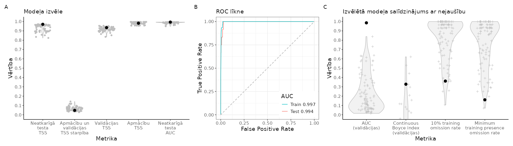
```

<br>

```{r SlieksniAYTFER,echo=FALSE}
suppressPackageStartupMessages(library(kableExtra))
suppressPackageStartupMessages(library(tidyverse))
opts <- options(knitr.kable.NA = "")
slieksni=readxl::read_excel("./Papilddati/BestThresholds/BestThs_AYTFER.xlsx")
tabula=kableExtra::kbl(slieksni, caption = 'Biežāk lietotie projicētās dzīvotņu piemērotības sliekšņa līmeņi un to izvērtējums', 
                    booktabs = TRUE, 
                    longtable = TRUE) 
tabula %>%
  kable_styling(latex_options = "scale_down") %>%
  scroll_box(width = "100%", box_css = "border: 0px;")
```


<br>


```{r HSprojAYTFER, echo=FALSE, out.width = '100%', fig.cap='Labākā modeļa projekcija suga sdzīvotņu piemērotībai. Krāsu skala reprezentē cloglog vērtību no 0 līdz 1, kur starp galapunktiem esošā atzīme ir vienādas sensitivātes un specifiskuma treniņdatos slieksnis iepriekšējā tabulā (izvēlēts vizualizēšanas mērķiem un skaidrošanas ērtumam).'}
  
```

<br>


[**Vēl nē:** Dzīvotņu piemērotība (GeoTIFF)]()

[**Vēl nē:** Par labāko atzītais modelis (krosvalidācijas; *.RDS)]()

[**Vēl nē:** Par labāko atzītais modelis (kombinēts; *.RDS)]()

[**Vēl nē:** Par labāko atzītais modelis (tikai ietekmīgās pazīmes; *.RDS)]()

[**Vēl nē:** Ekoģeogrāfisko mainīgo izvēles gaita, to VIF (savstarpējās prognozētspējas raksturojums) un ietekmes modelī (permutāciju procedūrā) raksturojums (*.xlsx)]()

**Attēls EGV marginālajām atbildēm**

<br>


### AYTFUL - cekulpīle *Aythya fuligula* {#Chapter10.1.010}


```{r NovAtlaseAYTFUL, echo=FALSE, out.width = '100%', fig.cap='Novērojumu atlases gaita un modelēšanā izmantotie cekulpīles *Aythya fuligula* novērojumi un fona punkti: A - novērojumu saglabāšanās atlases gaitā; B - visu pieejamo novērojumu (solis 1) izvietojums; C - ar vismaz iespējamu ligzdošanu skaitītie novēorjumi, kas izturējuši līdz septītā soļa beigām (punkti ir unikālie 1 km kvadrāti, krusti ir unikālie 100 m kvadrāti); D - ar vismaz ticamu ligzdošanu skaitītie novēorjumi, kas izturējuši līdz septītā soļa beigām (punkti ir unikālie 1 km kvadrāti, krusti ir unikālie 100 m kvadrāti); E - ar pierādītu ligzdošanu skaitītie novēorjumi, kas izturējuši līdz septītā soļa beigām (punkti ir unikālie 1 km kvadrāti, krusti ir unikālie 100 m kvadrāti); F - modelēšanā izmantojamā apmācību kopa (punkti ir sugas klātbūtnes, krusti ir fona raksturošanai); G - modelēšanā izmantojamā neatkarīgās testēšanas kopa (punkti ir sugas klātbūtnes, krusti ir fona raksturošanai)'}
knitr::include_graphics("./Atteli/IzvelesAtteli/ObsSelection_AYTFUL.png")
```


<br>


```{r ModelaRaksturojumsAYTFUL, echo=FALSE, out.width = '100%', fig.cap='Labākā modeļa izvēle un uzvērtējums: A - labākā modeļa (ar treknu melnu punktu) salīdzinājums ar citiem pielāgotajiem modeļiem (pelēkie punkti un to sastopamības blīvuma funkcijas); B - labākā modeļa izvērtējums, to salīdzinot ar nejauši ģenerētiem nulles modeļiem (n=100) tajā pašā EGV, klātbūtnez un fona punktu veidotajā informācijas telpā.'}
knitr::include_graphics("./Atteli/Beigam_IzvelesAttels/IzvelesAttels_AYTFUL.png")
```

<br>

```{r SlieksniAYTFUL,echo=FALSE}
suppressPackageStartupMessages(library(kableExtra))
suppressPackageStartupMessages(library(tidyverse))
opts <- options(knitr.kable.NA = "")
slieksni=readxl::read_excel("./Papilddati/BestThresholds/BestThs_AYTFUL.xlsx")
tabula=kableExtra::kbl(slieksni, caption = 'Biežāk lietotie projicētās dzīvotņu piemērotības sliekšņa līmeņi un to izvērtējums', 
                    booktabs = TRUE, 
                    longtable = TRUE) 
tabula %>%
  kable_styling(latex_options = "scale_down") %>%
  scroll_box(width = "100%", box_css = "border: 0px;")
```


<br>


```{r HSprojAYTFUL, echo=FALSE, out.width = '100%', fig.cap='Labākā modeļa projekcija suga sdzīvotņu piemērotībai. Krāsu skala reprezentē cloglog vērtību no 0 līdz 1, kur starp galapunktiem esošā atzīme ir vienādas sensitivātes un specifiskuma treniņdatos slieksnis iepriekšējā tabulā (izvēlēts vizualizēšanas mērķiem un skaidrošanas ērtumam).'}
  knitr::include_graphics("./Atteli/Beigam_KarteNebal/BeiguKarteiNebal_AYTFUL.png")
```

<br>


[**Vēl nē:** Dzīvotņu piemērotība (GeoTIFF)]()

[**Vēl nē:** Par labāko atzītais modelis (krosvalidācijas; *.RDS)]()

[**Vēl nē:** Par labāko atzītais modelis (kombinēts; *.RDS)]()

[**Vēl nē:** Par labāko atzītais modelis (tikai ietekmīgās pazīmes; *.RDS)]()

[**Vēl nē:** Ekoģeogrāfisko mainīgo izvēles gaita, to VIF (savstarpējās prognozētspējas raksturojums) un ietekmes modelī (permutāciju procedūrā) raksturojums (*.xlsx)]()

**Attēls EGV marginālajām atbildēm**

<br>


### SPAQUE - prīkšķe *Spatula querquedula* {#Chapter10.1.011}


```{r NovAtlaseSPAQUE, echo=FALSE, out.width = '100%', fig.cap='Novērojumu atlases gaita un modelēšanā izmantojamie prīkšķes *Spatula querquedula* novērojumi un fona punkti: A - novērojumu saglabāšanās atlases gaitā; B - visu pieejamo novērojumu (solis 1) izvietojums; C - ar vismaz iespējamu ligzdošanu skaitītie novēorjumi, kas izturējuši līdz septītā soļa beigām (punkti ir unikālie 1 km kvadrāti, krusti ir unikālie 100 m kvadrāti); D - ar vismaz ticamu ligzdošanu skaitītie novēorjumi, kas izturējuši līdz septītā soļa beigām (punkti ir unikālie 1 km kvadrāti, krusti ir unikālie 100 m kvadrāti); E - ar pierādītu ligzdošanu skaitītie novēorjumi, kas izturējuši līdz septītā soļa beigām (punkti ir unikālie 1 km kvadrāti, krusti ir unikālie 100 m kvadrāti); F - modelēšanā izmantojamā apmācību kopa (punkti ir sugas klātbūtnes, krusti ir fona raksturošanai); G - modelēšanā izmantojamā neatkarīgās testēšanas kopa (punkti ir sugas klātbūtnes, krusti ir fona raksturošanai)'}
knitr::include_graphics("./Atteli/IzvelesAtteli/ObsSelection_SPAQUE.png")
```


<br>


```{r ModelaRaksturojumsSPAQUE, echo=FALSE, out.width = '100%', fig.cap='Labākā modeļa izvēle un uzvērtējums: A - labākā modeļa (ar treknu melnu punktu) salīdzinājums ar citiem pielāgotajiem modeļiem (pelēkie punkti un to sastopamības blīvuma funkcijas); B - labākā modeļa izvērtējums, to salīdzinot ar nejauši ģenerētiem nulles modeļiem (n=100) tajā pašā EGV, klātbūtnez un fona punktu veidotajā informācijas telpā.'}
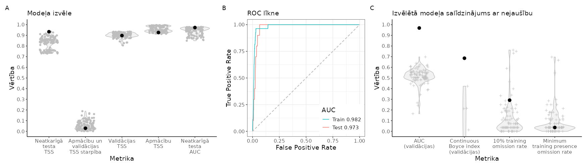
```

<br>

```{r SlieksniSPAQUE,echo=FALSE}
suppressPackageStartupMessages(library(kableExtra))
suppressPackageStartupMessages(library(tidyverse))
opts <- options(knitr.kable.NA = "")
slieksni=readxl::read_excel("./Papilddati/BestThresholds/BestThs_SPAQUE.xlsx")
tabula=kableExtra::kbl(slieksni, caption = 'Biežāk lietotie projicētās dzīvotņu piemērotības sliekšņa līmeņi un to izvērtējums', 
                    booktabs = TRUE, 
                    longtable = TRUE) 
tabula %>%
  kable_styling(latex_options = "scale_down") %>%
  scroll_box(width = "100%", box_css = "border: 0px;")
```


<br>


```{r HSprojSPAQUE, echo=FALSE, out.width = '100%', fig.cap='Labākā modeļa projekcija suga sdzīvotņu piemērotībai. Krāsu skala reprezentē cloglog vērtību no 0 līdz 1, kur starp galapunktiem esošā atzīme ir vienādas sensitivātes un specifiskuma treniņdatos slieksnis iepriekšējā tabulā (izvēlēts vizualizēšanas mērķiem un skaidrošanas ērtumam).'}
  
```

<br>


[**Vēl nē:** Dzīvotņu piemērotība (GeoTIFF)]()

[**Vēl nē:** Par labāko atzītais modelis (krosvalidācijas; *.RDS)]()

[**Vēl nē:** Par labāko atzītais modelis (kombinēts; *.RDS)]()

[**Vēl nē:** Par labāko atzītais modelis (tikai ietekmīgās pazīmes; *.RDS)]()

[**Vēl nē:** Ekoģeogrāfisko mainīgo izvēles gaita, to VIF (savstarpējās prognozētspējas raksturojums) un ietekmes modelī (permutāciju procedūrā) raksturojums (*.xlsx)]()

**Attēls EGV marginālajām atbildēm**

<br>


### SPACLY - platknābis *Spatula clypeata* {#Chapter10.1.012}


```{r NovAtlaseSPACLY, echo=FALSE, out.width = '100%', fig.cap='Novērojumu atlases gaita un modelēšanā izmantojamie platknābja *Spatula clypeata* novērojumi un fona punkti: A - novērojumu saglabāšanās atlases gaitā; B - visu pieejamo novērojumu (solis 1) izvietojums; C - ar vismaz iespējamu ligzdošanu skaitītie novēorjumi, kas izturējuši līdz septītā soļa beigām (punkti ir unikālie 1 km kvadrāti, krusti ir unikālie 100 m kvadrāti); D - ar vismaz ticamu ligzdošanu skaitītie novēorjumi, kas izturējuši līdz septītā soļa beigām (punkti ir unikālie 1 km kvadrāti, krusti ir unikālie 100 m kvadrāti); E - ar pierādītu ligzdošanu skaitītie novēorjumi, kas izturējuši līdz septītā soļa beigām (punkti ir unikālie 1 km kvadrāti, krusti ir unikālie 100 m kvadrāti); F - modelēšanā izmantojamā apmācību kopa (punkti ir sugas klātbūtnes, krusti ir fona raksturošanai); G - modelēšanā izmantojamā neatkarīgās testēšanas kopa (punkti ir sugas klātbūtnes, krusti ir fona raksturošanai)'}
knitr::include_graphics("./Atteli/IzvelesAtteli/ObsSelection_SPACLY.png")
```


<br>


```{r ModelaRaksturojumsSPACLY, echo=FALSE, out.width = '100%', fig.cap='Labākā modeļa izvēle un uzvērtējums: A - labākā modeļa (ar treknu melnu punktu) salīdzinājums ar citiem pielāgotajiem modeļiem (pelēkie punkti un to sastopamības blīvuma funkcijas); B - labākā modeļa izvērtējums, to salīdzinot ar nejauši ģenerētiem nulles modeļiem (n=100) tajā pašā EGV, klātbūtnez un fona punktu veidotajā informācijas telpā.'}
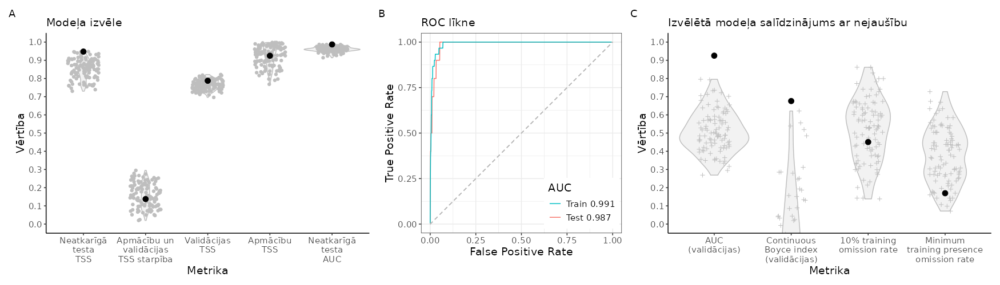
```

<br>

```{r SlieksniSPACLY,echo=FALSE}
suppressPackageStartupMessages(library(kableExtra))
suppressPackageStartupMessages(library(tidyverse))
opts <- options(knitr.kable.NA = "")
slieksni=readxl::read_excel("./Papilddati/BestThresholds/BestThs_SPACLY.xlsx")
tabula=kableExtra::kbl(slieksni, caption = 'Biežāk lietotie projicētās dzīvotņu piemērotības sliekšņa līmeņi un to izvērtējums', 
                    booktabs = TRUE, 
                    longtable = TRUE) 
tabula %>%
  kable_styling(latex_options = "scale_down") %>%
  scroll_box(width = "100%", box_css = "border: 0px;")
```


<br>


```{r HSprojSPACLY, echo=FALSE, out.width = '100%', fig.cap='Labākā modeļa projekcija suga sdzīvotņu piemērotībai. Krāsu skala reprezentē cloglog vērtību no 0 līdz 1, kur starp galapunktiem esošā atzīme ir vienādas sensitivātes un specifiskuma treniņdatos slieksnis iepriekšējā tabulā (izvēlēts vizualizēšanas mērķiem un skaidrošanas ērtumam).'}
  knitr::include_graphics("./Atteli/Beigam_KarteNebal/BeiguKarteiNebal_SPACLY.png")
```

<br>


[**Vēl nē:** Dzīvotņu piemērotība (GeoTIFF)]()

[**Vēl nē:** Par labāko atzītais modelis (krosvalidācijas; *.RDS)]()

[**Vēl nē:** Par labāko atzītais modelis (kombinēts; *.RDS)]()

[**Vēl nē:** Par labāko atzītais modelis (tikai ietekmīgās pazīmes; *.RDS)]()

[**Vēl nē:** Ekoģeogrāfisko mainīgo izvēles gaita, to VIF (savstarpējās prognozētspējas raksturojums) un ietekmes modelī (permutāciju procedūrā) raksturojums (*.xlsx)]()

**Attēls EGV marginālajām atbildēm**

<br>


### MARSTR - pelēkā pīle *Mareca strepera* {#Chapter10.1.013}


```{r NovAtlaseMARSTR, echo=FALSE, out.width = '100%', fig.cap='Novērojumu atlases gaita un modelēšanā izmantojamie pelēkās pīles *Mareca strepera* novērojumi un fona punkti: A - novērojumu saglabāšanās atlases gaitā; B - visu pieejamo novērojumu (solis 1) izvietojums; C - ar vismaz iespējamu ligzdošanu skaitītie novēorjumi, kas izturējuši līdz septītā soļa beigām (punkti ir unikālie 1 km kvadrāti, krusti ir unikālie 100 m kvadrāti); D - ar vismaz ticamu ligzdošanu skaitītie novēorjumi, kas izturējuši līdz septītā soļa beigām (punkti ir unikālie 1 km kvadrāti, krusti ir unikālie 100 m kvadrāti); E - ar pierādītu ligzdošanu skaitītie novēorjumi, kas izturējuši līdz septītā soļa beigām (punkti ir unikālie 1 km kvadrāti, krusti ir unikālie 100 m kvadrāti); F - modelēšanā izmantojamā apmācību kopa (punkti ir sugas klātbūtnes, krusti ir fona raksturošanai); G - modelēšanā izmantojamā neatkarīgās testēšanas kopa (punkti ir sugas klātbūtnes, krusti ir fona raksturošanai)'}

```


<br>


```{r ModelaRaksturojumsMARSTR, echo=FALSE, out.width = '100%', fig.cap='Labākā modeļa izvēle un uzvērtējums: A - labākā modeļa (ar treknu melnu punktu) salīdzinājums ar citiem pielāgotajiem modeļiem (pelēkie punkti un to sastopamības blīvuma funkcijas); B - labākā modeļa izvērtējums, to salīdzinot ar nejauši ģenerētiem nulles modeļiem (n=100) tajā pašā EGV, klātbūtnez un fona punktu veidotajā informācijas telpā.'}
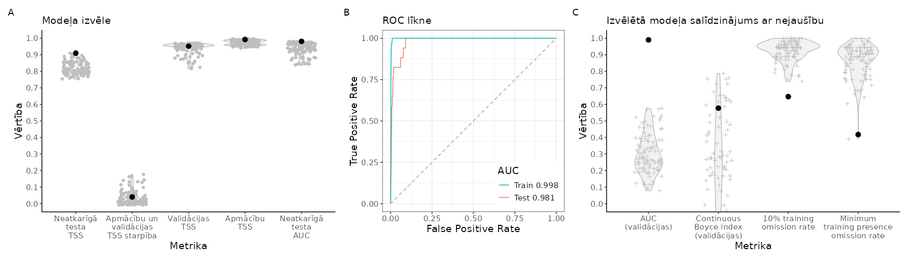
```

<br>

```{r SlieksniMARSTR,echo=FALSE}
suppressPackageStartupMessages(library(kableExtra))
suppressPackageStartupMessages(library(tidyverse))
opts <- options(knitr.kable.NA = "")
slieksni=readxl::read_excel("./Papilddati/BestThresholds/BestThs_MARSTR.xlsx")
tabula=kableExtra::kbl(slieksni, caption = 'Biežāk lietotie projicētās dzīvotņu piemērotības sliekšņa līmeņi un to izvērtējums', 
                    booktabs = TRUE, 
                    longtable = TRUE) 
tabula %>%
  kable_styling(latex_options = "scale_down") %>%
  scroll_box(width = "100%", box_css = "border: 0px;")
```


<br>


```{r HSprojMARSTR, echo=FALSE, out.width = '100%', fig.cap='Labākā modeļa projekcija suga sdzīvotņu piemērotībai. Krāsu skala reprezentē cloglog vērtību no 0 līdz 1, kur starp galapunktiem esošā atzīme ir vienādas sensitivātes un specifiskuma treniņdatos slieksnis iepriekšējā tabulā (izvēlēts vizualizēšanas mērķiem un skaidrošanas ērtumam).'}
  knitr::include_graphics("./Atteli/Beigam_KarteNebal/BeiguKarteiNebal_MARSTR.png")
```

<br>


[**Vēl nē:** Dzīvotņu piemērotība (GeoTIFF)]()

[**Vēl nē:** Par labāko atzītais modelis (krosvalidācijas; *.RDS)]()

[**Vēl nē:** Par labāko atzītais modelis (kombinēts; *.RDS)]()

[**Vēl nē:** Par labāko atzītais modelis (tikai ietekmīgās pazīmes; *.RDS)]()

[**Vēl nē:** Ekoģeogrāfisko mainīgo izvēles gaita, to VIF (savstarpējās prognozētspējas raksturojums) un ietekmes modelī (permutāciju procedūrā) raksturojums (*.xlsx)]()

**Attēls EGV marginālajām atbildēm**

<br>


### MARPEN - baltvēderis *Mareca penelope* {#Chapter10.1.014}


```{r NovAtlaseMARPEN, echo=FALSE, out.width = '100%', fig.cap='Novērojumu atlases gaita un modelēšanā izmantojamie baltvēdera *Mareca penelope* novērojumi un fona punkti: A - novērojumu saglabāšanās atlases gaitā; B - visu pieejamo novērojumu (solis 1) izvietojums; C - ar vismaz iespējamu ligzdošanu skaitītie novēorjumi, kas izturējuši līdz septītā soļa beigām (punkti ir unikālie 1 km kvadrāti, krusti ir unikālie 100 m kvadrāti); D - ar vismaz ticamu ligzdošanu skaitītie novēorjumi, kas izturējuši līdz septītā soļa beigām (punkti ir unikālie 1 km kvadrāti, krusti ir unikālie 100 m kvadrāti); E - ar pierādītu ligzdošanu skaitītie novēorjumi, kas izturējuši līdz septītā soļa beigām (punkti ir unikālie 1 km kvadrāti, krusti ir unikālie 100 m kvadrāti); F - modelēšanā izmantojamā apmācību kopa (punkti ir sugas klātbūtnes, krusti ir fona raksturošanai); G - modelēšanā izmantojamā neatkarīgās testēšanas kopa (punkti ir sugas klātbūtnes, krusti ir fona raksturošanai)'}
knitr::include_graphics("./Atteli/IzvelesAtteli/ObsSelection_MARPEN.png")
```


<br>


```{r ModelaRaksturojumsMARPEN, echo=FALSE, out.width = '100%', fig.cap='Labākā modeļa izvēle un uzvērtējums: A - labākā modeļa (ar treknu melnu punktu) salīdzinājums ar citiem pielāgotajiem modeļiem (pelēkie punkti un to sastopamības blīvuma funkcijas); B - labākā modeļa izvērtējums, to salīdzinot ar nejauši ģenerētiem nulles modeļiem (n=100) tajā pašā EGV, klātbūtnez un fona punktu veidotajā informācijas telpā.'}
knitr::include_graphics("./Atteli/Beigam_IzvelesAttels/IzvelesAttels_MARPEN.png")
```

<br>

```{r SlieksniMARPEN,echo=FALSE}
suppressPackageStartupMessages(library(kableExtra))
suppressPackageStartupMessages(library(tidyverse))
opts <- options(knitr.kable.NA = "")
slieksni=readxl::read_excel("./Papilddati/BestThresholds/BestThs_MARPEN.xlsx")
tabula=kableExtra::kbl(slieksni, caption = 'Biežāk lietotie projicētās dzīvotņu piemērotības sliekšņa līmeņi un to izvērtējums', 
                    booktabs = TRUE, 
                    longtable = TRUE) 
tabula %>%
  kable_styling(latex_options = "scale_down") %>%
  scroll_box(width = "100%", box_css = "border: 0px;")
```


<br>


```{r HSprojMARPEN, echo=FALSE, out.width = '100%', fig.cap='Labākā modeļa projekcija suga sdzīvotņu piemērotībai. Krāsu skala reprezentē cloglog vērtību no 0 līdz 1, kur starp galapunktiem esošā atzīme ir vienādas sensitivātes un specifiskuma treniņdatos slieksnis iepriekšējā tabulā (izvēlēts vizualizēšanas mērķiem un skaidrošanas ērtumam).'}
  knitr::include_graphics("./Atteli/Beigam_KarteNebal/BeiguKarteiNebal_MARPEN.png")
```

<br>


[**Vēl nē:** Dzīvotņu piemērotība (GeoTIFF)]()

[**Vēl nē:** Par labāko atzītais modelis (krosvalidācijas; *.RDS)]()

[**Vēl nē:** Par labāko atzītais modelis (kombinēts; *.RDS)]()

[**Vēl nē:** Par labāko atzītais modelis (tikai ietekmīgās pazīmes; *.RDS)]()

[**Vēl nē:** Ekoģeogrāfisko mainīgo izvēles gaita, to VIF (savstarpējās prognozētspējas raksturojums) un ietekmes modelī (permutāciju procedūrā) raksturojums (*.xlsx)]()

**Attēls EGV marginālajām atbildēm**

<br>


### TACRUF - mazais dūkuris *Tachybaptus ruficollis* {#Chapter10.1.015}


```{r NovAtlaseTACRUF, echo=FALSE, out.width = '100%', fig.cap='Novērojumu atlases gaita un modelēšanā izmantojamie mazā dūkura *Tachybaptus ruficollis* novērojumi un fona punkti: A - novērojumu saglabāšanās atlases gaitā; B - visu pieejamo novērojumu (solis 1) izvietojums; C - ar vismaz iespējamu ligzdošanu skaitītie novēorjumi, kas izturējuši līdz septītā soļa beigām (punkti ir unikālie 1 km kvadrāti, krusti ir unikālie 100 m kvadrāti); D - ar vismaz ticamu ligzdošanu skaitītie novēorjumi, kas izturējuši līdz septītā soļa beigām (punkti ir unikālie 1 km kvadrāti, krusti ir unikālie 100 m kvadrāti); E - ar pierādītu ligzdošanu skaitītie novēorjumi, kas izturējuši līdz septītā soļa beigām (punkti ir unikālie 1 km kvadrāti, krusti ir unikālie 100 m kvadrāti); F - modelēšanā izmantojamā apmācību kopa (punkti ir sugas klātbūtnes, krusti ir fona raksturošanai); G - modelēšanā izmantojamā neatkarīgās testēšanas kopa (punkti ir sugas klātbūtnes, krusti ir fona raksturošanai)'}

```


<br>


```{r ModelaRaksturojumsTACRUF, echo=FALSE, out.width = '100%', fig.cap='Labākā modeļa izvēle un uzvērtējums: A - labākā modeļa (ar treknu melnu punktu) salīdzinājums ar citiem pielāgotajiem modeļiem (pelēkie punkti un to sastopamības blīvuma funkcijas); B - labākā modeļa izvērtējums, to salīdzinot ar nejauši ģenerētiem nulles modeļiem (n=100) tajā pašā EGV, klātbūtnez un fona punktu veidotajā informācijas telpā.'}
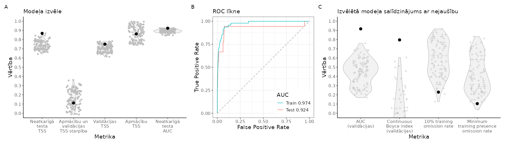
```

<br>

```{r SlieksniTACRUF,echo=FALSE}
suppressPackageStartupMessages(library(kableExtra))
suppressPackageStartupMessages(library(tidyverse))
opts <- options(knitr.kable.NA = "")
slieksni=readxl::read_excel("./Papilddati/BestThresholds/BestThs_TACRUF.xlsx")
tabula=kableExtra::kbl(slieksni, caption = 'Biežāk lietotie projicētās dzīvotņu piemērotības sliekšņa līmeņi un to izvērtējums', 
                    booktabs = TRUE, 
                    longtable = TRUE) 
tabula %>%
  kable_styling(latex_options = "scale_down") %>%
  scroll_box(width = "100%", box_css = "border: 0px;")
```


<br>


```{r HSprojTACRUF, echo=FALSE, out.width = '100%', fig.cap='Labākā modeļa projekcija suga sdzīvotņu piemērotībai. Krāsu skala reprezentē cloglog vērtību no 0 līdz 1, kur starp galapunktiem esošā atzīme ir vienādas sensitivātes un specifiskuma treniņdatos slieksnis iepriekšējā tabulā (izvēlēts vizualizēšanas mērķiem un skaidrošanas ērtumam).'}
  knitr::include_graphics("./Atteli/Beigam_KarteNebal/BeiguKarteiNebal_TACRUF.png")
```

<br>


[**Vēl nē:** Dzīvotņu piemērotība (GeoTIFF)]()

[**Vēl nē:** Par labāko atzītais modelis (krosvalidācijas; *.RDS)]()

[**Vēl nē:** Par labāko atzītais modelis (kombinēts; *.RDS)]()

[**Vēl nē:** Par labāko atzītais modelis (tikai ietekmīgās pazīmes; *.RDS)]()

[**Vēl nē:** Ekoģeogrāfisko mainīgo izvēles gaita, to VIF (savstarpējās prognozētspējas raksturojums) un ietekmes modelī (permutāciju procedūrā) raksturojums (*.xlsx)]()

**Attēls EGV marginālajām atbildēm**

<br>


### PODGRI - pelēkvaigu dūkuris *Podiceps grisegena* {#Chapter10.1.016}


```{r NovAtlasePODGRI, echo=FALSE, out.width = '100%', fig.cap='Novērojumu atlases gaita un modelēšanā izmantojamie pelēkvaigu dūkura *Podiceps grisegena* novērojumi un fona punkti: A - novērojumu saglabāšanās atlases gaitā; B - visu pieejamo novērojumu (solis 1) izvietojums; C - ar vismaz iespējamu ligzdošanu skaitītie novēorjumi, kas izturējuši līdz septītā soļa beigām (punkti ir unikālie 1 km kvadrāti, krusti ir unikālie 100 m kvadrāti); D - ar vismaz ticamu ligzdošanu skaitītie novēorjumi, kas izturējuši līdz septītā soļa beigām (punkti ir unikālie 1 km kvadrāti, krusti ir unikālie 100 m kvadrāti); E - ar pierādītu ligzdošanu skaitītie novēorjumi, kas izturējuši līdz septītā soļa beigām (punkti ir unikālie 1 km kvadrāti, krusti ir unikālie 100 m kvadrāti); F - modelēšanā izmantojamā apmācību kopa (punkti ir sugas klātbūtnes, krusti ir fona raksturošanai); G - modelēšanā izmantojamā neatkarīgās testēšanas kopa (punkti ir sugas klātbūtnes, krusti ir fona raksturošanai)'}
knitr::include_graphics("./Atteli/IzvelesAtteli/ObsSelection_PODGRI.png")
```


<br>


```{r ModelaRaksturojumsPODGRI, echo=FALSE, out.width = '100%', fig.cap='Labākā modeļa izvēle un uzvērtējums: A - labākā modeļa (ar treknu melnu punktu) salīdzinājums ar citiem pielāgotajiem modeļiem (pelēkie punkti un to sastopamības blīvuma funkcijas); B - labākā modeļa izvērtējums, to salīdzinot ar nejauši ģenerētiem nulles modeļiem (n=100) tajā pašā EGV, klātbūtnez un fona punktu veidotajā informācijas telpā.'}
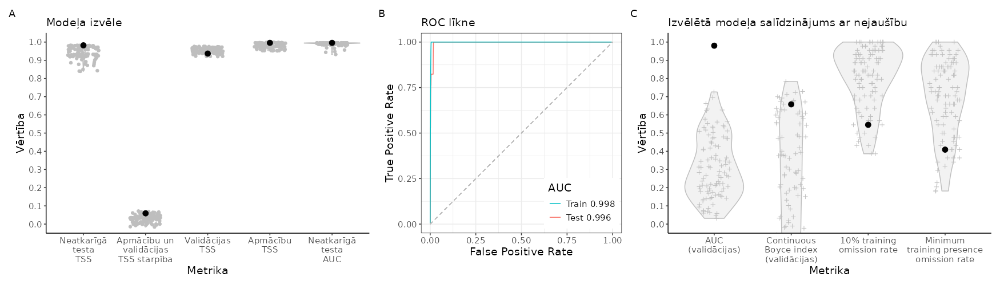
```

<br>

```{r SlieksniPODGRI,echo=FALSE}
suppressPackageStartupMessages(library(kableExtra))
suppressPackageStartupMessages(library(tidyverse))
opts <- options(knitr.kable.NA = "")
slieksni=readxl::read_excel("./Papilddati/BestThresholds/BestThs_PODGRI.xlsx")
tabula=kableExtra::kbl(slieksni, caption = 'Biežāk lietotie projicētās dzīvotņu piemērotības sliekšņa līmeņi un to izvērtējums', 
                    booktabs = TRUE, 
                    longtable = TRUE) 
tabula %>%
  kable_styling(latex_options = "scale_down") %>%
  scroll_box(width = "100%", box_css = "border: 0px;")
```


<br>


```{r HSprojPODGRI, echo=FALSE, out.width = '100%', fig.cap='Labākā modeļa projekcija suga sdzīvotņu piemērotībai. Krāsu skala reprezentē cloglog vērtību no 0 līdz 1, kur starp galapunktiem esošā atzīme ir vienādas sensitivātes un specifiskuma treniņdatos slieksnis iepriekšējā tabulā (izvēlēts vizualizēšanas mērķiem un skaidrošanas ērtumam).'}
  knitr::include_graphics("./Atteli/Beigam_KarteNebal/BeiguKarteiNebal_PODGRI.png")
```

<br>


[**Vēl nē:** Dzīvotņu piemērotība (GeoTIFF)]()

[**Vēl nē:** Par labāko atzītais modelis (krosvalidācijas; *.RDS)]()

[**Vēl nē:** Par labāko atzītais modelis (kombinēts; *.RDS)]()

[**Vēl nē:** Par labāko atzītais modelis (tikai ietekmīgās pazīmes; *.RDS)]()

[**Vēl nē:** Ekoģeogrāfisko mainīgo izvēles gaita, to VIF (savstarpējās prognozētspējas raksturojums) un ietekmes modelī (permutāciju procedūrā) raksturojums (*.xlsx)]()

**Attēls EGV marginālajām atbildēm**

<br>


### PODCRI - cekuldūkuris *Podiceps cristatus* {#Chapter10.1.017}


```{r NovAtlasePODCRI, echo=FALSE, out.width = '100%', fig.cap='Novērojumu atlases gaita un modelēšanā izmantojamie cekuldūkura *Podiceps cristatus* novērojumi un fona punkti: A - novērojumu saglabāšanās atlases gaitā; B - visu pieejamo novērojumu (solis 1) izvietojums; C - ar vismaz iespējamu ligzdošanu skaitītie novēorjumi, kas izturējuši līdz septītā soļa beigām (punkti ir unikālie 1 km kvadrāti, krusti ir unikālie 100 m kvadrāti); D - ar vismaz ticamu ligzdošanu skaitītie novēorjumi, kas izturējuši līdz septītā soļa beigām (punkti ir unikālie 1 km kvadrāti, krusti ir unikālie 100 m kvadrāti); E - ar pierādītu ligzdošanu skaitītie novēorjumi, kas izturējuši līdz septītā soļa beigām (punkti ir unikālie 1 km kvadrāti, krusti ir unikālie 100 m kvadrāti); F - modelēšanā izmantojamā apmācību kopa (punkti ir sugas klātbūtnes, krusti ir fona raksturošanai); G - modelēšanā izmantojamā neatkarīgās testēšanas kopa (punkti ir sugas klātbūtnes, krusti ir fona raksturošanai)'}
knitr::include_graphics("./Atteli/IzvelesAtteli/ObsSelection_PODCRI.png")
```


<br>


```{r ModelaRaksturojumsPODCRI, echo=FALSE, out.width = '100%', fig.cap='Labākā modeļa izvēle un uzvērtējums: A - labākā modeļa (ar treknu melnu punktu) salīdzinājums ar citiem pielāgotajiem modeļiem (pelēkie punkti un to sastopamības blīvuma funkcijas); B - labākā modeļa izvērtējums, to salīdzinot ar nejauši ģenerētiem nulles modeļiem (n=100) tajā pašā EGV, klātbūtnez un fona punktu veidotajā informācijas telpā.'}
knitr::include_graphics("./Atteli/Beigam_IzvelesAttels/IzvelesAttels_PODCRI.png")
```

<br>

```{r SlieksniPODCRI,echo=FALSE}
suppressPackageStartupMessages(library(kableExtra))
suppressPackageStartupMessages(library(tidyverse))
opts <- options(knitr.kable.NA = "")
slieksni=readxl::read_excel("./Papilddati/BestThresholds/BestThs_PODCRI.xlsx")
tabula=kableExtra::kbl(slieksni, caption = 'Biežāk lietotie projicētās dzīvotņu piemērotības sliekšņa līmeņi un to izvērtējums', 
                    booktabs = TRUE, 
                    longtable = TRUE) 
tabula %>%
  kable_styling(latex_options = "scale_down") %>%
  scroll_box(width = "100%", box_css = "border: 0px;")
```


<br>


```{r HSprojPODCRI, echo=FALSE, out.width = '100%', fig.cap='Labākā modeļa projekcija suga sdzīvotņu piemērotībai. Krāsu skala reprezentē cloglog vērtību no 0 līdz 1, kur starp galapunktiem esošā atzīme ir vienādas sensitivātes un specifiskuma treniņdatos slieksnis iepriekšējā tabulā (izvēlēts vizualizēšanas mērķiem un skaidrošanas ērtumam).'}
  knitr::include_graphics("./Atteli/Beigam_KarteNebal/BeiguKarteiNebal_PODCRI.png")
```

<br>


[**Vēl nē:** Dzīvotņu piemērotība (GeoTIFF)]()

[**Vēl nē:** Par labāko atzītais modelis (krosvalidācijas; *.RDS)]()

[**Vēl nē:** Par labāko atzītais modelis (kombinēts; *.RDS)]()

[**Vēl nē:** Par labāko atzītais modelis (tikai ietekmīgās pazīmes; *.RDS)]()

[**Vēl nē:** Ekoģeogrāfisko mainīgo izvēles gaita, to VIF (savstarpējās prognozētspējas raksturojums) un ietekmes modelī (permutāciju procedūrā) raksturojums (*.xlsx)]()

**Attēls EGV marginālajām atbildēm**

<br>


### STRTUR - parastā ūbele *Streptopelia turtur* {#Chapter10.1.018}


```{r NovAtlaseSTRTUR, echo=FALSE, out.width = '100%', fig.cap='Novērojumu atlases gaita un modelēšanā izmantojamie parastās ūbeles *Streptopelia turtur* novērojumi un fona punkti: A - novērojumu saglabāšanās atlases gaitā; B - visu pieejamo novērojumu (solis 1) izvietojums; C - ar vismaz iespējamu ligzdošanu skaitītie novēorjumi, kas izturējuši līdz septītā soļa beigām (punkti ir unikālie 1 km kvadrāti, krusti ir unikālie 100 m kvadrāti); D - ar vismaz ticamu ligzdošanu skaitītie novēorjumi, kas izturējuši līdz septītā soļa beigām (punkti ir unikālie 1 km kvadrāti, krusti ir unikālie 100 m kvadrāti); E - ar pierādītu ligzdošanu skaitītie novēorjumi, kas izturējuši līdz septītā soļa beigām (punkti ir unikālie 1 km kvadrāti, krusti ir unikālie 100 m kvadrāti); F - modelēšanā izmantojamā apmācību kopa (punkti ir sugas klātbūtnes, krusti ir fona raksturošanai); G - modelēšanā izmantojamā neatkarīgās testēšanas kopa (punkti ir sugas klātbūtnes, krusti ir fona raksturošanai)'}

```


<br>


```{r ModelaRaksturojumsSTRTUR, echo=FALSE, out.width = '100%', fig.cap='Labākā modeļa izvēle un uzvērtējums: A - labākā modeļa (ar treknu melnu punktu) salīdzinājums ar citiem pielāgotajiem modeļiem (pelēkie punkti un to sastopamības blīvuma funkcijas); B - labākā modeļa izvērtējums, to salīdzinot ar nejauši ģenerētiem nulles modeļiem (n=100) tajā pašā EGV, klātbūtnez un fona punktu veidotajā informācijas telpā.'}
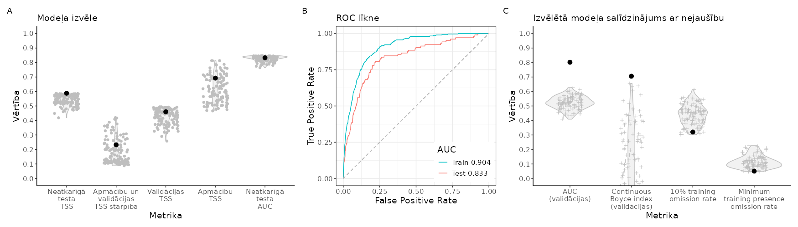
```

<br>

```{r SlieksniSTRTUR,echo=FALSE}
suppressPackageStartupMessages(library(kableExtra))
suppressPackageStartupMessages(library(tidyverse))
opts <- options(knitr.kable.NA = "")
slieksni=readxl::read_excel("./Papilddati/BestThresholds/BestThs_STRTUR.xlsx")
tabula=kableExtra::kbl(slieksni, caption = 'Biežāk lietotie projicētās dzīvotņu piemērotības sliekšņa līmeņi un to izvērtējums', 
                    booktabs = TRUE, 
                    longtable = TRUE) 
tabula %>%
  kable_styling(latex_options = "scale_down") %>%
  scroll_box(width = "100%", box_css = "border: 0px;")
```


<br>


```{r HSprojSTRTUR, echo=FALSE, out.width = '100%', fig.cap='Labākā modeļa projekcija suga sdzīvotņu piemērotībai. Krāsu skala reprezentē cloglog vērtību no 0 līdz 1, kur starp galapunktiem esošā atzīme ir vienādas sensitivātes un specifiskuma treniņdatos slieksnis iepriekšējā tabulā (izvēlēts vizualizēšanas mērķiem un skaidrošanas ērtumam).'}
  knitr::include_graphics("./Atteli/Beigam_KarteNebal/BeiguKarteiNebal_STRTUR.png")
```

<br>


[**Vēl nē:** Dzīvotņu piemērotība (GeoTIFF)]()

[**Vēl nē:** Par labāko atzītais modelis (krosvalidācijas; *.RDS)]()

[**Vēl nē:** Par labāko atzītais modelis (kombinēts; *.RDS)]()

[**Vēl nē:** Par labāko atzītais modelis (tikai ietekmīgās pazīmes; *.RDS)]()

[**Vēl nē:** Ekoģeogrāfisko mainīgo izvēles gaita, to VIF (savstarpējās prognozētspējas raksturojums) un ietekmes modelī (permutāciju procedūrā) raksturojums (*.xlsx)]()

**Attēls EGV marginālajām atbildēm**

<br>


### CAPEUR - vakarlēpis *Caprimulgus europaeus* {#Chapter10.1.019}


```{r NovAtlaseCAPEUR, echo=FALSE, out.width = '100%', fig.cap='Novērojumu atlases gaita un modelēšanā izmantojamie vakarlēpja *Caprimulgus europaeus* novērojumi un fona punkti: A - novērojumu saglabāšanās atlases gaitā; B - visu pieejamo novērojumu (solis 1) izvietojums; C - ar vismaz iespējamu ligzdošanu skaitītie novēorjumi, kas izturējuši līdz septītā soļa beigām (punkti ir unikālie 1 km kvadrāti, krusti ir unikālie 100 m kvadrāti); D - ar vismaz ticamu ligzdošanu skaitītie novēorjumi, kas izturējuši līdz septītā soļa beigām (punkti ir unikālie 1 km kvadrāti, krusti ir unikālie 100 m kvadrāti); E - ar pierādītu ligzdošanu skaitītie novēorjumi, kas izturējuši līdz septītā soļa beigām (punkti ir unikālie 1 km kvadrāti, krusti ir unikālie 100 m kvadrāti); F - modelēšanā izmantojamā apmācību kopa (punkti ir sugas klātbūtnes, krusti ir fona raksturošanai); G - modelēšanā izmantojamā neatkarīgās testēšanas kopa (punkti ir sugas klātbūtnes, krusti ir fona raksturošanai)'}

```


<br>


```{r ModelaRaksturojumsCAPEUR, echo=FALSE, out.width = '100%', fig.cap='Labākā modeļa izvēle un uzvērtējums: A - labākā modeļa (ar treknu melnu punktu) salīdzinājums ar citiem pielāgotajiem modeļiem (pelēkie punkti un to sastopamības blīvuma funkcijas); B - labākā modeļa izvērtējums, to salīdzinot ar nejauši ģenerētiem nulles modeļiem (n=100) tajā pašā EGV, klātbūtnez un fona punktu veidotajā informācijas telpā.'}
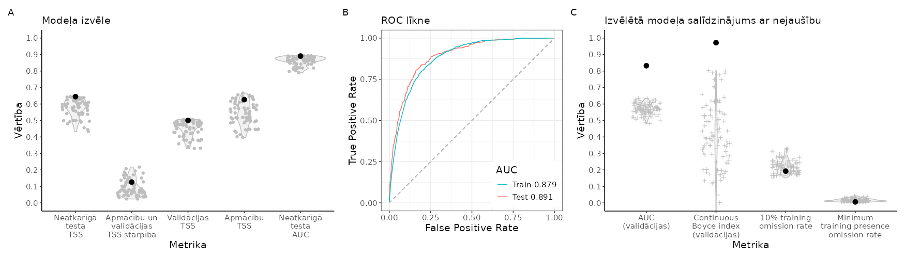
```

<br>

```{r SlieksniCAPEUR,echo=FALSE}
suppressPackageStartupMessages(library(kableExtra))
suppressPackageStartupMessages(library(tidyverse))
opts <- options(knitr.kable.NA = "")
slieksni=readxl::read_excel("./Papilddati/BestThresholds/BestThs_CAPEUR.xlsx")
tabula=kableExtra::kbl(slieksni, caption = 'Biežāk lietotie projicētās dzīvotņu piemērotības sliekšņa līmeņi un to izvērtējums', 
                    booktabs = TRUE, 
                    longtable = TRUE) 
tabula %>%
  kable_styling(latex_options = "scale_down") %>%
  scroll_box(width = "100%", box_css = "border: 0px;")
```


<br>


```{r HSprojCAPEUR, echo=FALSE, out.width = '100%', fig.cap='Labākā modeļa projekcija suga sdzīvotņu piemērotībai. Krāsu skala reprezentē cloglog vērtību no 0 līdz 1, kur starp galapunktiem esošā atzīme ir vienādas sensitivātes un specifiskuma treniņdatos slieksnis iepriekšējā tabulā (izvēlēts vizualizēšanas mērķiem un skaidrošanas ērtumam).'}
  knitr::include_graphics("./Atteli/Beigam_KarteNebal/BeiguKarteiNebal_CAPEUR.png")
```

<br>


[**Vēl nē:** Dzīvotņu piemērotība (GeoTIFF)]()

[**Vēl nē:** Par labāko atzītais modelis (krosvalidācijas; *.RDS)]()

[**Vēl nē:** Par labāko atzītais modelis (kombinēts; *.RDS)]()

[**Vēl nē:** Par labāko atzītais modelis (tikai ietekmīgās pazīmes; *.RDS)]()

[**Vēl nē:** Ekoģeogrāfisko mainīgo izvēles gaita, to VIF (savstarpējās prognozētspējas raksturojums) un ietekmes modelī (permutāciju procedūrā) raksturojums (*.xlsx)]()

**Attēls EGV marginālajām atbildēm**

<br>


### RALAQU - dumbrcālis *Rallus aquaticus* {#Chapter10.1.020}


```{r NovAtlaseRALAQU, echo=FALSE, out.width = '100%', fig.cap='Novērojumu atlases gaita un modelēšanā izmantojamie dumbrcāļa *Rallus aquaticus* novērojumi un fona punkti: A - novērojumu saglabāšanās atlases gaitā; B - visu pieejamo novērojumu (solis 1) izvietojums; C - ar vismaz iespējamu ligzdošanu skaitītie novēorjumi, kas izturējuši līdz septītā soļa beigām (punkti ir unikālie 1 km kvadrāti, krusti ir unikālie 100 m kvadrāti); D - ar vismaz ticamu ligzdošanu skaitītie novēorjumi, kas izturējuši līdz septītā soļa beigām (punkti ir unikālie 1 km kvadrāti, krusti ir unikālie 100 m kvadrāti); E - ar pierādītu ligzdošanu skaitītie novēorjumi, kas izturējuši līdz septītā soļa beigām (punkti ir unikālie 1 km kvadrāti, krusti ir unikālie 100 m kvadrāti); F - modelēšanā izmantojamā apmācību kopa (punkti ir sugas klātbūtnes, krusti ir fona raksturošanai); G - modelēšanā izmantojamā neatkarīgās testēšanas kopa (punkti ir sugas klātbūtnes, krusti ir fona raksturošanai)'}

```


<br>


```{r ModelaRaksturojumsRALAQU, echo=FALSE, out.width = '100%', fig.cap='Labākā modeļa izvēle un uzvērtējums: A - labākā modeļa (ar treknu melnu punktu) salīdzinājums ar citiem pielāgotajiem modeļiem (pelēkie punkti un to sastopamības blīvuma funkcijas); B - labākā modeļa izvērtējums, to salīdzinot ar nejauši ģenerētiem nulles modeļiem (n=100) tajā pašā EGV, klātbūtnez un fona punktu veidotajā informācijas telpā.'}
knitr::include_graphics("./Atteli/Beigam_IzvelesAttels/IzvelesAttels_RALAQU.png")
```

<br>

```{r SlieksniRALAQU,echo=FALSE}
suppressPackageStartupMessages(library(kableExtra))
suppressPackageStartupMessages(library(tidyverse))
opts <- options(knitr.kable.NA = "")
slieksni=readxl::read_excel("./Papilddati/BestThresholds/BestThs_RALAQU.xlsx")
tabula=kableExtra::kbl(slieksni, caption = 'Biežāk lietotie projicētās dzīvotņu piemērotības sliekšņa līmeņi un to izvērtējums', 
                    booktabs = TRUE, 
                    longtable = TRUE) 
tabula %>%
  kable_styling(latex_options = "scale_down") %>%
  scroll_box(width = "100%", box_css = "border: 0px;")
```


<br>


```{r HSprojRALAQU, echo=FALSE, out.width = '100%', fig.cap='Labākā modeļa projekcija suga sdzīvotņu piemērotībai. Krāsu skala reprezentē cloglog vērtību no 0 līdz 1, kur starp galapunktiem esošā atzīme ir vienādas sensitivātes un specifiskuma treniņdatos slieksnis iepriekšējā tabulā (izvēlēts vizualizēšanas mērķiem un skaidrošanas ērtumam).'}
  
```

<br>


[**Vēl nē:** Dzīvotņu piemērotība (GeoTIFF)]()

[**Vēl nē:** Par labāko atzītais modelis (krosvalidācijas; *.RDS)]()

[**Vēl nē:** Par labāko atzītais modelis (kombinēts; *.RDS)]()

[**Vēl nē:** Par labāko atzītais modelis (tikai ietekmīgās pazīmes; *.RDS)]()

[**Vēl nē:** Ekoģeogrāfisko mainīgo izvēles gaita, to VIF (savstarpējās prognozētspējas raksturojums) un ietekmes modelī (permutāciju procedūrā) raksturojums (*.xlsx)]()

**Attēls EGV marginālajām atbildēm**

<br>


### CRECRE - grieze *Crex crex* {#Chapter10.1.021}


```{r NovAtlaseCRECRE, echo=FALSE, out.width = '100%', fig.cap='Novērojumu atlases gaita un modelēšanā izmantojamie griezes *Crex crex* novērojumi un fona punkti: A - novērojumu saglabāšanās atlases gaitā; B - visu pieejamo novērojumu (solis 1) izvietojums; C - ar vismaz iespējamu ligzdošanu skaitītie novēorjumi, kas izturējuši līdz septītā soļa beigām (punkti ir unikālie 1 km kvadrāti, krusti ir unikālie 100 m kvadrāti); D - ar vismaz ticamu ligzdošanu skaitītie novēorjumi, kas izturējuši līdz septītā soļa beigām (punkti ir unikālie 1 km kvadrāti, krusti ir unikālie 100 m kvadrāti); E - ar pierādītu ligzdošanu skaitītie novēorjumi, kas izturējuši līdz septītā soļa beigām (punkti ir unikālie 1 km kvadrāti, krusti ir unikālie 100 m kvadrāti); F - modelēšanā izmantojamā apmācību kopa (punkti ir sugas klātbūtnes, krusti ir fona raksturošanai); G - modelēšanā izmantojamā neatkarīgās testēšanas kopa (punkti ir sugas klātbūtnes, krusti ir fona raksturošanai)'}
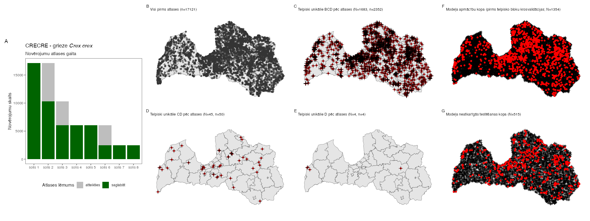
```


<br>


```{r ModelaRaksturojumsCRECRE, echo=FALSE, out.width = '100%', fig.cap='Labākā modeļa izvēle un uzvērtējums: A - labākā modeļa (ar treknu melnu punktu) salīdzinājums ar citiem pielāgotajiem modeļiem (pelēkie punkti un to sastopamības blīvuma funkcijas); B - labākā modeļa izvērtējums, to salīdzinot ar nejauši ģenerētiem nulles modeļiem (n=100) tajā pašā EGV, klātbūtnez un fona punktu veidotajā informācijas telpā.'}

```

<br>

```{r SlieksniCRECRE,echo=FALSE}
suppressPackageStartupMessages(library(kableExtra))
suppressPackageStartupMessages(library(tidyverse))
opts <- options(knitr.kable.NA = "")
slieksni=readxl::read_excel("./Papilddati/BestThresholds/BestThs_CRECRE.xlsx")
tabula=kableExtra::kbl(slieksni, caption = 'Biežāk lietotie projicētās dzīvotņu piemērotības sliekšņa līmeņi un to izvērtējums', 
                    booktabs = TRUE, 
                    longtable = TRUE) 
tabula %>%
  kable_styling(latex_options = "scale_down") %>%
  scroll_box(width = "100%", box_css = "border: 0px;")
```


<br>


```{r HSprojCRECRE, echo=FALSE, out.width = '100%', fig.cap='Labākā modeļa projekcija suga sdzīvotņu piemērotībai. Krāsu skala reprezentē cloglog vērtību no 0 līdz 1, kur starp galapunktiem esošā atzīme ir vienādas sensitivātes un specifiskuma treniņdatos slieksnis iepriekšējā tabulā (izvēlēts vizualizēšanas mērķiem un skaidrošanas ērtumam).'}
  knitr::include_graphics("./Atteli/Beigam_KarteNebal/BeiguKarteiNebal_CRECRE.png")
```

<br>


[**Vēl nē:** Dzīvotņu piemērotība (GeoTIFF)]()

[**Vēl nē:** Par labāko atzītais modelis (krosvalidācijas; *.RDS)]()

[**Vēl nē:** Par labāko atzītais modelis (kombinēts; *.RDS)]()

[**Vēl nē:** Par labāko atzītais modelis (tikai ietekmīgās pazīmes; *.RDS)]()

[**Vēl nē:** Ekoģeogrāfisko mainīgo izvēles gaita, to VIF (savstarpējās prognozētspējas raksturojums) un ietekmes modelī (permutāciju procedūrā) raksturojums (*.xlsx)]()

**Attēls EGV marginālajām atbildēm**

<br>


### PORPOR - ormanītis *Porzana porzana* {#Chapter10.1.022}


```{r NovAtlasePORPOR, echo=FALSE, out.width = '100%', fig.cap='Novērojumu atlases gaita un modelēšanā izmantojamie ormanīša *Porzana porzana* novērojumi un fona punkti: A - novērojumu saglabāšanās atlases gaitā; B - visu pieejamo novērojumu (solis 1) izvietojums; C - ar vismaz iespējamu ligzdošanu skaitītie novēorjumi, kas izturējuši līdz septītā soļa beigām (punkti ir unikālie 1 km kvadrāti, krusti ir unikālie 100 m kvadrāti); D - ar vismaz ticamu ligzdošanu skaitītie novēorjumi, kas izturējuši līdz septītā soļa beigām (punkti ir unikālie 1 km kvadrāti, krusti ir unikālie 100 m kvadrāti); E - ar pierādītu ligzdošanu skaitītie novēorjumi, kas izturējuši līdz septītā soļa beigām (punkti ir unikālie 1 km kvadrāti, krusti ir unikālie 100 m kvadrāti); F - modelēšanā izmantojamā apmācību kopa (punkti ir sugas klātbūtnes, krusti ir fona raksturošanai); G - modelēšanā izmantojamā neatkarīgās testēšanas kopa (punkti ir sugas klātbūtnes, krusti ir fona raksturošanai)'}
knitr::include_graphics("./Atteli/IzvelesAtteli/ObsSelection_PORPOR.png")
```


<br>


```{r ModelaRaksturojumsPORPOR, echo=FALSE, out.width = '100%', fig.cap='Labākā modeļa izvēle un uzvērtējums: A - labākā modeļa (ar treknu melnu punktu) salīdzinājums ar citiem pielāgotajiem modeļiem (pelēkie punkti un to sastopamības blīvuma funkcijas); B - labākā modeļa izvērtējums, to salīdzinot ar nejauši ģenerētiem nulles modeļiem (n=100) tajā pašā EGV, klātbūtnez un fona punktu veidotajā informācijas telpā.'}

```

<br>

```{r SlieksniPORPOR,echo=FALSE}
suppressPackageStartupMessages(library(kableExtra))
suppressPackageStartupMessages(library(tidyverse))
opts <- options(knitr.kable.NA = "")
slieksni=readxl::read_excel("./Papilddati/BestThresholds/BestThs_PORPOR.xlsx")
tabula=kableExtra::kbl(slieksni, caption = 'Biežāk lietotie projicētās dzīvotņu piemērotības sliekšņa līmeņi un to izvērtējums', 
                    booktabs = TRUE, 
                    longtable = TRUE) 
tabula %>%
  kable_styling(latex_options = "scale_down") %>%
  scroll_box(width = "100%", box_css = "border: 0px;")
```


<br>


```{r HSprojPORPOR, echo=FALSE, out.width = '100%', fig.cap='Labākā modeļa projekcija suga sdzīvotņu piemērotībai. Krāsu skala reprezentē cloglog vērtību no 0 līdz 1, kur starp galapunktiem esošā atzīme ir vienādas sensitivātes un specifiskuma treniņdatos slieksnis iepriekšējā tabulā (izvēlēts vizualizēšanas mērķiem un skaidrošanas ērtumam).'}
  knitr::include_graphics("./Atteli/Beigam_KarteNebal/BeiguKarteiNebal_PORPOR.png")
```

<br>


[**Vēl nē:** Dzīvotņu piemērotība (GeoTIFF)]()

[**Vēl nē:** Par labāko atzītais modelis (krosvalidācijas; *.RDS)]()

[**Vēl nē:** Par labāko atzītais modelis (kombinēts; *.RDS)]()

[**Vēl nē:** Par labāko atzītais modelis (tikai ietekmīgās pazīmes; *.RDS)]()

[**Vēl nē:** Ekoģeogrāfisko mainīgo izvēles gaita, to VIF (savstarpējās prognozētspējas raksturojums) un ietekmes modelī (permutāciju procedūrā) raksturojums (*.xlsx)]()

**Attēls EGV marginālajām atbildēm**

<br>


### ZAPPAR - mazais ormanītis *Zapornia parva* {#Chapter10.1.023}


```{r NovAtlaseZAPPAR, echo=FALSE, out.width = '100%', fig.cap='Novērojumu atlases gaita un modelēšanā izmantojamie mazā ormanīša *Zapornia parva* novērojumi un fona punkti: A - novērojumu saglabāšanās atlases gaitā; B - visu pieejamo novērojumu (solis 1) izvietojums; C - ar vismaz iespējamu ligzdošanu skaitītie novēorjumi, kas izturējuši līdz septītā soļa beigām (punkti ir unikālie 1 km kvadrāti, krusti ir unikālie 100 m kvadrāti); D - ar vismaz ticamu ligzdošanu skaitītie novēorjumi, kas izturējuši līdz septītā soļa beigām (punkti ir unikālie 1 km kvadrāti, krusti ir unikālie 100 m kvadrāti); E - ar pierādītu ligzdošanu skaitītie novēorjumi, kas izturējuši līdz septītā soļa beigām (punkti ir unikālie 1 km kvadrāti, krusti ir unikālie 100 m kvadrāti); F - modelēšanā izmantojamā apmācību kopa (punkti ir sugas klātbūtnes, krusti ir fona raksturošanai); G - modelēšanā izmantojamā neatkarīgās testēšanas kopa (punkti ir sugas klātbūtnes, krusti ir fona raksturošanai)'}
knitr::include_graphics("./Atteli/IzvelesAtteli/ObsSelection_ZAPPAR.png")
```


<br>


```{r ModelaRaksturojumsZAPPAR, echo=FALSE, out.width = '100%', fig.cap='Labākā modeļa izvēle un uzvērtējums: A - labākā modeļa (ar treknu melnu punktu) salīdzinājums ar citiem pielāgotajiem modeļiem (pelēkie punkti un to sastopamības blīvuma funkcijas); B - labākā modeļa izvērtējums, to salīdzinot ar nejauši ģenerētiem nulles modeļiem (n=100) tajā pašā EGV, klātbūtnez un fona punktu veidotajā informācijas telpā.'}

```

<br>

```{r SlieksniZAPPAR,echo=FALSE}
suppressPackageStartupMessages(library(kableExtra))
suppressPackageStartupMessages(library(tidyverse))
opts <- options(knitr.kable.NA = "")
slieksni=readxl::read_excel("./Papilddati/BestThresholds/BestThs_ZAPPAR.xlsx")
tabula=kableExtra::kbl(slieksni, caption = 'Biežāk lietotie projicētās dzīvotņu piemērotības sliekšņa līmeņi un to izvērtējums', 
                    booktabs = TRUE, 
                    longtable = TRUE) 
tabula %>%
  kable_styling(latex_options = "scale_down") %>%
  scroll_box(width = "100%", box_css = "border: 0px;")
```


<br>


```{r HSprojZAPPAR, echo=FALSE, out.width = '100%', fig.cap='Labākā modeļa projekcija suga sdzīvotņu piemērotībai. Krāsu skala reprezentē cloglog vērtību no 0 līdz 1, kur starp galapunktiem esošā atzīme ir vienādas sensitivātes un specifiskuma treniņdatos slieksnis iepriekšējā tabulā (izvēlēts vizualizēšanas mērķiem un skaidrošanas ērtumam).'}
  knitr::include_graphics("./Atteli/Beigam_KarteNebal/BeiguKarteiNebal_ZAPPAR.png")
```

<br>


[**Vēl nē:** Dzīvotņu piemērotība (GeoTIFF)]()

[**Vēl nē:** Par labāko atzītais modelis (krosvalidācijas; *.RDS)]()

[**Vēl nē:** Par labāko atzītais modelis (kombinēts; *.RDS)]()

[**Vēl nē:** Par labāko atzītais modelis (tikai ietekmīgās pazīmes; *.RDS)]()

[**Vēl nē:** Ekoģeogrāfisko mainīgo izvēles gaita, to VIF (savstarpējās prognozētspējas raksturojums) un ietekmes modelī (permutāciju procedūrā) raksturojums (*.xlsx)]()

**Attēls EGV marginālajām atbildēm**

<br>


### FULATR - laucis *Fulica atra* {#Chapter10.1.024}


```{r NovAtlaseFULATR, echo=FALSE, out.width = '100%', fig.cap='Novērojumu atlases gaita un modelēšanā izmantojamie lauča *Fulica atra* novērojumi un fona punkti: A - novērojumu saglabāšanās atlases gaitā; B - visu pieejamo novērojumu (solis 1) izvietojums; C - ar vismaz iespējamu ligzdošanu skaitītie novēorjumi, kas izturējuši līdz septītā soļa beigām (punkti ir unikālie 1 km kvadrāti, krusti ir unikālie 100 m kvadrāti); D - ar vismaz ticamu ligzdošanu skaitītie novēorjumi, kas izturējuši līdz septītā soļa beigām (punkti ir unikālie 1 km kvadrāti, krusti ir unikālie 100 m kvadrāti); E - ar pierādītu ligzdošanu skaitītie novēorjumi, kas izturējuši līdz septītā soļa beigām (punkti ir unikālie 1 km kvadrāti, krusti ir unikālie 100 m kvadrāti); F - modelēšanā izmantojamā apmācību kopa (punkti ir sugas klātbūtnes, krusti ir fona raksturošanai); G - modelēšanā izmantojamā neatkarīgās testēšanas kopa (punkti ir sugas klātbūtnes, krusti ir fona raksturošanai)'}
knitr::include_graphics("./Atteli/IzvelesAtteli/ObsSelection_FULATR.png")
```


<br>


```{r ModelaRaksturojumsFULATR, echo=FALSE, out.width = '100%', fig.cap='Labākā modeļa izvēle un uzvērtējums: A - labākā modeļa (ar treknu melnu punktu) salīdzinājums ar citiem pielāgotajiem modeļiem (pelēkie punkti un to sastopamības blīvuma funkcijas); B - labākā modeļa izvērtējums, to salīdzinot ar nejauši ģenerētiem nulles modeļiem (n=100) tajā pašā EGV, klātbūtnez un fona punktu veidotajā informācijas telpā.'}

```

<br>

```{r SlieksniFULATR,echo=FALSE}
suppressPackageStartupMessages(library(kableExtra))
suppressPackageStartupMessages(library(tidyverse))
opts <- options(knitr.kable.NA = "")
slieksni=readxl::read_excel("./Papilddati/BestThresholds/BestThs_FULATR.xlsx")
tabula=kableExtra::kbl(slieksni, caption = 'Biežāk lietotie projicētās dzīvotņu piemērotības sliekšņa līmeņi un to izvērtējums', 
                    booktabs = TRUE, 
                    longtable = TRUE) 
tabula %>%
  kable_styling(latex_options = "scale_down") %>%
  scroll_box(width = "100%", box_css = "border: 0px;")
```


<br>


```{r HSprojFULATR, echo=FALSE, out.width = '100%', fig.cap='Labākā modeļa projekcija suga sdzīvotņu piemērotībai. Krāsu skala reprezentē cloglog vērtību no 0 līdz 1, kur starp galapunktiem esošā atzīme ir vienādas sensitivātes un specifiskuma treniņdatos slieksnis iepriekšējā tabulā (izvēlēts vizualizēšanas mērķiem un skaidrošanas ērtumam).'}
  
```

<br>


[**Vēl nē:** Dzīvotņu piemērotība (GeoTIFF)]()

[**Vēl nē:** Par labāko atzītais modelis (krosvalidācijas; *.RDS)]()

[**Vēl nē:** Par labāko atzītais modelis (kombinēts; *.RDS)]()

[**Vēl nē:** Par labāko atzītais modelis (tikai ietekmīgās pazīmes; *.RDS)]()

[**Vēl nē:** Ekoģeogrāfisko mainīgo izvēles gaita, to VIF (savstarpējās prognozētspējas raksturojums) un ietekmes modelī (permutāciju procedūrā) raksturojums (*.xlsx)]()

**Attēls EGV marginālajām atbildēm**

<br>


### GRUGRU - dzērve *Grus grus* {#Chapter10.1.025}


```{r NovAtlaseGRUGRU, echo=FALSE, out.width = '100%', fig.cap='Novērojumu atlases gaita un modelēšanā izmantojamie dzērves *Grus grus* novērojumi un fona punkti: A - novērojumu saglabāšanās atlases gaitā; B - visu pieejamo novērojumu (solis 1) izvietojums; C - ar vismaz iespējamu ligzdošanu skaitītie novēorjumi, kas izturējuši līdz septītā soļa beigām (punkti ir unikālie 1 km kvadrāti, krusti ir unikālie 100 m kvadrāti); D - ar vismaz ticamu ligzdošanu skaitītie novēorjumi, kas izturējuši līdz septītā soļa beigām (punkti ir unikālie 1 km kvadrāti, krusti ir unikālie 100 m kvadrāti); E - ar pierādītu ligzdošanu skaitītie novēorjumi, kas izturējuši līdz septītā soļa beigām (punkti ir unikālie 1 km kvadrāti, krusti ir unikālie 100 m kvadrāti); F - modelēšanā izmantojamā apmācību kopa (punkti ir sugas klātbūtnes, krusti ir fona raksturošanai); G - modelēšanā izmantojamā neatkarīgās testēšanas kopa (punkti ir sugas klātbūtnes, krusti ir fona raksturošanai)'}
knitr::include_graphics("./Atteli/IzvelesAtteli/ObsSelection_GRUGRU.png")
```


<br>


```{r ModelaRaksturojumsGRUGRU, echo=FALSE, out.width = '100%', fig.cap='Labākā modeļa izvēle un uzvērtējums: A - labākā modeļa (ar treknu melnu punktu) salīdzinājums ar citiem pielāgotajiem modeļiem (pelēkie punkti un to sastopamības blīvuma funkcijas); B - labākā modeļa izvērtējums, to salīdzinot ar nejauši ģenerētiem nulles modeļiem (n=100) tajā pašā EGV, klātbūtnez un fona punktu veidotajā informācijas telpā.'}
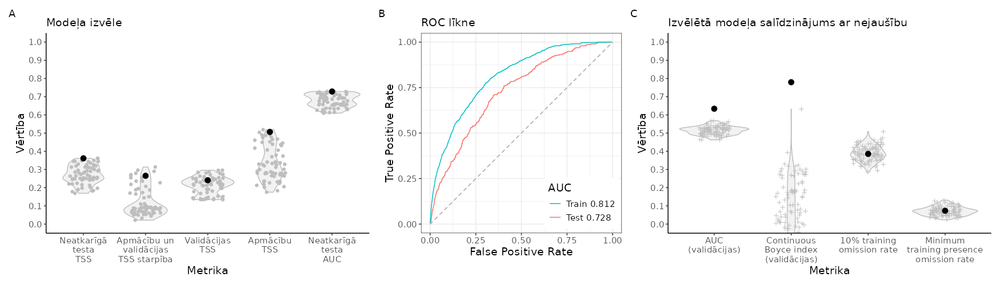
```

<br>

```{r SlieksniGRUGRU,echo=FALSE}
suppressPackageStartupMessages(library(kableExtra))
suppressPackageStartupMessages(library(tidyverse))
opts <- options(knitr.kable.NA = "")
slieksni=readxl::read_excel("./Papilddati/BestThresholds/BestThs_GRUGRU.xlsx")
tabula=kableExtra::kbl(slieksni, caption = 'Biežāk lietotie projicētās dzīvotņu piemērotības sliekšņa līmeņi un to izvērtējums', 
                    booktabs = TRUE, 
                    longtable = TRUE) 
tabula %>%
  kable_styling(latex_options = "scale_down") %>%
  scroll_box(width = "100%", box_css = "border: 0px;")
```


<br>


```{r HSprojGRUGRU, echo=FALSE, out.width = '100%', fig.cap='Labākā modeļa projekcija suga sdzīvotņu piemērotībai. Krāsu skala reprezentē cloglog vērtību no 0 līdz 1, kur starp galapunktiem esošā atzīme ir vienādas sensitivātes un specifiskuma treniņdatos slieksnis iepriekšējā tabulā (izvēlēts vizualizēšanas mērķiem un skaidrošanas ērtumam).'}
  knitr::include_graphics("./Atteli/Beigam_KarteNebal/BeiguKarteiNebal_GRUGRU.png")
```

<br>


[**Vēl nē:** Dzīvotņu piemērotība (GeoTIFF)]()

[**Vēl nē:** Par labāko atzītais modelis (krosvalidācijas; *.RDS)]()

[**Vēl nē:** Par labāko atzītais modelis (kombinēts; *.RDS)]()

[**Vēl nē:** Par labāko atzītais modelis (tikai ietekmīgās pazīmes; *.RDS)]()

[**Vēl nē:** Ekoģeogrāfisko mainīgo izvēles gaita, to VIF (savstarpējās prognozētspējas raksturojums) un ietekmes modelī (permutāciju procedūrā) raksturojums (*.xlsx)]()

**Attēls EGV marginālajām atbildēm**

<br>


### CICNIG - melnais stārķis *Ciconia nigra* {#Chapter10.1.026}


```{r NovAtlaseCICNIG, echo=FALSE, out.width = '100%', fig.cap='Novērojumu atlases gaita un modelēšanā izmantojamie melnā stārķa *Ciconia nigra* novērojumi un fona punkti: A - novērojumu saglabāšanās atlases gaitā; B - visu pieejamo novērojumu (solis 1) izvietojums; C - ar vismaz iespējamu ligzdošanu skaitītie novēorjumi, kas izturējuši līdz septītā soļa beigām (punkti ir unikālie 1 km kvadrāti, krusti ir unikālie 100 m kvadrāti); D - ar vismaz ticamu ligzdošanu skaitītie novēorjumi, kas izturējuši līdz septītā soļa beigām (punkti ir unikālie 1 km kvadrāti, krusti ir unikālie 100 m kvadrāti); E - ar pierādītu ligzdošanu skaitītie novēorjumi, kas izturējuši līdz septītā soļa beigām (punkti ir unikālie 1 km kvadrāti, krusti ir unikālie 100 m kvadrāti); F - modelēšanā izmantojamā apmācību kopa (punkti ir sugas klātbūtnes, krusti ir fona raksturošanai); G - modelēšanā izmantojamā neatkarīgās testēšanas kopa (punkti ir sugas klātbūtnes, krusti ir fona raksturošanai)'}
knitr::include_graphics("./Atteli/IzvelesAtteli/ObsSelection_CICNIG.png")
```


<br>


```{r ModelaRaksturojumsCICNIG, echo=FALSE, out.width = '100%', fig.cap='Labākā modeļa izvēle un uzvērtējums: A - labākā modeļa (ar treknu melnu punktu) salīdzinājums ar citiem pielāgotajiem modeļiem (pelēkie punkti un to sastopamības blīvuma funkcijas); B - labākā modeļa izvērtējums, to salīdzinot ar nejauši ģenerētiem nulles modeļiem (n=100) tajā pašā EGV, klātbūtnez un fona punktu veidotajā informācijas telpā.'}
knitr::include_graphics("./Atteli/Beigam_IzvelesAttels/IzvelesAttels_CICNIG.png")
```

<br>

```{r SlieksniCICNIG,echo=FALSE}
suppressPackageStartupMessages(library(kableExtra))
suppressPackageStartupMessages(library(tidyverse))
opts <- options(knitr.kable.NA = "")
slieksni=readxl::read_excel("./Papilddati/BestThresholds/BestThs_CICNIG.xlsx")
tabula=kableExtra::kbl(slieksni, caption = 'Biežāk lietotie projicētās dzīvotņu piemērotības sliekšņa līmeņi un to izvērtējums', 
                    booktabs = TRUE, 
                    longtable = TRUE) 
tabula %>%
  kable_styling(latex_options = "scale_down") %>%
  scroll_box(width = "100%", box_css = "border: 0px;")
```


<br>


```{r HSprojCICNIG, echo=FALSE, out.width = '100%', fig.cap='Labākā modeļa projekcija suga sdzīvotņu piemērotībai. Krāsu skala reprezentē cloglog vērtību no 0 līdz 1, kur starp galapunktiem esošā atzīme ir vienādas sensitivātes un specifiskuma treniņdatos slieksnis iepriekšējā tabulā (izvēlēts vizualizēšanas mērķiem un skaidrošanas ērtumam).'}
  knitr::include_graphics("./Atteli/Beigam_KarteNebal/BeiguKarteiNebal_CICNIG.png")
```

<br>


[**Vēl nē:** Dzīvotņu piemērotība (GeoTIFF)]()

[**Vēl nē:** Par labāko atzītais modelis (krosvalidācijas; *.RDS)]()

[**Vēl nē:** Par labāko atzītais modelis (kombinēts; *.RDS)]()

[**Vēl nē:** Par labāko atzītais modelis (tikai ietekmīgās pazīmes; *.RDS)]()

[**Vēl nē:** Ekoģeogrāfisko mainīgo izvēles gaita, to VIF (savstarpējās prognozētspējas raksturojums) un ietekmes modelī (permutāciju procedūrā) raksturojums (*.xlsx)]()

**Attēls EGV marginālajām atbildēm**

<br>


### CICCIC - baltais stārķis *Ciconia ciconia* {#Chapter10.1.027}


```{r NovAtlaseCICCIC, echo=FALSE, out.width = '100%', fig.cap='Novērojumu atlases gaita un modelēšanā izmantojamie baltā stārķq *Ciconia ciconia* novērojumi un fona punkti: A - novērojumu saglabāšanās atlases gaitā; B - visu pieejamo novērojumu (solis 1) izvietojums; C - ar vismaz iespējamu ligzdošanu skaitītie novēorjumi, kas izturējuši līdz septītā soļa beigām (punkti ir unikālie 1 km kvadrāti, krusti ir unikālie 100 m kvadrāti); D - ar vismaz ticamu ligzdošanu skaitītie novēorjumi, kas izturējuši līdz septītā soļa beigām (punkti ir unikālie 1 km kvadrāti, krusti ir unikālie 100 m kvadrāti); E - ar pierādītu ligzdošanu skaitītie novēorjumi, kas izturējuši līdz septītā soļa beigām (punkti ir unikālie 1 km kvadrāti, krusti ir unikālie 100 m kvadrāti); F - modelēšanā izmantojamā apmācību kopa (punkti ir sugas klātbūtnes, krusti ir fona raksturošanai); G - modelēšanā izmantojamā neatkarīgās testēšanas kopa (punkti ir sugas klātbūtnes, krusti ir fona raksturošanai)'}
knitr::include_graphics("./Atteli/IzvelesAtteli/ObsSelection_CICCIC.png")
```


<br>


```{r ModelaRaksturojumsCICCIC, echo=FALSE, out.width = '100%', fig.cap='Labākā modeļa izvēle un uzvērtējums: A - labākā modeļa (ar treknu melnu punktu) salīdzinājums ar citiem pielāgotajiem modeļiem (pelēkie punkti un to sastopamības blīvuma funkcijas); B - labākā modeļa izvērtējums, to salīdzinot ar nejauši ģenerētiem nulles modeļiem (n=100) tajā pašā EGV, klātbūtnez un fona punktu veidotajā informācijas telpā.'}
knitr::include_graphics("./Atteli/Beigam_IzvelesAttels/IzvelesAttels_CICCIC.png")
```

<br>

```{r SlieksniCICCIC,echo=FALSE}
suppressPackageStartupMessages(library(kableExtra))
suppressPackageStartupMessages(library(tidyverse))
opts <- options(knitr.kable.NA = "")
slieksni=readxl::read_excel("./Papilddati/BestThresholds/BestThs_CICCIC.xlsx")
tabula=kableExtra::kbl(slieksni, caption = 'Biežāk lietotie projicētās dzīvotņu piemērotības sliekšņa līmeņi un to izvērtējums', 
                    booktabs = TRUE, 
                    longtable = TRUE) 
tabula %>%
  kable_styling(latex_options = "scale_down") %>%
  scroll_box(width = "100%", box_css = "border: 0px;")
```


<br>


```{r HSprojCICCIC, echo=FALSE, out.width = '100%', fig.cap='Labākā modeļa projekcija suga sdzīvotņu piemērotībai. Krāsu skala reprezentē cloglog vērtību no 0 līdz 1, kur starp galapunktiem esošā atzīme ir vienādas sensitivātes un specifiskuma treniņdatos slieksnis iepriekšējā tabulā (izvēlēts vizualizēšanas mērķiem un skaidrošanas ērtumam).'}
  knitr::include_graphics("./Atteli/Beigam_KarteNebal/BeiguKarteiNebal_CICCIC.png")
```

<br>


[**Vēl nē:** Dzīvotņu piemērotība (GeoTIFF)]()

[**Vēl nē:** Par labāko atzītais modelis (krosvalidācijas; *.RDS)]()

[**Vēl nē:** Par labāko atzītais modelis (kombinēts; *.RDS)]()

[**Vēl nē:** Par labāko atzītais modelis (tikai ietekmīgās pazīmes; *.RDS)]()

[**Vēl nē:** Ekoģeogrāfisko mainīgo izvēles gaita, to VIF (savstarpējās prognozētspējas raksturojums) un ietekmes modelī (permutāciju procedūrā) raksturojums (*.xlsx)]()

**Attēls EGV marginālajām atbildēm**

<br>


### BOTSTE - lielais dumpis *Botaurus stellaris* {#Chapter10.1.028}


```{r NovAtlaseBOTSTE, echo=FALSE, out.width = '100%', fig.cap='Novērojumu atlases gaita un modelēšanā izmantojamie lielā dumpja *Botaurus stellaris* novērojumi un fona punkti: A - novērojumu saglabāšanās atlases gaitā; B - visu pieejamo novērojumu (solis 1) izvietojums; C - ar vismaz iespējamu ligzdošanu skaitītie novēorjumi, kas izturējuši līdz septītā soļa beigām (punkti ir unikālie 1 km kvadrāti, krusti ir unikālie 100 m kvadrāti); D - ar vismaz ticamu ligzdošanu skaitītie novēorjumi, kas izturējuši līdz septītā soļa beigām (punkti ir unikālie 1 km kvadrāti, krusti ir unikālie 100 m kvadrāti); E - ar pierādītu ligzdošanu skaitītie novēorjumi, kas izturējuši līdz septītā soļa beigām (punkti ir unikālie 1 km kvadrāti, krusti ir unikālie 100 m kvadrāti); F - modelēšanā izmantojamā apmācību kopa (punkti ir sugas klātbūtnes, krusti ir fona raksturošanai); G - modelēšanā izmantojamā neatkarīgās testēšanas kopa (punkti ir sugas klātbūtnes, krusti ir fona raksturošanai)'}
knitr::include_graphics("./Atteli/IzvelesAtteli/ObsSelection_BOTSTE.png")
```


<br>


```{r ModelaRaksturojumsBOTSTE, echo=FALSE, out.width = '100%', fig.cap='Labākā modeļa izvēle un uzvērtējums: A - labākā modeļa (ar treknu melnu punktu) salīdzinājums ar citiem pielāgotajiem modeļiem (pelēkie punkti un to sastopamības blīvuma funkcijas); B - labākā modeļa izvērtējums, to salīdzinot ar nejauši ģenerētiem nulles modeļiem (n=100) tajā pašā EGV, klātbūtnez un fona punktu veidotajā informācijas telpā.'}
knitr::include_graphics("./Atteli/Beigam_IzvelesAttels/IzvelesAttels_BOTSTE.png")
```

<br>

```{r SlieksniBOTSTE,echo=FALSE}
suppressPackageStartupMessages(library(kableExtra))
suppressPackageStartupMessages(library(tidyverse))
opts <- options(knitr.kable.NA = "")
slieksni=readxl::read_excel("./Papilddati/BestThresholds/BestThs_BOTSTE.xlsx")
tabula=kableExtra::kbl(slieksni, caption = 'Biežāk lietotie projicētās dzīvotņu piemērotības sliekšņa līmeņi un to izvērtējums', 
                    booktabs = TRUE, 
                    longtable = TRUE) 
tabula %>%
  kable_styling(latex_options = "scale_down") %>%
  scroll_box(width = "100%", box_css = "border: 0px;")
```


<br>


```{r HSprojBOTSTE, echo=FALSE, out.width = '100%', fig.cap='Labākā modeļa projekcija suga sdzīvotņu piemērotībai. Krāsu skala reprezentē cloglog vērtību no 0 līdz 1, kur starp galapunktiem esošā atzīme ir vienādas sensitivātes un specifiskuma treniņdatos slieksnis iepriekšējā tabulā (izvēlēts vizualizēšanas mērķiem un skaidrošanas ērtumam).'}
  knitr::include_graphics("./Atteli/Beigam_KarteNebal/BeiguKarteiNebal_BOTSTE.png")
```

<br>


[**Vēl nē:** Dzīvotņu piemērotība (GeoTIFF)]()

[**Vēl nē:** Par labāko atzītais modelis (krosvalidācijas; *.RDS)]()

[**Vēl nē:** Par labāko atzītais modelis (kombinēts; *.RDS)]()

[**Vēl nē:** Par labāko atzītais modelis (tikai ietekmīgās pazīmes; *.RDS)]()

[**Vēl nē:** Ekoģeogrāfisko mainīgo izvēles gaita, to VIF (savstarpējās prognozētspējas raksturojums) un ietekmes modelī (permutāciju procedūrā) raksturojums (*.xlsx)]()

**Attēls EGV marginālajām atbildēm**

<br>


### IXOMIN - mazais dumpis *Ixobrychus minutus* {#Chapter10.1.029}


```{r NovAtlaseIXOMIN, echo=FALSE, out.width = '100%', fig.cap='Novērojumu atlases gaita un modelēšanā izmantojamie mazā dumpja *Ixobrychus minutus* novērojumi un fona punkti: A - novērojumu saglabāšanās atlases gaitā; B - visu pieejamo novērojumu (solis 1) izvietojums; C - ar vismaz iespējamu ligzdošanu skaitītie novēorjumi, kas izturējuši līdz septītā soļa beigām (punkti ir unikālie 1 km kvadrāti, krusti ir unikālie 100 m kvadrāti); D - ar vismaz ticamu ligzdošanu skaitītie novēorjumi, kas izturējuši līdz septītā soļa beigām (punkti ir unikālie 1 km kvadrāti, krusti ir unikālie 100 m kvadrāti); E - ar pierādītu ligzdošanu skaitītie novēorjumi, kas izturējuši līdz septītā soļa beigām (punkti ir unikālie 1 km kvadrāti, krusti ir unikālie 100 m kvadrāti); F - modelēšanā izmantojamā apmācību kopa (punkti ir sugas klātbūtnes, krusti ir fona raksturošanai); G - modelēšanā izmantojamā neatkarīgās testēšanas kopa (punkti ir sugas klātbūtnes, krusti ir fona raksturošanai)'}
knitr::include_graphics("./Atteli/IzvelesAtteli/ObsSelection_IXOMIN.png")
```


<br>


```{r ModelaRaksturojumsIXOMIN, echo=FALSE, out.width = '100%', fig.cap='Labākā modeļa izvēle un uzvērtējums: A - labākā modeļa (ar treknu melnu punktu) salīdzinājums ar citiem pielāgotajiem modeļiem (pelēkie punkti un to sastopamības blīvuma funkcijas); B - labākā modeļa izvērtējums, to salīdzinot ar nejauši ģenerētiem nulles modeļiem (n=100) tajā pašā EGV, klātbūtnez un fona punktu veidotajā informācijas telpā.'}
knitr::include_graphics("./Atteli/Beigam_IzvelesAttels/IzvelesAttels_IXOMIN.png")
```

<br>

```{r SlieksniIXOMIN,echo=FALSE}
suppressPackageStartupMessages(library(kableExtra))
suppressPackageStartupMessages(library(tidyverse))
opts <- options(knitr.kable.NA = "")
slieksni=readxl::read_excel("./Papilddati/BestThresholds/BestThs_IXOMIN.xlsx")
tabula=kableExtra::kbl(slieksni, caption = 'Biežāk lietotie projicētās dzīvotņu piemērotības sliekšņa līmeņi un to izvērtējums', 
                    booktabs = TRUE, 
                    longtable = TRUE) 
tabula %>%
  kable_styling(latex_options = "scale_down") %>%
  scroll_box(width = "100%", box_css = "border: 0px;")
```


<br>


```{r HSprojIXOMIN, echo=FALSE, out.width = '100%', fig.cap='Labākā modeļa projekcija suga sdzīvotņu piemērotībai. Krāsu skala reprezentē cloglog vērtību no 0 līdz 1, kur starp galapunktiem esošā atzīme ir vienādas sensitivātes un specifiskuma treniņdatos slieksnis iepriekšējā tabulā (izvēlēts vizualizēšanas mērķiem un skaidrošanas ērtumam).'}
  knitr::include_graphics("./Atteli/Beigam_KarteNebal/BeiguKarteiNebal_IXOMIN.png")
```

<br>


[**Vēl nē:** Dzīvotņu piemērotība (GeoTIFF)]()

[**Vēl nē:** Par labāko atzītais modelis (krosvalidācijas; *.RDS)]()

[**Vēl nē:** Par labāko atzītais modelis (kombinēts; *.RDS)]()

[**Vēl nē:** Par labāko atzītais modelis (tikai ietekmīgās pazīmes; *.RDS)]()

[**Vēl nē:** Ekoģeogrāfisko mainīgo izvēles gaita, to VIF (savstarpējās prognozētspējas raksturojums) un ietekmes modelī (permutāciju procedūrā) raksturojums (*.xlsx)]()

**Attēls EGV marginālajām atbildēm**

<br>


### HAEOST - jūrasžagata *Haematopus ostralegus* {#Chapter10.1.030}


```{r NovAtlaseHAEOST, echo=FALSE, out.width = '100%', fig.cap='Novērojumu atlases gaita un modelēšanā izmantojamie jūrasžagatas *Haematopus ostralegus* novērojumi un fona punkti: A - novērojumu saglabāšanās atlases gaitā; B - visu pieejamo novērojumu (solis 1) izvietojums; C - ar vismaz iespējamu ligzdošanu skaitītie novēorjumi, kas izturējuši līdz septītā soļa beigām (punkti ir unikālie 1 km kvadrāti, krusti ir unikālie 100 m kvadrāti); D - ar vismaz ticamu ligzdošanu skaitītie novēorjumi, kas izturējuši līdz septītā soļa beigām (punkti ir unikālie 1 km kvadrāti, krusti ir unikālie 100 m kvadrāti); E - ar pierādītu ligzdošanu skaitītie novēorjumi, kas izturējuši līdz septītā soļa beigām (punkti ir unikālie 1 km kvadrāti, krusti ir unikālie 100 m kvadrāti); F - modelēšanā izmantojamā apmācību kopa (punkti ir sugas klātbūtnes, krusti ir fona raksturošanai); G - modelēšanā izmantojamā neatkarīgās testēšanas kopa (punkti ir sugas klātbūtnes, krusti ir fona raksturošanai)'}
knitr::include_graphics("./Atteli/IzvelesAtteli/ObsSelection_HAEOST.png")
```


<br>


```{r ModelaRaksturojumsHAEOST, echo=FALSE, out.width = '100%', fig.cap='Labākā modeļa izvēle un uzvērtējums: A - labākā modeļa (ar treknu melnu punktu) salīdzinājums ar citiem pielāgotajiem modeļiem (pelēkie punkti un to sastopamības blīvuma funkcijas); B - labākā modeļa izvērtējums, to salīdzinot ar nejauši ģenerētiem nulles modeļiem (n=100) tajā pašā EGV, klātbūtnez un fona punktu veidotajā informācijas telpā.'}
knitr::include_graphics("./Atteli/Beigam_IzvelesAttels/IzvelesAttels_HAEOST.png")
```

<br>

```{r SlieksniHAEOST,echo=FALSE}
suppressPackageStartupMessages(library(kableExtra))
suppressPackageStartupMessages(library(tidyverse))
opts <- options(knitr.kable.NA = "")
slieksni=readxl::read_excel("./Papilddati/BestThresholds/BestThs_HAEOST.xlsx")
tabula=kableExtra::kbl(slieksni, caption = 'Biežāk lietotie projicētās dzīvotņu piemērotības sliekšņa līmeņi un to izvērtējums', 
                    booktabs = TRUE, 
                    longtable = TRUE) 
tabula %>%
  kable_styling(latex_options = "scale_down") %>%
  scroll_box(width = "100%", box_css = "border: 0px;")
```


<br>


```{r HSprojHAEOST, echo=FALSE, out.width = '100%', fig.cap='Labākā modeļa projekcija suga sdzīvotņu piemērotībai. Krāsu skala reprezentē cloglog vērtību no 0 līdz 1, kur starp galapunktiem esošā atzīme ir vienādas sensitivātes un specifiskuma treniņdatos slieksnis iepriekšējā tabulā (izvēlēts vizualizēšanas mērķiem un skaidrošanas ērtumam).'}
  knitr::include_graphics("./Atteli/Beigam_KarteNebal/BeiguKarteiNebal_HAEOST.png")
```

<br>


[**Vēl nē:** Dzīvotņu piemērotība (GeoTIFF)]()

[**Vēl nē:** Par labāko atzītais modelis (krosvalidācijas; *.RDS)]()

[**Vēl nē:** Par labāko atzītais modelis (kombinēts; *.RDS)]()

[**Vēl nē:** Par labāko atzītais modelis (tikai ietekmīgās pazīmes; *.RDS)]()

[**Vēl nē:** Ekoģeogrāfisko mainīgo izvēles gaita, to VIF (savstarpējās prognozētspējas raksturojums) un ietekmes modelī (permutāciju procedūrā) raksturojums (*.xlsx)]()

**Attēls EGV marginālajām atbildēm**

<br>


### PLUAPR - dzeltenais tārtiņš *Pluvialis apricaria* {#Chapter10.1.031}


```{r NovAtlasePLUAPR, echo=FALSE, out.width = '100%', fig.cap='Novērojumu atlases gaita un modelēšanā izmantojamie dzeltenā tārtiņa *Pluvialis apricaria* novērojumi un fona punkti: A - novērojumu saglabāšanās atlases gaitā; B - visu pieejamo novērojumu (solis 1) izvietojums; C - ar vismaz iespējamu ligzdošanu skaitītie novēorjumi, kas izturējuši līdz septītā soļa beigām (punkti ir unikālie 1 km kvadrāti, krusti ir unikālie 100 m kvadrāti); D - ar vismaz ticamu ligzdošanu skaitītie novēorjumi, kas izturējuši līdz septītā soļa beigām (punkti ir unikālie 1 km kvadrāti, krusti ir unikālie 100 m kvadrāti); E - ar pierādītu ligzdošanu skaitītie novēorjumi, kas izturējuši līdz septītā soļa beigām (punkti ir unikālie 1 km kvadrāti, krusti ir unikālie 100 m kvadrāti); F - modelēšanā izmantojamā apmācību kopa (punkti ir sugas klātbūtnes, krusti ir fona raksturošanai); G - modelēšanā izmantojamā neatkarīgās testēšanas kopa (punkti ir sugas klātbūtnes, krusti ir fona raksturošanai)'}

```


<br>


```{r ModelaRaksturojumsPLUAPR, echo=FALSE, out.width = '100%', fig.cap='Labākā modeļa izvēle un uzvērtējums: A - labākā modeļa (ar treknu melnu punktu) salīdzinājums ar citiem pielāgotajiem modeļiem (pelēkie punkti un to sastopamības blīvuma funkcijas); B - labākā modeļa izvērtējums, to salīdzinot ar nejauši ģenerētiem nulles modeļiem (n=100) tajā pašā EGV, klātbūtnez un fona punktu veidotajā informācijas telpā.'}
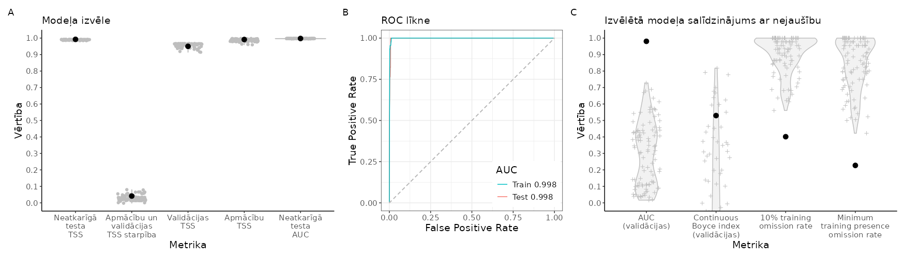
```

<br>

```{r SlieksniPLUAPR,echo=FALSE}
suppressPackageStartupMessages(library(kableExtra))
suppressPackageStartupMessages(library(tidyverse))
opts <- options(knitr.kable.NA = "")
slieksni=readxl::read_excel("./Papilddati/BestThresholds/BestThs_PLUAPR.xlsx")
tabula=kableExtra::kbl(slieksni, caption = 'Biežāk lietotie projicētās dzīvotņu piemērotības sliekšņa līmeņi un to izvērtējums', 
                    booktabs = TRUE, 
                    longtable = TRUE) 
tabula %>%
  kable_styling(latex_options = "scale_down") %>%
  scroll_box(width = "100%", box_css = "border: 0px;")
```


<br>


```{r HSprojPLUAPR, echo=FALSE, out.width = '100%', fig.cap='Labākā modeļa projekcija suga sdzīvotņu piemērotībai. Krāsu skala reprezentē cloglog vērtību no 0 līdz 1, kur starp galapunktiem esošā atzīme ir vienādas sensitivātes un specifiskuma treniņdatos slieksnis iepriekšējā tabulā (izvēlēts vizualizēšanas mērķiem un skaidrošanas ērtumam).'}
  
```

<br>


[**Vēl nē:** Dzīvotņu piemērotība (GeoTIFF)]()

[**Vēl nē:** Par labāko atzītais modelis (krosvalidācijas; *.RDS)]()

[**Vēl nē:** Par labāko atzītais modelis (kombinēts; *.RDS)]()

[**Vēl nē:** Par labāko atzītais modelis (tikai ietekmīgās pazīmes; *.RDS)]()

[**Vēl nē:** Ekoģeogrāfisko mainīgo izvēles gaita, to VIF (savstarpējās prognozētspējas raksturojums) un ietekmes modelī (permutāciju procedūrā) raksturojums (*.xlsx)]()

**Attēls EGV marginālajām atbildēm**

<br>


### CHAHIA - smilšu tārtiņš *Charadrius hiaticula* {#Chapter10.1.032}


```{r NovAtlaseCHAHIA, echo=FALSE, out.width = '100%', fig.cap='Novērojumu atlases gaita un modelēšanā izmantojamie smilšu tārtiņa *Charadrius hiaticula* novērojumi un fona punkti: A - novērojumu saglabāšanās atlases gaitā; B - visu pieejamo novērojumu (solis 1) izvietojums; C - ar vismaz iespējamu ligzdošanu skaitītie novēorjumi, kas izturējuši līdz septītā soļa beigām (punkti ir unikālie 1 km kvadrāti, krusti ir unikālie 100 m kvadrāti); D - ar vismaz ticamu ligzdošanu skaitītie novēorjumi, kas izturējuši līdz septītā soļa beigām (punkti ir unikālie 1 km kvadrāti, krusti ir unikālie 100 m kvadrāti); E - ar pierādītu ligzdošanu skaitītie novēorjumi, kas izturējuši līdz septītā soļa beigām (punkti ir unikālie 1 km kvadrāti, krusti ir unikālie 100 m kvadrāti); F - modelēšanā izmantojamā apmācību kopa (punkti ir sugas klātbūtnes, krusti ir fona raksturošanai); G - modelēšanā izmantojamā neatkarīgās testēšanas kopa (punkti ir sugas klātbūtnes, krusti ir fona raksturošanai)'}
knitr::include_graphics("./Atteli/IzvelesAtteli/ObsSelection_CHAHIA.png")
```


<br>


```{r ModelaRaksturojumsCHAHIA, echo=FALSE, out.width = '100%', fig.cap='Labākā modeļa izvēle un uzvērtējums: A - labākā modeļa (ar treknu melnu punktu) salīdzinājums ar citiem pielāgotajiem modeļiem (pelēkie punkti un to sastopamības blīvuma funkcijas); B - labākā modeļa izvērtējums, to salīdzinot ar nejauši ģenerētiem nulles modeļiem (n=100) tajā pašā EGV, klātbūtnez un fona punktu veidotajā informācijas telpā.'}
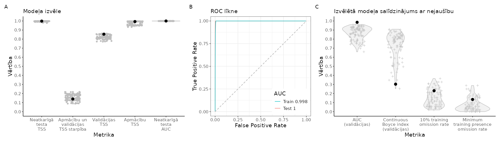
```

<br>

```{r SlieksniCHAHIA,echo=FALSE}
suppressPackageStartupMessages(library(kableExtra))
suppressPackageStartupMessages(library(tidyverse))
opts <- options(knitr.kable.NA = "")
slieksni=readxl::read_excel("./Papilddati/BestThresholds/BestThs_CHAHIA.xlsx")
tabula=kableExtra::kbl(slieksni, caption = 'Biežāk lietotie projicētās dzīvotņu piemērotības sliekšņa līmeņi un to izvērtējums', 
                    booktabs = TRUE, 
                    longtable = TRUE) 
tabula %>%
  kable_styling(latex_options = "scale_down") %>%
  scroll_box(width = "100%", box_css = "border: 0px;")
```


<br>


```{r HSprojCHAHIA, echo=FALSE, out.width = '100%', fig.cap='Labākā modeļa projekcija suga sdzīvotņu piemērotībai. Krāsu skala reprezentē cloglog vērtību no 0 līdz 1, kur starp galapunktiem esošā atzīme ir vienādas sensitivātes un specifiskuma treniņdatos slieksnis iepriekšējā tabulā (izvēlēts vizualizēšanas mērķiem un skaidrošanas ērtumam).'}
  knitr::include_graphics("./Atteli/Beigam_KarteNebal/BeiguKarteiNebal_CHAHIA.png")
```

<br>


[**Vēl nē:** Dzīvotņu piemērotība (GeoTIFF)]()

[**Vēl nē:** Par labāko atzītais modelis (krosvalidācijas; *.RDS)]()

[**Vēl nē:** Par labāko atzītais modelis (kombinēts; *.RDS)]()

[**Vēl nē:** Par labāko atzītais modelis (tikai ietekmīgās pazīmes; *.RDS)]()

[**Vēl nē:** Ekoģeogrāfisko mainīgo izvēles gaita, to VIF (savstarpējās prognozētspējas raksturojums) un ietekmes modelī (permutāciju procedūrā) raksturojums (*.xlsx)]()

**Attēls EGV marginālajām atbildēm**

<br>


### CHADUB - upes tārtiņš *Charadrius dubius* {#Chapter10.1.033}


```{r NovAtlaseCHADUB, echo=FALSE, out.width = '100%', fig.cap='Novērojumu atlases gaita un modelēšanā izmantojamie upes tārtiņa *Charadrius dubius* novērojumi un fona punkti: A - novērojumu saglabāšanās atlases gaitā; B - visu pieejamo novērojumu (solis 1) izvietojums; C - ar vismaz iespējamu ligzdošanu skaitītie novēorjumi, kas izturējuši līdz septītā soļa beigām (punkti ir unikālie 1 km kvadrāti, krusti ir unikālie 100 m kvadrāti); D - ar vismaz ticamu ligzdošanu skaitītie novēorjumi, kas izturējuši līdz septītā soļa beigām (punkti ir unikālie 1 km kvadrāti, krusti ir unikālie 100 m kvadrāti); E - ar pierādītu ligzdošanu skaitītie novēorjumi, kas izturējuši līdz septītā soļa beigām (punkti ir unikālie 1 km kvadrāti, krusti ir unikālie 100 m kvadrāti); F - modelēšanā izmantojamā apmācību kopa (punkti ir sugas klātbūtnes, krusti ir fona raksturošanai); G - modelēšanā izmantojamā neatkarīgās testēšanas kopa (punkti ir sugas klātbūtnes, krusti ir fona raksturošanai)'}
knitr::include_graphics("./Atteli/IzvelesAtteli/ObsSelection_CHADUB.png")
```


<br>


```{r ModelaRaksturojumsCHADUB, echo=FALSE, out.width = '100%', fig.cap='Labākā modeļa izvēle un uzvērtējums: A - labākā modeļa (ar treknu melnu punktu) salīdzinājums ar citiem pielāgotajiem modeļiem (pelēkie punkti un to sastopamības blīvuma funkcijas); B - labākā modeļa izvērtējums, to salīdzinot ar nejauši ģenerētiem nulles modeļiem (n=100) tajā pašā EGV, klātbūtnez un fona punktu veidotajā informācijas telpā.'}
knitr::include_graphics("./Atteli/Beigam_IzvelesAttels/IzvelesAttels_CHADUB.png")
```

<br>

```{r SlieksniCHADUB,echo=FALSE}
suppressPackageStartupMessages(library(kableExtra))
suppressPackageStartupMessages(library(tidyverse))
opts <- options(knitr.kable.NA = "")
slieksni=readxl::read_excel("./Papilddati/BestThresholds/BestThs_CHADUB.xlsx")
tabula=kableExtra::kbl(slieksni, caption = 'Biežāk lietotie projicētās dzīvotņu piemērotības sliekšņa līmeņi un to izvērtējums', 
                    booktabs = TRUE, 
                    longtable = TRUE) 
tabula %>%
  kable_styling(latex_options = "scale_down") %>%
  scroll_box(width = "100%", box_css = "border: 0px;")
```


<br>


```{r HSprojCHADUB, echo=FALSE, out.width = '100%', fig.cap='Labākā modeļa projekcija suga sdzīvotņu piemērotībai. Krāsu skala reprezentē cloglog vērtību no 0 līdz 1, kur starp galapunktiem esošā atzīme ir vienādas sensitivātes un specifiskuma treniņdatos slieksnis iepriekšējā tabulā (izvēlēts vizualizēšanas mērķiem un skaidrošanas ērtumam).'}
  knitr::include_graphics("./Atteli/Beigam_KarteNebal/BeiguKarteiNebal_CHADUB.png")
```

<br>


[**Vēl nē:** Dzīvotņu piemērotība (GeoTIFF)]()

[**Vēl nē:** Par labāko atzītais modelis (krosvalidācijas; *.RDS)]()

[**Vēl nē:** Par labāko atzītais modelis (kombinēts; *.RDS)]()

[**Vēl nē:** Par labāko atzītais modelis (tikai ietekmīgās pazīmes; *.RDS)]()

[**Vēl nē:** Ekoģeogrāfisko mainīgo izvēles gaita, to VIF (savstarpējās prognozētspējas raksturojums) un ietekmes modelī (permutāciju procedūrā) raksturojums (*.xlsx)]()

**Attēls EGV marginālajām atbildēm**

<br>


### VANVAN - ķīvīte *Vanellus vanellus* {#Chapter10.1.034}


```{r NovAtlaseVANVAN, echo=FALSE, out.width = '100%', fig.cap='Novērojumu atlases gaita un modelēšanā izmantojamie ķīvītes *Vanellus vanellus* novērojumi un fona punkti: A - novērojumu saglabāšanās atlases gaitā; B - visu pieejamo novērojumu (solis 1) izvietojums; C - ar vismaz iespējamu ligzdošanu skaitītie novēorjumi, kas izturējuši līdz septītā soļa beigām (punkti ir unikālie 1 km kvadrāti, krusti ir unikālie 100 m kvadrāti); D - ar vismaz ticamu ligzdošanu skaitītie novēorjumi, kas izturējuši līdz septītā soļa beigām (punkti ir unikālie 1 km kvadrāti, krusti ir unikālie 100 m kvadrāti); E - ar pierādītu ligzdošanu skaitītie novēorjumi, kas izturējuši līdz septītā soļa beigām (punkti ir unikālie 1 km kvadrāti, krusti ir unikālie 100 m kvadrāti); F - modelēšanā izmantojamā apmācību kopa (punkti ir sugas klātbūtnes, krusti ir fona raksturošanai); G - modelēšanā izmantojamā neatkarīgās testēšanas kopa (punkti ir sugas klātbūtnes, krusti ir fona raksturošanai)'}
knitr::include_graphics("./Atteli/IzvelesAtteli/ObsSelection_VANVAN.png")
```


<br>


```{r ModelaRaksturojumsVANVAN, echo=FALSE, out.width = '100%', fig.cap='Labākā modeļa izvēle un uzvērtējums: A - labākā modeļa (ar treknu melnu punktu) salīdzinājums ar citiem pielāgotajiem modeļiem (pelēkie punkti un to sastopamības blīvuma funkcijas); B - labākā modeļa izvērtējums, to salīdzinot ar nejauši ģenerētiem nulles modeļiem (n=100) tajā pašā EGV, klātbūtnez un fona punktu veidotajā informācijas telpā.'}
knitr::include_graphics("./Atteli/Beigam_IzvelesAttels/IzvelesAttels_VANVAN.png")
```

<br>

```{r SlieksniVANVAN,echo=FALSE}
suppressPackageStartupMessages(library(kableExtra))
suppressPackageStartupMessages(library(tidyverse))
opts <- options(knitr.kable.NA = "")
slieksni=readxl::read_excel("./Papilddati/BestThresholds/BestThs_VANVAN.xlsx")
tabula=kableExtra::kbl(slieksni, caption = 'Biežāk lietotie projicētās dzīvotņu piemērotības sliekšņa līmeņi un to izvērtējums', 
                    booktabs = TRUE, 
                    longtable = TRUE) 
tabula %>%
  kable_styling(latex_options = "scale_down") %>%
  scroll_box(width = "100%", box_css = "border: 0px;")
```


<br>


```{r HSprojVANVAN, echo=FALSE, out.width = '100%', fig.cap='Labākā modeļa projekcija suga sdzīvotņu piemērotībai. Krāsu skala reprezentē cloglog vērtību no 0 līdz 1, kur starp galapunktiem esošā atzīme ir vienādas sensitivātes un specifiskuma treniņdatos slieksnis iepriekšējā tabulā (izvēlēts vizualizēšanas mērķiem un skaidrošanas ērtumam).'}
  knitr::include_graphics("./Atteli/Beigam_KarteNebal/BeiguKarteiNebal_VANVAN.png")
```

<br>


[**Vēl nē:** Dzīvotņu piemērotība (GeoTIFF)]()

[**Vēl nē:** Par labāko atzītais modelis (krosvalidācijas; *.RDS)]()

[**Vēl nē:** Par labāko atzītais modelis (kombinēts; *.RDS)]()

[**Vēl nē:** Par labāko atzītais modelis (tikai ietekmīgās pazīmes; *.RDS)]()

[**Vēl nē:** Ekoģeogrāfisko mainīgo izvēles gaita, to VIF (savstarpējās prognozētspējas raksturojums) un ietekmes modelī (permutāciju procedūrā) raksturojums (*.xlsx)]()

**Attēls EGV marginālajām atbildēm**

<br>


### NUMPHA - lietuvainis *Numenius phaeopus* {#Chapter10.1.035}


```{r NovAtlaseNUMPHA, echo=FALSE, out.width = '100%', fig.cap='Novērojumu atlases gaita un modelēšanā izmantojamie lietuvaiņa *Numenius phaeopus* novērojumi un fona punkti: A - novērojumu saglabāšanās atlases gaitā; B - visu pieejamo novērojumu (solis 1) izvietojums; C - ar vismaz iespējamu ligzdošanu skaitītie novēorjumi, kas izturējuši līdz septītā soļa beigām (punkti ir unikālie 1 km kvadrāti, krusti ir unikālie 100 m kvadrāti); D - ar vismaz ticamu ligzdošanu skaitītie novēorjumi, kas izturējuši līdz septītā soļa beigām (punkti ir unikālie 1 km kvadrāti, krusti ir unikālie 100 m kvadrāti); E - ar pierādītu ligzdošanu skaitītie novēorjumi, kas izturējuši līdz septītā soļa beigām (punkti ir unikālie 1 km kvadrāti, krusti ir unikālie 100 m kvadrāti); F - modelēšanā izmantojamā apmācību kopa (punkti ir sugas klātbūtnes, krusti ir fona raksturošanai); G - modelēšanā izmantojamā neatkarīgās testēšanas kopa (punkti ir sugas klātbūtnes, krusti ir fona raksturošanai)'}

```


<br>

**Ar šā brīža pieejām šajā projektā lietuvaiņa *Numenius phaeopus* izplatība nav modelējama**

<br>


### NUMARQ - kuitala *Numenius arquata* {#Chapter10.1.036}


```{r NovAtlaseNUMARQ, echo=FALSE, out.width = '100%', fig.cap='Novērojumu atlases gaita un modelēšanā izmantojamie kuitalas *Numenius arquata* novērojumi un fona punkti: A - novērojumu saglabāšanās atlases gaitā; B - visu pieejamo novērojumu (solis 1) izvietojums; C - ar vismaz iespējamu ligzdošanu skaitītie novēorjumi, kas izturējuši līdz septītā soļa beigām (punkti ir unikālie 1 km kvadrāti, krusti ir unikālie 100 m kvadrāti); D - ar vismaz ticamu ligzdošanu skaitītie novēorjumi, kas izturējuši līdz septītā soļa beigām (punkti ir unikālie 1 km kvadrāti, krusti ir unikālie 100 m kvadrāti); E - ar pierādītu ligzdošanu skaitītie novēorjumi, kas izturējuši līdz septītā soļa beigām (punkti ir unikālie 1 km kvadrāti, krusti ir unikālie 100 m kvadrāti); F - modelēšanā izmantojamā apmācību kopa (punkti ir sugas klātbūtnes, krusti ir fona raksturošanai); G - modelēšanā izmantojamā neatkarīgās testēšanas kopa (punkti ir sugas klātbūtnes, krusti ir fona raksturošanai)'}
knitr::include_graphics("./Atteli/IzvelesAtteli/ObsSelection_NUMARQ.png")
```


<br>


```{r ModelaRaksturojumsNUMARQ, echo=FALSE, out.width = '100%', fig.cap='Labākā modeļa izvēle un uzvērtējums: A - labākā modeļa (ar treknu melnu punktu) salīdzinājums ar citiem pielāgotajiem modeļiem (pelēkie punkti un to sastopamības blīvuma funkcijas); B - labākā modeļa izvērtējums, to salīdzinot ar nejauši ģenerētiem nulles modeļiem (n=100) tajā pašā EGV, klātbūtnez un fona punktu veidotajā informācijas telpā.'}

```

<br>

```{r SlieksniNUMARQ,echo=FALSE}
suppressPackageStartupMessages(library(kableExtra))
suppressPackageStartupMessages(library(tidyverse))
opts <- options(knitr.kable.NA = "")
slieksni=readxl::read_excel("./Papilddati/BestThresholds/BestThs_NUMARQ.xlsx")
tabula=kableExtra::kbl(slieksni, caption = 'Biežāk lietotie projicētās dzīvotņu piemērotības sliekšņa līmeņi un to izvērtējums', 
                    booktabs = TRUE, 
                    longtable = TRUE) 
tabula %>%
  kable_styling(latex_options = "scale_down") %>%
  scroll_box(width = "100%", box_css = "border: 0px;")
```


<br>


```{r HSprojNUMARQ, echo=FALSE, out.width = '100%', fig.cap='Labākā modeļa projekcija suga sdzīvotņu piemērotībai. Krāsu skala reprezentē cloglog vērtību no 0 līdz 1, kur starp galapunktiem esošā atzīme ir vienādas sensitivātes un specifiskuma treniņdatos slieksnis iepriekšējā tabulā (izvēlēts vizualizēšanas mērķiem un skaidrošanas ērtumam).'}
  knitr::include_graphics("./Atteli/Beigam_KarteNebal/BeiguKarteiNebal_NUMARQ.png")
```

<br>


[**Vēl nē:** Dzīvotņu piemērotība (GeoTIFF)]()

[**Vēl nē:** Par labāko atzītais modelis (krosvalidācijas; *.RDS)]()

[**Vēl nē:** Par labāko atzītais modelis (kombinēts; *.RDS)]()

[**Vēl nē:** Par labāko atzītais modelis (tikai ietekmīgās pazīmes; *.RDS)]()

[**Vēl nē:** Ekoģeogrāfisko mainīgo izvēles gaita, to VIF (savstarpējās prognozētspējas raksturojums) un ietekmes modelī (permutāciju procedūrā) raksturojums (*.xlsx)]()

**Attēls EGV marginālajām atbildēm**

<br>


### LIMLIM - melnā puskuitala *Limosa limosa* {#Chapter10.1.037}


```{r NovAtlaseLIMLIM, echo=FALSE, out.width = '100%', fig.cap='Novērojumu atlases gaita un modelēšanā izmantojamie melnās puskuitalas *Limosa limosa* novērojumi un fona punkti: A - novērojumu saglabāšanās atlases gaitā; B - visu pieejamo novērojumu (solis 1) izvietojums; C - ar vismaz iespējamu ligzdošanu skaitītie novēorjumi, kas izturējuši līdz septītā soļa beigām (punkti ir unikālie 1 km kvadrāti, krusti ir unikālie 100 m kvadrāti); D - ar vismaz ticamu ligzdošanu skaitītie novēorjumi, kas izturējuši līdz septītā soļa beigām (punkti ir unikālie 1 km kvadrāti, krusti ir unikālie 100 m kvadrāti); E - ar pierādītu ligzdošanu skaitītie novēorjumi, kas izturējuši līdz septītā soļa beigām (punkti ir unikālie 1 km kvadrāti, krusti ir unikālie 100 m kvadrāti); F - modelēšanā izmantojamā apmācību kopa (punkti ir sugas klātbūtnes, krusti ir fona raksturošanai); G - modelēšanā izmantojamā neatkarīgās testēšanas kopa (punkti ir sugas klātbūtnes, krusti ir fona raksturošanai)'}
knitr::include_graphics("./Atteli/IzvelesAtteli/ObsSelection_LIMLIM.png")
```


<br>

**Ar šā brīža pieejām šajā projektā melnās puskuitalas *Limosa limosa* izplatība nav modelējama**

<br>


### GALMED - ķikuts *Gallinago media* {#Chapter10.1.038}


```{r NovAtlaseGALMED, echo=FALSE, out.width = '100%', fig.cap='Novērojumu atlases gaita un modelēšanā izmantojamie ķikuta *Gallinago media* novērojumi un fona punkti: A - novērojumu saglabāšanās atlases gaitā; B - visu pieejamo novērojumu (solis 1) izvietojums; C - ar vismaz iespējamu ligzdošanu skaitītie novēorjumi, kas izturējuši līdz septītā soļa beigām (punkti ir unikālie 1 km kvadrāti, krusti ir unikālie 100 m kvadrāti); D - ar vismaz ticamu ligzdošanu skaitītie novēorjumi, kas izturējuši līdz septītā soļa beigām (punkti ir unikālie 1 km kvadrāti, krusti ir unikālie 100 m kvadrāti); E - ar pierādītu ligzdošanu skaitītie novēorjumi, kas izturējuši līdz septītā soļa beigām (punkti ir unikālie 1 km kvadrāti, krusti ir unikālie 100 m kvadrāti); F - modelēšanā izmantojamā apmācību kopa (punkti ir sugas klātbūtnes, krusti ir fona raksturošanai); G - modelēšanā izmantojamā neatkarīgās testēšanas kopa (punkti ir sugas klātbūtnes, krusti ir fona raksturošanai)'}
knitr::include_graphics("./Atteli/IzvelesAtteli/ObsSelection_GALMED.png")
```


<br>

**Ar šā brīža pieejām šajā projektā ķikuta *Gallinago media* izplatība nav modelējama**

<br>


### GALGAL - mērkaziņa *Gallinago gallinago* {#Chapter10.1.039}


```{r NovAtlaseGALGAL, echo=FALSE, out.width = '100%', fig.cap='Novērojumu atlases gaita un modelēšanā izmantojamie mērkaziņas *Gallinago gallinago* novērojumi un fona punkti: A - novērojumu saglabāšanās atlases gaitā; B - visu pieejamo novērojumu (solis 1) izvietojums; C - ar vismaz iespējamu ligzdošanu skaitītie novēorjumi, kas izturējuši līdz septītā soļa beigām (punkti ir unikālie 1 km kvadrāti, krusti ir unikālie 100 m kvadrāti); D - ar vismaz ticamu ligzdošanu skaitītie novēorjumi, kas izturējuši līdz septītā soļa beigām (punkti ir unikālie 1 km kvadrāti, krusti ir unikālie 100 m kvadrāti); E - ar pierādītu ligzdošanu skaitītie novēorjumi, kas izturējuši līdz septītā soļa beigām (punkti ir unikālie 1 km kvadrāti, krusti ir unikālie 100 m kvadrāti); F - modelēšanā izmantojamā apmācību kopa (punkti ir sugas klātbūtnes, krusti ir fona raksturošanai); G - modelēšanā izmantojamā neatkarīgās testēšanas kopa (punkti ir sugas klātbūtnes, krusti ir fona raksturošanai)'}
knitr::include_graphics("./Atteli/IzvelesAtteli/ObsSelection_GALGAL.png")
```


<br>


```{r ModelaRaksturojumsGALGAL, echo=FALSE, out.width = '100%', fig.cap='Labākā modeļa izvēle un uzvērtējums: A - labākā modeļa (ar treknu melnu punktu) salīdzinājums ar citiem pielāgotajiem modeļiem (pelēkie punkti un to sastopamības blīvuma funkcijas); B - labākā modeļa izvērtējums, to salīdzinot ar nejauši ģenerētiem nulles modeļiem (n=100) tajā pašā EGV, klātbūtnez un fona punktu veidotajā informācijas telpā.'}
knitr::include_graphics("./Atteli/Beigam_IzvelesAttels/IzvelesAttels_GALGAL.png")
```

<br>

```{r SlieksniGALGAL,echo=FALSE}
suppressPackageStartupMessages(library(kableExtra))
suppressPackageStartupMessages(library(tidyverse))
opts <- options(knitr.kable.NA = "")
slieksni=readxl::read_excel("./Papilddati/BestThresholds/BestThs_GALGAL.xlsx")
tabula=kableExtra::kbl(slieksni, caption = 'Biežāk lietotie projicētās dzīvotņu piemērotības sliekšņa līmeņi un to izvērtējums', 
                    booktabs = TRUE, 
                    longtable = TRUE) 
tabula %>%
  kable_styling(latex_options = "scale_down") %>%
  scroll_box(width = "100%", box_css = "border: 0px;")
```


<br>


```{r HSprojGALGAL, echo=FALSE, out.width = '100%', fig.cap='Labākā modeļa projekcija suga sdzīvotņu piemērotībai. Krāsu skala reprezentē cloglog vērtību no 0 līdz 1, kur starp galapunktiem esošā atzīme ir vienādas sensitivātes un specifiskuma treniņdatos slieksnis iepriekšējā tabulā (izvēlēts vizualizēšanas mērķiem un skaidrošanas ērtumam).'}
  knitr::include_graphics("./Atteli/Beigam_KarteNebal/BeiguKarteiNebal_GALGAL.png")
```

<br>


[**Vēl nē:** Dzīvotņu piemērotība (GeoTIFF)]()

[**Vēl nē:** Par labāko atzītais modelis (krosvalidācijas; *.RDS)]()

[**Vēl nē:** Par labāko atzītais modelis (kombinēts; *.RDS)]()

[**Vēl nē:** Par labāko atzītais modelis (tikai ietekmīgās pazīmes; *.RDS)]()

[**Vēl nē:** Ekoģeogrāfisko mainīgo izvēles gaita, to VIF (savstarpējās prognozētspējas raksturojums) un ietekmes modelī (permutāciju procedūrā) raksturojums (*.xlsx)]()

**Attēls EGV marginālajām atbildēm**

<br>


### TRINEB - lielā tilbīte *Tringa nebularia* {#Chapter10.1.040}


```{r NovAtlaseTRINEB, echo=FALSE, out.width = '100%', fig.cap='Novērojumu atlases gaita un modelēšanā izmantojamie lielās tilbītes *Tringa nebularia* novērojumi un fona punkti: A - novērojumu saglabāšanās atlases gaitā; B - visu pieejamo novērojumu (solis 1) izvietojums; C - ar vismaz iespējamu ligzdošanu skaitītie novēorjumi, kas izturējuši līdz septītā soļa beigām (punkti ir unikālie 1 km kvadrāti, krusti ir unikālie 100 m kvadrāti); D - ar vismaz ticamu ligzdošanu skaitītie novēorjumi, kas izturējuši līdz septītā soļa beigām (punkti ir unikālie 1 km kvadrāti, krusti ir unikālie 100 m kvadrāti); E - ar pierādītu ligzdošanu skaitītie novēorjumi, kas izturējuši līdz septītā soļa beigām (punkti ir unikālie 1 km kvadrāti, krusti ir unikālie 100 m kvadrāti); F - modelēšanā izmantojamā apmācību kopa (punkti ir sugas klātbūtnes, krusti ir fona raksturošanai); G - modelēšanā izmantojamā neatkarīgās testēšanas kopa (punkti ir sugas klātbūtnes, krusti ir fona raksturošanai)'}
knitr::include_graphics("./Atteli/IzvelesAtteli/ObsSelection_TRINEB.png")
```


<br>

**Ar šā brīža pieejām šajā projektā lielās tilbītes *Tringa nebularia* izplatība nav modelējama**

<br>


### TRITOT - pļavu tilbīte *Tringa totanus* {#Chapter10.1.041}


```{r NovAtlaseTRITOT, echo=FALSE, out.width = '100%', fig.cap='Novērojumu atlases gaita un modelēšanā izmantojamie pļavu tilbītes *Tringa totanus* novērojumi un fona punkti: A - novērojumu saglabāšanās atlases gaitā; B - visu pieejamo novērojumu (solis 1) izvietojums; C - ar vismaz iespējamu ligzdošanu skaitītie novēorjumi, kas izturējuši līdz septītā soļa beigām (punkti ir unikālie 1 km kvadrāti, krusti ir unikālie 100 m kvadrāti); D - ar vismaz ticamu ligzdošanu skaitītie novēorjumi, kas izturējuši līdz septītā soļa beigām (punkti ir unikālie 1 km kvadrāti, krusti ir unikālie 100 m kvadrāti); E - ar pierādītu ligzdošanu skaitītie novēorjumi, kas izturējuši līdz septītā soļa beigām (punkti ir unikālie 1 km kvadrāti, krusti ir unikālie 100 m kvadrāti); F - modelēšanā izmantojamā apmācību kopa (punkti ir sugas klātbūtnes, krusti ir fona raksturošanai); G - modelēšanā izmantojamā neatkarīgās testēšanas kopa (punkti ir sugas klātbūtnes, krusti ir fona raksturošanai)'}
knitr::include_graphics("./Atteli/IzvelesAtteli/ObsSelection_TRITOT.png")
```


<br>


```{r ModelaRaksturojumsTRITOT, echo=FALSE, out.width = '100%', fig.cap='Labākā modeļa izvēle un uzvērtējums: A - labākā modeļa (ar treknu melnu punktu) salīdzinājums ar citiem pielāgotajiem modeļiem (pelēkie punkti un to sastopamības blīvuma funkcijas); B - labākā modeļa izvērtējums, to salīdzinot ar nejauši ģenerētiem nulles modeļiem (n=100) tajā pašā EGV, klātbūtnez un fona punktu veidotajā informācijas telpā.'}
knitr::include_graphics("./Atteli/Beigam_IzvelesAttels/IzvelesAttels_TRITOT.png")
```

<br>

```{r SlieksniTRITOT,echo=FALSE}
suppressPackageStartupMessages(library(kableExtra))
suppressPackageStartupMessages(library(tidyverse))
opts <- options(knitr.kable.NA = "")
slieksni=readxl::read_excel("./Papilddati/BestThresholds/BestThs_TRITOT.xlsx")
tabula=kableExtra::kbl(slieksni, caption = 'Biežāk lietotie projicētās dzīvotņu piemērotības sliekšņa līmeņi un to izvērtējums', 
                    booktabs = TRUE, 
                    longtable = TRUE) 
tabula %>%
  kable_styling(latex_options = "scale_down") %>%
  scroll_box(width = "100%", box_css = "border: 0px;")
```


<br>


```{r HSprojTRITOT, echo=FALSE, out.width = '100%', fig.cap='Labākā modeļa projekcija suga sdzīvotņu piemērotībai. Krāsu skala reprezentē cloglog vērtību no 0 līdz 1, kur starp galapunktiem esošā atzīme ir vienādas sensitivātes un specifiskuma treniņdatos slieksnis iepriekšējā tabulā (izvēlēts vizualizēšanas mērķiem un skaidrošanas ērtumam).'}
  
```

<br>


[**Vēl nē:** Dzīvotņu piemērotība (GeoTIFF)]()

[**Vēl nē:** Par labāko atzītais modelis (krosvalidācijas; *.RDS)]()

[**Vēl nē:** Par labāko atzītais modelis (kombinēts; *.RDS)]()

[**Vēl nē:** Par labāko atzītais modelis (tikai ietekmīgās pazīmes; *.RDS)]()

[**Vēl nē:** Ekoģeogrāfisko mainīgo izvēles gaita, to VIF (savstarpējās prognozētspējas raksturojums) un ietekmes modelī (permutāciju procedūrā) raksturojums (*.xlsx)]()

**Attēls EGV marginālajām atbildēm**

<br>


### TRIGLA - purva tilbīte *Tringa glareola* {#Chapter10.1.042}


```{r NovAtlaseTRIGLA, echo=FALSE, out.width = '100%', fig.cap='Novērojumu atlases gaita un modelēšanā izmantojamie purva tilbīte *Tringa glareola* novērojumi un fona punkti: A - novērojumu saglabāšanās atlases gaitā; B - visu pieejamo novērojumu (solis 1) izvietojums; C - ar vismaz iespējamu ligzdošanu skaitītie novēorjumi, kas izturējuši līdz septītā soļa beigām (punkti ir unikālie 1 km kvadrāti, krusti ir unikālie 100 m kvadrāti); D - ar vismaz ticamu ligzdošanu skaitītie novēorjumi, kas izturējuši līdz septītā soļa beigām (punkti ir unikālie 1 km kvadrāti, krusti ir unikālie 100 m kvadrāti); E - ar pierādītu ligzdošanu skaitītie novēorjumi, kas izturējuši līdz septītā soļa beigām (punkti ir unikālie 1 km kvadrāti, krusti ir unikālie 100 m kvadrāti); F - modelēšanā izmantojamā apmācību kopa (punkti ir sugas klātbūtnes, krusti ir fona raksturošanai); G - modelēšanā izmantojamā neatkarīgās testēšanas kopa (punkti ir sugas klātbūtnes, krusti ir fona raksturošanai)'}
knitr::include_graphics("./Atteli/IzvelesAtteli/ObsSelection_TRIGLA.png")
```


<br>


```{r ModelaRaksturojumsTRIGLA, echo=FALSE, out.width = '100%', fig.cap='Labākā modeļa izvēle un uzvērtējums: A - labākā modeļa (ar treknu melnu punktu) salīdzinājums ar citiem pielāgotajiem modeļiem (pelēkie punkti un to sastopamības blīvuma funkcijas); B - labākā modeļa izvērtējums, to salīdzinot ar nejauši ģenerētiem nulles modeļiem (n=100) tajā pašā EGV, klātbūtnez un fona punktu veidotajā informācijas telpā.'}
knitr::include_graphics("./Atteli/Beigam_IzvelesAttels/IzvelesAttels_TRIGLA.png")
```

<br>

```{r SlieksniTRIGLA,echo=FALSE}
suppressPackageStartupMessages(library(kableExtra))
suppressPackageStartupMessages(library(tidyverse))
opts <- options(knitr.kable.NA = "")
slieksni=readxl::read_excel("./Papilddati/BestThresholds/BestThs_TRIGLA.xlsx")
tabula=kableExtra::kbl(slieksni, caption = 'Biežāk lietotie projicētās dzīvotņu piemērotības sliekšņa līmeņi un to izvērtējums', 
                    booktabs = TRUE, 
                    longtable = TRUE) 
tabula %>%
  kable_styling(latex_options = "scale_down") %>%
  scroll_box(width = "100%", box_css = "border: 0px;")
```


<br>


```{r HSprojTRIGLA, echo=FALSE, out.width = '100%', fig.cap='Labākā modeļa projekcija suga sdzīvotņu piemērotībai. Krāsu skala reprezentē cloglog vērtību no 0 līdz 1, kur starp galapunktiem esošā atzīme ir vienādas sensitivātes un specifiskuma treniņdatos slieksnis iepriekšējā tabulā (izvēlēts vizualizēšanas mērķiem un skaidrošanas ērtumam).'}
  knitr::include_graphics("./Atteli/Beigam_KarteNebal/BeiguKarteiNebal_TRIGLA.png")
```

<br>


[**Vēl nē:** Dzīvotņu piemērotība (GeoTIFF)]()

[**Vēl nē:** Par labāko atzītais modelis (krosvalidācijas; *.RDS)]()

[**Vēl nē:** Par labāko atzītais modelis (kombinēts; *.RDS)]()

[**Vēl nē:** Par labāko atzītais modelis (tikai ietekmīgās pazīmes; *.RDS)]()

[**Vēl nē:** Ekoģeogrāfisko mainīgo izvēles gaita, to VIF (savstarpējās prognozētspējas raksturojums) un ietekmes modelī (permutāciju procedūrā) raksturojums (*.xlsx)]()

**Attēls EGV marginālajām atbildēm**

<br>


### GLAPAS - apodziņš *Glaucidium passerinum* {#Chapter10.1.043}


```{r NovAtlaseGLAPAS, echo=FALSE, out.width = '100%', fig.cap='Novērojumu atlases gaita un modelēšanā izmantojamie apodziņa *Glaucidium passerinum* novērojumi un fona punkti: A - novērojumu saglabāšanās atlases gaitā; B - visu pieejamo novērojumu (solis 1) izvietojums; C - ar vismaz iespējamu ligzdošanu skaitītie novēorjumi, kas izturējuši līdz septītā soļa beigām (punkti ir unikālie 1 km kvadrāti, krusti ir unikālie 100 m kvadrāti); D - ar vismaz ticamu ligzdošanu skaitītie novēorjumi, kas izturējuši līdz septītā soļa beigām (punkti ir unikālie 1 km kvadrāti, krusti ir unikālie 100 m kvadrāti); E - ar pierādītu ligzdošanu skaitītie novēorjumi, kas izturējuši līdz septītā soļa beigām (punkti ir unikālie 1 km kvadrāti, krusti ir unikālie 100 m kvadrāti); F - modelēšanā izmantojamā apmācību kopa (punkti ir sugas klātbūtnes, krusti ir fona raksturošanai); G - modelēšanā izmantojamā neatkarīgās testēšanas kopa (punkti ir sugas klātbūtnes, krusti ir fona raksturošanai)'}

```


<br>


```{r ModelaRaksturojumsGLAPAS, echo=FALSE, out.width = '100%', fig.cap='Labākā modeļa izvēle un uzvērtējums: A - labākā modeļa (ar treknu melnu punktu) salīdzinājums ar citiem pielāgotajiem modeļiem (pelēkie punkti un to sastopamības blīvuma funkcijas); B - labākā modeļa izvērtējums, to salīdzinot ar nejauši ģenerētiem nulles modeļiem (n=100) tajā pašā EGV, klātbūtnez un fona punktu veidotajā informācijas telpā.'}
knitr::include_graphics("./Atteli/Beigam_IzvelesAttels/IzvelesAttels_GLAPAS.png")
```

<br>

```{r SlieksniGLAPAS,echo=FALSE}
suppressPackageStartupMessages(library(kableExtra))
suppressPackageStartupMessages(library(tidyverse))
opts <- options(knitr.kable.NA = "")
slieksni=readxl::read_excel("./Papilddati/BestThresholds/BestThs_GLAPAS.xlsx")
tabula=kableExtra::kbl(slieksni, caption = 'Biežāk lietotie projicētās dzīvotņu piemērotības sliekšņa līmeņi un to izvērtējums', 
                    booktabs = TRUE, 
                    longtable = TRUE) 
tabula %>%
  kable_styling(latex_options = "scale_down") %>%
  scroll_box(width = "100%", box_css = "border: 0px;")
```


<br>


```{r HSprojGLAPAS, echo=FALSE, out.width = '100%', fig.cap='Labākā modeļa projekcija suga sdzīvotņu piemērotībai. Krāsu skala reprezentē cloglog vērtību no 0 līdz 1, kur starp galapunktiem esošā atzīme ir vienādas sensitivātes un specifiskuma treniņdatos slieksnis iepriekšējā tabulā (izvēlēts vizualizēšanas mērķiem un skaidrošanas ērtumam).'}
  knitr::include_graphics("./Atteli/Beigam_KarteNebal/BeiguKarteiNebal_GLAPAS.png")
```

<br>


[**Vēl nē:** Dzīvotņu piemērotība (GeoTIFF)]()

[**Vēl nē:** Par labāko atzītais modelis (krosvalidācijas; *.RDS)]()

[**Vēl nē:** Par labāko atzītais modelis (kombinēts; *.RDS)]()

[**Vēl nē:** Par labāko atzītais modelis (tikai ietekmīgās pazīmes; *.RDS)]()

[**Vēl nē:** Ekoģeogrāfisko mainīgo izvēles gaita, to VIF (savstarpējās prognozētspējas raksturojums) un ietekmes modelī (permutāciju procedūrā) raksturojums (*.xlsx)]()

**Attēls EGV marginālajām atbildēm**

<br>


### AEGFUN - bikšainais apogs *Aegolius funereus* {#Chapter10.1.044}


```{r NovAtlaseAEGFUN, echo=FALSE, out.width = '100%', fig.cap='Novērojumu atlases gaita un modelēšanā izmantojamie bikšainā apoga *Aegolius funereus* novērojumi un fona punkti: A - novērojumu saglabāšanās atlases gaitā; B - visu pieejamo novērojumu (solis 1) izvietojums; C - ar vismaz iespējamu ligzdošanu skaitītie novēorjumi, kas izturējuši līdz septītā soļa beigām (punkti ir unikālie 1 km kvadrāti, krusti ir unikālie 100 m kvadrāti); D - ar vismaz ticamu ligzdošanu skaitītie novēorjumi, kas izturējuši līdz septītā soļa beigām (punkti ir unikālie 1 km kvadrāti, krusti ir unikālie 100 m kvadrāti); E - ar pierādītu ligzdošanu skaitītie novēorjumi, kas izturējuši līdz septītā soļa beigām (punkti ir unikālie 1 km kvadrāti, krusti ir unikālie 100 m kvadrāti); F - modelēšanā izmantojamā apmācību kopa (punkti ir sugas klātbūtnes, krusti ir fona raksturošanai); G - modelēšanā izmantojamā neatkarīgās testēšanas kopa (punkti ir sugas klātbūtnes, krusti ir fona raksturošanai)'}
knitr::include_graphics("./Atteli/IzvelesAtteli/ObsSelection_AEGFUN.png")
```


<br>


```{r ModelaRaksturojumsAEGFUN, echo=FALSE, out.width = '100%', fig.cap='Labākā modeļa izvēle un uzvērtējums: A - labākā modeļa (ar treknu melnu punktu) salīdzinājums ar citiem pielāgotajiem modeļiem (pelēkie punkti un to sastopamības blīvuma funkcijas); B - labākā modeļa izvērtējums, to salīdzinot ar nejauši ģenerētiem nulles modeļiem (n=100) tajā pašā EGV, klātbūtnez un fona punktu veidotajā informācijas telpā.'}
knitr::include_graphics("./Atteli/Beigam_IzvelesAttels/IzvelesAttels_AEGFUN.png")
```

<br>

```{r SlieksniAEGFUN,echo=FALSE}
suppressPackageStartupMessages(library(kableExtra))
suppressPackageStartupMessages(library(tidyverse))
opts <- options(knitr.kable.NA = "")
slieksni=readxl::read_excel("./Papilddati/BestThresholds/BestThs_AEGFUN.xlsx")
tabula=kableExtra::kbl(slieksni, caption = 'Biežāk lietotie projicētās dzīvotņu piemērotības sliekšņa līmeņi un to izvērtējums', 
                    booktabs = TRUE, 
                    longtable = TRUE) 
tabula %>%
  kable_styling(latex_options = "scale_down") %>%
  scroll_box(width = "100%", box_css = "border: 0px;")
```


<br>


```{r HSprojAEGFUN, echo=FALSE, out.width = '100%', fig.cap='Labākā modeļa projekcija suga sdzīvotņu piemērotībai. Krāsu skala reprezentē cloglog vērtību no 0 līdz 1, kur starp galapunktiem esošā atzīme ir vienādas sensitivātes un specifiskuma treniņdatos slieksnis iepriekšējā tabulā (izvēlēts vizualizēšanas mērķiem un skaidrošanas ērtumam).'}
  knitr::include_graphics("./Atteli/Beigam_KarteNebal/BeiguKarteiNebal_AEGFUN.png")
```

<br>


[**Vēl nē:** Dzīvotņu piemērotība (GeoTIFF)]()

[**Vēl nē:** Par labāko atzītais modelis (krosvalidācijas; *.RDS)]()

[**Vēl nē:** Par labāko atzītais modelis (kombinēts; *.RDS)]()

[**Vēl nē:** Par labāko atzītais modelis (tikai ietekmīgās pazīmes; *.RDS)]()

[**Vēl nē:** Ekoģeogrāfisko mainīgo izvēles gaita, to VIF (savstarpējās prognozētspējas raksturojums) un ietekmes modelī (permutāciju procedūrā) raksturojums (*.xlsx)]()

**Attēls EGV marginālajām atbildēm**

<br>


### ASIOTU - ausainā pūce *Asio otus* {#Chapter10.1.045}


```{r NovAtlaseASIOTU, echo=FALSE, out.width = '100%', fig.cap='Novērojumu atlases gaita un modelēšanā izmantojamie ausainās pūces *Asio otus* novērojumi un fona punkti: A - novērojumu saglabāšanās atlases gaitā; B - visu pieejamo novērojumu (solis 1) izvietojums; C - ar vismaz iespējamu ligzdošanu skaitītie novēorjumi, kas izturējuši līdz septītā soļa beigām (punkti ir unikālie 1 km kvadrāti, krusti ir unikālie 100 m kvadrāti); D - ar vismaz ticamu ligzdošanu skaitītie novēorjumi, kas izturējuši līdz septītā soļa beigām (punkti ir unikālie 1 km kvadrāti, krusti ir unikālie 100 m kvadrāti); E - ar pierādītu ligzdošanu skaitītie novēorjumi, kas izturējuši līdz septītā soļa beigām (punkti ir unikālie 1 km kvadrāti, krusti ir unikālie 100 m kvadrāti); F - modelēšanā izmantojamā apmācību kopa (punkti ir sugas klātbūtnes, krusti ir fona raksturošanai); G - modelēšanā izmantojamā neatkarīgās testēšanas kopa (punkti ir sugas klātbūtnes, krusti ir fona raksturošanai)'}

```


<br>


```{r ModelaRaksturojumsASIOTU, echo=FALSE, out.width = '100%', fig.cap='Labākā modeļa izvēle un uzvērtējums: A - labākā modeļa (ar treknu melnu punktu) salīdzinājums ar citiem pielāgotajiem modeļiem (pelēkie punkti un to sastopamības blīvuma funkcijas); B - labākā modeļa izvērtējums, to salīdzinot ar nejauši ģenerētiem nulles modeļiem (n=100) tajā pašā EGV, klātbūtnez un fona punktu veidotajā informācijas telpā.'}
knitr::include_graphics("./Atteli/Beigam_IzvelesAttels/IzvelesAttels_ASIOTU.png")
```

<br>

```{r SlieksniASIOTU,echo=FALSE}
suppressPackageStartupMessages(library(kableExtra))
suppressPackageStartupMessages(library(tidyverse))
opts <- options(knitr.kable.NA = "")
slieksni=readxl::read_excel("./Papilddati/BestThresholds/BestThs_ASIOTU.xlsx")
tabula=kableExtra::kbl(slieksni, caption = 'Biežāk lietotie projicētās dzīvotņu piemērotības sliekšņa līmeņi un to izvērtējums', 
                    booktabs = TRUE, 
                    longtable = TRUE) 
tabula %>%
  kable_styling(latex_options = "scale_down") %>%
  scroll_box(width = "100%", box_css = "border: 0px;")
```


<br>


```{r HSprojASIOTU, echo=FALSE, out.width = '100%', fig.cap='Labākā modeļa projekcija suga sdzīvotņu piemērotībai. Krāsu skala reprezentē cloglog vērtību no 0 līdz 1, kur starp galapunktiem esošā atzīme ir vienādas sensitivātes un specifiskuma treniņdatos slieksnis iepriekšējā tabulā (izvēlēts vizualizēšanas mērķiem un skaidrošanas ērtumam).'}
  knitr::include_graphics("./Atteli/Beigam_KarteNebal/BeiguKarteiNebal_ASIOTU.png")
```

<br>


[**Vēl nē:** Dzīvotņu piemērotība (GeoTIFF)]()

[**Vēl nē:** Par labāko atzītais modelis (krosvalidācijas; *.RDS)]()

[**Vēl nē:** Par labāko atzītais modelis (kombinēts; *.RDS)]()

[**Vēl nē:** Par labāko atzītais modelis (tikai ietekmīgās pazīmes; *.RDS)]()

[**Vēl nē:** Ekoģeogrāfisko mainīgo izvēles gaita, to VIF (savstarpējās prognozētspējas raksturojums) un ietekmes modelī (permutāciju procedūrā) raksturojums (*.xlsx)]()

**Attēls EGV marginālajām atbildēm**

<br>


### STRALU - meža pūce *Strix aluco* {#Chapter10.1.046}


```{r NovAtlaseSTRALU, echo=FALSE, out.width = '100%', fig.cap='Novērojumu atlases gaita un modelēšanā izmantojamie meža pūces *Strix aluco* novērojumi un fona punkti: A - novērojumu saglabāšanās atlases gaitā; B - visu pieejamo novērojumu (solis 1) izvietojums; C - ar vismaz iespējamu ligzdošanu skaitītie novēorjumi, kas izturējuši līdz septītā soļa beigām (punkti ir unikālie 1 km kvadrāti, krusti ir unikālie 100 m kvadrāti); D - ar vismaz ticamu ligzdošanu skaitītie novēorjumi, kas izturējuši līdz septītā soļa beigām (punkti ir unikālie 1 km kvadrāti, krusti ir unikālie 100 m kvadrāti); E - ar pierādītu ligzdošanu skaitītie novēorjumi, kas izturējuši līdz septītā soļa beigām (punkti ir unikālie 1 km kvadrāti, krusti ir unikālie 100 m kvadrāti); F - modelēšanā izmantojamā apmācību kopa (punkti ir sugas klātbūtnes, krusti ir fona raksturošanai); G - modelēšanā izmantojamā neatkarīgās testēšanas kopa (punkti ir sugas klātbūtnes, krusti ir fona raksturošanai)'}
knitr::include_graphics("./Atteli/IzvelesAtteli/ObsSelection_STRALU.png")
```


<br>


```{r ModelaRaksturojumsSTRALU, echo=FALSE, out.width = '100%', fig.cap='Labākā modeļa izvēle un uzvērtējums: A - labākā modeļa (ar treknu melnu punktu) salīdzinājums ar citiem pielāgotajiem modeļiem (pelēkie punkti un to sastopamības blīvuma funkcijas); B - labākā modeļa izvērtējums, to salīdzinot ar nejauši ģenerētiem nulles modeļiem (n=100) tajā pašā EGV, klātbūtnez un fona punktu veidotajā informācijas telpā.'}
knitr::include_graphics("./Atteli/Beigam_IzvelesAttels/IzvelesAttels_STRALU.png")
```

<br>

```{r SlieksniSTRALU,echo=FALSE}
suppressPackageStartupMessages(library(kableExtra))
suppressPackageStartupMessages(library(tidyverse))
opts <- options(knitr.kable.NA = "")
slieksni=readxl::read_excel("./Papilddati/BestThresholds/BestThs_STRALU.xlsx")
tabula=kableExtra::kbl(slieksni, caption = 'Biežāk lietotie projicētās dzīvotņu piemērotības sliekšņa līmeņi un to izvērtējums', 
                    booktabs = TRUE, 
                    longtable = TRUE) 
tabula %>%
  kable_styling(latex_options = "scale_down") %>%
  scroll_box(width = "100%", box_css = "border: 0px;")
```


<br>


```{r HSprojSTRALU, echo=FALSE, out.width = '100%', fig.cap='Labākā modeļa projekcija suga sdzīvotņu piemērotībai. Krāsu skala reprezentē cloglog vērtību no 0 līdz 1, kur starp galapunktiem esošā atzīme ir vienādas sensitivātes un specifiskuma treniņdatos slieksnis iepriekšējā tabulā (izvēlēts vizualizēšanas mērķiem un skaidrošanas ērtumam).'}
  knitr::include_graphics("./Atteli/Beigam_KarteNebal/BeiguKarteiNebal_STRALU.png")
```

<br>


[**Vēl nē:** Dzīvotņu piemērotība (GeoTIFF)]()

[**Vēl nē:** Par labāko atzītais modelis (krosvalidācijas; *.RDS)]()

[**Vēl nē:** Par labāko atzītais modelis (kombinēts; *.RDS)]()

[**Vēl nē:** Par labāko atzītais modelis (tikai ietekmīgās pazīmes; *.RDS)]()

[**Vēl nē:** Ekoģeogrāfisko mainīgo izvēles gaita, to VIF (savstarpējās prognozētspējas raksturojums) un ietekmes modelī (permutāciju procedūrā) raksturojums (*.xlsx)]()

**Attēls EGV marginālajām atbildēm**

<br>


### STRURA - urālpūce *Strix uralensis* {#Chapter10.1.047}


```{r NovAtlaseSTRURA, echo=FALSE, out.width = '100%', fig.cap='Novērojumu atlases gaita un modelēšanā izmantojamie urālpūces *Strix uralensis* novērojumi un fona punkti: A - novērojumu saglabāšanās atlases gaitā; B - visu pieejamo novērojumu (solis 1) izvietojums; C - ar vismaz iespējamu ligzdošanu skaitītie novēorjumi, kas izturējuši līdz septītā soļa beigām (punkti ir unikālie 1 km kvadrāti, krusti ir unikālie 100 m kvadrāti); D - ar vismaz ticamu ligzdošanu skaitītie novēorjumi, kas izturējuši līdz septītā soļa beigām (punkti ir unikālie 1 km kvadrāti, krusti ir unikālie 100 m kvadrāti); E - ar pierādītu ligzdošanu skaitītie novēorjumi, kas izturējuši līdz septītā soļa beigām (punkti ir unikālie 1 km kvadrāti, krusti ir unikālie 100 m kvadrāti); F - modelēšanā izmantojamā apmācību kopa (punkti ir sugas klātbūtnes, krusti ir fona raksturošanai); G - modelēšanā izmantojamā neatkarīgās testēšanas kopa (punkti ir sugas klātbūtnes, krusti ir fona raksturošanai)'}

```


<br>


```{r ModelaRaksturojumsSTRURA, echo=FALSE, out.width = '100%', fig.cap='Labākā modeļa izvēle un uzvērtējums: A - labākā modeļa (ar treknu melnu punktu) salīdzinājums ar citiem pielāgotajiem modeļiem (pelēkie punkti un to sastopamības blīvuma funkcijas); B - labākā modeļa izvērtējums, to salīdzinot ar nejauši ģenerētiem nulles modeļiem (n=100) tajā pašā EGV, klātbūtnez un fona punktu veidotajā informācijas telpā.'}
knitr::include_graphics("./Atteli/Beigam_IzvelesAttels/IzvelesAttels_STRURA.png")
```

<br>

```{r SlieksniSTRURA,echo=FALSE}
suppressPackageStartupMessages(library(kableExtra))
suppressPackageStartupMessages(library(tidyverse))
opts <- options(knitr.kable.NA = "")
slieksni=readxl::read_excel("./Papilddati/BestThresholds/BestThs_STRURA.xlsx")
tabula=kableExtra::kbl(slieksni, caption = 'Biežāk lietotie projicētās dzīvotņu piemērotības sliekšņa līmeņi un to izvērtējums', 
                    booktabs = TRUE, 
                    longtable = TRUE) 
tabula %>%
  kable_styling(latex_options = "scale_down") %>%
  scroll_box(width = "100%", box_css = "border: 0px;")
```


<br>


```{r HSprojSTRURA, echo=FALSE, out.width = '100%', fig.cap='Labākā modeļa projekcija suga sdzīvotņu piemērotībai. Krāsu skala reprezentē cloglog vērtību no 0 līdz 1, kur starp galapunktiem esošā atzīme ir vienādas sensitivātes un specifiskuma treniņdatos slieksnis iepriekšējā tabulā (izvēlēts vizualizēšanas mērķiem un skaidrošanas ērtumam).'}
  
```

<br>


[**Vēl nē:** Dzīvotņu piemērotība (GeoTIFF)]()

[**Vēl nē:** Par labāko atzītais modelis (krosvalidācijas; *.RDS)]()

[**Vēl nē:** Par labāko atzītais modelis (kombinēts; *.RDS)]()

[**Vēl nē:** Par labāko atzītais modelis (tikai ietekmīgās pazīmes; *.RDS)]()

[**Vēl nē:** Ekoģeogrāfisko mainīgo izvēles gaita, to VIF (savstarpējās prognozētspējas raksturojums) un ietekmes modelī (permutāciju procedūrā) raksturojums (*.xlsx)]()

**Attēls EGV marginālajām atbildēm**

<br>


### BUBBUB - ūpis *Bubo bubo* {#Chapter10.1.048}


```{r NovAtlaseBUBBUB, echo=FALSE, out.width = '100%', fig.cap='Novērojumu atlases gaita un modelēšanā izmantojamie ūpja *Bubo bubo* novērojumi un fona punkti: A - novērojumu saglabāšanās atlases gaitā; B - visu pieejamo novērojumu (solis 1) izvietojums; C - ar vismaz iespējamu ligzdošanu skaitītie novēorjumi, kas izturējuši līdz septītā soļa beigām (punkti ir unikālie 1 km kvadrāti, krusti ir unikālie 100 m kvadrāti); D - ar vismaz ticamu ligzdošanu skaitītie novēorjumi, kas izturējuši līdz septītā soļa beigām (punkti ir unikālie 1 km kvadrāti, krusti ir unikālie 100 m kvadrāti); E - ar pierādītu ligzdošanu skaitītie novēorjumi, kas izturējuši līdz septītā soļa beigām (punkti ir unikālie 1 km kvadrāti, krusti ir unikālie 100 m kvadrāti); F - modelēšanā izmantojamā apmācību kopa (punkti ir sugas klātbūtnes, krusti ir fona raksturošanai); G - modelēšanā izmantojamā neatkarīgās testēšanas kopa (punkti ir sugas klātbūtnes, krusti ir fona raksturošanai)'}
knitr::include_graphics("./Atteli/IzvelesAtteli/ObsSelection_BUBBUB.png")
```


<br>


```{r ModelaRaksturojumsBUBBUB, echo=FALSE, out.width = '100%', fig.cap='Labākā modeļa izvēle un uzvērtējums: A - labākā modeļa (ar treknu melnu punktu) salīdzinājums ar citiem pielāgotajiem modeļiem (pelēkie punkti un to sastopamības blīvuma funkcijas); B - labākā modeļa izvērtējums, to salīdzinot ar nejauši ģenerētiem nulles modeļiem (n=100) tajā pašā EGV, klātbūtnez un fona punktu veidotajā informācijas telpā.'}
knitr::include_graphics("./Atteli/Beigam_IzvelesAttels/IzvelesAttels_BUBBUB.png")
```

<br>

```{r SlieksniBUBBUB,echo=FALSE}
suppressPackageStartupMessages(library(kableExtra))
suppressPackageStartupMessages(library(tidyverse))
opts <- options(knitr.kable.NA = "")
slieksni=readxl::read_excel("./Papilddati/BestThresholds/BestThs_BUBBUB.xlsx")
tabula=kableExtra::kbl(slieksni, caption = 'Biežāk lietotie projicētās dzīvotņu piemērotības sliekšņa līmeņi un to izvērtējums', 
                    booktabs = TRUE, 
                    longtable = TRUE) 
tabula %>%
  kable_styling(latex_options = "scale_down") %>%
  scroll_box(width = "100%", box_css = "border: 0px;")
```


<br>


```{r HSprojBUBBUB, echo=FALSE, out.width = '100%', fig.cap='Labākā modeļa projekcija suga sdzīvotņu piemērotībai. Krāsu skala reprezentē cloglog vērtību no 0 līdz 1, kur starp galapunktiem esošā atzīme ir vienādas sensitivātes un specifiskuma treniņdatos slieksnis iepriekšējā tabulā (izvēlēts vizualizēšanas mērķiem un skaidrošanas ērtumam).'}
  knitr::include_graphics("./Atteli/Beigam_KarteNebal/BeiguKarteiNebal_BUBBUB.png")
```

<br>


[**Vēl nē:** Dzīvotņu piemērotība (GeoTIFF)]()

[**Vēl nē:** Par labāko atzītais modelis (krosvalidācijas; *.RDS)]()

[**Vēl nē:** Par labāko atzītais modelis (kombinēts; *.RDS)]()

[**Vēl nē:** Par labāko atzītais modelis (tikai ietekmīgās pazīmes; *.RDS)]()

[**Vēl nē:** Ekoģeogrāfisko mainīgo izvēles gaita, to VIF (savstarpējās prognozētspējas raksturojums) un ietekmes modelī (permutāciju procedūrā) raksturojums (*.xlsx)]()

**Attēls EGV marginālajām atbildēm**

<br>


### PANHAL - zivjērglis *Pandion haliaetus* {#Chapter10.1.049}


```{r NovAtlasePANHAL, echo=FALSE, out.width = '100%', fig.cap='Novērojumu atlases gaita un modelēšanā izmantojamie zivjērgļa *Pandion haliaetus* novērojumi un fona punkti: A - novērojumu saglabāšanās atlases gaitā; B - visu pieejamo novērojumu (solis 1) izvietojums; C - ar vismaz iespējamu ligzdošanu skaitītie novēorjumi, kas izturējuši līdz septītā soļa beigām (punkti ir unikālie 1 km kvadrāti, krusti ir unikālie 100 m kvadrāti); D - ar vismaz ticamu ligzdošanu skaitītie novēorjumi, kas izturējuši līdz septītā soļa beigām (punkti ir unikālie 1 km kvadrāti, krusti ir unikālie 100 m kvadrāti); E - ar pierādītu ligzdošanu skaitītie novēorjumi, kas izturējuši līdz septītā soļa beigām (punkti ir unikālie 1 km kvadrāti, krusti ir unikālie 100 m kvadrāti); F - modelēšanā izmantojamā apmācību kopa (punkti ir sugas klātbūtnes, krusti ir fona raksturošanai); G - modelēšanā izmantojamā neatkarīgās testēšanas kopa (punkti ir sugas klātbūtnes, krusti ir fona raksturošanai)'}
knitr::include_graphics("./Atteli/IzvelesAtteli/ObsSelection_PANHAL.png")
```


<br>


```{r ModelaRaksturojumsPANHAL, echo=FALSE, out.width = '100%', fig.cap='Labākā modeļa izvēle un uzvērtējums: A - labākā modeļa (ar treknu melnu punktu) salīdzinājums ar citiem pielāgotajiem modeļiem (pelēkie punkti un to sastopamības blīvuma funkcijas); B - labākā modeļa izvērtējums, to salīdzinot ar nejauši ģenerētiem nulles modeļiem (n=100) tajā pašā EGV, klātbūtnez un fona punktu veidotajā informācijas telpā.'}

```

<br>

```{r SlieksniPANHAL,echo=FALSE}
suppressPackageStartupMessages(library(kableExtra))
suppressPackageStartupMessages(library(tidyverse))
opts <- options(knitr.kable.NA = "")
slieksni=readxl::read_excel("./Papilddati/BestThresholds/BestThs_PANHAL.xlsx")
tabula=kableExtra::kbl(slieksni, caption = 'Biežāk lietotie projicētās dzīvotņu piemērotības sliekšņa līmeņi un to izvērtējums', 
                    booktabs = TRUE, 
                    longtable = TRUE) 
tabula %>%
  kable_styling(latex_options = "scale_down") %>%
  scroll_box(width = "100%", box_css = "border: 0px;")
```


<br>


```{r HSprojPANHAL, echo=FALSE, out.width = '100%', fig.cap='Labākā modeļa projekcija suga sdzīvotņu piemērotībai. Krāsu skala reprezentē cloglog vērtību no 0 līdz 1, kur starp galapunktiem esošā atzīme ir vienādas sensitivātes un specifiskuma treniņdatos slieksnis iepriekšējā tabulā (izvēlēts vizualizēšanas mērķiem un skaidrošanas ērtumam).'}
  knitr::include_graphics("./Atteli/Beigam_KarteNebal/BeiguKarteiNebal_PANHAL.png")
```

<br>


[**Vēl nē:** Dzīvotņu piemērotība (GeoTIFF)]()

[**Vēl nē:** Par labāko atzītais modelis (krosvalidācijas; *.RDS)]()

[**Vēl nē:** Par labāko atzītais modelis (kombinēts; *.RDS)]()

[**Vēl nē:** Par labāko atzītais modelis (tikai ietekmīgās pazīmes; *.RDS)]()

[**Vēl nē:** Ekoģeogrāfisko mainīgo izvēles gaita, to VIF (savstarpējās prognozētspējas raksturojums) un ietekmes modelī (permutāciju procedūrā) raksturojums (*.xlsx)]()

**Attēls EGV marginālajām atbildēm**

<br>


### PERAPI - ķīķis *Pernis apivorus* {#Chapter10.1.050}


```{r NovAtlasePERAPI, echo=FALSE, out.width = '100%', fig.cap='Novērojumu atlases gaita un modelēšanā izmantojamie ķīķa *Pernis apivorus* novērojumi un fona punkti: A - novērojumu saglabāšanās atlases gaitā; B - visu pieejamo novērojumu (solis 1) izvietojums; C - ar vismaz iespējamu ligzdošanu skaitītie novēorjumi, kas izturējuši līdz septītā soļa beigām (punkti ir unikālie 1 km kvadrāti, krusti ir unikālie 100 m kvadrāti); D - ar vismaz ticamu ligzdošanu skaitītie novēorjumi, kas izturējuši līdz septītā soļa beigām (punkti ir unikālie 1 km kvadrāti, krusti ir unikālie 100 m kvadrāti); E - ar pierādītu ligzdošanu skaitītie novēorjumi, kas izturējuši līdz septītā soļa beigām (punkti ir unikālie 1 km kvadrāti, krusti ir unikālie 100 m kvadrāti); F - modelēšanā izmantojamā apmācību kopa (punkti ir sugas klātbūtnes, krusti ir fona raksturošanai); G - modelēšanā izmantojamā neatkarīgās testēšanas kopa (punkti ir sugas klātbūtnes, krusti ir fona raksturošanai)'}
knitr::include_graphics("./Atteli/IzvelesAtteli/ObsSelection_PERAPI.png")
```


<br>


```{r ModelaRaksturojumsPERAPI, echo=FALSE, out.width = '100%', fig.cap='Labākā modeļa izvēle un uzvērtējums: A - labākā modeļa (ar treknu melnu punktu) salīdzinājums ar citiem pielāgotajiem modeļiem (pelēkie punkti un to sastopamības blīvuma funkcijas); B - labākā modeļa izvērtējums, to salīdzinot ar nejauši ģenerētiem nulles modeļiem (n=100) tajā pašā EGV, klātbūtnez un fona punktu veidotajā informācijas telpā.'}
knitr::include_graphics("./Atteli/Beigam_IzvelesAttels/IzvelesAttels_PERAPI.png")
```

<br>

```{r SlieksniPERAPI,echo=FALSE}
suppressPackageStartupMessages(library(kableExtra))
suppressPackageStartupMessages(library(tidyverse))
opts <- options(knitr.kable.NA = "")
slieksni=readxl::read_excel("./Papilddati/BestThresholds/BestThs_PERAPI.xlsx")
tabula=kableExtra::kbl(slieksni, caption = 'Biežāk lietotie projicētās dzīvotņu piemērotības sliekšņa līmeņi un to izvērtējums', 
                    booktabs = TRUE, 
                    longtable = TRUE) 
tabula %>%
  kable_styling(latex_options = "scale_down") %>%
  scroll_box(width = "100%", box_css = "border: 0px;")
```


<br>


```{r HSprojPERAPI, echo=FALSE, out.width = '100%', fig.cap='Labākā modeļa projekcija suga sdzīvotņu piemērotībai. Krāsu skala reprezentē cloglog vērtību no 0 līdz 1, kur starp galapunktiem esošā atzīme ir vienādas sensitivātes un specifiskuma treniņdatos slieksnis iepriekšējā tabulā (izvēlēts vizualizēšanas mērķiem un skaidrošanas ērtumam).'}
  knitr::include_graphics("./Atteli/Beigam_KarteNebal/BeiguKarteiNebal_PERAPI.png")
```

<br>


[**Vēl nē:** Dzīvotņu piemērotība (GeoTIFF)]()

[**Vēl nē:** Par labāko atzītais modelis (krosvalidācijas; *.RDS)]()

[**Vēl nē:** Par labāko atzītais modelis (kombinēts; *.RDS)]()

[**Vēl nē:** Par labāko atzītais modelis (tikai ietekmīgās pazīmes; *.RDS)]()

[**Vēl nē:** Ekoģeogrāfisko mainīgo izvēles gaita, to VIF (savstarpējās prognozētspējas raksturojums) un ietekmes modelī (permutāciju procedūrā) raksturojums (*.xlsx)]()

**Attēls EGV marginālajām atbildēm**

<br>


### CLAPOM - mazais ērglis *Clanga pomarina* {#Chapter10.1.051}


```{r NovAtlaseCLAPOM, echo=FALSE, out.width = '100%', fig.cap='Novērojumu atlases gaita un modelēšanā izmantojamie mazā ērgļa *Clanga pomarina* novērojumi un fona punkti: A - novērojumu saglabāšanās atlases gaitā; B - visu pieejamo novērojumu (solis 1) izvietojums; C - ar vismaz iespējamu ligzdošanu skaitītie novēorjumi, kas izturējuši līdz septītā soļa beigām (punkti ir unikālie 1 km kvadrāti, krusti ir unikālie 100 m kvadrāti); D - ar vismaz ticamu ligzdošanu skaitītie novēorjumi, kas izturējuši līdz septītā soļa beigām (punkti ir unikālie 1 km kvadrāti, krusti ir unikālie 100 m kvadrāti); E - ar pierādītu ligzdošanu skaitītie novēorjumi, kas izturējuši līdz septītā soļa beigām (punkti ir unikālie 1 km kvadrāti, krusti ir unikālie 100 m kvadrāti); F - modelēšanā izmantojamā apmācību kopa (punkti ir sugas klātbūtnes, krusti ir fona raksturošanai); G - modelēšanā izmantojamā neatkarīgās testēšanas kopa (punkti ir sugas klātbūtnes, krusti ir fona raksturošanai)'}
knitr::include_graphics("./Atteli/IzvelesAtteli/ObsSelection_CLAPOM.png")
```


<br>


```{r ModelaRaksturojumsCLAPOM, echo=FALSE, out.width = '100%', fig.cap='Labākā modeļa izvēle un uzvērtējums: A - labākā modeļa (ar treknu melnu punktu) salīdzinājums ar citiem pielāgotajiem modeļiem (pelēkie punkti un to sastopamības blīvuma funkcijas); B - labākā modeļa izvērtējums, to salīdzinot ar nejauši ģenerētiem nulles modeļiem (n=100) tajā pašā EGV, klātbūtnez un fona punktu veidotajā informācijas telpā.'}
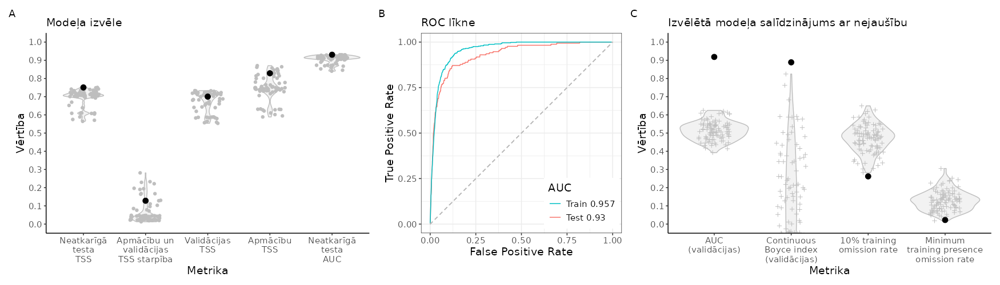
```

<br>

```{r SlieksniCLAPOM,echo=FALSE}
suppressPackageStartupMessages(library(kableExtra))
suppressPackageStartupMessages(library(tidyverse))
opts <- options(knitr.kable.NA = "")
slieksni=readxl::read_excel("./Papilddati/BestThresholds/BestThs_CLAPOM.xlsx")
tabula=kableExtra::kbl(slieksni, caption = 'Biežāk lietotie projicētās dzīvotņu piemērotības sliekšņa līmeņi un to izvērtējums', 
                    booktabs = TRUE, 
                    longtable = TRUE) 
tabula %>%
  kable_styling(latex_options = "scale_down") %>%
  scroll_box(width = "100%", box_css = "border: 0px;")
```


<br>


```{r HSprojCLAPOM, echo=FALSE, out.width = '100%', fig.cap='Labākā modeļa projekcija suga sdzīvotņu piemērotībai. Krāsu skala reprezentē cloglog vērtību no 0 līdz 1, kur starp galapunktiem esošā atzīme ir vienādas sensitivātes un specifiskuma treniņdatos slieksnis iepriekšējā tabulā (izvēlēts vizualizēšanas mērķiem un skaidrošanas ērtumam).'}
  knitr::include_graphics("./Atteli/Beigam_KarteNebal/BeiguKarteiNebal_CLAPOM.png")
```

<br>


[**Vēl nē:** Dzīvotņu piemērotība (GeoTIFF)]()

[**Vēl nē:** Par labāko atzītais modelis (krosvalidācijas; *.RDS)]()

[**Vēl nē:** Par labāko atzītais modelis (kombinēts; *.RDS)]()

[**Vēl nē:** Par labāko atzītais modelis (tikai ietekmīgās pazīmes; *.RDS)]()

[**Vēl nē:** Ekoģeogrāfisko mainīgo izvēles gaita, to VIF (savstarpējās prognozētspējas raksturojums) un ietekmes modelī (permutāciju procedūrā) raksturojums (*.xlsx)]()

**Attēls EGV marginālajām atbildēm**

<br>


### CIRAER - niedru lija *Circus aeruginosus* {#Chapter10.1.052}


```{r NovAtlaseCIRAER, echo=FALSE, out.width = '100%', fig.cap='Novērojumu atlases gaita un modelēšanā izmantojamie niedru lijas *Circus aeruginosus* novērojumi un fona punkti: A - novērojumu saglabāšanās atlases gaitā; B - visu pieejamo novērojumu (solis 1) izvietojums; C - ar vismaz iespējamu ligzdošanu skaitītie novēorjumi, kas izturējuši līdz septītā soļa beigām (punkti ir unikālie 1 km kvadrāti, krusti ir unikālie 100 m kvadrāti); D - ar vismaz ticamu ligzdošanu skaitītie novēorjumi, kas izturējuši līdz septītā soļa beigām (punkti ir unikālie 1 km kvadrāti, krusti ir unikālie 100 m kvadrāti); E - ar pierādītu ligzdošanu skaitītie novēorjumi, kas izturējuši līdz septītā soļa beigām (punkti ir unikālie 1 km kvadrāti, krusti ir unikālie 100 m kvadrāti); F - modelēšanā izmantojamā apmācību kopa (punkti ir sugas klātbūtnes, krusti ir fona raksturošanai); G - modelēšanā izmantojamā neatkarīgās testēšanas kopa (punkti ir sugas klātbūtnes, krusti ir fona raksturošanai)'}
knitr::include_graphics("./Atteli/IzvelesAtteli/ObsSelection_CIRAER.png")
```


<br>


```{r ModelaRaksturojumsCIRAER, echo=FALSE, out.width = '100%', fig.cap='Labākā modeļa izvēle un uzvērtējums: A - labākā modeļa (ar treknu melnu punktu) salīdzinājums ar citiem pielāgotajiem modeļiem (pelēkie punkti un to sastopamības blīvuma funkcijas); B - labākā modeļa izvērtējums, to salīdzinot ar nejauši ģenerētiem nulles modeļiem (n=100) tajā pašā EGV, klātbūtnez un fona punktu veidotajā informācijas telpā.'}
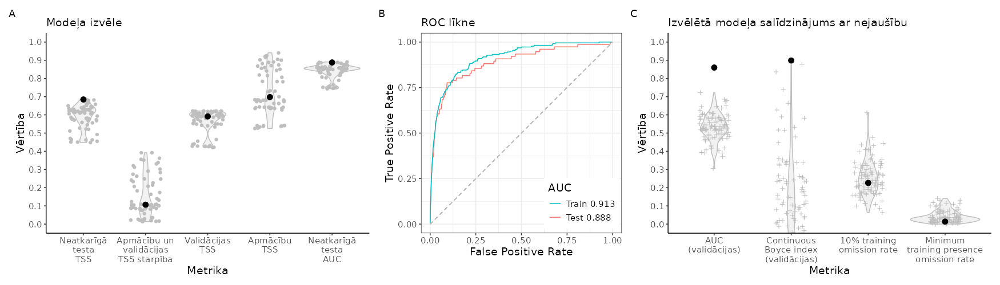
```

<br>

```{r SlieksniCIRAER,echo=FALSE}
suppressPackageStartupMessages(library(kableExtra))
suppressPackageStartupMessages(library(tidyverse))
opts <- options(knitr.kable.NA = "")
slieksni=readxl::read_excel("./Papilddati/BestThresholds/BestThs_CIRAER.xlsx")
tabula=kableExtra::kbl(slieksni, caption = 'Biežāk lietotie projicētās dzīvotņu piemērotības sliekšņa līmeņi un to izvērtējums', 
                    booktabs = TRUE, 
                    longtable = TRUE) 
tabula %>%
  kable_styling(latex_options = "scale_down") %>%
  scroll_box(width = "100%", box_css = "border: 0px;")
```


<br>


```{r HSprojCIRAER, echo=FALSE, out.width = '100%', fig.cap='Labākā modeļa projekcija suga sdzīvotņu piemērotībai. Krāsu skala reprezentē cloglog vērtību no 0 līdz 1, kur starp galapunktiem esošā atzīme ir vienādas sensitivātes un specifiskuma treniņdatos slieksnis iepriekšējā tabulā (izvēlēts vizualizēšanas mērķiem un skaidrošanas ērtumam).'}
  knitr::include_graphics("./Atteli/Beigam_KarteNebal/BeiguKarteiNebal_CIRAER.png")
```

<br>


[**Vēl nē:** Dzīvotņu piemērotība (GeoTIFF)]()

[**Vēl nē:** Par labāko atzītais modelis (krosvalidācijas; *.RDS)]()

[**Vēl nē:** Par labāko atzītais modelis (kombinēts; *.RDS)]()

[**Vēl nē:** Par labāko atzītais modelis (tikai ietekmīgās pazīmes; *.RDS)]()

[**Vēl nē:** Ekoģeogrāfisko mainīgo izvēles gaita, to VIF (savstarpējās prognozētspējas raksturojums) un ietekmes modelī (permutāciju procedūrā) raksturojums (*.xlsx)]()

**Attēls EGV marginālajām atbildēm**

<br>


### ACCNIS - zvirbuļvanags *Accipiter nisus* {#Chapter10.1.053}


```{r NovAtlaseACCNIS, echo=FALSE, out.width = '100%', fig.cap='Novērojumu atlases gaita un modelēšanā izmantojamie zvirbuļvanaga *Accipiter nisus* novērojumi un fona punkti: A - novērojumu saglabāšanās atlases gaitā; B - visu pieejamo novērojumu (solis 1) izvietojums; C - ar vismaz iespējamu ligzdošanu skaitītie novēorjumi, kas izturējuši līdz septītā soļa beigām (punkti ir unikālie 1 km kvadrāti, krusti ir unikālie 100 m kvadrāti); D - ar vismaz ticamu ligzdošanu skaitītie novēorjumi, kas izturējuši līdz septītā soļa beigām (punkti ir unikālie 1 km kvadrāti, krusti ir unikālie 100 m kvadrāti); E - ar pierādītu ligzdošanu skaitītie novēorjumi, kas izturējuši līdz septītā soļa beigām (punkti ir unikālie 1 km kvadrāti, krusti ir unikālie 100 m kvadrāti); F - modelēšanā izmantojamā apmācību kopa (punkti ir sugas klātbūtnes, krusti ir fona raksturošanai); G - modelēšanā izmantojamā neatkarīgās testēšanas kopa (punkti ir sugas klātbūtnes, krusti ir fona raksturošanai)'}
knitr::include_graphics("./Atteli/IzvelesAtteli/ObsSelection_ACCNIS.png")
```


<br>


```{r ModelaRaksturojumsACCNIS, echo=FALSE, out.width = '100%', fig.cap='Labākā modeļa izvēle un uzvērtējums: A - labākā modeļa (ar treknu melnu punktu) salīdzinājums ar citiem pielāgotajiem modeļiem (pelēkie punkti un to sastopamības blīvuma funkcijas); B - labākā modeļa izvērtējums, to salīdzinot ar nejauši ģenerētiem nulles modeļiem (n=100) tajā pašā EGV, klātbūtnez un fona punktu veidotajā informācijas telpā.'}
knitr::include_graphics("./Atteli/Beigam_IzvelesAttels/IzvelesAttels_ACCNIS.png")
```

<br>

```{r SlieksniACCNIS,echo=FALSE}
suppressPackageStartupMessages(library(kableExtra))
suppressPackageStartupMessages(library(tidyverse))
opts <- options(knitr.kable.NA = "")
slieksni=readxl::read_excel("./Papilddati/BestThresholds/BestThs_ACCNIS.xlsx")
tabula=kableExtra::kbl(slieksni, caption = 'Biežāk lietotie projicētās dzīvotņu piemērotības sliekšņa līmeņi un to izvērtējums', 
                    booktabs = TRUE, 
                    longtable = TRUE) 
tabula %>%
  kable_styling(latex_options = "scale_down") %>%
  scroll_box(width = "100%", box_css = "border: 0px;")
```


<br>


```{r HSprojACCNIS, echo=FALSE, out.width = '100%', fig.cap='Labākā modeļa projekcija suga sdzīvotņu piemērotībai. Krāsu skala reprezentē cloglog vērtību no 0 līdz 1, kur starp galapunktiem esošā atzīme ir vienādas sensitivātes un specifiskuma treniņdatos slieksnis iepriekšējā tabulā (izvēlēts vizualizēšanas mērķiem un skaidrošanas ērtumam).'}
  knitr::include_graphics("./Atteli/Beigam_KarteNebal/BeiguKarteiNebal_ACCNIS.png")
```

<br>


[**Vēl nē:** Dzīvotņu piemērotība (GeoTIFF)]()

[**Vēl nē:** Par labāko atzītais modelis (krosvalidācijas; *.RDS)]()

[**Vēl nē:** Par labāko atzītais modelis (kombinēts; *.RDS)]()

[**Vēl nē:** Par labāko atzītais modelis (tikai ietekmīgās pazīmes; *.RDS)]()

[**Vēl nē:** Ekoģeogrāfisko mainīgo izvēles gaita, to VIF (savstarpējās prognozētspējas raksturojums) un ietekmes modelī (permutāciju procedūrā) raksturojums (*.xlsx)]()

**Attēls EGV marginālajām atbildēm**

<br>


### ACCGEN - vistu vanags *Accipiter gentilis* {#Chapter10.1.054}


```{r NovAtlaseACCGEN, echo=FALSE, out.width = '100%', fig.cap='Novērojumu atlases gaita un modelēšanā izmantojamie vistu vanaga *Accipiter gentilis* novērojumi un fona punkti: A - novērojumu saglabāšanās atlases gaitā; B - visu pieejamo novērojumu (solis 1) izvietojums; C - ar vismaz iespējamu ligzdošanu skaitītie novēorjumi, kas izturējuši līdz septītā soļa beigām (punkti ir unikālie 1 km kvadrāti, krusti ir unikālie 100 m kvadrāti); D - ar vismaz ticamu ligzdošanu skaitītie novēorjumi, kas izturējuši līdz septītā soļa beigām (punkti ir unikālie 1 km kvadrāti, krusti ir unikālie 100 m kvadrāti); E - ar pierādītu ligzdošanu skaitītie novēorjumi, kas izturējuši līdz septītā soļa beigām (punkti ir unikālie 1 km kvadrāti, krusti ir unikālie 100 m kvadrāti); F - modelēšanā izmantojamā apmācību kopa (punkti ir sugas klātbūtnes, krusti ir fona raksturošanai); G - modelēšanā izmantojamā neatkarīgās testēšanas kopa (punkti ir sugas klātbūtnes, krusti ir fona raksturošanai)'}
knitr::include_graphics("./Atteli/IzvelesAtteli/ObsSelection_ACCGEN.png")
```


<br>


```{r ModelaRaksturojumsACCGEN, echo=FALSE, out.width = '100%', fig.cap='Labākā modeļa izvēle un uzvērtējums: A - labākā modeļa (ar treknu melnu punktu) salīdzinājums ar citiem pielāgotajiem modeļiem (pelēkie punkti un to sastopamības blīvuma funkcijas); B - labākā modeļa izvērtējums, to salīdzinot ar nejauši ģenerētiem nulles modeļiem (n=100) tajā pašā EGV, klātbūtnez un fona punktu veidotajā informācijas telpā.'}
knitr::include_graphics("./Atteli/Beigam_IzvelesAttels/IzvelesAttels_ACCGEN.png")
```

<br>

```{r SlieksniACCGEN,echo=FALSE}
suppressPackageStartupMessages(library(kableExtra))
suppressPackageStartupMessages(library(tidyverse))
opts <- options(knitr.kable.NA = "")
slieksni=readxl::read_excel("./Papilddati/BestThresholds/BestThs_ACCGEN.xlsx")
tabula=kableExtra::kbl(slieksni, caption = 'Biežāk lietotie projicētās dzīvotņu piemērotības sliekšņa līmeņi un to izvērtējums', 
                    booktabs = TRUE, 
                    longtable = TRUE) 
tabula %>%
  kable_styling(latex_options = "scale_down") %>%
  scroll_box(width = "100%", box_css = "border: 0px;")
```


<br>


```{r HSprojACCGEN, echo=FALSE, out.width = '100%', fig.cap='Labākā modeļa projekcija suga sdzīvotņu piemērotībai. Krāsu skala reprezentē cloglog vērtību no 0 līdz 1, kur starp galapunktiem esošā atzīme ir vienādas sensitivātes un specifiskuma treniņdatos slieksnis iepriekšējā tabulā (izvēlēts vizualizēšanas mērķiem un skaidrošanas ērtumam).'}
  knitr::include_graphics("./Atteli/Beigam_KarteNebal/BeiguKarteiNebal_ACCGEN.png")
```

<br>


[**Vēl nē:** Dzīvotņu piemērotība (GeoTIFF)]()

[**Vēl nē:** Par labāko atzītais modelis (krosvalidācijas; *.RDS)]()

[**Vēl nē:** Par labāko atzītais modelis (kombinēts; *.RDS)]()

[**Vēl nē:** Par labāko atzītais modelis (tikai ietekmīgās pazīmes; *.RDS)]()

[**Vēl nē:** Ekoģeogrāfisko mainīgo izvēles gaita, to VIF (savstarpējās prognozētspējas raksturojums) un ietekmes modelī (permutāciju procedūrā) raksturojums (*.xlsx)]()

**Attēls EGV marginālajām atbildēm**

<br>


### HALALB - jūras ērglis *Haliaeetus albicilla* {#Chapter10.1.055}


```{r NovAtlaseHALALB, echo=FALSE, out.width = '100%', fig.cap='Novērojumu atlases gaita un modelēšanā izmantojamie jūras ērgļa *Haliaeetus albicilla* novērojumi un fona punkti: A - novērojumu saglabāšanās atlases gaitā; B - visu pieejamo novērojumu (solis 1) izvietojums; C - ar vismaz iespējamu ligzdošanu skaitītie novēorjumi, kas izturējuši līdz septītā soļa beigām (punkti ir unikālie 1 km kvadrāti, krusti ir unikālie 100 m kvadrāti); D - ar vismaz ticamu ligzdošanu skaitītie novēorjumi, kas izturējuši līdz septītā soļa beigām (punkti ir unikālie 1 km kvadrāti, krusti ir unikālie 100 m kvadrāti); E - ar pierādītu ligzdošanu skaitītie novēorjumi, kas izturējuši līdz septītā soļa beigām (punkti ir unikālie 1 km kvadrāti, krusti ir unikālie 100 m kvadrāti); F - modelēšanā izmantojamā apmācību kopa (punkti ir sugas klātbūtnes, krusti ir fona raksturošanai); G - modelēšanā izmantojamā neatkarīgās testēšanas kopa (punkti ir sugas klātbūtnes, krusti ir fona raksturošanai)'}

```


<br>


```{r ModelaRaksturojumsHALALB, echo=FALSE, out.width = '100%', fig.cap='Labākā modeļa izvēle un uzvērtējums: A - labākā modeļa (ar treknu melnu punktu) salīdzinājums ar citiem pielāgotajiem modeļiem (pelēkie punkti un to sastopamības blīvuma funkcijas); B - labākā modeļa izvērtējums, to salīdzinot ar nejauši ģenerētiem nulles modeļiem (n=100) tajā pašā EGV, klātbūtnez un fona punktu veidotajā informācijas telpā.'}
knitr::include_graphics("./Atteli/Beigam_IzvelesAttels/IzvelesAttels_HALALB.png")
```

<br>

```{r SlieksniHALALB,echo=FALSE}
suppressPackageStartupMessages(library(kableExtra))
suppressPackageStartupMessages(library(tidyverse))
opts <- options(knitr.kable.NA = "")
slieksni=readxl::read_excel("./Papilddati/BestThresholds/BestThs_HALALB.xlsx")
tabula=kableExtra::kbl(slieksni, caption = 'Biežāk lietotie projicētās dzīvotņu piemērotības sliekšņa līmeņi un to izvērtējums', 
                    booktabs = TRUE, 
                    longtable = TRUE) 
tabula %>%
  kable_styling(latex_options = "scale_down") %>%
  scroll_box(width = "100%", box_css = "border: 0px;")
```


<br>


```{r HSprojHALALB, echo=FALSE, out.width = '100%', fig.cap='Labākā modeļa projekcija suga sdzīvotņu piemērotībai. Krāsu skala reprezentē cloglog vērtību no 0 līdz 1, kur starp galapunktiem esošā atzīme ir vienādas sensitivātes un specifiskuma treniņdatos slieksnis iepriekšējā tabulā (izvēlēts vizualizēšanas mērķiem un skaidrošanas ērtumam).'}
  knitr::include_graphics("./Atteli/Beigam_KarteNebal/BeiguKarteiNebal_HALALB.png")
```

<br>


[**Vēl nē:** Dzīvotņu piemērotība (GeoTIFF)]()

[**Vēl nē:** Par labāko atzītais modelis (krosvalidācijas; *.RDS)]()

[**Vēl nē:** Par labāko atzītais modelis (kombinēts; *.RDS)]()

[**Vēl nē:** Par labāko atzītais modelis (tikai ietekmīgās pazīmes; *.RDS)]()

[**Vēl nē:** Ekoģeogrāfisko mainīgo izvēles gaita, to VIF (savstarpējās prognozētspējas raksturojums) un ietekmes modelī (permutāciju procedūrā) raksturojums (*.xlsx)]()

**Attēls EGV marginālajām atbildēm**

<br>


### MILMIL - sarkanā klija *Milvus milvus* {#Chapter10.1.056}


```{r NovAtlaseMILMIL, echo=FALSE, out.width = '100%', fig.cap='Novērojumu atlases gaita un modelēšanā izmantojamie sarkanās klijas *Milvus milvus* novērojumi un fona punkti: A - novērojumu saglabāšanās atlases gaitā; B - visu pieejamo novērojumu (solis 1) izvietojums; C - ar vismaz iespējamu ligzdošanu skaitītie novēorjumi, kas izturējuši līdz septītā soļa beigām (punkti ir unikālie 1 km kvadrāti, krusti ir unikālie 100 m kvadrāti); D - ar vismaz ticamu ligzdošanu skaitītie novēorjumi, kas izturējuši līdz septītā soļa beigām (punkti ir unikālie 1 km kvadrāti, krusti ir unikālie 100 m kvadrāti); E - ar pierādītu ligzdošanu skaitītie novēorjumi, kas izturējuši līdz septītā soļa beigām (punkti ir unikālie 1 km kvadrāti, krusti ir unikālie 100 m kvadrāti); F - modelēšanā izmantojamā apmācību kopa (punkti ir sugas klātbūtnes, krusti ir fona raksturošanai); G - modelēšanā izmantojamā neatkarīgās testēšanas kopa (punkti ir sugas klātbūtnes, krusti ir fona raksturošanai)'}
knitr::include_graphics("./Atteli/IzvelesAtteli/ObsSelection_MILMIL.png")
```


<br>


```{r ModelaRaksturojumsMILMIL, echo=FALSE, out.width = '100%', fig.cap='Labākā modeļa izvēle un uzvērtējums: A - labākā modeļa (ar treknu melnu punktu) salīdzinājums ar citiem pielāgotajiem modeļiem (pelēkie punkti un to sastopamības blīvuma funkcijas); B - labākā modeļa izvērtējums, to salīdzinot ar nejauši ģenerētiem nulles modeļiem (n=100) tajā pašā EGV, klātbūtnez un fona punktu veidotajā informācijas telpā.'}

```

<br>

```{r SlieksniMILMIL,echo=FALSE}
suppressPackageStartupMessages(library(kableExtra))
suppressPackageStartupMessages(library(tidyverse))
opts <- options(knitr.kable.NA = "")
slieksni=readxl::read_excel("./Papilddati/BestThresholds/BestThs_MILMIL.xlsx")
tabula=kableExtra::kbl(slieksni, caption = 'Biežāk lietotie projicētās dzīvotņu piemērotības sliekšņa līmeņi un to izvērtējums', 
                    booktabs = TRUE, 
                    longtable = TRUE) 
tabula %>%
  kable_styling(latex_options = "scale_down") %>%
  scroll_box(width = "100%", box_css = "border: 0px;")
```


<br>


```{r HSprojMILMIL, echo=FALSE, out.width = '100%', fig.cap='Labākā modeļa projekcija suga sdzīvotņu piemērotībai. Krāsu skala reprezentē cloglog vērtību no 0 līdz 1, kur starp galapunktiem esošā atzīme ir vienādas sensitivātes un specifiskuma treniņdatos slieksnis iepriekšējā tabulā (izvēlēts vizualizēšanas mērķiem un skaidrošanas ērtumam).'}
  knitr::include_graphics("./Atteli/Beigam_KarteNebal/BeiguKarteiNebal_MILMIL.png")
```

<br>


[**Vēl nē:** Dzīvotņu piemērotība (GeoTIFF)]()

[**Vēl nē:** Par labāko atzītais modelis (krosvalidācijas; *.RDS)]()

[**Vēl nē:** Par labāko atzītais modelis (kombinēts; *.RDS)]()

[**Vēl nē:** Par labāko atzītais modelis (tikai ietekmīgās pazīmes; *.RDS)]()

[**Vēl nē:** Ekoģeogrāfisko mainīgo izvēles gaita, to VIF (savstarpējās prognozētspējas raksturojums) un ietekmes modelī (permutāciju procedūrā) raksturojums (*.xlsx)]()

**Attēls EGV marginālajām atbildēm**

<br>


### MILMIG - melnā klija *Milvus migrans* {#Chapter10.1.057}


```{r NovAtlaseMILMIG, echo=FALSE, out.width = '100%', fig.cap='Novērojumu atlases gaita un modelēšanā izmantojamie melnās klijas *Milvus migrans* novērojumi un fona punkti: A - novērojumu saglabāšanās atlases gaitā; B - visu pieejamo novērojumu (solis 1) izvietojums; C - ar vismaz iespējamu ligzdošanu skaitītie novēorjumi, kas izturējuši līdz septītā soļa beigām (punkti ir unikālie 1 km kvadrāti, krusti ir unikālie 100 m kvadrāti); D - ar vismaz ticamu ligzdošanu skaitītie novēorjumi, kas izturējuši līdz septītā soļa beigām (punkti ir unikālie 1 km kvadrāti, krusti ir unikālie 100 m kvadrāti); E - ar pierādītu ligzdošanu skaitītie novēorjumi, kas izturējuši līdz septītā soļa beigām (punkti ir unikālie 1 km kvadrāti, krusti ir unikālie 100 m kvadrāti); F - modelēšanā izmantojamā apmācību kopa (punkti ir sugas klātbūtnes, krusti ir fona raksturošanai); G - modelēšanā izmantojamā neatkarīgās testēšanas kopa (punkti ir sugas klātbūtnes, krusti ir fona raksturošanai)'}

```


<br>


```{r ModelaRaksturojumsMILMIG, echo=FALSE, out.width = '100%', fig.cap='Labākā modeļa izvēle un uzvērtējums: A - labākā modeļa (ar treknu melnu punktu) salīdzinājums ar citiem pielāgotajiem modeļiem (pelēkie punkti un to sastopamības blīvuma funkcijas); B - labākā modeļa izvērtējums, to salīdzinot ar nejauši ģenerētiem nulles modeļiem (n=100) tajā pašā EGV, klātbūtnez un fona punktu veidotajā informācijas telpā.'}
knitr::include_graphics("./Atteli/Beigam_IzvelesAttels/IzvelesAttels_MILMIG.png")
```

<br>

```{r SlieksniMILMIG,echo=FALSE}
suppressPackageStartupMessages(library(kableExtra))
suppressPackageStartupMessages(library(tidyverse))
opts <- options(knitr.kable.NA = "")
slieksni=readxl::read_excel("./Papilddati/BestThresholds/BestThs_MILMIG.xlsx")
tabula=kableExtra::kbl(slieksni, caption = 'Biežāk lietotie projicētās dzīvotņu piemērotības sliekšņa līmeņi un to izvērtējums', 
                    booktabs = TRUE, 
                    longtable = TRUE) 
tabula %>%
  kable_styling(latex_options = "scale_down") %>%
  scroll_box(width = "100%", box_css = "border: 0px;")
```


<br>


```{r HSprojMILMIG, echo=FALSE, out.width = '100%', fig.cap='Labākā modeļa projekcija suga sdzīvotņu piemērotībai. Krāsu skala reprezentē cloglog vērtību no 0 līdz 1, kur starp galapunktiem esošā atzīme ir vienādas sensitivātes un specifiskuma treniņdatos slieksnis iepriekšējā tabulā (izvēlēts vizualizēšanas mērķiem un skaidrošanas ērtumam).'}
  knitr::include_graphics("./Atteli/Beigam_KarteNebal/BeiguKarteiNebal_MILMIG.png")
```

<br>


[**Vēl nē:** Dzīvotņu piemērotība (GeoTIFF)]()

[**Vēl nē:** Par labāko atzītais modelis (krosvalidācijas; *.RDS)]()

[**Vēl nē:** Par labāko atzītais modelis (kombinēts; *.RDS)]()

[**Vēl nē:** Par labāko atzītais modelis (tikai ietekmīgās pazīmes; *.RDS)]()

[**Vēl nē:** Ekoģeogrāfisko mainīgo izvēles gaita, to VIF (savstarpējās prognozētspējas raksturojums) un ietekmes modelī (permutāciju procedūrā) raksturojums (*.xlsx)]()

**Attēls EGV marginālajām atbildēm**

<br>


### BUTBUT - peļu klijāns *Buteo buteo* {#Chapter10.1.058}


```{r NovAtlaseBUTBUT, echo=FALSE, out.width = '100%', fig.cap='Novērojumu atlases gaita un modelēšanā izmantojamie peļu klijāna *Buteo buteo* novērojumi un fona punkti: A - novērojumu saglabāšanās atlases gaitā; B - visu pieejamo novērojumu (solis 1) izvietojums; C - ar vismaz iespējamu ligzdošanu skaitītie novēorjumi, kas izturējuši līdz septītā soļa beigām (punkti ir unikālie 1 km kvadrāti, krusti ir unikālie 100 m kvadrāti); D - ar vismaz ticamu ligzdošanu skaitītie novēorjumi, kas izturējuši līdz septītā soļa beigām (punkti ir unikālie 1 km kvadrāti, krusti ir unikālie 100 m kvadrāti); E - ar pierādītu ligzdošanu skaitītie novēorjumi, kas izturējuši līdz septītā soļa beigām (punkti ir unikālie 1 km kvadrāti, krusti ir unikālie 100 m kvadrāti); F - modelēšanā izmantojamā apmācību kopa (punkti ir sugas klātbūtnes, krusti ir fona raksturošanai); G - modelēšanā izmantojamā neatkarīgās testēšanas kopa (punkti ir sugas klātbūtnes, krusti ir fona raksturošanai)'}
knitr::include_graphics("./Atteli/IzvelesAtteli/ObsSelection_BUTBUT.png")
```


<br>


```{r ModelaRaksturojumsBUTBUT, echo=FALSE, out.width = '100%', fig.cap='Labākā modeļa izvēle un uzvērtējums: A - labākā modeļa (ar treknu melnu punktu) salīdzinājums ar citiem pielāgotajiem modeļiem (pelēkie punkti un to sastopamības blīvuma funkcijas); B - labākā modeļa izvērtējums, to salīdzinot ar nejauši ģenerētiem nulles modeļiem (n=100) tajā pašā EGV, klātbūtnez un fona punktu veidotajā informācijas telpā.'}
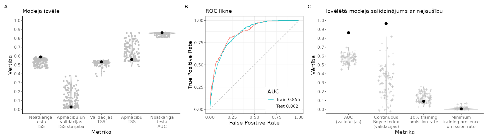
```

<br>

```{r SlieksniBUTBUT,echo=FALSE}
suppressPackageStartupMessages(library(kableExtra))
suppressPackageStartupMessages(library(tidyverse))
opts <- options(knitr.kable.NA = "")
slieksni=readxl::read_excel("./Papilddati/BestThresholds/BestThs_BUTBUT.xlsx")
tabula=kableExtra::kbl(slieksni, caption = 'Biežāk lietotie projicētās dzīvotņu piemērotības sliekšņa līmeņi un to izvērtējums', 
                    booktabs = TRUE, 
                    longtable = TRUE) 
tabula %>%
  kable_styling(latex_options = "scale_down") %>%
  scroll_box(width = "100%", box_css = "border: 0px;")
```


<br>


```{r HSprojBUTBUT, echo=FALSE, out.width = '100%', fig.cap='Labākā modeļa projekcija suga sdzīvotņu piemērotībai. Krāsu skala reprezentē cloglog vērtību no 0 līdz 1, kur starp galapunktiem esošā atzīme ir vienādas sensitivātes un specifiskuma treniņdatos slieksnis iepriekšējā tabulā (izvēlēts vizualizēšanas mērķiem un skaidrošanas ērtumam).'}
  knitr::include_graphics("./Atteli/Beigam_KarteNebal/BeiguKarteiNebal_BUTBUT.png")
```

<br>


[**Vēl nē:** Dzīvotņu piemērotība (GeoTIFF)]()

[**Vēl nē:** Par labāko atzītais modelis (krosvalidācijas; *.RDS)]()

[**Vēl nē:** Par labāko atzītais modelis (kombinēts; *.RDS)]()

[**Vēl nē:** Par labāko atzītais modelis (tikai ietekmīgās pazīmes; *.RDS)]()

[**Vēl nē:** Ekoģeogrāfisko mainīgo izvēles gaita, to VIF (savstarpējās prognozētspējas raksturojums) un ietekmes modelī (permutāciju procedūrā) raksturojums (*.xlsx)]()

**Attēls EGV marginālajām atbildēm**

<br>


### UPUEPO - pupuķis *Upupa epops* {#Chapter10.1.059}


```{r NovAtlaseUPUEPO, echo=FALSE, out.width = '100%', fig.cap='Novērojumu atlases gaita un modelēšanā izmantojamie pupuķa *Upupa epops* novērojumi un fona punkti: A - novērojumu saglabāšanās atlases gaitā; B - visu pieejamo novērojumu (solis 1) izvietojums; C - ar vismaz iespējamu ligzdošanu skaitītie novēorjumi, kas izturējuši līdz septītā soļa beigām (punkti ir unikālie 1 km kvadrāti, krusti ir unikālie 100 m kvadrāti); D - ar vismaz ticamu ligzdošanu skaitītie novēorjumi, kas izturējuši līdz septītā soļa beigām (punkti ir unikālie 1 km kvadrāti, krusti ir unikālie 100 m kvadrāti); E - ar pierādītu ligzdošanu skaitītie novēorjumi, kas izturējuši līdz septītā soļa beigām (punkti ir unikālie 1 km kvadrāti, krusti ir unikālie 100 m kvadrāti); F - modelēšanā izmantojamā apmācību kopa (punkti ir sugas klātbūtnes, krusti ir fona raksturošanai); G - modelēšanā izmantojamā neatkarīgās testēšanas kopa (punkti ir sugas klātbūtnes, krusti ir fona raksturošanai)'}
knitr::include_graphics("./Atteli/IzvelesAtteli/ObsSelection_UPUEPO.png")
```


<br>


```{r ModelaRaksturojumsUPUEPO, echo=FALSE, out.width = '100%', fig.cap='Labākā modeļa izvēle un uzvērtējums: A - labākā modeļa (ar treknu melnu punktu) salīdzinājums ar citiem pielāgotajiem modeļiem (pelēkie punkti un to sastopamības blīvuma funkcijas); B - labākā modeļa izvērtējums, to salīdzinot ar nejauši ģenerētiem nulles modeļiem (n=100) tajā pašā EGV, klātbūtnez un fona punktu veidotajā informācijas telpā.'}

```

<br>

```{r SlieksniUPUEPO,echo=FALSE}
suppressPackageStartupMessages(library(kableExtra))
suppressPackageStartupMessages(library(tidyverse))
opts <- options(knitr.kable.NA = "")
slieksni=readxl::read_excel("./Papilddati/BestThresholds/BestThs_UPUEPO.xlsx")
tabula=kableExtra::kbl(slieksni, caption = 'Biežāk lietotie projicētās dzīvotņu piemērotības sliekšņa līmeņi un to izvērtējums', 
                    booktabs = TRUE, 
                    longtable = TRUE) 
tabula %>%
  kable_styling(latex_options = "scale_down") %>%
  scroll_box(width = "100%", box_css = "border: 0px;")
```


<br>


```{r HSprojUPUEPO, echo=FALSE, out.width = '100%', fig.cap='Labākā modeļa projekcija suga sdzīvotņu piemērotībai. Krāsu skala reprezentē cloglog vērtību no 0 līdz 1, kur starp galapunktiem esošā atzīme ir vienādas sensitivātes un specifiskuma treniņdatos slieksnis iepriekšējā tabulā (izvēlēts vizualizēšanas mērķiem un skaidrošanas ērtumam).'}
  knitr::include_graphics("./Atteli/Beigam_KarteNebal/BeiguKarteiNebal_UPUEPO.png")
```

<br>


[**Vēl nē:** Dzīvotņu piemērotība (GeoTIFF)]()

[**Vēl nē:** Par labāko atzītais modelis (krosvalidācijas; *.RDS)]()

[**Vēl nē:** Par labāko atzītais modelis (kombinēts; *.RDS)]()

[**Vēl nē:** Par labāko atzītais modelis (tikai ietekmīgās pazīmes; *.RDS)]()

[**Vēl nē:** Ekoģeogrāfisko mainīgo izvēles gaita, to VIF (savstarpējās prognozētspējas raksturojums) un ietekmes modelī (permutāciju procedūrā) raksturojums (*.xlsx)]()

**Attēls EGV marginālajām atbildēm**

<br>


### CORGAR - zaļā vārna *Coracias garrulus* {#Chapter10.1.060}


```{r NovAtlaseCORGAR, echo=FALSE, out.width = '100%', fig.cap='Novērojumu atlases gaita un modelēšanā izmantojamie zaļās vārnas *Coracias garrulus* novērojumi un fona punkti: A - novērojumu saglabāšanās atlases gaitā; B - visu pieejamo novērojumu (solis 1) izvietojums; C - ar vismaz iespējamu ligzdošanu skaitītie novēorjumi, kas izturējuši līdz septītā soļa beigām (punkti ir unikālie 1 km kvadrāti, krusti ir unikālie 100 m kvadrāti); D - ar vismaz ticamu ligzdošanu skaitītie novēorjumi, kas izturējuši līdz septītā soļa beigām (punkti ir unikālie 1 km kvadrāti, krusti ir unikālie 100 m kvadrāti); E - ar pierādītu ligzdošanu skaitītie novēorjumi, kas izturējuši līdz septītā soļa beigām (punkti ir unikālie 1 km kvadrāti, krusti ir unikālie 100 m kvadrāti); F - modelēšanā izmantojamā apmācību kopa (punkti ir sugas klātbūtnes, krusti ir fona raksturošanai); G - modelēšanā izmantojamā neatkarīgās testēšanas kopa (punkti ir sugas klātbūtnes, krusti ir fona raksturošanai)'}
knitr::include_graphics("./Atteli/IzvelesAtteli/ObsSelection_CORGAR.png")
```


<br>


```{r ModelaRaksturojumsCORGAR, echo=FALSE, out.width = '100%', fig.cap='Labākā modeļa izvēle un uzvērtējums: A - labākā modeļa (ar treknu melnu punktu) salīdzinājums ar citiem pielāgotajiem modeļiem (pelēkie punkti un to sastopamības blīvuma funkcijas); B - labākā modeļa izvērtējums, to salīdzinot ar nejauši ģenerētiem nulles modeļiem (n=100) tajā pašā EGV, klātbūtnez un fona punktu veidotajā informācijas telpā.'}

```

<br>

```{r SlieksniCORGAR,echo=FALSE}
suppressPackageStartupMessages(library(kableExtra))
suppressPackageStartupMessages(library(tidyverse))
opts <- options(knitr.kable.NA = "")
slieksni=readxl::read_excel("./Papilddati/BestThresholds/BestThs_CORGAR.xlsx")
tabula=kableExtra::kbl(slieksni, caption = 'Biežāk lietotie projicētās dzīvotņu piemērotības sliekšņa līmeņi un to izvērtējums', 
                    booktabs = TRUE, 
                    longtable = TRUE) 
tabula %>%
  kable_styling(latex_options = "scale_down") %>%
  scroll_box(width = "100%", box_css = "border: 0px;")
```


<br>


```{r HSprojCORGAR, echo=FALSE, out.width = '100%', fig.cap='Labākā modeļa projekcija suga sdzīvotņu piemērotībai. Krāsu skala reprezentē cloglog vērtību no 0 līdz 1, kur starp galapunktiem esošā atzīme ir vienādas sensitivātes un specifiskuma treniņdatos slieksnis iepriekšējā tabulā (izvēlēts vizualizēšanas mērķiem un skaidrošanas ērtumam).'}
  knitr::include_graphics("./Atteli/Beigam_KarteNebal/BeiguKarteiNebal_CORGAR.png")
```

<br>


[**Vēl nē:** Dzīvotņu piemērotība (GeoTIFF)]()

[**Vēl nē:** Par labāko atzītais modelis (krosvalidācijas; *.RDS)]()

[**Vēl nē:** Par labāko atzītais modelis (kombinēts; *.RDS)]()

[**Vēl nē:** Par labāko atzītais modelis (tikai ietekmīgās pazīmes; *.RDS)]()

[**Vēl nē:** Ekoģeogrāfisko mainīgo izvēles gaita, to VIF (savstarpējās prognozētspējas raksturojums) un ietekmes modelī (permutāciju procedūrā) raksturojums (*.xlsx)]()

**Attēls EGV marginālajām atbildēm**

<br>


### JYNTOR - tītiņš *Jynx torquilla* {#Chapter10.1.061}


```{r NovAtlaseJYNTOR, echo=FALSE, out.width = '100%', fig.cap='Novērojumu atlases gaita un modelēšanā izmantojamie tītiņa *Jynx torquilla* novērojumi un fona punkti: A - novērojumu saglabāšanās atlases gaitā; B - visu pieejamo novērojumu (solis 1) izvietojums; C - ar vismaz iespējamu ligzdošanu skaitītie novēorjumi, kas izturējuši līdz septītā soļa beigām (punkti ir unikālie 1 km kvadrāti, krusti ir unikālie 100 m kvadrāti); D - ar vismaz ticamu ligzdošanu skaitītie novēorjumi, kas izturējuši līdz septītā soļa beigām (punkti ir unikālie 1 km kvadrāti, krusti ir unikālie 100 m kvadrāti); E - ar pierādītu ligzdošanu skaitītie novēorjumi, kas izturējuši līdz septītā soļa beigām (punkti ir unikālie 1 km kvadrāti, krusti ir unikālie 100 m kvadrāti); F - modelēšanā izmantojamā apmācību kopa (punkti ir sugas klātbūtnes, krusti ir fona raksturošanai); G - modelēšanā izmantojamā neatkarīgās testēšanas kopa (punkti ir sugas klātbūtnes, krusti ir fona raksturošanai)'}

```


<br>


```{r ModelaRaksturojumsJYNTOR, echo=FALSE, out.width = '100%', fig.cap='Labākā modeļa izvēle un uzvērtējums: A - labākā modeļa (ar treknu melnu punktu) salīdzinājums ar citiem pielāgotajiem modeļiem (pelēkie punkti un to sastopamības blīvuma funkcijas); B - labākā modeļa izvērtējums, to salīdzinot ar nejauši ģenerētiem nulles modeļiem (n=100) tajā pašā EGV, klātbūtnez un fona punktu veidotajā informācijas telpā.'}
knitr::include_graphics("./Atteli/Beigam_IzvelesAttels/IzvelesAttels_JYNTOR.png")
```

<br>

```{r SlieksniJYNTOR,echo=FALSE}
suppressPackageStartupMessages(library(kableExtra))
suppressPackageStartupMessages(library(tidyverse))
opts <- options(knitr.kable.NA = "")
slieksni=readxl::read_excel("./Papilddati/BestThresholds/BestThs_JYNTOR.xlsx")
tabula=kableExtra::kbl(slieksni, caption = 'Biežāk lietotie projicētās dzīvotņu piemērotības sliekšņa līmeņi un to izvērtējums', 
                    booktabs = TRUE, 
                    longtable = TRUE) 
tabula %>%
  kable_styling(latex_options = "scale_down") %>%
  scroll_box(width = "100%", box_css = "border: 0px;")
```


<br>


```{r HSprojJYNTOR, echo=FALSE, out.width = '100%', fig.cap='Labākā modeļa projekcija suga sdzīvotņu piemērotībai. Krāsu skala reprezentē cloglog vērtību no 0 līdz 1, kur starp galapunktiem esošā atzīme ir vienādas sensitivātes un specifiskuma treniņdatos slieksnis iepriekšējā tabulā (izvēlēts vizualizēšanas mērķiem un skaidrošanas ērtumam).'}
  
```

<br>


[**Vēl nē:** Dzīvotņu piemērotība (GeoTIFF)]()

[**Vēl nē:** Par labāko atzītais modelis (krosvalidācijas; *.RDS)]()

[**Vēl nē:** Par labāko atzītais modelis (kombinēts; *.RDS)]()

[**Vēl nē:** Par labāko atzītais modelis (tikai ietekmīgās pazīmes; *.RDS)]()

[**Vēl nē:** Ekoģeogrāfisko mainīgo izvēles gaita, to VIF (savstarpējās prognozētspējas raksturojums) un ietekmes modelī (permutāciju procedūrā) raksturojums (*.xlsx)]()

**Attēls EGV marginālajām atbildēm**

<br>


### PICCAN - pelēkā dzilna *Picus canus* {#Chapter10.1.062}


```{r NovAtlasePICCAN, echo=FALSE, out.width = '100%', fig.cap='Novērojumu atlases gaita un modelēšanā izmantojamie pelēkās dzilnas *Picus canus* novērojumi un fona punkti: A - novērojumu saglabāšanās atlases gaitā; B - visu pieejamo novērojumu (solis 1) izvietojums; C - ar vismaz iespējamu ligzdošanu skaitītie novēorjumi, kas izturējuši līdz septītā soļa beigām (punkti ir unikālie 1 km kvadrāti, krusti ir unikālie 100 m kvadrāti); D - ar vismaz ticamu ligzdošanu skaitītie novēorjumi, kas izturējuši līdz septītā soļa beigām (punkti ir unikālie 1 km kvadrāti, krusti ir unikālie 100 m kvadrāti); E - ar pierādītu ligzdošanu skaitītie novēorjumi, kas izturējuši līdz septītā soļa beigām (punkti ir unikālie 1 km kvadrāti, krusti ir unikālie 100 m kvadrāti); F - modelēšanā izmantojamā apmācību kopa (punkti ir sugas klātbūtnes, krusti ir fona raksturošanai); G - modelēšanā izmantojamā neatkarīgās testēšanas kopa (punkti ir sugas klātbūtnes, krusti ir fona raksturošanai)'}
knitr::include_graphics("./Atteli/IzvelesAtteli/ObsSelection_PICCAN.png")
```


<br>


```{r ModelaRaksturojumsPICCAN, echo=FALSE, out.width = '100%', fig.cap='Labākā modeļa izvēle un uzvērtējums: A - labākā modeļa (ar treknu melnu punktu) salīdzinājums ar citiem pielāgotajiem modeļiem (pelēkie punkti un to sastopamības blīvuma funkcijas); B - labākā modeļa izvērtējums, to salīdzinot ar nejauši ģenerētiem nulles modeļiem (n=100) tajā pašā EGV, klātbūtnez un fona punktu veidotajā informācijas telpā.'}
knitr::include_graphics("./Atteli/Beigam_IzvelesAttels/IzvelesAttels_PICCAN.png")
```

<br>

```{r SlieksniPICCAN,echo=FALSE}
suppressPackageStartupMessages(library(kableExtra))
suppressPackageStartupMessages(library(tidyverse))
opts <- options(knitr.kable.NA = "")
slieksni=readxl::read_excel("./Papilddati/BestThresholds/BestThs_PICCAN.xlsx")
tabula=kableExtra::kbl(slieksni, caption = 'Biežāk lietotie projicētās dzīvotņu piemērotības sliekšņa līmeņi un to izvērtējums', 
                    booktabs = TRUE, 
                    longtable = TRUE) 
tabula %>%
  kable_styling(latex_options = "scale_down") %>%
  scroll_box(width = "100%", box_css = "border: 0px;")
```


<br>


```{r HSprojPICCAN, echo=FALSE, out.width = '100%', fig.cap='Labākā modeļa projekcija suga sdzīvotņu piemērotībai. Krāsu skala reprezentē cloglog vērtību no 0 līdz 1, kur starp galapunktiem esošā atzīme ir vienādas sensitivātes un specifiskuma treniņdatos slieksnis iepriekšējā tabulā (izvēlēts vizualizēšanas mērķiem un skaidrošanas ērtumam).'}
  
```

<br>


[**Vēl nē:** Dzīvotņu piemērotība (GeoTIFF)]()

[**Vēl nē:** Par labāko atzītais modelis (krosvalidācijas; *.RDS)]()

[**Vēl nē:** Par labāko atzītais modelis (kombinēts; *.RDS)]()

[**Vēl nē:** Par labāko atzītais modelis (tikai ietekmīgās pazīmes; *.RDS)]()

[**Vēl nē:** Ekoģeogrāfisko mainīgo izvēles gaita, to VIF (savstarpējās prognozētspējas raksturojums) un ietekmes modelī (permutāciju procedūrā) raksturojums (*.xlsx)]()

**Attēls EGV marginālajām atbildēm**

<br>


### DRYMAR - melnā dzilna *Dryocopus martius* {#Chapter10.1.063}


```{r NovAtlaseDRYMAR, echo=FALSE, out.width = '100%', fig.cap='Novērojumu atlases gaita un modelēšanā izmantojamie melnās dzilnas *Dryocopus martius* novērojumi un fona punkti: A - novērojumu saglabāšanās atlases gaitā; B - visu pieejamo novērojumu (solis 1) izvietojums; C - ar vismaz iespējamu ligzdošanu skaitītie novēorjumi, kas izturējuši līdz septītā soļa beigām (punkti ir unikālie 1 km kvadrāti, krusti ir unikālie 100 m kvadrāti); D - ar vismaz ticamu ligzdošanu skaitītie novēorjumi, kas izturējuši līdz septītā soļa beigām (punkti ir unikālie 1 km kvadrāti, krusti ir unikālie 100 m kvadrāti); E - ar pierādītu ligzdošanu skaitītie novēorjumi, kas izturējuši līdz septītā soļa beigām (punkti ir unikālie 1 km kvadrāti, krusti ir unikālie 100 m kvadrāti); F - modelēšanā izmantojamā apmācību kopa (punkti ir sugas klātbūtnes, krusti ir fona raksturošanai); G - modelēšanā izmantojamā neatkarīgās testēšanas kopa (punkti ir sugas klātbūtnes, krusti ir fona raksturošanai)'}

```


<br>


```{r ModelaRaksturojumsDRYMAR, echo=FALSE, out.width = '100%', fig.cap='Labākā modeļa izvēle un uzvērtējums: A - labākā modeļa (ar treknu melnu punktu) salīdzinājums ar citiem pielāgotajiem modeļiem (pelēkie punkti un to sastopamības blīvuma funkcijas); B - labākā modeļa izvērtējums, to salīdzinot ar nejauši ģenerētiem nulles modeļiem (n=100) tajā pašā EGV, klātbūtnez un fona punktu veidotajā informācijas telpā.'}
knitr::include_graphics("./Atteli/Beigam_IzvelesAttels/IzvelesAttels_DRYMAR.png")
```

<br>

```{r SlieksniDRYMAR,echo=FALSE}
suppressPackageStartupMessages(library(kableExtra))
suppressPackageStartupMessages(library(tidyverse))
opts <- options(knitr.kable.NA = "")
slieksni=readxl::read_excel("./Papilddati/BestThresholds/BestThs_DRYMAR.xlsx")
tabula=kableExtra::kbl(slieksni, caption = 'Biežāk lietotie projicētās dzīvotņu piemērotības sliekšņa līmeņi un to izvērtējums', 
                    booktabs = TRUE, 
                    longtable = TRUE) 
tabula %>%
  kable_styling(latex_options = "scale_down") %>%
  scroll_box(width = "100%", box_css = "border: 0px;")
```


<br>


```{r HSprojDRYMAR, echo=FALSE, out.width = '100%', fig.cap='Labākā modeļa projekcija suga sdzīvotņu piemērotībai. Krāsu skala reprezentē cloglog vērtību no 0 līdz 1, kur starp galapunktiem esošā atzīme ir vienādas sensitivātes un specifiskuma treniņdatos slieksnis iepriekšējā tabulā (izvēlēts vizualizēšanas mērķiem un skaidrošanas ērtumam).'}
  knitr::include_graphics("./Atteli/Beigam_KarteNebal/BeiguKarteiNebal_DRYMAR.png")
```

<br>


[**Vēl nē:** Dzīvotņu piemērotība (GeoTIFF)]()

[**Vēl nē:** Par labāko atzītais modelis (krosvalidācijas; *.RDS)]()

[**Vēl nē:** Par labāko atzītais modelis (kombinēts; *.RDS)]()

[**Vēl nē:** Par labāko atzītais modelis (tikai ietekmīgās pazīmes; *.RDS)]()

[**Vēl nē:** Ekoģeogrāfisko mainīgo izvēles gaita, to VIF (savstarpējās prognozētspējas raksturojums) un ietekmes modelī (permutāciju procedūrā) raksturojums (*.xlsx)]()

**Attēls EGV marginālajām atbildēm**

<br>


### PICTRI - trīspirkstu dzenis *Picoides tridactylus* {#Chapter10.1.064}


```{r NovAtlasePICTRI, echo=FALSE, out.width = '100%', fig.cap='Novērojumu atlases gaita un modelēšanā izmantojamie trīspirkstu dzeņa *Picoides tridactylus* novērojumi un fona punkti: A - novērojumu saglabāšanās atlases gaitā; B - visu pieejamo novērojumu (solis 1) izvietojums; C - ar vismaz iespējamu ligzdošanu skaitītie novēorjumi, kas izturējuši līdz septītā soļa beigām (punkti ir unikālie 1 km kvadrāti, krusti ir unikālie 100 m kvadrāti); D - ar vismaz ticamu ligzdošanu skaitītie novēorjumi, kas izturējuši līdz septītā soļa beigām (punkti ir unikālie 1 km kvadrāti, krusti ir unikālie 100 m kvadrāti); E - ar pierādītu ligzdošanu skaitītie novēorjumi, kas izturējuši līdz septītā soļa beigām (punkti ir unikālie 1 km kvadrāti, krusti ir unikālie 100 m kvadrāti); F - modelēšanā izmantojamā apmācību kopa (punkti ir sugas klātbūtnes, krusti ir fona raksturošanai); G - modelēšanā izmantojamā neatkarīgās testēšanas kopa (punkti ir sugas klātbūtnes, krusti ir fona raksturošanai)'}
knitr::include_graphics("./Atteli/IzvelesAtteli/ObsSelection_PICTRI.png")
```


<br>


```{r ModelaRaksturojumsPICTRI, echo=FALSE, out.width = '100%', fig.cap='Labākā modeļa izvēle un uzvērtējums: A - labākā modeļa (ar treknu melnu punktu) salīdzinājums ar citiem pielāgotajiem modeļiem (pelēkie punkti un to sastopamības blīvuma funkcijas); B - labākā modeļa izvērtējums, to salīdzinot ar nejauši ģenerētiem nulles modeļiem (n=100) tajā pašā EGV, klātbūtnez un fona punktu veidotajā informācijas telpā.'}
knitr::include_graphics("./Atteli/Beigam_IzvelesAttels/IzvelesAttels_PICTRI.png")
```

<br>

```{r SlieksniPICTRI,echo=FALSE}
suppressPackageStartupMessages(library(kableExtra))
suppressPackageStartupMessages(library(tidyverse))
opts <- options(knitr.kable.NA = "")
slieksni=readxl::read_excel("./Papilddati/BestThresholds/BestThs_PICTRI.xlsx")
tabula=kableExtra::kbl(slieksni, caption = 'Biežāk lietotie projicētās dzīvotņu piemērotības sliekšņa līmeņi un to izvērtējums', 
                    booktabs = TRUE, 
                    longtable = TRUE) 
tabula %>%
  kable_styling(latex_options = "scale_down") %>%
  scroll_box(width = "100%", box_css = "border: 0px;")
```


<br>


```{r HSprojPICTRI, echo=FALSE, out.width = '100%', fig.cap='Labākā modeļa projekcija suga sdzīvotņu piemērotībai. Krāsu skala reprezentē cloglog vērtību no 0 līdz 1, kur starp galapunktiem esošā atzīme ir vienādas sensitivātes un specifiskuma treniņdatos slieksnis iepriekšējā tabulā (izvēlēts vizualizēšanas mērķiem un skaidrošanas ērtumam).'}
  
```

<br>


[**Vēl nē:** Dzīvotņu piemērotība (GeoTIFF)]()

[**Vēl nē:** Par labāko atzītais modelis (krosvalidācijas; *.RDS)]()

[**Vēl nē:** Par labāko atzītais modelis (kombinēts; *.RDS)]()

[**Vēl nē:** Par labāko atzītais modelis (tikai ietekmīgās pazīmes; *.RDS)]()

[**Vēl nē:** Ekoģeogrāfisko mainīgo izvēles gaita, to VIF (savstarpējās prognozētspējas raksturojums) un ietekmes modelī (permutāciju procedūrā) raksturojums (*.xlsx)]()

**Attēls EGV marginālajām atbildēm**

<br>


### LEIMED - vidējais dzenis *Leiopicus medius* {#Chapter10.1.065}


```{r NovAtlaseLEIMED, echo=FALSE, out.width = '100%', fig.cap='Novērojumu atlases gaita un modelēšanā izmantojamie vidējā dzeņa *Leiopicus medius* novērojumi un fona punkti: A - novērojumu saglabāšanās atlases gaitā; B - visu pieejamo novērojumu (solis 1) izvietojums; C - ar vismaz iespējamu ligzdošanu skaitītie novēorjumi, kas izturējuši līdz septītā soļa beigām (punkti ir unikālie 1 km kvadrāti, krusti ir unikālie 100 m kvadrāti); D - ar vismaz ticamu ligzdošanu skaitītie novēorjumi, kas izturējuši līdz septītā soļa beigām (punkti ir unikālie 1 km kvadrāti, krusti ir unikālie 100 m kvadrāti); E - ar pierādītu ligzdošanu skaitītie novēorjumi, kas izturējuši līdz septītā soļa beigām (punkti ir unikālie 1 km kvadrāti, krusti ir unikālie 100 m kvadrāti); F - modelēšanā izmantojamā apmācību kopa (punkti ir sugas klātbūtnes, krusti ir fona raksturošanai); G - modelēšanā izmantojamā neatkarīgās testēšanas kopa (punkti ir sugas klātbūtnes, krusti ir fona raksturošanai)'}
knitr::include_graphics("./Atteli/IzvelesAtteli/ObsSelection_LEIMED.png")
```


<br>


```{r ModelaRaksturojumsLEIMED, echo=FALSE, out.width = '100%', fig.cap='Labākā modeļa izvēle un uzvērtējums: A - labākā modeļa (ar treknu melnu punktu) salīdzinājums ar citiem pielāgotajiem modeļiem (pelēkie punkti un to sastopamības blīvuma funkcijas); B - labākā modeļa izvērtējums, to salīdzinot ar nejauši ģenerētiem nulles modeļiem (n=100) tajā pašā EGV, klātbūtnez un fona punktu veidotajā informācijas telpā.'}
knitr::include_graphics("./Atteli/Beigam_IzvelesAttels/IzvelesAttels_LEIMED.png")
```

<br>

```{r SlieksniLEIMED,echo=FALSE}
suppressPackageStartupMessages(library(kableExtra))
suppressPackageStartupMessages(library(tidyverse))
opts <- options(knitr.kable.NA = "")
slieksni=readxl::read_excel("./Papilddati/BestThresholds/BestThs_LEIMED.xlsx")
tabula=kableExtra::kbl(slieksni, caption = 'Biežāk lietotie projicētās dzīvotņu piemērotības sliekšņa līmeņi un to izvērtējums', 
                    booktabs = TRUE, 
                    longtable = TRUE) 
tabula %>%
  kable_styling(latex_options = "scale_down") %>%
  scroll_box(width = "100%", box_css = "border: 0px;")
```


<br>


```{r HSprojLEIMED, echo=FALSE, out.width = '100%', fig.cap='Labākā modeļa projekcija suga sdzīvotņu piemērotībai. Krāsu skala reprezentē cloglog vērtību no 0 līdz 1, kur starp galapunktiem esošā atzīme ir vienādas sensitivātes un specifiskuma treniņdatos slieksnis iepriekšējā tabulā (izvēlēts vizualizēšanas mērķiem un skaidrošanas ērtumam).'}
  knitr::include_graphics("./Atteli/Beigam_KarteNebal/BeiguKarteiNebal_LEIMED.png")
```

<br>


[**Vēl nē:** Dzīvotņu piemērotība (GeoTIFF)]()

[**Vēl nē:** Par labāko atzītais modelis (krosvalidācijas; *.RDS)]()

[**Vēl nē:** Par labāko atzītais modelis (kombinēts; *.RDS)]()

[**Vēl nē:** Par labāko atzītais modelis (tikai ietekmīgās pazīmes; *.RDS)]()

[**Vēl nē:** Ekoģeogrāfisko mainīgo izvēles gaita, to VIF (savstarpējās prognozētspējas raksturojums) un ietekmes modelī (permutāciju procedūrā) raksturojums (*.xlsx)]()

**Attēls EGV marginālajām atbildēm**

<br>


### DRYMIN - mazais dzenis *Dryobates minor* {#Chapter10.1.066}


```{r NovAtlaseDRYMIN, echo=FALSE, out.width = '100%', fig.cap='Novērojumu atlases gaita un modelēšanā izmantojamie mazā dzeņa *Dryobates minor* novērojumi un fona punkti: A - novērojumu saglabāšanās atlases gaitā; B - visu pieejamo novērojumu (solis 1) izvietojums; C - ar vismaz iespējamu ligzdošanu skaitītie novēorjumi, kas izturējuši līdz septītā soļa beigām (punkti ir unikālie 1 km kvadrāti, krusti ir unikālie 100 m kvadrāti); D - ar vismaz ticamu ligzdošanu skaitītie novēorjumi, kas izturējuši līdz septītā soļa beigām (punkti ir unikālie 1 km kvadrāti, krusti ir unikālie 100 m kvadrāti); E - ar pierādītu ligzdošanu skaitītie novēorjumi, kas izturējuši līdz septītā soļa beigām (punkti ir unikālie 1 km kvadrāti, krusti ir unikālie 100 m kvadrāti); F - modelēšanā izmantojamā apmācību kopa (punkti ir sugas klātbūtnes, krusti ir fona raksturošanai); G - modelēšanā izmantojamā neatkarīgās testēšanas kopa (punkti ir sugas klātbūtnes, krusti ir fona raksturošanai)'}
knitr::include_graphics("./Atteli/IzvelesAtteli/ObsSelection_DRYMIN.png")
```


<br>


```{r ModelaRaksturojumsDRYMIN, echo=FALSE, out.width = '100%', fig.cap='Labākā modeļa izvēle un uzvērtējums: A - labākā modeļa (ar treknu melnu punktu) salīdzinājums ar citiem pielāgotajiem modeļiem (pelēkie punkti un to sastopamības blīvuma funkcijas); B - labākā modeļa izvērtējums, to salīdzinot ar nejauši ģenerētiem nulles modeļiem (n=100) tajā pašā EGV, klātbūtnez un fona punktu veidotajā informācijas telpā.'}
knitr::include_graphics("./Atteli/Beigam_IzvelesAttels/IzvelesAttels_DRYMIN.png")
```

<br>

```{r SlieksniDRYMIN,echo=FALSE}
suppressPackageStartupMessages(library(kableExtra))
suppressPackageStartupMessages(library(tidyverse))
opts <- options(knitr.kable.NA = "")
slieksni=readxl::read_excel("./Papilddati/BestThresholds/BestThs_DRYMIN.xlsx")
tabula=kableExtra::kbl(slieksni, caption = 'Biežāk lietotie projicētās dzīvotņu piemērotības sliekšņa līmeņi un to izvērtējums', 
                    booktabs = TRUE, 
                    longtable = TRUE) 
tabula %>%
  kable_styling(latex_options = "scale_down") %>%
  scroll_box(width = "100%", box_css = "border: 0px;")
```


<br>


```{r HSprojDRYMIN, echo=FALSE, out.width = '100%', fig.cap='Labākā modeļa projekcija suga sdzīvotņu piemērotībai. Krāsu skala reprezentē cloglog vērtību no 0 līdz 1, kur starp galapunktiem esošā atzīme ir vienādas sensitivātes un specifiskuma treniņdatos slieksnis iepriekšējā tabulā (izvēlēts vizualizēšanas mērķiem un skaidrošanas ērtumam).'}
  knitr::include_graphics("./Atteli/Beigam_KarteNebal/BeiguKarteiNebal_DRYMIN.png")
```

<br>


[**Vēl nē:** Dzīvotņu piemērotība (GeoTIFF)]()

[**Vēl nē:** Par labāko atzītais modelis (krosvalidācijas; *.RDS)]()

[**Vēl nē:** Par labāko atzītais modelis (kombinēts; *.RDS)]()

[**Vēl nē:** Par labāko atzītais modelis (tikai ietekmīgās pazīmes; *.RDS)]()

[**Vēl nē:** Ekoģeogrāfisko mainīgo izvēles gaita, to VIF (savstarpējās prognozētspējas raksturojums) un ietekmes modelī (permutāciju procedūrā) raksturojums (*.xlsx)]()

**Attēls EGV marginālajām atbildēm**

<br>


### DENLEU - baltmugurdzenis *Dendrocopos leucotos* {#Chapter10.1.067}


```{r NovAtlaseDENLEU, echo=FALSE, out.width = '100%', fig.cap='Novērojumu atlases gaita un modelēšanā izmantojamie baltmugurdzeņa *Dendrocopos leucotos* novērojumi un fona punkti: A - novērojumu saglabāšanās atlases gaitā; B - visu pieejamo novērojumu (solis 1) izvietojums; C - ar vismaz iespējamu ligzdošanu skaitītie novēorjumi, kas izturējuši līdz septītā soļa beigām (punkti ir unikālie 1 km kvadrāti, krusti ir unikālie 100 m kvadrāti); D - ar vismaz ticamu ligzdošanu skaitītie novēorjumi, kas izturējuši līdz septītā soļa beigām (punkti ir unikālie 1 km kvadrāti, krusti ir unikālie 100 m kvadrāti); E - ar pierādītu ligzdošanu skaitītie novēorjumi, kas izturējuši līdz septītā soļa beigām (punkti ir unikālie 1 km kvadrāti, krusti ir unikālie 100 m kvadrāti); F - modelēšanā izmantojamā apmācību kopa (punkti ir sugas klātbūtnes, krusti ir fona raksturošanai); G - modelēšanā izmantojamā neatkarīgās testēšanas kopa (punkti ir sugas klātbūtnes, krusti ir fona raksturošanai)'}
knitr::include_graphics("./Atteli/IzvelesAtteli/ObsSelection_DENLEU.png")
```


<br>


```{r ModelaRaksturojumsDENLEU, echo=FALSE, out.width = '100%', fig.cap='Labākā modeļa izvēle un uzvērtējums: A - labākā modeļa (ar treknu melnu punktu) salīdzinājums ar citiem pielāgotajiem modeļiem (pelēkie punkti un to sastopamības blīvuma funkcijas); B - labākā modeļa izvērtējums, to salīdzinot ar nejauši ģenerētiem nulles modeļiem (n=100) tajā pašā EGV, klātbūtnez un fona punktu veidotajā informācijas telpā.'}
knitr::include_graphics("./Atteli/Beigam_IzvelesAttels/IzvelesAttels_DENLEU.png")
```

<br>

```{r SlieksniDENLEU,echo=FALSE}
suppressPackageStartupMessages(library(kableExtra))
suppressPackageStartupMessages(library(tidyverse))
opts <- options(knitr.kable.NA = "")
slieksni=readxl::read_excel("./Papilddati/BestThresholds/BestThs_DENLEU.xlsx")
tabula=kableExtra::kbl(slieksni, caption = 'Biežāk lietotie projicētās dzīvotņu piemērotības sliekšņa līmeņi un to izvērtējums', 
                    booktabs = TRUE, 
                    longtable = TRUE) 
tabula %>%
  kable_styling(latex_options = "scale_down") %>%
  scroll_box(width = "100%", box_css = "border: 0px;")
```


<br>


```{r HSprojDENLEU, echo=FALSE, out.width = '100%', fig.cap='Labākā modeļa projekcija suga sdzīvotņu piemērotībai. Krāsu skala reprezentē cloglog vērtību no 0 līdz 1, kur starp galapunktiem esošā atzīme ir vienādas sensitivātes un specifiskuma treniņdatos slieksnis iepriekšējā tabulā (izvēlēts vizualizēšanas mērķiem un skaidrošanas ērtumam).'}
  knitr::include_graphics("./Atteli/Beigam_KarteNebal/BeiguKarteiNebal_DENLEU.png")
```

<br>


[**Vēl nē:** Dzīvotņu piemērotība (GeoTIFF)]()

[**Vēl nē:** Par labāko atzītais modelis (krosvalidācijas; *.RDS)]()

[**Vēl nē:** Par labāko atzītais modelis (kombinēts; *.RDS)]()

[**Vēl nē:** Par labāko atzītais modelis (tikai ietekmīgās pazīmes; *.RDS)]()

[**Vēl nē:** Ekoģeogrāfisko mainīgo izvēles gaita, to VIF (savstarpējās prognozētspējas raksturojums) un ietekmes modelī (permutāciju procedūrā) raksturojums (*.xlsx)]()

**Attēls EGV marginālajām atbildēm**

<br>


### DENMAJ - dižraibais dzenis *Dendrocopos major* {#Chapter10.1.068}


```{r NovAtlaseDENMAJ, echo=FALSE, out.width = '100%', fig.cap='Novērojumu atlases gaita un modelēšanā izmantojamie dižraibā dzeņa *Dendrocopos major* novērojumi un fona punkti: A - novērojumu saglabāšanās atlases gaitā; B - visu pieejamo novērojumu (solis 1) izvietojums; C - ar vismaz iespējamu ligzdošanu skaitītie novēorjumi, kas izturējuši līdz septītā soļa beigām (punkti ir unikālie 1 km kvadrāti, krusti ir unikālie 100 m kvadrāti); D - ar vismaz ticamu ligzdošanu skaitītie novēorjumi, kas izturējuši līdz septītā soļa beigām (punkti ir unikālie 1 km kvadrāti, krusti ir unikālie 100 m kvadrāti); E - ar pierādītu ligzdošanu skaitītie novēorjumi, kas izturējuši līdz septītā soļa beigām (punkti ir unikālie 1 km kvadrāti, krusti ir unikālie 100 m kvadrāti); F - modelēšanā izmantojamā apmācību kopa (punkti ir sugas klātbūtnes, krusti ir fona raksturošanai); G - modelēšanā izmantojamā neatkarīgās testēšanas kopa (punkti ir sugas klātbūtnes, krusti ir fona raksturošanai)'}
knitr::include_graphics("./Atteli/IzvelesAtteli/ObsSelection_DENMAJ.png")
```


<br>


```{r ModelaRaksturojumsDENMAJ, echo=FALSE, out.width = '100%', fig.cap='Labākā modeļa izvēle un uzvērtējums: A - labākā modeļa (ar treknu melnu punktu) salīdzinājums ar citiem pielāgotajiem modeļiem (pelēkie punkti un to sastopamības blīvuma funkcijas); B - labākā modeļa izvērtējums, to salīdzinot ar nejauši ģenerētiem nulles modeļiem (n=100) tajā pašā EGV, klātbūtnez un fona punktu veidotajā informācijas telpā.'}
knitr::include_graphics("./Atteli/Beigam_IzvelesAttels/IzvelesAttels_DENMAJ.png")
```

<br>

```{r SlieksniDENMAJ,echo=FALSE}
suppressPackageStartupMessages(library(kableExtra))
suppressPackageStartupMessages(library(tidyverse))
opts <- options(knitr.kable.NA = "")
slieksni=readxl::read_excel("./Papilddati/BestThresholds/BestThs_DENMAJ.xlsx")
tabula=kableExtra::kbl(slieksni, caption = 'Biežāk lietotie projicētās dzīvotņu piemērotības sliekšņa līmeņi un to izvērtējums', 
                    booktabs = TRUE, 
                    longtable = TRUE) 
tabula %>%
  kable_styling(latex_options = "scale_down") %>%
  scroll_box(width = "100%", box_css = "border: 0px;")
```


<br>


```{r HSprojDENMAJ, echo=FALSE, out.width = '100%', fig.cap='Labākā modeļa projekcija suga sdzīvotņu piemērotībai. Krāsu skala reprezentē cloglog vērtību no 0 līdz 1, kur starp galapunktiem esošā atzīme ir vienādas sensitivātes un specifiskuma treniņdatos slieksnis iepriekšējā tabulā (izvēlēts vizualizēšanas mērķiem un skaidrošanas ērtumam).'}
  
```

<br>


[**Vēl nē:** Dzīvotņu piemērotība (GeoTIFF)]()

[**Vēl nē:** Par labāko atzītais modelis (krosvalidācijas; *.RDS)]()

[**Vēl nē:** Par labāko atzītais modelis (kombinēts; *.RDS)]()

[**Vēl nē:** Par labāko atzītais modelis (tikai ietekmīgās pazīmes; *.RDS)]()

[**Vēl nē:** Ekoģeogrāfisko mainīgo izvēles gaita, to VIF (savstarpējās prognozētspējas raksturojums) un ietekmes modelī (permutāciju procedūrā) raksturojums (*.xlsx)]()

**Attēls EGV marginālajām atbildēm**

<br>


### FALTIN - lauku piekūns *Falco tinnunculus* {#Chapter10.1.069}


```{r NovAtlaseFALTIN, echo=FALSE, out.width = '100%', fig.cap='Novērojumu atlases gaita un modelēšanā izmantojamie lauku piekūna *Falco tinnunculus* novērojumi un fona punkti: A - novērojumu saglabāšanās atlases gaitā; B - visu pieejamo novērojumu (solis 1) izvietojums; C - ar vismaz iespējamu ligzdošanu skaitītie novēorjumi, kas izturējuši līdz septītā soļa beigām (punkti ir unikālie 1 km kvadrāti, krusti ir unikālie 100 m kvadrāti); D - ar vismaz ticamu ligzdošanu skaitītie novēorjumi, kas izturējuši līdz septītā soļa beigām (punkti ir unikālie 1 km kvadrāti, krusti ir unikālie 100 m kvadrāti); E - ar pierādītu ligzdošanu skaitītie novēorjumi, kas izturējuši līdz septītā soļa beigām (punkti ir unikālie 1 km kvadrāti, krusti ir unikālie 100 m kvadrāti); F - modelēšanā izmantojamā apmācību kopa (punkti ir sugas klātbūtnes, krusti ir fona raksturošanai); G - modelēšanā izmantojamā neatkarīgās testēšanas kopa (punkti ir sugas klātbūtnes, krusti ir fona raksturošanai)'}
knitr::include_graphics("./Atteli/IzvelesAtteli/ObsSelection_FALTIN.png")
```


<br>


```{r ModelaRaksturojumsFALTIN, echo=FALSE, out.width = '100%', fig.cap='Labākā modeļa izvēle un uzvērtējums: A - labākā modeļa (ar treknu melnu punktu) salīdzinājums ar citiem pielāgotajiem modeļiem (pelēkie punkti un to sastopamības blīvuma funkcijas); B - labākā modeļa izvērtējums, to salīdzinot ar nejauši ģenerētiem nulles modeļiem (n=100) tajā pašā EGV, klātbūtnez un fona punktu veidotajā informācijas telpā.'}
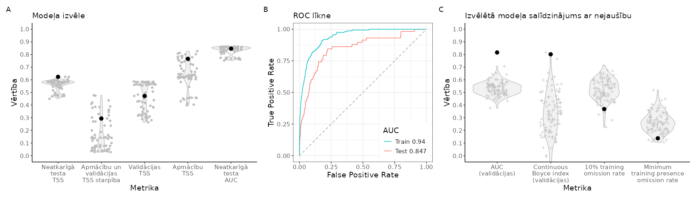
```

<br>

```{r SlieksniFALTIN,echo=FALSE}
suppressPackageStartupMessages(library(kableExtra))
suppressPackageStartupMessages(library(tidyverse))
opts <- options(knitr.kable.NA = "")
slieksni=readxl::read_excel("./Papilddati/BestThresholds/BestThs_FALTIN.xlsx")
tabula=kableExtra::kbl(slieksni, caption = 'Biežāk lietotie projicētās dzīvotņu piemērotības sliekšņa līmeņi un to izvērtējums', 
                    booktabs = TRUE, 
                    longtable = TRUE) 
tabula %>%
  kable_styling(latex_options = "scale_down") %>%
  scroll_box(width = "100%", box_css = "border: 0px;")
```


<br>


```{r HSprojFALTIN, echo=FALSE, out.width = '100%', fig.cap='Labākā modeļa projekcija suga sdzīvotņu piemērotībai. Krāsu skala reprezentē cloglog vērtību no 0 līdz 1, kur starp galapunktiem esošā atzīme ir vienādas sensitivātes un specifiskuma treniņdatos slieksnis iepriekšējā tabulā (izvēlēts vizualizēšanas mērķiem un skaidrošanas ērtumam).'}
  knitr::include_graphics("./Atteli/Beigam_KarteNebal/BeiguKarteiNebal_FALTIN.png")
```

<br>


[**Vēl nē:** Dzīvotņu piemērotība (GeoTIFF)]()

[**Vēl nē:** Par labāko atzītais modelis (krosvalidācijas; *.RDS)]()

[**Vēl nē:** Par labāko atzītais modelis (kombinēts; *.RDS)]()

[**Vēl nē:** Par labāko atzītais modelis (tikai ietekmīgās pazīmes; *.RDS)]()

[**Vēl nē:** Ekoģeogrāfisko mainīgo izvēles gaita, to VIF (savstarpējās prognozētspējas raksturojums) un ietekmes modelī (permutāciju procedūrā) raksturojums (*.xlsx)]()

**Attēls EGV marginālajām atbildēm**

<br>


### FALCOL - purva piekūns *Falco columbarius* {#Chapter10.1.070}


```{r NovAtlaseFALCOL, echo=FALSE, out.width = '100%', fig.cap='Novērojumu atlases gaita un modelēšanā izmantojamie purva piekūna *Falco columbarius* novērojumi un fona punkti: A - novērojumu saglabāšanās atlases gaitā; B - visu pieejamo novērojumu (solis 1) izvietojums; C - ar vismaz iespējamu ligzdošanu skaitītie novēorjumi, kas izturējuši līdz septītā soļa beigām (punkti ir unikālie 1 km kvadrāti, krusti ir unikālie 100 m kvadrāti); D - ar vismaz ticamu ligzdošanu skaitītie novēorjumi, kas izturējuši līdz septītā soļa beigām (punkti ir unikālie 1 km kvadrāti, krusti ir unikālie 100 m kvadrāti); E - ar pierādītu ligzdošanu skaitītie novēorjumi, kas izturējuši līdz septītā soļa beigām (punkti ir unikālie 1 km kvadrāti, krusti ir unikālie 100 m kvadrāti); F - modelēšanā izmantojamā apmācību kopa (punkti ir sugas klātbūtnes, krusti ir fona raksturošanai); G - modelēšanā izmantojamā neatkarīgās testēšanas kopa (punkti ir sugas klātbūtnes, krusti ir fona raksturošanai)'}
knitr::include_graphics("./Atteli/IzvelesAtteli/ObsSelection_FALCOL.png")
```


<br>

**Ar šā brīža pieejām šajā projektā purva piekūna *Falco columbarius* izplatība nav modelējama**

<br>


### ORIORI - vālodze *Oriolus oriolus* {#Chapter10.1.071}


```{r NovAtlaseORIORI, echo=FALSE, out.width = '100%', fig.cap='Novērojumu atlases gaita un modelēšanā izmantojamie vālodzes *Oriolus oriolus* novērojumi un fona punkti: A - novērojumu saglabāšanās atlases gaitā; B - visu pieejamo novērojumu (solis 1) izvietojums; C - ar vismaz iespējamu ligzdošanu skaitītie novēorjumi, kas izturējuši līdz septītā soļa beigām (punkti ir unikālie 1 km kvadrāti, krusti ir unikālie 100 m kvadrāti); D - ar vismaz ticamu ligzdošanu skaitītie novēorjumi, kas izturējuši līdz septītā soļa beigām (punkti ir unikālie 1 km kvadrāti, krusti ir unikālie 100 m kvadrāti); E - ar pierādītu ligzdošanu skaitītie novēorjumi, kas izturējuši līdz septītā soļa beigām (punkti ir unikālie 1 km kvadrāti, krusti ir unikālie 100 m kvadrāti); F - modelēšanā izmantojamā apmācību kopa (punkti ir sugas klātbūtnes, krusti ir fona raksturošanai); G - modelēšanā izmantojamā neatkarīgās testēšanas kopa (punkti ir sugas klātbūtnes, krusti ir fona raksturošanai)'}
knitr::include_graphics("./Atteli/IzvelesAtteli/ObsSelection_ORIORI.png")
```


<br>


```{r ModelaRaksturojumsORIORI, echo=FALSE, out.width = '100%', fig.cap='Labākā modeļa izvēle un uzvērtējums: A - labākā modeļa (ar treknu melnu punktu) salīdzinājums ar citiem pielāgotajiem modeļiem (pelēkie punkti un to sastopamības blīvuma funkcijas); B - labākā modeļa izvērtējums, to salīdzinot ar nejauši ģenerētiem nulles modeļiem (n=100) tajā pašā EGV, klātbūtnez un fona punktu veidotajā informācijas telpā.'}
knitr::include_graphics("./Atteli/Beigam_IzvelesAttels/IzvelesAttels_ORIORI.png")
```

<br>

```{r SlieksniORIORI,echo=FALSE}
suppressPackageStartupMessages(library(kableExtra))
suppressPackageStartupMessages(library(tidyverse))
opts <- options(knitr.kable.NA = "")
slieksni=readxl::read_excel("./Papilddati/BestThresholds/BestThs_ORIORI.xlsx")
tabula=kableExtra::kbl(slieksni, caption = 'Biežāk lietotie projicētās dzīvotņu piemērotības sliekšņa līmeņi un to izvērtējums', 
                    booktabs = TRUE, 
                    longtable = TRUE) 
tabula %>%
  kable_styling(latex_options = "scale_down") %>%
  scroll_box(width = "100%", box_css = "border: 0px;")
```


<br>


```{r HSprojORIORI, echo=FALSE, out.width = '100%', fig.cap='Labākā modeļa projekcija suga sdzīvotņu piemērotībai. Krāsu skala reprezentē cloglog vērtību no 0 līdz 1, kur starp galapunktiem esošā atzīme ir vienādas sensitivātes un specifiskuma treniņdatos slieksnis iepriekšējā tabulā (izvēlēts vizualizēšanas mērķiem un skaidrošanas ērtumam).'}
  knitr::include_graphics("./Atteli/Beigam_KarteNebal/BeiguKarteiNebal_ORIORI.png")
```

<br>


[**Vēl nē:** Dzīvotņu piemērotība (GeoTIFF)]()

[**Vēl nē:** Par labāko atzītais modelis (krosvalidācijas; *.RDS)]()

[**Vēl nē:** Par labāko atzītais modelis (kombinēts; *.RDS)]()

[**Vēl nē:** Par labāko atzītais modelis (tikai ietekmīgās pazīmes; *.RDS)]()

[**Vēl nē:** Ekoģeogrāfisko mainīgo izvēles gaita, to VIF (savstarpējās prognozētspējas raksturojums) un ietekmes modelī (permutāciju procedūrā) raksturojums (*.xlsx)]()

**Attēls EGV marginālajām atbildēm**

<br>


### LANCOL - brūnā čakste *Lanius collurio* {#Chapter10.1.072}


```{r NovAtlaseLANCOL, echo=FALSE, out.width = '100%', fig.cap='Novērojumu atlases gaita un modelēšanā izmantojamie brūnās čakstes *Lanius collurio* novērojumi un fona punkti: A - novērojumu saglabāšanās atlases gaitā; B - visu pieejamo novērojumu (solis 1) izvietojums; C - ar vismaz iespējamu ligzdošanu skaitītie novēorjumi, kas izturējuši līdz septītā soļa beigām (punkti ir unikālie 1 km kvadrāti, krusti ir unikālie 100 m kvadrāti); D - ar vismaz ticamu ligzdošanu skaitītie novēorjumi, kas izturējuši līdz septītā soļa beigām (punkti ir unikālie 1 km kvadrāti, krusti ir unikālie 100 m kvadrāti); E - ar pierādītu ligzdošanu skaitītie novēorjumi, kas izturējuši līdz septītā soļa beigām (punkti ir unikālie 1 km kvadrāti, krusti ir unikālie 100 m kvadrāti); F - modelēšanā izmantojamā apmācību kopa (punkti ir sugas klātbūtnes, krusti ir fona raksturošanai); G - modelēšanā izmantojamā neatkarīgās testēšanas kopa (punkti ir sugas klātbūtnes, krusti ir fona raksturošanai)'}
knitr::include_graphics("./Atteli/IzvelesAtteli/ObsSelection_LANCOL.png")
```


<br>


```{r ModelaRaksturojumsLANCOL, echo=FALSE, out.width = '100%', fig.cap='Labākā modeļa izvēle un uzvērtējums: A - labākā modeļa (ar treknu melnu punktu) salīdzinājums ar citiem pielāgotajiem modeļiem (pelēkie punkti un to sastopamības blīvuma funkcijas); B - labākā modeļa izvērtējums, to salīdzinot ar nejauši ģenerētiem nulles modeļiem (n=100) tajā pašā EGV, klātbūtnez un fona punktu veidotajā informācijas telpā.'}

```

<br>

```{r SlieksniLANCOL,echo=FALSE}
suppressPackageStartupMessages(library(kableExtra))
suppressPackageStartupMessages(library(tidyverse))
opts <- options(knitr.kable.NA = "")
slieksni=readxl::read_excel("./Papilddati/BestThresholds/BestThs_LANCOL.xlsx")
tabula=kableExtra::kbl(slieksni, caption = 'Biežāk lietotie projicētās dzīvotņu piemērotības sliekšņa līmeņi un to izvērtējums', 
                    booktabs = TRUE, 
                    longtable = TRUE) 
tabula %>%
  kable_styling(latex_options = "scale_down") %>%
  scroll_box(width = "100%", box_css = "border: 0px;")
```


<br>


```{r HSprojLANCOL, echo=FALSE, out.width = '100%', fig.cap='Labākā modeļa projekcija suga sdzīvotņu piemērotībai. Krāsu skala reprezentē cloglog vērtību no 0 līdz 1, kur starp galapunktiem esošā atzīme ir vienādas sensitivātes un specifiskuma treniņdatos slieksnis iepriekšējā tabulā (izvēlēts vizualizēšanas mērķiem un skaidrošanas ērtumam).'}
  
```

<br>


[**Vēl nē:** Dzīvotņu piemērotība (GeoTIFF)]()

[**Vēl nē:** Par labāko atzītais modelis (krosvalidācijas; *.RDS)]()

[**Vēl nē:** Par labāko atzītais modelis (kombinēts; *.RDS)]()

[**Vēl nē:** Par labāko atzītais modelis (tikai ietekmīgās pazīmes; *.RDS)]()

[**Vēl nē:** Ekoģeogrāfisko mainīgo izvēles gaita, to VIF (savstarpējās prognozētspējas raksturojums) un ietekmes modelī (permutāciju procedūrā) raksturojums (*.xlsx)]()

**Attēls EGV marginālajām atbildēm**

<br>


### LANEXC - lielā čakste *Lanius excubitor* {#Chapter10.1.073}


```{r NovAtlaseLANEXC, echo=FALSE, out.width = '100%', fig.cap='Novērojumu atlases gaita un modelēšanā izmantojamie lielās čakstes *Lanius excubitor* novērojumi un fona punkti: A - novērojumu saglabāšanās atlases gaitā; B - visu pieejamo novērojumu (solis 1) izvietojums; C - ar vismaz iespējamu ligzdošanu skaitītie novēorjumi, kas izturējuši līdz septītā soļa beigām (punkti ir unikālie 1 km kvadrāti, krusti ir unikālie 100 m kvadrāti); D - ar vismaz ticamu ligzdošanu skaitītie novēorjumi, kas izturējuši līdz septītā soļa beigām (punkti ir unikālie 1 km kvadrāti, krusti ir unikālie 100 m kvadrāti); E - ar pierādītu ligzdošanu skaitītie novēorjumi, kas izturējuši līdz septītā soļa beigām (punkti ir unikālie 1 km kvadrāti, krusti ir unikālie 100 m kvadrāti); F - modelēšanā izmantojamā apmācību kopa (punkti ir sugas klātbūtnes, krusti ir fona raksturošanai); G - modelēšanā izmantojamā neatkarīgās testēšanas kopa (punkti ir sugas klātbūtnes, krusti ir fona raksturošanai)'}
knitr::include_graphics("./Atteli/IzvelesAtteli/ObsSelection_LANEXC.png")
```


<br>


```{r ModelaRaksturojumsLANEXC, echo=FALSE, out.width = '100%', fig.cap='Labākā modeļa izvēle un uzvērtējums: A - labākā modeļa (ar treknu melnu punktu) salīdzinājums ar citiem pielāgotajiem modeļiem (pelēkie punkti un to sastopamības blīvuma funkcijas); B - labākā modeļa izvērtējums, to salīdzinot ar nejauši ģenerētiem nulles modeļiem (n=100) tajā pašā EGV, klātbūtnez un fona punktu veidotajā informācijas telpā.'}
knitr::include_graphics("./Atteli/Beigam_IzvelesAttels/IzvelesAttels_LANEXC.png")
```

<br>

```{r SlieksniLANEXC,echo=FALSE}
suppressPackageStartupMessages(library(kableExtra))
suppressPackageStartupMessages(library(tidyverse))
opts <- options(knitr.kable.NA = "")
slieksni=readxl::read_excel("./Papilddati/BestThresholds/BestThs_LANEXC.xlsx")
tabula=kableExtra::kbl(slieksni, caption = 'Biežāk lietotie projicētās dzīvotņu piemērotības sliekšņa līmeņi un to izvērtējums', 
                    booktabs = TRUE, 
                    longtable = TRUE) 
tabula %>%
  kable_styling(latex_options = "scale_down") %>%
  scroll_box(width = "100%", box_css = "border: 0px;")
```


<br>


```{r HSprojLANEXC, echo=FALSE, out.width = '100%', fig.cap='Labākā modeļa projekcija suga sdzīvotņu piemērotībai. Krāsu skala reprezentē cloglog vērtību no 0 līdz 1, kur starp galapunktiem esošā atzīme ir vienādas sensitivātes un specifiskuma treniņdatos slieksnis iepriekšējā tabulā (izvēlēts vizualizēšanas mērķiem un skaidrošanas ērtumam).'}
  knitr::include_graphics("./Atteli/Beigam_KarteNebal/BeiguKarteiNebal_LANEXC.png")
```

<br>


[**Vēl nē:** Dzīvotņu piemērotība (GeoTIFF)]()

[**Vēl nē:** Par labāko atzītais modelis (krosvalidācijas; *.RDS)]()

[**Vēl nē:** Par labāko atzītais modelis (kombinēts; *.RDS)]()

[**Vēl nē:** Par labāko atzītais modelis (tikai ietekmīgās pazīmes; *.RDS)]()

[**Vēl nē:** Ekoģeogrāfisko mainīgo izvēles gaita, to VIF (savstarpējās prognozētspējas raksturojums) un ietekmes modelī (permutāciju procedūrā) raksturojums (*.xlsx)]()

**Attēls EGV marginālajām atbildēm**

<br>


### NUCCAR - riekstrozis *Nucifraga caryocatactes* {#Chapter10.1.074}


```{r NovAtlaseNUCCAR, echo=FALSE, out.width = '100%', fig.cap='Novērojumu atlases gaita un modelēšanā izmantojamie riekstroža *Nucifraga caryocatactes* novērojumi un fona punkti: A - novērojumu saglabāšanās atlases gaitā; B - visu pieejamo novērojumu (solis 1) izvietojums; C - ar vismaz iespējamu ligzdošanu skaitītie novēorjumi, kas izturējuši līdz septītā soļa beigām (punkti ir unikālie 1 km kvadrāti, krusti ir unikālie 100 m kvadrāti); D - ar vismaz ticamu ligzdošanu skaitītie novēorjumi, kas izturējuši līdz septītā soļa beigām (punkti ir unikālie 1 km kvadrāti, krusti ir unikālie 100 m kvadrāti); E - ar pierādītu ligzdošanu skaitītie novēorjumi, kas izturējuši līdz septītā soļa beigām (punkti ir unikālie 1 km kvadrāti, krusti ir unikālie 100 m kvadrāti); F - modelēšanā izmantojamā apmācību kopa (punkti ir sugas klātbūtnes, krusti ir fona raksturošanai); G - modelēšanā izmantojamā neatkarīgās testēšanas kopa (punkti ir sugas klātbūtnes, krusti ir fona raksturošanai)'}

```


<br>


```{r ModelaRaksturojumsNUCCAR, echo=FALSE, out.width = '100%', fig.cap='Labākā modeļa izvēle un uzvērtējums: A - labākā modeļa (ar treknu melnu punktu) salīdzinājums ar citiem pielāgotajiem modeļiem (pelēkie punkti un to sastopamības blīvuma funkcijas); B - labākā modeļa izvērtējums, to salīdzinot ar nejauši ģenerētiem nulles modeļiem (n=100) tajā pašā EGV, klātbūtnez un fona punktu veidotajā informācijas telpā.'}
knitr::include_graphics("./Atteli/Beigam_IzvelesAttels/IzvelesAttels_NUCCAR.png")
```

<br>

```{r SlieksniNUCCAR,echo=FALSE}
suppressPackageStartupMessages(library(kableExtra))
suppressPackageStartupMessages(library(tidyverse))
opts <- options(knitr.kable.NA = "")
slieksni=readxl::read_excel("./Papilddati/BestThresholds/BestThs_NUCCAR.xlsx")
tabula=kableExtra::kbl(slieksni, caption = 'Biežāk lietotie projicētās dzīvotņu piemērotības sliekšņa līmeņi un to izvērtējums', 
                    booktabs = TRUE, 
                    longtable = TRUE) 
tabula %>%
  kable_styling(latex_options = "scale_down") %>%
  scroll_box(width = "100%", box_css = "border: 0px;")
```


<br>


```{r HSprojNUCCAR, echo=FALSE, out.width = '100%', fig.cap='Labākā modeļa projekcija suga sdzīvotņu piemērotībai. Krāsu skala reprezentē cloglog vērtību no 0 līdz 1, kur starp galapunktiem esošā atzīme ir vienādas sensitivātes un specifiskuma treniņdatos slieksnis iepriekšējā tabulā (izvēlēts vizualizēšanas mērķiem un skaidrošanas ērtumam).'}
  
```

<br>


[**Vēl nē:** Dzīvotņu piemērotība (GeoTIFF)]()

[**Vēl nē:** Par labāko atzītais modelis (krosvalidācijas; *.RDS)]()

[**Vēl nē:** Par labāko atzītais modelis (kombinēts; *.RDS)]()

[**Vēl nē:** Par labāko atzītais modelis (tikai ietekmīgās pazīmes; *.RDS)]()

[**Vēl nē:** Ekoģeogrāfisko mainīgo izvēles gaita, to VIF (savstarpējās prognozētspējas raksturojums) un ietekmes modelī (permutāciju procedūrā) raksturojums (*.xlsx)]()

**Attēls EGV marginālajām atbildēm**

<br>


### PERATE - meža zīlīte *Periparus ater* {#Chapter10.1.075}


```{r NovAtlasePERATE, echo=FALSE, out.width = '100%', fig.cap='Novērojumu atlases gaita un modelēšanā izmantojamie meža zīlītes *Periparus ater* novērojumi un fona punkti: A - novērojumu saglabāšanās atlases gaitā; B - visu pieejamo novērojumu (solis 1) izvietojums; C - ar vismaz iespējamu ligzdošanu skaitītie novēorjumi, kas izturējuši līdz septītā soļa beigām (punkti ir unikālie 1 km kvadrāti, krusti ir unikālie 100 m kvadrāti); D - ar vismaz ticamu ligzdošanu skaitītie novēorjumi, kas izturējuši līdz septītā soļa beigām (punkti ir unikālie 1 km kvadrāti, krusti ir unikālie 100 m kvadrāti); E - ar pierādītu ligzdošanu skaitītie novēorjumi, kas izturējuši līdz septītā soļa beigām (punkti ir unikālie 1 km kvadrāti, krusti ir unikālie 100 m kvadrāti); F - modelēšanā izmantojamā apmācību kopa (punkti ir sugas klātbūtnes, krusti ir fona raksturošanai); G - modelēšanā izmantojamā neatkarīgās testēšanas kopa (punkti ir sugas klātbūtnes, krusti ir fona raksturošanai)'}
knitr::include_graphics("./Atteli/IzvelesAtteli/ObsSelection_PERATE.png")
```


<br>


```{r ModelaRaksturojumsPERATE, echo=FALSE, out.width = '100%', fig.cap='Labākā modeļa izvēle un uzvērtējums: A - labākā modeļa (ar treknu melnu punktu) salīdzinājums ar citiem pielāgotajiem modeļiem (pelēkie punkti un to sastopamības blīvuma funkcijas); B - labākā modeļa izvērtējums, to salīdzinot ar nejauši ģenerētiem nulles modeļiem (n=100) tajā pašā EGV, klātbūtnez un fona punktu veidotajā informācijas telpā.'}

```

<br>

```{r SlieksniPERATE,echo=FALSE}
suppressPackageStartupMessages(library(kableExtra))
suppressPackageStartupMessages(library(tidyverse))
opts <- options(knitr.kable.NA = "")
slieksni=readxl::read_excel("./Papilddati/BestThresholds/BestThs_PERATE.xlsx")
tabula=kableExtra::kbl(slieksni, caption = 'Biežāk lietotie projicētās dzīvotņu piemērotības sliekšņa līmeņi un to izvērtējums', 
                    booktabs = TRUE, 
                    longtable = TRUE) 
tabula %>%
  kable_styling(latex_options = "scale_down") %>%
  scroll_box(width = "100%", box_css = "border: 0px;")
```


<br>


```{r HSprojPERATE, echo=FALSE, out.width = '100%', fig.cap='Labākā modeļa projekcija suga sdzīvotņu piemērotībai. Krāsu skala reprezentē cloglog vērtību no 0 līdz 1, kur starp galapunktiem esošā atzīme ir vienādas sensitivātes un specifiskuma treniņdatos slieksnis iepriekšējā tabulā (izvēlēts vizualizēšanas mērķiem un skaidrošanas ērtumam).'}
  
```

<br>


[**Vēl nē:** Dzīvotņu piemērotība (GeoTIFF)]()

[**Vēl nē:** Par labāko atzītais modelis (krosvalidācijas; *.RDS)]()

[**Vēl nē:** Par labāko atzītais modelis (kombinēts; *.RDS)]()

[**Vēl nē:** Par labāko atzītais modelis (tikai ietekmīgās pazīmes; *.RDS)]()

[**Vēl nē:** Ekoģeogrāfisko mainīgo izvēles gaita, to VIF (savstarpējās prognozētspējas raksturojums) un ietekmes modelī (permutāciju procedūrā) raksturojums (*.xlsx)]()

**Attēls EGV marginālajām atbildēm**

<br>


### LOPCRI - cekulzīlīte *Lophophanes cristatus* {#Chapter10.1.076}


```{r NovAtlaseLOPCRI, echo=FALSE, out.width = '100%', fig.cap='Novērojumu atlases gaita un modelēšanā izmantojamie cekulzīlītes *Lophophanes cristatus* novērojumi un fona punkti: A - novērojumu saglabāšanās atlases gaitā; B - visu pieejamo novērojumu (solis 1) izvietojums; C - ar vismaz iespējamu ligzdošanu skaitītie novēorjumi, kas izturējuši līdz septītā soļa beigām (punkti ir unikālie 1 km kvadrāti, krusti ir unikālie 100 m kvadrāti); D - ar vismaz ticamu ligzdošanu skaitītie novēorjumi, kas izturējuši līdz septītā soļa beigām (punkti ir unikālie 1 km kvadrāti, krusti ir unikālie 100 m kvadrāti); E - ar pierādītu ligzdošanu skaitītie novēorjumi, kas izturējuši līdz septītā soļa beigām (punkti ir unikālie 1 km kvadrāti, krusti ir unikālie 100 m kvadrāti); F - modelēšanā izmantojamā apmācību kopa (punkti ir sugas klātbūtnes, krusti ir fona raksturošanai); G - modelēšanā izmantojamā neatkarīgās testēšanas kopa (punkti ir sugas klātbūtnes, krusti ir fona raksturošanai)'}
knitr::include_graphics("./Atteli/IzvelesAtteli/ObsSelection_LOPCRI.png")
```


<br>


```{r ModelaRaksturojumsLOPCRI, echo=FALSE, out.width = '100%', fig.cap='Labākā modeļa izvēle un uzvērtējums: A - labākā modeļa (ar treknu melnu punktu) salīdzinājums ar citiem pielāgotajiem modeļiem (pelēkie punkti un to sastopamības blīvuma funkcijas); B - labākā modeļa izvērtējums, to salīdzinot ar nejauši ģenerētiem nulles modeļiem (n=100) tajā pašā EGV, klātbūtnez un fona punktu veidotajā informācijas telpā.'}
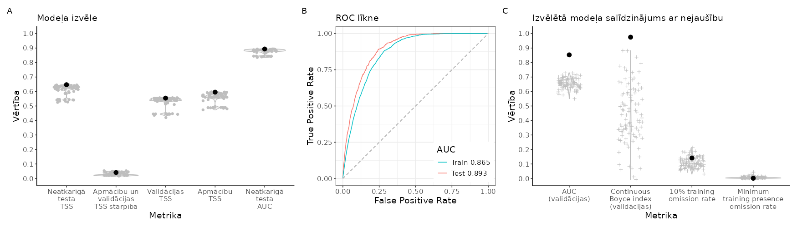
```

<br>

```{r SlieksniLOPCRI,echo=FALSE}
suppressPackageStartupMessages(library(kableExtra))
suppressPackageStartupMessages(library(tidyverse))
opts <- options(knitr.kable.NA = "")
slieksni=readxl::read_excel("./Papilddati/BestThresholds/BestThs_LOPCRI.xlsx")
tabula=kableExtra::kbl(slieksni, caption = 'Biežāk lietotie projicētās dzīvotņu piemērotības sliekšņa līmeņi un to izvērtējums', 
                    booktabs = TRUE, 
                    longtable = TRUE) 
tabula %>%
  kable_styling(latex_options = "scale_down") %>%
  scroll_box(width = "100%", box_css = "border: 0px;")
```


<br>


```{r HSprojLOPCRI, echo=FALSE, out.width = '100%', fig.cap='Labākā modeļa projekcija suga sdzīvotņu piemērotībai. Krāsu skala reprezentē cloglog vērtību no 0 līdz 1, kur starp galapunktiem esošā atzīme ir vienādas sensitivātes un specifiskuma treniņdatos slieksnis iepriekšējā tabulā (izvēlēts vizualizēšanas mērķiem un skaidrošanas ērtumam).'}
  
```

<br>


[**Vēl nē:** Dzīvotņu piemērotība (GeoTIFF)]()

[**Vēl nē:** Par labāko atzītais modelis (krosvalidācijas; *.RDS)]()

[**Vēl nē:** Par labāko atzītais modelis (kombinēts; *.RDS)]()

[**Vēl nē:** Par labāko atzītais modelis (tikai ietekmīgās pazīmes; *.RDS)]()

[**Vēl nē:** Ekoģeogrāfisko mainīgo izvēles gaita, to VIF (savstarpējās prognozētspējas raksturojums) un ietekmes modelī (permutāciju procedūrā) raksturojums (*.xlsx)]()

**Attēls EGV marginālajām atbildēm**

<br>


### POEPAL - purva zīlīte *Poecile palustris* {#Chapter10.1.077}


```{r NovAtlasePOEPAL, echo=FALSE, out.width = '100%', fig.cap='Novērojumu atlases gaita un modelēšanā izmantojamie purva zīlītes *Poecile palustris* novērojumi un fona punkti: A - novērojumu saglabāšanās atlases gaitā; B - visu pieejamo novērojumu (solis 1) izvietojums; C - ar vismaz iespējamu ligzdošanu skaitītie novēorjumi, kas izturējuši līdz septītā soļa beigām (punkti ir unikālie 1 km kvadrāti, krusti ir unikālie 100 m kvadrāti); D - ar vismaz ticamu ligzdošanu skaitītie novēorjumi, kas izturējuši līdz septītā soļa beigām (punkti ir unikālie 1 km kvadrāti, krusti ir unikālie 100 m kvadrāti); E - ar pierādītu ligzdošanu skaitītie novēorjumi, kas izturējuši līdz septītā soļa beigām (punkti ir unikālie 1 km kvadrāti, krusti ir unikālie 100 m kvadrāti); F - modelēšanā izmantojamā apmācību kopa (punkti ir sugas klātbūtnes, krusti ir fona raksturošanai); G - modelēšanā izmantojamā neatkarīgās testēšanas kopa (punkti ir sugas klātbūtnes, krusti ir fona raksturošanai)'}
knitr::include_graphics("./Atteli/IzvelesAtteli/ObsSelection_POEPAL.png")
```


<br>


```{r ModelaRaksturojumsPOEPAL, echo=FALSE, out.width = '100%', fig.cap='Labākā modeļa izvēle un uzvērtējums: A - labākā modeļa (ar treknu melnu punktu) salīdzinājums ar citiem pielāgotajiem modeļiem (pelēkie punkti un to sastopamības blīvuma funkcijas); B - labākā modeļa izvērtējums, to salīdzinot ar nejauši ģenerētiem nulles modeļiem (n=100) tajā pašā EGV, klātbūtnez un fona punktu veidotajā informācijas telpā.'}

```

<br>

```{r SlieksniPOEPAL,echo=FALSE}
suppressPackageStartupMessages(library(kableExtra))
suppressPackageStartupMessages(library(tidyverse))
opts <- options(knitr.kable.NA = "")
slieksni=readxl::read_excel("./Papilddati/BestThresholds/BestThs_POEPAL.xlsx")
tabula=kableExtra::kbl(slieksni, caption = 'Biežāk lietotie projicētās dzīvotņu piemērotības sliekšņa līmeņi un to izvērtējums', 
                    booktabs = TRUE, 
                    longtable = TRUE) 
tabula %>%
  kable_styling(latex_options = "scale_down") %>%
  scroll_box(width = "100%", box_css = "border: 0px;")
```


<br>


```{r HSprojPOEPAL, echo=FALSE, out.width = '100%', fig.cap='Labākā modeļa projekcija suga sdzīvotņu piemērotībai. Krāsu skala reprezentē cloglog vērtību no 0 līdz 1, kur starp galapunktiem esošā atzīme ir vienādas sensitivātes un specifiskuma treniņdatos slieksnis iepriekšējā tabulā (izvēlēts vizualizēšanas mērķiem un skaidrošanas ērtumam).'}
  knitr::include_graphics("./Atteli/Beigam_KarteNebal/BeiguKarteiNebal_POEPAL.png")
```

<br>


[**Vēl nē:** Dzīvotņu piemērotība (GeoTIFF)]()

[**Vēl nē:** Par labāko atzītais modelis (krosvalidācijas; *.RDS)]()

[**Vēl nē:** Par labāko atzītais modelis (kombinēts; *.RDS)]()

[**Vēl nē:** Par labāko atzītais modelis (tikai ietekmīgās pazīmes; *.RDS)]()

[**Vēl nē:** Ekoģeogrāfisko mainīgo izvēles gaita, to VIF (savstarpējās prognozētspējas raksturojums) un ietekmes modelī (permutāciju procedūrā) raksturojums (*.xlsx)]()

**Attēls EGV marginālajām atbildēm**

<br>


### POEMON - pelēkā zīlīte *Poecile montanus* {#Chapter10.1.078}


```{r NovAtlasePOEMON, echo=FALSE, out.width = '100%', fig.cap='Novērojumu atlases gaita un modelēšanā izmantojamie pelēkās zīlītes *Poecile montanus* novērojumi un fona punkti: A - novērojumu saglabāšanās atlases gaitā; B - visu pieejamo novērojumu (solis 1) izvietojums; C - ar vismaz iespējamu ligzdošanu skaitītie novēorjumi, kas izturējuši līdz septītā soļa beigām (punkti ir unikālie 1 km kvadrāti, krusti ir unikālie 100 m kvadrāti); D - ar vismaz ticamu ligzdošanu skaitītie novēorjumi, kas izturējuši līdz septītā soļa beigām (punkti ir unikālie 1 km kvadrāti, krusti ir unikālie 100 m kvadrāti); E - ar pierādītu ligzdošanu skaitītie novēorjumi, kas izturējuši līdz septītā soļa beigām (punkti ir unikālie 1 km kvadrāti, krusti ir unikālie 100 m kvadrāti); F - modelēšanā izmantojamā apmācību kopa (punkti ir sugas klātbūtnes, krusti ir fona raksturošanai); G - modelēšanā izmantojamā neatkarīgās testēšanas kopa (punkti ir sugas klātbūtnes, krusti ir fona raksturošanai)'}
knitr::include_graphics("./Atteli/IzvelesAtteli/ObsSelection_POEMON.png")
```


<br>


```{r ModelaRaksturojumsPOEMON, echo=FALSE, out.width = '100%', fig.cap='Labākā modeļa izvēle un uzvērtējums: A - labākā modeļa (ar treknu melnu punktu) salīdzinājums ar citiem pielāgotajiem modeļiem (pelēkie punkti un to sastopamības blīvuma funkcijas); B - labākā modeļa izvērtējums, to salīdzinot ar nejauši ģenerētiem nulles modeļiem (n=100) tajā pašā EGV, klātbūtnez un fona punktu veidotajā informācijas telpā.'}

```

<br>

```{r SlieksniPOEMON,echo=FALSE}
suppressPackageStartupMessages(library(kableExtra))
suppressPackageStartupMessages(library(tidyverse))
opts <- options(knitr.kable.NA = "")
slieksni=readxl::read_excel("./Papilddati/BestThresholds/BestThs_POEMON.xlsx")
tabula=kableExtra::kbl(slieksni, caption = 'Biežāk lietotie projicētās dzīvotņu piemērotības sliekšņa līmeņi un to izvērtējums', 
                    booktabs = TRUE, 
                    longtable = TRUE) 
tabula %>%
  kable_styling(latex_options = "scale_down") %>%
  scroll_box(width = "100%", box_css = "border: 0px;")
```


<br>


```{r HSprojPOEMON, echo=FALSE, out.width = '100%', fig.cap='Labākā modeļa projekcija suga sdzīvotņu piemērotībai. Krāsu skala reprezentē cloglog vērtību no 0 līdz 1, kur starp galapunktiem esošā atzīme ir vienādas sensitivātes un specifiskuma treniņdatos slieksnis iepriekšējā tabulā (izvēlēts vizualizēšanas mērķiem un skaidrošanas ērtumam).'}
  knitr::include_graphics("./Atteli/Beigam_KarteNebal/BeiguKarteiNebal_POEMON.png")
```

<br>


[**Vēl nē:** Dzīvotņu piemērotība (GeoTIFF)]()

[**Vēl nē:** Par labāko atzītais modelis (krosvalidācijas; *.RDS)]()

[**Vēl nē:** Par labāko atzītais modelis (kombinēts; *.RDS)]()

[**Vēl nē:** Par labāko atzītais modelis (tikai ietekmīgās pazīmes; *.RDS)]()

[**Vēl nē:** Ekoģeogrāfisko mainīgo izvēles gaita, to VIF (savstarpējās prognozētspējas raksturojums) un ietekmes modelī (permutāciju procedūrā) raksturojums (*.xlsx)]()

**Attēls EGV marginālajām atbildēm**

<br>


### LULARB - sila cīrulis *Lullula arborea* {#Chapter10.1.079}


```{r NovAtlaseLULARB, echo=FALSE, out.width = '100%', fig.cap='Novērojumu atlases gaita un modelēšanā izmantojamie sila cīruļa *Lullula arborea* novērojumi un fona punkti: A - novērojumu saglabāšanās atlases gaitā; B - visu pieejamo novērojumu (solis 1) izvietojums; C - ar vismaz iespējamu ligzdošanu skaitītie novēorjumi, kas izturējuši līdz septītā soļa beigām (punkti ir unikālie 1 km kvadrāti, krusti ir unikālie 100 m kvadrāti); D - ar vismaz ticamu ligzdošanu skaitītie novēorjumi, kas izturējuši līdz septītā soļa beigām (punkti ir unikālie 1 km kvadrāti, krusti ir unikālie 100 m kvadrāti); E - ar pierādītu ligzdošanu skaitītie novēorjumi, kas izturējuši līdz septītā soļa beigām (punkti ir unikālie 1 km kvadrāti, krusti ir unikālie 100 m kvadrāti); F - modelēšanā izmantojamā apmācību kopa (punkti ir sugas klātbūtnes, krusti ir fona raksturošanai); G - modelēšanā izmantojamā neatkarīgās testēšanas kopa (punkti ir sugas klātbūtnes, krusti ir fona raksturošanai)'}
knitr::include_graphics("./Atteli/IzvelesAtteli/ObsSelection_LULARB.png")
```


<br>


```{r ModelaRaksturojumsLULARB, echo=FALSE, out.width = '100%', fig.cap='Labākā modeļa izvēle un uzvērtējums: A - labākā modeļa (ar treknu melnu punktu) salīdzinājums ar citiem pielāgotajiem modeļiem (pelēkie punkti un to sastopamības blīvuma funkcijas); B - labākā modeļa izvērtējums, to salīdzinot ar nejauši ģenerētiem nulles modeļiem (n=100) tajā pašā EGV, klātbūtnez un fona punktu veidotajā informācijas telpā.'}
knitr::include_graphics("./Atteli/Beigam_IzvelesAttels/IzvelesAttels_LULARB.png")
```

<br>

```{r SlieksniLULARB,echo=FALSE}
suppressPackageStartupMessages(library(kableExtra))
suppressPackageStartupMessages(library(tidyverse))
opts <- options(knitr.kable.NA = "")
slieksni=readxl::read_excel("./Papilddati/BestThresholds/BestThs_LULARB.xlsx")
tabula=kableExtra::kbl(slieksni, caption = 'Biežāk lietotie projicētās dzīvotņu piemērotības sliekšņa līmeņi un to izvērtējums', 
                    booktabs = TRUE, 
                    longtable = TRUE) 
tabula %>%
  kable_styling(latex_options = "scale_down") %>%
  scroll_box(width = "100%", box_css = "border: 0px;")
```


<br>


```{r HSprojLULARB, echo=FALSE, out.width = '100%', fig.cap='Labākā modeļa projekcija suga sdzīvotņu piemērotībai. Krāsu skala reprezentē cloglog vērtību no 0 līdz 1, kur starp galapunktiem esošā atzīme ir vienādas sensitivātes un specifiskuma treniņdatos slieksnis iepriekšējā tabulā (izvēlēts vizualizēšanas mērķiem un skaidrošanas ērtumam).'}
  knitr::include_graphics("./Atteli/Beigam_KarteNebal/BeiguKarteiNebal_LULARB.png")
```

<br>


[**Vēl nē:** Dzīvotņu piemērotība (GeoTIFF)]()

[**Vēl nē:** Par labāko atzītais modelis (krosvalidācijas; *.RDS)]()

[**Vēl nē:** Par labāko atzītais modelis (kombinēts; *.RDS)]()

[**Vēl nē:** Par labāko atzītais modelis (tikai ietekmīgās pazīmes; *.RDS)]()

[**Vēl nē:** Ekoģeogrāfisko mainīgo izvēles gaita, to VIF (savstarpējās prognozētspējas raksturojums) un ietekmes modelī (permutāciju procedūrā) raksturojums (*.xlsx)]()

**Attēls EGV marginālajām atbildēm**

<br>


### ALAARV - lauku cīrulis *Alauda arvensis* {#Chapter10.1.080}


```{r NovAtlaseALAARV, echo=FALSE, out.width = '100%', fig.cap='Novērojumu atlases gaita un modelēšanā izmantojamie lauku cīruļa *Alauda arvensis* novērojumi un fona punkti: A - novērojumu saglabāšanās atlases gaitā; B - visu pieejamo novērojumu (solis 1) izvietojums; C - ar vismaz iespējamu ligzdošanu skaitītie novēorjumi, kas izturējuši līdz septītā soļa beigām (punkti ir unikālie 1 km kvadrāti, krusti ir unikālie 100 m kvadrāti); D - ar vismaz ticamu ligzdošanu skaitītie novēorjumi, kas izturējuši līdz septītā soļa beigām (punkti ir unikālie 1 km kvadrāti, krusti ir unikālie 100 m kvadrāti); E - ar pierādītu ligzdošanu skaitītie novēorjumi, kas izturējuši līdz septītā soļa beigām (punkti ir unikālie 1 km kvadrāti, krusti ir unikālie 100 m kvadrāti); F - modelēšanā izmantojamā apmācību kopa (punkti ir sugas klātbūtnes, krusti ir fona raksturošanai); G - modelēšanā izmantojamā neatkarīgās testēšanas kopa (punkti ir sugas klātbūtnes, krusti ir fona raksturošanai)'}

```


<br>


```{r ModelaRaksturojumsALAARV, echo=FALSE, out.width = '100%', fig.cap='Labākā modeļa izvēle un uzvērtējums: A - labākā modeļa (ar treknu melnu punktu) salīdzinājums ar citiem pielāgotajiem modeļiem (pelēkie punkti un to sastopamības blīvuma funkcijas); B - labākā modeļa izvērtējums, to salīdzinot ar nejauši ģenerētiem nulles modeļiem (n=100) tajā pašā EGV, klātbūtnez un fona punktu veidotajā informācijas telpā.'}

```

<br>

```{r SlieksniALAARV,echo=FALSE}
suppressPackageStartupMessages(library(kableExtra))
suppressPackageStartupMessages(library(tidyverse))
opts <- options(knitr.kable.NA = "")
slieksni=readxl::read_excel("./Papilddati/BestThresholds/BestThs_ALAARV.xlsx")
tabula=kableExtra::kbl(slieksni, caption = 'Biežāk lietotie projicētās dzīvotņu piemērotības sliekšņa līmeņi un to izvērtējums', 
                    booktabs = TRUE, 
                    longtable = TRUE) 
tabula %>%
  kable_styling(latex_options = "scale_down") %>%
  scroll_box(width = "100%", box_css = "border: 0px;")
```


<br>


```{r HSprojALAARV, echo=FALSE, out.width = '100%', fig.cap='Labākā modeļa projekcija suga sdzīvotņu piemērotībai. Krāsu skala reprezentē cloglog vērtību no 0 līdz 1, kur starp galapunktiem esošā atzīme ir vienādas sensitivātes un specifiskuma treniņdatos slieksnis iepriekšējā tabulā (izvēlēts vizualizēšanas mērķiem un skaidrošanas ērtumam).'}
  knitr::include_graphics("./Atteli/Beigam_KarteNebal/BeiguKarteiNebal_ALAARV.png")
```

<br>


[**Vēl nē:** Dzīvotņu piemērotība (GeoTIFF)]()

[**Vēl nē:** Par labāko atzītais modelis (krosvalidācijas; *.RDS)]()

[**Vēl nē:** Par labāko atzītais modelis (kombinēts; *.RDS)]()

[**Vēl nē:** Par labāko atzītais modelis (tikai ietekmīgās pazīmes; *.RDS)]()

[**Vēl nē:** Ekoģeogrāfisko mainīgo izvēles gaita, to VIF (savstarpējās prognozētspējas raksturojums) un ietekmes modelī (permutāciju procedūrā) raksturojums (*.xlsx)]()

**Attēls EGV marginālajām atbildēm**

<br>


### IDUCAL - klusais ķauķis *Iduna caligata* {#Chapter10.1.081}


```{r NovAtlaseIDUCAL, echo=FALSE, out.width = '100%', fig.cap='Novērojumu atlases gaita un modelēšanā izmantojamie klusā ķauķa *Iduna caligata* novērojumi un fona punkti: A - novērojumu saglabāšanās atlases gaitā; B - visu pieejamo novērojumu (solis 1) izvietojums; C - ar vismaz iespējamu ligzdošanu skaitītie novēorjumi, kas izturējuši līdz septītā soļa beigām (punkti ir unikālie 1 km kvadrāti, krusti ir unikālie 100 m kvadrāti); D - ar vismaz ticamu ligzdošanu skaitītie novēorjumi, kas izturējuši līdz septītā soļa beigām (punkti ir unikālie 1 km kvadrāti, krusti ir unikālie 100 m kvadrāti); E - ar pierādītu ligzdošanu skaitītie novēorjumi, kas izturējuši līdz septītā soļa beigām (punkti ir unikālie 1 km kvadrāti, krusti ir unikālie 100 m kvadrāti); F - modelēšanā izmantojamā apmācību kopa (punkti ir sugas klātbūtnes, krusti ir fona raksturošanai); G - modelēšanā izmantojamā neatkarīgās testēšanas kopa (punkti ir sugas klātbūtnes, krusti ir fona raksturošanai)'}
knitr::include_graphics("./Atteli/IzvelesAtteli/ObsSelection_IDUCAL.png")
```


<br>


```{r ModelaRaksturojumsIDUCAL, echo=FALSE, out.width = '100%', fig.cap='Labākā modeļa izvēle un uzvērtējums: A - labākā modeļa (ar treknu melnu punktu) salīdzinājums ar citiem pielāgotajiem modeļiem (pelēkie punkti un to sastopamības blīvuma funkcijas); B - labākā modeļa izvērtējums, to salīdzinot ar nejauši ģenerētiem nulles modeļiem (n=100) tajā pašā EGV, klātbūtnez un fona punktu veidotajā informācijas telpā.'}

```

<br>

```{r SlieksniIDUCAL,echo=FALSE}
suppressPackageStartupMessages(library(kableExtra))
suppressPackageStartupMessages(library(tidyverse))
opts <- options(knitr.kable.NA = "")
slieksni=readxl::read_excel("./Papilddati/BestThresholds/BestThs_IDUCAL.xlsx")
tabula=kableExtra::kbl(slieksni, caption = 'Biežāk lietotie projicētās dzīvotņu piemērotības sliekšņa līmeņi un to izvērtējums', 
                    booktabs = TRUE, 
                    longtable = TRUE) 
tabula %>%
  kable_styling(latex_options = "scale_down") %>%
  scroll_box(width = "100%", box_css = "border: 0px;")
```


<br>


```{r HSprojIDUCAL, echo=FALSE, out.width = '100%', fig.cap='Labākā modeļa projekcija suga sdzīvotņu piemērotībai. Krāsu skala reprezentē cloglog vērtību no 0 līdz 1, kur starp galapunktiem esošā atzīme ir vienādas sensitivātes un specifiskuma treniņdatos slieksnis iepriekšējā tabulā (izvēlēts vizualizēšanas mērķiem un skaidrošanas ērtumam).'}
  knitr::include_graphics("./Atteli/Beigam_KarteNebal/BeiguKarteiNebal_IDUCAL.png")
```

<br>


[**Vēl nē:** Dzīvotņu piemērotība (GeoTIFF)]()

[**Vēl nē:** Par labāko atzītais modelis (krosvalidācijas; *.RDS)]()

[**Vēl nē:** Par labāko atzītais modelis (kombinēts; *.RDS)]()

[**Vēl nē:** Par labāko atzītais modelis (tikai ietekmīgās pazīmes; *.RDS)]()

[**Vēl nē:** Ekoģeogrāfisko mainīgo izvēles gaita, to VIF (savstarpējās prognozētspējas raksturojums) un ietekmes modelī (permutāciju procedūrā) raksturojums (*.xlsx)]()

**Attēls EGV marginālajām atbildēm**

<br>


### ACRRIS - purva ķauķis *Acrocephalus palustris* {#Chapter10.1.082}


```{r NovAtlaseACRRIS, echo=FALSE, out.width = '100%', fig.cap='Novērojumu atlases gaita un modelēšanā izmantojamie purva ķauķis *Acrocephalus palustris* novērojumi un fona punkti: A - novērojumu saglabāšanās atlases gaitā; B - visu pieejamo novērojumu (solis 1) izvietojums; C - ar vismaz iespējamu ligzdošanu skaitītie novēorjumi, kas izturējuši līdz septītā soļa beigām (punkti ir unikālie 1 km kvadrāti, krusti ir unikālie 100 m kvadrāti); D - ar vismaz ticamu ligzdošanu skaitītie novēorjumi, kas izturējuši līdz septītā soļa beigām (punkti ir unikālie 1 km kvadrāti, krusti ir unikālie 100 m kvadrāti); E - ar pierādītu ligzdošanu skaitītie novēorjumi, kas izturējuši līdz septītā soļa beigām (punkti ir unikālie 1 km kvadrāti, krusti ir unikālie 100 m kvadrāti); F - modelēšanā izmantojamā apmācību kopa (punkti ir sugas klātbūtnes, krusti ir fona raksturošanai); G - modelēšanā izmantojamā neatkarīgās testēšanas kopa (punkti ir sugas klātbūtnes, krusti ir fona raksturošanai)'}
knitr::include_graphics("./Atteli/IzvelesAtteli/ObsSelection_ACRRIS.png")
```


<br>


```{r ModelaRaksturojumsACRRIS, echo=FALSE, out.width = '100%', fig.cap='Labākā modeļa izvēle un uzvērtējums: A - labākā modeļa (ar treknu melnu punktu) salīdzinājums ar citiem pielāgotajiem modeļiem (pelēkie punkti un to sastopamības blīvuma funkcijas); B - labākā modeļa izvērtējums, to salīdzinot ar nejauši ģenerētiem nulles modeļiem (n=100) tajā pašā EGV, klātbūtnez un fona punktu veidotajā informācijas telpā.'}
knitr::include_graphics("./Atteli/Beigam_IzvelesAttels/IzvelesAttels_ACRRIS.png")
```

<br>

```{r SlieksniACRRIS,echo=FALSE}
suppressPackageStartupMessages(library(kableExtra))
suppressPackageStartupMessages(library(tidyverse))
opts <- options(knitr.kable.NA = "")
slieksni=readxl::read_excel("./Papilddati/BestThresholds/BestThs_ACRRIS.xlsx")
tabula=kableExtra::kbl(slieksni, caption = 'Biežāk lietotie projicētās dzīvotņu piemērotības sliekšņa līmeņi un to izvērtējums', 
                    booktabs = TRUE, 
                    longtable = TRUE) 
tabula %>%
  kable_styling(latex_options = "scale_down") %>%
  scroll_box(width = "100%", box_css = "border: 0px;")
```


<br>


```{r HSprojACRRIS, echo=FALSE, out.width = '100%', fig.cap='Labākā modeļa projekcija suga sdzīvotņu piemērotībai. Krāsu skala reprezentē cloglog vērtību no 0 līdz 1, kur starp galapunktiem esošā atzīme ir vienādas sensitivātes un specifiskuma treniņdatos slieksnis iepriekšējā tabulā (izvēlēts vizualizēšanas mērķiem un skaidrošanas ērtumam).'}
  knitr::include_graphics("./Atteli/Beigam_KarteNebal/BeiguKarteiNebal_ACRRIS.png")
```

<br>


[**Vēl nē:** Dzīvotņu piemērotība (GeoTIFF)]()

[**Vēl nē:** Par labāko atzītais modelis (krosvalidācijas; *.RDS)]()

[**Vēl nē:** Par labāko atzītais modelis (kombinēts; *.RDS)]()

[**Vēl nē:** Par labāko atzītais modelis (tikai ietekmīgās pazīmes; *.RDS)]()

[**Vēl nē:** Ekoģeogrāfisko mainīgo izvēles gaita, to VIF (savstarpējās prognozētspējas raksturojums) un ietekmes modelī (permutāciju procedūrā) raksturojums (*.xlsx)]()

**Attēls EGV marginālajām atbildēm**

<br>


### ACRARU - niedru strazds *Acrocephalus arundinaceus* {#Chapter10.1.083}


```{r NovAtlaseACRARU, echo=FALSE, out.width = '100%', fig.cap='Novērojumu atlases gaita un modelēšanā izmantojamie niedru strazda *Acrocephalus arundinaceus* novērojumi un fona punkti: A - novērojumu saglabāšanās atlases gaitā; B - visu pieejamo novērojumu (solis 1) izvietojums; C - ar vismaz iespējamu ligzdošanu skaitītie novēorjumi, kas izturējuši līdz septītā soļa beigām (punkti ir unikālie 1 km kvadrāti, krusti ir unikālie 100 m kvadrāti); D - ar vismaz ticamu ligzdošanu skaitītie novēorjumi, kas izturējuši līdz septītā soļa beigām (punkti ir unikālie 1 km kvadrāti, krusti ir unikālie 100 m kvadrāti); E - ar pierādītu ligzdošanu skaitītie novēorjumi, kas izturējuši līdz septītā soļa beigām (punkti ir unikālie 1 km kvadrāti, krusti ir unikālie 100 m kvadrāti); F - modelēšanā izmantojamā apmācību kopa (punkti ir sugas klātbūtnes, krusti ir fona raksturošanai); G - modelēšanā izmantojamā neatkarīgās testēšanas kopa (punkti ir sugas klātbūtnes, krusti ir fona raksturošanai)'}

```


<br>


```{r ModelaRaksturojumsACRARU, echo=FALSE, out.width = '100%', fig.cap='Labākā modeļa izvēle un uzvērtējums: A - labākā modeļa (ar treknu melnu punktu) salīdzinājums ar citiem pielāgotajiem modeļiem (pelēkie punkti un to sastopamības blīvuma funkcijas); B - labākā modeļa izvērtējums, to salīdzinot ar nejauši ģenerētiem nulles modeļiem (n=100) tajā pašā EGV, klātbūtnez un fona punktu veidotajā informācijas telpā.'}
knitr::include_graphics("./Atteli/Beigam_IzvelesAttels/IzvelesAttels_ACRARU.png")
```

<br>

```{r SlieksniACRARU,echo=FALSE}
suppressPackageStartupMessages(library(kableExtra))
suppressPackageStartupMessages(library(tidyverse))
opts <- options(knitr.kable.NA = "")
slieksni=readxl::read_excel("./Papilddati/BestThresholds/BestThs_ACRARU.xlsx")
tabula=kableExtra::kbl(slieksni, caption = 'Biežāk lietotie projicētās dzīvotņu piemērotības sliekšņa līmeņi un to izvērtējums', 
                    booktabs = TRUE, 
                    longtable = TRUE) 
tabula %>%
  kable_styling(latex_options = "scale_down") %>%
  scroll_box(width = "100%", box_css = "border: 0px;")
```


<br>


```{r HSprojACRARU, echo=FALSE, out.width = '100%', fig.cap='Labākā modeļa projekcija suga sdzīvotņu piemērotībai. Krāsu skala reprezentē cloglog vērtību no 0 līdz 1, kur starp galapunktiem esošā atzīme ir vienādas sensitivātes un specifiskuma treniņdatos slieksnis iepriekšējā tabulā (izvēlēts vizualizēšanas mērķiem un skaidrošanas ērtumam).'}
  
```

<br>


[**Vēl nē:** Dzīvotņu piemērotība (GeoTIFF)]()

[**Vēl nē:** Par labāko atzītais modelis (krosvalidācijas; *.RDS)]()

[**Vēl nē:** Par labāko atzītais modelis (kombinēts; *.RDS)]()

[**Vēl nē:** Par labāko atzītais modelis (tikai ietekmīgās pazīmes; *.RDS)]()

[**Vēl nē:** Ekoģeogrāfisko mainīgo izvēles gaita, to VIF (savstarpējās prognozētspējas raksturojums) un ietekmes modelī (permutāciju procedūrā) raksturojums (*.xlsx)]()

**Attēls EGV marginālajām atbildēm**

<br>


### LOCFLU - upes ķauķis *Locustella fluviatilis* {#Chapter10.1.084}


```{r NovAtlaseLOCFLU, echo=FALSE, out.width = '100%', fig.cap='Novērojumu atlases gaita un modelēšanā izmantojamie upes ķauķa *Locustella fluviatilis* novērojumi un fona punkti: A - novērojumu saglabāšanās atlases gaitā; B - visu pieejamo novērojumu (solis 1) izvietojums; C - ar vismaz iespējamu ligzdošanu skaitītie novēorjumi, kas izturējuši līdz septītā soļa beigām (punkti ir unikālie 1 km kvadrāti, krusti ir unikālie 100 m kvadrāti); D - ar vismaz ticamu ligzdošanu skaitītie novēorjumi, kas izturējuši līdz septītā soļa beigām (punkti ir unikālie 1 km kvadrāti, krusti ir unikālie 100 m kvadrāti); E - ar pierādītu ligzdošanu skaitītie novēorjumi, kas izturējuši līdz septītā soļa beigām (punkti ir unikālie 1 km kvadrāti, krusti ir unikālie 100 m kvadrāti); F - modelēšanā izmantojamā apmācību kopa (punkti ir sugas klātbūtnes, krusti ir fona raksturošanai); G - modelēšanā izmantojamā neatkarīgās testēšanas kopa (punkti ir sugas klātbūtnes, krusti ir fona raksturošanai)'}
knitr::include_graphics("./Atteli/IzvelesAtteli/ObsSelection_LOCFLU.png")
```


<br>


```{r ModelaRaksturojumsLOCFLU, echo=FALSE, out.width = '100%', fig.cap='Labākā modeļa izvēle un uzvērtējums: A - labākā modeļa (ar treknu melnu punktu) salīdzinājums ar citiem pielāgotajiem modeļiem (pelēkie punkti un to sastopamības blīvuma funkcijas); B - labākā modeļa izvērtējums, to salīdzinot ar nejauši ģenerētiem nulles modeļiem (n=100) tajā pašā EGV, klātbūtnez un fona punktu veidotajā informācijas telpā.'}
knitr::include_graphics("./Atteli/Beigam_IzvelesAttels/IzvelesAttels_LOCFLU.png")
```

<br>

```{r SlieksniLOCFLU,echo=FALSE}
suppressPackageStartupMessages(library(kableExtra))
suppressPackageStartupMessages(library(tidyverse))
opts <- options(knitr.kable.NA = "")
slieksni=readxl::read_excel("./Papilddati/BestThresholds/BestThs_LOCFLU.xlsx")
tabula=kableExtra::kbl(slieksni, caption = 'Biežāk lietotie projicētās dzīvotņu piemērotības sliekšņa līmeņi un to izvērtējums', 
                    booktabs = TRUE, 
                    longtable = TRUE) 
tabula %>%
  kable_styling(latex_options = "scale_down") %>%
  scroll_box(width = "100%", box_css = "border: 0px;")
```


<br>


```{r HSprojLOCFLU, echo=FALSE, out.width = '100%', fig.cap='Labākā modeļa projekcija suga sdzīvotņu piemērotībai. Krāsu skala reprezentē cloglog vērtību no 0 līdz 1, kur starp galapunktiem esošā atzīme ir vienādas sensitivātes un specifiskuma treniņdatos slieksnis iepriekšējā tabulā (izvēlēts vizualizēšanas mērķiem un skaidrošanas ērtumam).'}
  knitr::include_graphics("./Atteli/Beigam_KarteNebal/BeiguKarteiNebal_LOCFLU.png")
```

<br>


[**Vēl nē:** Dzīvotņu piemērotība (GeoTIFF)]()

[**Vēl nē:** Par labāko atzītais modelis (krosvalidācijas; *.RDS)]()

[**Vēl nē:** Par labāko atzītais modelis (kombinēts; *.RDS)]()

[**Vēl nē:** Par labāko atzītais modelis (tikai ietekmīgās pazīmes; *.RDS)]()

[**Vēl nē:** Ekoģeogrāfisko mainīgo izvēles gaita, to VIF (savstarpējās prognozētspējas raksturojums) un ietekmes modelī (permutāciju procedūrā) raksturojums (*.xlsx)]()

**Attēls EGV marginālajām atbildēm**

<br>


### LOCNAE - kārklu ķauķis *Locustella naevia* {#Chapter10.1.085}


```{r NovAtlaseLOCNAE, echo=FALSE, out.width = '100%', fig.cap='Novērojumu atlases gaita un modelēšanā izmantojamie kārklu ķauķa *Locustella naevia* novērojumi un fona punkti: A - novērojumu saglabāšanās atlases gaitā; B - visu pieejamo novērojumu (solis 1) izvietojums; C - ar vismaz iespējamu ligzdošanu skaitītie novēorjumi, kas izturējuši līdz septītā soļa beigām (punkti ir unikālie 1 km kvadrāti, krusti ir unikālie 100 m kvadrāti); D - ar vismaz ticamu ligzdošanu skaitītie novēorjumi, kas izturējuši līdz septītā soļa beigām (punkti ir unikālie 1 km kvadrāti, krusti ir unikālie 100 m kvadrāti); E - ar pierādītu ligzdošanu skaitītie novēorjumi, kas izturējuši līdz septītā soļa beigām (punkti ir unikālie 1 km kvadrāti, krusti ir unikālie 100 m kvadrāti); F - modelēšanā izmantojamā apmācību kopa (punkti ir sugas klātbūtnes, krusti ir fona raksturošanai); G - modelēšanā izmantojamā neatkarīgās testēšanas kopa (punkti ir sugas klātbūtnes, krusti ir fona raksturošanai)'}
knitr::include_graphics("./Atteli/IzvelesAtteli/ObsSelection_LOCNAE.png")
```


<br>


```{r ModelaRaksturojumsLOCNAE, echo=FALSE, out.width = '100%', fig.cap='Labākā modeļa izvēle un uzvērtējums: A - labākā modeļa (ar treknu melnu punktu) salīdzinājums ar citiem pielāgotajiem modeļiem (pelēkie punkti un to sastopamības blīvuma funkcijas); B - labākā modeļa izvērtējums, to salīdzinot ar nejauši ģenerētiem nulles modeļiem (n=100) tajā pašā EGV, klātbūtnez un fona punktu veidotajā informācijas telpā.'}
knitr::include_graphics("./Atteli/Beigam_IzvelesAttels/IzvelesAttels_LOCNAE.png")
```

<br>

```{r SlieksniLOCNAE,echo=FALSE}
suppressPackageStartupMessages(library(kableExtra))
suppressPackageStartupMessages(library(tidyverse))
opts <- options(knitr.kable.NA = "")
slieksni=readxl::read_excel("./Papilddati/BestThresholds/BestThs_LOCNAE.xlsx")
tabula=kableExtra::kbl(slieksni, caption = 'Biežāk lietotie projicētās dzīvotņu piemērotības sliekšņa līmeņi un to izvērtējums', 
                    booktabs = TRUE, 
                    longtable = TRUE) 
tabula %>%
  kable_styling(latex_options = "scale_down") %>%
  scroll_box(width = "100%", box_css = "border: 0px;")
```


<br>


```{r HSprojLOCNAE, echo=FALSE, out.width = '100%', fig.cap='Labākā modeļa projekcija suga sdzīvotņu piemērotībai. Krāsu skala reprezentē cloglog vērtību no 0 līdz 1, kur starp galapunktiem esošā atzīme ir vienādas sensitivātes un specifiskuma treniņdatos slieksnis iepriekšējā tabulā (izvēlēts vizualizēšanas mērķiem un skaidrošanas ērtumam).'}
  knitr::include_graphics("./Atteli/Beigam_KarteNebal/BeiguKarteiNebal_LOCNAE.png")
```

<br>


[**Vēl nē:** Dzīvotņu piemērotība (GeoTIFF)]()

[**Vēl nē:** Par labāko atzītais modelis (krosvalidācijas; *.RDS)]()

[**Vēl nē:** Par labāko atzītais modelis (kombinēts; *.RDS)]()

[**Vēl nē:** Par labāko atzītais modelis (tikai ietekmīgās pazīmes; *.RDS)]()

[**Vēl nē:** Ekoģeogrāfisko mainīgo izvēles gaita, to VIF (savstarpējās prognozētspējas raksturojums) un ietekmes modelī (permutāciju procedūrā) raksturojums (*.xlsx)]()

**Attēls EGV marginālajām atbildēm**

<br>


### HIRRUS - bezdelīga *Hirundo rustica* {#Chapter10.1.086}


```{r NovAtlaseHIRRUS, echo=FALSE, out.width = '100%', fig.cap='Novērojumu atlases gaita un modelēšanā izmantojamie bezdelīgas *Hirundo rustica* novērojumi un fona punkti: A - novērojumu saglabāšanās atlases gaitā; B - visu pieejamo novērojumu (solis 1) izvietojums; C - ar vismaz iespējamu ligzdošanu skaitītie novēorjumi, kas izturējuši līdz septītā soļa beigām (punkti ir unikālie 1 km kvadrāti, krusti ir unikālie 100 m kvadrāti); D - ar vismaz ticamu ligzdošanu skaitītie novēorjumi, kas izturējuši līdz septītā soļa beigām (punkti ir unikālie 1 km kvadrāti, krusti ir unikālie 100 m kvadrāti); E - ar pierādītu ligzdošanu skaitītie novēorjumi, kas izturējuši līdz septītā soļa beigām (punkti ir unikālie 1 km kvadrāti, krusti ir unikālie 100 m kvadrāti); F - modelēšanā izmantojamā apmācību kopa (punkti ir sugas klātbūtnes, krusti ir fona raksturošanai); G - modelēšanā izmantojamā neatkarīgās testēšanas kopa (punkti ir sugas klātbūtnes, krusti ir fona raksturošanai)'}
knitr::include_graphics("./Atteli/IzvelesAtteli/ObsSelection_HIRRUS.png")
```


<br>


```{r ModelaRaksturojumsHIRRUS, echo=FALSE, out.width = '100%', fig.cap='Labākā modeļa izvēle un uzvērtējums: A - labākā modeļa (ar treknu melnu punktu) salīdzinājums ar citiem pielāgotajiem modeļiem (pelēkie punkti un to sastopamības blīvuma funkcijas); B - labākā modeļa izvērtējums, to salīdzinot ar nejauši ģenerētiem nulles modeļiem (n=100) tajā pašā EGV, klātbūtnez un fona punktu veidotajā informācijas telpā.'}

```

<br>

```{r SlieksniHIRRUS,echo=FALSE}
suppressPackageStartupMessages(library(kableExtra))
suppressPackageStartupMessages(library(tidyverse))
opts <- options(knitr.kable.NA = "")
slieksni=readxl::read_excel("./Papilddati/BestThresholds/BestThs_HIRRUS.xlsx")
tabula=kableExtra::kbl(slieksni, caption = 'Biežāk lietotie projicētās dzīvotņu piemērotības sliekšņa līmeņi un to izvērtējums', 
                    booktabs = TRUE, 
                    longtable = TRUE) 
tabula %>%
  kable_styling(latex_options = "scale_down") %>%
  scroll_box(width = "100%", box_css = "border: 0px;")
```


<br>


```{r HSprojHIRRUS, echo=FALSE, out.width = '100%', fig.cap='Labākā modeļa projekcija suga sdzīvotņu piemērotībai. Krāsu skala reprezentē cloglog vērtību no 0 līdz 1, kur starp galapunktiem esošā atzīme ir vienādas sensitivātes un specifiskuma treniņdatos slieksnis iepriekšējā tabulā (izvēlēts vizualizēšanas mērķiem un skaidrošanas ērtumam).'}
  knitr::include_graphics("./Atteli/Beigam_KarteNebal/BeiguKarteiNebal_HIRRUS.png")
```

<br>


[**Vēl nē:** Dzīvotņu piemērotība (GeoTIFF)]()

[**Vēl nē:** Par labāko atzītais modelis (krosvalidācijas; *.RDS)]()

[**Vēl nē:** Par labāko atzītais modelis (kombinēts; *.RDS)]()

[**Vēl nē:** Par labāko atzītais modelis (tikai ietekmīgās pazīmes; *.RDS)]()

[**Vēl nē:** Ekoģeogrāfisko mainīgo izvēles gaita, to VIF (savstarpējās prognozētspējas raksturojums) un ietekmes modelī (permutāciju procedūrā) raksturojums (*.xlsx)]()

**Attēls EGV marginālajām atbildēm**

<br>


### PHYSIB - svirlītis *Phylloscopus sibilatrix* {#Chapter10.1.087}


```{r NovAtlasePHYSIB, echo=FALSE, out.width = '100%', fig.cap='Novērojumu atlases gaita un modelēšanā izmantojamie svirlīša *Phylloscopus sibilatrix* novērojumi un fona punkti: A - novērojumu saglabāšanās atlases gaitā; B - visu pieejamo novērojumu (solis 1) izvietojums; C - ar vismaz iespējamu ligzdošanu skaitītie novēorjumi, kas izturējuši līdz septītā soļa beigām (punkti ir unikālie 1 km kvadrāti, krusti ir unikālie 100 m kvadrāti); D - ar vismaz ticamu ligzdošanu skaitītie novēorjumi, kas izturējuši līdz septītā soļa beigām (punkti ir unikālie 1 km kvadrāti, krusti ir unikālie 100 m kvadrāti); E - ar pierādītu ligzdošanu skaitītie novēorjumi, kas izturējuši līdz septītā soļa beigām (punkti ir unikālie 1 km kvadrāti, krusti ir unikālie 100 m kvadrāti); F - modelēšanā izmantojamā apmācību kopa (punkti ir sugas klātbūtnes, krusti ir fona raksturošanai); G - modelēšanā izmantojamā neatkarīgās testēšanas kopa (punkti ir sugas klātbūtnes, krusti ir fona raksturošanai)'}

```


<br>


```{r ModelaRaksturojumsPHYSIB, echo=FALSE, out.width = '100%', fig.cap='Labākā modeļa izvēle un uzvērtējums: A - labākā modeļa (ar treknu melnu punktu) salīdzinājums ar citiem pielāgotajiem modeļiem (pelēkie punkti un to sastopamības blīvuma funkcijas); B - labākā modeļa izvērtējums, to salīdzinot ar nejauši ģenerētiem nulles modeļiem (n=100) tajā pašā EGV, klātbūtnez un fona punktu veidotajā informācijas telpā.'}
knitr::include_graphics("./Atteli/Beigam_IzvelesAttels/IzvelesAttels_PHYSIB.png")
```

<br>

```{r SlieksniPHYSIB,echo=FALSE}
suppressPackageStartupMessages(library(kableExtra))
suppressPackageStartupMessages(library(tidyverse))
opts <- options(knitr.kable.NA = "")
slieksni=readxl::read_excel("./Papilddati/BestThresholds/BestThs_PHYSIB.xlsx")
tabula=kableExtra::kbl(slieksni, caption = 'Biežāk lietotie projicētās dzīvotņu piemērotības sliekšņa līmeņi un to izvērtējums', 
                    booktabs = TRUE, 
                    longtable = TRUE) 
tabula %>%
  kable_styling(latex_options = "scale_down") %>%
  scroll_box(width = "100%", box_css = "border: 0px;")
```


<br>


```{r HSprojPHYSIB, echo=FALSE, out.width = '100%', fig.cap='Labākā modeļa projekcija suga sdzīvotņu piemērotībai. Krāsu skala reprezentē cloglog vērtību no 0 līdz 1, kur starp galapunktiem esošā atzīme ir vienādas sensitivātes un specifiskuma treniņdatos slieksnis iepriekšējā tabulā (izvēlēts vizualizēšanas mērķiem un skaidrošanas ērtumam).'}
  knitr::include_graphics("./Atteli/Beigam_KarteNebal/BeiguKarteiNebal_PHYSIB.png")
```

<br>


[**Vēl nē:** Dzīvotņu piemērotība (GeoTIFF)]()

[**Vēl nē:** Par labāko atzītais modelis (krosvalidācijas; *.RDS)]()

[**Vēl nē:** Par labāko atzītais modelis (kombinēts; *.RDS)]()

[**Vēl nē:** Par labāko atzītais modelis (tikai ietekmīgās pazīmes; *.RDS)]()

[**Vēl nē:** Ekoģeogrāfisko mainīgo izvēles gaita, to VIF (savstarpējās prognozētspējas raksturojums) un ietekmes modelī (permutāciju procedūrā) raksturojums (*.xlsx)]()

**Attēls EGV marginālajām atbildēm**

<br>


### AEGCAU - garastīte *Aegithalos caudatus* {#Chapter10.1.088}


```{r NovAtlaseAEGCAU, echo=FALSE, out.width = '100%', fig.cap='Novērojumu atlases gaita un modelēšanā izmantojamie garastītes *Aegithalos caudatus* novērojumi un fona punkti: A - novērojumu saglabāšanās atlases gaitā; B - visu pieejamo novērojumu (solis 1) izvietojums; C - ar vismaz iespējamu ligzdošanu skaitītie novēorjumi, kas izturējuši līdz septītā soļa beigām (punkti ir unikālie 1 km kvadrāti, krusti ir unikālie 100 m kvadrāti); D - ar vismaz ticamu ligzdošanu skaitītie novēorjumi, kas izturējuši līdz septītā soļa beigām (punkti ir unikālie 1 km kvadrāti, krusti ir unikālie 100 m kvadrāti); E - ar pierādītu ligzdošanu skaitītie novēorjumi, kas izturējuši līdz septītā soļa beigām (punkti ir unikālie 1 km kvadrāti, krusti ir unikālie 100 m kvadrāti); F - modelēšanā izmantojamā apmācību kopa (punkti ir sugas klātbūtnes, krusti ir fona raksturošanai); G - modelēšanā izmantojamā neatkarīgās testēšanas kopa (punkti ir sugas klātbūtnes, krusti ir fona raksturošanai)'}

```


<br>


```{r ModelaRaksturojumsAEGCAU, echo=FALSE, out.width = '100%', fig.cap='Labākā modeļa izvēle un uzvērtējums: A - labākā modeļa (ar treknu melnu punktu) salīdzinājums ar citiem pielāgotajiem modeļiem (pelēkie punkti un to sastopamības blīvuma funkcijas); B - labākā modeļa izvērtējums, to salīdzinot ar nejauši ģenerētiem nulles modeļiem (n=100) tajā pašā EGV, klātbūtnez un fona punktu veidotajā informācijas telpā.'}

```

<br>

```{r SlieksniAEGCAU,echo=FALSE}
suppressPackageStartupMessages(library(kableExtra))
suppressPackageStartupMessages(library(tidyverse))
opts <- options(knitr.kable.NA = "")
slieksni=readxl::read_excel("./Papilddati/BestThresholds/BestThs_AEGCAU.xlsx")
tabula=kableExtra::kbl(slieksni, caption = 'Biežāk lietotie projicētās dzīvotņu piemērotības sliekšņa līmeņi un to izvērtējums', 
                    booktabs = TRUE, 
                    longtable = TRUE) 
tabula %>%
  kable_styling(latex_options = "scale_down") %>%
  scroll_box(width = "100%", box_css = "border: 0px;")
```


<br>


```{r HSprojAEGCAU, echo=FALSE, out.width = '100%', fig.cap='Labākā modeļa projekcija suga sdzīvotņu piemērotībai. Krāsu skala reprezentē cloglog vērtību no 0 līdz 1, kur starp galapunktiem esošā atzīme ir vienādas sensitivātes un specifiskuma treniņdatos slieksnis iepriekšējā tabulā (izvēlēts vizualizēšanas mērķiem un skaidrošanas ērtumam).'}
  knitr::include_graphics("./Atteli/Beigam_KarteNebal/BeiguKarteiNebal_AEGCAU.png")
```

<br>


[**Vēl nē:** Dzīvotņu piemērotība (GeoTIFF)]()

[**Vēl nē:** Par labāko atzītais modelis (krosvalidācijas; *.RDS)]()

[**Vēl nē:** Par labāko atzītais modelis (kombinēts; *.RDS)]()

[**Vēl nē:** Par labāko atzītais modelis (tikai ietekmīgās pazīmes; *.RDS)]()

[**Vēl nē:** Ekoģeogrāfisko mainīgo izvēles gaita, to VIF (savstarpējās prognozētspējas raksturojums) un ietekmes modelī (permutāciju procedūrā) raksturojums (*.xlsx)]()

**Attēls EGV marginālajām atbildēm**

<br>


### CURNIS - svītrainais ķauķis *Curruca nisoria* {#Chapter10.1.089}


```{r NovAtlaseCURNIS, echo=FALSE, out.width = '100%', fig.cap='Novērojumu atlases gaita un modelēšanā izmantojamie svītrainā ķauķa *Curruca nisoria* novērojumi un fona punkti: A - novērojumu saglabāšanās atlases gaitā; B - visu pieejamo novērojumu (solis 1) izvietojums; C - ar vismaz iespējamu ligzdošanu skaitītie novēorjumi, kas izturējuši līdz septītā soļa beigām (punkti ir unikālie 1 km kvadrāti, krusti ir unikālie 100 m kvadrāti); D - ar vismaz ticamu ligzdošanu skaitītie novēorjumi, kas izturējuši līdz septītā soļa beigām (punkti ir unikālie 1 km kvadrāti, krusti ir unikālie 100 m kvadrāti); E - ar pierādītu ligzdošanu skaitītie novēorjumi, kas izturējuši līdz septītā soļa beigām (punkti ir unikālie 1 km kvadrāti, krusti ir unikālie 100 m kvadrāti); F - modelēšanā izmantojamā apmācību kopa (punkti ir sugas klātbūtnes, krusti ir fona raksturošanai); G - modelēšanā izmantojamā neatkarīgās testēšanas kopa (punkti ir sugas klātbūtnes, krusti ir fona raksturošanai)'}

```


<br>


```{r ModelaRaksturojumsCURNIS, echo=FALSE, out.width = '100%', fig.cap='Labākā modeļa izvēle un uzvērtējums: A - labākā modeļa (ar treknu melnu punktu) salīdzinājums ar citiem pielāgotajiem modeļiem (pelēkie punkti un to sastopamības blīvuma funkcijas); B - labākā modeļa izvērtējums, to salīdzinot ar nejauši ģenerētiem nulles modeļiem (n=100) tajā pašā EGV, klātbūtnez un fona punktu veidotajā informācijas telpā.'}
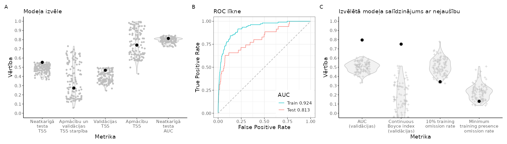
```

<br>

```{r SlieksniCURNIS,echo=FALSE}
suppressPackageStartupMessages(library(kableExtra))
suppressPackageStartupMessages(library(tidyverse))
opts <- options(knitr.kable.NA = "")
slieksni=readxl::read_excel("./Papilddati/BestThresholds/BestThs_CURNIS.xlsx")
tabula=kableExtra::kbl(slieksni, caption = 'Biežāk lietotie projicētās dzīvotņu piemērotības sliekšņa līmeņi un to izvērtējums', 
                    booktabs = TRUE, 
                    longtable = TRUE) 
tabula %>%
  kable_styling(latex_options = "scale_down") %>%
  scroll_box(width = "100%", box_css = "border: 0px;")
```


<br>


```{r HSprojCURNIS, echo=FALSE, out.width = '100%', fig.cap='Labākā modeļa projekcija suga sdzīvotņu piemērotībai. Krāsu skala reprezentē cloglog vērtību no 0 līdz 1, kur starp galapunktiem esošā atzīme ir vienādas sensitivātes un specifiskuma treniņdatos slieksnis iepriekšējā tabulā (izvēlēts vizualizēšanas mērķiem un skaidrošanas ērtumam).'}
  
```

<br>


[**Vēl nē:** Dzīvotņu piemērotība (GeoTIFF)]()

[**Vēl nē:** Par labāko atzītais modelis (krosvalidācijas; *.RDS)]()

[**Vēl nē:** Par labāko atzītais modelis (kombinēts; *.RDS)]()

[**Vēl nē:** Par labāko atzītais modelis (tikai ietekmīgās pazīmes; *.RDS)]()

[**Vēl nē:** Ekoģeogrāfisko mainīgo izvēles gaita, to VIF (savstarpējās prognozētspējas raksturojums) un ietekmes modelī (permutāciju procedūrā) raksturojums (*.xlsx)]()

**Attēls EGV marginālajām atbildēm**

<br>


### CURCOM - brūnspārnu ķauķis *Curruca communis* {#Chapter10.1.090}


```{r NovAtlaseCURCOM, echo=FALSE, out.width = '100%', fig.cap='Novērojumu atlases gaita un modelēšanā izmantojamie brūnspārnu ķauķa *Curruca communis* novērojumi un fona punkti: A - novērojumu saglabāšanās atlases gaitā; B - visu pieejamo novērojumu (solis 1) izvietojums; C - ar vismaz iespējamu ligzdošanu skaitītie novēorjumi, kas izturējuši līdz septītā soļa beigām (punkti ir unikālie 1 km kvadrāti, krusti ir unikālie 100 m kvadrāti); D - ar vismaz ticamu ligzdošanu skaitītie novēorjumi, kas izturējuši līdz septītā soļa beigām (punkti ir unikālie 1 km kvadrāti, krusti ir unikālie 100 m kvadrāti); E - ar pierādītu ligzdošanu skaitītie novēorjumi, kas izturējuši līdz septītā soļa beigām (punkti ir unikālie 1 km kvadrāti, krusti ir unikālie 100 m kvadrāti); F - modelēšanā izmantojamā apmācību kopa (punkti ir sugas klātbūtnes, krusti ir fona raksturošanai); G - modelēšanā izmantojamā neatkarīgās testēšanas kopa (punkti ir sugas klātbūtnes, krusti ir fona raksturošanai)'}
knitr::include_graphics("./Atteli/IzvelesAtteli/ObsSelection_CURCOM.png")
```


<br>


```{r ModelaRaksturojumsCURCOM, echo=FALSE, out.width = '100%', fig.cap='Labākā modeļa izvēle un uzvērtējums: A - labākā modeļa (ar treknu melnu punktu) salīdzinājums ar citiem pielāgotajiem modeļiem (pelēkie punkti un to sastopamības blīvuma funkcijas); B - labākā modeļa izvērtējums, to salīdzinot ar nejauši ģenerētiem nulles modeļiem (n=100) tajā pašā EGV, klātbūtnez un fona punktu veidotajā informācijas telpā.'}
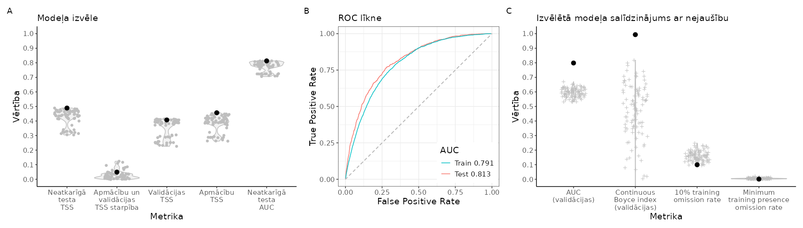
```

<br>

```{r SlieksniCURCOM,echo=FALSE}
suppressPackageStartupMessages(library(kableExtra))
suppressPackageStartupMessages(library(tidyverse))
opts <- options(knitr.kable.NA = "")
slieksni=readxl::read_excel("./Papilddati/BestThresholds/BestThs_CURCOM.xlsx")
tabula=kableExtra::kbl(slieksni, caption = 'Biežāk lietotie projicētās dzīvotņu piemērotības sliekšņa līmeņi un to izvērtējums', 
                    booktabs = TRUE, 
                    longtable = TRUE) 
tabula %>%
  kable_styling(latex_options = "scale_down") %>%
  scroll_box(width = "100%", box_css = "border: 0px;")
```


<br>


```{r HSprojCURCOM, echo=FALSE, out.width = '100%', fig.cap='Labākā modeļa projekcija suga sdzīvotņu piemērotībai. Krāsu skala reprezentē cloglog vērtību no 0 līdz 1, kur starp galapunktiem esošā atzīme ir vienādas sensitivātes un specifiskuma treniņdatos slieksnis iepriekšējā tabulā (izvēlēts vizualizēšanas mērķiem un skaidrošanas ērtumam).'}
  knitr::include_graphics("./Atteli/Beigam_KarteNebal/BeiguKarteiNebal_CURCOM.png")
```

<br>


[**Vēl nē:** Dzīvotņu piemērotība (GeoTIFF)]()

[**Vēl nē:** Par labāko atzītais modelis (krosvalidācijas; *.RDS)]()

[**Vēl nē:** Par labāko atzītais modelis (kombinēts; *.RDS)]()

[**Vēl nē:** Par labāko atzītais modelis (tikai ietekmīgās pazīmes; *.RDS)]()

[**Vēl nē:** Ekoģeogrāfisko mainīgo izvēles gaita, to VIF (savstarpējās prognozētspējas raksturojums) un ietekmes modelī (permutāciju procedūrā) raksturojums (*.xlsx)]()

**Attēls EGV marginālajām atbildēm**

<br>


### CERFAM - mizložņa *Certhia familiaris* {#Chapter10.1.091}


```{r NovAtlaseCERFAM, echo=FALSE, out.width = '100%', fig.cap='Novērojumu atlases gaita un modelēšanā izmantojamie mizložņas *Certhia familiaris* novērojumi un fona punkti: A - novērojumu saglabāšanās atlases gaitā; B - visu pieejamo novērojumu (solis 1) izvietojums; C - ar vismaz iespējamu ligzdošanu skaitītie novēorjumi, kas izturējuši līdz septītā soļa beigām (punkti ir unikālie 1 km kvadrāti, krusti ir unikālie 100 m kvadrāti); D - ar vismaz ticamu ligzdošanu skaitītie novēorjumi, kas izturējuši līdz septītā soļa beigām (punkti ir unikālie 1 km kvadrāti, krusti ir unikālie 100 m kvadrāti); E - ar pierādītu ligzdošanu skaitītie novēorjumi, kas izturējuši līdz septītā soļa beigām (punkti ir unikālie 1 km kvadrāti, krusti ir unikālie 100 m kvadrāti); F - modelēšanā izmantojamā apmācību kopa (punkti ir sugas klātbūtnes, krusti ir fona raksturošanai); G - modelēšanā izmantojamā neatkarīgās testēšanas kopa (punkti ir sugas klātbūtnes, krusti ir fona raksturošanai)'}

```


<br>


```{r ModelaRaksturojumsCERFAM, echo=FALSE, out.width = '100%', fig.cap='Labākā modeļa izvēle un uzvērtējums: A - labākā modeļa (ar treknu melnu punktu) salīdzinājums ar citiem pielāgotajiem modeļiem (pelēkie punkti un to sastopamības blīvuma funkcijas); B - labākā modeļa izvērtējums, to salīdzinot ar nejauši ģenerētiem nulles modeļiem (n=100) tajā pašā EGV, klātbūtnez un fona punktu veidotajā informācijas telpā.'}

```

<br>

```{r SlieksniCERFAM,echo=FALSE}
suppressPackageStartupMessages(library(kableExtra))
suppressPackageStartupMessages(library(tidyverse))
opts <- options(knitr.kable.NA = "")
slieksni=readxl::read_excel("./Papilddati/BestThresholds/BestThs_CERFAM.xlsx")
tabula=kableExtra::kbl(slieksni, caption = 'Biežāk lietotie projicētās dzīvotņu piemērotības sliekšņa līmeņi un to izvērtējums', 
                    booktabs = TRUE, 
                    longtable = TRUE) 
tabula %>%
  kable_styling(latex_options = "scale_down") %>%
  scroll_box(width = "100%", box_css = "border: 0px;")
```


<br>


```{r HSprojCERFAM, echo=FALSE, out.width = '100%', fig.cap='Labākā modeļa projekcija suga sdzīvotņu piemērotībai. Krāsu skala reprezentē cloglog vērtību no 0 līdz 1, kur starp galapunktiem esošā atzīme ir vienādas sensitivātes un specifiskuma treniņdatos slieksnis iepriekšējā tabulā (izvēlēts vizualizēšanas mērķiem un skaidrošanas ērtumam).'}
  knitr::include_graphics("./Atteli/Beigam_KarteNebal/BeiguKarteiNebal_CERFAM.png")
```

<br>


[**Vēl nē:** Dzīvotņu piemērotība (GeoTIFF)]()

[**Vēl nē:** Par labāko atzītais modelis (krosvalidācijas; *.RDS)]()

[**Vēl nē:** Par labāko atzītais modelis (kombinēts; *.RDS)]()

[**Vēl nē:** Par labāko atzītais modelis (tikai ietekmīgās pazīmes; *.RDS)]()

[**Vēl nē:** Ekoģeogrāfisko mainīgo izvēles gaita, to VIF (savstarpējās prognozētspējas raksturojums) un ietekmes modelī (permutāciju procedūrā) raksturojums (*.xlsx)]()

**Attēls EGV marginālajām atbildēm**

<br>


### SITEUR - dzilnītis *Sitta europaea* {#Chapter10.1.092}


```{r NovAtlaseSITEUR, echo=FALSE, out.width = '100%', fig.cap='Novērojumu atlases gaita un modelēšanā izmantojamie dzilnīša *Sitta europaea* novērojumi un fona punkti: A - novērojumu saglabāšanās atlases gaitā; B - visu pieejamo novērojumu (solis 1) izvietojums; C - ar vismaz iespējamu ligzdošanu skaitītie novēorjumi, kas izturējuši līdz septītā soļa beigām (punkti ir unikālie 1 km kvadrāti, krusti ir unikālie 100 m kvadrāti); D - ar vismaz ticamu ligzdošanu skaitītie novēorjumi, kas izturējuši līdz septītā soļa beigām (punkti ir unikālie 1 km kvadrāti, krusti ir unikālie 100 m kvadrāti); E - ar pierādītu ligzdošanu skaitītie novēorjumi, kas izturējuši līdz septītā soļa beigām (punkti ir unikālie 1 km kvadrāti, krusti ir unikālie 100 m kvadrāti); F - modelēšanā izmantojamā apmācību kopa (punkti ir sugas klātbūtnes, krusti ir fona raksturošanai); G - modelēšanā izmantojamā neatkarīgās testēšanas kopa (punkti ir sugas klātbūtnes, krusti ir fona raksturošanai)'}
knitr::include_graphics("./Atteli/IzvelesAtteli/ObsSelection_SITEUR.png")
```


<br>


```{r ModelaRaksturojumsSITEUR, echo=FALSE, out.width = '100%', fig.cap='Labākā modeļa izvēle un uzvērtējums: A - labākā modeļa (ar treknu melnu punktu) salīdzinājums ar citiem pielāgotajiem modeļiem (pelēkie punkti un to sastopamības blīvuma funkcijas); B - labākā modeļa izvērtējums, to salīdzinot ar nejauši ģenerētiem nulles modeļiem (n=100) tajā pašā EGV, klātbūtnez un fona punktu veidotajā informācijas telpā.'}
knitr::include_graphics("./Atteli/Beigam_IzvelesAttels/IzvelesAttels_SITEUR.png")
```

<br>

```{r SlieksniSITEUR,echo=FALSE}
suppressPackageStartupMessages(library(kableExtra))
suppressPackageStartupMessages(library(tidyverse))
opts <- options(knitr.kable.NA = "")
slieksni=readxl::read_excel("./Papilddati/BestThresholds/BestThs_SITEUR.xlsx")
tabula=kableExtra::kbl(slieksni, caption = 'Biežāk lietotie projicētās dzīvotņu piemērotības sliekšņa līmeņi un to izvērtējums', 
                    booktabs = TRUE, 
                    longtable = TRUE) 
tabula %>%
  kable_styling(latex_options = "scale_down") %>%
  scroll_box(width = "100%", box_css = "border: 0px;")
```


<br>


```{r HSprojSITEUR, echo=FALSE, out.width = '100%', fig.cap='Labākā modeļa projekcija suga sdzīvotņu piemērotībai. Krāsu skala reprezentē cloglog vērtību no 0 līdz 1, kur starp galapunktiem esošā atzīme ir vienādas sensitivātes un specifiskuma treniņdatos slieksnis iepriekšējā tabulā (izvēlēts vizualizēšanas mērķiem un skaidrošanas ērtumam).'}
  
```

<br>


[**Vēl nē:** Dzīvotņu piemērotība (GeoTIFF)]()

[**Vēl nē:** Par labāko atzītais modelis (krosvalidācijas; *.RDS)]()

[**Vēl nē:** Par labāko atzītais modelis (kombinēts; *.RDS)]()

[**Vēl nē:** Par labāko atzītais modelis (tikai ietekmīgās pazīmes; *.RDS)]()

[**Vēl nē:** Ekoģeogrāfisko mainīgo izvēles gaita, to VIF (savstarpējās prognozētspējas raksturojums) un ietekmes modelī (permutāciju procedūrā) raksturojums (*.xlsx)]()

**Attēls EGV marginālajām atbildēm**

<br>


### STUVUL - mājas strazds *Sturnus vulgaris* {#Chapter10.1.093}


```{r NovAtlaseSTUVUL, echo=FALSE, out.width = '100%', fig.cap='Novērojumu atlases gaita un modelēšanā izmantojamie mājas strazds *Sturnus vulgaris* novērojumi un fona punkti: A - novērojumu saglabāšanās atlases gaitā; B - visu pieejamo novērojumu (solis 1) izvietojums; C - ar vismaz iespējamu ligzdošanu skaitītie novēorjumi, kas izturējuši līdz septītā soļa beigām (punkti ir unikālie 1 km kvadrāti, krusti ir unikālie 100 m kvadrāti); D - ar vismaz ticamu ligzdošanu skaitītie novēorjumi, kas izturējuši līdz septītā soļa beigām (punkti ir unikālie 1 km kvadrāti, krusti ir unikālie 100 m kvadrāti); E - ar pierādītu ligzdošanu skaitītie novēorjumi, kas izturējuši līdz septītā soļa beigām (punkti ir unikālie 1 km kvadrāti, krusti ir unikālie 100 m kvadrāti); F - modelēšanā izmantojamā apmācību kopa (punkti ir sugas klātbūtnes, krusti ir fona raksturošanai); G - modelēšanā izmantojamā neatkarīgās testēšanas kopa (punkti ir sugas klātbūtnes, krusti ir fona raksturošanai)'}
knitr::include_graphics("./Atteli/IzvelesAtteli/ObsSelection_STUVUL.png")
```


<br>


```{r ModelaRaksturojumsSTUVUL, echo=FALSE, out.width = '100%', fig.cap='Labākā modeļa izvēle un uzvērtējums: A - labākā modeļa (ar treknu melnu punktu) salīdzinājums ar citiem pielāgotajiem modeļiem (pelēkie punkti un to sastopamības blīvuma funkcijas); B - labākā modeļa izvērtējums, to salīdzinot ar nejauši ģenerētiem nulles modeļiem (n=100) tajā pašā EGV, klātbūtnez un fona punktu veidotajā informācijas telpā.'}
knitr::include_graphics("./Atteli/Beigam_IzvelesAttels/IzvelesAttels_STUVUL.png")
```

<br>

```{r SlieksniSTUVUL,echo=FALSE}
suppressPackageStartupMessages(library(kableExtra))
suppressPackageStartupMessages(library(tidyverse))
opts <- options(knitr.kable.NA = "")
slieksni=readxl::read_excel("./Papilddati/BestThresholds/BestThs_STUVUL.xlsx")
tabula=kableExtra::kbl(slieksni, caption = 'Biežāk lietotie projicētās dzīvotņu piemērotības sliekšņa līmeņi un to izvērtējums', 
                    booktabs = TRUE, 
                    longtable = TRUE) 
tabula %>%
  kable_styling(latex_options = "scale_down") %>%
  scroll_box(width = "100%", box_css = "border: 0px;")
```


<br>


```{r HSprojSTUVUL, echo=FALSE, out.width = '100%', fig.cap='Labākā modeļa projekcija suga sdzīvotņu piemērotībai. Krāsu skala reprezentē cloglog vērtību no 0 līdz 1, kur starp galapunktiem esošā atzīme ir vienādas sensitivātes un specifiskuma treniņdatos slieksnis iepriekšējā tabulā (izvēlēts vizualizēšanas mērķiem un skaidrošanas ērtumam).'}
  knitr::include_graphics("./Atteli/Beigam_KarteNebal/BeiguKarteiNebal_STUVUL.png")
```

<br>


[**Vēl nē:** Dzīvotņu piemērotība (GeoTIFF)]()

[**Vēl nē:** Par labāko atzītais modelis (krosvalidācijas; *.RDS)]()

[**Vēl nē:** Par labāko atzītais modelis (kombinēts; *.RDS)]()

[**Vēl nē:** Par labāko atzītais modelis (tikai ietekmīgās pazīmes; *.RDS)]()

[**Vēl nē:** Ekoģeogrāfisko mainīgo izvēles gaita, to VIF (savstarpējās prognozētspējas raksturojums) un ietekmes modelī (permutāciju procedūrā) raksturojums (*.xlsx)]()

**Attēls EGV marginālajām atbildēm**

<br>


### TURVIS - sila strazds *Turdus viscivorus* {#Chapter10.1.094}


```{r NovAtlaseTURVIS, echo=FALSE, out.width = '100%', fig.cap='Novērojumu atlases gaita un modelēšanā izmantojamie sila strazda *Turdus viscivorus* novērojumi un fona punkti: A - novērojumu saglabāšanās atlases gaitā; B - visu pieejamo novērojumu (solis 1) izvietojums; C - ar vismaz iespējamu ligzdošanu skaitītie novēorjumi, kas izturējuši līdz septītā soļa beigām (punkti ir unikālie 1 km kvadrāti, krusti ir unikālie 100 m kvadrāti); D - ar vismaz ticamu ligzdošanu skaitītie novēorjumi, kas izturējuši līdz septītā soļa beigām (punkti ir unikālie 1 km kvadrāti, krusti ir unikālie 100 m kvadrāti); E - ar pierādītu ligzdošanu skaitītie novēorjumi, kas izturējuši līdz septītā soļa beigām (punkti ir unikālie 1 km kvadrāti, krusti ir unikālie 100 m kvadrāti); F - modelēšanā izmantojamā apmācību kopa (punkti ir sugas klātbūtnes, krusti ir fona raksturošanai); G - modelēšanā izmantojamā neatkarīgās testēšanas kopa (punkti ir sugas klātbūtnes, krusti ir fona raksturošanai)'}
knitr::include_graphics("./Atteli/IzvelesAtteli/ObsSelection_TURVIS.png")
```


<br>


```{r ModelaRaksturojumsTURVIS, echo=FALSE, out.width = '100%', fig.cap='Labākā modeļa izvēle un uzvērtējums: A - labākā modeļa (ar treknu melnu punktu) salīdzinājums ar citiem pielāgotajiem modeļiem (pelēkie punkti un to sastopamības blīvuma funkcijas); B - labākā modeļa izvērtējums, to salīdzinot ar nejauši ģenerētiem nulles modeļiem (n=100) tajā pašā EGV, klātbūtnez un fona punktu veidotajā informācijas telpā.'}
knitr::include_graphics("./Atteli/Beigam_IzvelesAttels/IzvelesAttels_TURVIS.png")
```

<br>

```{r SlieksniTURVIS,echo=FALSE}
suppressPackageStartupMessages(library(kableExtra))
suppressPackageStartupMessages(library(tidyverse))
opts <- options(knitr.kable.NA = "")
slieksni=readxl::read_excel("./Papilddati/BestThresholds/BestThs_TURVIS.xlsx")
tabula=kableExtra::kbl(slieksni, caption = 'Biežāk lietotie projicētās dzīvotņu piemērotības sliekšņa līmeņi un to izvērtējums', 
                    booktabs = TRUE, 
                    longtable = TRUE) 
tabula %>%
  kable_styling(latex_options = "scale_down") %>%
  scroll_box(width = "100%", box_css = "border: 0px;")
```


<br>


```{r HSprojTURVIS, echo=FALSE, out.width = '100%', fig.cap='Labākā modeļa projekcija suga sdzīvotņu piemērotībai. Krāsu skala reprezentē cloglog vērtību no 0 līdz 1, kur starp galapunktiem esošā atzīme ir vienādas sensitivātes un specifiskuma treniņdatos slieksnis iepriekšējā tabulā (izvēlēts vizualizēšanas mērķiem un skaidrošanas ērtumam).'}
  
```

<br>


[**Vēl nē:** Dzīvotņu piemērotība (GeoTIFF)]()

[**Vēl nē:** Par labāko atzītais modelis (krosvalidācijas; *.RDS)]()

[**Vēl nē:** Par labāko atzītais modelis (kombinēts; *.RDS)]()

[**Vēl nē:** Par labāko atzītais modelis (tikai ietekmīgās pazīmes; *.RDS)]()

[**Vēl nē:** Ekoģeogrāfisko mainīgo izvēles gaita, to VIF (savstarpējās prognozētspējas raksturojums) un ietekmes modelī (permutāciju procedūrā) raksturojums (*.xlsx)]()

**Attēls EGV marginālajām atbildēm**

<br>


### TURILI - plukšķis *Turdus iliacus* {#Chapter10.1.095}


```{r NovAtlaseTURILI, echo=FALSE, out.width = '100%', fig.cap='Novērojumu atlases gaita un modelēšanā izmantojamie plukšķa *Turdus iliacus* novērojumi un fona punkti: A - novērojumu saglabāšanās atlases gaitā; B - visu pieejamo novērojumu (solis 1) izvietojums; C - ar vismaz iespējamu ligzdošanu skaitītie novēorjumi, kas izturējuši līdz septītā soļa beigām (punkti ir unikālie 1 km kvadrāti, krusti ir unikālie 100 m kvadrāti); D - ar vismaz ticamu ligzdošanu skaitītie novēorjumi, kas izturējuši līdz septītā soļa beigām (punkti ir unikālie 1 km kvadrāti, krusti ir unikālie 100 m kvadrāti); E - ar pierādītu ligzdošanu skaitītie novēorjumi, kas izturējuši līdz septītā soļa beigām (punkti ir unikālie 1 km kvadrāti, krusti ir unikālie 100 m kvadrāti); F - modelēšanā izmantojamā apmācību kopa (punkti ir sugas klātbūtnes, krusti ir fona raksturošanai); G - modelēšanā izmantojamā neatkarīgās testēšanas kopa (punkti ir sugas klātbūtnes, krusti ir fona raksturošanai)'}
knitr::include_graphics("./Atteli/IzvelesAtteli/ObsSelection_TURILI.png")
```


<br>


```{r ModelaRaksturojumsTURILI, echo=FALSE, out.width = '100%', fig.cap='Labākā modeļa izvēle un uzvērtējums: A - labākā modeļa (ar treknu melnu punktu) salīdzinājums ar citiem pielāgotajiem modeļiem (pelēkie punkti un to sastopamības blīvuma funkcijas); B - labākā modeļa izvērtējums, to salīdzinot ar nejauši ģenerētiem nulles modeļiem (n=100) tajā pašā EGV, klātbūtnez un fona punktu veidotajā informācijas telpā.'}
knitr::include_graphics("./Atteli/Beigam_IzvelesAttels/IzvelesAttels_TURILI.png")
```

<br>

```{r SlieksniTURILI,echo=FALSE}
suppressPackageStartupMessages(library(kableExtra))
suppressPackageStartupMessages(library(tidyverse))
opts <- options(knitr.kable.NA = "")
slieksni=readxl::read_excel("./Papilddati/BestThresholds/BestThs_TURILI.xlsx")
tabula=kableExtra::kbl(slieksni, caption = 'Biežāk lietotie projicētās dzīvotņu piemērotības sliekšņa līmeņi un to izvērtējums', 
                    booktabs = TRUE, 
                    longtable = TRUE) 
tabula %>%
  kable_styling(latex_options = "scale_down") %>%
  scroll_box(width = "100%", box_css = "border: 0px;")
```


<br>


```{r HSprojTURILI, echo=FALSE, out.width = '100%', fig.cap='Labākā modeļa projekcija suga sdzīvotņu piemērotībai. Krāsu skala reprezentē cloglog vērtību no 0 līdz 1, kur starp galapunktiem esošā atzīme ir vienādas sensitivātes un specifiskuma treniņdatos slieksnis iepriekšējā tabulā (izvēlēts vizualizēšanas mērķiem un skaidrošanas ērtumam).'}
  knitr::include_graphics("./Atteli/Beigam_KarteNebal/BeiguKarteiNebal_TURILI.png")
```

<br>


[**Vēl nē:** Dzīvotņu piemērotība (GeoTIFF)]()

[**Vēl nē:** Par labāko atzītais modelis (krosvalidācijas; *.RDS)]()

[**Vēl nē:** Par labāko atzītais modelis (kombinēts; *.RDS)]()

[**Vēl nē:** Par labāko atzītais modelis (tikai ietekmīgās pazīmes; *.RDS)]()

[**Vēl nē:** Ekoģeogrāfisko mainīgo izvēles gaita, to VIF (savstarpējās prognozētspējas raksturojums) un ietekmes modelī (permutāciju procedūrā) raksturojums (*.xlsx)]()

**Attēls EGV marginālajām atbildēm**

<br>


### CYASVE - zilrīklīte *Cyanecula svecica* {#Chapter10.1.096}


```{r NovAtlaseCYASVE, echo=FALSE, out.width = '100%', fig.cap='Novērojumu atlases gaita un modelēšanā izmantojamie zilrīklītes *Cyanecula svecica* novērojumi un fona punkti: A - novērojumu saglabāšanās atlases gaitā; B - visu pieejamo novērojumu (solis 1) izvietojums; C - ar vismaz iespējamu ligzdošanu skaitītie novēorjumi, kas izturējuši līdz septītā soļa beigām (punkti ir unikālie 1 km kvadrāti, krusti ir unikālie 100 m kvadrāti); D - ar vismaz ticamu ligzdošanu skaitītie novēorjumi, kas izturējuši līdz septītā soļa beigām (punkti ir unikālie 1 km kvadrāti, krusti ir unikālie 100 m kvadrāti); E - ar pierādītu ligzdošanu skaitītie novēorjumi, kas izturējuši līdz septītā soļa beigām (punkti ir unikālie 1 km kvadrāti, krusti ir unikālie 100 m kvadrāti); F - modelēšanā izmantojamā apmācību kopa (punkti ir sugas klātbūtnes, krusti ir fona raksturošanai); G - modelēšanā izmantojamā neatkarīgās testēšanas kopa (punkti ir sugas klātbūtnes, krusti ir fona raksturošanai)'}
knitr::include_graphics("./Atteli/IzvelesAtteli/ObsSelection_CYASVE.png")
```


<br>

**Ar šā brīža pieejām šajā projektā zilrīklītes *Cyanecula svecica* izplatība nav modelējama**

<br>


### LUSLUS - lakstīgala *Luscinia luscinia* {#Chapter10.1.097}


```{r NovAtlaseLUSLUS, echo=FALSE, out.width = '100%', fig.cap='Novērojumu atlases gaita un modelēšanā izmantojamie lakstīgala *Luscinia luscinia* novērojumi un fona punkti: A - novērojumu saglabāšanās atlases gaitā; B - visu pieejamo novērojumu (solis 1) izvietojums; C - ar vismaz iespējamu ligzdošanu skaitītie novēorjumi, kas izturējuši līdz septītā soļa beigām (punkti ir unikālie 1 km kvadrāti, krusti ir unikālie 100 m kvadrāti); D - ar vismaz ticamu ligzdošanu skaitītie novēorjumi, kas izturējuši līdz septītā soļa beigām (punkti ir unikālie 1 km kvadrāti, krusti ir unikālie 100 m kvadrāti); E - ar pierādītu ligzdošanu skaitītie novēorjumi, kas izturējuši līdz septītā soļa beigām (punkti ir unikālie 1 km kvadrāti, krusti ir unikālie 100 m kvadrāti); F - modelēšanā izmantojamā apmācību kopa (punkti ir sugas klātbūtnes, krusti ir fona raksturošanai); G - modelēšanā izmantojamā neatkarīgās testēšanas kopa (punkti ir sugas klātbūtnes, krusti ir fona raksturošanai)'}
knitr::include_graphics("./Atteli/IzvelesAtteli/ObsSelection_LUSLUS.png")
```


<br>


```{r ModelaRaksturojumsLUSLUS, echo=FALSE, out.width = '100%', fig.cap='Labākā modeļa izvēle un uzvērtējums: A - labākā modeļa (ar treknu melnu punktu) salīdzinājums ar citiem pielāgotajiem modeļiem (pelēkie punkti un to sastopamības blīvuma funkcijas); B - labākā modeļa izvērtējums, to salīdzinot ar nejauši ģenerētiem nulles modeļiem (n=100) tajā pašā EGV, klātbūtnez un fona punktu veidotajā informācijas telpā.'}
knitr::include_graphics("./Atteli/Beigam_IzvelesAttels/IzvelesAttels_LUSLUS.png")
```

<br>

```{r SlieksniLUSLUS,echo=FALSE}
suppressPackageStartupMessages(library(kableExtra))
suppressPackageStartupMessages(library(tidyverse))
opts <- options(knitr.kable.NA = "")
slieksni=readxl::read_excel("./Papilddati/BestThresholds/BestThs_LUSLUS.xlsx")
tabula=kableExtra::kbl(slieksni, caption = 'Biežāk lietotie projicētās dzīvotņu piemērotības sliekšņa līmeņi un to izvērtējums', 
                    booktabs = TRUE, 
                    longtable = TRUE) 
tabula %>%
  kable_styling(latex_options = "scale_down") %>%
  scroll_box(width = "100%", box_css = "border: 0px;")
```


<br>


```{r HSprojLUSLUS, echo=FALSE, out.width = '100%', fig.cap='Labākā modeļa projekcija suga sdzīvotņu piemērotībai. Krāsu skala reprezentē cloglog vērtību no 0 līdz 1, kur starp galapunktiem esošā atzīme ir vienādas sensitivātes un specifiskuma treniņdatos slieksnis iepriekšējā tabulā (izvēlēts vizualizēšanas mērķiem un skaidrošanas ērtumam).'}
  knitr::include_graphics("./Atteli/Beigam_KarteNebal/BeiguKarteiNebal_LUSLUS.png")
```

<br>


[**Vēl nē:** Dzīvotņu piemērotība (GeoTIFF)]()

[**Vēl nē:** Par labāko atzītais modelis (krosvalidācijas; *.RDS)]()

[**Vēl nē:** Par labāko atzītais modelis (kombinēts; *.RDS)]()

[**Vēl nē:** Par labāko atzītais modelis (tikai ietekmīgās pazīmes; *.RDS)]()

[**Vēl nē:** Ekoģeogrāfisko mainīgo izvēles gaita, to VIF (savstarpējās prognozētspējas raksturojums) un ietekmes modelī (permutāciju procedūrā) raksturojums (*.xlsx)]()

**Attēls EGV marginālajām atbildēm**

<br>


### FICPAR - mazais mušķērājs *Ficedula parva* {#Chapter10.1.098}


```{r NovAtlaseFICPAR, echo=FALSE, out.width = '100%', fig.cap='Novērojumu atlases gaita un modelēšanā izmantojamie mazā mušķērāja *Ficedula parva* novērojumi un fona punkti: A - novērojumu saglabāšanās atlases gaitā; B - visu pieejamo novērojumu (solis 1) izvietojums; C - ar vismaz iespējamu ligzdošanu skaitītie novēorjumi, kas izturējuši līdz septītā soļa beigām (punkti ir unikālie 1 km kvadrāti, krusti ir unikālie 100 m kvadrāti); D - ar vismaz ticamu ligzdošanu skaitītie novēorjumi, kas izturējuši līdz septītā soļa beigām (punkti ir unikālie 1 km kvadrāti, krusti ir unikālie 100 m kvadrāti); E - ar pierādītu ligzdošanu skaitītie novēorjumi, kas izturējuši līdz septītā soļa beigām (punkti ir unikālie 1 km kvadrāti, krusti ir unikālie 100 m kvadrāti); F - modelēšanā izmantojamā apmācību kopa (punkti ir sugas klātbūtnes, krusti ir fona raksturošanai); G - modelēšanā izmantojamā neatkarīgās testēšanas kopa (punkti ir sugas klātbūtnes, krusti ir fona raksturošanai)'}
knitr::include_graphics("./Atteli/IzvelesAtteli/ObsSelection_FICPAR.png")
```


<br>


```{r ModelaRaksturojumsFICPAR, echo=FALSE, out.width = '100%', fig.cap='Labākā modeļa izvēle un uzvērtējums: A - labākā modeļa (ar treknu melnu punktu) salīdzinājums ar citiem pielāgotajiem modeļiem (pelēkie punkti un to sastopamības blīvuma funkcijas); B - labākā modeļa izvērtējums, to salīdzinot ar nejauši ģenerētiem nulles modeļiem (n=100) tajā pašā EGV, klātbūtnez un fona punktu veidotajā informācijas telpā.'}

```

<br>

```{r SlieksniFICPAR,echo=FALSE}
suppressPackageStartupMessages(library(kableExtra))
suppressPackageStartupMessages(library(tidyverse))
opts <- options(knitr.kable.NA = "")
slieksni=readxl::read_excel("./Papilddati/BestThresholds/BestThs_FICPAR.xlsx")
tabula=kableExtra::kbl(slieksni, caption = 'Biežāk lietotie projicētās dzīvotņu piemērotības sliekšņa līmeņi un to izvērtējums', 
                    booktabs = TRUE, 
                    longtable = TRUE) 
tabula %>%
  kable_styling(latex_options = "scale_down") %>%
  scroll_box(width = "100%", box_css = "border: 0px;")
```


<br>


```{r HSprojFICPAR, echo=FALSE, out.width = '100%', fig.cap='Labākā modeļa projekcija suga sdzīvotņu piemērotībai. Krāsu skala reprezentē cloglog vērtību no 0 līdz 1, kur starp galapunktiem esošā atzīme ir vienādas sensitivātes un specifiskuma treniņdatos slieksnis iepriekšējā tabulā (izvēlēts vizualizēšanas mērķiem un skaidrošanas ērtumam).'}
  knitr::include_graphics("./Atteli/Beigam_KarteNebal/BeiguKarteiNebal_FICPAR.png")
```

<br>


[**Vēl nē:** Dzīvotņu piemērotība (GeoTIFF)]()

[**Vēl nē:** Par labāko atzītais modelis (krosvalidācijas; *.RDS)]()

[**Vēl nē:** Par labāko atzītais modelis (kombinēts; *.RDS)]()

[**Vēl nē:** Par labāko atzītais modelis (tikai ietekmīgās pazīmes; *.RDS)]()

[**Vēl nē:** Ekoģeogrāfisko mainīgo izvēles gaita, to VIF (savstarpējās prognozētspējas raksturojums) un ietekmes modelī (permutāciju procedūrā) raksturojums (*.xlsx)]()

**Attēls EGV marginālajām atbildēm**

<br>


### FICHYP - melnais mušķērājs *Ficedula hypoleuca* {#Chapter10.1.099}


```{r NovAtlaseFICHYP, echo=FALSE, out.width = '100%', fig.cap='Novērojumu atlases gaita un modelēšanā izmantojamie melnā mušķērāja *Ficedula hypoleuca* novērojumi un fona punkti: A - novērojumu saglabāšanās atlases gaitā; B - visu pieejamo novērojumu (solis 1) izvietojums; C - ar vismaz iespējamu ligzdošanu skaitītie novēorjumi, kas izturējuši līdz septītā soļa beigām (punkti ir unikālie 1 km kvadrāti, krusti ir unikālie 100 m kvadrāti); D - ar vismaz ticamu ligzdošanu skaitītie novēorjumi, kas izturējuši līdz septītā soļa beigām (punkti ir unikālie 1 km kvadrāti, krusti ir unikālie 100 m kvadrāti); E - ar pierādītu ligzdošanu skaitītie novēorjumi, kas izturējuši līdz septītā soļa beigām (punkti ir unikālie 1 km kvadrāti, krusti ir unikālie 100 m kvadrāti); F - modelēšanā izmantojamā apmācību kopa (punkti ir sugas klātbūtnes, krusti ir fona raksturošanai); G - modelēšanā izmantojamā neatkarīgās testēšanas kopa (punkti ir sugas klātbūtnes, krusti ir fona raksturošanai)'}
knitr::include_graphics("./Atteli/IzvelesAtteli/ObsSelection_FICHYP.png")
```


<br>


```{r ModelaRaksturojumsFICHYP, echo=FALSE, out.width = '100%', fig.cap='Labākā modeļa izvēle un uzvērtējums: A - labākā modeļa (ar treknu melnu punktu) salīdzinājums ar citiem pielāgotajiem modeļiem (pelēkie punkti un to sastopamības blīvuma funkcijas); B - labākā modeļa izvērtējums, to salīdzinot ar nejauši ģenerētiem nulles modeļiem (n=100) tajā pašā EGV, klātbūtnez un fona punktu veidotajā informācijas telpā.'}
knitr::include_graphics("./Atteli/Beigam_IzvelesAttels/IzvelesAttels_FICHYP.png")
```

<br>

```{r SlieksniFICHYP,echo=FALSE}
suppressPackageStartupMessages(library(kableExtra))
suppressPackageStartupMessages(library(tidyverse))
opts <- options(knitr.kable.NA = "")
slieksni=readxl::read_excel("./Papilddati/BestThresholds/BestThs_FICHYP.xlsx")
tabula=kableExtra::kbl(slieksni, caption = 'Biežāk lietotie projicētās dzīvotņu piemērotības sliekšņa līmeņi un to izvērtējums', 
                    booktabs = TRUE, 
                    longtable = TRUE) 
tabula %>%
  kable_styling(latex_options = "scale_down") %>%
  scroll_box(width = "100%", box_css = "border: 0px;")
```


<br>


```{r HSprojFICHYP, echo=FALSE, out.width = '100%', fig.cap='Labākā modeļa projekcija suga sdzīvotņu piemērotībai. Krāsu skala reprezentē cloglog vērtību no 0 līdz 1, kur starp galapunktiem esošā atzīme ir vienādas sensitivātes un specifiskuma treniņdatos slieksnis iepriekšējā tabulā (izvēlēts vizualizēšanas mērķiem un skaidrošanas ērtumam).'}
  knitr::include_graphics("./Atteli/Beigam_KarteNebal/BeiguKarteiNebal_FICHYP.png")
```

<br>


[**Vēl nē:** Dzīvotņu piemērotība (GeoTIFF)]()

[**Vēl nē:** Par labāko atzītais modelis (krosvalidācijas; *.RDS)]()

[**Vēl nē:** Par labāko atzītais modelis (kombinēts; *.RDS)]()

[**Vēl nē:** Par labāko atzītais modelis (tikai ietekmīgās pazīmes; *.RDS)]()

[**Vēl nē:** Ekoģeogrāfisko mainīgo izvēles gaita, to VIF (savstarpējās prognozētspējas raksturojums) un ietekmes modelī (permutāciju procedūrā) raksturojums (*.xlsx)]()

**Attēls EGV marginālajām atbildēm**

<br>


### SAXRUB - lukstu čakstīte *Saxicola rubetra* {#Chapter10.1.100}


```{r NovAtlaseSAXRUB, echo=FALSE, out.width = '100%', fig.cap='Novērojumu atlases gaita un modelēšanā izmantojamie lukstu čakstītes *Saxicola rubetra* novērojumi un fona punkti: A - novērojumu saglabāšanās atlases gaitā; B - visu pieejamo novērojumu (solis 1) izvietojums; C - ar vismaz iespējamu ligzdošanu skaitītie novēorjumi, kas izturējuši līdz septītā soļa beigām (punkti ir unikālie 1 km kvadrāti, krusti ir unikālie 100 m kvadrāti); D - ar vismaz ticamu ligzdošanu skaitītie novēorjumi, kas izturējuši līdz septītā soļa beigām (punkti ir unikālie 1 km kvadrāti, krusti ir unikālie 100 m kvadrāti); E - ar pierādītu ligzdošanu skaitītie novēorjumi, kas izturējuši līdz septītā soļa beigām (punkti ir unikālie 1 km kvadrāti, krusti ir unikālie 100 m kvadrāti); F - modelēšanā izmantojamā apmācību kopa (punkti ir sugas klātbūtnes, krusti ir fona raksturošanai); G - modelēšanā izmantojamā neatkarīgās testēšanas kopa (punkti ir sugas klātbūtnes, krusti ir fona raksturošanai)'}
knitr::include_graphics("./Atteli/IzvelesAtteli/ObsSelection_SAXRUB.png")
```


<br>


```{r ModelaRaksturojumsSAXRUB, echo=FALSE, out.width = '100%', fig.cap='Labākā modeļa izvēle un uzvērtējums: A - labākā modeļa (ar treknu melnu punktu) salīdzinājums ar citiem pielāgotajiem modeļiem (pelēkie punkti un to sastopamības blīvuma funkcijas); B - labākā modeļa izvērtējums, to salīdzinot ar nejauši ģenerētiem nulles modeļiem (n=100) tajā pašā EGV, klātbūtnez un fona punktu veidotajā informācijas telpā.'}
knitr::include_graphics("./Atteli/Beigam_IzvelesAttels/IzvelesAttels_SAXRUB.png")
```

<br>

```{r SlieksniSAXRUB,echo=FALSE}
suppressPackageStartupMessages(library(kableExtra))
suppressPackageStartupMessages(library(tidyverse))
opts <- options(knitr.kable.NA = "")
slieksni=readxl::read_excel("./Papilddati/BestThresholds/BestThs_SAXRUB.xlsx")
tabula=kableExtra::kbl(slieksni, caption = 'Biežāk lietotie projicētās dzīvotņu piemērotības sliekšņa līmeņi un to izvērtējums', 
                    booktabs = TRUE, 
                    longtable = TRUE) 
tabula %>%
  kable_styling(latex_options = "scale_down") %>%
  scroll_box(width = "100%", box_css = "border: 0px;")
```


<br>


```{r HSprojSAXRUB, echo=FALSE, out.width = '100%', fig.cap='Labākā modeļa projekcija suga sdzīvotņu piemērotībai. Krāsu skala reprezentē cloglog vērtību no 0 līdz 1, kur starp galapunktiem esošā atzīme ir vienādas sensitivātes un specifiskuma treniņdatos slieksnis iepriekšējā tabulā (izvēlēts vizualizēšanas mērķiem un skaidrošanas ērtumam).'}
  knitr::include_graphics("./Atteli/Beigam_KarteNebal/BeiguKarteiNebal_SAXRUB.png")
```

<br>


[**Vēl nē:** Dzīvotņu piemērotība (GeoTIFF)]()

[**Vēl nē:** Par labāko atzītais modelis (krosvalidācijas; *.RDS)]()

[**Vēl nē:** Par labāko atzītais modelis (kombinēts; *.RDS)]()

[**Vēl nē:** Par labāko atzītais modelis (tikai ietekmīgās pazīmes; *.RDS)]()

[**Vēl nē:** Ekoģeogrāfisko mainīgo izvēles gaita, to VIF (savstarpējās prognozētspējas raksturojums) un ietekmes modelī (permutāciju procedūrā) raksturojums (*.xlsx)]()

**Attēls EGV marginālajām atbildēm**

<br>


### REGREG - zeltgalvītis *Regulus regulus* {#Chapter10.1.101}


```{r NovAtlaseREGREG, echo=FALSE, out.width = '100%', fig.cap='Novērojumu atlases gaita un modelēšanā izmantojamie zeltgalvīša *Regulus regulus* novērojumi un fona punkti: A - novērojumu saglabāšanās atlases gaitā; B - visu pieejamo novērojumu (solis 1) izvietojums; C - ar vismaz iespējamu ligzdošanu skaitītie novēorjumi, kas izturējuši līdz septītā soļa beigām (punkti ir unikālie 1 km kvadrāti, krusti ir unikālie 100 m kvadrāti); D - ar vismaz ticamu ligzdošanu skaitītie novēorjumi, kas izturējuši līdz septītā soļa beigām (punkti ir unikālie 1 km kvadrāti, krusti ir unikālie 100 m kvadrāti); E - ar pierādītu ligzdošanu skaitītie novēorjumi, kas izturējuši līdz septītā soļa beigām (punkti ir unikālie 1 km kvadrāti, krusti ir unikālie 100 m kvadrāti); F - modelēšanā izmantojamā apmācību kopa (punkti ir sugas klātbūtnes, krusti ir fona raksturošanai); G - modelēšanā izmantojamā neatkarīgās testēšanas kopa (punkti ir sugas klātbūtnes, krusti ir fona raksturošanai)'}
knitr::include_graphics("./Atteli/IzvelesAtteli/ObsSelection_REGREG.png")
```


<br>


```{r ModelaRaksturojumsREGREG, echo=FALSE, out.width = '100%', fig.cap='Labākā modeļa izvēle un uzvērtējums: A - labākā modeļa (ar treknu melnu punktu) salīdzinājums ar citiem pielāgotajiem modeļiem (pelēkie punkti un to sastopamības blīvuma funkcijas); B - labākā modeļa izvērtējums, to salīdzinot ar nejauši ģenerētiem nulles modeļiem (n=100) tajā pašā EGV, klātbūtnez un fona punktu veidotajā informācijas telpā.'}
knitr::include_graphics("./Atteli/Beigam_IzvelesAttels/IzvelesAttels_REGREG.png")
```

<br>

```{r SlieksniREGREG,echo=FALSE}
suppressPackageStartupMessages(library(kableExtra))
suppressPackageStartupMessages(library(tidyverse))
opts <- options(knitr.kable.NA = "")
slieksni=readxl::read_excel("./Papilddati/BestThresholds/BestThs_REGREG.xlsx")
tabula=kableExtra::kbl(slieksni, caption = 'Biežāk lietotie projicētās dzīvotņu piemērotības sliekšņa līmeņi un to izvērtējums', 
                    booktabs = TRUE, 
                    longtable = TRUE) 
tabula %>%
  kable_styling(latex_options = "scale_down") %>%
  scroll_box(width = "100%", box_css = "border: 0px;")
```


<br>


```{r HSprojREGREG, echo=FALSE, out.width = '100%', fig.cap='Labākā modeļa projekcija suga sdzīvotņu piemērotībai. Krāsu skala reprezentē cloglog vērtību no 0 līdz 1, kur starp galapunktiem esošā atzīme ir vienādas sensitivātes un specifiskuma treniņdatos slieksnis iepriekšējā tabulā (izvēlēts vizualizēšanas mērķiem un skaidrošanas ērtumam).'}
  knitr::include_graphics("./Atteli/Beigam_KarteNebal/BeiguKarteiNebal_REGREG.png")
```

<br>


[**Vēl nē:** Dzīvotņu piemērotība (GeoTIFF)]()

[**Vēl nē:** Par labāko atzītais modelis (krosvalidācijas; *.RDS)]()

[**Vēl nē:** Par labāko atzītais modelis (kombinēts; *.RDS)]()

[**Vēl nē:** Par labāko atzītais modelis (tikai ietekmīgās pazīmes; *.RDS)]()

[**Vēl nē:** Ekoģeogrāfisko mainīgo izvēles gaita, to VIF (savstarpējās prognozētspējas raksturojums) un ietekmes modelī (permutāciju procedūrā) raksturojums (*.xlsx)]()

**Attēls EGV marginālajām atbildēm**

<br>


### REGIGN - sārtgalvītis *Regulus ignicapilla* {#Chapter10.1.102}


```{r NovAtlaseREGIGN, echo=FALSE, out.width = '100%', fig.cap='Novērojumu atlases gaita un modelēšanā izmantojamie sārtgalvīša *Regulus ignicapilla* novērojumi un fona punkti: A - novērojumu saglabāšanās atlases gaitā; B - visu pieejamo novērojumu (solis 1) izvietojums; C - ar vismaz iespējamu ligzdošanu skaitītie novēorjumi, kas izturējuši līdz septītā soļa beigām (punkti ir unikālie 1 km kvadrāti, krusti ir unikālie 100 m kvadrāti); D - ar vismaz ticamu ligzdošanu skaitītie novēorjumi, kas izturējuši līdz septītā soļa beigām (punkti ir unikālie 1 km kvadrāti, krusti ir unikālie 100 m kvadrāti); E - ar pierādītu ligzdošanu skaitītie novēorjumi, kas izturējuši līdz septītā soļa beigām (punkti ir unikālie 1 km kvadrāti, krusti ir unikālie 100 m kvadrāti); F - modelēšanā izmantojamā apmācību kopa (punkti ir sugas klātbūtnes, krusti ir fona raksturošanai); G - modelēšanā izmantojamā neatkarīgās testēšanas kopa (punkti ir sugas klātbūtnes, krusti ir fona raksturošanai)'}
knitr::include_graphics("./Atteli/IzvelesAtteli/ObsSelection_REGIGN.png")
```


<br>


```{r ModelaRaksturojumsREGIGN, echo=FALSE, out.width = '100%', fig.cap='Labākā modeļa izvēle un uzvērtējums: A - labākā modeļa (ar treknu melnu punktu) salīdzinājums ar citiem pielāgotajiem modeļiem (pelēkie punkti un to sastopamības blīvuma funkcijas); B - labākā modeļa izvērtējums, to salīdzinot ar nejauši ģenerētiem nulles modeļiem (n=100) tajā pašā EGV, klātbūtnez un fona punktu veidotajā informācijas telpā.'}
knitr::include_graphics("./Atteli/Beigam_IzvelesAttels/IzvelesAttels_REGIGN.png")
```

<br>

```{r SlieksniREGIGN,echo=FALSE}
suppressPackageStartupMessages(library(kableExtra))
suppressPackageStartupMessages(library(tidyverse))
opts <- options(knitr.kable.NA = "")
slieksni=readxl::read_excel("./Papilddati/BestThresholds/BestThs_REGIGN.xlsx")
tabula=kableExtra::kbl(slieksni, caption = 'Biežāk lietotie projicētās dzīvotņu piemērotības sliekšņa līmeņi un to izvērtējums', 
                    booktabs = TRUE, 
                    longtable = TRUE) 
tabula %>%
  kable_styling(latex_options = "scale_down") %>%
  scroll_box(width = "100%", box_css = "border: 0px;")
```


<br>


```{r HSprojREGIGN, echo=FALSE, out.width = '100%', fig.cap='Labākā modeļa projekcija suga sdzīvotņu piemērotībai. Krāsu skala reprezentē cloglog vērtību no 0 līdz 1, kur starp galapunktiem esošā atzīme ir vienādas sensitivātes un specifiskuma treniņdatos slieksnis iepriekšējā tabulā (izvēlēts vizualizēšanas mērķiem un skaidrošanas ērtumam).'}
  knitr::include_graphics("./Atteli/Beigam_KarteNebal/BeiguKarteiNebal_REGIGN.png")
```

<br>


[**Vēl nē:** Dzīvotņu piemērotība (GeoTIFF)]()

[**Vēl nē:** Par labāko atzītais modelis (krosvalidācijas; *.RDS)]()

[**Vēl nē:** Par labāko atzītais modelis (kombinēts; *.RDS)]()

[**Vēl nē:** Par labāko atzītais modelis (tikai ietekmīgās pazīmes; *.RDS)]()

[**Vēl nē:** Ekoģeogrāfisko mainīgo izvēles gaita, to VIF (savstarpējās prognozētspējas raksturojums) un ietekmes modelī (permutāciju procedūrā) raksturojums (*.xlsx)]()

**Attēls EGV marginālajām atbildēm**

<br>


### PASMON - lauku zvirbulis *Passer montanus* {#Chapter10.1.103}


```{r NovAtlasePASMON, echo=FALSE, out.width = '100%', fig.cap='Novērojumu atlases gaita un modelēšanā izmantojamie lauku zvirbuļa *Passer montanus* novērojumi un fona punkti: A - novērojumu saglabāšanās atlases gaitā; B - visu pieejamo novērojumu (solis 1) izvietojums; C - ar vismaz iespējamu ligzdošanu skaitītie novēorjumi, kas izturējuši līdz septītā soļa beigām (punkti ir unikālie 1 km kvadrāti, krusti ir unikālie 100 m kvadrāti); D - ar vismaz ticamu ligzdošanu skaitītie novēorjumi, kas izturējuši līdz septītā soļa beigām (punkti ir unikālie 1 km kvadrāti, krusti ir unikālie 100 m kvadrāti); E - ar pierādītu ligzdošanu skaitītie novēorjumi, kas izturējuši līdz septītā soļa beigām (punkti ir unikālie 1 km kvadrāti, krusti ir unikālie 100 m kvadrāti); F - modelēšanā izmantojamā apmācību kopa (punkti ir sugas klātbūtnes, krusti ir fona raksturošanai); G - modelēšanā izmantojamā neatkarīgās testēšanas kopa (punkti ir sugas klātbūtnes, krusti ir fona raksturošanai)'}

```


<br>


```{r ModelaRaksturojumsPASMON, echo=FALSE, out.width = '100%', fig.cap='Labākā modeļa izvēle un uzvērtējums: A - labākā modeļa (ar treknu melnu punktu) salīdzinājums ar citiem pielāgotajiem modeļiem (pelēkie punkti un to sastopamības blīvuma funkcijas); B - labākā modeļa izvērtējums, to salīdzinot ar nejauši ģenerētiem nulles modeļiem (n=100) tajā pašā EGV, klātbūtnez un fona punktu veidotajā informācijas telpā.'}
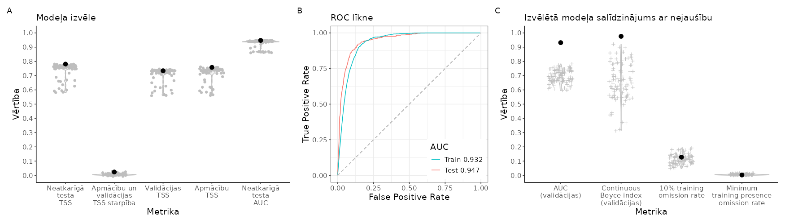
```

<br>

```{r SlieksniPASMON,echo=FALSE}
suppressPackageStartupMessages(library(kableExtra))
suppressPackageStartupMessages(library(tidyverse))
opts <- options(knitr.kable.NA = "")
slieksni=readxl::read_excel("./Papilddati/BestThresholds/BestThs_PASMON.xlsx")
tabula=kableExtra::kbl(slieksni, caption = 'Biežāk lietotie projicētās dzīvotņu piemērotības sliekšņa līmeņi un to izvērtējums', 
                    booktabs = TRUE, 
                    longtable = TRUE) 
tabula %>%
  kable_styling(latex_options = "scale_down") %>%
  scroll_box(width = "100%", box_css = "border: 0px;")
```


<br>


```{r HSprojPASMON, echo=FALSE, out.width = '100%', fig.cap='Labākā modeļa projekcija suga sdzīvotņu piemērotībai. Krāsu skala reprezentē cloglog vērtību no 0 līdz 1, kur starp galapunktiem esošā atzīme ir vienādas sensitivātes un specifiskuma treniņdatos slieksnis iepriekšējā tabulā (izvēlēts vizualizēšanas mērķiem un skaidrošanas ērtumam).'}
  knitr::include_graphics("./Atteli/Beigam_KarteNebal/BeiguKarteiNebal_PASMON.png")
```

<br>


[**Vēl nē:** Dzīvotņu piemērotība (GeoTIFF)]()

[**Vēl nē:** Par labāko atzītais modelis (krosvalidācijas; *.RDS)]()

[**Vēl nē:** Par labāko atzītais modelis (kombinēts; *.RDS)]()

[**Vēl nē:** Par labāko atzītais modelis (tikai ietekmīgās pazīmes; *.RDS)]()

[**Vēl nē:** Ekoģeogrāfisko mainīgo izvēles gaita, to VIF (savstarpējās prognozētspējas raksturojums) un ietekmes modelī (permutāciju procedūrā) raksturojums (*.xlsx)]()

**Attēls EGV marginālajām atbildēm**

<br>


### ANTPRA - pļavu čipste *Anthus pratensis* {#Chapter10.1.104}


```{r NovAtlaseANTPRA, echo=FALSE, out.width = '100%', fig.cap='Novērojumu atlases gaita un modelēšanā izmantojamie pļavu čipstes *Anthus pratensis* novērojumi un fona punkti: A - novērojumu saglabāšanās atlases gaitā; B - visu pieejamo novērojumu (solis 1) izvietojums; C - ar vismaz iespējamu ligzdošanu skaitītie novēorjumi, kas izturējuši līdz septītā soļa beigām (punkti ir unikālie 1 km kvadrāti, krusti ir unikālie 100 m kvadrāti); D - ar vismaz ticamu ligzdošanu skaitītie novēorjumi, kas izturējuši līdz septītā soļa beigām (punkti ir unikālie 1 km kvadrāti, krusti ir unikālie 100 m kvadrāti); E - ar pierādītu ligzdošanu skaitītie novēorjumi, kas izturējuši līdz septītā soļa beigām (punkti ir unikālie 1 km kvadrāti, krusti ir unikālie 100 m kvadrāti); F - modelēšanā izmantojamā apmācību kopa (punkti ir sugas klātbūtnes, krusti ir fona raksturošanai); G - modelēšanā izmantojamā neatkarīgās testēšanas kopa (punkti ir sugas klātbūtnes, krusti ir fona raksturošanai)'}

```


<br>


```{r ModelaRaksturojumsANTPRA, echo=FALSE, out.width = '100%', fig.cap='Labākā modeļa izvēle un uzvērtējums: A - labākā modeļa (ar treknu melnu punktu) salīdzinājums ar citiem pielāgotajiem modeļiem (pelēkie punkti un to sastopamības blīvuma funkcijas); B - labākā modeļa izvērtējums, to salīdzinot ar nejauši ģenerētiem nulles modeļiem (n=100) tajā pašā EGV, klātbūtnez un fona punktu veidotajā informācijas telpā.'}
knitr::include_graphics("./Atteli/Beigam_IzvelesAttels/IzvelesAttels_ANTPRA.png")
```

<br>

```{r SlieksniANTPRA,echo=FALSE}
suppressPackageStartupMessages(library(kableExtra))
suppressPackageStartupMessages(library(tidyverse))
opts <- options(knitr.kable.NA = "")
slieksni=readxl::read_excel("./Papilddati/BestThresholds/BestThs_ANTPRA.xlsx")
tabula=kableExtra::kbl(slieksni, caption = 'Biežāk lietotie projicētās dzīvotņu piemērotības sliekšņa līmeņi un to izvērtējums', 
                    booktabs = TRUE, 
                    longtable = TRUE) 
tabula %>%
  kable_styling(latex_options = "scale_down") %>%
  scroll_box(width = "100%", box_css = "border: 0px;")
```


<br>


```{r HSprojANTPRA, echo=FALSE, out.width = '100%', fig.cap='Labākā modeļa projekcija suga sdzīvotņu piemērotībai. Krāsu skala reprezentē cloglog vērtību no 0 līdz 1, kur starp galapunktiem esošā atzīme ir vienādas sensitivātes un specifiskuma treniņdatos slieksnis iepriekšējā tabulā (izvēlēts vizualizēšanas mērķiem un skaidrošanas ērtumam).'}
  knitr::include_graphics("./Atteli/Beigam_KarteNebal/BeiguKarteiNebal_ANTPRA.png")
```

<br>


[**Vēl nē:** Dzīvotņu piemērotība (GeoTIFF)]()

[**Vēl nē:** Par labāko atzītais modelis (krosvalidācijas; *.RDS)]()

[**Vēl nē:** Par labāko atzītais modelis (kombinēts; *.RDS)]()

[**Vēl nē:** Par labāko atzītais modelis (tikai ietekmīgās pazīmes; *.RDS)]()

[**Vēl nē:** Ekoģeogrāfisko mainīgo izvēles gaita, to VIF (savstarpējās prognozētspējas raksturojums) un ietekmes modelī (permutāciju procedūrā) raksturojums (*.xlsx)]()

**Attēls EGV marginālajām atbildēm**

<br>


### ANTCAM - stepes čipste *Anthus campestris* {#Chapter10.1.105}


```{r NovAtlaseANTCAM, echo=FALSE, out.width = '100%', fig.cap='Novērojumu atlases gaita un modelēšanā izmantojamie stepes čipstes *Anthus campestris* novērojumi un fona punkti: A - novērojumu saglabāšanās atlases gaitā; B - visu pieejamo novērojumu (solis 1) izvietojums; C - ar vismaz iespējamu ligzdošanu skaitītie novēorjumi, kas izturējuši līdz septītā soļa beigām (punkti ir unikālie 1 km kvadrāti, krusti ir unikālie 100 m kvadrāti); D - ar vismaz ticamu ligzdošanu skaitītie novēorjumi, kas izturējuši līdz septītā soļa beigām (punkti ir unikālie 1 km kvadrāti, krusti ir unikālie 100 m kvadrāti); E - ar pierādītu ligzdošanu skaitītie novēorjumi, kas izturējuši līdz septītā soļa beigām (punkti ir unikālie 1 km kvadrāti, krusti ir unikālie 100 m kvadrāti); F - modelēšanā izmantojamā apmācību kopa (punkti ir sugas klātbūtnes, krusti ir fona raksturošanai); G - modelēšanā izmantojamā neatkarīgās testēšanas kopa (punkti ir sugas klātbūtnes, krusti ir fona raksturošanai)'}
knitr::include_graphics("./Atteli/IzvelesAtteli/ObsSelection_ANTCAM.png")
```


<br>


```{r ModelaRaksturojumsANTCAM, echo=FALSE, out.width = '100%', fig.cap='Labākā modeļa izvēle un uzvērtējums: A - labākā modeļa (ar treknu melnu punktu) salīdzinājums ar citiem pielāgotajiem modeļiem (pelēkie punkti un to sastopamības blīvuma funkcijas); B - labākā modeļa izvērtējums, to salīdzinot ar nejauši ģenerētiem nulles modeļiem (n=100) tajā pašā EGV, klātbūtnez un fona punktu veidotajā informācijas telpā.'}
knitr::include_graphics("./Atteli/Beigam_IzvelesAttels/IzvelesAttels_ANTCAM.png")
```

<br>

```{r SlieksniANTCAM,echo=FALSE}
suppressPackageStartupMessages(library(kableExtra))
suppressPackageStartupMessages(library(tidyverse))
opts <- options(knitr.kable.NA = "")
slieksni=readxl::read_excel("./Papilddati/BestThresholds/BestThs_ANTCAM.xlsx")
tabula=kableExtra::kbl(slieksni, caption = 'Biežāk lietotie projicētās dzīvotņu piemērotības sliekšņa līmeņi un to izvērtējums', 
                    booktabs = TRUE, 
                    longtable = TRUE) 
tabula %>%
  kable_styling(latex_options = "scale_down") %>%
  scroll_box(width = "100%", box_css = "border: 0px;")
```


<br>


```{r HSprojANTCAM, echo=FALSE, out.width = '100%', fig.cap='Labākā modeļa projekcija suga sdzīvotņu piemērotībai. Krāsu skala reprezentē cloglog vērtību no 0 līdz 1, kur starp galapunktiem esošā atzīme ir vienādas sensitivātes un specifiskuma treniņdatos slieksnis iepriekšējā tabulā (izvēlēts vizualizēšanas mērķiem un skaidrošanas ērtumam).'}
  knitr::include_graphics("./Atteli/Beigam_KarteNebal/BeiguKarteiNebal_ANTCAM.png")
```

<br>


[**Vēl nē:** Dzīvotņu piemērotība (GeoTIFF)]()

[**Vēl nē:** Par labāko atzītais modelis (krosvalidācijas; *.RDS)]()

[**Vēl nē:** Par labāko atzītais modelis (kombinēts; *.RDS)]()

[**Vēl nē:** Par labāko atzītais modelis (tikai ietekmīgās pazīmes; *.RDS)]()

[**Vēl nē:** Ekoģeogrāfisko mainīgo izvēles gaita, to VIF (savstarpējās prognozētspējas raksturojums) un ietekmes modelī (permutāciju procedūrā) raksturojums (*.xlsx)]()

**Attēls EGV marginālajām atbildēm**

<br>


### MOTFLA - dzeltenā cielava *Motacilla flava* {#Chapter10.1.106}


```{r NovAtlaseMOTFLA, echo=FALSE, out.width = '100%', fig.cap='Novērojumu atlases gaita un modelēšanā izmantojamie dzeltenā cielavas *Motacilla flava* novērojumi un fona punkti: A - novērojumu saglabāšanās atlases gaitā; B - visu pieejamo novērojumu (solis 1) izvietojums; C - ar vismaz iespējamu ligzdošanu skaitītie novēorjumi, kas izturējuši līdz septītā soļa beigām (punkti ir unikālie 1 km kvadrāti, krusti ir unikālie 100 m kvadrāti); D - ar vismaz ticamu ligzdošanu skaitītie novēorjumi, kas izturējuši līdz septītā soļa beigām (punkti ir unikālie 1 km kvadrāti, krusti ir unikālie 100 m kvadrāti); E - ar pierādītu ligzdošanu skaitītie novēorjumi, kas izturējuši līdz septītā soļa beigām (punkti ir unikālie 1 km kvadrāti, krusti ir unikālie 100 m kvadrāti); F - modelēšanā izmantojamā apmācību kopa (punkti ir sugas klātbūtnes, krusti ir fona raksturošanai); G - modelēšanā izmantojamā neatkarīgās testēšanas kopa (punkti ir sugas klātbūtnes, krusti ir fona raksturošanai)'}
knitr::include_graphics("./Atteli/IzvelesAtteli/ObsSelection_MOTFLA.png")
```


<br>


```{r ModelaRaksturojumsMOTFLA, echo=FALSE, out.width = '100%', fig.cap='Labākā modeļa izvēle un uzvērtējums: A - labākā modeļa (ar treknu melnu punktu) salīdzinājums ar citiem pielāgotajiem modeļiem (pelēkie punkti un to sastopamības blīvuma funkcijas); B - labākā modeļa izvērtējums, to salīdzinot ar nejauši ģenerētiem nulles modeļiem (n=100) tajā pašā EGV, klātbūtnez un fona punktu veidotajā informācijas telpā.'}

```

<br>

```{r SlieksniMOTFLA,echo=FALSE}
suppressPackageStartupMessages(library(kableExtra))
suppressPackageStartupMessages(library(tidyverse))
opts <- options(knitr.kable.NA = "")
slieksni=readxl::read_excel("./Papilddati/BestThresholds/BestThs_MOTFLA.xlsx")
tabula=kableExtra::kbl(slieksni, caption = 'Biežāk lietotie projicētās dzīvotņu piemērotības sliekšņa līmeņi un to izvērtējums', 
                    booktabs = TRUE, 
                    longtable = TRUE) 
tabula %>%
  kable_styling(latex_options = "scale_down") %>%
  scroll_box(width = "100%", box_css = "border: 0px;")
```


<br>


```{r HSprojMOTFLA, echo=FALSE, out.width = '100%', fig.cap='Labākā modeļa projekcija suga sdzīvotņu piemērotībai. Krāsu skala reprezentē cloglog vērtību no 0 līdz 1, kur starp galapunktiem esošā atzīme ir vienādas sensitivātes un specifiskuma treniņdatos slieksnis iepriekšējā tabulā (izvēlēts vizualizēšanas mērķiem un skaidrošanas ērtumam).'}
  knitr::include_graphics("./Atteli/Beigam_KarteNebal/BeiguKarteiNebal_MOTFLA.png")
```

<br>


[**Vēl nē:** Dzīvotņu piemērotība (GeoTIFF)]()

[**Vēl nē:** Par labāko atzītais modelis (krosvalidācijas; *.RDS)]()

[**Vēl nē:** Par labāko atzītais modelis (kombinēts; *.RDS)]()

[**Vēl nē:** Par labāko atzītais modelis (tikai ietekmīgās pazīmes; *.RDS)]()

[**Vēl nē:** Ekoģeogrāfisko mainīgo izvēles gaita, to VIF (savstarpējās prognozētspējas raksturojums) un ietekmes modelī (permutāciju procedūrā) raksturojums (*.xlsx)]()

**Attēls EGV marginālajām atbildēm**

<br>


### MOTCIT - citroncielava *Motacilla citreola* {#Chapter10.1.107}


```{r NovAtlaseMOTCIT, echo=FALSE, out.width = '100%', fig.cap='Novērojumu atlases gaita un modelēšanā izmantojamie citroncielava *Motacilla citreola* novērojumi un fona punkti: A - novērojumu saglabāšanās atlases gaitā; B - visu pieejamo novērojumu (solis 1) izvietojums; C - ar vismaz iespējamu ligzdošanu skaitītie novēorjumi, kas izturējuši līdz septītā soļa beigām (punkti ir unikālie 1 km kvadrāti, krusti ir unikālie 100 m kvadrāti); D - ar vismaz ticamu ligzdošanu skaitītie novēorjumi, kas izturējuši līdz septītā soļa beigām (punkti ir unikālie 1 km kvadrāti, krusti ir unikālie 100 m kvadrāti); E - ar pierādītu ligzdošanu skaitītie novēorjumi, kas izturējuši līdz septītā soļa beigām (punkti ir unikālie 1 km kvadrāti, krusti ir unikālie 100 m kvadrāti); F - modelēšanā izmantojamā apmācību kopa (punkti ir sugas klātbūtnes, krusti ir fona raksturošanai); G - modelēšanā izmantojamā neatkarīgās testēšanas kopa (punkti ir sugas klātbūtnes, krusti ir fona raksturošanai)'}

```


<br>


```{r ModelaRaksturojumsMOTCIT, echo=FALSE, out.width = '100%', fig.cap='Labākā modeļa izvēle un uzvērtējums: A - labākā modeļa (ar treknu melnu punktu) salīdzinājums ar citiem pielāgotajiem modeļiem (pelēkie punkti un to sastopamības blīvuma funkcijas); B - labākā modeļa izvērtējums, to salīdzinot ar nejauši ģenerētiem nulles modeļiem (n=100) tajā pašā EGV, klātbūtnez un fona punktu veidotajā informācijas telpā.'}
knitr::include_graphics("./Atteli/Beigam_IzvelesAttels/IzvelesAttels_MOTCIT.png")
```

<br>

```{r SlieksniMOTCIT,echo=FALSE}
suppressPackageStartupMessages(library(kableExtra))
suppressPackageStartupMessages(library(tidyverse))
opts <- options(knitr.kable.NA = "")
slieksni=readxl::read_excel("./Papilddati/BestThresholds/BestThs_MOTCIT.xlsx")
tabula=kableExtra::kbl(slieksni, caption = 'Biežāk lietotie projicētās dzīvotņu piemērotības sliekšņa līmeņi un to izvērtējums', 
                    booktabs = TRUE, 
                    longtable = TRUE) 
tabula %>%
  kable_styling(latex_options = "scale_down") %>%
  scroll_box(width = "100%", box_css = "border: 0px;")
```


<br>


```{r HSprojMOTCIT, echo=FALSE, out.width = '100%', fig.cap='Labākā modeļa projekcija suga sdzīvotņu piemērotībai. Krāsu skala reprezentē cloglog vērtību no 0 līdz 1, kur starp galapunktiem esošā atzīme ir vienādas sensitivātes un specifiskuma treniņdatos slieksnis iepriekšējā tabulā (izvēlēts vizualizēšanas mērķiem un skaidrošanas ērtumam).'}
  knitr::include_graphics("./Atteli/Beigam_KarteNebal/BeiguKarteiNebal_MOTCIT.png")
```

<br>


[**Vēl nē:** Dzīvotņu piemērotība (GeoTIFF)]()

[**Vēl nē:** Par labāko atzītais modelis (krosvalidācijas; *.RDS)]()

[**Vēl nē:** Par labāko atzītais modelis (kombinēts; *.RDS)]()

[**Vēl nē:** Par labāko atzītais modelis (tikai ietekmīgās pazīmes; *.RDS)]()

[**Vēl nē:** Ekoģeogrāfisko mainīgo izvēles gaita, to VIF (savstarpējās prognozētspējas raksturojums) un ietekmes modelī (permutāciju procedūrā) raksturojums (*.xlsx)]()

**Attēls EGV marginālajām atbildēm**

<br>


### COCCOC - dižknābis *Coccothraustes coccothraustes* {#Chapter10.1.108}


```{r NovAtlaseCOCCOC, echo=FALSE, out.width = '100%', fig.cap='Novērojumu atlases gaita un modelēšanā izmantojamie dižknābja *Coccothraustes coccothraustes* novērojumi un fona punkti: A - novērojumu saglabāšanās atlases gaitā; B - visu pieejamo novērojumu (solis 1) izvietojums; C - ar vismaz iespējamu ligzdošanu skaitītie novēorjumi, kas izturējuši līdz septītā soļa beigām (punkti ir unikālie 1 km kvadrāti, krusti ir unikālie 100 m kvadrāti); D - ar vismaz ticamu ligzdošanu skaitītie novēorjumi, kas izturējuši līdz septītā soļa beigām (punkti ir unikālie 1 km kvadrāti, krusti ir unikālie 100 m kvadrāti); E - ar pierādītu ligzdošanu skaitītie novēorjumi, kas izturējuši līdz septītā soļa beigām (punkti ir unikālie 1 km kvadrāti, krusti ir unikālie 100 m kvadrāti); F - modelēšanā izmantojamā apmācību kopa (punkti ir sugas klātbūtnes, krusti ir fona raksturošanai); G - modelēšanā izmantojamā neatkarīgās testēšanas kopa (punkti ir sugas klātbūtnes, krusti ir fona raksturošanai)'}

```


<br>


```{r ModelaRaksturojumsCOCCOC, echo=FALSE, out.width = '100%', fig.cap='Labākā modeļa izvēle un uzvērtējums: A - labākā modeļa (ar treknu melnu punktu) salīdzinājums ar citiem pielāgotajiem modeļiem (pelēkie punkti un to sastopamības blīvuma funkcijas); B - labākā modeļa izvērtējums, to salīdzinot ar nejauši ģenerētiem nulles modeļiem (n=100) tajā pašā EGV, klātbūtnez un fona punktu veidotajā informācijas telpā.'}
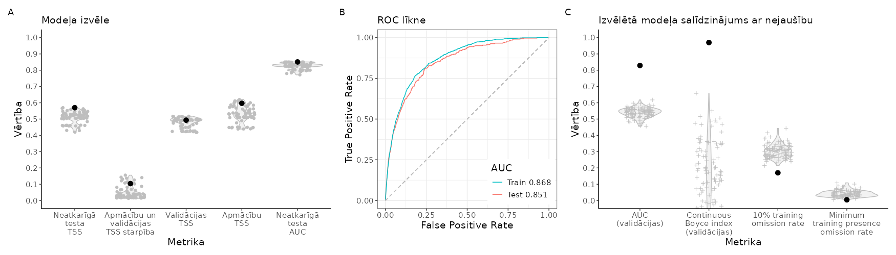
```

<br>

```{r SlieksniCOCCOC,echo=FALSE}
suppressPackageStartupMessages(library(kableExtra))
suppressPackageStartupMessages(library(tidyverse))
opts <- options(knitr.kable.NA = "")
slieksni=readxl::read_excel("./Papilddati/BestThresholds/BestThs_COCCOC.xlsx")
tabula=kableExtra::kbl(slieksni, caption = 'Biežāk lietotie projicētās dzīvotņu piemērotības sliekšņa līmeņi un to izvērtējums', 
                    booktabs = TRUE, 
                    longtable = TRUE) 
tabula %>%
  kable_styling(latex_options = "scale_down") %>%
  scroll_box(width = "100%", box_css = "border: 0px;")
```


<br>


```{r HSprojCOCCOC, echo=FALSE, out.width = '100%', fig.cap='Labākā modeļa projekcija suga sdzīvotņu piemērotībai. Krāsu skala reprezentē cloglog vērtību no 0 līdz 1, kur starp galapunktiem esošā atzīme ir vienādas sensitivātes un specifiskuma treniņdatos slieksnis iepriekšējā tabulā (izvēlēts vizualizēšanas mērķiem un skaidrošanas ērtumam).'}
  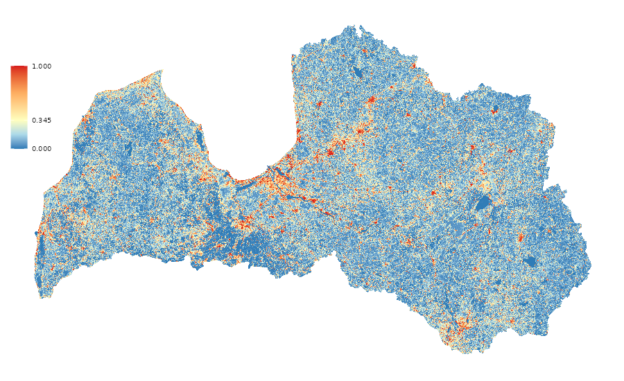
```

<br>


[**Vēl nē:** Dzīvotņu piemērotība (GeoTIFF)]()

[**Vēl nē:** Par labāko atzītais modelis (krosvalidācijas; *.RDS)]()

[**Vēl nē:** Par labāko atzītais modelis (kombinēts; *.RDS)]()

[**Vēl nē:** Par labāko atzītais modelis (tikai ietekmīgās pazīmes; *.RDS)]()

[**Vēl nē:** Ekoģeogrāfisko mainīgo izvēles gaita, to VIF (savstarpējās prognozētspējas raksturojums) un ietekmes modelī (permutāciju procedūrā) raksturojums (*.xlsx)]()

**Attēls EGV marginālajām atbildēm**

<br>


### CARERY - mazais svilpis *Carpodacus erythrinus* {#Chapter10.1.109}


```{r NovAtlaseCARERY, echo=FALSE, out.width = '100%', fig.cap='Novērojumu atlases gaita un modelēšanā izmantojamie mazā svilpja *Carpodacus erythrinus* novērojumi un fona punkti: A - novērojumu saglabāšanās atlases gaitā; B - visu pieejamo novērojumu (solis 1) izvietojums; C - ar vismaz iespējamu ligzdošanu skaitītie novēorjumi, kas izturējuši līdz septītā soļa beigām (punkti ir unikālie 1 km kvadrāti, krusti ir unikālie 100 m kvadrāti); D - ar vismaz ticamu ligzdošanu skaitītie novēorjumi, kas izturējuši līdz septītā soļa beigām (punkti ir unikālie 1 km kvadrāti, krusti ir unikālie 100 m kvadrāti); E - ar pierādītu ligzdošanu skaitītie novēorjumi, kas izturējuši līdz septītā soļa beigām (punkti ir unikālie 1 km kvadrāti, krusti ir unikālie 100 m kvadrāti); F - modelēšanā izmantojamā apmācību kopa (punkti ir sugas klātbūtnes, krusti ir fona raksturošanai); G - modelēšanā izmantojamā neatkarīgās testēšanas kopa (punkti ir sugas klātbūtnes, krusti ir fona raksturošanai)'}
knitr::include_graphics("./Atteli/IzvelesAtteli/ObsSelection_CARERY.png")
```


<br>


```{r ModelaRaksturojumsCARERY, echo=FALSE, out.width = '100%', fig.cap='Labākā modeļa izvēle un uzvērtējums: A - labākā modeļa (ar treknu melnu punktu) salīdzinājums ar citiem pielāgotajiem modeļiem (pelēkie punkti un to sastopamības blīvuma funkcijas); B - labākā modeļa izvērtējums, to salīdzinot ar nejauši ģenerētiem nulles modeļiem (n=100) tajā pašā EGV, klātbūtnez un fona punktu veidotajā informācijas telpā.'}
knitr::include_graphics("./Atteli/Beigam_IzvelesAttels/IzvelesAttels_CARERY.png")
```

<br>

```{r SlieksniCARERY,echo=FALSE}
suppressPackageStartupMessages(library(kableExtra))
suppressPackageStartupMessages(library(tidyverse))
opts <- options(knitr.kable.NA = "")
slieksni=readxl::read_excel("./Papilddati/BestThresholds/BestThs_CARERY.xlsx")
tabula=kableExtra::kbl(slieksni, caption = 'Biežāk lietotie projicētās dzīvotņu piemērotības sliekšņa līmeņi un to izvērtējums', 
                    booktabs = TRUE, 
                    longtable = TRUE) 
tabula %>%
  kable_styling(latex_options = "scale_down") %>%
  scroll_box(width = "100%", box_css = "border: 0px;")
```


<br>


```{r HSprojCARERY, echo=FALSE, out.width = '100%', fig.cap='Labākā modeļa projekcija suga sdzīvotņu piemērotībai. Krāsu skala reprezentē cloglog vērtību no 0 līdz 1, kur starp galapunktiem esošā atzīme ir vienādas sensitivātes un specifiskuma treniņdatos slieksnis iepriekšējā tabulā (izvēlēts vizualizēšanas mērķiem un skaidrošanas ērtumam).'}
  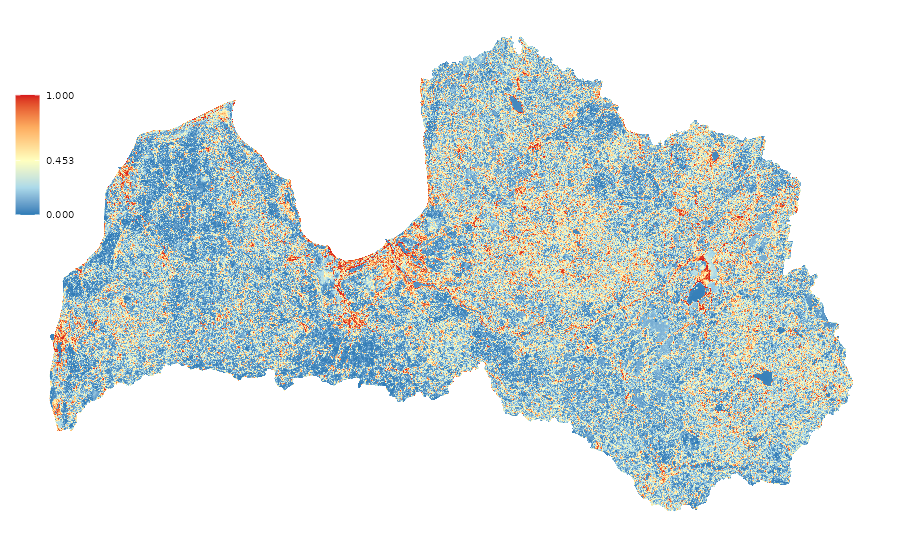
```

<br>


[**Vēl nē:** Dzīvotņu piemērotība (GeoTIFF)]()

[**Vēl nē:** Par labāko atzītais modelis (krosvalidācijas; *.RDS)]()

[**Vēl nē:** Par labāko atzītais modelis (kombinēts; *.RDS)]()

[**Vēl nē:** Par labāko atzītais modelis (tikai ietekmīgās pazīmes; *.RDS)]()

[**Vēl nē:** Ekoģeogrāfisko mainīgo izvēles gaita, to VIF (savstarpējās prognozētspējas raksturojums) un ietekmes modelī (permutāciju procedūrā) raksturojums (*.xlsx)]()

**Attēls EGV marginālajām atbildēm**

<br>


### PYRPYR - svilpis *Pyrrhula pyrrhula* {#Chapter10.1.110}


```{r NovAtlasePYRPYR, echo=FALSE, out.width = '100%', fig.cap='Novērojumu atlases gaita un modelēšanā izmantojamie svilpja *Pyrrhula pyrrhula* novērojumi un fona punkti: A - novērojumu saglabāšanās atlases gaitā; B - visu pieejamo novērojumu (solis 1) izvietojums; C - ar vismaz iespējamu ligzdošanu skaitītie novēorjumi, kas izturējuši līdz septītā soļa beigām (punkti ir unikālie 1 km kvadrāti, krusti ir unikālie 100 m kvadrāti); D - ar vismaz ticamu ligzdošanu skaitītie novēorjumi, kas izturējuši līdz septītā soļa beigām (punkti ir unikālie 1 km kvadrāti, krusti ir unikālie 100 m kvadrāti); E - ar pierādītu ligzdošanu skaitītie novēorjumi, kas izturējuši līdz septītā soļa beigām (punkti ir unikālie 1 km kvadrāti, krusti ir unikālie 100 m kvadrāti); F - modelēšanā izmantojamā apmācību kopa (punkti ir sugas klātbūtnes, krusti ir fona raksturošanai); G - modelēšanā izmantojamā neatkarīgās testēšanas kopa (punkti ir sugas klātbūtnes, krusti ir fona raksturošanai)'}

```


<br>


```{r ModelaRaksturojumsPYRPYR, echo=FALSE, out.width = '100%', fig.cap='Labākā modeļa izvēle un uzvērtējums: A - labākā modeļa (ar treknu melnu punktu) salīdzinājums ar citiem pielāgotajiem modeļiem (pelēkie punkti un to sastopamības blīvuma funkcijas); B - labākā modeļa izvērtējums, to salīdzinot ar nejauši ģenerētiem nulles modeļiem (n=100) tajā pašā EGV, klātbūtnez un fona punktu veidotajā informācijas telpā.'}
knitr::include_graphics("./Atteli/Beigam_IzvelesAttels/IzvelesAttels_PYRPYR.png")
```

<br>

```{r SlieksniPYRPYR,echo=FALSE}
suppressPackageStartupMessages(library(kableExtra))
suppressPackageStartupMessages(library(tidyverse))
opts <- options(knitr.kable.NA = "")
slieksni=readxl::read_excel("./Papilddati/BestThresholds/BestThs_PYRPYR.xlsx")
tabula=kableExtra::kbl(slieksni, caption = 'Biežāk lietotie projicētās dzīvotņu piemērotības sliekšņa līmeņi un to izvērtējums', 
                    booktabs = TRUE, 
                    longtable = TRUE) 
tabula %>%
  kable_styling(latex_options = "scale_down") %>%
  scroll_box(width = "100%", box_css = "border: 0px;")
```


<br>


```{r HSprojPYRPYR, echo=FALSE, out.width = '100%', fig.cap='Labākā modeļa projekcija suga sdzīvotņu piemērotībai. Krāsu skala reprezentē cloglog vērtību no 0 līdz 1, kur starp galapunktiem esošā atzīme ir vienādas sensitivātes un specifiskuma treniņdatos slieksnis iepriekšējā tabulā (izvēlēts vizualizēšanas mērķiem un skaidrošanas ērtumam).'}
  knitr::include_graphics("./Atteli/Beigam_KarteNebal/BeiguKarteiNebal_PYRPYR.png")
```

<br>


[**Vēl nē:** Dzīvotņu piemērotība (GeoTIFF)]()

[**Vēl nē:** Par labāko atzītais modelis (krosvalidācijas; *.RDS)]()

[**Vēl nē:** Par labāko atzītais modelis (kombinēts; *.RDS)]()

[**Vēl nē:** Par labāko atzītais modelis (tikai ietekmīgās pazīmes; *.RDS)]()

[**Vēl nē:** Ekoģeogrāfisko mainīgo izvēles gaita, to VIF (savstarpējās prognozētspējas raksturojums) un ietekmes modelī (permutāciju procedūrā) raksturojums (*.xlsx)]()

**Attēls EGV marginālajām atbildēm**

<br>


### CHLCHL - zaļžubīte *Chloris chloris* {#Chapter10.1.111}


```{r NovAtlaseCHLCHL, echo=FALSE, out.width = '100%', fig.cap='Novērojumu atlases gaita un modelēšanā izmantojamie zaļžubītes *Chloris chloris* novērojumi un fona punkti: A - novērojumu saglabāšanās atlases gaitā; B - visu pieejamo novērojumu (solis 1) izvietojums; C - ar vismaz iespējamu ligzdošanu skaitītie novēorjumi, kas izturējuši līdz septītā soļa beigām (punkti ir unikālie 1 km kvadrāti, krusti ir unikālie 100 m kvadrāti); D - ar vismaz ticamu ligzdošanu skaitītie novēorjumi, kas izturējuši līdz septītā soļa beigām (punkti ir unikālie 1 km kvadrāti, krusti ir unikālie 100 m kvadrāti); E - ar pierādītu ligzdošanu skaitītie novēorjumi, kas izturējuši līdz septītā soļa beigām (punkti ir unikālie 1 km kvadrāti, krusti ir unikālie 100 m kvadrāti); F - modelēšanā izmantojamā apmācību kopa (punkti ir sugas klātbūtnes, krusti ir fona raksturošanai); G - modelēšanā izmantojamā neatkarīgās testēšanas kopa (punkti ir sugas klātbūtnes, krusti ir fona raksturošanai)'}
knitr::include_graphics("./Atteli/IzvelesAtteli/ObsSelection_CHLCHL.png")
```


<br>


```{r ModelaRaksturojumsCHLCHL, echo=FALSE, out.width = '100%', fig.cap='Labākā modeļa izvēle un uzvērtējums: A - labākā modeļa (ar treknu melnu punktu) salīdzinājums ar citiem pielāgotajiem modeļiem (pelēkie punkti un to sastopamības blīvuma funkcijas); B - labākā modeļa izvērtējums, to salīdzinot ar nejauši ģenerētiem nulles modeļiem (n=100) tajā pašā EGV, klātbūtnez un fona punktu veidotajā informācijas telpā.'}

```

<br>

```{r SlieksniCHLCHL,echo=FALSE}
suppressPackageStartupMessages(library(kableExtra))
suppressPackageStartupMessages(library(tidyverse))
opts <- options(knitr.kable.NA = "")
slieksni=readxl::read_excel("./Papilddati/BestThresholds/BestThs_CHLCHL.xlsx")
tabula=kableExtra::kbl(slieksni, caption = 'Biežāk lietotie projicētās dzīvotņu piemērotības sliekšņa līmeņi un to izvērtējums', 
                    booktabs = TRUE, 
                    longtable = TRUE) 
tabula %>%
  kable_styling(latex_options = "scale_down") %>%
  scroll_box(width = "100%", box_css = "border: 0px;")
```


<br>


```{r HSprojCHLCHL, echo=FALSE, out.width = '100%', fig.cap='Labākā modeļa projekcija suga sdzīvotņu piemērotībai. Krāsu skala reprezentē cloglog vērtību no 0 līdz 1, kur starp galapunktiem esošā atzīme ir vienādas sensitivātes un specifiskuma treniņdatos slieksnis iepriekšējā tabulā (izvēlēts vizualizēšanas mērķiem un skaidrošanas ērtumam).'}
  knitr::include_graphics("./Atteli/Beigam_KarteNebal/BeiguKarteiNebal_CHLCHL.png")
```

<br>


[**Vēl nē:** Dzīvotņu piemērotība (GeoTIFF)]()

[**Vēl nē:** Par labāko atzītais modelis (krosvalidācijas; *.RDS)]()

[**Vēl nē:** Par labāko atzītais modelis (kombinēts; *.RDS)]()

[**Vēl nē:** Par labāko atzītais modelis (tikai ietekmīgās pazīmes; *.RDS)]()

[**Vēl nē:** Ekoģeogrāfisko mainīgo izvēles gaita, to VIF (savstarpējās prognozētspējas raksturojums) un ietekmes modelī (permutāciju procedūrā) raksturojums (*.xlsx)]()

**Attēls EGV marginālajām atbildēm**

<br>


### LINCAN - kaņepītis *Linaria cannabina* {#Chapter10.1.112}


```{r NovAtlaseLINCAN, echo=FALSE, out.width = '100%', fig.cap='Novērojumu atlases gaita un modelēšanā izmantojamie kaņepīša *Linaria cannabina* novērojumi un fona punkti: A - novērojumu saglabāšanās atlases gaitā; B - visu pieejamo novērojumu (solis 1) izvietojums; C - ar vismaz iespējamu ligzdošanu skaitītie novēorjumi, kas izturējuši līdz septītā soļa beigām (punkti ir unikālie 1 km kvadrāti, krusti ir unikālie 100 m kvadrāti); D - ar vismaz ticamu ligzdošanu skaitītie novēorjumi, kas izturējuši līdz septītā soļa beigām (punkti ir unikālie 1 km kvadrāti, krusti ir unikālie 100 m kvadrāti); E - ar pierādītu ligzdošanu skaitītie novēorjumi, kas izturējuši līdz septītā soļa beigām (punkti ir unikālie 1 km kvadrāti, krusti ir unikālie 100 m kvadrāti); F - modelēšanā izmantojamā apmācību kopa (punkti ir sugas klātbūtnes, krusti ir fona raksturošanai); G - modelēšanā izmantojamā neatkarīgās testēšanas kopa (punkti ir sugas klātbūtnes, krusti ir fona raksturošanai)'}
knitr::include_graphics("./Atteli/IzvelesAtteli/ObsSelection_LINCAN.png")
```


<br>


```{r ModelaRaksturojumsLINCAN, echo=FALSE, out.width = '100%', fig.cap='Labākā modeļa izvēle un uzvērtējums: A - labākā modeļa (ar treknu melnu punktu) salīdzinājums ar citiem pielāgotajiem modeļiem (pelēkie punkti un to sastopamības blīvuma funkcijas); B - labākā modeļa izvērtējums, to salīdzinot ar nejauši ģenerētiem nulles modeļiem (n=100) tajā pašā EGV, klātbūtnez un fona punktu veidotajā informācijas telpā.'}
knitr::include_graphics("./Atteli/Beigam_IzvelesAttels/IzvelesAttels_LINCAN.png")
```

<br>

```{r SlieksniLINCAN,echo=FALSE}
suppressPackageStartupMessages(library(kableExtra))
suppressPackageStartupMessages(library(tidyverse))
opts <- options(knitr.kable.NA = "")
slieksni=readxl::read_excel("./Papilddati/BestThresholds/BestThs_LINCAN.xlsx")
tabula=kableExtra::kbl(slieksni, caption = 'Biežāk lietotie projicētās dzīvotņu piemērotības sliekšņa līmeņi un to izvērtējums', 
                    booktabs = TRUE, 
                    longtable = TRUE) 
tabula %>%
  kable_styling(latex_options = "scale_down") %>%
  scroll_box(width = "100%", box_css = "border: 0px;")
```


<br>


```{r HSprojLINCAN, echo=FALSE, out.width = '100%', fig.cap='Labākā modeļa projekcija suga sdzīvotņu piemērotībai. Krāsu skala reprezentē cloglog vērtību no 0 līdz 1, kur starp galapunktiem esošā atzīme ir vienādas sensitivātes un specifiskuma treniņdatos slieksnis iepriekšējā tabulā (izvēlēts vizualizēšanas mērķiem un skaidrošanas ērtumam).'}
  
```

<br>


[**Vēl nē:** Dzīvotņu piemērotība (GeoTIFF)]()

[**Vēl nē:** Par labāko atzītais modelis (krosvalidācijas; *.RDS)]()

[**Vēl nē:** Par labāko atzītais modelis (kombinēts; *.RDS)]()

[**Vēl nē:** Par labāko atzītais modelis (tikai ietekmīgās pazīmes; *.RDS)]()

[**Vēl nē:** Ekoģeogrāfisko mainīgo izvēles gaita, to VIF (savstarpējās prognozētspējas raksturojums) un ietekmes modelī (permutāciju procedūrā) raksturojums (*.xlsx)]()

**Attēls EGV marginālajām atbildēm**

<br>


### LOXCUR - egļu krustknābis *Loxia curvirostra* {#Chapter10.1.113}


```{r NovAtlaseLOXCUR, echo=FALSE, out.width = '100%', fig.cap='Novērojumu atlases gaita un modelēšanā izmantojamie egļu krustknābja *Loxia curvirostra* novērojumi un fona punkti: A - novērojumu saglabāšanās atlases gaitā; B - visu pieejamo novērojumu (solis 1) izvietojums; C - ar vismaz iespējamu ligzdošanu skaitītie novēorjumi, kas izturējuši līdz septītā soļa beigām (punkti ir unikālie 1 km kvadrāti, krusti ir unikālie 100 m kvadrāti); D - ar vismaz ticamu ligzdošanu skaitītie novēorjumi, kas izturējuši līdz septītā soļa beigām (punkti ir unikālie 1 km kvadrāti, krusti ir unikālie 100 m kvadrāti); E - ar pierādītu ligzdošanu skaitītie novēorjumi, kas izturējuši līdz septītā soļa beigām (punkti ir unikālie 1 km kvadrāti, krusti ir unikālie 100 m kvadrāti); F - modelēšanā izmantojamā apmācību kopa (punkti ir sugas klātbūtnes, krusti ir fona raksturošanai); G - modelēšanā izmantojamā neatkarīgās testēšanas kopa (punkti ir sugas klātbūtnes, krusti ir fona raksturošanai)'}
knitr::include_graphics("./Atteli/IzvelesAtteli/ObsSelection_LOXCUR.png")
```


<br>


```{r ModelaRaksturojumsLOXCUR, echo=FALSE, out.width = '100%', fig.cap='Labākā modeļa izvēle un uzvērtējums: A - labākā modeļa (ar treknu melnu punktu) salīdzinājums ar citiem pielāgotajiem modeļiem (pelēkie punkti un to sastopamības blīvuma funkcijas); B - labākā modeļa izvērtējums, to salīdzinot ar nejauši ģenerētiem nulles modeļiem (n=100) tajā pašā EGV, klātbūtnez un fona punktu veidotajā informācijas telpā.'}
knitr::include_graphics("./Atteli/Beigam_IzvelesAttels/IzvelesAttels_LOXCUR.png")
```

<br>

```{r SlieksniLOXCUR,echo=FALSE}
suppressPackageStartupMessages(library(kableExtra))
suppressPackageStartupMessages(library(tidyverse))
opts <- options(knitr.kable.NA = "")
slieksni=readxl::read_excel("./Papilddati/BestThresholds/BestThs_LOXCUR.xlsx")
tabula=kableExtra::kbl(slieksni, caption = 'Biežāk lietotie projicētās dzīvotņu piemērotības sliekšņa līmeņi un to izvērtējums', 
                    booktabs = TRUE, 
                    longtable = TRUE) 
tabula %>%
  kable_styling(latex_options = "scale_down") %>%
  scroll_box(width = "100%", box_css = "border: 0px;")
```


<br>


```{r HSprojLOXCUR, echo=FALSE, out.width = '100%', fig.cap='Labākā modeļa projekcija suga sdzīvotņu piemērotībai. Krāsu skala reprezentē cloglog vērtību no 0 līdz 1, kur starp galapunktiem esošā atzīme ir vienādas sensitivātes un specifiskuma treniņdatos slieksnis iepriekšējā tabulā (izvēlēts vizualizēšanas mērķiem un skaidrošanas ērtumam).'}
  
```

<br>


[**Vēl nē:** Dzīvotņu piemērotība (GeoTIFF)]()

[**Vēl nē:** Par labāko atzītais modelis (krosvalidācijas; *.RDS)]()

[**Vēl nē:** Par labāko atzītais modelis (kombinēts; *.RDS)]()

[**Vēl nē:** Par labāko atzītais modelis (tikai ietekmīgās pazīmes; *.RDS)]()

[**Vēl nē:** Ekoģeogrāfisko mainīgo izvēles gaita, to VIF (savstarpējās prognozētspējas raksturojums) un ietekmes modelī (permutāciju procedūrā) raksturojums (*.xlsx)]()

**Attēls EGV marginālajām atbildēm**

<br>


### CARCAR - dadzītis *Carduelis carduelis* {#Chapter10.1.114}


```{r NovAtlaseCARCAR, echo=FALSE, out.width = '100%', fig.cap='Novērojumu atlases gaita un modelēšanā izmantojamie dadzīša *Carduelis carduelis* novērojumi un fona punkti: A - novērojumu saglabāšanās atlases gaitā; B - visu pieejamo novērojumu (solis 1) izvietojums; C - ar vismaz iespējamu ligzdošanu skaitītie novēorjumi, kas izturējuši līdz septītā soļa beigām (punkti ir unikālie 1 km kvadrāti, krusti ir unikālie 100 m kvadrāti); D - ar vismaz ticamu ligzdošanu skaitītie novēorjumi, kas izturējuši līdz septītā soļa beigām (punkti ir unikālie 1 km kvadrāti, krusti ir unikālie 100 m kvadrāti); E - ar pierādītu ligzdošanu skaitītie novēorjumi, kas izturējuši līdz septītā soļa beigām (punkti ir unikālie 1 km kvadrāti, krusti ir unikālie 100 m kvadrāti); F - modelēšanā izmantojamā apmācību kopa (punkti ir sugas klātbūtnes, krusti ir fona raksturošanai); G - modelēšanā izmantojamā neatkarīgās testēšanas kopa (punkti ir sugas klātbūtnes, krusti ir fona raksturošanai)'}
knitr::include_graphics("./Atteli/IzvelesAtteli/ObsSelection_CARCAR.png")
```


<br>


```{r ModelaRaksturojumsCARCAR, echo=FALSE, out.width = '100%', fig.cap='Labākā modeļa izvēle un uzvērtējums: A - labākā modeļa (ar treknu melnu punktu) salīdzinājums ar citiem pielāgotajiem modeļiem (pelēkie punkti un to sastopamības blīvuma funkcijas); B - labākā modeļa izvērtējums, to salīdzinot ar nejauši ģenerētiem nulles modeļiem (n=100) tajā pašā EGV, klātbūtnez un fona punktu veidotajā informācijas telpā.'}

```

<br>

```{r SlieksniCARCAR,echo=FALSE}
suppressPackageStartupMessages(library(kableExtra))
suppressPackageStartupMessages(library(tidyverse))
opts <- options(knitr.kable.NA = "")
slieksni=readxl::read_excel("./Papilddati/BestThresholds/BestThs_CARCAR.xlsx")
tabula=kableExtra::kbl(slieksni, caption = 'Biežāk lietotie projicētās dzīvotņu piemērotības sliekšņa līmeņi un to izvērtējums', 
                    booktabs = TRUE, 
                    longtable = TRUE) 
tabula %>%
  kable_styling(latex_options = "scale_down") %>%
  scroll_box(width = "100%", box_css = "border: 0px;")
```


<br>


```{r HSprojCARCAR, echo=FALSE, out.width = '100%', fig.cap='Labākā modeļa projekcija suga sdzīvotņu piemērotībai. Krāsu skala reprezentē cloglog vērtību no 0 līdz 1, kur starp galapunktiem esošā atzīme ir vienādas sensitivātes un specifiskuma treniņdatos slieksnis iepriekšējā tabulā (izvēlēts vizualizēšanas mērķiem un skaidrošanas ērtumam).'}
  
```

<br>


[**Vēl nē:** Dzīvotņu piemērotība (GeoTIFF)]()

[**Vēl nē:** Par labāko atzītais modelis (krosvalidācijas; *.RDS)]()

[**Vēl nē:** Par labāko atzītais modelis (kombinēts; *.RDS)]()

[**Vēl nē:** Par labāko atzītais modelis (tikai ietekmīgās pazīmes; *.RDS)]()

[**Vēl nē:** Ekoģeogrāfisko mainīgo izvēles gaita, to VIF (savstarpējās prognozētspējas raksturojums) un ietekmes modelī (permutāciju procedūrā) raksturojums (*.xlsx)]()

**Attēls EGV marginālajām atbildēm**

<br>


### EMBHOR - dārza stērste *Emberiza hortulana* {#Chapter10.1.115}


```{r NovAtlaseEMBHOR, echo=FALSE, out.width = '100%', fig.cap='Novērojumu atlases gaita un modelēšanā izmantojamie dārza stērstes *Emberiza hortulana* novērojumi un fona punkti: A - novērojumu saglabāšanās atlases gaitā; B - visu pieejamo novērojumu (solis 1) izvietojums; C - ar vismaz iespējamu ligzdošanu skaitītie novēorjumi, kas izturējuši līdz septītā soļa beigām (punkti ir unikālie 1 km kvadrāti, krusti ir unikālie 100 m kvadrāti); D - ar vismaz ticamu ligzdošanu skaitītie novēorjumi, kas izturējuši līdz septītā soļa beigām (punkti ir unikālie 1 km kvadrāti, krusti ir unikālie 100 m kvadrāti); E - ar pierādītu ligzdošanu skaitītie novēorjumi, kas izturējuši līdz septītā soļa beigām (punkti ir unikālie 1 km kvadrāti, krusti ir unikālie 100 m kvadrāti); F - modelēšanā izmantojamā apmācību kopa (punkti ir sugas klātbūtnes, krusti ir fona raksturošanai); G - modelēšanā izmantojamā neatkarīgās testēšanas kopa (punkti ir sugas klātbūtnes, krusti ir fona raksturošanai)'}
knitr::include_graphics("./Atteli/IzvelesAtteli/ObsSelection_EMBHOR.png")
```


<br>


```{r ModelaRaksturojumsEMBHOR, echo=FALSE, out.width = '100%', fig.cap='Labākā modeļa izvēle un uzvērtējums: A - labākā modeļa (ar treknu melnu punktu) salīdzinājums ar citiem pielāgotajiem modeļiem (pelēkie punkti un to sastopamības blīvuma funkcijas); B - labākā modeļa izvērtējums, to salīdzinot ar nejauši ģenerētiem nulles modeļiem (n=100) tajā pašā EGV, klātbūtnez un fona punktu veidotajā informācijas telpā.'}
knitr::include_graphics("./Atteli/Beigam_IzvelesAttels/IzvelesAttels_EMBHOR.png")
```

<br>

```{r SlieksniEMBHOR,echo=FALSE}
suppressPackageStartupMessages(library(kableExtra))
suppressPackageStartupMessages(library(tidyverse))
opts <- options(knitr.kable.NA = "")
slieksni=readxl::read_excel("./Papilddati/BestThresholds/BestThs_EMBHOR.xlsx")
tabula=kableExtra::kbl(slieksni, caption = 'Biežāk lietotie projicētās dzīvotņu piemērotības sliekšņa līmeņi un to izvērtējums', 
                    booktabs = TRUE, 
                    longtable = TRUE) 
tabula %>%
  kable_styling(latex_options = "scale_down") %>%
  scroll_box(width = "100%", box_css = "border: 0px;")
```


<br>


```{r HSprojEMBHOR, echo=FALSE, out.width = '100%', fig.cap='Labākā modeļa projekcija suga sdzīvotņu piemērotībai. Krāsu skala reprezentē cloglog vērtību no 0 līdz 1, kur starp galapunktiem esošā atzīme ir vienādas sensitivātes un specifiskuma treniņdatos slieksnis iepriekšējā tabulā (izvēlēts vizualizēšanas mērķiem un skaidrošanas ērtumam).'}
  knitr::include_graphics("./Atteli/Beigam_KarteNebal/BeiguKarteiNebal_EMBHOR.png")
```

<br>


[**Vēl nē:** Dzīvotņu piemērotība (GeoTIFF)]()

[**Vēl nē:** Par labāko atzītais modelis (krosvalidācijas; *.RDS)]()

[**Vēl nē:** Par labāko atzītais modelis (kombinēts; *.RDS)]()

[**Vēl nē:** Par labāko atzītais modelis (tikai ietekmīgās pazīmes; *.RDS)]()

[**Vēl nē:** Ekoģeogrāfisko mainīgo izvēles gaita, to VIF (savstarpējās prognozētspējas raksturojums) un ietekmes modelī (permutāciju procedūrā) raksturojums (*.xlsx)]()

**Attēls EGV marginālajām atbildēm**

<br>


### EMBCIT - dzeltenā stērste *Emberiza citrinella* {#Chapter10.1.116}


```{r NovAtlaseEMBCIT, echo=FALSE, out.width = '100%', fig.cap='Novērojumu atlases gaita un modelēšanā izmantojamie dzeltenās stērstes *Emberiza citrinella* novērojumi un fona punkti: A - novērojumu saglabāšanās atlases gaitā; B - visu pieejamo novērojumu (solis 1) izvietojums; C - ar vismaz iespējamu ligzdošanu skaitītie novēorjumi, kas izturējuši līdz septītā soļa beigām (punkti ir unikālie 1 km kvadrāti, krusti ir unikālie 100 m kvadrāti); D - ar vismaz ticamu ligzdošanu skaitītie novēorjumi, kas izturējuši līdz septītā soļa beigām (punkti ir unikālie 1 km kvadrāti, krusti ir unikālie 100 m kvadrāti); E - ar pierādītu ligzdošanu skaitītie novēorjumi, kas izturējuši līdz septītā soļa beigām (punkti ir unikālie 1 km kvadrāti, krusti ir unikālie 100 m kvadrāti); F - modelēšanā izmantojamā apmācību kopa (punkti ir sugas klātbūtnes, krusti ir fona raksturošanai); G - modelēšanā izmantojamā neatkarīgās testēšanas kopa (punkti ir sugas klātbūtnes, krusti ir fona raksturošanai)'}

```


<br>


```{r ModelaRaksturojumsEMBCIT, echo=FALSE, out.width = '100%', fig.cap='Labākā modeļa izvēle un uzvērtējums: A - labākā modeļa (ar treknu melnu punktu) salīdzinājums ar citiem pielāgotajiem modeļiem (pelēkie punkti un to sastopamības blīvuma funkcijas); B - labākā modeļa izvērtējums, to salīdzinot ar nejauši ģenerētiem nulles modeļiem (n=100) tajā pašā EGV, klātbūtnez un fona punktu veidotajā informācijas telpā.'}
knitr::include_graphics("./Atteli/Beigam_IzvelesAttels/IzvelesAttels_EMBCIT.png")
```

<br>

```{r SlieksniEMBCIT,echo=FALSE}
suppressPackageStartupMessages(library(kableExtra))
suppressPackageStartupMessages(library(tidyverse))
opts <- options(knitr.kable.NA = "")
slieksni=readxl::read_excel("./Papilddati/BestThresholds/BestThs_EMBCIT.xlsx")
tabula=kableExtra::kbl(slieksni, caption = 'Biežāk lietotie projicētās dzīvotņu piemērotības sliekšņa līmeņi un to izvērtējums', 
                    booktabs = TRUE, 
                    longtable = TRUE) 
tabula %>%
  kable_styling(latex_options = "scale_down") %>%
  scroll_box(width = "100%", box_css = "border: 0px;")
```


<br>


```{r HSprojEMBCIT, echo=FALSE, out.width = '100%', fig.cap='Labākā modeļa projekcija suga sdzīvotņu piemērotībai. Krāsu skala reprezentē cloglog vērtību no 0 līdz 1, kur starp galapunktiem esošā atzīme ir vienādas sensitivātes un specifiskuma treniņdatos slieksnis iepriekšējā tabulā (izvēlēts vizualizēšanas mērķiem un skaidrošanas ērtumam).'}
  knitr::include_graphics("./Atteli/Beigam_KarteNebal/BeiguKarteiNebal_EMBCIT.png")
```

<br>


[**Vēl nē:** Dzīvotņu piemērotība (GeoTIFF)]()

[**Vēl nē:** Par labāko atzītais modelis (krosvalidācijas; *.RDS)]()

[**Vēl nē:** Par labāko atzītais modelis (kombinēts; *.RDS)]()

[**Vēl nē:** Par labāko atzītais modelis (tikai ietekmīgās pazīmes; *.RDS)]()

[**Vēl nē:** Ekoģeogrāfisko mainīgo izvēles gaita, to VIF (savstarpējās prognozētspējas raksturojums) un ietekmes modelī (permutāciju procedūrā) raksturojums (*.xlsx)]()

**Attēls EGV marginālajām atbildēm**

<br>


## Kopējie valsts līmeņa rezultāti {#Chapter10.2}

Veicot daudzsugu zonēšanu plašākai (par individuālām sugām) dabas aizsardzības plānošanai, iegūtie rezultāti ik videi ir pieejami zemāk. Apkopotā formā ar hiperstaitēm lejupielādei tie ir pieejami arī [šajā tabulā (xlsx)]().


### Mežu (putnu) aizsardzībai prioritārās vietas {#Chapter10.2.1}

Attēls ar vietu nozīmību aizsardzībai un/vai daudzsugu izzušanas līknes līdz ar kopējo vietu nozīmību

[Aizsardzībai prioritārās vietas (GeoTIFF)]()

[Vietu nozīmība aizsardzībai (GeoTIFF)]()

[Vietu nozīmība iekļauto sugu populācijām (csv)]()


### Lauku (putnu) aizsardzībai prioritārās vietas {#Chapter10.2.2}

Attēls ar vietu nozīmību aizsardzībai un/vai daudzsugu izzušanas līknes līdz ar kopējo vietu nozīmību

[Aizsardzībai prioritārās vietas (GeoTIFF)]()

[Vietu nozīmība aizsardzībai (GeoTIFF)]()

[Vietu nozīmība iekļauto sugu populācijām (csv)]()


### Mitrāju (putnu) aizsardzībai prioritārās vietas {#Chapter10.2.3}

Attēls ar vietu nozīmību aizsardzībai un/vai daudzsugu izzušanas līknes līdz ar kopējo vietu nozīmību

[Aizsardzībai prioritārās vietas (GeoTIFF)]()

[Vietu nozīmība aizsardzībai (GeoTIFF)]()

[Vietu nozīmība iekļauto sugu populācijām (csv)]()


### Ūdeņu (putnu) aizsardzībai prioritārās vietas {#Chapter10.2.4}

Attēls ar vietu nozīmību aizsardzībai un/vai daudzsugu izzušanas līknes līdz ar kopējo vietu nozīmību

[Aizsardzībai prioritārās vietas (GeoTIFF)]()

[Vietu nozīmība aizsardzībai (GeoTIFF)]()

[Vietu nozīmība iekļauto sugu populācijām (csv)]()


### Vietu ar skraju veģetāciju (putnu) aizsardzībai prioritārās vietas {#Chapter10.2.5}

Attēls ar vietu nozīmību aizsardzībai un/vai daudzsugu izzušanas līknes līdz ar kopējo vietu nozīmību

[Aizsardzībai prioritārās vietas (GeoTIFF)]()

[Vietu nozīmība aizsardzībai (GeoTIFF)]()

[Vietu nozīmība iekļauto sugu populācijām (csv)]()

