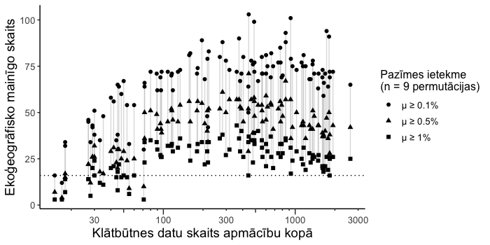

# Sugu izplatības (dzīvotņu piemērotības) modeļi  {#Chapter7}

Šajā nodaļā aprakstīta sugu izplatības modelēšanas pieeja no sugai specifiskās 
modeļos iekļaujamās vides aprakstiem (EGV), caur modeļu parametrizāciju un labākās 
izvēli, līdz modeļu rezultātu izvērtēšanai nepieciešamās informācijas sagatavošanai. 

Iegūtie ik-sugas izplatības modeļi apkopoti, vizualizēti un konspektīvi aprakstīti nodaļas [Rezultāti](#Chapter10) 
pirmajā apakšnodaļā [Individuālu sugu rezultāti](#Chapter10.1). Izplatības modelēšanai 
izmantotās klātbūtnes vietas, to apkopošanas un filtrēšanas procedūras raksturotas 
nodaļā [Novērojumu atlase](#Chapter6), specifiskās - par uzticamām klātbūtnes 
vietām uzskatāmo atlases soļi ir tās apakšnodaļā [Novērojumu atlases gaita](#Chapter6.1), 
savukārt to dalījums modeļa apmācības un neatkarīgās testēšanas kopā un katras no 
tām papildināšana ar vidi-kopumā aprakstošām nejaušās izlozes vietās ir 
apakšnodaļā [Modelēšanas datu saglabāšana un procesa vizualizēšana](#Chapter6.2).

Ekoģeogrāfiskie mainīgie, kuru sagatavošanas procedūras un tajos iekļauto vides 
raksturojumu apraksti ir nodaļā [Ekoģeogrāfiskie mainīgie](#Chapter5), ir gatavoti 
mērķtiecīgai sugu izplatības modelēšanai - pirms pašas EGV sagatavošanas ir sastādīts 
no modelēšanai sākotnēji plānoto sugu (nodaļa [Sugu saraksts un pamata apraksti](#Chapter1)) 
nepieciešamībām izrietošs plāns. Tas ir apskatāms [šajā failā](./Papilddati/EGV_putniem.xlsx), 
kurā ir redzams, ka daļa EGV ir veidoti vienkārši plūsmas ērtībai vai domājot arī 
par citām, ne tikai putnu sugām. Diemžēl pirms EGV ir sagatavoti, nav zināms vai 
tie visi būs faktiski izmantojami sugu izplatības modelēšanai, tādēļ pirms tās 
uzsākšanas pārbaudīta ik sugas modeļos iekļaujamo EGV vērtību savstarpējā neatkarība 
aprēķinot dispersijas ietekmētības faktoru (*variance inflation factor*; VIF), 
turpmākam darbam izvēlot tikai pietiekoši neatkarīgos, kuriem veikta indikatīva 
testēšana to iekļaušanai sugu izpla'tibu prognozējošajos modeļos. Vairāk - šīs 
nodaļas [Sākotnēji izvēlēto pazīmju neatkarība un EGV atlases otrā kārta](#Chapter7.1) apakšnodaļā.

Pēc EGV izvēles, veikta sugu izplatības modeļu parametrizācija maximuma entropijas 
analīzes ietvarā [@PhillipsDudikSchapire2004]. Analīzes gaita, parametrizācijas 
pieejas un pieņemtie lēmumi ar ieviešanas procedūru (komandu rindām) ir raksturoti 
šīs nodaļas [Modeļa parametrizācija, izvēle un izvērtēšanas apraksti](#Chapter7.2) apakšnodaļā. 
Šīs procedūras ietvaros, izvēlēts modelis, kurš vislabāk spēj raksturot 
interesējošās sugas izplatību, izšķirot tai piemēroto un nepiemēroto dzīvotņu 
projekcijas ģeogrāfiskajā telpā (nosedzot visu Latvijas iekšzemes teritoriju 100 m 
izšķirtspējā).

Part labāko atzītajam modelim sagatavoti dažādi klasifikācijas spējas raksturojumi, 
raksturojot sagaidāmo kļūdu apjomu gan modeļa apmācībai izmantotajos (un iekšējās 
validācijas), gan neatkarīgās testēšanas datos. Sniegti ieteikumi izmantojamajiem 
dzīvotņu piemērotības klasifikācijas sliekšņiem ar izmešanas un pieskaitīšanas 
kļūdām kā arī kopējo klasifikācijas statistisko nozīmīgumu. Papildus tam, raksturotas 
projicētās dzīvotņu piemērotības gradienta īpašības un individuālu novērojumu ietekme 
modelī, kas turklāt vērtētas kontekstā ar nulles modeļiem informācijas telpas nozīmīguma 
novērtēšanai. Nedaudz plašāk šie mēri un to interpretācija aprakstīti rezultātu 
nodaļā ([Individuālu sugu rezultāti](#Chapter10.1)), to izvēles pamatojums un izmantotās 
analītiskās pieejas (ar komandu rindām) raksturotas šīs nodaļas [Nulles modelis](#Chapter7.3).

Šīs nodaļas noslēgumā ([Labākā modeļa rezultāti](#Chapter7.4)) sniegtas komandu 
rindas rezultātu nodaļā izmantoto attēlu sagatavošanai.

## Sākotnēji izvēlēto pazīmju neatkarība un EGV atlases otrā kārta {#Chapter7.1}

Jebkurā prognostiskā statistiskajā modelī, kuram ir nepieciešama gan ekstrapolācijas, 
gan skaidrošanas spēja, regresoriem ir jābūt savstarpēji neatkarīgiem [@McElreathBook],
[@ZuurGAMS]. Turklāt, modelī nav pamata atrasties pazīmēm, kuras nepiedalās sugas 
izplatības prognozēšanā vai sniedz niecīgu pienesumu - jo vairāk EGV, jo skaitļošanā 
izaicinošāks un resursu ietilpīgāks ir jebkurš izstrādājamais modelis.

Pazīmju neatkarības izvērtējums sniegts nodaļā [Multikolinearitāte](#Chapter7.1.1), 
savukārt modelī iekļaujamo pazīmju izvēle - [EGV indikatīvā nozīme kompleksā modelī](#Chapter7.1.2).


### Multikolinearitāte  {#Chapter7.1.1}

Lai gan nereti statistiskajos modeļos par neatkarīgām tiek pieņemtas pazīmes, kuru 
dispresijas efektīvi neprognozē jebkāda kopa ar citām pazīmēm, to raksturojot ar
$\text{VIF} \le 4$ [@ZuurGAMS], vides ekoģeogrāfiskajiem mainīgajiem, to telpiskā 
novietojuma īpašību dēļ, tik zemas vērtības ievērojami ierobežo pieejamo pazīmju 
loku [@Wikleetal2019]. Maksimuma entropijas analīze tiek uzskatīta par relatīvi 
robustu pret EGV savstarpējām korelācijām [@PhillipsDudikSchapire2004], 
[@PhillipsAndersonSchapire2006], tomēr, lai novērstu spēcīgi ietekmētus 
modeļa parametru vērtējumus [@Montgomeryetal2012], izvēlējos tikai tos sākotnēji 
ieplānotos EGV, kuru  $\text{VIF} \le 10$, sekojot [@Avotinsetal2022], [@PucuPlans] 
un [@DzenuPlans] piemēriem.

Šī izvēle veikta R pakotnē {usdm} [@usdm_pakotne], izmantojot sekojošajā koda 
apgabalā sniegtās komandu rindas. Darba gaitā no kopējās EGV izvēles tabulas, 
sagatavota katrai sugai individuāla, tajā pierakstot turpmākam darbam izvēlēto 
EGV aprēķinātās VIF vērtības. To aprēķināšanai izmantota soli-pa-solim EGV izslēgšanas 
pieeja sākot ar EGV ar lielāko VIF vērtību un turpināta līdz visām atlikušajām pazīmēm, 
nejauši izlozētos 20 000 punktos, aprēķināta $\text{VIF} \le 10$. Pēc noklusējuma 
programmatūra paredz 5000 nejauši izlozētu punktu izmantošanu, kas palielināts, 
lai uzlabotu vides aptveri un iegūtā rezultāta stabilitāti neatkarīgos atkārotjumos. 
Tam, protams, ir cena - skaitļošanai nepieciešamie resursi un laiks ir lielāks.

Šī ir uzskatāma par semi-automatizētu pieeju, kurā sākotnējā (sevišķi plašā) EGV 
izvēle ir veikta specifiski domājot par ik sugas ekoloģiju un tās izplatību potenciāli 
atšķirīgi ietekmējošiem dažādiem biotopiem (vides heterogenitāti), tomēr specifiski 
modelēšanā iekļaujamo pazīmju loks ir izvēlēts automatizēti. Tas nozīmē, ka izvēlēto 
pazīmju loks var nebūt optimāls specifiski sugas ekoloģiskās nišas aprakstīšanai, 
tomēr nodrošina statistiskās nepieciešamības un atkarībā modeļa spējas aprakstiem 
var būt piemērots kā izplatības modeļa ievade [@GuisanThuillerZimmerman2017]. Turklāt 
tas pasargā no *cherry-picking* modelēšanā un tādas datu analīzes veidošanas, kas 
sakrīt ar pētnieka ekspektāciju, nenodrošinot noturību pret argumentētu kritiku.


``` r
# libs
if(!require(usdm)) {install.packages("usdm"); require(usdm)}
if(!require(tidyverse)) {install.packages("tidyverse"); require(tidyverse)}
if(!require(terra)) {install.packages("terra"); require(terra)}
if(!require(readxl)) {install.packages("readxl"); require(readxl)}
if(!require(openxlsx)) {install.packages("openxlsx"); require(openxlsx)}
if(!require(doParallel)) {install.packages("doParallel"); require(doParallel)}
if(!require(foreach)) {install.packages("foreach"); require(foreach)}


# EGVs ----
faili=data.frame(fails=list.files(path="./Rastri_100m/Scaled/",
                                  pattern=".tif$"),
                 cels=list.files(path="./Rastri_100m/Scaled/",
                                 pattern=".tif$",full.names = TRUE))

# sugam paredzetie ----
sakumam=read_excel("./Rastri_100m/EGV_putniem.xlsx")


sakumam_long=sakumam %>% 
  pivot_longer(cols = COTCOT:EMBCIT,names_to="suga_kods",values_to="sakuma_izvele")

# Izvēle ----
sugas=levels(factor(sakumam_long$suga_kods))
cl <- makeCluster(8)
registerDoParallel(cl)

foreach(i = 1:length(sugas)) %dopar% {
  suppressPackageStartupMessages(library(tidyverse))
  suppressPackageStartupMessages(library(terra))
  suppressPackageStartupMessages(library(arrow))
  suppressPackageStartupMessages(library(usdm))
  suppressPackageStartupMessages(library(maps))
  suppressPackageStartupMessages(library(rasterVis))
  suppressPackageStartupMessages(library(readxl))
  suppressPackageStartupMessages(library(SDMtune))
  suppressPackageStartupMessages(library(ENMeval))
  suppressPackageStartupMessages(library(zeallot))
  suppressPackageStartupMessages(library(openxlsx))
  print(i)
  sakums=Sys.time()
  suga=sugas[i]
  print(suga)
  sakumsaraksts_sugai=sakumam_long %>% 
    filter(suga_kods==suga)
  isssakums_sugai=sakumsaraksts_sugai %>% 
    filter(sakuma_izvele==1)
  faili_sugai=faili %>% 
    filter(fails %in% isssakums_sugai$scale_NAME)
  rastri_sugai=terra::rast(faili_sugai$cels)
  
  VifStep_sugai=usdm::vifstep(rastri_sugai,th=10,size=20000)
  izslegt=VifStep_sugai@excluded
  saglabat=VifStep_sugai@results
  
  saglabat2=saglabat %>% 
    mutate(faila_nosaukums=paste0(Variables,".tif"),
           sakumVIF=VIF) %>% 
    dplyr::select(faila_nosaukums,sakumVIF)
  sakums2=sakumsaraksts_sugai %>% 
    left_join(saglabat2,by=c("scale_NAME"="faila_nosaukums"))
  
  EGVtabulai=paste0("./SuguModeli/EGVselection/EGV_",suga,".xlsx")
  write.xlsx(sakums2,EGVtabulai)
  beigas=Sys.time()
  ilgums=beigas-sakums
  print(ilgums)
}
stopCluster(cl)
```


### EGV indikatīvā nozīme kompleksā modelī  {#Chapter7.1.2}

Pēc iepriekšējā soļa veikšanas ([Multikolinearitāte](#Chapter7.1.1)), daļai sugu 
saglabājās sevišķi liels EGV loks, no kurām skaidrs, ka ne visas faktiski saistīsies 
ar sugas izplatību statistiskajā modelī, turklāt ir risks, ka ar regresoriem 
pārsātinātā informācijas telpā, daļa nozīmīgo efektu tiks nomākti, nemaz nerunājot 
par identificējamības ierobežojumiem sugām ar nelielu klātbūtnes vietu skaitu. 
Turklāt, modelēšana ar lielu regresoru skaitu ir skaitļošanas izmaksu prasīga 
(mērogojumam - viena "pilnā modeļa" pazīmju nozīmes izvērtējums ar deviņām permutācijām 
prasa vairāk laika un operatīvās atmiņas, nekā 99 permutācijas beigu modelim). 

Tādēļ pirms sugas izplatības modeļu parametrizācijas, veidots indikatīvais modelis, 
no kura izslēgtas maznozīmīgās pazīmes. Šis modelis veidots ar visiem savstarpēji 
pietiekoši neatkarīgajiem EGV ([Multikolinearitāte](#Chapter7.1.1)) un visiem 
modeļa apamācībā izmantojamajiem punktiem (klātbūtnes un 
fona - [Modelēšanas datu saglabāšana un procesa vizualizēšana](#Chapter6.2)) maksimuma 
entropijas analīzes "noklusējuma" modelī - lineāro (*linear*; R funkcijās "l" vai "L"), 
kvadrātisko (*quadratic*; R funkcijās "q" vai "Q"), zemākā sliekšņa līmeņa 
kritērija (*hinge*; R funkcijās "h" vai "H") un to produkta (*product*; R 
funkcijās "p" vai "P") algoritmu kombinācijai ar regularizācijas multiplikatoru "1" 
[@PhillipsDudikSchapire2004], [@PhillipsAndersonSchapire2006]. Šis ir samērā 
komplekss modelis, kurš tiecās izmantot plašu pazīmju klāstu, veidojot korelatīvas 
saistības, kuras ļauj identificēt ietekmīgākos EGV pārējo izslēgšanai jeb modeļa 
reducēšanai [@PhillipsAndersonSchapire2006], [@Bjorklundetal2020]. 

No izmantotajām pazīmju-algoritmu kombinācijām zemākā sliekšņa līmeņa kritērijs, lai 
gan ekoloģiski pamatots dažādās situācijās, {maxnet} pakotnē [@Maxnet] ir lietojams 
tikai EGV inofrmācijas telpā, kurā ik pazīmei ir pietiekoša variabilitāte, kas ne 
vienmēr izpildās. Tādēļ šajā solī iestrādāta automātiska izvēle nedaudz vienkāršākam 
modelim - LQP -, ja neizpildās variabilitātes nosacījumi.

Visi modeļi veidoti kopējās informācijas telpas aprakstam (fona jeb *background* vietām), 
pievienojot tās klātbūtnes vietas, kuras raksturo tajos jau neesošas EGV vērtību 
kombinācijas [@PhillipsDudikSchapire2004], [@PhillipsAndersonSchapire2006], lai 
veidotu analītisko sistēmu, kas analīti cieši saistās ar Puasona 
punktu procesu [@GuisanThuillerZimmerman2017].

Lai gan šī soļa mērķis ir vienkāršot modeļus, reducējot iekļauto pazīmju loku, tas 
tiek darīts tikai apmācību kopā un bez iekšējās validācijas (*cross-validation*; CV), 
kas rada potenciālu pārliekai pielipšanai datiem (*overfitting*), turklāt fokusēšanos uz 
atsevišķām pazīmēm, tādā veidā zaudējot matricas heterogenitātes ietekmes raksturojumus. 
Tādēļ iestrādāts kritērijs par minimālo pazīmju skaitu sākotnējā modelī pēc vidējās 
indikatīvās permutāciju (n=9) ietekmes:

- ja vidējā indikatīvā ietekme bija vismaz 1% un pazīmju skaits bija vismaz 16, 
izvēlētas šīs pazīmes un izvēle beigta. Ja pazīmju skaits bija mazāks, turpināta izvēle;

- turpinot izvēli, izvērtēts pazīmju ar vismaz 0.5% indikatīvo ietekmi. Ja tas ir 
vismaz 16, izvēlētas šīs pazīmes un izvēle beigta. Ja pazīmju skaits bija mazāks, 
turpināta izvēle;

- turpinot izvēli, izmantotas pazīmes ar vismaz 0.1% indikatīvo ietekmi un izvēle beigta.

Sliekšņa līmenis ar vismaz 16 EGV ir izvēlēts arbitrāri. Skaidrs, ka optimālais 
EGV skaits ir pakārtots gan sugas ekoloģiskās nišas sarežģītībai, gan pieejamo vides 
raksturojumu detalizācijai, gan klātbūtnes vietu skaitam [@GuisanThuillerZimmerman2017]. 
Tomēr sugām ar mazāku novērojumu skaitu ir augstāka varbūtība modelim pielipt kādām no
konkrētām situācijām (to raksturojumiem EGV informācijas telpā). Apskatot visu modelēšanā 
iekļauto sugu klātbūtnes vietu apmācību kopā skaitu saistībā ar izvēlēto EGV skaitu, 
šī vērtība ("16") iezīmējas gan sugām ar lielu, gan vidēju novērojumu skaitu (\@ref(fig:EGVskaiti) att.).

<div class="figure">

<p class="caption">(\#fig:EGVskaiti)Sugu izplatības modeļu parametrizācijai izvēlāmo ekoģeogrāfisko mainīgo skaits, atkarībā no klātbūtnes datu skaita modeļa apmācību kopā un indikatīvās permutāciju ietekmes.</p>
</div>


Procedurā ir atkārtoja ar sekojošajā koda apgabalā sniegtajām komandu rindām. To 
ietvaros tiek veiktas augstāk aprakstītās darbības un iepriekš ([Multikolinearitāte](#Chapter7.1.1)) 
sagatavotajos sugām specifiskajos EGV izvēles failos pierakstīta indikatīvā nozīme 
kā vidējais aritmētiskais un standartnovirze permutāciju procedūrā. Turpinājumā 
atlasītas sliekšņa līmeņiem (EGV skaitam un vidējais ietekmei) atbilstošās pazīmes, 
kurām vēlreiz aprēķināta VIF vērtība, sekojot iepriekšējai procedūrai. Aprēķini 
atkārtoti, lai precīzāk informētu par statistisko kompleksu parametrizētajos modeļos.


``` r
# libs
if(!require(usdm)) {install.packages("usdm"); require(usdm)}
if(!require(tidyverse)) {install.packages("tidyverse"); require(tidyverse)}
if(!require(terra)) {install.packages("terra"); require(terra)}
if(!require(readxl)) {install.packages("readxl"); require(readxl)}
if(!require(openxlsx)) {install.packages("openxlsx"); require(openxlsx)}
if(!require(doParallel)) {install.packages("doParallel"); require(doParallel)}
if(!require(foreach)) {install.packages("foreach"); require(foreach)}
if(!require(arrow)) {install.packages("arrow"); require(arrow)}
if(!require(maps)) {install.packages("maps"); require(maps)}
if(!require(rasterVis)) {install.packages("rasterVis"); require(rasterVis)}
if(!require(SDMtune)) {install.packages("SDMtune"); require(SDMtune)}
if(!require(ENMeval)) {install.packages("ENMeval"); require(ENMeval)}
if(!require(zeallot)) {install.packages("zeallot"); require(zeallot)}

# EGVs
egv_faili=data.frame(egv_fails=list.files(path="./Rastri_100m/Scaled/",
                                  pattern=".tif$"),
                 egv_cels=list.files(path="./Rastri_100m/Scaled/",
                                 pattern=".tif$",full.names = TRUE))

# sugas
klatbutnem=data.frame(klatbunes_fails=list.files(path="./SuguModeli/ApmacibuDati/TrainingPresence/",
                                                pattern=".parquet"),
                      klatbunes_cels=list.files(path="./SuguModeli/ApmacibuDati/TrainingPresence/",
                                                 pattern=".parquet",full.names = TRUE))
klatbutnem=klatbutnem %>% 
  separate(klatbunes_fails,into=c("veids","kods","paplasinajums"),remove = FALSE) %>% 
  dplyr::select(-paplasinajums,-veids)

foniem=data.frame(fona_fails=list.files(path="./SuguModeli/ApmacibuDati/TrainingBackground/",
                                                 pattern=".parquet"),
                      fona_cels=list.files(path="./SuguModeli/ApmacibuDati/TrainingBackground/",
                                                pattern=".parquet",full.names = TRUE))
foniem=foniem %>% 
  separate(fona_fails,into=c("veids","kods","paplasinajums"),remove = FALSE) %>% 
  dplyr::select(-paplasinajums,-veids)

egv_izvelem=data.frame(izvelu_fails=list.files(path="./SuguModeli/EGVselection/",
                                             pattern=".xlsx"),
                       izvelu_cels=list.files(path="./SuguModeli/EGVselection/",
                                            pattern=".xlsx",full.names = TRUE))
egv_izvelem=egv_izvelem %>% 
  separate(izvelu_fails,into=c("veids","kods","paplasinajums"),remove = FALSE) %>% 
  dplyr::select(-paplasinajums,-veids)


savienoti=klatbutnem %>% 
  left_join(foniem,by="kods") %>% 
  left_join(egv_izvelem,by="kods")


# izvēles
kodi=levels(factor(savienoti$kods))


cl <- makeCluster(6)
registerDoParallel(cl)

foreach(i = 1:length(kodi)) %dopar% {
  
  suppressPackageStartupMessages(library(tidyverse))
  suppressPackageStartupMessages(library(terra))
  suppressPackageStartupMessages(library(arrow))
  suppressPackageStartupMessages(library(usdm))
  suppressPackageStartupMessages(library(maps))
  suppressPackageStartupMessages(library(rasterVis))
  suppressPackageStartupMessages(library(readxl))
  suppressPackageStartupMessages(library(SDMtune))
  suppressPackageStartupMessages(library(ENMeval))
  suppressPackageStartupMessages(library(zeallot))
  suppressPackageStartupMessages(library(openxlsx))
  
  suga=kodi[i]
  izvelei_sugai=read_excel(savienoti$izvelu_cels[savienoti$kods==suga])
  izvelei_sugai=izvelei_sugai %>% 
    dplyr::select(sakums:sakumVIF)
  
  
  isais_saraksts=izvelei_sugai %>% 
    filter(!is.na(sakumVIF))
  
  egv_faili2=isais_saraksts %>% 
    left_join(egv_faili,by=c("scale_NAME"="egv_fails"))
  
  predictors <- terra::rast(egv_faili2$egv_cels)
  names(predictors)=egv_faili2$egv_id
  names(predictors)
  
  klatbutnem=read_parquet(savienoti$klatbunes_cels[savienoti$kods==suga])
  klatbutnes=klatbutnem %>%
    mutate(y=as.numeric(y)) %>% 
    dplyr::select(x,y)
  
  foniem=read_parquet(savienoti$fona_cels[savienoti$kods==suga])
  foni=foniem %>% 
    dplyr::select(x,y)
  
  dati <- prepareSWD(species = suga,
                     p = klatbutnes,
                     a = foni,
                     env = predictors)
  dati2=addSamplesToBg(dati)
  
  izveles_modelis=function(datini){
    rezA=try(train("Maxnet",
                   data = datini,
                   fc="lqph"))
    if (inherits(rezA, 'try-error')) {
      rezB=train("Maxnet",
                 data = datini,
                 fc="lqp")
      return(rezB)
    }
    return(rezA)
  }
  
  maxnet_model=izveles_modelis(dati2)
  
  vi_maxnet <- varImp(maxnet_model, 
                      permut = 9)
  names(vi_maxnet)=c("egv_id","first_VarImp","first_VarImpSD")
  
  vidus=izvelei_sugai %>% 
    left_join(vi_maxnet,by="egv_id")
  
  write.xlsx(vidus,savienoti$izvelu_cels[savienoti$kods==suga])
  
  summa1=sum(ifelse(vidus$first_VarImp>=1,1,0),na.rm=TRUE)
  summa05=sum(ifelse(vidus$first_VarImp>=0.5,1,0),na.rm=TRUE)
  summa01=sum(ifelse(vidus$first_VarImp>=0.1,1,0),na.rm=TRUE)
  
  if(summa1>=16) {
    beigu_saraksts=vidus %>% 
      filter(first_VarImp>=1)} else if (summa05>=16) {
        beigu_saraksts=vidus %>% 
          filter(first_VarImp>=0.5)} else {
            beigu_saraksts=vidus %>% 
              filter(first_VarImp>=0.1)}
  
  
  egv_faili3=beigu_saraksts %>% 
    left_join(egv_faili,by=c("scale_NAME"="egv_fails"))
  
  egvs <- terra::rast(egv_faili3$egv_cels)
  names(egvs)=egv_faili3$egv_id
  names(egvs)
  
  vertibam=usdm::vif(egvs,size=20000)
  names(vertibam)=c("egv_id","final_VIF")
  
  beigas=vidus %>% 
    left_join(vertibam,by="egv_id")
  write.xlsx(beigas,savienoti$izvelu_cels[savienoti$kods==suga])
  
}
stopCluster(cl)
```


## Modeļa parametrizācija, izvēle un izvērtēšanas apraksti  {#Chapter7.2}

Feature types and algorithms

Regularization multipliers

Krosvalidācija

TSS neatkarīgos testa datos

## Nulles modelis  {#Chapter7.3}

salīdzinājums ar nulles modeli


## Labākā modeļa rezultāti  {#Chapter7.4}

Dažādu failu ģenerēšana un modeļa spējas apraksti

Marginālās atbildes funkciju attēli


