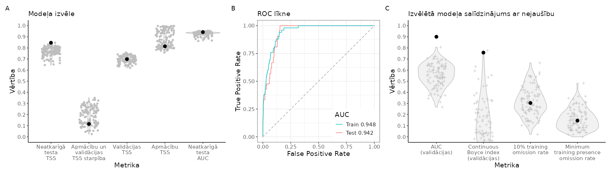
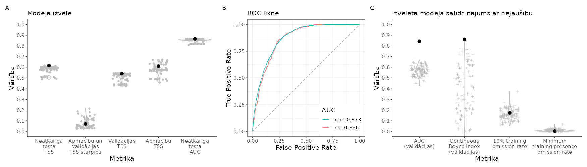
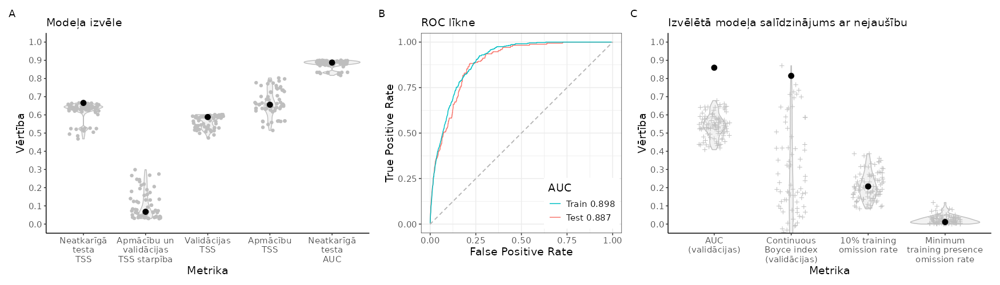
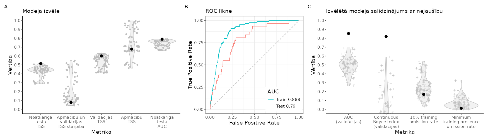
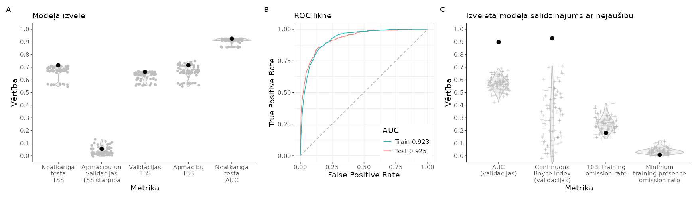
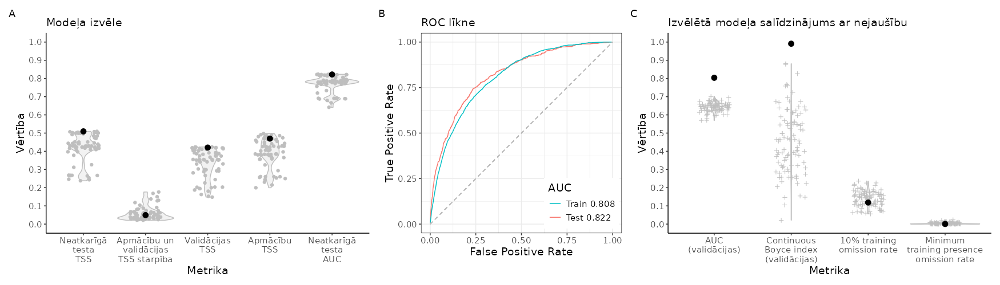
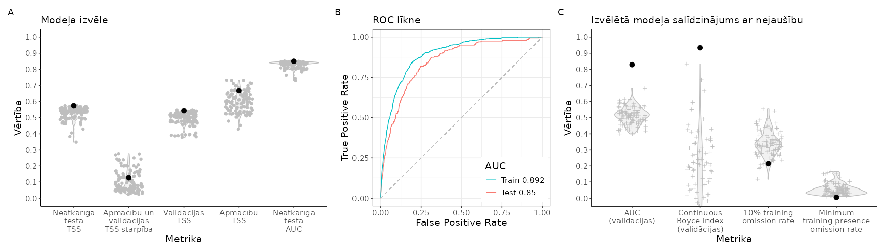
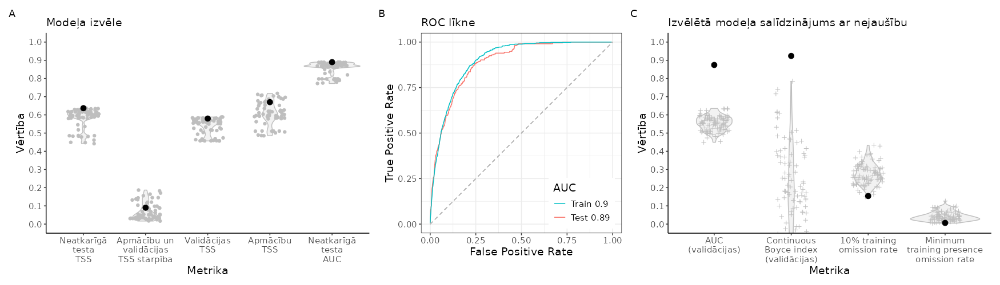

# Rezultāti {#Chapter10}

Šajā nodaļā apkopoti iegūtie sugu izplatības modelēšanas un vietu prioritizācijas aizsardzībai rezultāti. Tā ir strukturēta divās daļās - [individuālu sugu rezultāti](#Chapter10.1) un [apkopotie valsts līmeņa rezultāti](#Chapter10.2), kurā individuālo sugu rezultāti apkopoti  sugu sabiedrību un ekosistēmu aizsardzības plānošanai. Matriāliem, kuri savas informatīvās, telpiskās un temporālās izšķirtspējas dēļ nav uzskatāmi par sugu aizsardzību apdraudošiem, sniegta piekļuve lejupielādei.

## Individuālu sugu rezultāti {#Chapter10.1}

Apkopotā formā ik sugas rezultāti ar hiperstaitēm lejupielādei ir [šajā (šobrīd neaktīvajā) tabulā (xlsx)]().

Sekojošajās nodaļās informācija par katru sugu ir apkopota pēc vienotas pieejas, sekojot zemāk esošajai secībai:

1. sākumā ir sniegta informācija par pieejamajiem klātbūtnes novērojumiem, to izvietojumu un samazinājumu [atlases gaitā](#Chapter6). Tajā ir vizualizētaa modelēšanai (modeļu apmācībai, iekļaujot telpisko bloku krosvalidāciju, un neatkarīgai testēšanai) izmantotās datu kopas;

2. sugām, kurām, datu apjoma dēļ, pieņemts lēmums modelēšanu neveikt, tas ir skaidri norādīts tekstā. Pārējām sugām turpinās piedāvātā informācija. 

Modelētajām sugām:

3. labākā modeļa izvēle (kreisajā - A daļā) un (labajā - B daļā) šī modeļa salīdzinājums ar labākā modeļa EGV, klātbūtnes un fona veidotajā informācijas telpā radītiem nejaušajiem (nulles) modeļiem (n=100), sekojot nodaļā [Sugu izplatības (dzīvotņu piemērotības) modeļi](#Chapter7) aprakstītajai pieejai. Attēlos iekļauti sekojoši raksturojumi:

  a. "Neatkarīgā testa TSS" (*attēla A daļā*), kas raksturo *True skill statistic* (TSS) 
  jeb patiesās spējas statistiku neatkarīgos testa datos. Neatkarīgi testa dati 
  ir jau novērojumu atlases beigās - [papildsolis: neatkarīgie testa dati](#Chapter6.1.9) - 
  atsevišķi nodalīta sugas klātbūtnes un fona punktu kopa, kas nav izmantota 
  modeļa pielāgošanā. Tas nozīmē, ka tie reprezentē modeļa spēju jaunās 
  situācijās, piemēram, modeli turpmāk pielietojot dabā. Patiesās spējas statistiku 
  aprēķina $\text{TSS} = \text{sesitivitāte} + \text{specifiskums} - 1$, kur 
  sensitivitāte ir pareizi (piemērotās dzīvotnēs esošas) klasificēto klātbūtņu 
  īpatsvars no visām klātbūtnēm un specifiskums ir pareizi par nepiemērotiem 
  klasificētie iztrūkumi (fona punkti) no visiem. No biežāk izmantotajiem un 
  aprēķinos mazāk resursietilpīgajiem modeļa izvērtējumiem, TSS uzrāda augstāko 
  stabilitāti un uzticamību neatkarīgi no prevalences [@TSSieviesanaSDM]. Modeļa 
  parametrizācija, kurai ir augstākā TSS vērtība neatkarīgos testa datos ir uzskatāma 
  par labāk sugai piemērotās dzīvotnes atpazīstošajām modeļa turpmākā lietošanā, 
  tādēļ to izmantojām par galveno labākā modeļa izvēles kritēriju. Modeļa apmācibas, 
  validācijas un neatkarīgā testa kopās raksturīgas TSS vērtību atšķirības (ar 
  samazināšanās tendenci uzskaitījumā, jo neredzētus datus ir grūtāk klasificēt), 
  tomēr ir izplatīti pieņēmumi ("īkšķa likumi"):
  
    -- TSS < 0.2 raksturīgs vājiem (*poor*) modeļiem;
    
    -- 0.2 $\le$ TSS < 0.4 - viduvējiem (*fair*) modeļiem;
    
    -- 0.4 $\le$ TSS < 0.6 - mēreni labiem (*moredately good*) modeļiem;
    
    -- 0.6 $\le$ TSS < 0.8 - labiem (*good*) modeļiem;
    
    -- TSS $\ge$ 0.8 - lieliskiem (*excellent*) modeļiem;
  
  b. "Apmācību un validācijas TSS starpība" (*attēla A daļā*), kas raksturo TSS 
  starpību (vidējo aritmētisko) modeļa pielāgošanai izmantoto datu kopai, kura pielietota 
  modeļa iekšējai validēšanai no apmācību daļas. Modeļa apmācībā izmantota pieeja ar 
  četriem telpiskajiem blokiem - validēšana veikta vienai (telpiski nodalītu) ceturtdaļai 
  klātbūtnes un fona punktiem modelī, kurš apmācīts ar atlikušajām trīs ceturtdaļām datu. 
  Krosvalidācija atkārtota četras reizes, lai katra ceturtdaļa būtu trīs reizes 
  piedalījusies apmācībā un vienu reizi būtu kalpojusi validācijā.
  Jo mazāka ir starpība starp validēšanas un apmācību TSS vērtībām, jo telpiski 
  noteiktāks un stabilāks ir modelis. Gadījumos, kad labākā modeļa izvēle atgrieza 
  vairākus konkurentus (1.a.), izvēlējām modeli ar zemāko vērtību šajā rādītājā;
  
  
  c. "Validācijas TSS" (*attēla A daļā*), kas raksturo TSS vērtību telpiski nodalītā 
  ceturtdaļā modeļa pielāgošanas kopas datu. Aprēķināta vidējā aritmētiskā vērtība 
  četrām telpiski nodalītu bloku krosvalidācijām. Jo augstāka šī vērtība, jo labāka 
  ir modeļa spēja prognozēt vides piemērotību telpiski nodalītās vietās. Ja 
  pēc 2.a. soļa bija vairāk kā viens konkurējošs modelis, izvēlējāmies to, kuram 
  šī vērtība bija augstākā. Ja saglabājās vēl citi konkurējoši modeļi, izvēlējāmies 
  vienkāršāko algoritmu (*feature class algorithm*), kas nodrošināja tikai vienu 
  labāko modeli;
  
  d. "Apmācību TSS" (*attēla A daļā*), kas raksturo TSS vidējo aritmētisko vērtību 
  modeļa apmācībai izmantotajās trīs ceturtdaļās modeļa pielāgošanai pieejamo datu. 
  Iekļauts visualizācijai tikai informatīvos nolūkos;
  
  e. "Neatkarīgā testa AUC" (*attēla A daļā*), kas raksturo laukumu zem uztvērēja 
  operēšanu raksturojošās līknes (angļu - *Arue Under the receiver operating Curve*), 
  kur uztvērējs ir modelis un telpas laukumu veido sensitivitāte (uz y-ass) 
  un 1 - specifiskums (uz x-ass). Vērtība 0.5 apzīmē klasifikācijas (piemērotās vai 
  nepiemērotās dzīvotnēs) spējas līdzināšanos nejaušībai (ideālās monētas mešanai), 
  lielākas vērtības liecina par uzlabojošos modeļa spēju un vērtība 1 liecina par 
  perfektu klasifikāciju. Vērtības mazākas par 0.5 liecina par negatīvu prognozi. 
  AUC tiecas priekšroku dot modeļiem, kuri ir pārpielāgoti (*overfitted*), tā 
  vērtības sniegtas informatīvos nolūkos. Par pieņemiem bieži uzskata modeļus, kuru 
  AUC $\ge$ 0.7 un par labiem, ja AUC $\ge$ 0.8;
  
  f. "AUC (validācijas)" (*attēla B daļā*), kas raksturo atkārtoti pielāgotā modeļa 
  AUC vērtību validācijas datos - tā parēķināta pēc noklusējuma un vizualizēta 
  informatīvos nolūkos un, lai piedāvātu ieskatu modļu prognožu spēju stabilitātē;
  
  g. "Continuous Boyce Index (validācijas)" (*attēla B daļā*), kas raksturo modeļa 
  prognozētās dzīvotņu piemērotības (nepārtraukti variējoša [0, 1]) korelācijas 
  koeficientu ar sugas klātbūtnes vietu skaitu dzīvotņu piemērotības diapozona daļās. 
  Kā korelācijas koeficentam, vērtības variē no -1 līdz +1, kur 0 nozīmē korelācijas 
  trūkumu jeb trūkumu modeļa spējai prognozēt piemērotas dzīvotnes sugas klātbūtnes 
  vietās un ir salīdzināma ar nejaušu prognozi (beznosacījumu vidē). Pieaugošas 
  pozitīvas vērtības nozīmē pieaugošu modeļa prognozes spēju sugas klātbūtnes 
  vietām, tādēļ, jo augstākas ir šī rādītāja vērtības, jo augstāka ir modeļa 
  prognozes spēja. Šis rādītājs ir aprēķināts un raksturots:
  
    -- pats par sevi kā labākā modeļa atkārtota piemērošanas vidējais aritmētiskais 
    telpisko bloku kosvalidācijas procedūras testa (validēšanas) klātbūtnēm. 
    Interpretācijai - tas nozīmē, ka trenko melno atzīmi šajā attēlā vēlamies iespējami 
    lielāku; ;
    
    -- sporādiski izplatītām sugām ar nelielu dzīves telpu jeb atkarīgām no 
    vides apstākļiem šauros ainavas mērogos, prognozes var izskatīties nejaušas 
    (kā sāls un piparu mainījums), tādēļ tās ir vērts salīdzināt ar modelim specifisko 
    ekoģeogrāfisko mainīgo veidoto vides gradientu informācijas telpu. Tas ir nozīmīgi 
    arī visām pārējām sugām, lai raksturotu modeļa kvalitāti. Šis salīdzinājums veikts 
    ar 100 nejauši ģenerētām pseido-klātbūtnes vietām labākā modeļa ekoģeogrāfisko 
    mainīgo veidotajā vides gradientu informācijas telpā. Nejaušo (nulles) modeļu 
    vērtību salīdzinājums ar empīrisko (labākā modeļa) ļauj skaidrot cik nejaušas 
    ir modeļa apmācībā izmantotās klātbūtnes vietas tieši konkrēto vides gradientu 
    telpā. Par labu ir uzskatāms modelis, kura empīriskā vērtība (treknais melnais 
    punkts) ir ne tikai pozitīvu vērtību, bet tas atrodas arī nulles modeļu sadalījuma 
    augšdaļā vai virs tā;
  
  h. "10% training omission rate" (*attēla B daļā*), kas raksturo kādu īpatsvaru 
  no modeļa apmācībā izslēgtiem 10% klātbūtnes punktu (veidojot pseido-neatkarīgās 
  testēšanas kopu) modelis nespēj prognozēt kā sugai piemērotās vietās esošus. Šajā 
  modeļa pārbaudē projekcijas vēl nav informētas par optimālo dalījumu piemērotās 
  un nepiemērotās vietās, tādēļ faktiskās vērtības nav svarīgas - svarīgi, lai empīriskā 
  vērtība (labākā modeļa prognoze; trknais punkts attēlā) ir iespējami zemāka un 
  ir zemāka par nulles modeļiem, tomēr modeļiem ar maz klātbūtnēm, svarīgi, lai 
  empīriskā vērtība nav augstāk par nulles sadalījuma centrālo daļu, jo tas ierosina 
  modeļa pārpielāgošanu (*overfitting*), kas nozīmē dzīvotņu piemērotības projicēšanas 
  vispārināšanās spējas trūkumu; 
  
  i. "Minimum training omission rate" (*attēla B daļā*), pēc būtības ir līdzīgs 
  iepriekš aprakstītajam "10% training omission rate" un arī interpretējams ir 
  līdzīgi - saistībā ar nulles modeļiem. Tomēr šis mērs raksturo minimālo no apmācību 
  kopas izslēdzamo klātbūtnes vietu skaitu, kas spēj sasniegt augstu prognozes spēju.
  Ja klasifikācijas sliekšņa līmenis ir korekts (šajā brīdī modelis par to nav informēts 
  un pieņem 0.5), vērtības no $\le$ 5 līdz 10 % ir uzskatāmas par labām un stabilām, 
  kas indicē modeli, kas spēj labi vispārināties jaunā vidē, sevišķi tuvu nullei 
  esošas vērtības liecina, ka modelis ir pārāk vienkāršs, lai notvertu vides (un par 
  to svarīgāk - sugas ekoloģiskās nišas) sarežģītību, savukārt vērtības kas ievērojami 
  pārsniedz 10% līmeni liecina par modeļa pārpielāgošanu - pielipšanu konkrētām 
  situācijām un nespēju vispārināt dzīvotņu piemērotības projekciju jaunā vidē. Tā 
  kā šī izvērtējuma brīdī modelis nav informēts par optimālo sliekšņa līmeni 
  dalījumam piemērotajās un nepiemērotajās dzīvotnēs, kas ir sevišķi nozīmīgi 
  zemas prevalences situācijās - kā šī, ir svarīgi empīrisko vērtību 
  (labākā modeļa rezultātu; treknais melnais punkts attēlā) salīdzināt ar tā paša modeļa 
  ekoģeogrāfisko mainīgo raksturotajā vides informācijas telpā nejauši ģenerētiem (nulles) 
  modeļiem - par nulles modeļiem augstāka empīriskā vērtība liecina par datiem pārlieku 
  pielipušu modeli (*overfitted*), kas nespēs vispārināt dzīvotņu piemērotības projekciju;

4. tabula ar raksturojumu atsvišķiem biežāk lietotajiem projicētās dzīvotņu piemērotības izvērtējumiem, kas raksturo modeli, veicot dalījumu piemērotajās un nepiemērotajās vietās:

  a. rindas raksturo sekojošus sliekšņa līmeņus (projicētās dzīvotņu piemērotības vērtība, kas nošķir piemērotās no nepiemērotajām vietām):
  
    -- "Minimum training presence", kas sekojošajos tabulas laukos raksturo modeļa 
    spēju, projicētās dzīvotņu piemērotības dalījumam sugai piemērotajās un 
    nepiemērotajās dzīvotnēs pieņemot zemāko (projicētās dzīvotņu piemērotības) 
    vērtību modeļa apmācībai izmantotajās sugas klātbūtnes vietās. Šī pieeja tiecās 
    nepalaist garām nevienu sugai potenciāli piemēroto vietu, tomēr starp tām 
    iekļauj nezināmu (provizoriski - lielu) apjomu nepiemēroto;
  
    -- "Equal training sensitivity and specificity", kas sekojošajos tabulas laukos 
    raksturo modeļa spēju, projicētās dzīvotņu piemērotības dalījumam sugai piemērotajās un 
    nepiemērotajās dzīvotnēs pieņemot (projicētās dzīvotņu piemērotības) 
    vērtību, kurā sensitivitāte (spēja klātbūtnes vietas klasificēt kā piemērotas) 
    ir vienāda ar specifiskumu (spēja fona punktos izdalīt nepiemērotās vietas tādā 
    apjomā, lai par piemērotiem netiktu uzskatīts lielāks apjoms nekā 1-sensitivitāte). 
    Šajā nodaļā ir izvēlēta šī metode tās stabilitātes saistībā ar sugas prevalenci, 
    kopumā augsto spēju korektai klasifikācijai retai sastopamībai jeb zemai prevalencei  
    (visos gadījumos ir 20 000 fona punktu, bet klātbūtnes vietas 
    nepārsniedz 3300, tātad, mazāk par 16.5%), konkurētspēju ar jaunākām bet 
    analītiski izaicinošākām metodēm [@ValverdeLobo2007l @NewThreshold2024]. 
    Turklāt tas nodrošina ērtu interpretāciju - ja 
    sensitivitāte un specifiskums ir vienādi, zinot nekorekti par nepiemērotām 
    klasificētās klātbūtnes vietas, var aprēķināt nekorekti par piemērotām uzskatīto 
    vietu apjomu - tas ir apmēram tāds pats. Līdzīgas īpašības, protams, būtu sliekšņa 
    līmeni izvēlot pēc testa kopas, tomēr modeļa apmācību kopa ir vairāk informēta par 
    sugas klātbūtnes vietām;
  
    -- "Maximum training sensitivity plus specificity", kas sekojošajos tabulas laukos 
    raksturo modeļa spēju, projicētās dzīvotņu piemērotības dalījumam sugai piemērotajās un 
    nepiemērotajās dzīvotnēs pieņemot (projicētās dzīvotņu piemērotības) 
    vērtību, kurā sensitivitātes un specifiskuma summa ir visaugstākā. Nereti šī 
    pieeja ir uzticama, tomēr tās stabilitāte ir saistīta ar prevalenci - labāk strādā 
    biežāk sastopamām sugām [@NewThreshold2024] un ir saistīta ar risku retākajām sugām 
    prognozēt visu vidi kā nepiemērotu [@CommunityThresholds2018];
  
    -- "Equal test sensitivity and specificity", kas visā savā būtība ir tāda pati 
    kā "Equal training sensitivity and specificity", tomēr sliekšņa līmeni vērtē 
    neatkarīgos (modeļa apmācībā nevienā brīdī neiesaistītos) testa datos, kuru ir mazāk;
  
    -- "Maximum test sensitivity plus specificity", kas visā savā būtība ir tāda pati 
    kā "Maximum training sensitivity plus specificity", tomēr sliekšņa līmeni vērtē 
    neatkarīgos (modeļa apmācībā nevienā brīdī neiesaistītos) testa datos, kuru ir mazāk;
  
  b. katram no tiem sniegts sekojošs izvērtējums:
  
    -- "Cloglog value", kas raksturo projicētās dzīvotņu piemērotības sliekšņa 
    līmeni dalījumam sugai piemērotajās (sākot ar vērtību šajā laukā) un 
    nepiemērotajās (ar zemāku vērtību par šajā laukā norādīto) atbilstoši dalījuma 
    veidam (rindās - iepriekšējais uzskaitījums šajā punktā);
    
    -- "Fractional predicted area", kas raksturo telpas (Latvijas iekšzemes 
    teritorija) īpatsvaru, kurā projicētā dzīvotņu piemērotība ir lielāka par 
    sliekšņa līmeni dalījumam sugai piemērotajās un nepiemērotajās (laukā "Cloglog 
    value" norādītā vērtība);
    
    -- "Training omission rate", kas raksturo modeļa apmācībā izmantoto klātbūtnes vietu 
    īpatsvaru, kuras atrodas vietās ar zemāku projicēto dzīvotņu piemērotību par 
    laukā "Cloglog value" norādīto vērtību;
    
    -- "Test omission rate", kas raksturo testa klātbūtnes vietu īpatsvaru, kuras 
    atrodas vietās ar zemāku projicēto dzīvotņu piemērotību par laukā "Cloglog value" norādīto;
    
    -- "P-values", kas raksturo izvēlētā sliekšņa līmeņa (šī punkta iepriekšējais 
    uzskaitījums) varbūtību nekorekti noraidīt nulles hipotēzi (pirmā tipa statistiskās 
    kļūdas varbūtību), kura viena virziena eksaktajā binomiālajā testā pieņem, ka 
    vietas virs sliekšņa līmeņa nav biežāk sastopamas klātbūtnes punktos nekā telpā 
    nejauši izvēlētas tik daudz vietas, cik atbilst konkrētajam sliekšņa līmenim 
    (lauks "Fractional predicted area");

5. projicētā (cloglog) dzīvotņu piemērotības karte diapozonam no 0 (nepiemērotāka) līdz 1 (piemērotāka) ar centrālā dalījuma vietu atbilstoši iepriekšējās tabulas "Equal training sensitivity and specificity" sliekšņa līmenim. Šis rādītājs izvēlēts tādēļ, (1) ka tas ir labāk informēts par sugas sastapšanas vietām nekā neatkarīgā testa kopa, kas ir sevišķi aktuāli sugām ar nelielu novērojumu skaitu, (2) tā uzticamības un stabilitātes, kā arī (3) vienkāršās interpretējamības dēļ - ja sensitivitāte un specifiskums ir pēc vērtībām salīdzināmi mēri, zinot vienu, var tieši aplēst otru;

6. pēc projekcijas sniegts īss komentārs par modeļa kvalitāti un tā rezultātu turpmāko lietojumu;

7. modeļiem, kuru rezultātu ir vērts tālāk lietot, piedāvāta iespēja lejupielādēt sekojošus datu objektus:

  a. projicētā (cloglog) dzīvotņu piemērotība kā GeoTIFF slānis;
  
  b. tabula ar sliekšņa līmeņiem projicētās dzīvotņu piemērotības dalījumam 
  piemērotās un nepiemērotās (kā .xlsx fails);
  
  c. par labāko atzītais modelis (krosvalidāciju objekts kā *.RDS fails);
  
  d. par labāko atzītais modelis (kombinēts krosvalidāciju objekts kā *.RDS fails);
  
  e. par labāko atzītais modelis (tikai ietekmīgās pazīmes kombinētajā krosvalidāciju objektā, lai atvieglotu turpmāku izplatības projicēšanu kā *.RDS fails);
  
  f. tabula ar ekoģeogrāfisko mainīgo izvēles gaitu, to VIF (savstarpējās prognozētspējas raksturojuma) vērtībām un ietekmes modelī (permutāciju procedūrā) raksturojums (kā *.xlsx fails);
  
8. modeļiem, kuri sasniedz pietiekošu prognozes spēju, ievietots attēls ar marginālajām atbildes funkcijām krosvalidāciju modelī. Marginālā atbilde raksturo interesējošās pazīmes ietekmi uz dzīvotņu piemērotību, pārējām pazīmēm esot to vidējo vērtību līmenī.

9. no projicētās dzīvotņu piemērotības aprēķinātā preference: 

  a. ekosistēmu grupām (apbūve (t.sk. ceļi), ūdeņi, mitrāji (bez ūdeņiem), 
  lauksaimniecībā izmantojamās zemes, meži);
  
  b. ES aizsargājamo biotopu grupām ();
  
  c. *Natura 2000* tīklam;
  
  d. īpaši aizsargājamās dabas teritorijas funkcionālajai zonai;
  
10. sniegts komentārs par nepieciešamību sugas individuālai aizsardzībai ar telpiski izdalāmām platībām;

11. sugām, kurām ierosināta individuālās aizsardzības plānošana, vietu prioritizēšanas aizsardzībai rezultāti:

  a. attēls ar vietu nozīmes sugas aizsardzībā rangiem, izzušanas riska un aizsargātās populācijas daļas līknēm, aizsardzībai prioritārajām vietām - tām, kurās nozīmes rangi ir kopš izzušanas un aizsargātās populācijas daļas pa labi;
  
  b. vietu nozīmes sugas aizsardzībā GeoTIFF slānis lejupielādei;

### COTCOT - paipala *Coturnix coturnix* {#Chapter10.1.001}

(\#fig:NovAtlaseCOTCOT)Novērojumu atlases gaita un modelēšanā izmantojamie paipalas *Coturnix coturnix* novērojumi un fona punkti: A - novērojumu saglabāšanās atlases gaitā; B - visu pieejamo novērojumu (solis 1) izvietojums; C - ar vismaz iespējamu ligzdošanu skaitītie novēorjumi, kas izturējuši līdz septītā soļa beigām (punkti ir unikālie 1 km kvadrāti, krusti ir unikālie 100 m kvadrāti); D - ar vismaz ticamu ligzdošanu skaitītie novēorjumi, kas izturējuši līdz septītā soļa beigām (punkti ir unikālie 1 km kvadrāti, krusti ir unikālie 100 m kvadrāti); E - ar pierādītu ligzdošanu skaitītie novēorjumi, kas izturējuši līdz septītā soļa beigām (punkti ir unikālie 1 km kvadrāti, krusti ir unikālie 100 m kvadrāti); F - modelēšanā izmantojamā apmācību kopa (punkti ir sugas klātbūtnes, krusti ir fona raksturošanai); G - modelēšanā izmantojamā neatkarīgās testēšanas kopa (punkti ir sugas klātbūtnes, krusti ir fona raksturošanai)

 

(\#fig:ModelaRaksturojumsCOTCOT)Labākā modeļa izvēle un uzvērtējums: A - labākā modeļa (ar treknu melnu punktu) salīdzinājums ar citiem pielāgotajiem modeļiem (pelēkie punkti un to sastopamības blīvuma funkcijas); B - labākā modeļa izvērtējums, to salīdzinot ar nejauši ģenerētiem nulles modeļiem (n=100) tajā pašā EGV, klātbūtnez un fona punktu veidotajā informācijas telpā.

 

<table class="table" style="margin-left: auto; margin-right: auto;">
<caption>(\#tab:SlieksniCOTCOT)Biežāk lietotie projicētās dzīvotņu piemērotības sliekšņa līmeņi un to izvērtējums</caption>
 <thead>
  <tr>
   <th style="text-align:left;"> Threshold </th>
   <th style="text-align:right;"> Cloglog value </th>
   <th style="text-align:right;"> Fractional predicted area </th>
   <th style="text-align:right;"> Training omission rate </th>
   <th style="text-align:right;"> Test omission rate </th>
   <th style="text-align:right;"> P-values </th>
   <th style="text-align:left;"> suga </th>
  </tr>
 </thead>
<tbody>
  <tr>
   <td style="text-align:left;"> Minimum training presence </td>
   <td style="text-align:right;"> 0.0761345 </td>
   <td style="text-align:right;"> 0.3183201 </td>
   <td style="text-align:right;"> 0.00 </td>
   <td style="text-align:right;"> 0.0000000 </td>
   <td style="text-align:right;"> 0 </td>
   <td style="text-align:left;"> COTCOT </td>
  </tr>
  <tr>
   <td style="text-align:left;"> Equal training sensitivity and specificity </td>
   <td style="text-align:right;"> 0.4208457 </td>
   <td style="text-align:right;"> 0.1206045 </td>
   <td style="text-align:right;"> 0.12 </td>
   <td style="text-align:right;"> 0.0005318 </td>
   <td style="text-align:right;"> 0 </td>
   <td style="text-align:left;"> COTCOT </td>
  </tr>
  <tr>
   <td style="text-align:left;"> Maximum training sensitivity plus specificity </td>
   <td style="text-align:right;"> 0.3487651 </td>
   <td style="text-align:right;"> 0.1466906 </td>
   <td style="text-align:right;"> 0.06 </td>
   <td style="text-align:right;"> 0.0002659 </td>
   <td style="text-align:right;"> 0 </td>
   <td style="text-align:left;"> COTCOT </td>
  </tr>
  <tr>
   <td style="text-align:left;"> Equal test sensitivity and specificity </td>
   <td style="text-align:right;"> 0.3744407 </td>
   <td style="text-align:right;"> 0.1365654 </td>
   <td style="text-align:right;"> 0.12 </td>
   <td style="text-align:right;"> 0.0003989 </td>
   <td style="text-align:right;"> 0 </td>
   <td style="text-align:left;"> COTCOT </td>
  </tr>
  <tr>
   <td style="text-align:left;"> Maximum test sensitivity plus specificity </td>
   <td style="text-align:right;"> 0.3237619 </td>
   <td style="text-align:right;"> 0.1554192 </td>
   <td style="text-align:right;"> 0.06 </td>
   <td style="text-align:right;"> 0.0000000 </td>
   <td style="text-align:right;"> 0 </td>
   <td style="text-align:left;"> COTCOT </td>
  </tr>
</tbody>
</table>

 

(\#fig:HSprojCOTCOT)Labākā modeļa projekcija suga sdzīvotņu piemērotībai. Krāsu skala reprezentē cloglog vērtību no 0 līdz 1, kur starp galapunktiem esošā atzīme ir vienādas sensitivātes un specifiskuma treniņdatos slieksnis iepriekšējā tabulā (izvēlēts vizualizēšanas mērķiem un skaidrošanas ērtumam).

 

[**Vēl nē:** Dzīvotņu piemērotība (GeoTIFF)]()

[**Vēl nē:** Par labāko atzītais modelis (krosvalidācijas; *.RDS)]()

[**Vēl nē:** Par labāko atzītais modelis (kombinēts; *.RDS)]()

[**Vēl nē:** Par labāko atzītais modelis (tikai ietekmīgās pazīmes; *.RDS)]()

[**Vēl nē:** Ekoģeogrāfisko mainīgo izvēles gaita, to VIF (savstarpējās prognozētspējas raksturojums) un ietekmes modelī (permutāciju procedūrā) raksturojums (*.xlsx)]()

**Attēls EGV marginālajām atbildēm**

 

### PERPER - laukirbe *Perdix perdix* {#Chapter10.1.002}

(\#fig:NovAtlasePERPER)Novērojumu atlases gaita un modelēšanā izmantojamie laukirbes *Perdix perdix* novērojumi un fona punkti: A - novērojumu saglabāšanās atlases gaitā; B - visu pieejamo novērojumu (solis 1) izvietojums; C - ar vismaz iespējamu ligzdošanu skaitītie novēorjumi, kas izturējuši līdz septītā soļa beigām (punkti ir unikālie 1 km kvadrāti, krusti ir unikālie 100 m kvadrāti); D - ar vismaz ticamu ligzdošanu skaitītie novēorjumi, kas izturējuši līdz septītā soļa beigām (punkti ir unikālie 1 km kvadrāti, krusti ir unikālie 100 m kvadrāti); E - ar pierādītu ligzdošanu skaitītie novēorjumi, kas izturējuši līdz septītā soļa beigām (punkti ir unikālie 1 km kvadrāti, krusti ir unikālie 100 m kvadrāti); F - modelēšanā izmantojamā apmācību kopa (punkti ir sugas klātbūtnes, krusti ir fona raksturošanai); G - modelēšanā izmantojamā neatkarīgās testēšanas kopa (punkti ir sugas klātbūtnes, krusti ir fona raksturošanai)

 

(\#fig:ModelaRaksturojumsPERPER)Labākā modeļa izvēle un uzvērtējums: A - labākā modeļa (ar treknu melnu punktu) salīdzinājums ar citiem pielāgotajiem modeļiem (pelēkie punkti un to sastopamības blīvuma funkcijas); B - labākā modeļa izvērtējums, to salīdzinot ar nejauši ģenerētiem nulles modeļiem (n=100) tajā pašā EGV, klātbūtnez un fona punktu veidotajā informācijas telpā.

 

<table class="table" style="margin-left: auto; margin-right: auto;">
<caption>(\#tab:SlieksniPERPER)Biežāk lietotie projicētās dzīvotņu piemērotības sliekšņa līmeņi un to izvērtējums</caption>
 <thead>
  <tr>
   <th style="text-align:left;"> Threshold </th>
   <th style="text-align:right;"> Cloglog value </th>
   <th style="text-align:right;"> Fractional predicted area </th>
   <th style="text-align:right;"> Training omission rate </th>
   <th style="text-align:right;"> Test omission rate </th>
   <th style="text-align:right;"> P-values </th>
   <th style="text-align:left;"> suga </th>
  </tr>
 </thead>
<tbody>
  <tr>
   <td style="text-align:left;"> Minimum training presence </td>
   <td style="text-align:right;"> 0.0044795 </td>
   <td style="text-align:right;"> 0.5087581 </td>
   <td style="text-align:right;"> 0.0000000 </td>
   <td style="text-align:right;"> 0.0001318 </td>
   <td style="text-align:right;"> 0 </td>
   <td style="text-align:left;"> PERPER </td>
  </tr>
  <tr>
   <td style="text-align:left;"> Equal training sensitivity and specificity </td>
   <td style="text-align:right;"> 0.1858196 </td>
   <td style="text-align:right;"> 0.1287808 </td>
   <td style="text-align:right;"> 0.1305970 </td>
   <td style="text-align:right;"> 0.0019768 </td>
   <td style="text-align:right;"> 0 </td>
   <td style="text-align:left;"> PERPER </td>
  </tr>
  <tr>
   <td style="text-align:left;"> Maximum training sensitivity plus specificity </td>
   <td style="text-align:right;"> 0.1523842 </td>
   <td style="text-align:right;"> 0.1490107 </td>
   <td style="text-align:right;"> 0.0820896 </td>
   <td style="text-align:right;"> 0.0011861 </td>
   <td style="text-align:right;"> 0 </td>
   <td style="text-align:left;"> PERPER </td>
  </tr>
  <tr>
   <td style="text-align:left;"> Equal test sensitivity and specificity </td>
   <td style="text-align:right;"> 0.1608136 </td>
   <td style="text-align:right;"> 0.1431884 </td>
   <td style="text-align:right;"> 0.1044776 </td>
   <td style="text-align:right;"> 0.0015814 </td>
   <td style="text-align:right;"> 0 </td>
   <td style="text-align:left;"> PERPER </td>
  </tr>
  <tr>
   <td style="text-align:left;"> Maximum test sensitivity plus specificity </td>
   <td style="text-align:right;"> 0.1322200 </td>
   <td style="text-align:right;"> 0.1650466 </td>
   <td style="text-align:right;"> 0.0671642 </td>
   <td style="text-align:right;"> 0.0009225 </td>
   <td style="text-align:right;"> 0 </td>
   <td style="text-align:left;"> PERPER </td>
  </tr>
</tbody>
</table>

 

(\#fig:HSprojPERPER)Labākā modeļa projekcija suga sdzīvotņu piemērotībai. Krāsu skala reprezentē cloglog vērtību no 0 līdz 1, kur starp galapunktiem esošā atzīme ir vienādas sensitivātes un specifiskuma treniņdatos slieksnis iepriekšējā tabulā (izvēlēts vizualizēšanas mērķiem un skaidrošanas ērtumam).

 

[**Vēl nē:** Dzīvotņu piemērotība (GeoTIFF)]()

[**Vēl nē:** Par labāko atzītais modelis (krosvalidācijas; *.RDS)]()

[**Vēl nē:** Par labāko atzītais modelis (kombinēts; *.RDS)]()

[**Vēl nē:** Par labāko atzītais modelis (tikai ietekmīgās pazīmes - projicēšanai; *.RDS)]()

[**Vēl nē:** Ekoģeogrāfisko mainīgo izvēles gaita, to VIF (savstarpējās prognozētspējas raksturojums) un ietekmes modelī (permutāciju procedūrā) raksturojums (*.xlsx)]()

**Attēls EGV marginālajām atbildēm**

 

### BONBON - mežirbe *Bonasa bonasia* {#Chapter10.1.003}

(\#fig:NovAtlaseBONBON)Novērojumu atlases gaita un modelēšanā izmantojamie mežirbes *Bonasa bonasia* novērojumi un fona punkti: A - novērojumu saglabāšanās atlases gaitā; B - visu pieejamo novērojumu (solis 1) izvietojums; C - ar vismaz iespējamu ligzdošanu skaitītie novēorjumi, kas izturējuši līdz septītā soļa beigām (punkti ir unikālie 1 km kvadrāti, krusti ir unikālie 100 m kvadrāti); D - ar vismaz ticamu ligzdošanu skaitītie novēorjumi, kas izturējuši līdz septītā soļa beigām (punkti ir unikālie 1 km kvadrāti, krusti ir unikālie 100 m kvadrāti); E - ar pierādītu ligzdošanu skaitītie novēorjumi, kas izturējuši līdz septītā soļa beigām (punkti ir unikālie 1 km kvadrāti, krusti ir unikālie 100 m kvadrāti); F - modelēšanā izmantojamā apmācību kopa (punkti ir sugas klātbūtnes, krusti ir fona raksturošanai); G - modelēšanā izmantojamā neatkarīgās testēšanas kopa (punkti ir sugas klātbūtnes, krusti ir fona raksturošanai)

 

(\#fig:ModelaRaksturojumsBONBON)Labākā modeļa izvēle un uzvērtējums: A - labākā modeļa (ar treknu melnu punktu) salīdzinājums ar citiem pielāgotajiem modeļiem (pelēkie punkti un to sastopamības blīvuma funkcijas); B - labākā modeļa izvērtējums, to salīdzinot ar nejauši ģenerētiem nulles modeļiem (n=100) tajā pašā EGV, klātbūtnez un fona punktu veidotajā informācijas telpā.

 

<table class="table" style="margin-left: auto; margin-right: auto;">
<caption>(\#tab:SlieksniBONBON)Biežāk lietotie projicētās dzīvotņu piemērotības sliekšņa līmeņi un to izvērtējums</caption>
 <thead>
  <tr>
   <th style="text-align:left;"> Threshold </th>
   <th style="text-align:right;"> Cloglog value </th>
   <th style="text-align:right;"> Fractional predicted area </th>
   <th style="text-align:right;"> Training omission rate </th>
   <th style="text-align:right;"> Test omission rate </th>
   <th style="text-align:right;"> P-values </th>
   <th style="text-align:left;"> suga </th>
  </tr>
 </thead>
<tbody>
  <tr>
   <td style="text-align:left;"> Minimum training presence </td>
   <td style="text-align:right;"> 0.0317780 </td>
   <td style="text-align:right;"> 0.6665223 </td>
   <td style="text-align:right;"> 0.0000000 </td>
   <td style="text-align:right;"> 0.0000000 </td>
   <td style="text-align:right;"> 0 </td>
   <td style="text-align:left;"> BONBON </td>
  </tr>
  <tr>
   <td style="text-align:left;"> Equal training sensitivity and specificity </td>
   <td style="text-align:right;"> 0.4668006 </td>
   <td style="text-align:right;"> 0.2119594 </td>
   <td style="text-align:right;"> 0.2116603 </td>
   <td style="text-align:right;"> 0.0088678 </td>
   <td style="text-align:right;"> 0 </td>
   <td style="text-align:left;"> BONBON </td>
  </tr>
  <tr>
   <td style="text-align:left;"> Maximum training sensitivity plus specificity </td>
   <td style="text-align:right;"> 0.3739409 </td>
   <td style="text-align:right;"> 0.2741617 </td>
   <td style="text-align:right;"> 0.1242079 </td>
   <td style="text-align:right;"> 0.0050122 </td>
   <td style="text-align:right;"> 0 </td>
   <td style="text-align:left;"> BONBON </td>
  </tr>
  <tr>
   <td style="text-align:left;"> Equal test sensitivity and specificity </td>
   <td style="text-align:right;"> 0.4376456 </td>
   <td style="text-align:right;"> 0.2310579 </td>
   <td style="text-align:right;"> 0.1812421 </td>
   <td style="text-align:right;"> 0.0078396 </td>
   <td style="text-align:right;"> 0 </td>
   <td style="text-align:left;"> BONBON </td>
  </tr>
  <tr>
   <td style="text-align:left;"> Maximum test sensitivity plus specificity </td>
   <td style="text-align:right;"> 0.3898327 </td>
   <td style="text-align:right;"> 0.2623755 </td>
   <td style="text-align:right;"> 0.1432193 </td>
   <td style="text-align:right;"> 0.0050122 </td>
   <td style="text-align:right;"> 0 </td>
   <td style="text-align:left;"> BONBON </td>
  </tr>
</tbody>
</table>

 

(\#fig:HSprojBONBON)Labākā modeļa projekcija suga sdzīvotņu piemērotībai. Krāsu skala reprezentē cloglog vērtību no 0 līdz 1, kur starp galapunktiem esošā atzīme ir vienādas sensitivātes un specifiskuma treniņdatos slieksnis iepriekšējā tabulā (izvēlēts vizualizēšanas mērķiem un skaidrošanas ērtumam).

 

[**Vēl nē:** Dzīvotņu piemērotība (GeoTIFF)]()

[**Vēl nē:** Par labāko atzītais modelis (krosvalidācijas; *.RDS)]()

[**Vēl nē:** Par labāko atzītais modelis (kombinēts; *.RDS)]()

[**Vēl nē:** Par labāko atzītais modelis (tikai ietekmīgās pazīmes; *.RDS)]()

[**Vēl nē:** Ekoģeogrāfisko mainīgo izvēles gaita, to VIF (savstarpējās prognozētspējas raksturojums) un ietekmes modelī (permutāciju procedūrā) raksturojums (*.xlsx)]()

**Attēls EGV marginālajām atbildēm**

 

### TETURO - mednis *Tetrao urogallus* {#Chapter10.1.004}

(\#fig:NovAtlaseTETURO)Novērojumu atlases gaita un modelēšanā izmantojamie medņa *Tetrao urogallus* novērojumi un fona punkti: A - novērojumu saglabāšanās atlases gaitā; B - visu pieejamo novērojumu (solis 1) izvietojums; C - ar vismaz iespējamu ligzdošanu skaitītie novēorjumi, kas izturējuši līdz septītā soļa beigām (punkti ir unikālie 1 km kvadrāti, krusti ir unikālie 100 m kvadrāti); D - ar vismaz ticamu ligzdošanu skaitītie novēorjumi, kas izturējuši līdz septītā soļa beigām (punkti ir unikālie 1 km kvadrāti, krusti ir unikālie 100 m kvadrāti); E - ar pierādītu ligzdošanu skaitītie novēorjumi, kas izturējuši līdz septītā soļa beigām (punkti ir unikālie 1 km kvadrāti, krusti ir unikālie 100 m kvadrāti); F - modelēšanā izmantojamā apmācību kopa (punkti ir sugas klātbūtnes, krusti ir fona raksturošanai); G - modelēšanā izmantojamā neatkarīgās testēšanas kopa (punkti ir sugas klātbūtnes, krusti ir fona raksturošanai)

 

(\#fig:ModelaRaksturojumsTETURO)Labākā modeļa izvēle un uzvērtējums: A - labākā modeļa (ar treknu melnu punktu) salīdzinājums ar citiem pielāgotajiem modeļiem (pelēkie punkti un to sastopamības blīvuma funkcijas); B - labākā modeļa izvērtējums, to salīdzinot ar nejauši ģenerētiem nulles modeļiem (n=100) tajā pašā EGV, klātbūtnez un fona punktu veidotajā informācijas telpā.

 

<table class="table" style="margin-left: auto; margin-right: auto;">
<caption>(\#tab:SlieksniTETURO)Biežāk lietotie projicētās dzīvotņu piemērotības sliekšņa līmeņi un to izvērtējums</caption>
 <thead>
  <tr>
   <th style="text-align:left;"> Threshold </th>
   <th style="text-align:right;"> Cloglog value </th>
   <th style="text-align:right;"> Fractional predicted area </th>
   <th style="text-align:right;"> Training omission rate </th>
   <th style="text-align:right;"> Test omission rate </th>
   <th style="text-align:right;"> P-values </th>
   <th style="text-align:left;"> suga </th>
  </tr>
 </thead>
<tbody>
  <tr>
   <td style="text-align:left;"> Minimum training presence </td>
   <td style="text-align:right;"> 0.0194665 </td>
   <td style="text-align:right;"> 0.3768215 </td>
   <td style="text-align:right;"> 0.0000000 </td>
   <td style="text-align:right;"> 0.0005234 </td>
   <td style="text-align:right;"> 0 </td>
   <td style="text-align:left;"> TETURO </td>
  </tr>
  <tr>
   <td style="text-align:left;"> Equal training sensitivity and specificity </td>
   <td style="text-align:right;"> 0.2252829 </td>
   <td style="text-align:right;"> 0.1230558 </td>
   <td style="text-align:right;"> 0.1230366 </td>
   <td style="text-align:right;"> 0.0044485 </td>
   <td style="text-align:right;"> 0 </td>
   <td style="text-align:left;"> TETURO </td>
  </tr>
  <tr>
   <td style="text-align:left;"> Maximum training sensitivity plus specificity </td>
   <td style="text-align:right;"> 0.1585802 </td>
   <td style="text-align:right;"> 0.1560277 </td>
   <td style="text-align:right;"> 0.0785340 </td>
   <td style="text-align:right;"> 0.0026168 </td>
   <td style="text-align:right;"> 0 </td>
   <td style="text-align:left;"> TETURO </td>
  </tr>
  <tr>
   <td style="text-align:left;"> Equal test sensitivity and specificity </td>
   <td style="text-align:right;"> 0.1525412 </td>
   <td style="text-align:right;"> 0.1592660 </td>
   <td style="text-align:right;"> 0.0759162 </td>
   <td style="text-align:right;"> 0.0026168 </td>
   <td style="text-align:right;"> 0 </td>
   <td style="text-align:left;"> TETURO </td>
  </tr>
  <tr>
   <td style="text-align:left;"> Maximum test sensitivity plus specificity </td>
   <td style="text-align:right;"> 0.1285482 </td>
   <td style="text-align:right;"> 0.1759482 </td>
   <td style="text-align:right;"> 0.0680628 </td>
   <td style="text-align:right;"> 0.0018317 </td>
   <td style="text-align:right;"> 0 </td>
   <td style="text-align:left;"> TETURO </td>
  </tr>
</tbody>
</table>

 

(\#fig:HSprojTETURO)Labākā modeļa projekcija suga sdzīvotņu piemērotībai. Krāsu skala reprezentē cloglog vērtību no 0 līdz 1, kur starp galapunktiem esošā atzīme ir vienādas sensitivātes un specifiskuma treniņdatos slieksnis iepriekšējā tabulā (izvēlēts vizualizēšanas mērķiem un skaidrošanas ērtumam).

 

[**Vēl nē:** Dzīvotņu piemērotība (GeoTIFF)]()

[**Vēl nē:** Par labāko atzītais modelis (krosvalidācijas; *.RDS)]()

[**Vēl nē:** Par labāko atzītais modelis (kombinēts; *.RDS)]()

[**Vēl nē:** Par labāko atzītais modelis (tikai ietekmīgās pazīmes; *.RDS)]()

[**Vēl nē:** Ekoģeogrāfisko mainīgo izvēles gaita, to VIF (savstarpējās prognozētspējas raksturojums) un ietekmes modelī (permutāciju procedūrā) raksturojums (*.xlsx)]()

**Attēls EGV marginālajām atbildēm**

 

### LYRTET - rubenis *Lyrurus tetrix* {#Chapter10.1.005}

(\#fig:NovAtlaseLYRTET)Novērojumu atlases gaita un modelēšanā izmantojamie rubeņa *Lyrurus tetrix* novērojumi un fona punkti: A - novērojumu saglabāšanās atlases gaitā; B - visu pieejamo novērojumu (solis 1) izvietojums; C - ar vismaz iespējamu ligzdošanu skaitītie novēorjumi, kas izturējuši līdz septītā soļa beigām (punkti ir unikālie 1 km kvadrāti, krusti ir unikālie 100 m kvadrāti); D - ar vismaz ticamu ligzdošanu skaitītie novēorjumi, kas izturējuši līdz septītā soļa beigām (punkti ir unikālie 1 km kvadrāti, krusti ir unikālie 100 m kvadrāti); E - ar pierādītu ligzdošanu skaitītie novēorjumi, kas izturējuši līdz septītā soļa beigām (punkti ir unikālie 1 km kvadrāti, krusti ir unikālie 100 m kvadrāti); F - modelēšanā izmantojamā apmācību kopa (punkti ir sugas klātbūtnes, krusti ir fona raksturošanai); G - modelēšanā izmantojamā neatkarīgās testēšanas kopa (punkti ir sugas klātbūtnes, krusti ir fona raksturošanai)

 

(\#fig:ModelaRaksturojumsLYRTET)Labākā modeļa izvēle un uzvērtējums: A - labākā modeļa (ar treknu melnu punktu) salīdzinājums ar citiem pielāgotajiem modeļiem (pelēkie punkti un to sastopamības blīvuma funkcijas); B - labākā modeļa izvērtējums, to salīdzinot ar nejauši ģenerētiem nulles modeļiem (n=100) tajā pašā EGV, klātbūtnez un fona punktu veidotajā informācijas telpā.

 

<table class="table" style="margin-left: auto; margin-right: auto;">
<caption>(\#tab:SlieksniLYRTET)Biežāk lietotie projicētās dzīvotņu piemērotības sliekšņa līmeņi un to izvērtējums</caption>
 <thead>
  <tr>
   <th style="text-align:left;"> Threshold </th>
   <th style="text-align:right;"> Cloglog value </th>
   <th style="text-align:right;"> Fractional predicted area </th>
   <th style="text-align:right;"> Training omission rate </th>
   <th style="text-align:right;"> Test omission rate </th>
   <th style="text-align:right;"> P-values </th>
   <th style="text-align:left;"> suga </th>
  </tr>
 </thead>
<tbody>
  <tr>
   <td style="text-align:left;"> Minimum training presence </td>
   <td style="text-align:right;"> 0.0403762 </td>
   <td style="text-align:right;"> 0.7002465 </td>
   <td style="text-align:right;"> 0.0000000 </td>
   <td style="text-align:right;"> 0.0002633 </td>
   <td style="text-align:right;"> 0 </td>
   <td style="text-align:left;"> LYRTET </td>
  </tr>
  <tr>
   <td style="text-align:left;"> Equal training sensitivity and specificity </td>
   <td style="text-align:right;"> 0.3341712 </td>
   <td style="text-align:right;"> 0.1456114 </td>
   <td style="text-align:right;"> 0.1459075 </td>
   <td style="text-align:right;"> 0.0026333 </td>
   <td style="text-align:right;"> 0 </td>
   <td style="text-align:left;"> LYRTET </td>
  </tr>
  <tr>
   <td style="text-align:left;"> Maximum training sensitivity plus specificity </td>
   <td style="text-align:right;"> 0.3987272 </td>
   <td style="text-align:right;"> 0.1156312 </td>
   <td style="text-align:right;"> 0.1601423 </td>
   <td style="text-align:right;"> 0.0026333 </td>
   <td style="text-align:right;"> 0 </td>
   <td style="text-align:left;"> LYRTET </td>
  </tr>
  <tr>
   <td style="text-align:left;"> Equal test sensitivity and specificity </td>
   <td style="text-align:right;"> 0.2624681 </td>
   <td style="text-align:right;"> 0.1909270 </td>
   <td style="text-align:right;"> 0.1103203 </td>
   <td style="text-align:right;"> 0.0021066 </td>
   <td style="text-align:right;"> 0 </td>
   <td style="text-align:left;"> LYRTET </td>
  </tr>
  <tr>
   <td style="text-align:left;"> Maximum test sensitivity plus specificity </td>
   <td style="text-align:right;"> 0.4092372 </td>
   <td style="text-align:right;"> 0.1111933 </td>
   <td style="text-align:right;"> 0.1672598 </td>
   <td style="text-align:right;"> 0.0026333 </td>
   <td style="text-align:right;"> 0 </td>
   <td style="text-align:left;"> LYRTET </td>
  </tr>
</tbody>
</table>

 

(\#fig:HSprojLYRTET)Labākā modeļa projekcija suga sdzīvotņu piemērotībai. Krāsu skala reprezentē cloglog vērtību no 0 līdz 1, kur starp galapunktiem esošā atzīme ir vienādas sensitivātes un specifiskuma treniņdatos slieksnis iepriekšējā tabulā (izvēlēts vizualizēšanas mērķiem un skaidrošanas ērtumam).

 

[**Vēl nē:** Dzīvotņu piemērotība (GeoTIFF)]()

[**Vēl nē:** Par labāko atzītais modelis (krosvalidācijas; *.RDS)]()

[**Vēl nē:** Par labāko atzītais modelis (kombinēts; *.RDS)]()

[**Vēl nē:** Par labāko atzītais modelis (tikai ietekmīgās pazīmes; *.RDS)]()

[**Vēl nē:** Ekoģeogrāfisko mainīgo izvēles gaita, to VIF (savstarpējās prognozētspējas raksturojums) un ietekmes modelī (permutāciju procedūrā) raksturojums (*.xlsx)]()

**Attēls EGV marginālajām atbildēm**

 

### CYGCYG - ziemeļu gulbis *Cygnus cygnus* {#Chapter10.1.006}

(\#fig:NovAtlaseCYGCYG)Novērojumu atlases gaita un modelēšanā izmantojamie ziemeļu gulbja *Cygnus cygnus* novērojumi un fona punkti: A - novērojumu saglabāšanās atlases gaitā; B - visu pieejamo novērojumu (solis 1) izvietojums; C - ar vismaz iespējamu ligzdošanu skaitītie novēorjumi, kas izturējuši līdz septītā soļa beigām (punkti ir unikālie 1 km kvadrāti, krusti ir unikālie 100 m kvadrāti); D - ar vismaz ticamu ligzdošanu skaitītie novēorjumi, kas izturējuši līdz septītā soļa beigām (punkti ir unikālie 1 km kvadrāti, krusti ir unikālie 100 m kvadrāti); E - ar pierādītu ligzdošanu skaitītie novēorjumi, kas izturējuši līdz septītā soļa beigām (punkti ir unikālie 1 km kvadrāti, krusti ir unikālie 100 m kvadrāti); F - modelēšanā izmantojamā apmācību kopa (punkti ir sugas klātbūtnes, krusti ir fona raksturošanai); G - modelēšanā izmantojamā neatkarīgās testēšanas kopa (punkti ir sugas klātbūtnes, krusti ir fona raksturošanai)

 

(\#fig:ModelaRaksturojumsCYGCYG)Labākā modeļa izvēle un uzvērtējums: A - labākā modeļa (ar treknu melnu punktu) salīdzinājums ar citiem pielāgotajiem modeļiem (pelēkie punkti un to sastopamības blīvuma funkcijas); B - labākā modeļa izvērtējums, to salīdzinot ar nejauši ģenerētiem nulles modeļiem (n=100) tajā pašā EGV, klātbūtnez un fona punktu veidotajā informācijas telpā.

 

<table class="table" style="margin-left: auto; margin-right: auto;">
<caption>(\#tab:SlieksniCYGCYG)Biežāk lietotie projicētās dzīvotņu piemērotības sliekšņa līmeņi un to izvērtējums</caption>
 <thead>
  <tr>
   <th style="text-align:left;"> Threshold </th>
   <th style="text-align:right;"> Cloglog value </th>
   <th style="text-align:right;"> Fractional predicted area </th>
   <th style="text-align:right;"> Training omission rate </th>
   <th style="text-align:right;"> Test omission rate </th>
   <th style="text-align:right;"> P-values </th>
   <th style="text-align:left;"> suga </th>
  </tr>
 </thead>
<tbody>
  <tr>
   <td style="text-align:left;"> Minimum training presence </td>
   <td style="text-align:right;"> 0.0177310 </td>
   <td style="text-align:right;"> 0.6128378 </td>
   <td style="text-align:right;"> 0.0000000 </td>
   <td style="text-align:right;"> 0.0000000 </td>
   <td style="text-align:right;"> 0 </td>
   <td style="text-align:left;"> CYGCYG </td>
  </tr>
  <tr>
   <td style="text-align:left;"> Equal training sensitivity and specificity </td>
   <td style="text-align:right;"> 0.0996767 </td>
   <td style="text-align:right;"> 0.1188261 </td>
   <td style="text-align:right;"> 0.1165049 </td>
   <td style="text-align:right;"> 0.0010569 </td>
   <td style="text-align:right;"> 0 </td>
   <td style="text-align:left;"> CYGCYG </td>
  </tr>
  <tr>
   <td style="text-align:left;"> Maximum training sensitivity plus specificity </td>
   <td style="text-align:right;"> 0.0961859 </td>
   <td style="text-align:right;"> 0.1235772 </td>
   <td style="text-align:right;"> 0.1067961 </td>
   <td style="text-align:right;"> 0.0010569 </td>
   <td style="text-align:right;"> 0 </td>
   <td style="text-align:left;"> CYGCYG </td>
  </tr>
  <tr>
   <td style="text-align:left;"> Equal test sensitivity and specificity </td>
   <td style="text-align:right;"> 0.0936124 </td>
   <td style="text-align:right;"> 0.1268930 </td>
   <td style="text-align:right;"> 0.1067961 </td>
   <td style="text-align:right;"> 0.0010569 </td>
   <td style="text-align:right;"> 0 </td>
   <td style="text-align:left;"> CYGCYG </td>
  </tr>
  <tr>
   <td style="text-align:left;"> Maximum test sensitivity plus specificity </td>
   <td style="text-align:right;"> 0.1318117 </td>
   <td style="text-align:right;"> 0.0864595 </td>
   <td style="text-align:right;"> 0.1504854 </td>
   <td style="text-align:right;"> 0.0011891 </td>
   <td style="text-align:right;"> 0 </td>
   <td style="text-align:left;"> CYGCYG </td>
  </tr>
</tbody>
</table>

 

(\#fig:HSprojCYGCYG)Labākā modeļa projekcija suga sdzīvotņu piemērotībai. Krāsu skala reprezentē cloglog vērtību no 0 līdz 1, kur starp galapunktiem esošā atzīme ir vienādas sensitivātes un specifiskuma treniņdatos slieksnis iepriekšējā tabulā (izvēlēts vizualizēšanas mērķiem un skaidrošanas ērtumam).

 

[**Vēl nē:** Dzīvotņu piemērotība (GeoTIFF)]()

[**Vēl nē:** Par labāko atzītais modelis (krosvalidācijas; *.RDS)]()

[**Vēl nē:** Par labāko atzītais modelis (kombinēts; *.RDS)]()

[**Vēl nē:** Par labāko atzītais modelis (tikai ietekmīgās pazīmes; *.RDS)]()

[**Vēl nē:** Ekoģeogrāfisko mainīgo izvēles gaita, to VIF (savstarpējās prognozētspējas raksturojums) un ietekmes modelī (permutāciju procedūrā) raksturojums (*.xlsx)]()

**Attēls EGV marginālajām atbildēm**

 

### ANSANS - meža zoss *Anser anser* {#Chapter10.1.007}

(\#fig:NovAtlaseANSANS)Novērojumu atlases gaita un modelēšanā izmantojamie meža zoss *Anser anser* novērojumi un fona punkti: A - novērojumu saglabāšanās atlases gaitā; B - visu pieejamo novērojumu (solis 1) izvietojums; C - ar vismaz iespējamu ligzdošanu skaitītie novēorjumi, kas izturējuši līdz septītā soļa beigām (punkti ir unikālie 1 km kvadrāti, krusti ir unikālie 100 m kvadrāti); D - ar vismaz ticamu ligzdošanu skaitītie novēorjumi, kas izturējuši līdz septītā soļa beigām (punkti ir unikālie 1 km kvadrāti, krusti ir unikālie 100 m kvadrāti); E - ar pierādītu ligzdošanu skaitītie novēorjumi, kas izturējuši līdz septītā soļa beigām (punkti ir unikālie 1 km kvadrāti, krusti ir unikālie 100 m kvadrāti); F - modelēšanā izmantojamā apmācību kopa (punkti ir sugas klātbūtnes, krusti ir fona raksturošanai); G - modelēšanā izmantojamā neatkarīgās testēšanas kopa (punkti ir sugas klātbūtnes, krusti ir fona raksturošanai)

 

(\#fig:ModelaRaksturojumsANSANS)Labākā modeļa izvēle un uzvērtējums: A - labākā modeļa (ar treknu melnu punktu) salīdzinājums ar citiem pielāgotajiem modeļiem (pelēkie punkti un to sastopamības blīvuma funkcijas); B - labākā modeļa izvērtējums, to salīdzinot ar nejauši ģenerētiem nulles modeļiem (n=100) tajā pašā EGV, klātbūtnez un fona punktu veidotajā informācijas telpā.

 

<table class="table" style="margin-left: auto; margin-right: auto;">
<caption>(\#tab:SlieksniANSANS)Biežāk lietotie projicētās dzīvotņu piemērotības sliekšņa līmeņi un to izvērtējums</caption>
 <thead>
  <tr>
   <th style="text-align:left;"> Threshold </th>
   <th style="text-align:right;"> Cloglog value </th>
   <th style="text-align:right;"> Fractional predicted area </th>
   <th style="text-align:right;"> Training omission rate </th>
   <th style="text-align:right;"> Test omission rate </th>
   <th style="text-align:right;"> P-values </th>
   <th style="text-align:left;"> suga </th>
  </tr>
 </thead>
<tbody>
  <tr>
   <td style="text-align:left;"> Minimum training presence </td>
   <td style="text-align:right;"> 0.0114829 </td>
   <td style="text-align:right;"> 0.1580311 </td>
   <td style="text-align:right;"> 0.0000000 </td>
   <td style="text-align:right;"> 0.0001328 </td>
   <td style="text-align:right;"> 0 </td>
   <td style="text-align:left;"> ANSANS </td>
  </tr>
  <tr>
   <td style="text-align:left;"> Equal training sensitivity and specificity </td>
   <td style="text-align:right;"> 0.0646166 </td>
   <td style="text-align:right;"> 0.0450379 </td>
   <td style="text-align:right;"> 0.0416667 </td>
   <td style="text-align:right;"> 0.0001328 </td>
   <td style="text-align:right;"> 0 </td>
   <td style="text-align:left;"> ANSANS </td>
  </tr>
  <tr>
   <td style="text-align:left;"> Maximum training sensitivity plus specificity </td>
   <td style="text-align:right;"> 0.0363634 </td>
   <td style="text-align:right;"> 0.0701475 </td>
   <td style="text-align:right;"> 0.0138889 </td>
   <td style="text-align:right;"> 0.0001328 </td>
   <td style="text-align:right;"> 0 </td>
   <td style="text-align:left;"> ANSANS </td>
  </tr>
  <tr>
   <td style="text-align:left;"> Equal test sensitivity and specificity </td>
   <td style="text-align:right;"> 0.0779740 </td>
   <td style="text-align:right;"> 0.0383619 </td>
   <td style="text-align:right;"> 0.0555556 </td>
   <td style="text-align:right;"> 0.0001328 </td>
   <td style="text-align:right;"> 0 </td>
   <td style="text-align:left;"> ANSANS </td>
  </tr>
  <tr>
   <td style="text-align:left;"> Maximum test sensitivity plus specificity </td>
   <td style="text-align:right;"> 0.0779740 </td>
   <td style="text-align:right;"> 0.0383619 </td>
   <td style="text-align:right;"> 0.0555556 </td>
   <td style="text-align:right;"> 0.0001328 </td>
   <td style="text-align:right;"> 0 </td>
   <td style="text-align:left;"> ANSANS </td>
  </tr>
</tbody>
</table>

 

(\#fig:HSprojANSANS)Labākā modeļa projekcija suga sdzīvotņu piemērotībai. Krāsu skala reprezentē cloglog vērtību no 0 līdz 1, kur starp galapunktiem esošā atzīme ir vienādas sensitivātes un specifiskuma treniņdatos slieksnis iepriekšējā tabulā (izvēlēts vizualizēšanas mērķiem un skaidrošanas ērtumam).

 

[**Vēl nē:** Dzīvotņu piemērotība (GeoTIFF)]()

[**Vēl nē:** Par labāko atzītais modelis (krosvalidācijas; *.RDS)]()

[**Vēl nē:** Par labāko atzītais modelis (kombinēts; *.RDS)]()

[**Vēl nē:** Par labāko atzītais modelis (tikai ietekmīgās pazīmes; *.RDS)]()

[**Vēl nē:** Ekoģeogrāfisko mainīgo izvēles gaita, to VIF (savstarpējās prognozētspējas raksturojums) un ietekmes modelī (permutāciju procedūrā) raksturojums (*.xlsx)]()

**Attēls EGV marginālajām atbildēm**

 

### TADTAD - Sāmsalas dižpīle *Tadorna tadorna* {#Chapter10.1.008}

(\#fig:NovAtlaseTADTAD)Novērojumu atlases gaita un modelēšanā izmantojamie Sāmsalas dižpīles *Tadorna tadorna* novērojumi un fona punkti: A - novērojumu saglabāšanās atlases gaitā; B - visu pieejamo novērojumu (solis 1) izvietojums; C - ar vismaz iespējamu ligzdošanu skaitītie novēorjumi, kas izturējuši līdz septītā soļa beigām (punkti ir unikālie 1 km kvadrāti, krusti ir unikālie 100 m kvadrāti); D - ar vismaz ticamu ligzdošanu skaitītie novēorjumi, kas izturējuši līdz septītā soļa beigām (punkti ir unikālie 1 km kvadrāti, krusti ir unikālie 100 m kvadrāti); E - ar pierādītu ligzdošanu skaitītie novēorjumi, kas izturējuši līdz septītā soļa beigām (punkti ir unikālie 1 km kvadrāti, krusti ir unikālie 100 m kvadrāti); F - modelēšanā izmantojamā apmācību kopa (punkti ir sugas klātbūtnes, krusti ir fona raksturošanai); G - modelēšanā izmantojamā neatkarīgās testēšanas kopa (punkti ir sugas klātbūtnes, krusti ir fona raksturošanai)

 

(\#fig:ModelaRaksturojumsTADTAD)Labākā modeļa izvēle un uzvērtējums: A - labākā modeļa (ar treknu melnu punktu) salīdzinājums ar citiem pielāgotajiem modeļiem (pelēkie punkti un to sastopamības blīvuma funkcijas); B - labākā modeļa izvērtējums, to salīdzinot ar nejauši ģenerētiem nulles modeļiem (n=100) tajā pašā EGV, klātbūtnez un fona punktu veidotajā informācijas telpā.

 

<table class="table" style="margin-left: auto; margin-right: auto;">
<caption>(\#tab:SlieksniTADTAD)Biežāk lietotie projicētās dzīvotņu piemērotības sliekšņa līmeņi un to izvērtējums</caption>
 <thead>
  <tr>
   <th style="text-align:left;"> Threshold </th>
   <th style="text-align:right;"> Cloglog value </th>
   <th style="text-align:right;"> Fractional predicted area </th>
   <th style="text-align:right;"> Training omission rate </th>
   <th style="text-align:right;"> Test omission rate </th>
   <th style="text-align:right;"> P-values </th>
   <th style="text-align:left;"> suga </th>
  </tr>
 </thead>
<tbody>
  <tr>
   <td style="text-align:left;"> Minimum training presence </td>
   <td style="text-align:right;"> 0.0000059 </td>
   <td style="text-align:right;"> 0.5115873 </td>
   <td style="text-align:right;"> 0.0000000 </td>
   <td style="text-align:right;"> 0.0000000 </td>
   <td style="text-align:right;"> 0 </td>
   <td style="text-align:left;"> TADTAD </td>
  </tr>
  <tr>
   <td style="text-align:left;"> Equal training sensitivity and specificity </td>
   <td style="text-align:right;"> 0.0306102 </td>
   <td style="text-align:right;"> 0.0307501 </td>
   <td style="text-align:right;"> 0.0307692 </td>
   <td style="text-align:right;"> 0.0001328 </td>
   <td style="text-align:right;"> 0 </td>
   <td style="text-align:left;"> TADTAD </td>
  </tr>
  <tr>
   <td style="text-align:left;"> Maximum training sensitivity plus specificity </td>
   <td style="text-align:right;"> 0.1964418 </td>
   <td style="text-align:right;"> 0.0111139 </td>
   <td style="text-align:right;"> 0.0307692 </td>
   <td style="text-align:right;"> 0.0002656 </td>
   <td style="text-align:right;"> 0 </td>
   <td style="text-align:left;"> TADTAD </td>
  </tr>
  <tr>
   <td style="text-align:left;"> Equal test sensitivity and specificity </td>
   <td style="text-align:right;"> 0.0234568 </td>
   <td style="text-align:right;"> 0.0348368 </td>
   <td style="text-align:right;"> 0.0307692 </td>
   <td style="text-align:right;"> 0.0001328 </td>
   <td style="text-align:right;"> 0 </td>
   <td style="text-align:left;"> TADTAD </td>
  </tr>
  <tr>
   <td style="text-align:left;"> Maximum test sensitivity plus specificity </td>
   <td style="text-align:right;"> 0.1489954 </td>
   <td style="text-align:right;"> 0.0132071 </td>
   <td style="text-align:right;"> 0.0307692 </td>
   <td style="text-align:right;"> 0.0001328 </td>
   <td style="text-align:right;"> 0 </td>
   <td style="text-align:left;"> TADTAD </td>
  </tr>
</tbody>
</table>

 

(\#fig:HSprojTADTAD)Labākā modeļa projekcija suga sdzīvotņu piemērotībai. Krāsu skala reprezentē cloglog vērtību no 0 līdz 1, kur starp galapunktiem esošā atzīme ir vienādas sensitivātes un specifiskuma treniņdatos slieksnis iepriekšējā tabulā (izvēlēts vizualizēšanas mērķiem un skaidrošanas ērtumam).

 

[**Vēl nē:** Dzīvotņu piemērotība (GeoTIFF)]()

[**Vēl nē:** Par labāko atzītais modelis (krosvalidācijas; *.RDS)]()

[**Vēl nē:** Par labāko atzītais modelis (kombinēts; *.RDS)]()

[**Vēl nē:** Par labāko atzītais modelis (tikai ietekmīgās pazīmes; *.RDS)]()

[**Vēl nē:** Ekoģeogrāfisko mainīgo izvēles gaita, to VIF (savstarpējās prognozētspējas raksturojums) un ietekmes modelī (permutāciju procedūrā) raksturojums (*.xlsx)]()

**Attēls EGV marginālajām atbildēm**

 

### AYTFER - brūnkaklis *Aythya ferina* {#Chapter10.1.009}

(\#fig:NovAtlaseAYTFER)Novērojumu atlases gaita un modelēšanā izmantojamie brūnkakļa *Aythya ferina* novērojumi un fona punkti: A - novērojumu saglabāšanās atlases gaitā; B - visu pieejamo novērojumu (solis 1) izvietojums; C - ar vismaz iespējamu ligzdošanu skaitītie novēorjumi, kas izturējuši līdz septītā soļa beigām (punkti ir unikālie 1 km kvadrāti, krusti ir unikālie 100 m kvadrāti); D - ar vismaz ticamu ligzdošanu skaitītie novēorjumi, kas izturējuši līdz septītā soļa beigām (punkti ir unikālie 1 km kvadrāti, krusti ir unikālie 100 m kvadrāti); E - ar pierādītu ligzdošanu skaitītie novēorjumi, kas izturējuši līdz septītā soļa beigām (punkti ir unikālie 1 km kvadrāti, krusti ir unikālie 100 m kvadrāti); F - modelēšanā izmantojamā apmācību kopa (punkti ir sugas klātbūtnes, krusti ir fona raksturošanai); G - modelēšanā izmantojamā neatkarīgās testēšanas kopa (punkti ir sugas klātbūtnes, krusti ir fona raksturošanai)

 

(\#fig:ModelaRaksturojumsAYTFER)Labākā modeļa izvēle un uzvērtējums: A - labākā modeļa (ar treknu melnu punktu) salīdzinājums ar citiem pielāgotajiem modeļiem (pelēkie punkti un to sastopamības blīvuma funkcijas); B - labākā modeļa izvērtējums, to salīdzinot ar nejauši ģenerētiem nulles modeļiem (n=100) tajā pašā EGV, klātbūtnez un fona punktu veidotajā informācijas telpā.

 

<table class="table" style="margin-left: auto; margin-right: auto;">
<caption>(\#tab:SlieksniAYTFER)Biežāk lietotie projicētās dzīvotņu piemērotības sliekšņa līmeņi un to izvērtējums</caption>
 <thead>
  <tr>
   <th style="text-align:left;"> Threshold </th>
   <th style="text-align:right;"> Cloglog value </th>
   <th style="text-align:right;"> Fractional predicted area </th>
   <th style="text-align:right;"> Training omission rate </th>
   <th style="text-align:right;"> Test omission rate </th>
   <th style="text-align:right;"> P-values </th>
   <th style="text-align:left;"> suga </th>
  </tr>
 </thead>
<tbody>
  <tr>
   <td style="text-align:left;"> Minimum training presence </td>
   <td style="text-align:right;"> 0.1095929 </td>
   <td style="text-align:right;"> 0.0219171 </td>
   <td style="text-align:right;"> 0.0000000 </td>
   <td style="text-align:right;"> 0.0001331 </td>
   <td style="text-align:right;"> 0 </td>
   <td style="text-align:left;"> AYTFER </td>
  </tr>
  <tr>
   <td style="text-align:left;"> Equal training sensitivity and specificity </td>
   <td style="text-align:right;"> 0.1103891 </td>
   <td style="text-align:right;"> 0.0218672 </td>
   <td style="text-align:right;"> 0.0333333 </td>
   <td style="text-align:right;"> 0.0001331 </td>
   <td style="text-align:right;"> 0 </td>
   <td style="text-align:left;"> AYTFER </td>
  </tr>
  <tr>
   <td style="text-align:left;"> Maximum training sensitivity plus specificity </td>
   <td style="text-align:right;"> 0.1095929 </td>
   <td style="text-align:right;"> 0.0219171 </td>
   <td style="text-align:right;"> 0.0000000 </td>
   <td style="text-align:right;"> 0.0001331 </td>
   <td style="text-align:right;"> 0 </td>
   <td style="text-align:left;"> AYTFER </td>
  </tr>
  <tr>
   <td style="text-align:left;"> Equal test sensitivity and specificity </td>
   <td style="text-align:right;"> 0.0410611 </td>
   <td style="text-align:right;"> 0.0280579 </td>
   <td style="text-align:right;"> 0.0000000 </td>
   <td style="text-align:right;"> 0.0000000 </td>
   <td style="text-align:right;"> 0 </td>
   <td style="text-align:left;"> AYTFER </td>
  </tr>
  <tr>
   <td style="text-align:left;"> Maximum test sensitivity plus specificity </td>
   <td style="text-align:right;"> 0.0410611 </td>
   <td style="text-align:right;"> 0.0280579 </td>
   <td style="text-align:right;"> 0.0000000 </td>
   <td style="text-align:right;"> 0.0000000 </td>
   <td style="text-align:right;"> 0 </td>
   <td style="text-align:left;"> AYTFER </td>
  </tr>
</tbody>
</table>

 

(\#fig:HSprojAYTFER)Labākā modeļa projekcija suga sdzīvotņu piemērotībai. Krāsu skala reprezentē cloglog vērtību no 0 līdz 1, kur starp galapunktiem esošā atzīme ir vienādas sensitivātes un specifiskuma treniņdatos slieksnis iepriekšējā tabulā (izvēlēts vizualizēšanas mērķiem un skaidrošanas ērtumam).

 

[**Vēl nē:** Dzīvotņu piemērotība (GeoTIFF)]()

[**Vēl nē:** Par labāko atzītais modelis (krosvalidācijas; *.RDS)]()

[**Vēl nē:** Par labāko atzītais modelis (kombinēts; *.RDS)]()

[**Vēl nē:** Par labāko atzītais modelis (tikai ietekmīgās pazīmes; *.RDS)]()

[**Vēl nē:** Ekoģeogrāfisko mainīgo izvēles gaita, to VIF (savstarpējās prognozētspējas raksturojums) un ietekmes modelī (permutāciju procedūrā) raksturojums (*.xlsx)]()

**Attēls EGV marginālajām atbildēm**

 

### AYTFUL - cekulpīle *Aythya fuligula* {#Chapter10.1.010}

(\#fig:NovAtlaseAYTFUL)Novērojumu atlases gaita un modelēšanā izmantotie cekulpīles *Aythya fuligula* novērojumi un fona punkti: A - novērojumu saglabāšanās atlases gaitā; B - visu pieejamo novērojumu (solis 1) izvietojums; C - ar vismaz iespējamu ligzdošanu skaitītie novēorjumi, kas izturējuši līdz septītā soļa beigām (punkti ir unikālie 1 km kvadrāti, krusti ir unikālie 100 m kvadrāti); D - ar vismaz ticamu ligzdošanu skaitītie novēorjumi, kas izturējuši līdz septītā soļa beigām (punkti ir unikālie 1 km kvadrāti, krusti ir unikālie 100 m kvadrāti); E - ar pierādītu ligzdošanu skaitītie novēorjumi, kas izturējuši līdz septītā soļa beigām (punkti ir unikālie 1 km kvadrāti, krusti ir unikālie 100 m kvadrāti); F - modelēšanā izmantojamā apmācību kopa (punkti ir sugas klātbūtnes, krusti ir fona raksturošanai); G - modelēšanā izmantojamā neatkarīgās testēšanas kopa (punkti ir sugas klātbūtnes, krusti ir fona raksturošanai)

 

(\#fig:ModelaRaksturojumsAYTFUL)Labākā modeļa izvēle un uzvērtējums: A - labākā modeļa (ar treknu melnu punktu) salīdzinājums ar citiem pielāgotajiem modeļiem (pelēkie punkti un to sastopamības blīvuma funkcijas); B - labākā modeļa izvērtējums, to salīdzinot ar nejauši ģenerētiem nulles modeļiem (n=100) tajā pašā EGV, klātbūtnez un fona punktu veidotajā informācijas telpā.

 

<table class="table" style="margin-left: auto; margin-right: auto;">
<caption>(\#tab:SlieksniAYTFUL)Biežāk lietotie projicētās dzīvotņu piemērotības sliekšņa līmeņi un to izvērtējums</caption>
 <thead>
  <tr>
   <th style="text-align:left;"> Threshold </th>
   <th style="text-align:right;"> Cloglog value </th>
   <th style="text-align:right;"> Fractional predicted area </th>
   <th style="text-align:right;"> Training omission rate </th>
   <th style="text-align:right;"> Test omission rate </th>
   <th style="text-align:right;"> P-values </th>
   <th style="text-align:left;"> suga </th>
  </tr>
 </thead>
<tbody>
  <tr>
   <td style="text-align:left;"> Minimum training presence </td>
   <td style="text-align:right;"> 0.0399784 </td>
   <td style="text-align:right;"> 0.0306494 </td>
   <td style="text-align:right;"> 0.000000 </td>
   <td style="text-align:right;"> 0.0001331 </td>
   <td style="text-align:right;"> 0 </td>
   <td style="text-align:left;"> AYTFUL </td>
  </tr>
  <tr>
   <td style="text-align:left;"> Equal training sensitivity and specificity </td>
   <td style="text-align:right;"> 0.0412121 </td>
   <td style="text-align:right;"> 0.0303000 </td>
   <td style="text-align:right;"> 0.030303 </td>
   <td style="text-align:right;"> 0.0001331 </td>
   <td style="text-align:right;"> 0 </td>
   <td style="text-align:left;"> AYTFUL </td>
  </tr>
  <tr>
   <td style="text-align:left;"> Maximum training sensitivity plus specificity </td>
   <td style="text-align:right;"> 0.0399784 </td>
   <td style="text-align:right;"> 0.0306494 </td>
   <td style="text-align:right;"> 0.000000 </td>
   <td style="text-align:right;"> 0.0001331 </td>
   <td style="text-align:right;"> 0 </td>
   <td style="text-align:left;"> AYTFUL </td>
  </tr>
  <tr>
   <td style="text-align:left;"> Equal test sensitivity and specificity </td>
   <td style="text-align:right;"> 0.0304975 </td>
   <td style="text-align:right;"> 0.0332951 </td>
   <td style="text-align:right;"> 0.000000 </td>
   <td style="text-align:right;"> 0.0000000 </td>
   <td style="text-align:right;"> 0 </td>
   <td style="text-align:left;"> AYTFUL </td>
  </tr>
  <tr>
   <td style="text-align:left;"> Maximum test sensitivity plus specificity </td>
   <td style="text-align:right;"> 0.0304975 </td>
   <td style="text-align:right;"> 0.0332951 </td>
   <td style="text-align:right;"> 0.000000 </td>
   <td style="text-align:right;"> 0.0000000 </td>
   <td style="text-align:right;"> 0 </td>
   <td style="text-align:left;"> AYTFUL </td>
  </tr>
</tbody>
</table>

 

(\#fig:HSprojAYTFUL)Labākā modeļa projekcija suga sdzīvotņu piemērotībai. Krāsu skala reprezentē cloglog vērtību no 0 līdz 1, kur starp galapunktiem esošā atzīme ir vienādas sensitivātes un specifiskuma treniņdatos slieksnis iepriekšējā tabulā (izvēlēts vizualizēšanas mērķiem un skaidrošanas ērtumam).

 

[**Vēl nē:** Dzīvotņu piemērotība (GeoTIFF)]()

[**Vēl nē:** Par labāko atzītais modelis (krosvalidācijas; *.RDS)]()

[**Vēl nē:** Par labāko atzītais modelis (kombinēts; *.RDS)]()

[**Vēl nē:** Par labāko atzītais modelis (tikai ietekmīgās pazīmes; *.RDS)]()

[**Vēl nē:** Ekoģeogrāfisko mainīgo izvēles gaita, to VIF (savstarpējās prognozētspējas raksturojums) un ietekmes modelī (permutāciju procedūrā) raksturojums (*.xlsx)]()

**Attēls EGV marginālajām atbildēm**

 

### SPAQUE - prīkšķe *Spatula querquedula* {#Chapter10.1.011}

(\#fig:NovAtlaseSPAQUE)Novērojumu atlases gaita un modelēšanā izmantojamie prīkšķes *Spatula querquedula* novērojumi un fona punkti: A - novērojumu saglabāšanās atlases gaitā; B - visu pieejamo novērojumu (solis 1) izvietojums; C - ar vismaz iespējamu ligzdošanu skaitītie novēorjumi, kas izturējuši līdz septītā soļa beigām (punkti ir unikālie 1 km kvadrāti, krusti ir unikālie 100 m kvadrāti); D - ar vismaz ticamu ligzdošanu skaitītie novēorjumi, kas izturējuši līdz septītā soļa beigām (punkti ir unikālie 1 km kvadrāti, krusti ir unikālie 100 m kvadrāti); E - ar pierādītu ligzdošanu skaitītie novēorjumi, kas izturējuši līdz septītā soļa beigām (punkti ir unikālie 1 km kvadrāti, krusti ir unikālie 100 m kvadrāti); F - modelēšanā izmantojamā apmācību kopa (punkti ir sugas klātbūtnes, krusti ir fona raksturošanai); G - modelēšanā izmantojamā neatkarīgās testēšanas kopa (punkti ir sugas klātbūtnes, krusti ir fona raksturošanai)

 

(\#fig:ModelaRaksturojumsSPAQUE)Labākā modeļa izvēle un uzvērtējums: A - labākā modeļa (ar treknu melnu punktu) salīdzinājums ar citiem pielāgotajiem modeļiem (pelēkie punkti un to sastopamības blīvuma funkcijas); B - labākā modeļa izvērtējums, to salīdzinot ar nejauši ģenerētiem nulles modeļiem (n=100) tajā pašā EGV, klātbūtnez un fona punktu veidotajā informācijas telpā.

 

<table class="table" style="margin-left: auto; margin-right: auto;">
<caption>(\#tab:SlieksniSPAQUE)Biežāk lietotie projicētās dzīvotņu piemērotības sliekšņa līmeņi un to izvērtējums</caption>
 <thead>
  <tr>
   <th style="text-align:left;"> Threshold </th>
   <th style="text-align:right;"> Cloglog value </th>
   <th style="text-align:right;"> Fractional predicted area </th>
   <th style="text-align:right;"> Training omission rate </th>
   <th style="text-align:right;"> Test omission rate </th>
   <th style="text-align:right;"> P-values </th>
   <th style="text-align:left;"> suga </th>
  </tr>
 </thead>
<tbody>
  <tr>
   <td style="text-align:left;"> Minimum training presence </td>
   <td style="text-align:right;"> 0.1835825 </td>
   <td style="text-align:right;"> 0.1435063 </td>
   <td style="text-align:right;"> 0.000000 </td>
   <td style="text-align:right;"> 0.0000000 </td>
   <td style="text-align:right;"> 0 </td>
   <td style="text-align:left;"> SPAQUE </td>
  </tr>
  <tr>
   <td style="text-align:left;"> Equal training sensitivity and specificity </td>
   <td style="text-align:right;"> 0.6479682 </td>
   <td style="text-align:right;"> 0.0370500 </td>
   <td style="text-align:right;"> 0.037037 </td>
   <td style="text-align:right;"> 0.0003995 </td>
   <td style="text-align:right;"> 0 </td>
   <td style="text-align:left;"> SPAQUE </td>
  </tr>
  <tr>
   <td style="text-align:left;"> Maximum training sensitivity plus specificity </td>
   <td style="text-align:right;"> 0.7210880 </td>
   <td style="text-align:right;"> 0.0309582 </td>
   <td style="text-align:right;"> 0.037037 </td>
   <td style="text-align:right;"> 0.0003995 </td>
   <td style="text-align:right;"> 0 </td>
   <td style="text-align:left;"> SPAQUE </td>
  </tr>
  <tr>
   <td style="text-align:left;"> Equal test sensitivity and specificity </td>
   <td style="text-align:right;"> 0.4052703 </td>
   <td style="text-align:right;"> 0.0663604 </td>
   <td style="text-align:right;"> 0.037037 </td>
   <td style="text-align:right;"> 0.0001332 </td>
   <td style="text-align:right;"> 0 </td>
   <td style="text-align:left;"> SPAQUE </td>
  </tr>
  <tr>
   <td style="text-align:left;"> Maximum test sensitivity plus specificity </td>
   <td style="text-align:right;"> 0.4045521 </td>
   <td style="text-align:right;"> 0.0665102 </td>
   <td style="text-align:right;"> 0.037037 </td>
   <td style="text-align:right;"> 0.0000000 </td>
   <td style="text-align:right;"> 0 </td>
   <td style="text-align:left;"> SPAQUE </td>
  </tr>
</tbody>
</table>

 

(\#fig:HSprojSPAQUE)Labākā modeļa projekcija suga sdzīvotņu piemērotībai. Krāsu skala reprezentē cloglog vērtību no 0 līdz 1, kur starp galapunktiem esošā atzīme ir vienādas sensitivātes un specifiskuma treniņdatos slieksnis iepriekšējā tabulā (izvēlēts vizualizēšanas mērķiem un skaidrošanas ērtumam).

 

[**Vēl nē:** Dzīvotņu piemērotība (GeoTIFF)]()

[**Vēl nē:** Par labāko atzītais modelis (krosvalidācijas; *.RDS)]()

[**Vēl nē:** Par labāko atzītais modelis (kombinēts; *.RDS)]()

[**Vēl nē:** Par labāko atzītais modelis (tikai ietekmīgās pazīmes; *.RDS)]()

[**Vēl nē:** Ekoģeogrāfisko mainīgo izvēles gaita, to VIF (savstarpējās prognozētspējas raksturojums) un ietekmes modelī (permutāciju procedūrā) raksturojums (*.xlsx)]()

**Attēls EGV marginālajām atbildēm**

 

### SPACLY - platknābis *Spatula clypeata* {#Chapter10.1.012}

(\#fig:NovAtlaseSPACLY)Novērojumu atlases gaita un modelēšanā izmantojamie platknābja *Spatula clypeata* novērojumi un fona punkti: A - novērojumu saglabāšanās atlases gaitā; B - visu pieejamo novērojumu (solis 1) izvietojums; C - ar vismaz iespējamu ligzdošanu skaitītie novēorjumi, kas izturējuši līdz septītā soļa beigām (punkti ir unikālie 1 km kvadrāti, krusti ir unikālie 100 m kvadrāti); D - ar vismaz ticamu ligzdošanu skaitītie novēorjumi, kas izturējuši līdz septītā soļa beigām (punkti ir unikālie 1 km kvadrāti, krusti ir unikālie 100 m kvadrāti); E - ar pierādītu ligzdošanu skaitītie novēorjumi, kas izturējuši līdz septītā soļa beigām (punkti ir unikālie 1 km kvadrāti, krusti ir unikālie 100 m kvadrāti); F - modelēšanā izmantojamā apmācību kopa (punkti ir sugas klātbūtnes, krusti ir fona raksturošanai); G - modelēšanā izmantojamā neatkarīgās testēšanas kopa (punkti ir sugas klātbūtnes, krusti ir fona raksturošanai)

 

(\#fig:ModelaRaksturojumsSPACLY)Labākā modeļa izvēle un uzvērtējums: A - labākā modeļa (ar treknu melnu punktu) salīdzinājums ar citiem pielāgotajiem modeļiem (pelēkie punkti un to sastopamības blīvuma funkcijas); B - labākā modeļa izvērtējums, to salīdzinot ar nejauši ģenerētiem nulles modeļiem (n=100) tajā pašā EGV, klātbūtnez un fona punktu veidotajā informācijas telpā.

 

<table class="table" style="margin-left: auto; margin-right: auto;">
<caption>(\#tab:SlieksniSPACLY)Biežāk lietotie projicētās dzīvotņu piemērotības sliekšņa līmeņi un to izvērtējums</caption>
 <thead>
  <tr>
   <th style="text-align:left;"> Threshold </th>
   <th style="text-align:right;"> Cloglog value </th>
   <th style="text-align:right;"> Fractional predicted area </th>
   <th style="text-align:right;"> Training omission rate </th>
   <th style="text-align:right;"> Test omission rate </th>
   <th style="text-align:right;"> P-values </th>
   <th style="text-align:left;"> suga </th>
  </tr>
 </thead>
<tbody>
  <tr>
   <td style="text-align:left;"> Minimum training presence </td>
   <td style="text-align:right;"> 0.2885996 </td>
   <td style="text-align:right;"> 0.0698452 </td>
   <td style="text-align:right;"> 0.0000000 </td>
   <td style="text-align:right;"> 0.0000000 </td>
   <td style="text-align:right;"> 0 </td>
   <td style="text-align:left;"> SPACLY </td>
  </tr>
  <tr>
   <td style="text-align:left;"> Equal training sensitivity and specificity </td>
   <td style="text-align:right;"> 0.4018557 </td>
   <td style="text-align:right;"> 0.0475786 </td>
   <td style="text-align:right;"> 0.0333333 </td>
   <td style="text-align:right;"> 0.0001332 </td>
   <td style="text-align:right;"> 0 </td>
   <td style="text-align:left;"> SPACLY </td>
  </tr>
  <tr>
   <td style="text-align:left;"> Maximum training sensitivity plus specificity </td>
   <td style="text-align:right;"> 0.2885996 </td>
   <td style="text-align:right;"> 0.0698452 </td>
   <td style="text-align:right;"> 0.0000000 </td>
   <td style="text-align:right;"> 0.0000000 </td>
   <td style="text-align:right;"> 0 </td>
   <td style="text-align:left;"> SPACLY </td>
  </tr>
  <tr>
   <td style="text-align:left;"> Equal test sensitivity and specificity </td>
   <td style="text-align:right;"> 0.3661598 </td>
   <td style="text-align:right;"> 0.0523714 </td>
   <td style="text-align:right;"> 0.0333333 </td>
   <td style="text-align:right;"> 0.0001332 </td>
   <td style="text-align:right;"> 0 </td>
   <td style="text-align:left;"> SPACLY </td>
  </tr>
  <tr>
   <td style="text-align:left;"> Maximum test sensitivity plus specificity </td>
   <td style="text-align:right;"> 0.3660819 </td>
   <td style="text-align:right;"> 0.0524214 </td>
   <td style="text-align:right;"> 0.0333333 </td>
   <td style="text-align:right;"> 0.0000000 </td>
   <td style="text-align:right;"> 0 </td>
   <td style="text-align:left;"> SPACLY </td>
  </tr>
</tbody>
</table>

 

(\#fig:HSprojSPACLY)Labākā modeļa projekcija suga sdzīvotņu piemērotībai. Krāsu skala reprezentē cloglog vērtību no 0 līdz 1, kur starp galapunktiem esošā atzīme ir vienādas sensitivātes un specifiskuma treniņdatos slieksnis iepriekšējā tabulā (izvēlēts vizualizēšanas mērķiem un skaidrošanas ērtumam).

 

[**Vēl nē:** Dzīvotņu piemērotība (GeoTIFF)]()

[**Vēl nē:** Par labāko atzītais modelis (krosvalidācijas; *.RDS)]()

[**Vēl nē:** Par labāko atzītais modelis (kombinēts; *.RDS)]()

[**Vēl nē:** Par labāko atzītais modelis (tikai ietekmīgās pazīmes; *.RDS)]()

[**Vēl nē:** Ekoģeogrāfisko mainīgo izvēles gaita, to VIF (savstarpējās prognozētspējas raksturojums) un ietekmes modelī (permutāciju procedūrā) raksturojums (*.xlsx)]()

**Attēls EGV marginālajām atbildēm**

 

### MARSTR - pelēkā pīle *Mareca strepera* {#Chapter10.1.013}

(\#fig:NovAtlaseMARSTR)Novērojumu atlases gaita un modelēšanā izmantojamie pelēkās pīles *Mareca strepera* novērojumi un fona punkti: A - novērojumu saglabāšanās atlases gaitā; B - visu pieejamo novērojumu (solis 1) izvietojums; C - ar vismaz iespējamu ligzdošanu skaitītie novēorjumi, kas izturējuši līdz septītā soļa beigām (punkti ir unikālie 1 km kvadrāti, krusti ir unikālie 100 m kvadrāti); D - ar vismaz ticamu ligzdošanu skaitītie novēorjumi, kas izturējuši līdz septītā soļa beigām (punkti ir unikālie 1 km kvadrāti, krusti ir unikālie 100 m kvadrāti); E - ar pierādītu ligzdošanu skaitītie novēorjumi, kas izturējuši līdz septītā soļa beigām (punkti ir unikālie 1 km kvadrāti, krusti ir unikālie 100 m kvadrāti); F - modelēšanā izmantojamā apmācību kopa (punkti ir sugas klātbūtnes, krusti ir fona raksturošanai); G - modelēšanā izmantojamā neatkarīgās testēšanas kopa (punkti ir sugas klātbūtnes, krusti ir fona raksturošanai)

 

(\#fig:ModelaRaksturojumsMARSTR)Labākā modeļa izvēle un uzvērtējums: A - labākā modeļa (ar treknu melnu punktu) salīdzinājums ar citiem pielāgotajiem modeļiem (pelēkie punkti un to sastopamības blīvuma funkcijas); B - labākā modeļa izvērtējums, to salīdzinot ar nejauši ģenerētiem nulles modeļiem (n=100) tajā pašā EGV, klātbūtnez un fona punktu veidotajā informācijas telpā.

 

<table class="table" style="margin-left: auto; margin-right: auto;">
<caption>(\#tab:SlieksniMARSTR)Biežāk lietotie projicētās dzīvotņu piemērotības sliekšņa līmeņi un to izvērtējums</caption>
 <thead>
  <tr>
   <th style="text-align:left;"> Threshold </th>
   <th style="text-align:right;"> Cloglog value </th>
   <th style="text-align:right;"> Fractional predicted area </th>
   <th style="text-align:right;"> Training omission rate </th>
   <th style="text-align:right;"> Test omission rate </th>
   <th style="text-align:right;"> P-values </th>
   <th style="text-align:left;"> suga </th>
  </tr>
 </thead>
<tbody>
  <tr>
   <td style="text-align:left;"> Minimum training presence </td>
   <td style="text-align:right;"> 0.1179216 </td>
   <td style="text-align:right;"> 0.0092754 </td>
   <td style="text-align:right;"> 0 </td>
   <td style="text-align:right;"> 0.0009312 </td>
   <td style="text-align:right;"> 0 </td>
   <td style="text-align:left;"> MARSTR </td>
  </tr>
  <tr>
   <td style="text-align:left;"> Equal training sensitivity and specificity </td>
   <td style="text-align:right;"> 0.1179216 </td>
   <td style="text-align:right;"> 0.0092754 </td>
   <td style="text-align:right;"> 0 </td>
   <td style="text-align:right;"> 0.0009312 </td>
   <td style="text-align:right;"> 0 </td>
   <td style="text-align:left;"> MARSTR </td>
  </tr>
  <tr>
   <td style="text-align:left;"> Maximum training sensitivity plus specificity </td>
   <td style="text-align:right;"> 0.1179216 </td>
   <td style="text-align:right;"> 0.0092754 </td>
   <td style="text-align:right;"> 0 </td>
   <td style="text-align:right;"> 0.0009312 </td>
   <td style="text-align:right;"> 0 </td>
   <td style="text-align:left;"> MARSTR </td>
  </tr>
  <tr>
   <td style="text-align:left;"> Equal test sensitivity and specificity </td>
   <td style="text-align:right;"> 0.0007697 </td>
   <td style="text-align:right;"> 0.0761981 </td>
   <td style="text-align:right;"> 0 </td>
   <td style="text-align:right;"> 0.0001330 </td>
   <td style="text-align:right;"> 0 </td>
   <td style="text-align:left;"> MARSTR </td>
  </tr>
  <tr>
   <td style="text-align:left;"> Maximum test sensitivity plus specificity </td>
   <td style="text-align:right;"> 0.0005439 </td>
   <td style="text-align:right;"> 0.0879170 </td>
   <td style="text-align:right;"> 0 </td>
   <td style="text-align:right;"> 0.0000000 </td>
   <td style="text-align:right;"> 0 </td>
   <td style="text-align:left;"> MARSTR </td>
  </tr>
</tbody>
</table>

 

(\#fig:HSprojMARSTR)Labākā modeļa projekcija suga sdzīvotņu piemērotībai. Krāsu skala reprezentē cloglog vērtību no 0 līdz 1, kur starp galapunktiem esošā atzīme ir vienādas sensitivātes un specifiskuma treniņdatos slieksnis iepriekšējā tabulā (izvēlēts vizualizēšanas mērķiem un skaidrošanas ērtumam).

 

[**Vēl nē:** Dzīvotņu piemērotība (GeoTIFF)]()

[**Vēl nē:** Par labāko atzītais modelis (krosvalidācijas; *.RDS)]()

[**Vēl nē:** Par labāko atzītais modelis (kombinēts; *.RDS)]()

[**Vēl nē:** Par labāko atzītais modelis (tikai ietekmīgās pazīmes; *.RDS)]()

[**Vēl nē:** Ekoģeogrāfisko mainīgo izvēles gaita, to VIF (savstarpējās prognozētspējas raksturojums) un ietekmes modelī (permutāciju procedūrā) raksturojums (*.xlsx)]()

**Attēls EGV marginālajām atbildēm**

 

### MARPEN - baltvēderis *Mareca penelope* {#Chapter10.1.014}

(\#fig:NovAtlaseMARPEN)Novērojumu atlases gaita un modelēšanā izmantojamie baltvēdera *Mareca penelope* novērojumi un fona punkti: A - novērojumu saglabāšanās atlases gaitā; B - visu pieejamo novērojumu (solis 1) izvietojums; C - ar vismaz iespējamu ligzdošanu skaitītie novēorjumi, kas izturējuši līdz septītā soļa beigām (punkti ir unikālie 1 km kvadrāti, krusti ir unikālie 100 m kvadrāti); D - ar vismaz ticamu ligzdošanu skaitītie novēorjumi, kas izturējuši līdz septītā soļa beigām (punkti ir unikālie 1 km kvadrāti, krusti ir unikālie 100 m kvadrāti); E - ar pierādītu ligzdošanu skaitītie novēorjumi, kas izturējuši līdz septītā soļa beigām (punkti ir unikālie 1 km kvadrāti, krusti ir unikālie 100 m kvadrāti); F - modelēšanā izmantojamā apmācību kopa (punkti ir sugas klātbūtnes, krusti ir fona raksturošanai); G - modelēšanā izmantojamā neatkarīgās testēšanas kopa (punkti ir sugas klātbūtnes, krusti ir fona raksturošanai)

 

(\#fig:ModelaRaksturojumsMARPEN)Labākā modeļa izvēle un uzvērtējums: A - labākā modeļa (ar treknu melnu punktu) salīdzinājums ar citiem pielāgotajiem modeļiem (pelēkie punkti un to sastopamības blīvuma funkcijas); B - labākā modeļa izvērtējums, to salīdzinot ar nejauši ģenerētiem nulles modeļiem (n=100) tajā pašā EGV, klātbūtnez un fona punktu veidotajā informācijas telpā.

 

<table class="table" style="margin-left: auto; margin-right: auto;">
<caption>(\#tab:SlieksniMARPEN)Biežāk lietotie projicētās dzīvotņu piemērotības sliekšņa līmeņi un to izvērtējums</caption>
 <thead>
  <tr>
   <th style="text-align:left;"> Threshold </th>
   <th style="text-align:right;"> Cloglog value </th>
   <th style="text-align:right;"> Fractional predicted area </th>
   <th style="text-align:right;"> Training omission rate </th>
   <th style="text-align:right;"> Test omission rate </th>
   <th style="text-align:right;"> P-values </th>
   <th style="text-align:left;"> suga </th>
  </tr>
 </thead>
<tbody>
  <tr>
   <td style="text-align:left;"> Minimum training presence </td>
   <td style="text-align:right;"> 0.5256300 </td>
   <td style="text-align:right;"> 0.0117900 </td>
   <td style="text-align:right;"> 0 </td>
   <td style="text-align:right;"> 0.0003997 </td>
   <td style="text-align:right;"> 0 </td>
   <td style="text-align:left;"> MARPEN </td>
  </tr>
  <tr>
   <td style="text-align:left;"> Equal training sensitivity and specificity </td>
   <td style="text-align:right;"> 0.5256300 </td>
   <td style="text-align:right;"> 0.0117900 </td>
   <td style="text-align:right;"> 0 </td>
   <td style="text-align:right;"> 0.0003997 </td>
   <td style="text-align:right;"> 0 </td>
   <td style="text-align:left;"> MARPEN </td>
  </tr>
  <tr>
   <td style="text-align:left;"> Maximum training sensitivity plus specificity </td>
   <td style="text-align:right;"> 0.5256300 </td>
   <td style="text-align:right;"> 0.0117900 </td>
   <td style="text-align:right;"> 0 </td>
   <td style="text-align:right;"> 0.0003997 </td>
   <td style="text-align:right;"> 0 </td>
   <td style="text-align:left;"> MARPEN </td>
  </tr>
  <tr>
   <td style="text-align:left;"> Equal test sensitivity and specificity </td>
   <td style="text-align:right;"> 0.0810023 </td>
   <td style="text-align:right;"> 0.0561023 </td>
   <td style="text-align:right;"> 0 </td>
   <td style="text-align:right;"> 0.0000000 </td>
   <td style="text-align:right;"> 0 </td>
   <td style="text-align:left;"> MARPEN </td>
  </tr>
  <tr>
   <td style="text-align:left;"> Maximum test sensitivity plus specificity </td>
   <td style="text-align:right;"> 0.0810023 </td>
   <td style="text-align:right;"> 0.0561023 </td>
   <td style="text-align:right;"> 0 </td>
   <td style="text-align:right;"> 0.0000000 </td>
   <td style="text-align:right;"> 0 </td>
   <td style="text-align:left;"> MARPEN </td>
  </tr>
</tbody>
</table>

 

(\#fig:HSprojMARPEN)Labākā modeļa projekcija suga sdzīvotņu piemērotībai. Krāsu skala reprezentē cloglog vērtību no 0 līdz 1, kur starp galapunktiem esošā atzīme ir vienādas sensitivātes un specifiskuma treniņdatos slieksnis iepriekšējā tabulā (izvēlēts vizualizēšanas mērķiem un skaidrošanas ērtumam).

 

[**Vēl nē:** Dzīvotņu piemērotība (GeoTIFF)]()

[**Vēl nē:** Par labāko atzītais modelis (krosvalidācijas; *.RDS)]()

[**Vēl nē:** Par labāko atzītais modelis (kombinēts; *.RDS)]()

[**Vēl nē:** Par labāko atzītais modelis (tikai ietekmīgās pazīmes; *.RDS)]()

[**Vēl nē:** Ekoģeogrāfisko mainīgo izvēles gaita, to VIF (savstarpējās prognozētspējas raksturojums) un ietekmes modelī (permutāciju procedūrā) raksturojums (*.xlsx)]()

**Attēls EGV marginālajām atbildēm**

 

### TACRUF - mazais dūkuris *Tachybaptus ruficollis* {#Chapter10.1.015}

(\#fig:NovAtlaseTACRUF)Novērojumu atlases gaita un modelēšanā izmantojamie mazā dūkura *Tachybaptus ruficollis* novērojumi un fona punkti: A - novērojumu saglabāšanās atlases gaitā; B - visu pieejamo novērojumu (solis 1) izvietojums; C - ar vismaz iespējamu ligzdošanu skaitītie novēorjumi, kas izturējuši līdz septītā soļa beigām (punkti ir unikālie 1 km kvadrāti, krusti ir unikālie 100 m kvadrāti); D - ar vismaz ticamu ligzdošanu skaitītie novēorjumi, kas izturējuši līdz septītā soļa beigām (punkti ir unikālie 1 km kvadrāti, krusti ir unikālie 100 m kvadrāti); E - ar pierādītu ligzdošanu skaitītie novēorjumi, kas izturējuši līdz septītā soļa beigām (punkti ir unikālie 1 km kvadrāti, krusti ir unikālie 100 m kvadrāti); F - modelēšanā izmantojamā apmācību kopa (punkti ir sugas klātbūtnes, krusti ir fona raksturošanai); G - modelēšanā izmantojamā neatkarīgās testēšanas kopa (punkti ir sugas klātbūtnes, krusti ir fona raksturošanai)

 

(\#fig:ModelaRaksturojumsTACRUF)Labākā modeļa izvēle un uzvērtējums: A - labākā modeļa (ar treknu melnu punktu) salīdzinājums ar citiem pielāgotajiem modeļiem (pelēkie punkti un to sastopamības blīvuma funkcijas); B - labākā modeļa izvērtējums, to salīdzinot ar nejauši ģenerētiem nulles modeļiem (n=100) tajā pašā EGV, klātbūtnez un fona punktu veidotajā informācijas telpā.

 

<table class="table" style="margin-left: auto; margin-right: auto;">
<caption>(\#tab:SlieksniTACRUF)Biežāk lietotie projicētās dzīvotņu piemērotības sliekšņa līmeņi un to izvērtējums</caption>
 <thead>
  <tr>
   <th style="text-align:left;"> Threshold </th>
   <th style="text-align:right;"> Cloglog value </th>
   <th style="text-align:right;"> Fractional predicted area </th>
   <th style="text-align:right;"> Training omission rate </th>
   <th style="text-align:right;"> Test omission rate </th>
   <th style="text-align:right;"> P-values </th>
   <th style="text-align:left;"> suga </th>
  </tr>
 </thead>
<tbody>
  <tr>
   <td style="text-align:left;"> Minimum training presence </td>
   <td style="text-align:right;"> 0.0490090 </td>
   <td style="text-align:right;"> 0.3386872 </td>
   <td style="text-align:right;"> 0.0000000 </td>
   <td style="text-align:right;"> 0.000133 </td>
   <td style="text-align:right;"> 0 </td>
   <td style="text-align:left;"> TACRUF </td>
  </tr>
  <tr>
   <td style="text-align:left;"> Equal training sensitivity and specificity </td>
   <td style="text-align:right;"> 0.1952491 </td>
   <td style="text-align:right;"> 0.0761173 </td>
   <td style="text-align:right;"> 0.0833333 </td>
   <td style="text-align:right;"> 0.000266 </td>
   <td style="text-align:right;"> 0 </td>
   <td style="text-align:left;"> TACRUF </td>
  </tr>
  <tr>
   <td style="text-align:left;"> Maximum training sensitivity plus specificity </td>
   <td style="text-align:right;"> 0.1948423 </td>
   <td style="text-align:right;"> 0.0761672 </td>
   <td style="text-align:right;"> 0.0625000 </td>
   <td style="text-align:right;"> 0.000266 </td>
   <td style="text-align:right;"> 0 </td>
   <td style="text-align:left;"> TACRUF </td>
  </tr>
  <tr>
   <td style="text-align:left;"> Equal test sensitivity and specificity </td>
   <td style="text-align:right;"> 0.1905257 </td>
   <td style="text-align:right;"> 0.0782622 </td>
   <td style="text-align:right;"> 0.0625000 </td>
   <td style="text-align:right;"> 0.000133 </td>
   <td style="text-align:right;"> 0 </td>
   <td style="text-align:left;"> TACRUF </td>
  </tr>
  <tr>
   <td style="text-align:left;"> Maximum test sensitivity plus specificity </td>
   <td style="text-align:right;"> 0.1905257 </td>
   <td style="text-align:right;"> 0.0782622 </td>
   <td style="text-align:right;"> 0.0625000 </td>
   <td style="text-align:right;"> 0.000133 </td>
   <td style="text-align:right;"> 0 </td>
   <td style="text-align:left;"> TACRUF </td>
  </tr>
</tbody>
</table>

 

(\#fig:HSprojTACRUF)Labākā modeļa projekcija suga sdzīvotņu piemērotībai. Krāsu skala reprezentē cloglog vērtību no 0 līdz 1, kur starp galapunktiem esošā atzīme ir vienādas sensitivātes un specifiskuma treniņdatos slieksnis iepriekšējā tabulā (izvēlēts vizualizēšanas mērķiem un skaidrošanas ērtumam).

 

[**Vēl nē:** Dzīvotņu piemērotība (GeoTIFF)]()

[**Vēl nē:** Par labāko atzītais modelis (krosvalidācijas; *.RDS)]()

[**Vēl nē:** Par labāko atzītais modelis (kombinēts; *.RDS)]()

[**Vēl nē:** Par labāko atzītais modelis (tikai ietekmīgās pazīmes; *.RDS)]()

[**Vēl nē:** Ekoģeogrāfisko mainīgo izvēles gaita, to VIF (savstarpējās prognozētspējas raksturojums) un ietekmes modelī (permutāciju procedūrā) raksturojums (*.xlsx)]()

**Attēls EGV marginālajām atbildēm**

 

### PODGRI - pelēkvaigu dūkuris *Podiceps grisegena* {#Chapter10.1.016}

(\#fig:NovAtlasePODGRI)Novērojumu atlases gaita un modelēšanā izmantojamie pelēkvaigu dūkura *Podiceps grisegena* novērojumi un fona punkti: A - novērojumu saglabāšanās atlases gaitā; B - visu pieejamo novērojumu (solis 1) izvietojums; C - ar vismaz iespējamu ligzdošanu skaitītie novēorjumi, kas izturējuši līdz septītā soļa beigām (punkti ir unikālie 1 km kvadrāti, krusti ir unikālie 100 m kvadrāti); D - ar vismaz ticamu ligzdošanu skaitītie novēorjumi, kas izturējuši līdz septītā soļa beigām (punkti ir unikālie 1 km kvadrāti, krusti ir unikālie 100 m kvadrāti); E - ar pierādītu ligzdošanu skaitītie novēorjumi, kas izturējuši līdz septītā soļa beigām (punkti ir unikālie 1 km kvadrāti, krusti ir unikālie 100 m kvadrāti); F - modelēšanā izmantojamā apmācību kopa (punkti ir sugas klātbūtnes, krusti ir fona raksturošanai); G - modelēšanā izmantojamā neatkarīgās testēšanas kopa (punkti ir sugas klātbūtnes, krusti ir fona raksturošanai)

 

(\#fig:ModelaRaksturojumsPODGRI)Labākā modeļa izvēle un uzvērtējums: A - labākā modeļa (ar treknu melnu punktu) salīdzinājums ar citiem pielāgotajiem modeļiem (pelēkie punkti un to sastopamības blīvuma funkcijas); B - labākā modeļa izvērtējums, to salīdzinot ar nejauši ģenerētiem nulles modeļiem (n=100) tajā pašā EGV, klātbūtnez un fona punktu veidotajā informācijas telpā.

 

<table class="table" style="margin-left: auto; margin-right: auto;">
<caption>(\#tab:SlieksniPODGRI)Biežāk lietotie projicētās dzīvotņu piemērotības sliekšņa līmeņi un to izvērtējums</caption>
 <thead>
  <tr>
   <th style="text-align:left;"> Threshold </th>
   <th style="text-align:right;"> Cloglog value </th>
   <th style="text-align:right;"> Fractional predicted area </th>
   <th style="text-align:right;"> Training omission rate </th>
   <th style="text-align:right;"> Test omission rate </th>
   <th style="text-align:right;"> P-values </th>
   <th style="text-align:left;"> suga </th>
  </tr>
 </thead>
<tbody>
  <tr>
   <td style="text-align:left;"> Minimum training presence </td>
   <td style="text-align:right;"> 0.2881740 </td>
   <td style="text-align:right;"> 0.0046398 </td>
   <td style="text-align:right;"> 0 </td>
   <td style="text-align:right;"> 0.0006652 </td>
   <td style="text-align:right;"> 0 </td>
   <td style="text-align:left;"> PODGRI </td>
  </tr>
  <tr>
   <td style="text-align:left;"> Equal training sensitivity and specificity </td>
   <td style="text-align:right;"> 0.2881740 </td>
   <td style="text-align:right;"> 0.0046398 </td>
   <td style="text-align:right;"> 0 </td>
   <td style="text-align:right;"> 0.0006652 </td>
   <td style="text-align:right;"> 0 </td>
   <td style="text-align:left;"> PODGRI </td>
  </tr>
  <tr>
   <td style="text-align:left;"> Maximum training sensitivity plus specificity </td>
   <td style="text-align:right;"> 0.2881740 </td>
   <td style="text-align:right;"> 0.0046398 </td>
   <td style="text-align:right;"> 0 </td>
   <td style="text-align:right;"> 0.0006652 </td>
   <td style="text-align:right;"> 0 </td>
   <td style="text-align:left;"> PODGRI </td>
  </tr>
  <tr>
   <td style="text-align:left;"> Equal test sensitivity and specificity </td>
   <td style="text-align:right;"> 0.0061842 </td>
   <td style="text-align:right;"> 0.0215027 </td>
   <td style="text-align:right;"> 0 </td>
   <td style="text-align:right;"> 0.0000000 </td>
   <td style="text-align:right;"> 0 </td>
   <td style="text-align:left;"> PODGRI </td>
  </tr>
  <tr>
   <td style="text-align:left;"> Maximum test sensitivity plus specificity </td>
   <td style="text-align:right;"> 0.0061842 </td>
   <td style="text-align:right;"> 0.0215027 </td>
   <td style="text-align:right;"> 0 </td>
   <td style="text-align:right;"> 0.0000000 </td>
   <td style="text-align:right;"> 0 </td>
   <td style="text-align:left;"> PODGRI </td>
  </tr>
</tbody>
</table>

 

(\#fig:HSprojPODGRI)Labākā modeļa projekcija suga sdzīvotņu piemērotībai. Krāsu skala reprezentē cloglog vērtību no 0 līdz 1, kur starp galapunktiem esošā atzīme ir vienādas sensitivātes un specifiskuma treniņdatos slieksnis iepriekšējā tabulā (izvēlēts vizualizēšanas mērķiem un skaidrošanas ērtumam).

 

[**Vēl nē:** Dzīvotņu piemērotība (GeoTIFF)]()

[**Vēl nē:** Par labāko atzītais modelis (krosvalidācijas; *.RDS)]()

[**Vēl nē:** Par labāko atzītais modelis (kombinēts; *.RDS)]()

[**Vēl nē:** Par labāko atzītais modelis (tikai ietekmīgās pazīmes; *.RDS)]()

[**Vēl nē:** Ekoģeogrāfisko mainīgo izvēles gaita, to VIF (savstarpējās prognozētspējas raksturojums) un ietekmes modelī (permutāciju procedūrā) raksturojums (*.xlsx)]()

**Attēls EGV marginālajām atbildēm**

 

### PODCRI - cekuldūkuris *Podiceps cristatus* {#Chapter10.1.017}

(\#fig:NovAtlasePODCRI)Novērojumu atlases gaita un modelēšanā izmantojamie cekuldūkura *Podiceps cristatus* novērojumi un fona punkti: A - novērojumu saglabāšanās atlases gaitā; B - visu pieejamo novērojumu (solis 1) izvietojums; C - ar vismaz iespējamu ligzdošanu skaitītie novēorjumi, kas izturējuši līdz septītā soļa beigām (punkti ir unikālie 1 km kvadrāti, krusti ir unikālie 100 m kvadrāti); D - ar vismaz ticamu ligzdošanu skaitītie novēorjumi, kas izturējuši līdz septītā soļa beigām (punkti ir unikālie 1 km kvadrāti, krusti ir unikālie 100 m kvadrāti); E - ar pierādītu ligzdošanu skaitītie novēorjumi, kas izturējuši līdz septītā soļa beigām (punkti ir unikālie 1 km kvadrāti, krusti ir unikālie 100 m kvadrāti); F - modelēšanā izmantojamā apmācību kopa (punkti ir sugas klātbūtnes, krusti ir fona raksturošanai); G - modelēšanā izmantojamā neatkarīgās testēšanas kopa (punkti ir sugas klātbūtnes, krusti ir fona raksturošanai)

 

(\#fig:ModelaRaksturojumsPODCRI)Labākā modeļa izvēle un uzvērtējums: A - labākā modeļa (ar treknu melnu punktu) salīdzinājums ar citiem pielāgotajiem modeļiem (pelēkie punkti un to sastopamības blīvuma funkcijas); B - labākā modeļa izvērtējums, to salīdzinot ar nejauši ģenerētiem nulles modeļiem (n=100) tajā pašā EGV, klātbūtnez un fona punktu veidotajā informācijas telpā.

 

<table class="table" style="margin-left: auto; margin-right: auto;">
<caption>(\#tab:SlieksniPODCRI)Biežāk lietotie projicētās dzīvotņu piemērotības sliekšņa līmeņi un to izvērtējums</caption>
 <thead>
  <tr>
   <th style="text-align:left;"> Threshold </th>
   <th style="text-align:right;"> Cloglog value </th>
   <th style="text-align:right;"> Fractional predicted area </th>
   <th style="text-align:right;"> Training omission rate </th>
   <th style="text-align:right;"> Test omission rate </th>
   <th style="text-align:right;"> P-values </th>
   <th style="text-align:left;"> suga </th>
  </tr>
 </thead>
<tbody>
  <tr>
   <td style="text-align:left;"> Minimum training presence </td>
   <td style="text-align:right;"> 0.0725176 </td>
   <td style="text-align:right;"> 0.0294292 </td>
   <td style="text-align:right;"> 0.0000000 </td>
   <td style="text-align:right;"> 0.0005275 </td>
   <td style="text-align:right;"> 0 </td>
   <td style="text-align:left;"> PODCRI </td>
  </tr>
  <tr>
   <td style="text-align:left;"> Equal training sensitivity and specificity </td>
   <td style="text-align:right;"> 0.2729136 </td>
   <td style="text-align:right;"> 0.0206252 </td>
   <td style="text-align:right;"> 0.0183486 </td>
   <td style="text-align:right;"> 0.0015825 </td>
   <td style="text-align:right;"> 0 </td>
   <td style="text-align:left;"> PODCRI </td>
  </tr>
  <tr>
   <td style="text-align:left;"> Maximum training sensitivity plus specificity </td>
   <td style="text-align:right;"> 0.2032831 </td>
   <td style="text-align:right;"> 0.0232466 </td>
   <td style="text-align:right;"> 0.0045872 </td>
   <td style="text-align:right;"> 0.0011869 </td>
   <td style="text-align:right;"> 0 </td>
   <td style="text-align:left;"> PODCRI </td>
  </tr>
  <tr>
   <td style="text-align:left;"> Equal test sensitivity and specificity </td>
   <td style="text-align:right;"> 0.0447607 </td>
   <td style="text-align:right;"> 0.0314571 </td>
   <td style="text-align:right;"> 0.0000000 </td>
   <td style="text-align:right;"> 0.0002637 </td>
   <td style="text-align:right;"> 0 </td>
   <td style="text-align:left;"> PODCRI </td>
  </tr>
  <tr>
   <td style="text-align:left;"> Maximum test sensitivity plus specificity </td>
   <td style="text-align:right;"> 0.0432582 </td>
   <td style="text-align:right;"> 0.0316550 </td>
   <td style="text-align:right;"> 0.0000000 </td>
   <td style="text-align:right;"> 0.0000000 </td>
   <td style="text-align:right;"> 0 </td>
   <td style="text-align:left;"> PODCRI </td>
  </tr>
</tbody>
</table>

 

(\#fig:HSprojPODCRI)Labākā modeļa projekcija suga sdzīvotņu piemērotībai. Krāsu skala reprezentē cloglog vērtību no 0 līdz 1, kur starp galapunktiem esošā atzīme ir vienādas sensitivātes un specifiskuma treniņdatos slieksnis iepriekšējā tabulā (izvēlēts vizualizēšanas mērķiem un skaidrošanas ērtumam).

 

[**Vēl nē:** Dzīvotņu piemērotība (GeoTIFF)]()

[**Vēl nē:** Par labāko atzītais modelis (krosvalidācijas; *.RDS)]()

[**Vēl nē:** Par labāko atzītais modelis (kombinēts; *.RDS)]()

[**Vēl nē:** Par labāko atzītais modelis (tikai ietekmīgās pazīmes; *.RDS)]()

[**Vēl nē:** Ekoģeogrāfisko mainīgo izvēles gaita, to VIF (savstarpējās prognozētspējas raksturojums) un ietekmes modelī (permutāciju procedūrā) raksturojums (*.xlsx)]()

**Attēls EGV marginālajām atbildēm**

 

### STRTUR - parastā ūbele *Streptopelia turtur* {#Chapter10.1.018}

(\#fig:NovAtlaseSTRTUR)Novērojumu atlases gaita un modelēšanā izmantojamie parastās ūbeles *Streptopelia turtur* novērojumi un fona punkti: A - novērojumu saglabāšanās atlases gaitā; B - visu pieejamo novērojumu (solis 1) izvietojums; C - ar vismaz iespējamu ligzdošanu skaitītie novēorjumi, kas izturējuši līdz septītā soļa beigām (punkti ir unikālie 1 km kvadrāti, krusti ir unikālie 100 m kvadrāti); D - ar vismaz ticamu ligzdošanu skaitītie novēorjumi, kas izturējuši līdz septītā soļa beigām (punkti ir unikālie 1 km kvadrāti, krusti ir unikālie 100 m kvadrāti); E - ar pierādītu ligzdošanu skaitītie novēorjumi, kas izturējuši līdz septītā soļa beigām (punkti ir unikālie 1 km kvadrāti, krusti ir unikālie 100 m kvadrāti); F - modelēšanā izmantojamā apmācību kopa (punkti ir sugas klātbūtnes, krusti ir fona raksturošanai); G - modelēšanā izmantojamā neatkarīgās testēšanas kopa (punkti ir sugas klātbūtnes, krusti ir fona raksturošanai)

 

(\#fig:ModelaRaksturojumsSTRTUR)Labākā modeļa izvēle un uzvērtējums: A - labākā modeļa (ar treknu melnu punktu) salīdzinājums ar citiem pielāgotajiem modeļiem (pelēkie punkti un to sastopamības blīvuma funkcijas); B - labākā modeļa izvērtējums, to salīdzinot ar nejauši ģenerētiem nulles modeļiem (n=100) tajā pašā EGV, klātbūtnez un fona punktu veidotajā informācijas telpā.

 

<table class="table" style="margin-left: auto; margin-right: auto;">
<caption>(\#tab:SlieksniSTRTUR)Biežāk lietotie projicētās dzīvotņu piemērotības sliekšņa līmeņi un to izvērtējums</caption>
 <thead>
  <tr>
   <th style="text-align:left;"> Threshold </th>
   <th style="text-align:right;"> Cloglog value </th>
   <th style="text-align:right;"> Fractional predicted area </th>
   <th style="text-align:right;"> Training omission rate </th>
   <th style="text-align:right;"> Test omission rate </th>
   <th style="text-align:right;"> P-values </th>
   <th style="text-align:left;"> suga </th>
  </tr>
 </thead>
<tbody>
  <tr>
   <td style="text-align:left;"> Minimum training presence </td>
   <td style="text-align:right;"> 0.0262569 </td>
   <td style="text-align:right;"> 0.7888358 </td>
   <td style="text-align:right;"> 0.0000000 </td>
   <td style="text-align:right;"> 0.0003945 </td>
   <td style="text-align:right;"> 0 </td>
   <td style="text-align:left;"> STRTUR </td>
  </tr>
  <tr>
   <td style="text-align:left;"> Equal training sensitivity and specificity </td>
   <td style="text-align:right;"> 0.3775259 </td>
   <td style="text-align:right;"> 0.1694832 </td>
   <td style="text-align:right;"> 0.1683502 </td>
   <td style="text-align:right;"> 0.0043398 </td>
   <td style="text-align:right;"> 0 </td>
   <td style="text-align:left;"> STRTUR </td>
  </tr>
  <tr>
   <td style="text-align:left;"> Maximum training sensitivity plus specificity </td>
   <td style="text-align:right;"> 0.3859237 </td>
   <td style="text-align:right;"> 0.1647041 </td>
   <td style="text-align:right;"> 0.1717172 </td>
   <td style="text-align:right;"> 0.0043398 </td>
   <td style="text-align:right;"> 0 </td>
   <td style="text-align:left;"> STRTUR </td>
  </tr>
  <tr>
   <td style="text-align:left;"> Equal test sensitivity and specificity </td>
   <td style="text-align:right;"> 0.3071500 </td>
   <td style="text-align:right;"> 0.2145145 </td>
   <td style="text-align:right;"> 0.1279461 </td>
   <td style="text-align:right;"> 0.0028932 </td>
   <td style="text-align:right;"> 0 </td>
   <td style="text-align:left;"> STRTUR </td>
  </tr>
  <tr>
   <td style="text-align:left;"> Maximum test sensitivity plus specificity </td>
   <td style="text-align:right;"> 0.2971520 </td>
   <td style="text-align:right;"> 0.2208208 </td>
   <td style="text-align:right;"> 0.1279461 </td>
   <td style="text-align:right;"> 0.0026302 </td>
   <td style="text-align:right;"> 0 </td>
   <td style="text-align:left;"> STRTUR </td>
  </tr>
</tbody>
</table>

 

(\#fig:HSprojSTRTUR)Labākā modeļa projekcija suga sdzīvotņu piemērotībai. Krāsu skala reprezentē cloglog vērtību no 0 līdz 1, kur starp galapunktiem esošā atzīme ir vienādas sensitivātes un specifiskuma treniņdatos slieksnis iepriekšējā tabulā (izvēlēts vizualizēšanas mērķiem un skaidrošanas ērtumam).

 

[**Vēl nē:** Dzīvotņu piemērotība (GeoTIFF)]()

[**Vēl nē:** Par labāko atzītais modelis (krosvalidācijas; *.RDS)]()

[**Vēl nē:** Par labāko atzītais modelis (kombinēts; *.RDS)]()

[**Vēl nē:** Par labāko atzītais modelis (tikai ietekmīgās pazīmes; *.RDS)]()

[**Vēl nē:** Ekoģeogrāfisko mainīgo izvēles gaita, to VIF (savstarpējās prognozētspējas raksturojums) un ietekmes modelī (permutāciju procedūrā) raksturojums (*.xlsx)]()

**Attēls EGV marginālajām atbildēm**

 

### CAPEUR - vakarlēpis *Caprimulgus europaeus* {#Chapter10.1.019}

(\#fig:NovAtlaseCAPEUR)Novērojumu atlases gaita un modelēšanā izmantojamie vakarlēpja *Caprimulgus europaeus* novērojumi un fona punkti: A - novērojumu saglabāšanās atlases gaitā; B - visu pieejamo novērojumu (solis 1) izvietojums; C - ar vismaz iespējamu ligzdošanu skaitītie novēorjumi, kas izturējuši līdz septītā soļa beigām (punkti ir unikālie 1 km kvadrāti, krusti ir unikālie 100 m kvadrāti); D - ar vismaz ticamu ligzdošanu skaitītie novēorjumi, kas izturējuši līdz septītā soļa beigām (punkti ir unikālie 1 km kvadrāti, krusti ir unikālie 100 m kvadrāti); E - ar pierādītu ligzdošanu skaitītie novēorjumi, kas izturējuši līdz septītā soļa beigām (punkti ir unikālie 1 km kvadrāti, krusti ir unikālie 100 m kvadrāti); F - modelēšanā izmantojamā apmācību kopa (punkti ir sugas klātbūtnes, krusti ir fona raksturošanai); G - modelēšanā izmantojamā neatkarīgās testēšanas kopa (punkti ir sugas klātbūtnes, krusti ir fona raksturošanai)

 

(\#fig:ModelaRaksturojumsCAPEUR)Labākā modeļa izvēle un uzvērtējums: A - labākā modeļa (ar treknu melnu punktu) salīdzinājums ar citiem pielāgotajiem modeļiem (pelēkie punkti un to sastopamības blīvuma funkcijas); B - labākā modeļa izvērtējums, to salīdzinot ar nejauši ģenerētiem nulles modeļiem (n=100) tajā pašā EGV, klātbūtnez un fona punktu veidotajā informācijas telpā.

 

<table class="table" style="margin-left: auto; margin-right: auto;">
<caption>(\#tab:SlieksniCAPEUR)Biežāk lietotie projicētās dzīvotņu piemērotības sliekšņa līmeņi un to izvērtējums</caption>
 <thead>
  <tr>
   <th style="text-align:left;"> Threshold </th>
   <th style="text-align:right;"> Cloglog value </th>
   <th style="text-align:right;"> Fractional predicted area </th>
   <th style="text-align:right;"> Training omission rate </th>
   <th style="text-align:right;"> Test omission rate </th>
   <th style="text-align:right;"> P-values </th>
   <th style="text-align:left;"> suga </th>
  </tr>
 </thead>
<tbody>
  <tr>
   <td style="text-align:left;"> Minimum training presence </td>
   <td style="text-align:right;"> 0.0112099 </td>
   <td style="text-align:right;"> 0.9456206 </td>
   <td style="text-align:right;"> 0.0000000 </td>
   <td style="text-align:right;"> 0.0001265 </td>
   <td style="text-align:right;"> 0 </td>
   <td style="text-align:left;"> CAPEUR </td>
  </tr>
  <tr>
   <td style="text-align:left;"> Equal training sensitivity and specificity </td>
   <td style="text-align:right;"> 0.3806361 </td>
   <td style="text-align:right;"> 0.1992007 </td>
   <td style="text-align:right;"> 0.1992188 </td>
   <td style="text-align:right;"> 0.0096166 </td>
   <td style="text-align:right;"> 0 </td>
   <td style="text-align:left;"> CAPEUR </td>
  </tr>
  <tr>
   <td style="text-align:left;"> Maximum training sensitivity plus specificity </td>
   <td style="text-align:right;"> 0.3442964 </td>
   <td style="text-align:right;"> 0.2210381 </td>
   <td style="text-align:right;"> 0.1738281 </td>
   <td style="text-align:right;"> 0.0084778 </td>
   <td style="text-align:right;"> 0 </td>
   <td style="text-align:left;"> CAPEUR </td>
  </tr>
  <tr>
   <td style="text-align:left;"> Equal test sensitivity and specificity </td>
   <td style="text-align:right;"> 0.3647833 </td>
   <td style="text-align:right;"> 0.2086683 </td>
   <td style="text-align:right;"> 0.1923828 </td>
   <td style="text-align:right;"> 0.0092370 </td>
   <td style="text-align:right;"> 0 </td>
   <td style="text-align:left;"> CAPEUR </td>
  </tr>
  <tr>
   <td style="text-align:left;"> Maximum test sensitivity plus specificity </td>
   <td style="text-align:right;"> 0.3535119 </td>
   <td style="text-align:right;"> 0.2158999 </td>
   <td style="text-align:right;"> 0.1816406 </td>
   <td style="text-align:right;"> 0.0084778 </td>
   <td style="text-align:right;"> 0 </td>
   <td style="text-align:left;"> CAPEUR </td>
  </tr>
</tbody>
</table>

 

(\#fig:HSprojCAPEUR)Labākā modeļa projekcija suga sdzīvotņu piemērotībai. Krāsu skala reprezentē cloglog vērtību no 0 līdz 1, kur starp galapunktiem esošā atzīme ir vienādas sensitivātes un specifiskuma treniņdatos slieksnis iepriekšējā tabulā (izvēlēts vizualizēšanas mērķiem un skaidrošanas ērtumam).

 

[**Vēl nē:** Dzīvotņu piemērotība (GeoTIFF)]()

[**Vēl nē:** Par labāko atzītais modelis (krosvalidācijas; *.RDS)]()

[**Vēl nē:** Par labāko atzītais modelis (kombinēts; *.RDS)]()

[**Vēl nē:** Par labāko atzītais modelis (tikai ietekmīgās pazīmes; *.RDS)]()

[**Vēl nē:** Ekoģeogrāfisko mainīgo izvēles gaita, to VIF (savstarpējās prognozētspējas raksturojums) un ietekmes modelī (permutāciju procedūrā) raksturojums (*.xlsx)]()

**Attēls EGV marginālajām atbildēm**

 

### RALAQU - dumbrcālis *Rallus aquaticus* {#Chapter10.1.020}

(\#fig:NovAtlaseRALAQU)Novērojumu atlases gaita un modelēšanā izmantojamie dumbrcāļa *Rallus aquaticus* novērojumi un fona punkti: A - novērojumu saglabāšanās atlases gaitā; B - visu pieejamo novērojumu (solis 1) izvietojums; C - ar vismaz iespējamu ligzdošanu skaitītie novēorjumi, kas izturējuši līdz septītā soļa beigām (punkti ir unikālie 1 km kvadrāti, krusti ir unikālie 100 m kvadrāti); D - ar vismaz ticamu ligzdošanu skaitītie novēorjumi, kas izturējuši līdz septītā soļa beigām (punkti ir unikālie 1 km kvadrāti, krusti ir unikālie 100 m kvadrāti); E - ar pierādītu ligzdošanu skaitītie novēorjumi, kas izturējuši līdz septītā soļa beigām (punkti ir unikālie 1 km kvadrāti, krusti ir unikālie 100 m kvadrāti); F - modelēšanā izmantojamā apmācību kopa (punkti ir sugas klātbūtnes, krusti ir fona raksturošanai); G - modelēšanā izmantojamā neatkarīgās testēšanas kopa (punkti ir sugas klātbūtnes, krusti ir fona raksturošanai)

 

(\#fig:ModelaRaksturojumsRALAQU)Labākā modeļa izvēle un uzvērtējums: A - labākā modeļa (ar treknu melnu punktu) salīdzinājums ar citiem pielāgotajiem modeļiem (pelēkie punkti un to sastopamības blīvuma funkcijas); B - labākā modeļa izvērtējums, to salīdzinot ar nejauši ģenerētiem nulles modeļiem (n=100) tajā pašā EGV, klātbūtnez un fona punktu veidotajā informācijas telpā.

 

<table class="table" style="margin-left: auto; margin-right: auto;">
<caption>(\#tab:SlieksniRALAQU)Biežāk lietotie projicētās dzīvotņu piemērotības sliekšņa līmeņi un to izvērtējums</caption>
 <thead>
  <tr>
   <th style="text-align:left;"> Threshold </th>
   <th style="text-align:right;"> Cloglog value </th>
   <th style="text-align:right;"> Fractional predicted area </th>
   <th style="text-align:right;"> Training omission rate </th>
   <th style="text-align:right;"> Test omission rate </th>
   <th style="text-align:right;"> P-values </th>
   <th style="text-align:left;"> suga </th>
  </tr>
 </thead>
<tbody>
  <tr>
   <td style="text-align:left;"> Minimum training presence </td>
   <td style="text-align:right;"> 0.0013303 </td>
   <td style="text-align:right;"> 0.7712639 </td>
   <td style="text-align:right;"> 0.0000000 </td>
   <td style="text-align:right;"> 0.00000 </td>
   <td style="text-align:right;"> 0 </td>
   <td style="text-align:left;"> RALAQU </td>
  </tr>
  <tr>
   <td style="text-align:left;"> Equal training sensitivity and specificity </td>
   <td style="text-align:right;"> 0.1163639 </td>
   <td style="text-align:right;"> 0.0703001 </td>
   <td style="text-align:right;"> 0.0697674 </td>
   <td style="text-align:right;"> 0.00053 </td>
   <td style="text-align:right;"> 0 </td>
   <td style="text-align:left;"> RALAQU </td>
  </tr>
  <tr>
   <td style="text-align:left;"> Maximum training sensitivity plus specificity </td>
   <td style="text-align:right;"> 0.1136966 </td>
   <td style="text-align:right;"> 0.0717905 </td>
   <td style="text-align:right;"> 0.0465116 </td>
   <td style="text-align:right;"> 0.00053 </td>
   <td style="text-align:right;"> 0 </td>
   <td style="text-align:left;"> RALAQU </td>
  </tr>
  <tr>
   <td style="text-align:left;"> Equal test sensitivity and specificity </td>
   <td style="text-align:right;"> 0.0896164 </td>
   <td style="text-align:right;"> 0.0902226 </td>
   <td style="text-align:right;"> 0.0465116 </td>
   <td style="text-align:right;"> 0.00053 </td>
   <td style="text-align:right;"> 0 </td>
   <td style="text-align:left;"> RALAQU </td>
  </tr>
  <tr>
   <td style="text-align:left;"> Maximum test sensitivity plus specificity </td>
   <td style="text-align:right;"> 0.1407943 </td>
   <td style="text-align:right;"> 0.0588235 </td>
   <td style="text-align:right;"> 0.1007752 </td>
   <td style="text-align:right;"> 0.00053 </td>
   <td style="text-align:right;"> 0 </td>
   <td style="text-align:left;"> RALAQU </td>
  </tr>
</tbody>
</table>

 

(\#fig:HSprojRALAQU)Labākā modeļa projekcija suga sdzīvotņu piemērotībai. Krāsu skala reprezentē cloglog vērtību no 0 līdz 1, kur starp galapunktiem esošā atzīme ir vienādas sensitivātes un specifiskuma treniņdatos slieksnis iepriekšējā tabulā (izvēlēts vizualizēšanas mērķiem un skaidrošanas ērtumam).

 

[**Vēl nē:** Dzīvotņu piemērotība (GeoTIFF)]()

[**Vēl nē:** Par labāko atzītais modelis (krosvalidācijas; *.RDS)]()

[**Vēl nē:** Par labāko atzītais modelis (kombinēts; *.RDS)]()

[**Vēl nē:** Par labāko atzītais modelis (tikai ietekmīgās pazīmes; *.RDS)]()

[**Vēl nē:** Ekoģeogrāfisko mainīgo izvēles gaita, to VIF (savstarpējās prognozētspējas raksturojums) un ietekmes modelī (permutāciju procedūrā) raksturojums (*.xlsx)]()

**Attēls EGV marginālajām atbildēm**

 

### CRECRE - grieze *Crex crex* {#Chapter10.1.021}

(\#fig:NovAtlaseCRECRE)Novērojumu atlases gaita un modelēšanā izmantojamie griezes *Crex crex* novērojumi un fona punkti: A - novērojumu saglabāšanās atlases gaitā; B - visu pieejamo novērojumu (solis 1) izvietojums; C - ar vismaz iespējamu ligzdošanu skaitītie novēorjumi, kas izturējuši līdz septītā soļa beigām (punkti ir unikālie 1 km kvadrāti, krusti ir unikālie 100 m kvadrāti); D - ar vismaz ticamu ligzdošanu skaitītie novēorjumi, kas izturējuši līdz septītā soļa beigām (punkti ir unikālie 1 km kvadrāti, krusti ir unikālie 100 m kvadrāti); E - ar pierādītu ligzdošanu skaitītie novēorjumi, kas izturējuši līdz septītā soļa beigām (punkti ir unikālie 1 km kvadrāti, krusti ir unikālie 100 m kvadrāti); F - modelēšanā izmantojamā apmācību kopa (punkti ir sugas klātbūtnes, krusti ir fona raksturošanai); G - modelēšanā izmantojamā neatkarīgās testēšanas kopa (punkti ir sugas klātbūtnes, krusti ir fona raksturošanai)

 

(\#fig:ModelaRaksturojumsCRECRE)Labākā modeļa izvēle un uzvērtējums: A - labākā modeļa (ar treknu melnu punktu) salīdzinājums ar citiem pielāgotajiem modeļiem (pelēkie punkti un to sastopamības blīvuma funkcijas); B - labākā modeļa izvērtējums, to salīdzinot ar nejauši ģenerētiem nulles modeļiem (n=100) tajā pašā EGV, klātbūtnez un fona punktu veidotajā informācijas telpā.

 

<table class="table" style="margin-left: auto; margin-right: auto;">
<caption>(\#tab:SlieksniCRECRE)Biežāk lietotie projicētās dzīvotņu piemērotības sliekšņa līmeņi un to izvērtējums</caption>
 <thead>
  <tr>
   <th style="text-align:left;"> Threshold </th>
   <th style="text-align:right;"> Cloglog value </th>
   <th style="text-align:right;"> Fractional predicted area </th>
   <th style="text-align:right;"> Training omission rate </th>
   <th style="text-align:right;"> Test omission rate </th>
   <th style="text-align:right;"> P-values </th>
   <th style="text-align:left;"> suga </th>
  </tr>
 </thead>
<tbody>
  <tr>
   <td style="text-align:left;"> Minimum training presence </td>
   <td style="text-align:right;"> 0.0047805 </td>
   <td style="text-align:right;"> 0.9971894 </td>
   <td style="text-align:right;"> 0.0000000 </td>
   <td style="text-align:right;"> 0.0001248 </td>
   <td style="text-align:right;"> 0 </td>
   <td style="text-align:left;"> CRECRE </td>
  </tr>
  <tr>
   <td style="text-align:left;"> Equal training sensitivity and specificity </td>
   <td style="text-align:right;"> 0.4644873 </td>
   <td style="text-align:right;"> 0.2336519 </td>
   <td style="text-align:right;"> 0.2333826 </td>
   <td style="text-align:right;"> 0.0170930 </td>
   <td style="text-align:right;"> 0 </td>
   <td style="text-align:left;"> CRECRE </td>
  </tr>
  <tr>
   <td style="text-align:left;"> Maximum training sensitivity plus specificity </td>
   <td style="text-align:right;"> 0.4104192 </td>
   <td style="text-align:right;"> 0.2747330 </td>
   <td style="text-align:right;"> 0.1838996 </td>
   <td style="text-align:right;"> 0.0142233 </td>
   <td style="text-align:right;"> 0 </td>
   <td style="text-align:left;"> CRECRE </td>
  </tr>
  <tr>
   <td style="text-align:left;"> Equal test sensitivity and specificity </td>
   <td style="text-align:right;"> 0.4270068 </td>
   <td style="text-align:right;"> 0.2623665 </td>
   <td style="text-align:right;"> 0.2038405 </td>
   <td style="text-align:right;"> 0.0148472 </td>
   <td style="text-align:right;"> 0 </td>
   <td style="text-align:left;"> CRECRE </td>
  </tr>
  <tr>
   <td style="text-align:left;"> Maximum test sensitivity plus specificity </td>
   <td style="text-align:right;"> 0.3536816 </td>
   <td style="text-align:right;"> 0.3247611 </td>
   <td style="text-align:right;"> 0.1425406 </td>
   <td style="text-align:right;"> 0.0097318 </td>
   <td style="text-align:right;"> 0 </td>
   <td style="text-align:left;"> CRECRE </td>
  </tr>
</tbody>
</table>

 

(\#fig:HSprojCRECRE)Labākā modeļa projekcija suga sdzīvotņu piemērotībai. Krāsu skala reprezentē cloglog vērtību no 0 līdz 1, kur starp galapunktiem esošā atzīme ir vienādas sensitivātes un specifiskuma treniņdatos slieksnis iepriekšējā tabulā (izvēlēts vizualizēšanas mērķiem un skaidrošanas ērtumam).

 

[**Vēl nē:** Dzīvotņu piemērotība (GeoTIFF)]()

[**Vēl nē:** Par labāko atzītais modelis (krosvalidācijas; *.RDS)]()

[**Vēl nē:** Par labāko atzītais modelis (kombinēts; *.RDS)]()

[**Vēl nē:** Par labāko atzītais modelis (tikai ietekmīgās pazīmes; *.RDS)]()

[**Vēl nē:** Ekoģeogrāfisko mainīgo izvēles gaita, to VIF (savstarpējās prognozētspējas raksturojums) un ietekmes modelī (permutāciju procedūrā) raksturojums (*.xlsx)]()

**Attēls EGV marginālajām atbildēm**

 

### PORPOR - ormanītis *Porzana porzana* {#Chapter10.1.022}

(\#fig:NovAtlasePORPOR)Novērojumu atlases gaita un modelēšanā izmantojamie ormanīša *Porzana porzana* novērojumi un fona punkti: A - novērojumu saglabāšanās atlases gaitā; B - visu pieejamo novērojumu (solis 1) izvietojums; C - ar vismaz iespējamu ligzdošanu skaitītie novēorjumi, kas izturējuši līdz septītā soļa beigām (punkti ir unikālie 1 km kvadrāti, krusti ir unikālie 100 m kvadrāti); D - ar vismaz ticamu ligzdošanu skaitītie novēorjumi, kas izturējuši līdz septītā soļa beigām (punkti ir unikālie 1 km kvadrāti, krusti ir unikālie 100 m kvadrāti); E - ar pierādītu ligzdošanu skaitītie novēorjumi, kas izturējuši līdz septītā soļa beigām (punkti ir unikālie 1 km kvadrāti, krusti ir unikālie 100 m kvadrāti); F - modelēšanā izmantojamā apmācību kopa (punkti ir sugas klātbūtnes, krusti ir fona raksturošanai); G - modelēšanā izmantojamā neatkarīgās testēšanas kopa (punkti ir sugas klātbūtnes, krusti ir fona raksturošanai)

 

(\#fig:ModelaRaksturojumsPORPOR)Labākā modeļa izvēle un uzvērtējums: A - labākā modeļa (ar treknu melnu punktu) salīdzinājums ar citiem pielāgotajiem modeļiem (pelēkie punkti un to sastopamības blīvuma funkcijas); B - labākā modeļa izvērtējums, to salīdzinot ar nejauši ģenerētiem nulles modeļiem (n=100) tajā pašā EGV, klātbūtnez un fona punktu veidotajā informācijas telpā.

 

<table class="table" style="margin-left: auto; margin-right: auto;">
<caption>(\#tab:SlieksniPORPOR)Biežāk lietotie projicētās dzīvotņu piemērotības sliekšņa līmeņi un to izvērtējums</caption>
 <thead>
  <tr>
   <th style="text-align:left;"> Threshold </th>
   <th style="text-align:right;"> Cloglog value </th>
   <th style="text-align:right;"> Fractional predicted area </th>
   <th style="text-align:right;"> Training omission rate </th>
   <th style="text-align:right;"> Test omission rate </th>
   <th style="text-align:right;"> P-values </th>
   <th style="text-align:left;"> suga </th>
  </tr>
 </thead>
<tbody>
  <tr>
   <td style="text-align:left;"> Minimum training presence </td>
   <td style="text-align:right;"> 0.0603700 </td>
   <td style="text-align:right;"> 0.4377520 </td>
   <td style="text-align:right;"> 0.0000000 </td>
   <td style="text-align:right;"> 0.0007965 </td>
   <td style="text-align:right;"> 0 </td>
   <td style="text-align:left;"> PORPOR </td>
  </tr>
  <tr>
   <td style="text-align:left;"> Equal training sensitivity and specificity </td>
   <td style="text-align:right;"> 0.2496912 </td>
   <td style="text-align:right;"> 0.1482901 </td>
   <td style="text-align:right;"> 0.1444444 </td>
   <td style="text-align:right;"> 0.0018585 </td>
   <td style="text-align:right;"> 0 </td>
   <td style="text-align:left;"> PORPOR </td>
  </tr>
  <tr>
   <td style="text-align:left;"> Maximum training sensitivity plus specificity </td>
   <td style="text-align:right;"> 0.2465833 </td>
   <td style="text-align:right;"> 0.1502315 </td>
   <td style="text-align:right;"> 0.1333333 </td>
   <td style="text-align:right;"> 0.0018585 </td>
   <td style="text-align:right;"> 0 </td>
   <td style="text-align:left;"> PORPOR </td>
  </tr>
  <tr>
   <td style="text-align:left;"> Equal test sensitivity and specificity </td>
   <td style="text-align:right;"> 0.1203890 </td>
   <td style="text-align:right;"> 0.2836378 </td>
   <td style="text-align:right;"> 0.0777778 </td>
   <td style="text-align:right;"> 0.0011947 </td>
   <td style="text-align:right;"> 0 </td>
   <td style="text-align:left;"> PORPOR </td>
  </tr>
  <tr>
   <td style="text-align:left;"> Maximum test sensitivity plus specificity </td>
   <td style="text-align:right;"> 0.1684570 </td>
   <td style="text-align:right;"> 0.2164866 </td>
   <td style="text-align:right;"> 0.1000000 </td>
   <td style="text-align:right;"> 0.0011947 </td>
   <td style="text-align:right;"> 0 </td>
   <td style="text-align:left;"> PORPOR </td>
  </tr>
</tbody>
</table>

 

(\#fig:HSprojPORPOR)Labākā modeļa projekcija suga sdzīvotņu piemērotībai. Krāsu skala reprezentē cloglog vērtību no 0 līdz 1, kur starp galapunktiem esošā atzīme ir vienādas sensitivātes un specifiskuma treniņdatos slieksnis iepriekšējā tabulā (izvēlēts vizualizēšanas mērķiem un skaidrošanas ērtumam).

 

[**Vēl nē:** Dzīvotņu piemērotība (GeoTIFF)]()

[**Vēl nē:** Par labāko atzītais modelis (krosvalidācijas; *.RDS)]()

[**Vēl nē:** Par labāko atzītais modelis (kombinēts; *.RDS)]()

[**Vēl nē:** Par labāko atzītais modelis (tikai ietekmīgās pazīmes; *.RDS)]()

[**Vēl nē:** Ekoģeogrāfisko mainīgo izvēles gaita, to VIF (savstarpējās prognozētspējas raksturojums) un ietekmes modelī (permutāciju procedūrā) raksturojums (*.xlsx)]()

**Attēls EGV marginālajām atbildēm**

 

### ZAPPAR - mazais ormanītis *Zapornia parva* {#Chapter10.1.023}

(\#fig:NovAtlaseZAPPAR)Novērojumu atlases gaita un modelēšanā izmantojamie mazā ormanīša *Zapornia parva* novērojumi un fona punkti: A - novērojumu saglabāšanās atlases gaitā; B - visu pieejamo novērojumu (solis 1) izvietojums; C - ar vismaz iespējamu ligzdošanu skaitītie novēorjumi, kas izturējuši līdz septītā soļa beigām (punkti ir unikālie 1 km kvadrāti, krusti ir unikālie 100 m kvadrāti); D - ar vismaz ticamu ligzdošanu skaitītie novēorjumi, kas izturējuši līdz septītā soļa beigām (punkti ir unikālie 1 km kvadrāti, krusti ir unikālie 100 m kvadrāti); E - ar pierādītu ligzdošanu skaitītie novēorjumi, kas izturējuši līdz septītā soļa beigām (punkti ir unikālie 1 km kvadrāti, krusti ir unikālie 100 m kvadrāti); F - modelēšanā izmantojamā apmācību kopa (punkti ir sugas klātbūtnes, krusti ir fona raksturošanai); G - modelēšanā izmantojamā neatkarīgās testēšanas kopa (punkti ir sugas klātbūtnes, krusti ir fona raksturošanai)

 

(\#fig:ModelaRaksturojumsZAPPAR)Labākā modeļa izvēle un uzvērtējums: A - labākā modeļa (ar treknu melnu punktu) salīdzinājums ar citiem pielāgotajiem modeļiem (pelēkie punkti un to sastopamības blīvuma funkcijas); B - labākā modeļa izvērtējums, to salīdzinot ar nejauši ģenerētiem nulles modeļiem (n=100) tajā pašā EGV, klātbūtnez un fona punktu veidotajā informācijas telpā.

 

<table class="table" style="margin-left: auto; margin-right: auto;">
<caption>(\#tab:SlieksniZAPPAR)Biežāk lietotie projicētās dzīvotņu piemērotības sliekšņa līmeņi un to izvērtējums</caption>
 <thead>
  <tr>
   <th style="text-align:left;"> Threshold </th>
   <th style="text-align:right;"> Cloglog value </th>
   <th style="text-align:right;"> Fractional predicted area </th>
   <th style="text-align:right;"> Training omission rate </th>
   <th style="text-align:right;"> Test omission rate </th>
   <th style="text-align:right;"> P-values </th>
   <th style="text-align:left;"> suga </th>
  </tr>
 </thead>
<tbody>
  <tr>
   <td style="text-align:left;"> Minimum training presence </td>
   <td style="text-align:right;"> 0.0787360 </td>
   <td style="text-align:right;"> 0.3394729 </td>
   <td style="text-align:right;"> 0.0000000 </td>
   <td style="text-align:right;"> 0.0002663 </td>
   <td style="text-align:right;"> 0 </td>
   <td style="text-align:left;"> ZAPPAR </td>
  </tr>
  <tr>
   <td style="text-align:left;"> Equal training sensitivity and specificity </td>
   <td style="text-align:right;"> 0.5538747 </td>
   <td style="text-align:right;"> 0.0622442 </td>
   <td style="text-align:right;"> 0.0571429 </td>
   <td style="text-align:right;"> 0.0003995 </td>
   <td style="text-align:right;"> 0 </td>
   <td style="text-align:left;"> ZAPPAR </td>
  </tr>
  <tr>
   <td style="text-align:left;"> Maximum training sensitivity plus specificity </td>
   <td style="text-align:right;"> 0.5538747 </td>
   <td style="text-align:right;"> 0.0622442 </td>
   <td style="text-align:right;"> 0.0571429 </td>
   <td style="text-align:right;"> 0.0003995 </td>
   <td style="text-align:right;"> 0 </td>
   <td style="text-align:left;"> ZAPPAR </td>
  </tr>
  <tr>
   <td style="text-align:left;"> Equal test sensitivity and specificity </td>
   <td style="text-align:right;"> 0.1002424 </td>
   <td style="text-align:right;"> 0.2911550 </td>
   <td style="text-align:right;"> 0.0285714 </td>
   <td style="text-align:right;"> 0.0003995 </td>
   <td style="text-align:right;"> 0 </td>
   <td style="text-align:left;"> ZAPPAR </td>
  </tr>
  <tr>
   <td style="text-align:left;"> Maximum test sensitivity plus specificity </td>
   <td style="text-align:right;"> 0.8531426 </td>
   <td style="text-align:right;"> 0.0235100 </td>
   <td style="text-align:right;"> 0.2571429 </td>
   <td style="text-align:right;"> 0.0003995 </td>
   <td style="text-align:right;"> 0 </td>
   <td style="text-align:left;"> ZAPPAR </td>
  </tr>
</tbody>
</table>

 

(\#fig:HSprojZAPPAR)Labākā modeļa projekcija suga sdzīvotņu piemērotībai. Krāsu skala reprezentē cloglog vērtību no 0 līdz 1, kur starp galapunktiem esošā atzīme ir vienādas sensitivātes un specifiskuma treniņdatos slieksnis iepriekšējā tabulā (izvēlēts vizualizēšanas mērķiem un skaidrošanas ērtumam).

 

[**Vēl nē:** Dzīvotņu piemērotība (GeoTIFF)]()

[**Vēl nē:** Par labāko atzītais modelis (krosvalidācijas; *.RDS)]()

[**Vēl nē:** Par labāko atzītais modelis (kombinēts; *.RDS)]()

[**Vēl nē:** Par labāko atzītais modelis (tikai ietekmīgās pazīmes; *.RDS)]()

[**Vēl nē:** Ekoģeogrāfisko mainīgo izvēles gaita, to VIF (savstarpējās prognozētspējas raksturojums) un ietekmes modelī (permutāciju procedūrā) raksturojums (*.xlsx)]()

**Attēls EGV marginālajām atbildēm**

 

### FULATR - laucis *Fulica atra* {#Chapter10.1.024}

(\#fig:NovAtlaseFULATR)Novērojumu atlases gaita un modelēšanā izmantojamie lauča *Fulica atra* novērojumi un fona punkti: A - novērojumu saglabāšanās atlases gaitā; B - visu pieejamo novērojumu (solis 1) izvietojums; C - ar vismaz iespējamu ligzdošanu skaitītie novēorjumi, kas izturējuši līdz septītā soļa beigām (punkti ir unikālie 1 km kvadrāti, krusti ir unikālie 100 m kvadrāti); D - ar vismaz ticamu ligzdošanu skaitītie novēorjumi, kas izturējuši līdz septītā soļa beigām (punkti ir unikālie 1 km kvadrāti, krusti ir unikālie 100 m kvadrāti); E - ar pierādītu ligzdošanu skaitītie novēorjumi, kas izturējuši līdz septītā soļa beigām (punkti ir unikālie 1 km kvadrāti, krusti ir unikālie 100 m kvadrāti); F - modelēšanā izmantojamā apmācību kopa (punkti ir sugas klātbūtnes, krusti ir fona raksturošanai); G - modelēšanā izmantojamā neatkarīgās testēšanas kopa (punkti ir sugas klātbūtnes, krusti ir fona raksturošanai)

 

(\#fig:ModelaRaksturojumsFULATR)Labākā modeļa izvēle un uzvērtējums: A - labākā modeļa (ar treknu melnu punktu) salīdzinājums ar citiem pielāgotajiem modeļiem (pelēkie punkti un to sastopamības blīvuma funkcijas); B - labākā modeļa izvērtējums, to salīdzinot ar nejauši ģenerētiem nulles modeļiem (n=100) tajā pašā EGV, klātbūtnez un fona punktu veidotajā informācijas telpā.

 

<table class="table" style="margin-left: auto; margin-right: auto;">
<caption>(\#tab:SlieksniFULATR)Biežāk lietotie projicētās dzīvotņu piemērotības sliekšņa līmeņi un to izvērtējums</caption>
 <thead>
  <tr>
   <th style="text-align:left;"> Threshold </th>
   <th style="text-align:right;"> Cloglog value </th>
   <th style="text-align:right;"> Fractional predicted area </th>
   <th style="text-align:right;"> Training omission rate </th>
   <th style="text-align:right;"> Test omission rate </th>
   <th style="text-align:right;"> P-values </th>
   <th style="text-align:left;"> suga </th>
  </tr>
 </thead>
<tbody>
  <tr>
   <td style="text-align:left;"> Minimum training presence </td>
   <td style="text-align:right;"> 0.0056641 </td>
   <td style="text-align:right;"> 0.4390685 </td>
   <td style="text-align:right;"> 0.0000000 </td>
   <td style="text-align:right;"> 0.0000000 </td>
   <td style="text-align:right;"> 0 </td>
   <td style="text-align:left;"> FULATR </td>
  </tr>
  <tr>
   <td style="text-align:left;"> Equal training sensitivity and specificity </td>
   <td style="text-align:right;"> 0.1273132 </td>
   <td style="text-align:right;"> 0.0634998 </td>
   <td style="text-align:right;"> 0.0634921 </td>
   <td style="text-align:right;"> 0.0020831 </td>
   <td style="text-align:right;"> 0 </td>
   <td style="text-align:left;"> FULATR </td>
  </tr>
  <tr>
   <td style="text-align:left;"> Maximum training sensitivity plus specificity </td>
   <td style="text-align:right;"> 0.0938799 </td>
   <td style="text-align:right;"> 0.0737244 </td>
   <td style="text-align:right;"> 0.0362812 </td>
   <td style="text-align:right;"> 0.0013019 </td>
   <td style="text-align:right;"> 0 </td>
   <td style="text-align:left;"> FULATR </td>
  </tr>
  <tr>
   <td style="text-align:left;"> Equal test sensitivity and specificity </td>
   <td style="text-align:right;"> 0.0946078 </td>
   <td style="text-align:right;"> 0.0732841 </td>
   <td style="text-align:right;"> 0.0385488 </td>
   <td style="text-align:right;"> 0.0013019 </td>
   <td style="text-align:right;"> 0 </td>
   <td style="text-align:left;"> FULATR </td>
  </tr>
  <tr>
   <td style="text-align:left;"> Maximum test sensitivity plus specificity </td>
   <td style="text-align:right;"> 0.0721408 </td>
   <td style="text-align:right;"> 0.0844381 </td>
   <td style="text-align:right;"> 0.0317460 </td>
   <td style="text-align:right;"> 0.0007811 </td>
   <td style="text-align:right;"> 0 </td>
   <td style="text-align:left;"> FULATR </td>
  </tr>
</tbody>
</table>

 

(\#fig:HSprojFULATR)Labākā modeļa projekcija suga sdzīvotņu piemērotībai. Krāsu skala reprezentē cloglog vērtību no 0 līdz 1, kur starp galapunktiem esošā atzīme ir vienādas sensitivātes un specifiskuma treniņdatos slieksnis iepriekšējā tabulā (izvēlēts vizualizēšanas mērķiem un skaidrošanas ērtumam).

 

[**Vēl nē:** Dzīvotņu piemērotība (GeoTIFF)]()

[**Vēl nē:** Par labāko atzītais modelis (krosvalidācijas; *.RDS)]()

[**Vēl nē:** Par labāko atzītais modelis (kombinēts; *.RDS)]()

[**Vēl nē:** Par labāko atzītais modelis (tikai ietekmīgās pazīmes; *.RDS)]()

[**Vēl nē:** Ekoģeogrāfisko mainīgo izvēles gaita, to VIF (savstarpējās prognozētspējas raksturojums) un ietekmes modelī (permutāciju procedūrā) raksturojums (*.xlsx)]()

**Attēls EGV marginālajām atbildēm**

 

### GRUGRU - dzērve *Grus grus* {#Chapter10.1.025}

(\#fig:NovAtlaseGRUGRU)Novērojumu atlases gaita un modelēšanā izmantojamie dzērves *Grus grus* novērojumi un fona punkti: A - novērojumu saglabāšanās atlases gaitā; B - visu pieejamo novērojumu (solis 1) izvietojums; C - ar vismaz iespējamu ligzdošanu skaitītie novēorjumi, kas izturējuši līdz septītā soļa beigām (punkti ir unikālie 1 km kvadrāti, krusti ir unikālie 100 m kvadrāti); D - ar vismaz ticamu ligzdošanu skaitītie novēorjumi, kas izturējuši līdz septītā soļa beigām (punkti ir unikālie 1 km kvadrāti, krusti ir unikālie 100 m kvadrāti); E - ar pierādītu ligzdošanu skaitītie novēorjumi, kas izturējuši līdz septītā soļa beigām (punkti ir unikālie 1 km kvadrāti, krusti ir unikālie 100 m kvadrāti); F - modelēšanā izmantojamā apmācību kopa (punkti ir sugas klātbūtnes, krusti ir fona raksturošanai); G - modelēšanā izmantojamā neatkarīgās testēšanas kopa (punkti ir sugas klātbūtnes, krusti ir fona raksturošanai)

 

(\#fig:ModelaRaksturojumsGRUGRU)Labākā modeļa izvēle un uzvērtējums: A - labākā modeļa (ar treknu melnu punktu) salīdzinājums ar citiem pielāgotajiem modeļiem (pelēkie punkti un to sastopamības blīvuma funkcijas); B - labākā modeļa izvērtējums, to salīdzinot ar nejauši ģenerētiem nulles modeļiem (n=100) tajā pašā EGV, klātbūtnez un fona punktu veidotajā informācijas telpā.

 

<table class="table" style="margin-left: auto; margin-right: auto;">
<caption>(\#tab:SlieksniGRUGRU)Biežāk lietotie projicētās dzīvotņu piemērotības sliekšņa līmeņi un to izvērtējums</caption>
 <thead>
  <tr>
   <th style="text-align:left;"> Threshold </th>
   <th style="text-align:right;"> Cloglog value </th>
   <th style="text-align:right;"> Fractional predicted area </th>
   <th style="text-align:right;"> Training omission rate </th>
   <th style="text-align:right;"> Test omission rate </th>
   <th style="text-align:right;"> P-values </th>
   <th style="text-align:left;"> suga </th>
  </tr>
 </thead>
<tbody>
  <tr>
   <td style="text-align:left;"> Minimum training presence </td>
   <td style="text-align:right;"> 0.0306192 </td>
   <td style="text-align:right;"> 0.9614240 </td>
   <td style="text-align:right;"> 0.0000000 </td>
   <td style="text-align:right;"> 0.0000000 </td>
   <td style="text-align:right;"> 0 </td>
   <td style="text-align:left;"> GRUGRU </td>
  </tr>
  <tr>
   <td style="text-align:left;"> Equal training sensitivity and specificity </td>
   <td style="text-align:right;"> 0.4540730 </td>
   <td style="text-align:right;"> 0.2696958 </td>
   <td style="text-align:right;"> 0.2695035 </td>
   <td style="text-align:right;"> 0.0166859 </td>
   <td style="text-align:right;"> 0 </td>
   <td style="text-align:left;"> GRUGRU </td>
  </tr>
  <tr>
   <td style="text-align:left;"> Maximum training sensitivity plus specificity </td>
   <td style="text-align:right;"> 0.4187338 </td>
   <td style="text-align:right;"> 0.3058248 </td>
   <td style="text-align:right;"> 0.2234043 </td>
   <td style="text-align:right;"> 0.0148890 </td>
   <td style="text-align:right;"> 0 </td>
   <td style="text-align:left;"> GRUGRU </td>
  </tr>
  <tr>
   <td style="text-align:left;"> Equal test sensitivity and specificity </td>
   <td style="text-align:right;"> 0.3876300 </td>
   <td style="text-align:right;"> 0.3420497 </td>
   <td style="text-align:right;"> 0.1938534 </td>
   <td style="text-align:right;"> 0.0121936 </td>
   <td style="text-align:right;"> 0 </td>
   <td style="text-align:left;"> GRUGRU </td>
  </tr>
  <tr>
   <td style="text-align:left;"> Maximum test sensitivity plus specificity </td>
   <td style="text-align:right;"> 0.3711265 </td>
   <td style="text-align:right;"> 0.3640246 </td>
   <td style="text-align:right;"> 0.1761229 </td>
   <td style="text-align:right;"> 0.0109100 </td>
   <td style="text-align:right;"> 0 </td>
   <td style="text-align:left;"> GRUGRU </td>
  </tr>
</tbody>
</table>

 

(\#fig:HSprojGRUGRU)Labākā modeļa projekcija suga sdzīvotņu piemērotībai. Krāsu skala reprezentē cloglog vērtību no 0 līdz 1, kur starp galapunktiem esošā atzīme ir vienādas sensitivātes un specifiskuma treniņdatos slieksnis iepriekšējā tabulā (izvēlēts vizualizēšanas mērķiem un skaidrošanas ērtumam).

 

[**Vēl nē:** Dzīvotņu piemērotība (GeoTIFF)]()

[**Vēl nē:** Par labāko atzītais modelis (krosvalidācijas; *.RDS)]()

[**Vēl nē:** Par labāko atzītais modelis (kombinēts; *.RDS)]()

[**Vēl nē:** Par labāko atzītais modelis (tikai ietekmīgās pazīmes; *.RDS)]()

[**Vēl nē:** Ekoģeogrāfisko mainīgo izvēles gaita, to VIF (savstarpējās prognozētspējas raksturojums) un ietekmes modelī (permutāciju procedūrā) raksturojums (*.xlsx)]()

**Attēls EGV marginālajām atbildēm**

 

### CICNIG - melnais stārķis *Ciconia nigra* {#Chapter10.1.026}

(\#fig:NovAtlaseCICNIG)Novērojumu atlases gaita un modelēšanā izmantojamie melnā stārķa *Ciconia nigra* novērojumi un fona punkti: A - novērojumu saglabāšanās atlases gaitā; B - visu pieejamo novērojumu (solis 1) izvietojums; C - ar vismaz iespējamu ligzdošanu skaitītie novēorjumi, kas izturējuši līdz septītā soļa beigām (punkti ir unikālie 1 km kvadrāti, krusti ir unikālie 100 m kvadrāti); D - ar vismaz ticamu ligzdošanu skaitītie novēorjumi, kas izturējuši līdz septītā soļa beigām (punkti ir unikālie 1 km kvadrāti, krusti ir unikālie 100 m kvadrāti); E - ar pierādītu ligzdošanu skaitītie novēorjumi, kas izturējuši līdz septītā soļa beigām (punkti ir unikālie 1 km kvadrāti, krusti ir unikālie 100 m kvadrāti); F - modelēšanā izmantojamā apmācību kopa (punkti ir sugas klātbūtnes, krusti ir fona raksturošanai); G - modelēšanā izmantojamā neatkarīgās testēšanas kopa (punkti ir sugas klātbūtnes, krusti ir fona raksturošanai)

 

(\#fig:ModelaRaksturojumsCICNIG)Labākā modeļa izvēle un uzvērtējums: A - labākā modeļa (ar treknu melnu punktu) salīdzinājums ar citiem pielāgotajiem modeļiem (pelēkie punkti un to sastopamības blīvuma funkcijas); B - labākā modeļa izvērtējums, to salīdzinot ar nejauši ģenerētiem nulles modeļiem (n=100) tajā pašā EGV, klātbūtnez un fona punktu veidotajā informācijas telpā.

 

<table class="table" style="margin-left: auto; margin-right: auto;">
<caption>(\#tab:SlieksniCICNIG)Biežāk lietotie projicētās dzīvotņu piemērotības sliekšņa līmeņi un to izvērtējums</caption>
 <thead>
  <tr>
   <th style="text-align:left;"> Threshold </th>
   <th style="text-align:right;"> Cloglog value </th>
   <th style="text-align:right;"> Fractional predicted area </th>
   <th style="text-align:right;"> Training omission rate </th>
   <th style="text-align:right;"> Test omission rate </th>
   <th style="text-align:right;"> P-values </th>
   <th style="text-align:left;"> suga </th>
  </tr>
 </thead>
<tbody>
  <tr>
   <td style="text-align:left;"> Minimum training presence </td>
   <td style="text-align:right;"> 0.0084213 </td>
   <td style="text-align:right;"> 0.3262475 </td>
   <td style="text-align:right;"> 0.000 </td>
   <td style="text-align:right;"> 0.0002662 </td>
   <td style="text-align:right;"> 0 </td>
   <td style="text-align:left;"> CICNIG </td>
  </tr>
  <tr>
   <td style="text-align:left;"> Equal training sensitivity and specificity </td>
   <td style="text-align:right;"> 0.1460774 </td>
   <td style="text-align:right;"> 0.0622255 </td>
   <td style="text-align:right;"> 0.050 </td>
   <td style="text-align:right;"> 0.0003993 </td>
   <td style="text-align:right;"> 0 </td>
   <td style="text-align:left;"> CICNIG </td>
  </tr>
  <tr>
   <td style="text-align:left;"> Maximum training sensitivity plus specificity </td>
   <td style="text-align:right;"> 0.1460774 </td>
   <td style="text-align:right;"> 0.0622255 </td>
   <td style="text-align:right;"> 0.050 </td>
   <td style="text-align:right;"> 0.0003993 </td>
   <td style="text-align:right;"> 0 </td>
   <td style="text-align:left;"> CICNIG </td>
  </tr>
  <tr>
   <td style="text-align:left;"> Equal test sensitivity and specificity </td>
   <td style="text-align:right;"> 0.0221578 </td>
   <td style="text-align:right;"> 0.2095309 </td>
   <td style="text-align:right;"> 0.025 </td>
   <td style="text-align:right;"> 0.0003993 </td>
   <td style="text-align:right;"> 0 </td>
   <td style="text-align:left;"> CICNIG </td>
  </tr>
  <tr>
   <td style="text-align:left;"> Maximum test sensitivity plus specificity </td>
   <td style="text-align:right;"> 0.2124904 </td>
   <td style="text-align:right;"> 0.0461577 </td>
   <td style="text-align:right;"> 0.075 </td>
   <td style="text-align:right;"> 0.0003993 </td>
   <td style="text-align:right;"> 0 </td>
   <td style="text-align:left;"> CICNIG </td>
  </tr>
</tbody>
</table>

 

(\#fig:HSprojCICNIG)Labākā modeļa projekcija suga sdzīvotņu piemērotībai. Krāsu skala reprezentē cloglog vērtību no 0 līdz 1, kur starp galapunktiem esošā atzīme ir vienādas sensitivātes un specifiskuma treniņdatos slieksnis iepriekšējā tabulā (izvēlēts vizualizēšanas mērķiem un skaidrošanas ērtumam).

 

[**Vēl nē:** Dzīvotņu piemērotība (GeoTIFF)]()

[**Vēl nē:** Par labāko atzītais modelis (krosvalidācijas; *.RDS)]()

[**Vēl nē:** Par labāko atzītais modelis (kombinēts; *.RDS)]()

[**Vēl nē:** Par labāko atzītais modelis (tikai ietekmīgās pazīmes; *.RDS)]()

[**Vēl nē:** Ekoģeogrāfisko mainīgo izvēles gaita, to VIF (savstarpējās prognozētspējas raksturojums) un ietekmes modelī (permutāciju procedūrā) raksturojums (*.xlsx)]()

**Attēls EGV marginālajām atbildēm**

 

### CICCIC - baltais stārķis *Ciconia ciconia* {#Chapter10.1.027}

(\#fig:NovAtlaseCICCIC)Novērojumu atlases gaita un modelēšanā izmantojamie baltā stārķq *Ciconia ciconia* novērojumi un fona punkti: A - novērojumu saglabāšanās atlases gaitā; B - visu pieejamo novērojumu (solis 1) izvietojums; C - ar vismaz iespējamu ligzdošanu skaitītie novēorjumi, kas izturējuši līdz septītā soļa beigām (punkti ir unikālie 1 km kvadrāti, krusti ir unikālie 100 m kvadrāti); D - ar vismaz ticamu ligzdošanu skaitītie novēorjumi, kas izturējuši līdz septītā soļa beigām (punkti ir unikālie 1 km kvadrāti, krusti ir unikālie 100 m kvadrāti); E - ar pierādītu ligzdošanu skaitītie novēorjumi, kas izturējuši līdz septītā soļa beigām (punkti ir unikālie 1 km kvadrāti, krusti ir unikālie 100 m kvadrāti); F - modelēšanā izmantojamā apmācību kopa (punkti ir sugas klātbūtnes, krusti ir fona raksturošanai); G - modelēšanā izmantojamā neatkarīgās testēšanas kopa (punkti ir sugas klātbūtnes, krusti ir fona raksturošanai)

 

(\#fig:ModelaRaksturojumsCICCIC)Labākā modeļa izvēle un uzvērtējums: A - labākā modeļa (ar treknu melnu punktu) salīdzinājums ar citiem pielāgotajiem modeļiem (pelēkie punkti un to sastopamības blīvuma funkcijas); B - labākā modeļa izvērtējums, to salīdzinot ar nejauši ģenerētiem nulles modeļiem (n=100) tajā pašā EGV, klātbūtnez un fona punktu veidotajā informācijas telpā.

 

<table class="table" style="margin-left: auto; margin-right: auto;">
<caption>(\#tab:SlieksniCICCIC)Biežāk lietotie projicētās dzīvotņu piemērotības sliekšņa līmeņi un to izvērtējums</caption>
 <thead>
  <tr>
   <th style="text-align:left;"> Threshold </th>
   <th style="text-align:right;"> Cloglog value </th>
   <th style="text-align:right;"> Fractional predicted area </th>
   <th style="text-align:right;"> Training omission rate </th>
   <th style="text-align:right;"> Test omission rate </th>
   <th style="text-align:right;"> P-values </th>
   <th style="text-align:left;"> suga </th>
  </tr>
 </thead>
<tbody>
  <tr>
   <td style="text-align:left;"> Minimum training presence </td>
   <td style="text-align:right;"> 0.0034527 </td>
   <td style="text-align:right;"> 0.8027594 </td>
   <td style="text-align:right;"> 0.0000000 </td>
   <td style="text-align:right;"> 0.0001226 </td>
   <td style="text-align:right;"> 0 </td>
   <td style="text-align:left;"> CICCIC </td>
  </tr>
  <tr>
   <td style="text-align:left;"> Equal training sensitivity and specificity </td>
   <td style="text-align:right;"> 0.3652380 </td>
   <td style="text-align:right;"> 0.1629996 </td>
   <td style="text-align:right;"> 0.1632877 </td>
   <td style="text-align:right;"> 0.0136130 </td>
   <td style="text-align:right;"> 0 </td>
   <td style="text-align:left;"> CICCIC </td>
  </tr>
  <tr>
   <td style="text-align:left;"> Maximum training sensitivity plus specificity </td>
   <td style="text-align:right;"> 0.2673641 </td>
   <td style="text-align:right;"> 0.2085167 </td>
   <td style="text-align:right;"> 0.1068493 </td>
   <td style="text-align:right;"> 0.0094432 </td>
   <td style="text-align:right;"> 0 </td>
   <td style="text-align:left;"> CICCIC </td>
  </tr>
  <tr>
   <td style="text-align:left;"> Equal test sensitivity and specificity </td>
   <td style="text-align:right;"> 0.2934118 </td>
   <td style="text-align:right;"> 0.1942611 </td>
   <td style="text-align:right;"> 0.1243836 </td>
   <td style="text-align:right;"> 0.0106696 </td>
   <td style="text-align:right;"> 0 </td>
   <td style="text-align:left;"> CICCIC </td>
  </tr>
  <tr>
   <td style="text-align:left;"> Maximum test sensitivity plus specificity </td>
   <td style="text-align:right;"> 0.2757125 </td>
   <td style="text-align:right;"> 0.2039329 </td>
   <td style="text-align:right;"> 0.1134247 </td>
   <td style="text-align:right;"> 0.0094432 </td>
   <td style="text-align:right;"> 0 </td>
   <td style="text-align:left;"> CICCIC </td>
  </tr>
</tbody>
</table>

 

(\#fig:HSprojCICCIC)Labākā modeļa projekcija suga sdzīvotņu piemērotībai. Krāsu skala reprezentē cloglog vērtību no 0 līdz 1, kur starp galapunktiem esošā atzīme ir vienādas sensitivātes un specifiskuma treniņdatos slieksnis iepriekšējā tabulā (izvēlēts vizualizēšanas mērķiem un skaidrošanas ērtumam).

 

[**Vēl nē:** Dzīvotņu piemērotība (GeoTIFF)]()

[**Vēl nē:** Par labāko atzītais modelis (krosvalidācijas; *.RDS)]()

[**Vēl nē:** Par labāko atzītais modelis (kombinēts; *.RDS)]()

[**Vēl nē:** Par labāko atzītais modelis (tikai ietekmīgās pazīmes; *.RDS)]()

[**Vēl nē:** Ekoģeogrāfisko mainīgo izvēles gaita, to VIF (savstarpējās prognozētspējas raksturojums) un ietekmes modelī (permutāciju procedūrā) raksturojums (*.xlsx)]()

**Attēls EGV marginālajām atbildēm**

 

### BOTSTE - lielais dumpis *Botaurus stellaris* {#Chapter10.1.028}

(\#fig:NovAtlaseBOTSTE)Novērojumu atlases gaita un modelēšanā izmantojamie lielā dumpja *Botaurus stellaris* novērojumi un fona punkti: A - novērojumu saglabāšanās atlases gaitā; B - visu pieejamo novērojumu (solis 1) izvietojums; C - ar vismaz iespējamu ligzdošanu skaitītie novēorjumi, kas izturējuši līdz septītā soļa beigām (punkti ir unikālie 1 km kvadrāti, krusti ir unikālie 100 m kvadrāti); D - ar vismaz ticamu ligzdošanu skaitītie novēorjumi, kas izturējuši līdz septītā soļa beigām (punkti ir unikālie 1 km kvadrāti, krusti ir unikālie 100 m kvadrāti); E - ar pierādītu ligzdošanu skaitītie novēorjumi, kas izturējuši līdz septītā soļa beigām (punkti ir unikālie 1 km kvadrāti, krusti ir unikālie 100 m kvadrāti); F - modelēšanā izmantojamā apmācību kopa (punkti ir sugas klātbūtnes, krusti ir fona raksturošanai); G - modelēšanā izmantojamā neatkarīgās testēšanas kopa (punkti ir sugas klātbūtnes, krusti ir fona raksturošanai)

 

(\#fig:ModelaRaksturojumsBOTSTE)Labākā modeļa izvēle un uzvērtējums: A - labākā modeļa (ar treknu melnu punktu) salīdzinājums ar citiem pielāgotajiem modeļiem (pelēkie punkti un to sastopamības blīvuma funkcijas); B - labākā modeļa izvērtējums, to salīdzinot ar nejauši ģenerētiem nulles modeļiem (n=100) tajā pašā EGV, klātbūtnez un fona punktu veidotajā informācijas telpā.

 

<table class="table" style="margin-left: auto; margin-right: auto;">
<caption>(\#tab:SlieksniBOTSTE)Biežāk lietotie projicētās dzīvotņu piemērotības sliekšņa līmeņi un to izvērtējums</caption>
 <thead>
  <tr>
   <th style="text-align:left;"> Threshold </th>
   <th style="text-align:right;"> Cloglog value </th>
   <th style="text-align:right;"> Fractional predicted area </th>
   <th style="text-align:right;"> Training omission rate </th>
   <th style="text-align:right;"> Test omission rate </th>
   <th style="text-align:right;"> P-values </th>
   <th style="text-align:left;"> suga </th>
  </tr>
 </thead>
<tbody>
  <tr>
   <td style="text-align:left;"> Minimum training presence </td>
   <td style="text-align:right;"> 0.0768154 </td>
   <td style="text-align:right;"> 0.0283453 </td>
   <td style="text-align:right;"> 0.0000000 </td>
   <td style="text-align:right;"> 0.0010551 </td>
   <td style="text-align:right;"> 0 </td>
   <td style="text-align:left;"> BOTSTE </td>
  </tr>
  <tr>
   <td style="text-align:left;"> Equal training sensitivity and specificity </td>
   <td style="text-align:right;"> 0.2278378 </td>
   <td style="text-align:right;"> 0.0201336 </td>
   <td style="text-align:right;"> 0.0186047 </td>
   <td style="text-align:right;"> 0.0029016 </td>
   <td style="text-align:right;"> 0 </td>
   <td style="text-align:left;"> BOTSTE </td>
  </tr>
  <tr>
   <td style="text-align:left;"> Maximum training sensitivity plus specificity </td>
   <td style="text-align:right;"> 0.1601347 </td>
   <td style="text-align:right;"> 0.0224586 </td>
   <td style="text-align:right;"> 0.0046512 </td>
   <td style="text-align:right;"> 0.0026378 </td>
   <td style="text-align:right;"> 0 </td>
   <td style="text-align:left;"> BOTSTE </td>
  </tr>
  <tr>
   <td style="text-align:left;"> Equal test sensitivity and specificity </td>
   <td style="text-align:right;"> 0.0215078 </td>
   <td style="text-align:right;"> 0.0413060 </td>
   <td style="text-align:right;"> 0.0000000 </td>
   <td style="text-align:right;"> 0.0002638 </td>
   <td style="text-align:right;"> 0 </td>
   <td style="text-align:left;"> BOTSTE </td>
  </tr>
  <tr>
   <td style="text-align:left;"> Maximum test sensitivity plus specificity </td>
   <td style="text-align:right;"> 0.0201472 </td>
   <td style="text-align:right;"> 0.0421469 </td>
   <td style="text-align:right;"> 0.0000000 </td>
   <td style="text-align:right;"> 0.0001319 </td>
   <td style="text-align:right;"> 0 </td>
   <td style="text-align:left;"> BOTSTE </td>
  </tr>
</tbody>
</table>

 

(\#fig:HSprojBOTSTE)Labākā modeļa projekcija suga sdzīvotņu piemērotībai. Krāsu skala reprezentē cloglog vērtību no 0 līdz 1, kur starp galapunktiem esošā atzīme ir vienādas sensitivātes un specifiskuma treniņdatos slieksnis iepriekšējā tabulā (izvēlēts vizualizēšanas mērķiem un skaidrošanas ērtumam).

 

[**Vēl nē:** Dzīvotņu piemērotība (GeoTIFF)]()

[**Vēl nē:** Par labāko atzītais modelis (krosvalidācijas; *.RDS)]()

[**Vēl nē:** Par labāko atzītais modelis (kombinēts; *.RDS)]()

[**Vēl nē:** Par labāko atzītais modelis (tikai ietekmīgās pazīmes; *.RDS)]()

[**Vēl nē:** Ekoģeogrāfisko mainīgo izvēles gaita, to VIF (savstarpējās prognozētspējas raksturojums) un ietekmes modelī (permutāciju procedūrā) raksturojums (*.xlsx)]()

**Attēls EGV marginālajām atbildēm**

 

### IXOMIN - mazais dumpis *Ixobrychus minutus* {#Chapter10.1.029}

(\#fig:NovAtlaseIXOMIN)Novērojumu atlases gaita un modelēšanā izmantojamie mazā dumpja *Ixobrychus minutus* novērojumi un fona punkti: A - novērojumu saglabāšanās atlases gaitā; B - visu pieejamo novērojumu (solis 1) izvietojums; C - ar vismaz iespējamu ligzdošanu skaitītie novēorjumi, kas izturējuši līdz septītā soļa beigām (punkti ir unikālie 1 km kvadrāti, krusti ir unikālie 100 m kvadrāti); D - ar vismaz ticamu ligzdošanu skaitītie novēorjumi, kas izturējuši līdz septītā soļa beigām (punkti ir unikālie 1 km kvadrāti, krusti ir unikālie 100 m kvadrāti); E - ar pierādītu ligzdošanu skaitītie novēorjumi, kas izturējuši līdz septītā soļa beigām (punkti ir unikālie 1 km kvadrāti, krusti ir unikālie 100 m kvadrāti); F - modelēšanā izmantojamā apmācību kopa (punkti ir sugas klātbūtnes, krusti ir fona raksturošanai); G - modelēšanā izmantojamā neatkarīgās testēšanas kopa (punkti ir sugas klātbūtnes, krusti ir fona raksturošanai)

 

(\#fig:ModelaRaksturojumsIXOMIN)Labākā modeļa izvēle un uzvērtējums: A - labākā modeļa (ar treknu melnu punktu) salīdzinājums ar citiem pielāgotajiem modeļiem (pelēkie punkti un to sastopamības blīvuma funkcijas); B - labākā modeļa izvērtējums, to salīdzinot ar nejauši ģenerētiem nulles modeļiem (n=100) tajā pašā EGV, klātbūtnez un fona punktu veidotajā informācijas telpā.

 

<table class="table" style="margin-left: auto; margin-right: auto;">
<caption>(\#tab:SlieksniIXOMIN)Biežāk lietotie projicētās dzīvotņu piemērotības sliekšņa līmeņi un to izvērtējums</caption>
 <thead>
  <tr>
   <th style="text-align:left;"> Threshold </th>
   <th style="text-align:right;"> Cloglog value </th>
   <th style="text-align:right;"> Fractional predicted area </th>
   <th style="text-align:right;"> Training omission rate </th>
   <th style="text-align:right;"> Test omission rate </th>
   <th style="text-align:right;"> P-values </th>
   <th style="text-align:left;"> suga </th>
  </tr>
 </thead>
<tbody>
  <tr>
   <td style="text-align:left;"> Minimum training presence </td>
   <td style="text-align:right;"> 0.5541535 </td>
   <td style="text-align:right;"> 0.0801399 </td>
   <td style="text-align:right;"> 0.0000000 </td>
   <td style="text-align:right;"> 0 </td>
   <td style="text-align:right;"> 0 </td>
   <td style="text-align:left;"> IXOMIN </td>
  </tr>
  <tr>
   <td style="text-align:left;"> Equal training sensitivity and specificity </td>
   <td style="text-align:right;"> 0.6043790 </td>
   <td style="text-align:right;"> 0.0666500 </td>
   <td style="text-align:right;"> 0.0666667 </td>
   <td style="text-align:right;"> 0 </td>
   <td style="text-align:right;"> 0 </td>
   <td style="text-align:left;"> IXOMIN </td>
  </tr>
  <tr>
   <td style="text-align:left;"> Maximum training sensitivity plus specificity </td>
   <td style="text-align:right;"> 0.5541535 </td>
   <td style="text-align:right;"> 0.0801399 </td>
   <td style="text-align:right;"> 0.0000000 </td>
   <td style="text-align:right;"> 0 </td>
   <td style="text-align:right;"> 0 </td>
   <td style="text-align:left;"> IXOMIN </td>
  </tr>
  <tr>
   <td style="text-align:left;"> Equal test sensitivity and specificity </td>
   <td style="text-align:right;"> 0.6240410 </td>
   <td style="text-align:right;"> 0.0625531 </td>
   <td style="text-align:right;"> 0.0666667 </td>
   <td style="text-align:right;"> 0 </td>
   <td style="text-align:right;"> 0 </td>
   <td style="text-align:left;"> IXOMIN </td>
  </tr>
  <tr>
   <td style="text-align:left;"> Maximum test sensitivity plus specificity </td>
   <td style="text-align:right;"> 0.6240410 </td>
   <td style="text-align:right;"> 0.0625531 </td>
   <td style="text-align:right;"> 0.0666667 </td>
   <td style="text-align:right;"> 0 </td>
   <td style="text-align:right;"> 0 </td>
   <td style="text-align:left;"> IXOMIN </td>
  </tr>
</tbody>
</table>

 

(\#fig:HSprojIXOMIN)Labākā modeļa projekcija suga sdzīvotņu piemērotībai. Krāsu skala reprezentē cloglog vērtību no 0 līdz 1, kur starp galapunktiem esošā atzīme ir vienādas sensitivātes un specifiskuma treniņdatos slieksnis iepriekšējā tabulā (izvēlēts vizualizēšanas mērķiem un skaidrošanas ērtumam).

 

[**Vēl nē:** Dzīvotņu piemērotība (GeoTIFF)]()

[**Vēl nē:** Par labāko atzītais modelis (krosvalidācijas; *.RDS)]()

[**Vēl nē:** Par labāko atzītais modelis (kombinēts; *.RDS)]()

[**Vēl nē:** Par labāko atzītais modelis (tikai ietekmīgās pazīmes; *.RDS)]()

[**Vēl nē:** Ekoģeogrāfisko mainīgo izvēles gaita, to VIF (savstarpējās prognozētspējas raksturojums) un ietekmes modelī (permutāciju procedūrā) raksturojums (*.xlsx)]()

**Attēls EGV marginālajām atbildēm**

 

### HAEOST - jūrasžagata *Haematopus ostralegus* {#Chapter10.1.030}

(\#fig:NovAtlaseHAEOST)Novērojumu atlases gaita un modelēšanā izmantojamie jūrasžagatas *Haematopus ostralegus* novērojumi un fona punkti: A - novērojumu saglabāšanās atlases gaitā; B - visu pieejamo novērojumu (solis 1) izvietojums; C - ar vismaz iespējamu ligzdošanu skaitītie novēorjumi, kas izturējuši līdz septītā soļa beigām (punkti ir unikālie 1 km kvadrāti, krusti ir unikālie 100 m kvadrāti); D - ar vismaz ticamu ligzdošanu skaitītie novēorjumi, kas izturējuši līdz septītā soļa beigām (punkti ir unikālie 1 km kvadrāti, krusti ir unikālie 100 m kvadrāti); E - ar pierādītu ligzdošanu skaitītie novēorjumi, kas izturējuši līdz septītā soļa beigām (punkti ir unikālie 1 km kvadrāti, krusti ir unikālie 100 m kvadrāti); F - modelēšanā izmantojamā apmācību kopa (punkti ir sugas klātbūtnes, krusti ir fona raksturošanai); G - modelēšanā izmantojamā neatkarīgās testēšanas kopa (punkti ir sugas klātbūtnes, krusti ir fona raksturošanai)

 

(\#fig:ModelaRaksturojumsHAEOST)Labākā modeļa izvēle un uzvērtējums: A - labākā modeļa (ar treknu melnu punktu) salīdzinājums ar citiem pielāgotajiem modeļiem (pelēkie punkti un to sastopamības blīvuma funkcijas); B - labākā modeļa izvērtējums, to salīdzinot ar nejauši ģenerētiem nulles modeļiem (n=100) tajā pašā EGV, klātbūtnez un fona punktu veidotajā informācijas telpā.

 

<table class="table" style="margin-left: auto; margin-right: auto;">
<caption>(\#tab:SlieksniHAEOST)Biežāk lietotie projicētās dzīvotņu piemērotības sliekšņa līmeņi un to izvērtējums</caption>
 <thead>
  <tr>
   <th style="text-align:left;"> Threshold </th>
   <th style="text-align:right;"> Cloglog value </th>
   <th style="text-align:right;"> Fractional predicted area </th>
   <th style="text-align:right;"> Training omission rate </th>
   <th style="text-align:right;"> Test omission rate </th>
   <th style="text-align:right;"> P-values </th>
   <th style="text-align:left;"> suga </th>
  </tr>
 </thead>
<tbody>
  <tr>
   <td style="text-align:left;"> Minimum training presence </td>
   <td style="text-align:right;"> 0.0941500 </td>
   <td style="text-align:right;"> 0.0299870 </td>
   <td style="text-align:right;"> 0.0000000 </td>
   <td style="text-align:right;"> 0.0005321 </td>
   <td style="text-align:right;"> 0 </td>
   <td style="text-align:left;"> HAEOST </td>
  </tr>
  <tr>
   <td style="text-align:left;"> Equal training sensitivity and specificity </td>
   <td style="text-align:right;"> 0.1449789 </td>
   <td style="text-align:right;"> 0.0238000 </td>
   <td style="text-align:right;"> 0.0238095 </td>
   <td style="text-align:right;"> 0.0006652 </td>
   <td style="text-align:right;"> 0 </td>
   <td style="text-align:left;"> HAEOST </td>
  </tr>
  <tr>
   <td style="text-align:left;"> Maximum training sensitivity plus specificity </td>
   <td style="text-align:right;"> 0.0941500 </td>
   <td style="text-align:right;"> 0.0299870 </td>
   <td style="text-align:right;"> 0.0000000 </td>
   <td style="text-align:right;"> 0.0005321 </td>
   <td style="text-align:right;"> 0 </td>
   <td style="text-align:left;"> HAEOST </td>
  </tr>
  <tr>
   <td style="text-align:left;"> Equal test sensitivity and specificity </td>
   <td style="text-align:right;"> 0.0214606 </td>
   <td style="text-align:right;"> 0.0665103 </td>
   <td style="text-align:right;"> 0.0000000 </td>
   <td style="text-align:right;"> 0.0001330 </td>
   <td style="text-align:right;"> 0 </td>
   <td style="text-align:left;"> HAEOST </td>
  </tr>
  <tr>
   <td style="text-align:left;"> Maximum test sensitivity plus specificity </td>
   <td style="text-align:right;"> 0.0398191 </td>
   <td style="text-align:right;"> 0.0468516 </td>
   <td style="text-align:right;"> 0.0000000 </td>
   <td style="text-align:right;"> 0.0001330 </td>
   <td style="text-align:right;"> 0 </td>
   <td style="text-align:left;"> HAEOST </td>
  </tr>
</tbody>
</table>

 

(\#fig:HSprojHAEOST)Labākā modeļa projekcija suga sdzīvotņu piemērotībai. Krāsu skala reprezentē cloglog vērtību no 0 līdz 1, kur starp galapunktiem esošā atzīme ir vienādas sensitivātes un specifiskuma treniņdatos slieksnis iepriekšējā tabulā (izvēlēts vizualizēšanas mērķiem un skaidrošanas ērtumam).

 

[**Vēl nē:** Dzīvotņu piemērotība (GeoTIFF)]()

[**Vēl nē:** Par labāko atzītais modelis (krosvalidācijas; *.RDS)]()

[**Vēl nē:** Par labāko atzītais modelis (kombinēts; *.RDS)]()

[**Vēl nē:** Par labāko atzītais modelis (tikai ietekmīgās pazīmes; *.RDS)]()

[**Vēl nē:** Ekoģeogrāfisko mainīgo izvēles gaita, to VIF (savstarpējās prognozētspējas raksturojums) un ietekmes modelī (permutāciju procedūrā) raksturojums (*.xlsx)]()

**Attēls EGV marginālajām atbildēm**

 

### PLUAPR - dzeltenais tārtiņš *Pluvialis apricaria* {#Chapter10.1.031}

(\#fig:NovAtlasePLUAPR)Novērojumu atlases gaita un modelēšanā izmantojamie dzeltenā tārtiņa *Pluvialis apricaria* novērojumi un fona punkti: A - novērojumu saglabāšanās atlases gaitā; B - visu pieejamo novērojumu (solis 1) izvietojums; C - ar vismaz iespējamu ligzdošanu skaitītie novēorjumi, kas izturējuši līdz septītā soļa beigām (punkti ir unikālie 1 km kvadrāti, krusti ir unikālie 100 m kvadrāti); D - ar vismaz ticamu ligzdošanu skaitītie novēorjumi, kas izturējuši līdz septītā soļa beigām (punkti ir unikālie 1 km kvadrāti, krusti ir unikālie 100 m kvadrāti); E - ar pierādītu ligzdošanu skaitītie novēorjumi, kas izturējuši līdz septītā soļa beigām (punkti ir unikālie 1 km kvadrāti, krusti ir unikālie 100 m kvadrāti); F - modelēšanā izmantojamā apmācību kopa (punkti ir sugas klātbūtnes, krusti ir fona raksturošanai); G - modelēšanā izmantojamā neatkarīgās testēšanas kopa (punkti ir sugas klātbūtnes, krusti ir fona raksturošanai)

 

(\#fig:ModelaRaksturojumsPLUAPR)Labākā modeļa izvēle un uzvērtējums: A - labākā modeļa (ar treknu melnu punktu) salīdzinājums ar citiem pielāgotajiem modeļiem (pelēkie punkti un to sastopamības blīvuma funkcijas); B - labākā modeļa izvērtējums, to salīdzinot ar nejauši ģenerētiem nulles modeļiem (n=100) tajā pašā EGV, klātbūtnez un fona punktu veidotajā informācijas telpā.

 

<table class="table" style="margin-left: auto; margin-right: auto;">
<caption>(\#tab:SlieksniPLUAPR)Biežāk lietotie projicētās dzīvotņu piemērotības sliekšņa līmeņi un to izvērtējums</caption>
 <thead>
  <tr>
   <th style="text-align:left;"> Threshold </th>
   <th style="text-align:right;"> Cloglog value </th>
   <th style="text-align:right;"> Fractional predicted area </th>
   <th style="text-align:right;"> Training omission rate </th>
   <th style="text-align:right;"> Test omission rate </th>
   <th style="text-align:right;"> P-values </th>
   <th style="text-align:left;"> suga </th>
  </tr>
 </thead>
<tbody>
  <tr>
   <td style="text-align:left;"> Minimum training presence </td>
   <td style="text-align:right;"> 0.0323966 </td>
   <td style="text-align:right;"> 0.0117735 </td>
   <td style="text-align:right;"> 0.0000000 </td>
   <td style="text-align:right;"> 0 </td>
   <td style="text-align:right;"> 0 </td>
   <td style="text-align:left;"> PLUAPR </td>
  </tr>
  <tr>
   <td style="text-align:left;"> Equal training sensitivity and specificity </td>
   <td style="text-align:right;"> 0.0328734 </td>
   <td style="text-align:right;"> 0.0117236 </td>
   <td style="text-align:right;"> 0.0222222 </td>
   <td style="text-align:right;"> 0 </td>
   <td style="text-align:right;"> 0 </td>
   <td style="text-align:left;"> PLUAPR </td>
  </tr>
  <tr>
   <td style="text-align:left;"> Maximum training sensitivity plus specificity </td>
   <td style="text-align:right;"> 0.0323966 </td>
   <td style="text-align:right;"> 0.0117735 </td>
   <td style="text-align:right;"> 0.0000000 </td>
   <td style="text-align:right;"> 0 </td>
   <td style="text-align:right;"> 0 </td>
   <td style="text-align:left;"> PLUAPR </td>
  </tr>
  <tr>
   <td style="text-align:left;"> Equal test sensitivity and specificity </td>
   <td style="text-align:right;"> 0.0762430 </td>
   <td style="text-align:right;"> 0.0089798 </td>
   <td style="text-align:right;"> 0.0444444 </td>
   <td style="text-align:right;"> 0 </td>
   <td style="text-align:right;"> 0 </td>
   <td style="text-align:left;"> PLUAPR </td>
  </tr>
  <tr>
   <td style="text-align:left;"> Maximum test sensitivity plus specificity </td>
   <td style="text-align:right;"> 0.0762430 </td>
   <td style="text-align:right;"> 0.0089798 </td>
   <td style="text-align:right;"> 0.0444444 </td>
   <td style="text-align:right;"> 0 </td>
   <td style="text-align:right;"> 0 </td>
   <td style="text-align:left;"> PLUAPR </td>
  </tr>
</tbody>
</table>

 

(\#fig:HSprojPLUAPR)Labākā modeļa projekcija suga sdzīvotņu piemērotībai. Krāsu skala reprezentē cloglog vērtību no 0 līdz 1, kur starp galapunktiem esošā atzīme ir vienādas sensitivātes un specifiskuma treniņdatos slieksnis iepriekšējā tabulā (izvēlēts vizualizēšanas mērķiem un skaidrošanas ērtumam).

 

[**Vēl nē:** Dzīvotņu piemērotība (GeoTIFF)]()

[**Vēl nē:** Par labāko atzītais modelis (krosvalidācijas; *.RDS)]()

[**Vēl nē:** Par labāko atzītais modelis (kombinēts; *.RDS)]()

[**Vēl nē:** Par labāko atzītais modelis (tikai ietekmīgās pazīmes; *.RDS)]()

[**Vēl nē:** Ekoģeogrāfisko mainīgo izvēles gaita, to VIF (savstarpējās prognozētspējas raksturojums) un ietekmes modelī (permutāciju procedūrā) raksturojums (*.xlsx)]()

**Attēls EGV marginālajām atbildēm**

 

### CHAHIA - smilšu tārtiņš *Charadrius hiaticula* {#Chapter10.1.032}

(\#fig:NovAtlaseCHAHIA)Novērojumu atlases gaita un modelēšanā izmantojamie smilšu tārtiņa *Charadrius hiaticula* novērojumi un fona punkti: A - novērojumu saglabāšanās atlases gaitā; B - visu pieejamo novērojumu (solis 1) izvietojums; C - ar vismaz iespējamu ligzdošanu skaitītie novēorjumi, kas izturējuši līdz septītā soļa beigām (punkti ir unikālie 1 km kvadrāti, krusti ir unikālie 100 m kvadrāti); D - ar vismaz ticamu ligzdošanu skaitītie novēorjumi, kas izturējuši līdz septītā soļa beigām (punkti ir unikālie 1 km kvadrāti, krusti ir unikālie 100 m kvadrāti); E - ar pierādītu ligzdošanu skaitītie novēorjumi, kas izturējuši līdz septītā soļa beigām (punkti ir unikālie 1 km kvadrāti, krusti ir unikālie 100 m kvadrāti); F - modelēšanā izmantojamā apmācību kopa (punkti ir sugas klātbūtnes, krusti ir fona raksturošanai); G - modelēšanā izmantojamā neatkarīgās testēšanas kopa (punkti ir sugas klātbūtnes, krusti ir fona raksturošanai)

 

(\#fig:ModelaRaksturojumsCHAHIA)Labākā modeļa izvēle un uzvērtējums: A - labākā modeļa (ar treknu melnu punktu) salīdzinājums ar citiem pielāgotajiem modeļiem (pelēkie punkti un to sastopamības blīvuma funkcijas); B - labākā modeļa izvērtējums, to salīdzinot ar nejauši ģenerētiem nulles modeļiem (n=100) tajā pašā EGV, klātbūtnez un fona punktu veidotajā informācijas telpā.

 

<table class="table" style="margin-left: auto; margin-right: auto;">
<caption>(\#tab:SlieksniCHAHIA)Biežāk lietotie projicētās dzīvotņu piemērotības sliekšņa līmeņi un to izvērtējums</caption>
 <thead>
  <tr>
   <th style="text-align:left;"> Threshold </th>
   <th style="text-align:right;"> Cloglog value </th>
   <th style="text-align:right;"> Fractional predicted area </th>
   <th style="text-align:right;"> Training omission rate </th>
   <th style="text-align:right;"> Test omission rate </th>
   <th style="text-align:right;"> P-values </th>
   <th style="text-align:left;"> suga </th>
  </tr>
 </thead>
<tbody>
  <tr>
   <td style="text-align:left;"> Minimum training presence </td>
   <td style="text-align:right;"> 0.0430774 </td>
   <td style="text-align:right;"> 0.0071813 </td>
   <td style="text-align:right;"> 0.0000000 </td>
   <td style="text-align:right;"> 0 </td>
   <td style="text-align:right;"> 0 </td>
   <td style="text-align:left;"> CHAHIA </td>
  </tr>
  <tr>
   <td style="text-align:left;"> Equal training sensitivity and specificity </td>
   <td style="text-align:right;"> 0.0430774 </td>
   <td style="text-align:right;"> 0.0071813 </td>
   <td style="text-align:right;"> 0.0000000 </td>
   <td style="text-align:right;"> 0 </td>
   <td style="text-align:right;"> 0 </td>
   <td style="text-align:left;"> CHAHIA </td>
  </tr>
  <tr>
   <td style="text-align:left;"> Maximum training sensitivity plus specificity </td>
   <td style="text-align:right;"> 0.0430774 </td>
   <td style="text-align:right;"> 0.0071813 </td>
   <td style="text-align:right;"> 0.0000000 </td>
   <td style="text-align:right;"> 0 </td>
   <td style="text-align:right;"> 0 </td>
   <td style="text-align:left;"> CHAHIA </td>
  </tr>
  <tr>
   <td style="text-align:left;"> Equal test sensitivity and specificity </td>
   <td style="text-align:right;"> 0.2381384 </td>
   <td style="text-align:right;"> 0.0034411 </td>
   <td style="text-align:right;"> 0.0961538 </td>
   <td style="text-align:right;"> 0 </td>
   <td style="text-align:right;"> 0 </td>
   <td style="text-align:left;"> CHAHIA </td>
  </tr>
  <tr>
   <td style="text-align:left;"> Maximum test sensitivity plus specificity </td>
   <td style="text-align:right;"> 0.2381384 </td>
   <td style="text-align:right;"> 0.0034411 </td>
   <td style="text-align:right;"> 0.0961538 </td>
   <td style="text-align:right;"> 0 </td>
   <td style="text-align:right;"> 0 </td>
   <td style="text-align:left;"> CHAHIA </td>
  </tr>
</tbody>
</table>

 

(\#fig:HSprojCHAHIA)Labākā modeļa projekcija suga sdzīvotņu piemērotībai. Krāsu skala reprezentē cloglog vērtību no 0 līdz 1, kur starp galapunktiem esošā atzīme ir vienādas sensitivātes un specifiskuma treniņdatos slieksnis iepriekšējā tabulā (izvēlēts vizualizēšanas mērķiem un skaidrošanas ērtumam).

 

[**Vēl nē:** Dzīvotņu piemērotība (GeoTIFF)]()

[**Vēl nē:** Par labāko atzītais modelis (krosvalidācijas; *.RDS)]()

[**Vēl nē:** Par labāko atzītais modelis (kombinēts; *.RDS)]()

[**Vēl nē:** Par labāko atzītais modelis (tikai ietekmīgās pazīmes; *.RDS)]()

[**Vēl nē:** Ekoģeogrāfisko mainīgo izvēles gaita, to VIF (savstarpējās prognozētspējas raksturojums) un ietekmes modelī (permutāciju procedūrā) raksturojums (*.xlsx)]()

**Attēls EGV marginālajām atbildēm**

 

### CHADUB - upes tārtiņš *Charadrius dubius* {#Chapter10.1.033}

(\#fig:NovAtlaseCHADUB)Novērojumu atlases gaita un modelēšanā izmantojamie upes tārtiņa *Charadrius dubius* novērojumi un fona punkti: A - novērojumu saglabāšanās atlases gaitā; B - visu pieejamo novērojumu (solis 1) izvietojums; C - ar vismaz iespējamu ligzdošanu skaitītie novēorjumi, kas izturējuši līdz septītā soļa beigām (punkti ir unikālie 1 km kvadrāti, krusti ir unikālie 100 m kvadrāti); D - ar vismaz ticamu ligzdošanu skaitītie novēorjumi, kas izturējuši līdz septītā soļa beigām (punkti ir unikālie 1 km kvadrāti, krusti ir unikālie 100 m kvadrāti); E - ar pierādītu ligzdošanu skaitītie novēorjumi, kas izturējuši līdz septītā soļa beigām (punkti ir unikālie 1 km kvadrāti, krusti ir unikālie 100 m kvadrāti); F - modelēšanā izmantojamā apmācību kopa (punkti ir sugas klātbūtnes, krusti ir fona raksturošanai); G - modelēšanā izmantojamā neatkarīgās testēšanas kopa (punkti ir sugas klātbūtnes, krusti ir fona raksturošanai)

 

(\#fig:ModelaRaksturojumsCHADUB)Labākā modeļa izvēle un uzvērtējums: A - labākā modeļa (ar treknu melnu punktu) salīdzinājums ar citiem pielāgotajiem modeļiem (pelēkie punkti un to sastopamības blīvuma funkcijas); B - labākā modeļa izvērtējums, to salīdzinot ar nejauši ģenerētiem nulles modeļiem (n=100) tajā pašā EGV, klātbūtnez un fona punktu veidotajā informācijas telpā.

 

<table class="table" style="margin-left: auto; margin-right: auto;">
<caption>(\#tab:SlieksniCHADUB)Biežāk lietotie projicētās dzīvotņu piemērotības sliekšņa līmeņi un to izvērtējums</caption>
 <thead>
  <tr>
   <th style="text-align:left;"> Threshold </th>
   <th style="text-align:right;"> Cloglog value </th>
   <th style="text-align:right;"> Fractional predicted area </th>
   <th style="text-align:right;"> Training omission rate </th>
   <th style="text-align:right;"> Test omission rate </th>
   <th style="text-align:right;"> P-values </th>
   <th style="text-align:left;"> suga </th>
  </tr>
 </thead>
<tbody>
  <tr>
   <td style="text-align:left;"> Minimum training presence </td>
   <td style="text-align:right;"> 0.0010861 </td>
   <td style="text-align:right;"> 0.9450327 </td>
   <td style="text-align:right;"> 0.0000000 </td>
   <td style="text-align:right;"> 0.0000000 </td>
   <td style="text-align:right;"> 0 </td>
   <td style="text-align:left;"> CHADUB </td>
  </tr>
  <tr>
   <td style="text-align:left;"> Equal training sensitivity and specificity </td>
   <td style="text-align:right;"> 0.1856509 </td>
   <td style="text-align:right;"> 0.1314566 </td>
   <td style="text-align:right;"> 0.1314554 </td>
   <td style="text-align:right;"> 0.0019784 </td>
   <td style="text-align:right;"> 0 </td>
   <td style="text-align:left;"> CHADUB </td>
  </tr>
  <tr>
   <td style="text-align:left;"> Maximum training sensitivity plus specificity </td>
   <td style="text-align:right;"> 0.1619056 </td>
   <td style="text-align:right;"> 0.1538195 </td>
   <td style="text-align:right;"> 0.0938967 </td>
   <td style="text-align:right;"> 0.0017146 </td>
   <td style="text-align:right;"> 0 </td>
   <td style="text-align:left;"> CHADUB </td>
  </tr>
  <tr>
   <td style="text-align:left;"> Equal test sensitivity and specificity </td>
   <td style="text-align:right;"> 0.1542022 </td>
   <td style="text-align:right;"> 0.1611419 </td>
   <td style="text-align:right;"> 0.0892019 </td>
   <td style="text-align:right;"> 0.0017146 </td>
   <td style="text-align:right;"> 0 </td>
   <td style="text-align:left;"> CHADUB </td>
  </tr>
  <tr>
   <td style="text-align:left;"> Maximum test sensitivity plus specificity </td>
   <td style="text-align:right;"> 0.1353576 </td>
   <td style="text-align:right;"> 0.1820701 </td>
   <td style="text-align:right;"> 0.0751174 </td>
   <td style="text-align:right;"> 0.0007913 </td>
   <td style="text-align:right;"> 0 </td>
   <td style="text-align:left;"> CHADUB </td>
  </tr>
</tbody>
</table>

 

(\#fig:HSprojCHADUB)Labākā modeļa projekcija suga sdzīvotņu piemērotībai. Krāsu skala reprezentē cloglog vērtību no 0 līdz 1, kur starp galapunktiem esošā atzīme ir vienādas sensitivātes un specifiskuma treniņdatos slieksnis iepriekšējā tabulā (izvēlēts vizualizēšanas mērķiem un skaidrošanas ērtumam).

 

[**Vēl nē:** Dzīvotņu piemērotība (GeoTIFF)]()

[**Vēl nē:** Par labāko atzītais modelis (krosvalidācijas; *.RDS)]()

[**Vēl nē:** Par labāko atzītais modelis (kombinēts; *.RDS)]()

[**Vēl nē:** Par labāko atzītais modelis (tikai ietekmīgās pazīmes; *.RDS)]()

[**Vēl nē:** Ekoģeogrāfisko mainīgo izvēles gaita, to VIF (savstarpējās prognozētspējas raksturojums) un ietekmes modelī (permutāciju procedūrā) raksturojums (*.xlsx)]()

**Attēls EGV marginālajām atbildēm**

 

### VANVAN - ķīvīte *Vanellus vanellus* {#Chapter10.1.034}

(\#fig:NovAtlaseVANVAN)Novērojumu atlases gaita un modelēšanā izmantojamie ķīvītes *Vanellus vanellus* novērojumi un fona punkti: A - novērojumu saglabāšanās atlases gaitā; B - visu pieejamo novērojumu (solis 1) izvietojums; C - ar vismaz iespējamu ligzdošanu skaitītie novēorjumi, kas izturējuši līdz septītā soļa beigām (punkti ir unikālie 1 km kvadrāti, krusti ir unikālie 100 m kvadrāti); D - ar vismaz ticamu ligzdošanu skaitītie novēorjumi, kas izturējuši līdz septītā soļa beigām (punkti ir unikālie 1 km kvadrāti, krusti ir unikālie 100 m kvadrāti); E - ar pierādītu ligzdošanu skaitītie novēorjumi, kas izturējuši līdz septītā soļa beigām (punkti ir unikālie 1 km kvadrāti, krusti ir unikālie 100 m kvadrāti); F - modelēšanā izmantojamā apmācību kopa (punkti ir sugas klātbūtnes, krusti ir fona raksturošanai); G - modelēšanā izmantojamā neatkarīgās testēšanas kopa (punkti ir sugas klātbūtnes, krusti ir fona raksturošanai)

 

(\#fig:ModelaRaksturojumsVANVAN)Labākā modeļa izvēle un uzvērtējums: A - labākā modeļa (ar treknu melnu punktu) salīdzinājums ar citiem pielāgotajiem modeļiem (pelēkie punkti un to sastopamības blīvuma funkcijas); B - labākā modeļa izvērtējums, to salīdzinot ar nejauši ģenerētiem nulles modeļiem (n=100) tajā pašā EGV, klātbūtnez un fona punktu veidotajā informācijas telpā.

 

<table class="table" style="margin-left: auto; margin-right: auto;">
<caption>(\#tab:SlieksniVANVAN)Biežāk lietotie projicētās dzīvotņu piemērotības sliekšņa līmeņi un to izvērtējums</caption>
 <thead>
  <tr>
   <th style="text-align:left;"> Threshold </th>
   <th style="text-align:right;"> Cloglog value </th>
   <th style="text-align:right;"> Fractional predicted area </th>
   <th style="text-align:right;"> Training omission rate </th>
   <th style="text-align:right;"> Test omission rate </th>
   <th style="text-align:right;"> P-values </th>
   <th style="text-align:left;"> suga </th>
  </tr>
 </thead>
<tbody>
  <tr>
   <td style="text-align:left;"> Minimum training presence </td>
   <td style="text-align:right;"> 0.0103694 </td>
   <td style="text-align:right;"> 0.5456370 </td>
   <td style="text-align:right;"> 0.0000000 </td>
   <td style="text-align:right;"> 0.0002553 </td>
   <td style="text-align:right;"> 0 </td>
   <td style="text-align:left;"> VANVAN </td>
  </tr>
  <tr>
   <td style="text-align:left;"> Equal training sensitivity and specificity </td>
   <td style="text-align:right;"> 0.3876800 </td>
   <td style="text-align:right;"> 0.1893338 </td>
   <td style="text-align:right;"> 0.1898598 </td>
   <td style="text-align:right;"> 0.0099579 </td>
   <td style="text-align:right;"> 0 </td>
   <td style="text-align:left;"> VANVAN </td>
  </tr>
  <tr>
   <td style="text-align:left;"> Maximum training sensitivity plus specificity </td>
   <td style="text-align:right;"> 0.2798582 </td>
   <td style="text-align:right;"> 0.2524133 </td>
   <td style="text-align:right;"> 0.0981661 </td>
   <td style="text-align:right;"> 0.0054896 </td>
   <td style="text-align:right;"> 0 </td>
   <td style="text-align:left;"> VANVAN </td>
  </tr>
  <tr>
   <td style="text-align:left;"> Equal test sensitivity and specificity </td>
   <td style="text-align:right;"> 0.3393033 </td>
   <td style="text-align:right;"> 0.2166683 </td>
   <td style="text-align:right;"> 0.1456311 </td>
   <td style="text-align:right;"> 0.0079152 </td>
   <td style="text-align:right;"> 0 </td>
   <td style="text-align:left;"> VANVAN </td>
  </tr>
  <tr>
   <td style="text-align:left;"> Maximum test sensitivity plus specificity </td>
   <td style="text-align:right;"> 0.2269472 </td>
   <td style="text-align:right;"> 0.2884928 </td>
   <td style="text-align:right;"> 0.0711974 </td>
   <td style="text-align:right;"> 0.0028086 </td>
   <td style="text-align:right;"> 0 </td>
   <td style="text-align:left;"> VANVAN </td>
  </tr>
</tbody>
</table>

 

(\#fig:HSprojVANVAN)Labākā modeļa projekcija suga sdzīvotņu piemērotībai. Krāsu skala reprezentē cloglog vērtību no 0 līdz 1, kur starp galapunktiem esošā atzīme ir vienādas sensitivātes un specifiskuma treniņdatos slieksnis iepriekšējā tabulā (izvēlēts vizualizēšanas mērķiem un skaidrošanas ērtumam).

 

[**Vēl nē:** Dzīvotņu piemērotība (GeoTIFF)]()

[**Vēl nē:** Par labāko atzītais modelis (krosvalidācijas; *.RDS)]()

[**Vēl nē:** Par labāko atzītais modelis (kombinēts; *.RDS)]()

[**Vēl nē:** Par labāko atzītais modelis (tikai ietekmīgās pazīmes; *.RDS)]()

[**Vēl nē:** Ekoģeogrāfisko mainīgo izvēles gaita, to VIF (savstarpējās prognozētspējas raksturojums) un ietekmes modelī (permutāciju procedūrā) raksturojums (*.xlsx)]()

**Attēls EGV marginālajām atbildēm**

 

### NUMPHA - lietuvainis *Numenius phaeopus* {#Chapter10.1.035}

(\#fig:NovAtlaseNUMPHA)Novērojumu atlases gaita un modelēšanā izmantojamie lietuvaiņa *Numenius phaeopus* novērojumi un fona punkti: A - novērojumu saglabāšanās atlases gaitā; B - visu pieejamo novērojumu (solis 1) izvietojums; C - ar vismaz iespējamu ligzdošanu skaitītie novēorjumi, kas izturējuši līdz septītā soļa beigām (punkti ir unikālie 1 km kvadrāti, krusti ir unikālie 100 m kvadrāti); D - ar vismaz ticamu ligzdošanu skaitītie novēorjumi, kas izturējuši līdz septītā soļa beigām (punkti ir unikālie 1 km kvadrāti, krusti ir unikālie 100 m kvadrāti); E - ar pierādītu ligzdošanu skaitītie novēorjumi, kas izturējuši līdz septītā soļa beigām (punkti ir unikālie 1 km kvadrāti, krusti ir unikālie 100 m kvadrāti); F - modelēšanā izmantojamā apmācību kopa (punkti ir sugas klātbūtnes, krusti ir fona raksturošanai); G - modelēšanā izmantojamā neatkarīgās testēšanas kopa (punkti ir sugas klātbūtnes, krusti ir fona raksturošanai)

 

**Ar šā brīža pieejām šajā projektā lietuvaiņa *Numenius phaeopus* izplatība nav modelējama**

 

### NUMARQ - kuitala *Numenius arquata* {#Chapter10.1.036}

(\#fig:NovAtlaseNUMARQ)Novērojumu atlases gaita un modelēšanā izmantojamie kuitalas *Numenius arquata* novērojumi un fona punkti: A - novērojumu saglabāšanās atlases gaitā; B - visu pieejamo novērojumu (solis 1) izvietojums; C - ar vismaz iespējamu ligzdošanu skaitītie novēorjumi, kas izturējuši līdz septītā soļa beigām (punkti ir unikālie 1 km kvadrāti, krusti ir unikālie 100 m kvadrāti); D - ar vismaz ticamu ligzdošanu skaitītie novēorjumi, kas izturējuši līdz septītā soļa beigām (punkti ir unikālie 1 km kvadrāti, krusti ir unikālie 100 m kvadrāti); E - ar pierādītu ligzdošanu skaitītie novēorjumi, kas izturējuši līdz septītā soļa beigām (punkti ir unikālie 1 km kvadrāti, krusti ir unikālie 100 m kvadrāti); F - modelēšanā izmantojamā apmācību kopa (punkti ir sugas klātbūtnes, krusti ir fona raksturošanai); G - modelēšanā izmantojamā neatkarīgās testēšanas kopa (punkti ir sugas klātbūtnes, krusti ir fona raksturošanai)

 

(\#fig:ModelaRaksturojumsNUMARQ)Labākā modeļa izvēle un uzvērtējums: A - labākā modeļa (ar treknu melnu punktu) salīdzinājums ar citiem pielāgotajiem modeļiem (pelēkie punkti un to sastopamības blīvuma funkcijas); B - labākā modeļa izvērtējums, to salīdzinot ar nejauši ģenerētiem nulles modeļiem (n=100) tajā pašā EGV, klātbūtnez un fona punktu veidotajā informācijas telpā.

 

<table class="table" style="margin-left: auto; margin-right: auto;">
<caption>(\#tab:SlieksniNUMARQ)Biežāk lietotie projicētās dzīvotņu piemērotības sliekšņa līmeņi un to izvērtējums</caption>
 <thead>
  <tr>
   <th style="text-align:left;"> Threshold </th>
   <th style="text-align:right;"> Cloglog value </th>
   <th style="text-align:right;"> Fractional predicted area </th>
   <th style="text-align:right;"> Training omission rate </th>
   <th style="text-align:right;"> Test omission rate </th>
   <th style="text-align:right;"> P-values </th>
   <th style="text-align:left;"> suga </th>
  </tr>
 </thead>
<tbody>
  <tr>
   <td style="text-align:left;"> Minimum training presence </td>
   <td style="text-align:right;"> 0.4115293 </td>
   <td style="text-align:right;"> 0.3996009 </td>
   <td style="text-align:right;"> 0.0000000 </td>
   <td style="text-align:right;"> 0.000133 </td>
   <td style="text-align:right;"> 0 </td>
   <td style="text-align:left;"> NUMARQ </td>
  </tr>
  <tr>
   <td style="text-align:left;"> Equal training sensitivity and specificity </td>
   <td style="text-align:right;"> 0.7174242 </td>
   <td style="text-align:right;"> 0.2093290 </td>
   <td style="text-align:right;"> 0.2000000 </td>
   <td style="text-align:right;"> 0.000266 </td>
   <td style="text-align:right;"> 0 </td>
   <td style="text-align:left;"> NUMARQ </td>
  </tr>
  <tr>
   <td style="text-align:left;"> Maximum training sensitivity plus specificity </td>
   <td style="text-align:right;"> 0.6911306 </td>
   <td style="text-align:right;"> 0.2473934 </td>
   <td style="text-align:right;"> 0.0888889 </td>
   <td style="text-align:right;"> 0.000133 </td>
   <td style="text-align:right;"> 0 </td>
   <td style="text-align:left;"> NUMARQ </td>
  </tr>
  <tr>
   <td style="text-align:left;"> Equal test sensitivity and specificity </td>
   <td style="text-align:right;"> 0.7305719 </td>
   <td style="text-align:right;"> 0.1819406 </td>
   <td style="text-align:right;"> 0.2444444 </td>
   <td style="text-align:right;"> 0.000399 </td>
   <td style="text-align:right;"> 0 </td>
   <td style="text-align:left;"> NUMARQ </td>
  </tr>
  <tr>
   <td style="text-align:left;"> Maximum test sensitivity plus specificity </td>
   <td style="text-align:right;"> 0.7137015 </td>
   <td style="text-align:right;"> 0.2154153 </td>
   <td style="text-align:right;"> 0.1777778 </td>
   <td style="text-align:right;"> 0.000133 </td>
   <td style="text-align:right;"> 0 </td>
   <td style="text-align:left;"> NUMARQ </td>
  </tr>
</tbody>
</table>

 

(\#fig:HSprojNUMARQ)Labākā modeļa projekcija suga sdzīvotņu piemērotībai. Krāsu skala reprezentē cloglog vērtību no 0 līdz 1, kur starp galapunktiem esošā atzīme ir vienādas sensitivātes un specifiskuma treniņdatos slieksnis iepriekšējā tabulā (izvēlēts vizualizēšanas mērķiem un skaidrošanas ērtumam).

 

[**Vēl nē:** Dzīvotņu piemērotība (GeoTIFF)]()

[**Vēl nē:** Par labāko atzītais modelis (krosvalidācijas; *.RDS)]()

[**Vēl nē:** Par labāko atzītais modelis (kombinēts; *.RDS)]()

[**Vēl nē:** Par labāko atzītais modelis (tikai ietekmīgās pazīmes; *.RDS)]()

[**Vēl nē:** Ekoģeogrāfisko mainīgo izvēles gaita, to VIF (savstarpējās prognozētspējas raksturojums) un ietekmes modelī (permutāciju procedūrā) raksturojums (*.xlsx)]()

**Attēls EGV marginālajām atbildēm**

 

### LIMLIM - melnā puskuitala *Limosa limosa* {#Chapter10.1.037}

(\#fig:NovAtlaseLIMLIM)Novērojumu atlases gaita un modelēšanā izmantojamie melnās puskuitalas *Limosa limosa* novērojumi un fona punkti: A - novērojumu saglabāšanās atlases gaitā; B - visu pieejamo novērojumu (solis 1) izvietojums; C - ar vismaz iespējamu ligzdošanu skaitītie novēorjumi, kas izturējuši līdz septītā soļa beigām (punkti ir unikālie 1 km kvadrāti, krusti ir unikālie 100 m kvadrāti); D - ar vismaz ticamu ligzdošanu skaitītie novēorjumi, kas izturējuši līdz septītā soļa beigām (punkti ir unikālie 1 km kvadrāti, krusti ir unikālie 100 m kvadrāti); E - ar pierādītu ligzdošanu skaitītie novēorjumi, kas izturējuši līdz septītā soļa beigām (punkti ir unikālie 1 km kvadrāti, krusti ir unikālie 100 m kvadrāti); F - modelēšanā izmantojamā apmācību kopa (punkti ir sugas klātbūtnes, krusti ir fona raksturošanai); G - modelēšanā izmantojamā neatkarīgās testēšanas kopa (punkti ir sugas klātbūtnes, krusti ir fona raksturošanai)

 

**Ar šā brīža pieejām šajā projektā melnās puskuitalas *Limosa limosa* izplatība nav modelējama**

 

### GALMED - ķikuts *Gallinago media* {#Chapter10.1.038}

(\#fig:NovAtlaseGALMED)Novērojumu atlases gaita un modelēšanā izmantojamie ķikuta *Gallinago media* novērojumi un fona punkti: A - novērojumu saglabāšanās atlases gaitā; B - visu pieejamo novērojumu (solis 1) izvietojums; C - ar vismaz iespējamu ligzdošanu skaitītie novēorjumi, kas izturējuši līdz septītā soļa beigām (punkti ir unikālie 1 km kvadrāti, krusti ir unikālie 100 m kvadrāti); D - ar vismaz ticamu ligzdošanu skaitītie novēorjumi, kas izturējuši līdz septītā soļa beigām (punkti ir unikālie 1 km kvadrāti, krusti ir unikālie 100 m kvadrāti); E - ar pierādītu ligzdošanu skaitītie novēorjumi, kas izturējuši līdz septītā soļa beigām (punkti ir unikālie 1 km kvadrāti, krusti ir unikālie 100 m kvadrāti); F - modelēšanā izmantojamā apmācību kopa (punkti ir sugas klātbūtnes, krusti ir fona raksturošanai); G - modelēšanā izmantojamā neatkarīgās testēšanas kopa (punkti ir sugas klātbūtnes, krusti ir fona raksturošanai)

 

**Ar šā brīža pieejām šajā projektā ķikuta *Gallinago media* izplatība nav modelējama**

 

### GALGAL - mērkaziņa *Gallinago gallinago* {#Chapter10.1.039}

(\#fig:NovAtlaseGALGAL)Novērojumu atlases gaita un modelēšanā izmantojamie mērkaziņas *Gallinago gallinago* novērojumi un fona punkti: A - novērojumu saglabāšanās atlases gaitā; B - visu pieejamo novērojumu (solis 1) izvietojums; C - ar vismaz iespējamu ligzdošanu skaitītie novēorjumi, kas izturējuši līdz septītā soļa beigām (punkti ir unikālie 1 km kvadrāti, krusti ir unikālie 100 m kvadrāti); D - ar vismaz ticamu ligzdošanu skaitītie novēorjumi, kas izturējuši līdz septītā soļa beigām (punkti ir unikālie 1 km kvadrāti, krusti ir unikālie 100 m kvadrāti); E - ar pierādītu ligzdošanu skaitītie novēorjumi, kas izturējuši līdz septītā soļa beigām (punkti ir unikālie 1 km kvadrāti, krusti ir unikālie 100 m kvadrāti); F - modelēšanā izmantojamā apmācību kopa (punkti ir sugas klātbūtnes, krusti ir fona raksturošanai); G - modelēšanā izmantojamā neatkarīgās testēšanas kopa (punkti ir sugas klātbūtnes, krusti ir fona raksturošanai)

 

(\#fig:ModelaRaksturojumsGALGAL)Labākā modeļa izvēle un uzvērtējums: A - labākā modeļa (ar treknu melnu punktu) salīdzinājums ar citiem pielāgotajiem modeļiem (pelēkie punkti un to sastopamības blīvuma funkcijas); B - labākā modeļa izvērtējums, to salīdzinot ar nejauši ģenerētiem nulles modeļiem (n=100) tajā pašā EGV, klātbūtnez un fona punktu veidotajā informācijas telpā.

 

<table class="table" style="margin-left: auto; margin-right: auto;">
<caption>(\#tab:SlieksniGALGAL)Biežāk lietotie projicētās dzīvotņu piemērotības sliekšņa līmeņi un to izvērtējums</caption>
 <thead>
  <tr>
   <th style="text-align:left;"> Threshold </th>
   <th style="text-align:right;"> Cloglog value </th>
   <th style="text-align:right;"> Fractional predicted area </th>
   <th style="text-align:right;"> Training omission rate </th>
   <th style="text-align:right;"> Test omission rate </th>
   <th style="text-align:right;"> P-values </th>
   <th style="text-align:left;"> suga </th>
  </tr>
 </thead>
<tbody>
  <tr>
   <td style="text-align:left;"> Minimum training presence </td>
   <td style="text-align:right;"> 0.0191342 </td>
   <td style="text-align:right;"> 0.9539901 </td>
   <td style="text-align:right;"> 0.0000000 </td>
   <td style="text-align:right;"> 0.0000000 </td>
   <td style="text-align:right;"> 0 </td>
   <td style="text-align:left;"> GALGAL </td>
  </tr>
  <tr>
   <td style="text-align:left;"> Equal training sensitivity and specificity </td>
   <td style="text-align:right;"> 0.4703152 </td>
   <td style="text-align:right;"> 0.2630775 </td>
   <td style="text-align:right;"> 0.2633788 </td>
   <td style="text-align:right;"> 0.0136358 </td>
   <td style="text-align:right;"> 0 </td>
   <td style="text-align:left;"> GALGAL </td>
  </tr>
  <tr>
   <td style="text-align:left;"> Maximum training sensitivity plus specificity </td>
   <td style="text-align:right;"> 0.3967886 </td>
   <td style="text-align:right;"> 0.3389653 </td>
   <td style="text-align:right;"> 0.1678909 </td>
   <td style="text-align:right;"> 0.0090480 </td>
   <td style="text-align:right;"> 0 </td>
   <td style="text-align:left;"> GALGAL </td>
  </tr>
  <tr>
   <td style="text-align:left;"> Equal test sensitivity and specificity </td>
   <td style="text-align:right;"> 0.4467168 </td>
   <td style="text-align:right;"> 0.2864166 </td>
   <td style="text-align:right;"> 0.2350472 </td>
   <td style="text-align:right;"> 0.0117242 </td>
   <td style="text-align:right;"> 0 </td>
   <td style="text-align:left;"> GALGAL </td>
  </tr>
  <tr>
   <td style="text-align:left;"> Maximum test sensitivity plus specificity </td>
   <td style="text-align:right;"> 0.4275154 </td>
   <td style="text-align:right;"> 0.3057942 </td>
   <td style="text-align:right;"> 0.2109129 </td>
   <td style="text-align:right;"> 0.0096852 </td>
   <td style="text-align:right;"> 0 </td>
   <td style="text-align:left;"> GALGAL </td>
  </tr>
</tbody>
</table>

 

(\#fig:HSprojGALGAL)Labākā modeļa projekcija suga sdzīvotņu piemērotībai. Krāsu skala reprezentē cloglog vērtību no 0 līdz 1, kur starp galapunktiem esošā atzīme ir vienādas sensitivātes un specifiskuma treniņdatos slieksnis iepriekšējā tabulā (izvēlēts vizualizēšanas mērķiem un skaidrošanas ērtumam).

 

[**Vēl nē:** Dzīvotņu piemērotība (GeoTIFF)]()

[**Vēl nē:** Par labāko atzītais modelis (krosvalidācijas; *.RDS)]()

[**Vēl nē:** Par labāko atzītais modelis (kombinēts; *.RDS)]()

[**Vēl nē:** Par labāko atzītais modelis (tikai ietekmīgās pazīmes; *.RDS)]()

[**Vēl nē:** Ekoģeogrāfisko mainīgo izvēles gaita, to VIF (savstarpējās prognozētspējas raksturojums) un ietekmes modelī (permutāciju procedūrā) raksturojums (*.xlsx)]()

**Attēls EGV marginālajām atbildēm**

 

### TRINEB - lielā tilbīte *Tringa nebularia* {#Chapter10.1.040}

(\#fig:NovAtlaseTRINEB)Novērojumu atlases gaita un modelēšanā izmantojamie lielās tilbītes *Tringa nebularia* novērojumi un fona punkti: A - novērojumu saglabāšanās atlases gaitā; B - visu pieejamo novērojumu (solis 1) izvietojums; C - ar vismaz iespējamu ligzdošanu skaitītie novēorjumi, kas izturējuši līdz septītā soļa beigām (punkti ir unikālie 1 km kvadrāti, krusti ir unikālie 100 m kvadrāti); D - ar vismaz ticamu ligzdošanu skaitītie novēorjumi, kas izturējuši līdz septītā soļa beigām (punkti ir unikālie 1 km kvadrāti, krusti ir unikālie 100 m kvadrāti); E - ar pierādītu ligzdošanu skaitītie novēorjumi, kas izturējuši līdz septītā soļa beigām (punkti ir unikālie 1 km kvadrāti, krusti ir unikālie 100 m kvadrāti); F - modelēšanā izmantojamā apmācību kopa (punkti ir sugas klātbūtnes, krusti ir fona raksturošanai); G - modelēšanā izmantojamā neatkarīgās testēšanas kopa (punkti ir sugas klātbūtnes, krusti ir fona raksturošanai)

 

**Ar šā brīža pieejām šajā projektā lielās tilbītes *Tringa nebularia* izplatība nav modelējama**

 

### TRITOT - pļavu tilbīte *Tringa totanus* {#Chapter10.1.041}

(\#fig:NovAtlaseTRITOT)Novērojumu atlases gaita un modelēšanā izmantojamie pļavu tilbītes *Tringa totanus* novērojumi un fona punkti: A - novērojumu saglabāšanās atlases gaitā; B - visu pieejamo novērojumu (solis 1) izvietojums; C - ar vismaz iespējamu ligzdošanu skaitītie novēorjumi, kas izturējuši līdz septītā soļa beigām (punkti ir unikālie 1 km kvadrāti, krusti ir unikālie 100 m kvadrāti); D - ar vismaz ticamu ligzdošanu skaitītie novēorjumi, kas izturējuši līdz septītā soļa beigām (punkti ir unikālie 1 km kvadrāti, krusti ir unikālie 100 m kvadrāti); E - ar pierādītu ligzdošanu skaitītie novēorjumi, kas izturējuši līdz septītā soļa beigām (punkti ir unikālie 1 km kvadrāti, krusti ir unikālie 100 m kvadrāti); F - modelēšanā izmantojamā apmācību kopa (punkti ir sugas klātbūtnes, krusti ir fona raksturošanai); G - modelēšanā izmantojamā neatkarīgās testēšanas kopa (punkti ir sugas klātbūtnes, krusti ir fona raksturošanai)

 

(\#fig:ModelaRaksturojumsTRITOT)Labākā modeļa izvēle un uzvērtējums: A - labākā modeļa (ar treknu melnu punktu) salīdzinājums ar citiem pielāgotajiem modeļiem (pelēkie punkti un to sastopamības blīvuma funkcijas); B - labākā modeļa izvērtējums, to salīdzinot ar nejauši ģenerētiem nulles modeļiem (n=100) tajā pašā EGV, klātbūtnez un fona punktu veidotajā informācijas telpā.

 

<table class="table" style="margin-left: auto; margin-right: auto;">
<caption>(\#tab:SlieksniTRITOT)Biežāk lietotie projicētās dzīvotņu piemērotības sliekšņa līmeņi un to izvērtējums</caption>
 <thead>
  <tr>
   <th style="text-align:left;"> Threshold </th>
   <th style="text-align:right;"> Cloglog value </th>
   <th style="text-align:right;"> Fractional predicted area </th>
   <th style="text-align:right;"> Training omission rate </th>
   <th style="text-align:right;"> Test omission rate </th>
   <th style="text-align:right;"> P-values </th>
   <th style="text-align:left;"> suga </th>
  </tr>
 </thead>
<tbody>
  <tr>
   <td style="text-align:left;"> Minimum training presence </td>
   <td style="text-align:right;"> 0.1435399 </td>
   <td style="text-align:right;"> 0.3106355 </td>
   <td style="text-align:right;"> 0.0000000 </td>
   <td style="text-align:right;"> 0.0001330 </td>
   <td style="text-align:right;"> 0 </td>
   <td style="text-align:left;"> TRITOT </td>
  </tr>
  <tr>
   <td style="text-align:left;"> Equal training sensitivity and specificity </td>
   <td style="text-align:right;"> 0.4759110 </td>
   <td style="text-align:right;"> 0.0974758 </td>
   <td style="text-align:right;"> 0.0869565 </td>
   <td style="text-align:right;"> 0.0007981 </td>
   <td style="text-align:right;"> 0 </td>
   <td style="text-align:left;"> TRITOT </td>
  </tr>
  <tr>
   <td style="text-align:left;"> Maximum training sensitivity plus specificity </td>
   <td style="text-align:right;"> 0.4759110 </td>
   <td style="text-align:right;"> 0.0974758 </td>
   <td style="text-align:right;"> 0.0869565 </td>
   <td style="text-align:right;"> 0.0007981 </td>
   <td style="text-align:right;"> 0 </td>
   <td style="text-align:left;"> TRITOT </td>
  </tr>
  <tr>
   <td style="text-align:left;"> Equal test sensitivity and specificity </td>
   <td style="text-align:right;"> 0.2432658 </td>
   <td style="text-align:right;"> 0.2062257 </td>
   <td style="text-align:right;"> 0.0217391 </td>
   <td style="text-align:right;"> 0.0003990 </td>
   <td style="text-align:right;"> 0 </td>
   <td style="text-align:left;"> TRITOT </td>
  </tr>
  <tr>
   <td style="text-align:left;"> Maximum test sensitivity plus specificity </td>
   <td style="text-align:right;"> 0.2317081 </td>
   <td style="text-align:right;"> 0.2147561 </td>
   <td style="text-align:right;"> 0.0217391 </td>
   <td style="text-align:right;"> 0.0001330 </td>
   <td style="text-align:right;"> 0 </td>
   <td style="text-align:left;"> TRITOT </td>
  </tr>
</tbody>
</table>

 

(\#fig:HSprojTRITOT)Labākā modeļa projekcija suga sdzīvotņu piemērotībai. Krāsu skala reprezentē cloglog vērtību no 0 līdz 1, kur starp galapunktiem esošā atzīme ir vienādas sensitivātes un specifiskuma treniņdatos slieksnis iepriekšējā tabulā (izvēlēts vizualizēšanas mērķiem un skaidrošanas ērtumam).

 

[**Vēl nē:** Dzīvotņu piemērotība (GeoTIFF)]()

[**Vēl nē:** Par labāko atzītais modelis (krosvalidācijas; *.RDS)]()

[**Vēl nē:** Par labāko atzītais modelis (kombinēts; *.RDS)]()

[**Vēl nē:** Par labāko atzītais modelis (tikai ietekmīgās pazīmes; *.RDS)]()

[**Vēl nē:** Ekoģeogrāfisko mainīgo izvēles gaita, to VIF (savstarpējās prognozētspējas raksturojums) un ietekmes modelī (permutāciju procedūrā) raksturojums (*.xlsx)]()

**Attēls EGV marginālajām atbildēm**

 

### TRIGLA - purva tilbīte *Tringa glareola* {#Chapter10.1.042}

(\#fig:NovAtlaseTRIGLA)Novērojumu atlases gaita un modelēšanā izmantojamie purva tilbīte *Tringa glareola* novērojumi un fona punkti: A - novērojumu saglabāšanās atlases gaitā; B - visu pieejamo novērojumu (solis 1) izvietojums; C - ar vismaz iespējamu ligzdošanu skaitītie novēorjumi, kas izturējuši līdz septītā soļa beigām (punkti ir unikālie 1 km kvadrāti, krusti ir unikālie 100 m kvadrāti); D - ar vismaz ticamu ligzdošanu skaitītie novēorjumi, kas izturējuši līdz septītā soļa beigām (punkti ir unikālie 1 km kvadrāti, krusti ir unikālie 100 m kvadrāti); E - ar pierādītu ligzdošanu skaitītie novēorjumi, kas izturējuši līdz septītā soļa beigām (punkti ir unikālie 1 km kvadrāti, krusti ir unikālie 100 m kvadrāti); F - modelēšanā izmantojamā apmācību kopa (punkti ir sugas klātbūtnes, krusti ir fona raksturošanai); G - modelēšanā izmantojamā neatkarīgās testēšanas kopa (punkti ir sugas klātbūtnes, krusti ir fona raksturošanai)

 

(\#fig:ModelaRaksturojumsTRIGLA)Labākā modeļa izvēle un uzvērtējums: A - labākā modeļa (ar treknu melnu punktu) salīdzinājums ar citiem pielāgotajiem modeļiem (pelēkie punkti un to sastopamības blīvuma funkcijas); B - labākā modeļa izvērtējums, to salīdzinot ar nejauši ģenerētiem nulles modeļiem (n=100) tajā pašā EGV, klātbūtnez un fona punktu veidotajā informācijas telpā.

 

<table class="table" style="margin-left: auto; margin-right: auto;">
<caption>(\#tab:SlieksniTRIGLA)Biežāk lietotie projicētās dzīvotņu piemērotības sliekšņa līmeņi un to izvērtējums</caption>
 <thead>
  <tr>
   <th style="text-align:left;"> Threshold </th>
   <th style="text-align:right;"> Cloglog value </th>
   <th style="text-align:right;"> Fractional predicted area </th>
   <th style="text-align:right;"> Training omission rate </th>
   <th style="text-align:right;"> Test omission rate </th>
   <th style="text-align:right;"> P-values </th>
   <th style="text-align:left;"> suga </th>
  </tr>
 </thead>
<tbody>
  <tr>
   <td style="text-align:left;"> Minimum training presence </td>
   <td style="text-align:right;"> 0.0356567 </td>
   <td style="text-align:right;"> 0.0304088 </td>
   <td style="text-align:right;"> 0.0000000 </td>
   <td style="text-align:right;"> 0.0005319 </td>
   <td style="text-align:right;"> 0 </td>
   <td style="text-align:left;"> TRIGLA </td>
  </tr>
  <tr>
   <td style="text-align:left;"> Equal training sensitivity and specificity </td>
   <td style="text-align:right;"> 0.0587718 </td>
   <td style="text-align:right;"> 0.0223330 </td>
   <td style="text-align:right;"> 0.0166667 </td>
   <td style="text-align:right;"> 0.0009309 </td>
   <td style="text-align:right;"> 0 </td>
   <td style="text-align:left;"> TRIGLA </td>
  </tr>
  <tr>
   <td style="text-align:left;"> Maximum training sensitivity plus specificity </td>
   <td style="text-align:right;"> 0.0356567 </td>
   <td style="text-align:right;"> 0.0304088 </td>
   <td style="text-align:right;"> 0.0000000 </td>
   <td style="text-align:right;"> 0.0005319 </td>
   <td style="text-align:right;"> 0 </td>
   <td style="text-align:left;"> TRIGLA </td>
  </tr>
  <tr>
   <td style="text-align:left;"> Equal test sensitivity and specificity </td>
   <td style="text-align:right;"> 0.0069080 </td>
   <td style="text-align:right;"> 0.0712861 </td>
   <td style="text-align:right;"> 0.0000000 </td>
   <td style="text-align:right;"> 0.0001330 </td>
   <td style="text-align:right;"> 0 </td>
   <td style="text-align:left;"> TRIGLA </td>
  </tr>
  <tr>
   <td style="text-align:left;"> Maximum test sensitivity plus specificity </td>
   <td style="text-align:right;"> 0.0069080 </td>
   <td style="text-align:right;"> 0.0712861 </td>
   <td style="text-align:right;"> 0.0000000 </td>
   <td style="text-align:right;"> 0.0001330 </td>
   <td style="text-align:right;"> 0 </td>
   <td style="text-align:left;"> TRIGLA </td>
  </tr>
</tbody>
</table>

 

(\#fig:HSprojTRIGLA)Labākā modeļa projekcija suga sdzīvotņu piemērotībai. Krāsu skala reprezentē cloglog vērtību no 0 līdz 1, kur starp galapunktiem esošā atzīme ir vienādas sensitivātes un specifiskuma treniņdatos slieksnis iepriekšējā tabulā (izvēlēts vizualizēšanas mērķiem un skaidrošanas ērtumam).

 

[**Vēl nē:** Dzīvotņu piemērotība (GeoTIFF)]()

[**Vēl nē:** Par labāko atzītais modelis (krosvalidācijas; *.RDS)]()

[**Vēl nē:** Par labāko atzītais modelis (kombinēts; *.RDS)]()

[**Vēl nē:** Par labāko atzītais modelis (tikai ietekmīgās pazīmes; *.RDS)]()

[**Vēl nē:** Ekoģeogrāfisko mainīgo izvēles gaita, to VIF (savstarpējās prognozētspējas raksturojums) un ietekmes modelī (permutāciju procedūrā) raksturojums (*.xlsx)]()

**Attēls EGV marginālajām atbildēm**

 

### GLAPAS - apodziņš *Glaucidium passerinum* {#Chapter10.1.043}

(\#fig:NovAtlaseGLAPAS)Novērojumu atlases gaita un modelēšanā izmantojamie apodziņa *Glaucidium passerinum* novērojumi un fona punkti: A - novērojumu saglabāšanās atlases gaitā; B - visu pieejamo novērojumu (solis 1) izvietojums; C - ar vismaz iespējamu ligzdošanu skaitītie novēorjumi, kas izturējuši līdz septītā soļa beigām (punkti ir unikālie 1 km kvadrāti, krusti ir unikālie 100 m kvadrāti); D - ar vismaz ticamu ligzdošanu skaitītie novēorjumi, kas izturējuši līdz septītā soļa beigām (punkti ir unikālie 1 km kvadrāti, krusti ir unikālie 100 m kvadrāti); E - ar pierādītu ligzdošanu skaitītie novēorjumi, kas izturējuši līdz septītā soļa beigām (punkti ir unikālie 1 km kvadrāti, krusti ir unikālie 100 m kvadrāti); F - modelēšanā izmantojamā apmācību kopa (punkti ir sugas klātbūtnes, krusti ir fona raksturošanai); G - modelēšanā izmantojamā neatkarīgās testēšanas kopa (punkti ir sugas klātbūtnes, krusti ir fona raksturošanai)

 

(\#fig:ModelaRaksturojumsGLAPAS)Labākā modeļa izvēle un uzvērtējums: A - labākā modeļa (ar treknu melnu punktu) salīdzinājums ar citiem pielāgotajiem modeļiem (pelēkie punkti un to sastopamības blīvuma funkcijas); B - labākā modeļa izvērtējums, to salīdzinot ar nejauši ģenerētiem nulles modeļiem (n=100) tajā pašā EGV, klātbūtnez un fona punktu veidotajā informācijas telpā.

 

<table class="table" style="margin-left: auto; margin-right: auto;">
<caption>(\#tab:SlieksniGLAPAS)Biežāk lietotie projicētās dzīvotņu piemērotības sliekšņa līmeņi un to izvērtējums</caption>
 <thead>
  <tr>
   <th style="text-align:left;"> Threshold </th>
   <th style="text-align:right;"> Cloglog value </th>
   <th style="text-align:right;"> Fractional predicted area </th>
   <th style="text-align:right;"> Training omission rate </th>
   <th style="text-align:right;"> Test omission rate </th>
   <th style="text-align:right;"> P-values </th>
   <th style="text-align:left;"> suga </th>
  </tr>
 </thead>
<tbody>
  <tr>
   <td style="text-align:left;"> Minimum training presence </td>
   <td style="text-align:right;"> 0.0093200 </td>
   <td style="text-align:right;"> 0.6333170 </td>
   <td style="text-align:right;"> 0.0000000 </td>
   <td style="text-align:right;"> 0.0002608 </td>
   <td style="text-align:right;"> 0 </td>
   <td style="text-align:left;"> GLAPAS </td>
  </tr>
  <tr>
   <td style="text-align:left;"> Equal training sensitivity and specificity </td>
   <td style="text-align:right;"> 0.3702813 </td>
   <td style="text-align:right;"> 0.1862035 </td>
   <td style="text-align:right;"> 0.1863636 </td>
   <td style="text-align:right;"> 0.0053455 </td>
   <td style="text-align:right;"> 0 </td>
   <td style="text-align:left;"> GLAPAS </td>
  </tr>
  <tr>
   <td style="text-align:left;"> Maximum training sensitivity plus specificity </td>
   <td style="text-align:right;"> 0.2349547 </td>
   <td style="text-align:right;"> 0.2697162 </td>
   <td style="text-align:right;"> 0.0750000 </td>
   <td style="text-align:right;"> 0.0024772 </td>
   <td style="text-align:right;"> 0 </td>
   <td style="text-align:left;"> GLAPAS </td>
  </tr>
  <tr>
   <td style="text-align:left;"> Equal test sensitivity and specificity </td>
   <td style="text-align:right;"> 0.3473045 </td>
   <td style="text-align:right;"> 0.1977984 </td>
   <td style="text-align:right;"> 0.1750000 </td>
   <td style="text-align:right;"> 0.0040417 </td>
   <td style="text-align:right;"> 0 </td>
   <td style="text-align:left;"> GLAPAS </td>
  </tr>
  <tr>
   <td style="text-align:left;"> Maximum test sensitivity plus specificity </td>
   <td style="text-align:right;"> 0.2875470 </td>
   <td style="text-align:right;"> 0.2337084 </td>
   <td style="text-align:right;"> 0.1250000 </td>
   <td style="text-align:right;"> 0.0026076 </td>
   <td style="text-align:right;"> 0 </td>
   <td style="text-align:left;"> GLAPAS </td>
  </tr>
</tbody>
</table>

 

(\#fig:HSprojGLAPAS)Labākā modeļa projekcija suga sdzīvotņu piemērotībai. Krāsu skala reprezentē cloglog vērtību no 0 līdz 1, kur starp galapunktiem esošā atzīme ir vienādas sensitivātes un specifiskuma treniņdatos slieksnis iepriekšējā tabulā (izvēlēts vizualizēšanas mērķiem un skaidrošanas ērtumam).

 

[**Vēl nē:** Dzīvotņu piemērotība (GeoTIFF)]()

[**Vēl nē:** Par labāko atzītais modelis (krosvalidācijas; *.RDS)]()

[**Vēl nē:** Par labāko atzītais modelis (kombinēts; *.RDS)]()

[**Vēl nē:** Par labāko atzītais modelis (tikai ietekmīgās pazīmes; *.RDS)]()

[**Vēl nē:** Ekoģeogrāfisko mainīgo izvēles gaita, to VIF (savstarpējās prognozētspējas raksturojums) un ietekmes modelī (permutāciju procedūrā) raksturojums (*.xlsx)]()

**Attēls EGV marginālajām atbildēm**

 

### AEGFUN - bikšainais apogs *Aegolius funereus* {#Chapter10.1.044}

(\#fig:NovAtlaseAEGFUN)Novērojumu atlases gaita un modelēšanā izmantojamie bikšainā apoga *Aegolius funereus* novērojumi un fona punkti: A - novērojumu saglabāšanās atlases gaitā; B - visu pieejamo novērojumu (solis 1) izvietojums; C - ar vismaz iespējamu ligzdošanu skaitītie novēorjumi, kas izturējuši līdz septītā soļa beigām (punkti ir unikālie 1 km kvadrāti, krusti ir unikālie 100 m kvadrāti); D - ar vismaz ticamu ligzdošanu skaitītie novēorjumi, kas izturējuši līdz septītā soļa beigām (punkti ir unikālie 1 km kvadrāti, krusti ir unikālie 100 m kvadrāti); E - ar pierādītu ligzdošanu skaitītie novēorjumi, kas izturējuši līdz septītā soļa beigām (punkti ir unikālie 1 km kvadrāti, krusti ir unikālie 100 m kvadrāti); F - modelēšanā izmantojamā apmācību kopa (punkti ir sugas klātbūtnes, krusti ir fona raksturošanai); G - modelēšanā izmantojamā neatkarīgās testēšanas kopa (punkti ir sugas klātbūtnes, krusti ir fona raksturošanai)

 

(\#fig:ModelaRaksturojumsAEGFUN)Labākā modeļa izvēle un uzvērtējums: A - labākā modeļa (ar treknu melnu punktu) salīdzinājums ar citiem pielāgotajiem modeļiem (pelēkie punkti un to sastopamības blīvuma funkcijas); B - labākā modeļa izvērtējums, to salīdzinot ar nejauši ģenerētiem nulles modeļiem (n=100) tajā pašā EGV, klātbūtnez un fona punktu veidotajā informācijas telpā.

 

<table class="table" style="margin-left: auto; margin-right: auto;">
<caption>(\#tab:SlieksniAEGFUN)Biežāk lietotie projicētās dzīvotņu piemērotības sliekšņa līmeņi un to izvērtējums</caption>
 <thead>
  <tr>
   <th style="text-align:left;"> Threshold </th>
   <th style="text-align:right;"> Cloglog value </th>
   <th style="text-align:right;"> Fractional predicted area </th>
   <th style="text-align:right;"> Training omission rate </th>
   <th style="text-align:right;"> Test omission rate </th>
   <th style="text-align:right;"> P-values </th>
   <th style="text-align:left;"> suga </th>
  </tr>
 </thead>
<tbody>
  <tr>
   <td style="text-align:left;"> Minimum training presence </td>
   <td style="text-align:right;"> 0.0577697 </td>
   <td style="text-align:right;"> 0.1158167 </td>
   <td style="text-align:right;"> 0.0000000 </td>
   <td style="text-align:right;"> 0.0005304 </td>
   <td style="text-align:right;"> 0 </td>
   <td style="text-align:left;"> AEGFUN </td>
  </tr>
  <tr>
   <td style="text-align:left;"> Equal training sensitivity and specificity </td>
   <td style="text-align:right;"> 0.1258757 </td>
   <td style="text-align:right;"> 0.0696888 </td>
   <td style="text-align:right;"> 0.0677966 </td>
   <td style="text-align:right;"> 0.0009281 </td>
   <td style="text-align:right;"> 0 </td>
   <td style="text-align:left;"> AEGFUN </td>
  </tr>
  <tr>
   <td style="text-align:left;"> Maximum training sensitivity plus specificity </td>
   <td style="text-align:right;"> 0.0577697 </td>
   <td style="text-align:right;"> 0.1158167 </td>
   <td style="text-align:right;"> 0.0000000 </td>
   <td style="text-align:right;"> 0.0005304 </td>
   <td style="text-align:right;"> 0 </td>
   <td style="text-align:left;"> AEGFUN </td>
  </tr>
  <tr>
   <td style="text-align:left;"> Equal test sensitivity and specificity </td>
   <td style="text-align:right;"> 0.0659266 </td>
   <td style="text-align:right;"> 0.1072671 </td>
   <td style="text-align:right;"> 0.0169492 </td>
   <td style="text-align:right;"> 0.0005304 </td>
   <td style="text-align:right;"> 0 </td>
   <td style="text-align:left;"> AEGFUN </td>
  </tr>
  <tr>
   <td style="text-align:left;"> Maximum test sensitivity plus specificity </td>
   <td style="text-align:right;"> 0.0496603 </td>
   <td style="text-align:right;"> 0.1269013 </td>
   <td style="text-align:right;"> 0.0000000 </td>
   <td style="text-align:right;"> 0.0002652 </td>
   <td style="text-align:right;"> 0 </td>
   <td style="text-align:left;"> AEGFUN </td>
  </tr>
</tbody>
</table>

 

(\#fig:HSprojAEGFUN)Labākā modeļa projekcija suga sdzīvotņu piemērotībai. Krāsu skala reprezentē cloglog vērtību no 0 līdz 1, kur starp galapunktiem esošā atzīme ir vienādas sensitivātes un specifiskuma treniņdatos slieksnis iepriekšējā tabulā (izvēlēts vizualizēšanas mērķiem un skaidrošanas ērtumam).

 

[**Vēl nē:** Dzīvotņu piemērotība (GeoTIFF)]()

[**Vēl nē:** Par labāko atzītais modelis (krosvalidācijas; *.RDS)]()

[**Vēl nē:** Par labāko atzītais modelis (kombinēts; *.RDS)]()

[**Vēl nē:** Par labāko atzītais modelis (tikai ietekmīgās pazīmes; *.RDS)]()

[**Vēl nē:** Ekoģeogrāfisko mainīgo izvēles gaita, to VIF (savstarpējās prognozētspējas raksturojums) un ietekmes modelī (permutāciju procedūrā) raksturojums (*.xlsx)]()

**Attēls EGV marginālajām atbildēm**

 

### ASIOTU - ausainā pūce *Asio otus* {#Chapter10.1.045}

(\#fig:NovAtlaseASIOTU)Novērojumu atlases gaita un modelēšanā izmantojamie ausainās pūces *Asio otus* novērojumi un fona punkti: A - novērojumu saglabāšanās atlases gaitā; B - visu pieejamo novērojumu (solis 1) izvietojums; C - ar vismaz iespējamu ligzdošanu skaitītie novēorjumi, kas izturējuši līdz septītā soļa beigām (punkti ir unikālie 1 km kvadrāti, krusti ir unikālie 100 m kvadrāti); D - ar vismaz ticamu ligzdošanu skaitītie novēorjumi, kas izturējuši līdz septītā soļa beigām (punkti ir unikālie 1 km kvadrāti, krusti ir unikālie 100 m kvadrāti); E - ar pierādītu ligzdošanu skaitītie novēorjumi, kas izturējuši līdz septītā soļa beigām (punkti ir unikālie 1 km kvadrāti, krusti ir unikālie 100 m kvadrāti); F - modelēšanā izmantojamā apmācību kopa (punkti ir sugas klātbūtnes, krusti ir fona raksturošanai); G - modelēšanā izmantojamā neatkarīgās testēšanas kopa (punkti ir sugas klātbūtnes, krusti ir fona raksturošanai)

 

(\#fig:ModelaRaksturojumsASIOTU)Labākā modeļa izvēle un uzvērtējums: A - labākā modeļa (ar treknu melnu punktu) salīdzinājums ar citiem pielāgotajiem modeļiem (pelēkie punkti un to sastopamības blīvuma funkcijas); B - labākā modeļa izvērtējums, to salīdzinot ar nejauši ģenerētiem nulles modeļiem (n=100) tajā pašā EGV, klātbūtnez un fona punktu veidotajā informācijas telpā.

 

<table class="table" style="margin-left: auto; margin-right: auto;">
<caption>(\#tab:SlieksniASIOTU)Biežāk lietotie projicētās dzīvotņu piemērotības sliekšņa līmeņi un to izvērtējums</caption>
 <thead>
  <tr>
   <th style="text-align:left;"> Threshold </th>
   <th style="text-align:right;"> Cloglog value </th>
   <th style="text-align:right;"> Fractional predicted area </th>
   <th style="text-align:right;"> Training omission rate </th>
   <th style="text-align:right;"> Test omission rate </th>
   <th style="text-align:right;"> P-values </th>
   <th style="text-align:left;"> suga </th>
  </tr>
 </thead>
<tbody>
  <tr>
   <td style="text-align:left;"> Minimum training presence </td>
   <td style="text-align:right;"> 0.0027168 </td>
   <td style="text-align:right;"> 0.9807378 </td>
   <td style="text-align:right;"> 0.0000000 </td>
   <td style="text-align:right;"> 0.0000000 </td>
   <td style="text-align:right;"> 0 </td>
   <td style="text-align:left;"> ASIOTU </td>
  </tr>
  <tr>
   <td style="text-align:left;"> Equal training sensitivity and specificity </td>
   <td style="text-align:right;"> 0.4092425 </td>
   <td style="text-align:right;"> 0.2194107 </td>
   <td style="text-align:right;"> 0.2193878 </td>
   <td style="text-align:right;"> 0.0018496 </td>
   <td style="text-align:right;"> 0 </td>
   <td style="text-align:left;"> ASIOTU </td>
  </tr>
  <tr>
   <td style="text-align:left;"> Maximum training sensitivity plus specificity </td>
   <td style="text-align:right;"> 0.4067552 </td>
   <td style="text-align:right;"> 0.2212924 </td>
   <td style="text-align:right;"> 0.2142857 </td>
   <td style="text-align:right;"> 0.0018496 </td>
   <td style="text-align:right;"> 0 </td>
   <td style="text-align:left;"> ASIOTU </td>
  </tr>
  <tr>
   <td style="text-align:left;"> Equal test sensitivity and specificity </td>
   <td style="text-align:right;"> 0.4133848 </td>
   <td style="text-align:right;"> 0.2165883 </td>
   <td style="text-align:right;"> 0.2295918 </td>
   <td style="text-align:right;"> 0.0019818 </td>
   <td style="text-align:right;"> 0 </td>
   <td style="text-align:left;"> ASIOTU </td>
  </tr>
  <tr>
   <td style="text-align:left;"> Maximum test sensitivity plus specificity </td>
   <td style="text-align:right;"> 0.4133324 </td>
   <td style="text-align:right;"> 0.2166378 </td>
   <td style="text-align:right;"> 0.2244898 </td>
   <td style="text-align:right;"> 0.0018496 </td>
   <td style="text-align:right;"> 0 </td>
   <td style="text-align:left;"> ASIOTU </td>
  </tr>
</tbody>
</table>

 

(\#fig:HSprojASIOTU)Labākā modeļa projekcija suga sdzīvotņu piemērotībai. Krāsu skala reprezentē cloglog vērtību no 0 līdz 1, kur starp galapunktiem esošā atzīme ir vienādas sensitivātes un specifiskuma treniņdatos slieksnis iepriekšējā tabulā (izvēlēts vizualizēšanas mērķiem un skaidrošanas ērtumam).

 

[**Vēl nē:** Dzīvotņu piemērotība (GeoTIFF)]()

[**Vēl nē:** Par labāko atzītais modelis (krosvalidācijas; *.RDS)]()

[**Vēl nē:** Par labāko atzītais modelis (kombinēts; *.RDS)]()

[**Vēl nē:** Par labāko atzītais modelis (tikai ietekmīgās pazīmes; *.RDS)]()

[**Vēl nē:** Ekoģeogrāfisko mainīgo izvēles gaita, to VIF (savstarpējās prognozētspējas raksturojums) un ietekmes modelī (permutāciju procedūrā) raksturojums (*.xlsx)]()

**Attēls EGV marginālajām atbildēm**

 

### STRALU - meža pūce *Strix aluco* {#Chapter10.1.046}

(\#fig:NovAtlaseSTRALU)Novērojumu atlases gaita un modelēšanā izmantojamie meža pūces *Strix aluco* novērojumi un fona punkti: A - novērojumu saglabāšanās atlases gaitā; B - visu pieejamo novērojumu (solis 1) izvietojums; C - ar vismaz iespējamu ligzdošanu skaitītie novēorjumi, kas izturējuši līdz septītā soļa beigām (punkti ir unikālie 1 km kvadrāti, krusti ir unikālie 100 m kvadrāti); D - ar vismaz ticamu ligzdošanu skaitītie novēorjumi, kas izturējuši līdz septītā soļa beigām (punkti ir unikālie 1 km kvadrāti, krusti ir unikālie 100 m kvadrāti); E - ar pierādītu ligzdošanu skaitītie novēorjumi, kas izturējuši līdz septītā soļa beigām (punkti ir unikālie 1 km kvadrāti, krusti ir unikālie 100 m kvadrāti); F - modelēšanā izmantojamā apmācību kopa (punkti ir sugas klātbūtnes, krusti ir fona raksturošanai); G - modelēšanā izmantojamā neatkarīgās testēšanas kopa (punkti ir sugas klātbūtnes, krusti ir fona raksturošanai)

 

(\#fig:ModelaRaksturojumsSTRALU)Labākā modeļa izvēle un uzvērtējums: A - labākā modeļa (ar treknu melnu punktu) salīdzinājums ar citiem pielāgotajiem modeļiem (pelēkie punkti un to sastopamības blīvuma funkcijas); B - labākā modeļa izvērtējums, to salīdzinot ar nejauši ģenerētiem nulles modeļiem (n=100) tajā pašā EGV, klātbūtnez un fona punktu veidotajā informācijas telpā.

 

<table class="table" style="margin-left: auto; margin-right: auto;">
<caption>(\#tab:SlieksniSTRALU)Biežāk lietotie projicētās dzīvotņu piemērotības sliekšņa līmeņi un to izvērtējums</caption>
 <thead>
  <tr>
   <th style="text-align:left;"> Threshold </th>
   <th style="text-align:right;"> Cloglog value </th>
   <th style="text-align:right;"> Fractional predicted area </th>
   <th style="text-align:right;"> Training omission rate </th>
   <th style="text-align:right;"> Test omission rate </th>
   <th style="text-align:right;"> P-values </th>
   <th style="text-align:left;"> suga </th>
  </tr>
 </thead>
<tbody>
  <tr>
   <td style="text-align:left;"> Minimum training presence </td>
   <td style="text-align:right;"> 0.0324331 </td>
   <td style="text-align:right;"> 0.8235774 </td>
   <td style="text-align:right;"> 0.0000000 </td>
   <td style="text-align:right;"> 0.0006393 </td>
   <td style="text-align:right;"> 0 </td>
   <td style="text-align:left;"> STRALU </td>
  </tr>
  <tr>
   <td style="text-align:left;"> Equal training sensitivity and specificity </td>
   <td style="text-align:right;"> 0.4701241 </td>
   <td style="text-align:right;"> 0.2484406 </td>
   <td style="text-align:right;"> 0.2479339 </td>
   <td style="text-align:right;"> 0.0107403 </td>
   <td style="text-align:right;"> 0 </td>
   <td style="text-align:left;"> STRALU </td>
  </tr>
  <tr>
   <td style="text-align:left;"> Maximum training sensitivity plus specificity </td>
   <td style="text-align:right;"> 0.3804215 </td>
   <td style="text-align:right;"> 0.3311103 </td>
   <td style="text-align:right;"> 0.1404959 </td>
   <td style="text-align:right;"> 0.0065209 </td>
   <td style="text-align:right;"> 0 </td>
   <td style="text-align:left;"> STRALU </td>
  </tr>
  <tr>
   <td style="text-align:left;"> Equal test sensitivity and specificity </td>
   <td style="text-align:right;"> 0.4527378 </td>
   <td style="text-align:right;"> 0.2635544 </td>
   <td style="text-align:right;"> 0.2266824 </td>
   <td style="text-align:right;"> 0.0097174 </td>
   <td style="text-align:right;"> 0 </td>
   <td style="text-align:left;"> STRALU </td>
  </tr>
  <tr>
   <td style="text-align:left;"> Maximum test sensitivity plus specificity </td>
   <td style="text-align:right;"> 0.4211828 </td>
   <td style="text-align:right;"> 0.2897994 </td>
   <td style="text-align:right;"> 0.1877214 </td>
   <td style="text-align:right;"> 0.0079274 </td>
   <td style="text-align:right;"> 0 </td>
   <td style="text-align:left;"> STRALU </td>
  </tr>
</tbody>
</table>

 

(\#fig:HSprojSTRALU)Labākā modeļa projekcija suga sdzīvotņu piemērotībai. Krāsu skala reprezentē cloglog vērtību no 0 līdz 1, kur starp galapunktiem esošā atzīme ir vienādas sensitivātes un specifiskuma treniņdatos slieksnis iepriekšējā tabulā (izvēlēts vizualizēšanas mērķiem un skaidrošanas ērtumam).

 

[**Vēl nē:** Dzīvotņu piemērotība (GeoTIFF)]()

[**Vēl nē:** Par labāko atzītais modelis (krosvalidācijas; *.RDS)]()

[**Vēl nē:** Par labāko atzītais modelis (kombinēts; *.RDS)]()

[**Vēl nē:** Par labāko atzītais modelis (tikai ietekmīgās pazīmes; *.RDS)]()

[**Vēl nē:** Ekoģeogrāfisko mainīgo izvēles gaita, to VIF (savstarpējās prognozētspējas raksturojums) un ietekmes modelī (permutāciju procedūrā) raksturojums (*.xlsx)]()

**Attēls EGV marginālajām atbildēm**

 

### STRURA - urālpūce *Strix uralensis* {#Chapter10.1.047}

(\#fig:NovAtlaseSTRURA)Novērojumu atlases gaita un modelēšanā izmantojamie urālpūces *Strix uralensis* novērojumi un fona punkti: A - novērojumu saglabāšanās atlases gaitā; B - visu pieejamo novērojumu (solis 1) izvietojums; C - ar vismaz iespējamu ligzdošanu skaitītie novēorjumi, kas izturējuši līdz septītā soļa beigām (punkti ir unikālie 1 km kvadrāti, krusti ir unikālie 100 m kvadrāti); D - ar vismaz ticamu ligzdošanu skaitītie novēorjumi, kas izturējuši līdz septītā soļa beigām (punkti ir unikālie 1 km kvadrāti, krusti ir unikālie 100 m kvadrāti); E - ar pierādītu ligzdošanu skaitītie novēorjumi, kas izturējuši līdz septītā soļa beigām (punkti ir unikālie 1 km kvadrāti, krusti ir unikālie 100 m kvadrāti); F - modelēšanā izmantojamā apmācību kopa (punkti ir sugas klātbūtnes, krusti ir fona raksturošanai); G - modelēšanā izmantojamā neatkarīgās testēšanas kopa (punkti ir sugas klātbūtnes, krusti ir fona raksturošanai)

 

(\#fig:ModelaRaksturojumsSTRURA)Labākā modeļa izvēle un uzvērtējums: A - labākā modeļa (ar treknu melnu punktu) salīdzinājums ar citiem pielāgotajiem modeļiem (pelēkie punkti un to sastopamības blīvuma funkcijas); B - labākā modeļa izvērtējums, to salīdzinot ar nejauši ģenerētiem nulles modeļiem (n=100) tajā pašā EGV, klātbūtnez un fona punktu veidotajā informācijas telpā.

 

<table class="table" style="margin-left: auto; margin-right: auto;">
<caption>(\#tab:SlieksniSTRURA)Biežāk lietotie projicētās dzīvotņu piemērotības sliekšņa līmeņi un to izvērtējums</caption>
 <thead>
  <tr>
   <th style="text-align:left;"> Threshold </th>
   <th style="text-align:right;"> Cloglog value </th>
   <th style="text-align:right;"> Fractional predicted area </th>
   <th style="text-align:right;"> Training omission rate </th>
   <th style="text-align:right;"> Test omission rate </th>
   <th style="text-align:right;"> P-values </th>
   <th style="text-align:left;"> suga </th>
  </tr>
 </thead>
<tbody>
  <tr>
   <td style="text-align:left;"> Minimum training presence </td>
   <td style="text-align:right;"> 0.0209011 </td>
   <td style="text-align:right;"> 0.5333658 </td>
   <td style="text-align:right;"> 0.0000000 </td>
   <td style="text-align:right;"> 0.0002594 </td>
   <td style="text-align:right;"> 0 </td>
   <td style="text-align:left;"> STRURA </td>
  </tr>
  <tr>
   <td style="text-align:left;"> Equal training sensitivity and specificity </td>
   <td style="text-align:right;"> 0.3501375 </td>
   <td style="text-align:right;"> 0.1375000 </td>
   <td style="text-align:right;"> 0.1375000 </td>
   <td style="text-align:right;"> 0.0038911 </td>
   <td style="text-align:right;"> 0 </td>
   <td style="text-align:left;"> STRURA </td>
  </tr>
  <tr>
   <td style="text-align:left;"> Maximum training sensitivity plus specificity </td>
   <td style="text-align:right;"> 0.2624175 </td>
   <td style="text-align:right;"> 0.1712549 </td>
   <td style="text-align:right;"> 0.0910714 </td>
   <td style="text-align:right;"> 0.0019455 </td>
   <td style="text-align:right;"> 0 </td>
   <td style="text-align:left;"> STRURA </td>
  </tr>
  <tr>
   <td style="text-align:left;"> Equal test sensitivity and specificity </td>
   <td style="text-align:right;"> 0.3359681 </td>
   <td style="text-align:right;"> 0.1420233 </td>
   <td style="text-align:right;"> 0.1303571 </td>
   <td style="text-align:right;"> 0.0032425 </td>
   <td style="text-align:right;"> 0 </td>
   <td style="text-align:left;"> STRURA </td>
  </tr>
  <tr>
   <td style="text-align:left;"> Maximum test sensitivity plus specificity </td>
   <td style="text-align:right;"> 0.2652242 </td>
   <td style="text-align:right;"> 0.1702821 </td>
   <td style="text-align:right;"> 0.0982143 </td>
   <td style="text-align:right;"> 0.0019455 </td>
   <td style="text-align:right;"> 0 </td>
   <td style="text-align:left;"> STRURA </td>
  </tr>
</tbody>
</table>

 

(\#fig:HSprojSTRURA)Labākā modeļa projekcija suga sdzīvotņu piemērotībai. Krāsu skala reprezentē cloglog vērtību no 0 līdz 1, kur starp galapunktiem esošā atzīme ir vienādas sensitivātes un specifiskuma treniņdatos slieksnis iepriekšējā tabulā (izvēlēts vizualizēšanas mērķiem un skaidrošanas ērtumam).

 

[**Vēl nē:** Dzīvotņu piemērotība (GeoTIFF)]()

[**Vēl nē:** Par labāko atzītais modelis (krosvalidācijas; *.RDS)]()

[**Vēl nē:** Par labāko atzītais modelis (kombinēts; *.RDS)]()

[**Vēl nē:** Par labāko atzītais modelis (tikai ietekmīgās pazīmes; *.RDS)]()

[**Vēl nē:** Ekoģeogrāfisko mainīgo izvēles gaita, to VIF (savstarpējās prognozētspējas raksturojums) un ietekmes modelī (permutāciju procedūrā) raksturojums (*.xlsx)]()

**Attēls EGV marginālajām atbildēm**

 

### BUBBUB - ūpis *Bubo bubo* {#Chapter10.1.048}

(\#fig:NovAtlaseBUBBUB)Novērojumu atlases gaita un modelēšanā izmantojamie ūpja *Bubo bubo* novērojumi un fona punkti: A - novērojumu saglabāšanās atlases gaitā; B - visu pieejamo novērojumu (solis 1) izvietojums; C - ar vismaz iespējamu ligzdošanu skaitītie novēorjumi, kas izturējuši līdz septītā soļa beigām (punkti ir unikālie 1 km kvadrāti, krusti ir unikālie 100 m kvadrāti); D - ar vismaz ticamu ligzdošanu skaitītie novēorjumi, kas izturējuši līdz septītā soļa beigām (punkti ir unikālie 1 km kvadrāti, krusti ir unikālie 100 m kvadrāti); E - ar pierādītu ligzdošanu skaitītie novēorjumi, kas izturējuši līdz septītā soļa beigām (punkti ir unikālie 1 km kvadrāti, krusti ir unikālie 100 m kvadrāti); F - modelēšanā izmantojamā apmācību kopa (punkti ir sugas klātbūtnes, krusti ir fona raksturošanai); G - modelēšanā izmantojamā neatkarīgās testēšanas kopa (punkti ir sugas klātbūtnes, krusti ir fona raksturošanai)

 

(\#fig:ModelaRaksturojumsBUBBUB)Labākā modeļa izvēle un uzvērtējums: A - labākā modeļa (ar treknu melnu punktu) salīdzinājums ar citiem pielāgotajiem modeļiem (pelēkie punkti un to sastopamības blīvuma funkcijas); B - labākā modeļa izvērtējums, to salīdzinot ar nejauši ģenerētiem nulles modeļiem (n=100) tajā pašā EGV, klātbūtnez un fona punktu veidotajā informācijas telpā.

 

<table class="table" style="margin-left: auto; margin-right: auto;">
<caption>(\#tab:SlieksniBUBBUB)Biežāk lietotie projicētās dzīvotņu piemērotības sliekšņa līmeņi un to izvērtējums</caption>
 <thead>
  <tr>
   <th style="text-align:left;"> Threshold </th>
   <th style="text-align:right;"> Cloglog value </th>
   <th style="text-align:right;"> Fractional predicted area </th>
   <th style="text-align:right;"> Training omission rate </th>
   <th style="text-align:right;"> Test omission rate </th>
   <th style="text-align:right;"> P-values </th>
   <th style="text-align:left;"> suga </th>
  </tr>
 </thead>
<tbody>
  <tr>
   <td style="text-align:left;"> Minimum training presence </td>
   <td style="text-align:right;"> 0.0110502 </td>
   <td style="text-align:right;"> 0.1479355 </td>
   <td style="text-align:right;"> 0.0000000 </td>
   <td style="text-align:right;"> 0.0000000 </td>
   <td style="text-align:right;"> 0 </td>
   <td style="text-align:left;"> BUBBUB </td>
  </tr>
  <tr>
   <td style="text-align:left;"> Equal training sensitivity and specificity </td>
   <td style="text-align:right;"> 0.0506608 </td>
   <td style="text-align:right;"> 0.0689500 </td>
   <td style="text-align:right;"> 0.0689655 </td>
   <td style="text-align:right;"> 0.0000000 </td>
   <td style="text-align:right;"> 0 </td>
   <td style="text-align:left;"> BUBBUB </td>
  </tr>
  <tr>
   <td style="text-align:left;"> Maximum training sensitivity plus specificity </td>
   <td style="text-align:right;"> 0.1130990 </td>
   <td style="text-align:right;"> 0.0389435 </td>
   <td style="text-align:right;"> 0.0689655 </td>
   <td style="text-align:right;"> 0.0002663 </td>
   <td style="text-align:right;"> 0 </td>
   <td style="text-align:left;"> BUBBUB </td>
  </tr>
  <tr>
   <td style="text-align:left;"> Equal test sensitivity and specificity </td>
   <td style="text-align:right;"> 0.0704057 </td>
   <td style="text-align:right;"> 0.0554196 </td>
   <td style="text-align:right;"> 0.0689655 </td>
   <td style="text-align:right;"> 0.0001332 </td>
   <td style="text-align:right;"> 0 </td>
   <td style="text-align:left;"> BUBBUB </td>
  </tr>
  <tr>
   <td style="text-align:left;"> Maximum test sensitivity plus specificity </td>
   <td style="text-align:right;"> 0.0703607 </td>
   <td style="text-align:right;"> 0.0554696 </td>
   <td style="text-align:right;"> 0.0689655 </td>
   <td style="text-align:right;"> 0.0000000 </td>
   <td style="text-align:right;"> 0 </td>
   <td style="text-align:left;"> BUBBUB </td>
  </tr>
</tbody>
</table>

 

(\#fig:HSprojBUBBUB)Labākā modeļa projekcija suga sdzīvotņu piemērotībai. Krāsu skala reprezentē cloglog vērtību no 0 līdz 1, kur starp galapunktiem esošā atzīme ir vienādas sensitivātes un specifiskuma treniņdatos slieksnis iepriekšējā tabulā (izvēlēts vizualizēšanas mērķiem un skaidrošanas ērtumam).

 

[**Vēl nē:** Dzīvotņu piemērotība (GeoTIFF)]()

[**Vēl nē:** Par labāko atzītais modelis (krosvalidācijas; *.RDS)]()

[**Vēl nē:** Par labāko atzītais modelis (kombinēts; *.RDS)]()

[**Vēl nē:** Par labāko atzītais modelis (tikai ietekmīgās pazīmes; *.RDS)]()

[**Vēl nē:** Ekoģeogrāfisko mainīgo izvēles gaita, to VIF (savstarpējās prognozētspējas raksturojums) un ietekmes modelī (permutāciju procedūrā) raksturojums (*.xlsx)]()

**Attēls EGV marginālajām atbildēm**

 

### PANHAL - zivjērglis *Pandion haliaetus* {#Chapter10.1.049}

(\#fig:NovAtlasePANHAL)Novērojumu atlases gaita un modelēšanā izmantojamie zivjērgļa *Pandion haliaetus* novērojumi un fona punkti: A - novērojumu saglabāšanās atlases gaitā; B - visu pieejamo novērojumu (solis 1) izvietojums; C - ar vismaz iespējamu ligzdošanu skaitītie novēorjumi, kas izturējuši līdz septītā soļa beigām (punkti ir unikālie 1 km kvadrāti, krusti ir unikālie 100 m kvadrāti); D - ar vismaz ticamu ligzdošanu skaitītie novēorjumi, kas izturējuši līdz septītā soļa beigām (punkti ir unikālie 1 km kvadrāti, krusti ir unikālie 100 m kvadrāti); E - ar pierādītu ligzdošanu skaitītie novēorjumi, kas izturējuši līdz septītā soļa beigām (punkti ir unikālie 1 km kvadrāti, krusti ir unikālie 100 m kvadrāti); F - modelēšanā izmantojamā apmācību kopa (punkti ir sugas klātbūtnes, krusti ir fona raksturošanai); G - modelēšanā izmantojamā neatkarīgās testēšanas kopa (punkti ir sugas klātbūtnes, krusti ir fona raksturošanai)

 

(\#fig:ModelaRaksturojumsPANHAL)Labākā modeļa izvēle un uzvērtējums: A - labākā modeļa (ar treknu melnu punktu) salīdzinājums ar citiem pielāgotajiem modeļiem (pelēkie punkti un to sastopamības blīvuma funkcijas); B - labākā modeļa izvērtējums, to salīdzinot ar nejauši ģenerētiem nulles modeļiem (n=100) tajā pašā EGV, klātbūtnez un fona punktu veidotajā informācijas telpā.

 

<table class="table" style="margin-left: auto; margin-right: auto;">
<caption>(\#tab:SlieksniPANHAL)Biežāk lietotie projicētās dzīvotņu piemērotības sliekšņa līmeņi un to izvērtējums</caption>
 <thead>
  <tr>
   <th style="text-align:left;"> Threshold </th>
   <th style="text-align:right;"> Cloglog value </th>
   <th style="text-align:right;"> Fractional predicted area </th>
   <th style="text-align:right;"> Training omission rate </th>
   <th style="text-align:right;"> Test omission rate </th>
   <th style="text-align:right;"> P-values </th>
   <th style="text-align:left;"> suga </th>
  </tr>
 </thead>
<tbody>
  <tr>
   <td style="text-align:left;"> Minimum training presence </td>
   <td style="text-align:right;"> 0.0930246 </td>
   <td style="text-align:right;"> 0.1689418 </td>
   <td style="text-align:right;"> 0.0000000 </td>
   <td style="text-align:right;"> 0.0010633 </td>
   <td style="text-align:right;"> 0 </td>
   <td style="text-align:left;"> PANHAL </td>
  </tr>
  <tr>
   <td style="text-align:left;"> Equal training sensitivity and specificity </td>
   <td style="text-align:right;"> 0.2747872 </td>
   <td style="text-align:right;"> 0.0694500 </td>
   <td style="text-align:right;"> 0.0694444 </td>
   <td style="text-align:right;"> 0.0021265 </td>
   <td style="text-align:right;"> 0 </td>
   <td style="text-align:left;"> PANHAL </td>
  </tr>
  <tr>
   <td style="text-align:left;"> Maximum training sensitivity plus specificity </td>
   <td style="text-align:right;"> 0.2874936 </td>
   <td style="text-align:right;"> 0.0670088 </td>
   <td style="text-align:right;"> 0.0694444 </td>
   <td style="text-align:right;"> 0.0021265 </td>
   <td style="text-align:right;"> 0 </td>
   <td style="text-align:left;"> PANHAL </td>
  </tr>
  <tr>
   <td style="text-align:left;"> Equal test sensitivity and specificity </td>
   <td style="text-align:right;"> 0.0665652 </td>
   <td style="text-align:right;"> 0.2041650 </td>
   <td style="text-align:right;"> 0.0000000 </td>
   <td style="text-align:right;"> 0.0006645 </td>
   <td style="text-align:right;"> 0 </td>
   <td style="text-align:left;"> PANHAL </td>
  </tr>
  <tr>
   <td style="text-align:left;"> Maximum test sensitivity plus specificity </td>
   <td style="text-align:right;"> 0.0657412 </td>
   <td style="text-align:right;"> 0.2055600 </td>
   <td style="text-align:right;"> 0.0000000 </td>
   <td style="text-align:right;"> 0.0003987 </td>
   <td style="text-align:right;"> 0 </td>
   <td style="text-align:left;"> PANHAL </td>
  </tr>
</tbody>
</table>

 

(\#fig:HSprojPANHAL)Labākā modeļa projekcija suga sdzīvotņu piemērotībai. Krāsu skala reprezentē cloglog vērtību no 0 līdz 1, kur starp galapunktiem esošā atzīme ir vienādas sensitivātes un specifiskuma treniņdatos slieksnis iepriekšējā tabulā (izvēlēts vizualizēšanas mērķiem un skaidrošanas ērtumam).

 

[**Vēl nē:** Dzīvotņu piemērotība (GeoTIFF)]()

[**Vēl nē:** Par labāko atzītais modelis (krosvalidācijas; *.RDS)]()

[**Vēl nē:** Par labāko atzītais modelis (kombinēts; *.RDS)]()

[**Vēl nē:** Par labāko atzītais modelis (tikai ietekmīgās pazīmes; *.RDS)]()

[**Vēl nē:** Ekoģeogrāfisko mainīgo izvēles gaita, to VIF (savstarpējās prognozētspējas raksturojums) un ietekmes modelī (permutāciju procedūrā) raksturojums (*.xlsx)]()

**Attēls EGV marginālajām atbildēm**

 

### PERAPI - ķīķis *Pernis apivorus* {#Chapter10.1.050}

(\#fig:NovAtlasePERAPI)Novērojumu atlases gaita un modelēšanā izmantojamie ķīķa *Pernis apivorus* novērojumi un fona punkti: A - novērojumu saglabāšanās atlases gaitā; B - visu pieejamo novērojumu (solis 1) izvietojums; C - ar vismaz iespējamu ligzdošanu skaitītie novēorjumi, kas izturējuši līdz septītā soļa beigām (punkti ir unikālie 1 km kvadrāti, krusti ir unikālie 100 m kvadrāti); D - ar vismaz ticamu ligzdošanu skaitītie novēorjumi, kas izturējuši līdz septītā soļa beigām (punkti ir unikālie 1 km kvadrāti, krusti ir unikālie 100 m kvadrāti); E - ar pierādītu ligzdošanu skaitītie novēorjumi, kas izturējuši līdz septītā soļa beigām (punkti ir unikālie 1 km kvadrāti, krusti ir unikālie 100 m kvadrāti); F - modelēšanā izmantojamā apmācību kopa (punkti ir sugas klātbūtnes, krusti ir fona raksturošanai); G - modelēšanā izmantojamā neatkarīgās testēšanas kopa (punkti ir sugas klātbūtnes, krusti ir fona raksturošanai)

 

(\#fig:ModelaRaksturojumsPERAPI)Labākā modeļa izvēle un uzvērtējums: A - labākā modeļa (ar treknu melnu punktu) salīdzinājums ar citiem pielāgotajiem modeļiem (pelēkie punkti un to sastopamības blīvuma funkcijas); B - labākā modeļa izvērtējums, to salīdzinot ar nejauši ģenerētiem nulles modeļiem (n=100) tajā pašā EGV, klātbūtnez un fona punktu veidotajā informācijas telpā.

 

<table class="table" style="margin-left: auto; margin-right: auto;">
<caption>(\#tab:SlieksniPERAPI)Biežāk lietotie projicētās dzīvotņu piemērotības sliekšņa līmeņi un to izvērtējums</caption>
 <thead>
  <tr>
   <th style="text-align:left;"> Threshold </th>
   <th style="text-align:right;"> Cloglog value </th>
   <th style="text-align:right;"> Fractional predicted area </th>
   <th style="text-align:right;"> Training omission rate </th>
   <th style="text-align:right;"> Test omission rate </th>
   <th style="text-align:right;"> P-values </th>
   <th style="text-align:left;"> suga </th>
  </tr>
 </thead>
<tbody>
  <tr>
   <td style="text-align:left;"> Minimum training presence </td>
   <td style="text-align:right;"> 0.0640793 </td>
   <td style="text-align:right;"> 0.9835935 </td>
   <td style="text-align:right;"> 0.0000000 </td>
   <td style="text-align:right;"> 0.0000000 </td>
   <td style="text-align:right;"> 0 </td>
   <td style="text-align:left;"> PERAPI </td>
  </tr>
  <tr>
   <td style="text-align:left;"> Equal training sensitivity and specificity </td>
   <td style="text-align:right;"> 0.5724827 </td>
   <td style="text-align:right;"> 0.3240529 </td>
   <td style="text-align:right;"> 0.3217391 </td>
   <td style="text-align:right;"> 0.0025202 </td>
   <td style="text-align:right;"> 0 </td>
   <td style="text-align:left;"> PERAPI </td>
  </tr>
  <tr>
   <td style="text-align:left;"> Maximum training sensitivity plus specificity </td>
   <td style="text-align:right;"> 0.6476807 </td>
   <td style="text-align:right;"> 0.2302376 </td>
   <td style="text-align:right;"> 0.3826087 </td>
   <td style="text-align:right;"> 0.0026529 </td>
   <td style="text-align:right;"> 0 </td>
   <td style="text-align:left;"> PERAPI </td>
  </tr>
  <tr>
   <td style="text-align:left;"> Equal test sensitivity and specificity </td>
   <td style="text-align:right;"> 0.5409945 </td>
   <td style="text-align:right;"> 0.3665606 </td>
   <td style="text-align:right;"> 0.2782609 </td>
   <td style="text-align:right;"> 0.0018570 </td>
   <td style="text-align:right;"> 0 </td>
   <td style="text-align:left;"> PERAPI </td>
  </tr>
  <tr>
   <td style="text-align:left;"> Maximum test sensitivity plus specificity </td>
   <td style="text-align:right;"> 0.4836071 </td>
   <td style="text-align:right;"> 0.4438699 </td>
   <td style="text-align:right;"> 0.2521739 </td>
   <td style="text-align:right;"> 0.0006632 </td>
   <td style="text-align:right;"> 0 </td>
   <td style="text-align:left;"> PERAPI </td>
  </tr>
</tbody>
</table>

 

(\#fig:HSprojPERAPI)Labākā modeļa projekcija suga sdzīvotņu piemērotībai. Krāsu skala reprezentē cloglog vērtību no 0 līdz 1, kur starp galapunktiem esošā atzīme ir vienādas sensitivātes un specifiskuma treniņdatos slieksnis iepriekšējā tabulā (izvēlēts vizualizēšanas mērķiem un skaidrošanas ērtumam).

 

[**Vēl nē:** Dzīvotņu piemērotība (GeoTIFF)]()

[**Vēl nē:** Par labāko atzītais modelis (krosvalidācijas; *.RDS)]()

[**Vēl nē:** Par labāko atzītais modelis (kombinēts; *.RDS)]()

[**Vēl nē:** Par labāko atzītais modelis (tikai ietekmīgās pazīmes; *.RDS)]()

[**Vēl nē:** Ekoģeogrāfisko mainīgo izvēles gaita, to VIF (savstarpējās prognozētspējas raksturojums) un ietekmes modelī (permutāciju procedūrā) raksturojums (*.xlsx)]()

**Attēls EGV marginālajām atbildēm**

 

### CLAPOM - mazais ērglis *Clanga pomarina* {#Chapter10.1.051}

(\#fig:NovAtlaseCLAPOM)Novērojumu atlases gaita un modelēšanā izmantojamie mazā ērgļa *Clanga pomarina* novērojumi un fona punkti: A - novērojumu saglabāšanās atlases gaitā; B - visu pieejamo novērojumu (solis 1) izvietojums; C - ar vismaz iespējamu ligzdošanu skaitītie novēorjumi, kas izturējuši līdz septītā soļa beigām (punkti ir unikālie 1 km kvadrāti, krusti ir unikālie 100 m kvadrāti); D - ar vismaz ticamu ligzdošanu skaitītie novēorjumi, kas izturējuši līdz septītā soļa beigām (punkti ir unikālie 1 km kvadrāti, krusti ir unikālie 100 m kvadrāti); E - ar pierādītu ligzdošanu skaitītie novēorjumi, kas izturējuši līdz septītā soļa beigām (punkti ir unikālie 1 km kvadrāti, krusti ir unikālie 100 m kvadrāti); F - modelēšanā izmantojamā apmācību kopa (punkti ir sugas klātbūtnes, krusti ir fona raksturošanai); G - modelēšanā izmantojamā neatkarīgās testēšanas kopa (punkti ir sugas klātbūtnes, krusti ir fona raksturošanai)

 

(\#fig:ModelaRaksturojumsCLAPOM)Labākā modeļa izvēle un uzvērtējums: A - labākā modeļa (ar treknu melnu punktu) salīdzinājums ar citiem pielāgotajiem modeļiem (pelēkie punkti un to sastopamības blīvuma funkcijas); B - labākā modeļa izvērtējums, to salīdzinot ar nejauši ģenerētiem nulles modeļiem (n=100) tajā pašā EGV, klātbūtnez un fona punktu veidotajā informācijas telpā.

 

<table class="table" style="margin-left: auto; margin-right: auto;">
<caption>(\#tab:SlieksniCLAPOM)Biežāk lietotie projicētās dzīvotņu piemērotības sliekšņa līmeņi un to izvērtējums</caption>
 <thead>
  <tr>
   <th style="text-align:left;"> Threshold </th>
   <th style="text-align:right;"> Cloglog value </th>
   <th style="text-align:right;"> Fractional predicted area </th>
   <th style="text-align:right;"> Training omission rate </th>
   <th style="text-align:right;"> Test omission rate </th>
   <th style="text-align:right;"> P-values </th>
   <th style="text-align:left;"> suga </th>
  </tr>
 </thead>
<tbody>
  <tr>
   <td style="text-align:left;"> Minimum training presence </td>
   <td style="text-align:right;"> 0.0104916 </td>
   <td style="text-align:right;"> 0.4722480 </td>
   <td style="text-align:right;"> 0.0000000 </td>
   <td style="text-align:right;"> 0.0005214 </td>
   <td style="text-align:right;"> 0 </td>
   <td style="text-align:left;"> CLAPOM </td>
  </tr>
  <tr>
   <td style="text-align:left;"> Equal training sensitivity and specificity </td>
   <td style="text-align:right;"> 0.2273339 </td>
   <td style="text-align:right;"> 0.1063217 </td>
   <td style="text-align:right;"> 0.1065574 </td>
   <td style="text-align:right;"> 0.0044323 </td>
   <td style="text-align:right;"> 0 </td>
   <td style="text-align:left;"> CLAPOM </td>
  </tr>
  <tr>
   <td style="text-align:left;"> Maximum training sensitivity plus specificity </td>
   <td style="text-align:right;"> 0.1596267 </td>
   <td style="text-align:right;"> 0.1356114 </td>
   <td style="text-align:right;"> 0.0614754 </td>
   <td style="text-align:right;"> 0.0032590 </td>
   <td style="text-align:right;"> 0 </td>
   <td style="text-align:left;"> CLAPOM </td>
  </tr>
  <tr>
   <td style="text-align:left;"> Equal test sensitivity and specificity </td>
   <td style="text-align:right;"> 0.1358343 </td>
   <td style="text-align:right;"> 0.1490359 </td>
   <td style="text-align:right;"> 0.0532787 </td>
   <td style="text-align:right;"> 0.0028679 </td>
   <td style="text-align:right;"> 0 </td>
   <td style="text-align:left;"> CLAPOM </td>
  </tr>
  <tr>
   <td style="text-align:left;"> Maximum test sensitivity plus specificity </td>
   <td style="text-align:right;"> 0.1482394 </td>
   <td style="text-align:right;"> 0.1408836 </td>
   <td style="text-align:right;"> 0.0614754 </td>
   <td style="text-align:right;"> 0.0028679 </td>
   <td style="text-align:right;"> 0 </td>
   <td style="text-align:left;"> CLAPOM </td>
  </tr>
</tbody>
</table>

 

(\#fig:HSprojCLAPOM)Labākā modeļa projekcija suga sdzīvotņu piemērotībai. Krāsu skala reprezentē cloglog vērtību no 0 līdz 1, kur starp galapunktiem esošā atzīme ir vienādas sensitivātes un specifiskuma treniņdatos slieksnis iepriekšējā tabulā (izvēlēts vizualizēšanas mērķiem un skaidrošanas ērtumam).

 

[**Vēl nē:** Dzīvotņu piemērotība (GeoTIFF)]()

[**Vēl nē:** Par labāko atzītais modelis (krosvalidācijas; *.RDS)]()

[**Vēl nē:** Par labāko atzītais modelis (kombinēts; *.RDS)]()

[**Vēl nē:** Par labāko atzītais modelis (tikai ietekmīgās pazīmes; *.RDS)]()

[**Vēl nē:** Ekoģeogrāfisko mainīgo izvēles gaita, to VIF (savstarpējās prognozētspējas raksturojums) un ietekmes modelī (permutāciju procedūrā) raksturojums (*.xlsx)]()

**Attēls EGV marginālajām atbildēm**

 

### CIRAER - niedru lija *Circus aeruginosus* {#Chapter10.1.052}

(\#fig:NovAtlaseCIRAER)Novērojumu atlases gaita un modelēšanā izmantojamie niedru lijas *Circus aeruginosus* novērojumi un fona punkti: A - novērojumu saglabāšanās atlases gaitā; B - visu pieejamo novērojumu (solis 1) izvietojums; C - ar vismaz iespējamu ligzdošanu skaitītie novēorjumi, kas izturējuši līdz septītā soļa beigām (punkti ir unikālie 1 km kvadrāti, krusti ir unikālie 100 m kvadrāti); D - ar vismaz ticamu ligzdošanu skaitītie novēorjumi, kas izturējuši līdz septītā soļa beigām (punkti ir unikālie 1 km kvadrāti, krusti ir unikālie 100 m kvadrāti); E - ar pierādītu ligzdošanu skaitītie novēorjumi, kas izturējuši līdz septītā soļa beigām (punkti ir unikālie 1 km kvadrāti, krusti ir unikālie 100 m kvadrāti); F - modelēšanā izmantojamā apmācību kopa (punkti ir sugas klātbūtnes, krusti ir fona raksturošanai); G - modelēšanā izmantojamā neatkarīgās testēšanas kopa (punkti ir sugas klātbūtnes, krusti ir fona raksturošanai)

 

(\#fig:ModelaRaksturojumsCIRAER)Labākā modeļa izvēle un uzvērtējums: A - labākā modeļa (ar treknu melnu punktu) salīdzinājums ar citiem pielāgotajiem modeļiem (pelēkie punkti un to sastopamības blīvuma funkcijas); B - labākā modeļa izvērtējums, to salīdzinot ar nejauši ģenerētiem nulles modeļiem (n=100) tajā pašā EGV, klātbūtnez un fona punktu veidotajā informācijas telpā.

 

<table class="table" style="margin-left: auto; margin-right: auto;">
<caption>(\#tab:SlieksniCIRAER)Biežāk lietotie projicētās dzīvotņu piemērotības sliekšņa līmeņi un to izvērtējums</caption>
 <thead>
  <tr>
   <th style="text-align:left;"> Threshold </th>
   <th style="text-align:right;"> Cloglog value </th>
   <th style="text-align:right;"> Fractional predicted area </th>
   <th style="text-align:right;"> Training omission rate </th>
   <th style="text-align:right;"> Test omission rate </th>
   <th style="text-align:right;"> P-values </th>
   <th style="text-align:left;"> suga </th>
  </tr>
 </thead>
<tbody>
  <tr>
   <td style="text-align:left;"> Minimum training presence </td>
   <td style="text-align:right;"> 0.0316536 </td>
   <td style="text-align:right;"> 0.9250779 </td>
   <td style="text-align:right;"> 0.0000000 </td>
   <td style="text-align:right;"> 0.0001320 </td>
   <td style="text-align:right;"> 0 </td>
   <td style="text-align:left;"> CIRAER </td>
  </tr>
  <tr>
   <td style="text-align:left;"> Equal training sensitivity and specificity </td>
   <td style="text-align:right;"> 0.2425187 </td>
   <td style="text-align:right;"> 0.1661639 </td>
   <td style="text-align:right;"> 0.1674208 </td>
   <td style="text-align:right;"> 0.0019799 </td>
   <td style="text-align:right;"> 0 </td>
   <td style="text-align:left;"> CIRAER </td>
  </tr>
  <tr>
   <td style="text-align:left;"> Maximum training sensitivity plus specificity </td>
   <td style="text-align:right;"> 0.2612889 </td>
   <td style="text-align:right;"> 0.1493497 </td>
   <td style="text-align:right;"> 0.1674208 </td>
   <td style="text-align:right;"> 0.0021119 </td>
   <td style="text-align:right;"> 0 </td>
   <td style="text-align:left;"> CIRAER </td>
  </tr>
  <tr>
   <td style="text-align:left;"> Equal test sensitivity and specificity </td>
   <td style="text-align:right;"> 0.2214221 </td>
   <td style="text-align:right;"> 0.1910390 </td>
   <td style="text-align:right;"> 0.1538462 </td>
   <td style="text-align:right;"> 0.0018479 </td>
   <td style="text-align:right;"> 0 </td>
   <td style="text-align:left;"> CIRAER </td>
  </tr>
  <tr>
   <td style="text-align:left;"> Maximum test sensitivity plus specificity </td>
   <td style="text-align:right;"> 0.3446224 </td>
   <td style="text-align:right;"> 0.0990554 </td>
   <td style="text-align:right;"> 0.2443439 </td>
   <td style="text-align:right;"> 0.0022439 </td>
   <td style="text-align:right;"> 0 </td>
   <td style="text-align:left;"> CIRAER </td>
  </tr>
</tbody>
</table>

 

(\#fig:HSprojCIRAER)Labākā modeļa projekcija suga sdzīvotņu piemērotībai. Krāsu skala reprezentē cloglog vērtību no 0 līdz 1, kur starp galapunktiem esošā atzīme ir vienādas sensitivātes un specifiskuma treniņdatos slieksnis iepriekšējā tabulā (izvēlēts vizualizēšanas mērķiem un skaidrošanas ērtumam).

 

[**Vēl nē:** Dzīvotņu piemērotība (GeoTIFF)]()

[**Vēl nē:** Par labāko atzītais modelis (krosvalidācijas; *.RDS)]()

[**Vēl nē:** Par labāko atzītais modelis (kombinēts; *.RDS)]()

[**Vēl nē:** Par labāko atzītais modelis (tikai ietekmīgās pazīmes; *.RDS)]()

[**Vēl nē:** Ekoģeogrāfisko mainīgo izvēles gaita, to VIF (savstarpējās prognozētspējas raksturojums) un ietekmes modelī (permutāciju procedūrā) raksturojums (*.xlsx)]()

**Attēls EGV marginālajām atbildēm**

 

### ACCNIS - zvirbuļvanags *Accipiter nisus* {#Chapter10.1.053}

(\#fig:NovAtlaseACCNIS)Novērojumu atlases gaita un modelēšanā izmantojamie zvirbuļvanaga *Accipiter nisus* novērojumi un fona punkti: A - novērojumu saglabāšanās atlases gaitā; B - visu pieejamo novērojumu (solis 1) izvietojums; C - ar vismaz iespējamu ligzdošanu skaitītie novēorjumi, kas izturējuši līdz septītā soļa beigām (punkti ir unikālie 1 km kvadrāti, krusti ir unikālie 100 m kvadrāti); D - ar vismaz ticamu ligzdošanu skaitītie novēorjumi, kas izturējuši līdz septītā soļa beigām (punkti ir unikālie 1 km kvadrāti, krusti ir unikālie 100 m kvadrāti); E - ar pierādītu ligzdošanu skaitītie novēorjumi, kas izturējuši līdz septītā soļa beigām (punkti ir unikālie 1 km kvadrāti, krusti ir unikālie 100 m kvadrāti); F - modelēšanā izmantojamā apmācību kopa (punkti ir sugas klātbūtnes, krusti ir fona raksturošanai); G - modelēšanā izmantojamā neatkarīgās testēšanas kopa (punkti ir sugas klātbūtnes, krusti ir fona raksturošanai)

 

(\#fig:ModelaRaksturojumsACCNIS)Labākā modeļa izvēle un uzvērtējums: A - labākā modeļa (ar treknu melnu punktu) salīdzinājums ar citiem pielāgotajiem modeļiem (pelēkie punkti un to sastopamības blīvuma funkcijas); B - labākā modeļa izvērtējums, to salīdzinot ar nejauši ģenerētiem nulles modeļiem (n=100) tajā pašā EGV, klātbūtnez un fona punktu veidotajā informācijas telpā.

 

<table class="table" style="margin-left: auto; margin-right: auto;">
<caption>(\#tab:SlieksniACCNIS)Biežāk lietotie projicētās dzīvotņu piemērotības sliekšņa līmeņi un to izvērtējums</caption>
 <thead>
  <tr>
   <th style="text-align:left;"> Threshold </th>
   <th style="text-align:right;"> Cloglog value </th>
   <th style="text-align:right;"> Fractional predicted area </th>
   <th style="text-align:right;"> Training omission rate </th>
   <th style="text-align:right;"> Test omission rate </th>
   <th style="text-align:right;"> P-values </th>
   <th style="text-align:left;"> suga </th>
  </tr>
 </thead>
<tbody>
  <tr>
   <td style="text-align:left;"> Minimum training presence </td>
   <td style="text-align:right;"> 0.1150094 </td>
   <td style="text-align:right;"> 0.6620539 </td>
   <td style="text-align:right;"> 0.0000000 </td>
   <td style="text-align:right;"> 0.0001328 </td>
   <td style="text-align:right;"> 0 </td>
   <td style="text-align:left;"> ACCNIS </td>
  </tr>
  <tr>
   <td style="text-align:left;"> Equal training sensitivity and specificity </td>
   <td style="text-align:right;"> 0.5279710 </td>
   <td style="text-align:right;"> 0.1911494 </td>
   <td style="text-align:right;"> 0.1910112 </td>
   <td style="text-align:right;"> 0.0018590 </td>
   <td style="text-align:right;"> 0 </td>
   <td style="text-align:left;"> ACCNIS </td>
  </tr>
  <tr>
   <td style="text-align:left;"> Maximum training sensitivity plus specificity </td>
   <td style="text-align:right;"> 0.4703515 </td>
   <td style="text-align:right;"> 0.2352033 </td>
   <td style="text-align:right;"> 0.0898876 </td>
   <td style="text-align:right;"> 0.0014606 </td>
   <td style="text-align:right;"> 0 </td>
   <td style="text-align:left;"> ACCNIS </td>
  </tr>
  <tr>
   <td style="text-align:left;"> Equal test sensitivity and specificity </td>
   <td style="text-align:right;"> 0.4360436 </td>
   <td style="text-align:right;"> 0.2655184 </td>
   <td style="text-align:right;"> 0.0898876 </td>
   <td style="text-align:right;"> 0.0010623 </td>
   <td style="text-align:right;"> 0 </td>
   <td style="text-align:left;"> ACCNIS </td>
  </tr>
  <tr>
   <td style="text-align:left;"> Maximum test sensitivity plus specificity </td>
   <td style="text-align:right;"> 0.4073814 </td>
   <td style="text-align:right;"> 0.2914530 </td>
   <td style="text-align:right;"> 0.0674157 </td>
   <td style="text-align:right;"> 0.0007967 </td>
   <td style="text-align:right;"> 0 </td>
   <td style="text-align:left;"> ACCNIS </td>
  </tr>
</tbody>
</table>

 

(\#fig:HSprojACCNIS)Labākā modeļa projekcija suga sdzīvotņu piemērotībai. Krāsu skala reprezentē cloglog vērtību no 0 līdz 1, kur starp galapunktiem esošā atzīme ir vienādas sensitivātes un specifiskuma treniņdatos slieksnis iepriekšējā tabulā (izvēlēts vizualizēšanas mērķiem un skaidrošanas ērtumam).

 

[**Vēl nē:** Dzīvotņu piemērotība (GeoTIFF)]()

[**Vēl nē:** Par labāko atzītais modelis (krosvalidācijas; *.RDS)]()

[**Vēl nē:** Par labāko atzītais modelis (kombinēts; *.RDS)]()

[**Vēl nē:** Par labāko atzītais modelis (tikai ietekmīgās pazīmes; *.RDS)]()

[**Vēl nē:** Ekoģeogrāfisko mainīgo izvēles gaita, to VIF (savstarpējās prognozētspējas raksturojums) un ietekmes modelī (permutāciju procedūrā) raksturojums (*.xlsx)]()

**Attēls EGV marginālajām atbildēm**

 

### ACCGEN - vistu vanags *Accipiter gentilis* {#Chapter10.1.054}

(\#fig:NovAtlaseACCGEN)Novērojumu atlases gaita un modelēšanā izmantojamie vistu vanaga *Accipiter gentilis* novērojumi un fona punkti: A - novērojumu saglabāšanās atlases gaitā; B - visu pieejamo novērojumu (solis 1) izvietojums; C - ar vismaz iespējamu ligzdošanu skaitītie novēorjumi, kas izturējuši līdz septītā soļa beigām (punkti ir unikālie 1 km kvadrāti, krusti ir unikālie 100 m kvadrāti); D - ar vismaz ticamu ligzdošanu skaitītie novēorjumi, kas izturējuši līdz septītā soļa beigām (punkti ir unikālie 1 km kvadrāti, krusti ir unikālie 100 m kvadrāti); E - ar pierādītu ligzdošanu skaitītie novēorjumi, kas izturējuši līdz septītā soļa beigām (punkti ir unikālie 1 km kvadrāti, krusti ir unikālie 100 m kvadrāti); F - modelēšanā izmantojamā apmācību kopa (punkti ir sugas klātbūtnes, krusti ir fona raksturošanai); G - modelēšanā izmantojamā neatkarīgās testēšanas kopa (punkti ir sugas klātbūtnes, krusti ir fona raksturošanai)

 

(\#fig:ModelaRaksturojumsACCGEN)Labākā modeļa izvēle un uzvērtējums: A - labākā modeļa (ar treknu melnu punktu) salīdzinājums ar citiem pielāgotajiem modeļiem (pelēkie punkti un to sastopamības blīvuma funkcijas); B - labākā modeļa izvērtējums, to salīdzinot ar nejauši ģenerētiem nulles modeļiem (n=100) tajā pašā EGV, klātbūtnez un fona punktu veidotajā informācijas telpā.

 

<table class="table" style="margin-left: auto; margin-right: auto;">
<caption>(\#tab:SlieksniACCGEN)Biežāk lietotie projicētās dzīvotņu piemērotības sliekšņa līmeņi un to izvērtējums</caption>
 <thead>
  <tr>
   <th style="text-align:left;"> Threshold </th>
   <th style="text-align:right;"> Cloglog value </th>
   <th style="text-align:right;"> Fractional predicted area </th>
   <th style="text-align:right;"> Training omission rate </th>
   <th style="text-align:right;"> Test omission rate </th>
   <th style="text-align:right;"> P-values </th>
   <th style="text-align:left;"> suga </th>
  </tr>
 </thead>
<tbody>
  <tr>
   <td style="text-align:left;"> Minimum training presence </td>
   <td style="text-align:right;"> 0.0289197 </td>
   <td style="text-align:right;"> 0.5600654 </td>
   <td style="text-align:right;"> 0.0000000 </td>
   <td style="text-align:right;"> 0.0002642 </td>
   <td style="text-align:right;"> 0 </td>
   <td style="text-align:left;"> ACCGEN </td>
  </tr>
  <tr>
   <td style="text-align:left;"> Equal training sensitivity and specificity </td>
   <td style="text-align:right;"> 0.2670525 </td>
   <td style="text-align:right;"> 0.1166617 </td>
   <td style="text-align:right;"> 0.1166667 </td>
   <td style="text-align:right;"> 0.0033025 </td>
   <td style="text-align:right;"> 0 </td>
   <td style="text-align:left;"> ACCGEN </td>
  </tr>
  <tr>
   <td style="text-align:left;"> Maximum training sensitivity plus specificity </td>
   <td style="text-align:right;"> 0.2632815 </td>
   <td style="text-align:right;"> 0.1183963 </td>
   <td style="text-align:right;"> 0.1000000 </td>
   <td style="text-align:right;"> 0.0033025 </td>
   <td style="text-align:right;"> 0 </td>
   <td style="text-align:left;"> ACCGEN </td>
  </tr>
  <tr>
   <td style="text-align:left;"> Equal test sensitivity and specificity </td>
   <td style="text-align:right;"> 0.1229852 </td>
   <td style="text-align:right;"> 0.2116662 </td>
   <td style="text-align:right;"> 0.0444444 </td>
   <td style="text-align:right;"> 0.0018494 </td>
   <td style="text-align:right;"> 0 </td>
   <td style="text-align:left;"> ACCGEN </td>
  </tr>
  <tr>
   <td style="text-align:left;"> Maximum test sensitivity plus specificity </td>
   <td style="text-align:right;"> 0.1507421 </td>
   <td style="text-align:right;"> 0.1838141 </td>
   <td style="text-align:right;"> 0.0611111 </td>
   <td style="text-align:right;"> 0.0019815 </td>
   <td style="text-align:right;"> 0 </td>
   <td style="text-align:left;"> ACCGEN </td>
  </tr>
</tbody>
</table>

 

(\#fig:HSprojACCGEN)Labākā modeļa projekcija suga sdzīvotņu piemērotībai. Krāsu skala reprezentē cloglog vērtību no 0 līdz 1, kur starp galapunktiem esošā atzīme ir vienādas sensitivātes un specifiskuma treniņdatos slieksnis iepriekšējā tabulā (izvēlēts vizualizēšanas mērķiem un skaidrošanas ērtumam).

 

[**Vēl nē:** Dzīvotņu piemērotība (GeoTIFF)]()

[**Vēl nē:** Par labāko atzītais modelis (krosvalidācijas; *.RDS)]()

[**Vēl nē:** Par labāko atzītais modelis (kombinēts; *.RDS)]()

[**Vēl nē:** Par labāko atzītais modelis (tikai ietekmīgās pazīmes; *.RDS)]()

[**Vēl nē:** Ekoģeogrāfisko mainīgo izvēles gaita, to VIF (savstarpējās prognozētspējas raksturojums) un ietekmes modelī (permutāciju procedūrā) raksturojums (*.xlsx)]()

**Attēls EGV marginālajām atbildēm**

 

### HALALB - jūras ērglis *Haliaeetus albicilla* {#Chapter10.1.055}

(\#fig:NovAtlaseHALALB)Novērojumu atlases gaita un modelēšanā izmantojamie jūras ērgļa *Haliaeetus albicilla* novērojumi un fona punkti: A - novērojumu saglabāšanās atlases gaitā; B - visu pieejamo novērojumu (solis 1) izvietojums; C - ar vismaz iespējamu ligzdošanu skaitītie novēorjumi, kas izturējuši līdz septītā soļa beigām (punkti ir unikālie 1 km kvadrāti, krusti ir unikālie 100 m kvadrāti); D - ar vismaz ticamu ligzdošanu skaitītie novēorjumi, kas izturējuši līdz septītā soļa beigām (punkti ir unikālie 1 km kvadrāti, krusti ir unikālie 100 m kvadrāti); E - ar pierādītu ligzdošanu skaitītie novēorjumi, kas izturējuši līdz septītā soļa beigām (punkti ir unikālie 1 km kvadrāti, krusti ir unikālie 100 m kvadrāti); F - modelēšanā izmantojamā apmācību kopa (punkti ir sugas klātbūtnes, krusti ir fona raksturošanai); G - modelēšanā izmantojamā neatkarīgās testēšanas kopa (punkti ir sugas klātbūtnes, krusti ir fona raksturošanai)

 

(\#fig:ModelaRaksturojumsHALALB)Labākā modeļa izvēle un uzvērtējums: A - labākā modeļa (ar treknu melnu punktu) salīdzinājums ar citiem pielāgotajiem modeļiem (pelēkie punkti un to sastopamības blīvuma funkcijas); B - labākā modeļa izvērtējums, to salīdzinot ar nejauši ģenerētiem nulles modeļiem (n=100) tajā pašā EGV, klātbūtnez un fona punktu veidotajā informācijas telpā.

 

<table class="table" style="margin-left: auto; margin-right: auto;">
<caption>(\#tab:SlieksniHALALB)Biežāk lietotie projicētās dzīvotņu piemērotības sliekšņa līmeņi un to izvērtējums</caption>
 <thead>
  <tr>
   <th style="text-align:left;"> Threshold </th>
   <th style="text-align:right;"> Cloglog value </th>
   <th style="text-align:right;"> Fractional predicted area </th>
   <th style="text-align:right;"> Training omission rate </th>
   <th style="text-align:right;"> Test omission rate </th>
   <th style="text-align:right;"> P-values </th>
   <th style="text-align:left;"> suga </th>
  </tr>
 </thead>
<tbody>
  <tr>
   <td style="text-align:left;"> Minimum training presence </td>
   <td style="text-align:right;"> 0.0233736 </td>
   <td style="text-align:right;"> 0.3779081 </td>
   <td style="text-align:right;"> 0.0000000 </td>
   <td style="text-align:right;"> 0.0001326 </td>
   <td style="text-align:right;"> 0 </td>
   <td style="text-align:left;"> HALALB </td>
  </tr>
  <tr>
   <td style="text-align:left;"> Equal training sensitivity and specificity </td>
   <td style="text-align:right;"> 0.2153422 </td>
   <td style="text-align:right;"> 0.0928117 </td>
   <td style="text-align:right;"> 0.0948276 </td>
   <td style="text-align:right;"> 0.0021217 </td>
   <td style="text-align:right;"> 0 </td>
   <td style="text-align:left;"> HALALB </td>
  </tr>
  <tr>
   <td style="text-align:left;"> Maximum training sensitivity plus specificity </td>
   <td style="text-align:right;"> 0.2150941 </td>
   <td style="text-align:right;"> 0.0928614 </td>
   <td style="text-align:right;"> 0.0862069 </td>
   <td style="text-align:right;"> 0.0021217 </td>
   <td style="text-align:right;"> 0 </td>
   <td style="text-align:left;"> HALALB </td>
  </tr>
  <tr>
   <td style="text-align:left;"> Equal test sensitivity and specificity </td>
   <td style="text-align:right;"> 0.1200385 </td>
   <td style="text-align:right;"> 0.1539073 </td>
   <td style="text-align:right;"> 0.0603448 </td>
   <td style="text-align:right;"> 0.0007957 </td>
   <td style="text-align:right;"> 0 </td>
   <td style="text-align:left;"> HALALB </td>
  </tr>
  <tr>
   <td style="text-align:left;"> Maximum test sensitivity plus specificity </td>
   <td style="text-align:right;"> 0.1164878 </td>
   <td style="text-align:right;"> 0.1569895 </td>
   <td style="text-align:right;"> 0.0603448 </td>
   <td style="text-align:right;"> 0.0005304 </td>
   <td style="text-align:right;"> 0 </td>
   <td style="text-align:left;"> HALALB </td>
  </tr>
</tbody>
</table>

 

(\#fig:HSprojHALALB)Labākā modeļa projekcija suga sdzīvotņu piemērotībai. Krāsu skala reprezentē cloglog vērtību no 0 līdz 1, kur starp galapunktiem esošā atzīme ir vienādas sensitivātes un specifiskuma treniņdatos slieksnis iepriekšējā tabulā (izvēlēts vizualizēšanas mērķiem un skaidrošanas ērtumam).

 

[**Vēl nē:** Dzīvotņu piemērotība (GeoTIFF)]()

[**Vēl nē:** Par labāko atzītais modelis (krosvalidācijas; *.RDS)]()

[**Vēl nē:** Par labāko atzītais modelis (kombinēts; *.RDS)]()

[**Vēl nē:** Par labāko atzītais modelis (tikai ietekmīgās pazīmes; *.RDS)]()

[**Vēl nē:** Ekoģeogrāfisko mainīgo izvēles gaita, to VIF (savstarpējās prognozētspējas raksturojums) un ietekmes modelī (permutāciju procedūrā) raksturojums (*.xlsx)]()

**Attēls EGV marginālajām atbildēm**

 

### MILMIL - sarkanā klija *Milvus milvus* {#Chapter10.1.056}

(\#fig:NovAtlaseMILMIL)Novērojumu atlases gaita un modelēšanā izmantojamie sarkanās klijas *Milvus milvus* novērojumi un fona punkti: A - novērojumu saglabāšanās atlases gaitā; B - visu pieejamo novērojumu (solis 1) izvietojums; C - ar vismaz iespējamu ligzdošanu skaitītie novēorjumi, kas izturējuši līdz septītā soļa beigām (punkti ir unikālie 1 km kvadrāti, krusti ir unikālie 100 m kvadrāti); D - ar vismaz ticamu ligzdošanu skaitītie novēorjumi, kas izturējuši līdz septītā soļa beigām (punkti ir unikālie 1 km kvadrāti, krusti ir unikālie 100 m kvadrāti); E - ar pierādītu ligzdošanu skaitītie novēorjumi, kas izturējuši līdz septītā soļa beigām (punkti ir unikālie 1 km kvadrāti, krusti ir unikālie 100 m kvadrāti); F - modelēšanā izmantojamā apmācību kopa (punkti ir sugas klātbūtnes, krusti ir fona raksturošanai); G - modelēšanā izmantojamā neatkarīgās testēšanas kopa (punkti ir sugas klātbūtnes, krusti ir fona raksturošanai)

 

(\#fig:ModelaRaksturojumsMILMIL)Labākā modeļa izvēle un uzvērtējums: A - labākā modeļa (ar treknu melnu punktu) salīdzinājums ar citiem pielāgotajiem modeļiem (pelēkie punkti un to sastopamības blīvuma funkcijas); B - labākā modeļa izvērtējums, to salīdzinot ar nejauši ģenerētiem nulles modeļiem (n=100) tajā pašā EGV, klātbūtnez un fona punktu veidotajā informācijas telpā.

 

<table class="table" style="margin-left: auto; margin-right: auto;">
<caption>(\#tab:SlieksniMILMIL)Biežāk lietotie projicētās dzīvotņu piemērotības sliekšņa līmeņi un to izvērtējums</caption>
 <thead>
  <tr>
   <th style="text-align:left;"> Threshold </th>
   <th style="text-align:right;"> Cloglog value </th>
   <th style="text-align:right;"> Fractional predicted area </th>
   <th style="text-align:right;"> Training omission rate </th>
   <th style="text-align:right;"> Test omission rate </th>
   <th style="text-align:right;"> P-values </th>
   <th style="text-align:left;"> suga </th>
  </tr>
 </thead>
<tbody>
  <tr>
   <td style="text-align:left;"> Minimum training presence </td>
   <td style="text-align:right;"> 0.0159831 </td>
   <td style="text-align:right;"> 0.2852167 </td>
   <td style="text-align:right;"> 0.0000000 </td>
   <td style="text-align:right;"> 0.0002655 </td>
   <td style="text-align:right;"> 0 </td>
   <td style="text-align:left;"> MILMIL </td>
  </tr>
  <tr>
   <td style="text-align:left;"> Equal training sensitivity and specificity </td>
   <td style="text-align:right;"> 0.1662240 </td>
   <td style="text-align:right;"> 0.0703588 </td>
   <td style="text-align:right;"> 0.0721649 </td>
   <td style="text-align:right;"> 0.0011947 </td>
   <td style="text-align:right;"> 0 </td>
   <td style="text-align:left;"> MILMIL </td>
  </tr>
  <tr>
   <td style="text-align:left;"> Maximum training sensitivity plus specificity </td>
   <td style="text-align:right;"> 0.1409367 </td>
   <td style="text-align:right;"> 0.0796636 </td>
   <td style="text-align:right;"> 0.0412371 </td>
   <td style="text-align:right;"> 0.0010620 </td>
   <td style="text-align:right;"> 0 </td>
   <td style="text-align:left;"> MILMIL </td>
  </tr>
  <tr>
   <td style="text-align:left;"> Equal test sensitivity and specificity </td>
   <td style="text-align:right;"> 0.0752240 </td>
   <td style="text-align:right;"> 0.1204657 </td>
   <td style="text-align:right;"> 0.0309278 </td>
   <td style="text-align:right;"> 0.0005310 </td>
   <td style="text-align:right;"> 0 </td>
   <td style="text-align:left;"> MILMIL </td>
  </tr>
  <tr>
   <td style="text-align:left;"> Maximum test sensitivity plus specificity </td>
   <td style="text-align:right;"> 0.0713103 </td>
   <td style="text-align:right;"> 0.1239986 </td>
   <td style="text-align:right;"> 0.0309278 </td>
   <td style="text-align:right;"> 0.0002655 </td>
   <td style="text-align:right;"> 0 </td>
   <td style="text-align:left;"> MILMIL </td>
  </tr>
</tbody>
</table>

 

(\#fig:HSprojMILMIL)Labākā modeļa projekcija suga sdzīvotņu piemērotībai. Krāsu skala reprezentē cloglog vērtību no 0 līdz 1, kur starp galapunktiem esošā atzīme ir vienādas sensitivātes un specifiskuma treniņdatos slieksnis iepriekšējā tabulā (izvēlēts vizualizēšanas mērķiem un skaidrošanas ērtumam).

 

[**Vēl nē:** Dzīvotņu piemērotība (GeoTIFF)]()

[**Vēl nē:** Par labāko atzītais modelis (krosvalidācijas; *.RDS)]()

[**Vēl nē:** Par labāko atzītais modelis (kombinēts; *.RDS)]()

[**Vēl nē:** Par labāko atzītais modelis (tikai ietekmīgās pazīmes; *.RDS)]()

[**Vēl nē:** Ekoģeogrāfisko mainīgo izvēles gaita, to VIF (savstarpējās prognozētspējas raksturojums) un ietekmes modelī (permutāciju procedūrā) raksturojums (*.xlsx)]()

**Attēls EGV marginālajām atbildēm**

 

### MILMIG - melnā klija *Milvus migrans* {#Chapter10.1.057}

(\#fig:NovAtlaseMILMIG)Novērojumu atlases gaita un modelēšanā izmantojamie melnās klijas *Milvus migrans* novērojumi un fona punkti: A - novērojumu saglabāšanās atlases gaitā; B - visu pieejamo novērojumu (solis 1) izvietojums; C - ar vismaz iespējamu ligzdošanu skaitītie novēorjumi, kas izturējuši līdz septītā soļa beigām (punkti ir unikālie 1 km kvadrāti, krusti ir unikālie 100 m kvadrāti); D - ar vismaz ticamu ligzdošanu skaitītie novēorjumi, kas izturējuši līdz septītā soļa beigām (punkti ir unikālie 1 km kvadrāti, krusti ir unikālie 100 m kvadrāti); E - ar pierādītu ligzdošanu skaitītie novēorjumi, kas izturējuši līdz septītā soļa beigām (punkti ir unikālie 1 km kvadrāti, krusti ir unikālie 100 m kvadrāti); F - modelēšanā izmantojamā apmācību kopa (punkti ir sugas klātbūtnes, krusti ir fona raksturošanai); G - modelēšanā izmantojamā neatkarīgās testēšanas kopa (punkti ir sugas klātbūtnes, krusti ir fona raksturošanai)

 

(\#fig:ModelaRaksturojumsMILMIG)Labākā modeļa izvēle un uzvērtējums: A - labākā modeļa (ar treknu melnu punktu) salīdzinājums ar citiem pielāgotajiem modeļiem (pelēkie punkti un to sastopamības blīvuma funkcijas); B - labākā modeļa izvērtējums, to salīdzinot ar nejauši ģenerētiem nulles modeļiem (n=100) tajā pašā EGV, klātbūtnez un fona punktu veidotajā informācijas telpā.

 

<table class="table" style="margin-left: auto; margin-right: auto;">
<caption>(\#tab:SlieksniMILMIG)Biežāk lietotie projicētās dzīvotņu piemērotības sliekšņa līmeņi un to izvērtējums</caption>
 <thead>
  <tr>
   <th style="text-align:left;"> Threshold </th>
   <th style="text-align:right;"> Cloglog value </th>
   <th style="text-align:right;"> Fractional predicted area </th>
   <th style="text-align:right;"> Training omission rate </th>
   <th style="text-align:right;"> Test omission rate </th>
   <th style="text-align:right;"> P-values </th>
   <th style="text-align:left;"> suga </th>
  </tr>
 </thead>
<tbody>
  <tr>
   <td style="text-align:left;"> Minimum training presence </td>
   <td style="text-align:right;"> 0.0220883 </td>
   <td style="text-align:right;"> 0.4435757 </td>
   <td style="text-align:right;"> 0.0000 </td>
   <td style="text-align:right;"> 0.0003986 </td>
   <td style="text-align:right;"> 0 </td>
   <td style="text-align:left;"> MILMIG </td>
  </tr>
  <tr>
   <td style="text-align:left;"> Equal training sensitivity and specificity </td>
   <td style="text-align:right;"> 0.1874402 </td>
   <td style="text-align:right;"> 0.1250000 </td>
   <td style="text-align:right;"> 0.1250 </td>
   <td style="text-align:right;"> 0.0013286 </td>
   <td style="text-align:right;"> 0 </td>
   <td style="text-align:left;"> MILMIG </td>
  </tr>
  <tr>
   <td style="text-align:left;"> Maximum training sensitivity plus specificity </td>
   <td style="text-align:right;"> 0.3103222 </td>
   <td style="text-align:right;"> 0.0777390 </td>
   <td style="text-align:right;"> 0.1375 </td>
   <td style="text-align:right;"> 0.0021257 </td>
   <td style="text-align:right;"> 0 </td>
   <td style="text-align:left;"> MILMIG </td>
  </tr>
  <tr>
   <td style="text-align:left;"> Equal test sensitivity and specificity </td>
   <td style="text-align:right;"> 0.1158873 </td>
   <td style="text-align:right;"> 0.1865040 </td>
   <td style="text-align:right;"> 0.0500 </td>
   <td style="text-align:right;"> 0.0006643 </td>
   <td style="text-align:right;"> 0 </td>
   <td style="text-align:left;"> MILMIG </td>
  </tr>
  <tr>
   <td style="text-align:left;"> Maximum test sensitivity plus specificity </td>
   <td style="text-align:right;"> 0.1097220 </td>
   <td style="text-align:right;"> 0.1941235 </td>
   <td style="text-align:right;"> 0.0500 </td>
   <td style="text-align:right;"> 0.0003986 </td>
   <td style="text-align:right;"> 0 </td>
   <td style="text-align:left;"> MILMIG </td>
  </tr>
</tbody>
</table>

 

(\#fig:HSprojMILMIG)Labākā modeļa projekcija suga sdzīvotņu piemērotībai. Krāsu skala reprezentē cloglog vērtību no 0 līdz 1, kur starp galapunktiem esošā atzīme ir vienādas sensitivātes un specifiskuma treniņdatos slieksnis iepriekšējā tabulā (izvēlēts vizualizēšanas mērķiem un skaidrošanas ērtumam).

 

[**Vēl nē:** Dzīvotņu piemērotība (GeoTIFF)]()

[**Vēl nē:** Par labāko atzītais modelis (krosvalidācijas; *.RDS)]()

[**Vēl nē:** Par labāko atzītais modelis (kombinēts; *.RDS)]()

[**Vēl nē:** Par labāko atzītais modelis (tikai ietekmīgās pazīmes; *.RDS)]()

[**Vēl nē:** Ekoģeogrāfisko mainīgo izvēles gaita, to VIF (savstarpējās prognozētspējas raksturojums) un ietekmes modelī (permutāciju procedūrā) raksturojums (*.xlsx)]()

**Attēls EGV marginālajām atbildēm**

 

### BUTBUT - peļu klijāns *Buteo buteo* {#Chapter10.1.058}

(\#fig:NovAtlaseBUTBUT)Novērojumu atlases gaita un modelēšanā izmantojamie peļu klijāna *Buteo buteo* novērojumi un fona punkti: A - novērojumu saglabāšanās atlases gaitā; B - visu pieejamo novērojumu (solis 1) izvietojums; C - ar vismaz iespējamu ligzdošanu skaitītie novēorjumi, kas izturējuši līdz septītā soļa beigām (punkti ir unikālie 1 km kvadrāti, krusti ir unikālie 100 m kvadrāti); D - ar vismaz ticamu ligzdošanu skaitītie novēorjumi, kas izturējuši līdz septītā soļa beigām (punkti ir unikālie 1 km kvadrāti, krusti ir unikālie 100 m kvadrāti); E - ar pierādītu ligzdošanu skaitītie novēorjumi, kas izturējuši līdz septītā soļa beigām (punkti ir unikālie 1 km kvadrāti, krusti ir unikālie 100 m kvadrāti); F - modelēšanā izmantojamā apmācību kopa (punkti ir sugas klātbūtnes, krusti ir fona raksturošanai); G - modelēšanā izmantojamā neatkarīgās testēšanas kopa (punkti ir sugas klātbūtnes, krusti ir fona raksturošanai)

 

(\#fig:ModelaRaksturojumsBUTBUT)Labākā modeļa izvēle un uzvērtējums: A - labākā modeļa (ar treknu melnu punktu) salīdzinājums ar citiem pielāgotajiem modeļiem (pelēkie punkti un to sastopamības blīvuma funkcijas); B - labākā modeļa izvērtējums, to salīdzinot ar nejauši ģenerētiem nulles modeļiem (n=100) tajā pašā EGV, klātbūtnez un fona punktu veidotajā informācijas telpā.

 

<table class="table" style="margin-left: auto; margin-right: auto;">
<caption>(\#tab:SlieksniBUTBUT)Biežāk lietotie projicētās dzīvotņu piemērotības sliekšņa līmeņi un to izvērtējums</caption>
 <thead>
  <tr>
   <th style="text-align:left;"> Threshold </th>
   <th style="text-align:right;"> Cloglog value </th>
   <th style="text-align:right;"> Fractional predicted area </th>
   <th style="text-align:right;"> Training omission rate </th>
   <th style="text-align:right;"> Test omission rate </th>
   <th style="text-align:right;"> P-values </th>
   <th style="text-align:left;"> suga </th>
  </tr>
 </thead>
<tbody>
  <tr>
   <td style="text-align:left;"> Minimum training presence </td>
   <td style="text-align:right;"> 0.0533842 </td>
   <td style="text-align:right;"> 0.7650655 </td>
   <td style="text-align:right;"> 0.0000000 </td>
   <td style="text-align:right;"> 0.0001307 </td>
   <td style="text-align:right;"> 0 </td>
   <td style="text-align:left;"> BUTBUT </td>
  </tr>
  <tr>
   <td style="text-align:left;"> Equal training sensitivity and specificity </td>
   <td style="text-align:right;"> 0.4708385 </td>
   <td style="text-align:right;"> 0.2364997 </td>
   <td style="text-align:right;"> 0.2364865 </td>
   <td style="text-align:right;"> 0.0037889 </td>
   <td style="text-align:right;"> 0 </td>
   <td style="text-align:left;"> BUTBUT </td>
  </tr>
  <tr>
   <td style="text-align:left;"> Maximum training sensitivity plus specificity </td>
   <td style="text-align:right;"> 0.4212981 </td>
   <td style="text-align:right;"> 0.2796419 </td>
   <td style="text-align:right;"> 0.1779279 </td>
   <td style="text-align:right;"> 0.0035276 </td>
   <td style="text-align:right;"> 0 </td>
   <td style="text-align:left;"> BUTBUT </td>
  </tr>
  <tr>
   <td style="text-align:left;"> Equal test sensitivity and specificity </td>
   <td style="text-align:right;"> 0.4887770 </td>
   <td style="text-align:right;"> 0.2226570 </td>
   <td style="text-align:right;"> 0.2477477 </td>
   <td style="text-align:right;"> 0.0041808 </td>
   <td style="text-align:right;"> 0 </td>
   <td style="text-align:left;"> BUTBUT </td>
  </tr>
  <tr>
   <td style="text-align:left;"> Maximum test sensitivity plus specificity </td>
   <td style="text-align:right;"> 0.4728392 </td>
   <td style="text-align:right;"> 0.2348855 </td>
   <td style="text-align:right;"> 0.2364865 </td>
   <td style="text-align:right;"> 0.0037889 </td>
   <td style="text-align:right;"> 0 </td>
   <td style="text-align:left;"> BUTBUT </td>
  </tr>
</tbody>
</table>

 

(\#fig:HSprojBUTBUT)Labākā modeļa projekcija suga sdzīvotņu piemērotībai. Krāsu skala reprezentē cloglog vērtību no 0 līdz 1, kur starp galapunktiem esošā atzīme ir vienādas sensitivātes un specifiskuma treniņdatos slieksnis iepriekšējā tabulā (izvēlēts vizualizēšanas mērķiem un skaidrošanas ērtumam).

 

[**Vēl nē:** Dzīvotņu piemērotība (GeoTIFF)]()

[**Vēl nē:** Par labāko atzītais modelis (krosvalidācijas; *.RDS)]()

[**Vēl nē:** Par labāko atzītais modelis (kombinēts; *.RDS)]()

[**Vēl nē:** Par labāko atzītais modelis (tikai ietekmīgās pazīmes; *.RDS)]()

[**Vēl nē:** Ekoģeogrāfisko mainīgo izvēles gaita, to VIF (savstarpējās prognozētspējas raksturojums) un ietekmes modelī (permutāciju procedūrā) raksturojums (*.xlsx)]()

**Attēls EGV marginālajām atbildēm**

 

### UPUEPO - pupuķis *Upupa epops* {#Chapter10.1.059}

(\#fig:NovAtlaseUPUEPO)Novērojumu atlases gaita un modelēšanā izmantojamie pupuķa *Upupa epops* novērojumi un fona punkti: A - novērojumu saglabāšanās atlases gaitā; B - visu pieejamo novērojumu (solis 1) izvietojums; C - ar vismaz iespējamu ligzdošanu skaitītie novēorjumi, kas izturējuši līdz septītā soļa beigām (punkti ir unikālie 1 km kvadrāti, krusti ir unikālie 100 m kvadrāti); D - ar vismaz ticamu ligzdošanu skaitītie novēorjumi, kas izturējuši līdz septītā soļa beigām (punkti ir unikālie 1 km kvadrāti, krusti ir unikālie 100 m kvadrāti); E - ar pierādītu ligzdošanu skaitītie novēorjumi, kas izturējuši līdz septītā soļa beigām (punkti ir unikālie 1 km kvadrāti, krusti ir unikālie 100 m kvadrāti); F - modelēšanā izmantojamā apmācību kopa (punkti ir sugas klātbūtnes, krusti ir fona raksturošanai); G - modelēšanā izmantojamā neatkarīgās testēšanas kopa (punkti ir sugas klātbūtnes, krusti ir fona raksturošanai)

 

(\#fig:ModelaRaksturojumsUPUEPO)Labākā modeļa izvēle un uzvērtējums: A - labākā modeļa (ar treknu melnu punktu) salīdzinājums ar citiem pielāgotajiem modeļiem (pelēkie punkti un to sastopamības blīvuma funkcijas); B - labākā modeļa izvērtējums, to salīdzinot ar nejauši ģenerētiem nulles modeļiem (n=100) tajā pašā EGV, klātbūtnez un fona punktu veidotajā informācijas telpā.

 

<table class="table" style="margin-left: auto; margin-right: auto;">
<caption>(\#tab:SlieksniUPUEPO)Biežāk lietotie projicētās dzīvotņu piemērotības sliekšņa līmeņi un to izvērtējums</caption>
 <thead>
  <tr>
   <th style="text-align:left;"> Threshold </th>
   <th style="text-align:right;"> Cloglog value </th>
   <th style="text-align:right;"> Fractional predicted area </th>
   <th style="text-align:right;"> Training omission rate </th>
   <th style="text-align:right;"> Test omission rate </th>
   <th style="text-align:right;"> P-values </th>
   <th style="text-align:left;"> suga </th>
  </tr>
 </thead>
<tbody>
  <tr>
   <td style="text-align:left;"> Minimum training presence </td>
   <td style="text-align:right;"> 0.0063628 </td>
   <td style="text-align:right;"> 0.8317872 </td>
   <td style="text-align:right;"> 0.0000000 </td>
   <td style="text-align:right;"> 0.0000000 </td>
   <td style="text-align:right;"> 0 </td>
   <td style="text-align:left;"> UPUEPO </td>
  </tr>
  <tr>
   <td style="text-align:left;"> Equal training sensitivity and specificity </td>
   <td style="text-align:right;"> 0.1617183 </td>
   <td style="text-align:right;"> 0.1200118 </td>
   <td style="text-align:right;"> 0.1200000 </td>
   <td style="text-align:right;"> 0.0034054 </td>
   <td style="text-align:right;"> 0 </td>
   <td style="text-align:left;"> UPUEPO </td>
  </tr>
  <tr>
   <td style="text-align:left;"> Maximum training sensitivity plus specificity </td>
   <td style="text-align:right;"> 0.1325694 </td>
   <td style="text-align:right;"> 0.1466156 </td>
   <td style="text-align:right;"> 0.0853333 </td>
   <td style="text-align:right;"> 0.0030124 </td>
   <td style="text-align:right;"> 0 </td>
   <td style="text-align:left;"> UPUEPO </td>
  </tr>
  <tr>
   <td style="text-align:left;"> Equal test sensitivity and specificity </td>
   <td style="text-align:right;"> 0.1215976 </td>
   <td style="text-align:right;"> 0.1587886 </td>
   <td style="text-align:right;"> 0.0826667 </td>
   <td style="text-align:right;"> 0.0026195 </td>
   <td style="text-align:right;"> 0 </td>
   <td style="text-align:left;"> UPUEPO </td>
  </tr>
  <tr>
   <td style="text-align:left;"> Maximum test sensitivity plus specificity </td>
   <td style="text-align:right;"> 0.1192289 </td>
   <td style="text-align:right;"> 0.1613410 </td>
   <td style="text-align:right;"> 0.0826667 </td>
   <td style="text-align:right;"> 0.0023576 </td>
   <td style="text-align:right;"> 0 </td>
   <td style="text-align:left;"> UPUEPO </td>
  </tr>
</tbody>
</table>

 

(\#fig:HSprojUPUEPO)Labākā modeļa projekcija suga sdzīvotņu piemērotībai. Krāsu skala reprezentē cloglog vērtību no 0 līdz 1, kur starp galapunktiem esošā atzīme ir vienādas sensitivātes un specifiskuma treniņdatos slieksnis iepriekšējā tabulā (izvēlēts vizualizēšanas mērķiem un skaidrošanas ērtumam).

 

[**Vēl nē:** Dzīvotņu piemērotība (GeoTIFF)]()

[**Vēl nē:** Par labāko atzītais modelis (krosvalidācijas; *.RDS)]()

[**Vēl nē:** Par labāko atzītais modelis (kombinēts; *.RDS)]()

[**Vēl nē:** Par labāko atzītais modelis (tikai ietekmīgās pazīmes; *.RDS)]()

[**Vēl nē:** Ekoģeogrāfisko mainīgo izvēles gaita, to VIF (savstarpējās prognozētspējas raksturojums) un ietekmes modelī (permutāciju procedūrā) raksturojums (*.xlsx)]()

**Attēls EGV marginālajām atbildēm**

 

### CORGAR - zaļā vārna *Coracias garrulus* {#Chapter10.1.060}

(\#fig:NovAtlaseCORGAR)Novērojumu atlases gaita un modelēšanā izmantojamie zaļās vārnas *Coracias garrulus* novērojumi un fona punkti: A - novērojumu saglabāšanās atlases gaitā; B - visu pieejamo novērojumu (solis 1) izvietojums; C - ar vismaz iespējamu ligzdošanu skaitītie novēorjumi, kas izturējuši līdz septītā soļa beigām (punkti ir unikālie 1 km kvadrāti, krusti ir unikālie 100 m kvadrāti); D - ar vismaz ticamu ligzdošanu skaitītie novēorjumi, kas izturējuši līdz septītā soļa beigām (punkti ir unikālie 1 km kvadrāti, krusti ir unikālie 100 m kvadrāti); E - ar pierādītu ligzdošanu skaitītie novēorjumi, kas izturējuši līdz septītā soļa beigām (punkti ir unikālie 1 km kvadrāti, krusti ir unikālie 100 m kvadrāti); F - modelēšanā izmantojamā apmācību kopa (punkti ir sugas klātbūtnes, krusti ir fona raksturošanai); G - modelēšanā izmantojamā neatkarīgās testēšanas kopa (punkti ir sugas klātbūtnes, krusti ir fona raksturošanai)

 

(\#fig:ModelaRaksturojumsCORGAR)Labākā modeļa izvēle un uzvērtējums: A - labākā modeļa (ar treknu melnu punktu) salīdzinājums ar citiem pielāgotajiem modeļiem (pelēkie punkti un to sastopamības blīvuma funkcijas); B - labākā modeļa izvērtējums, to salīdzinot ar nejauši ģenerētiem nulles modeļiem (n=100) tajā pašā EGV, klātbūtnez un fona punktu veidotajā informācijas telpā.

 

<table class="table" style="margin-left: auto; margin-right: auto;">
<caption>(\#tab:SlieksniCORGAR)Biežāk lietotie projicētās dzīvotņu piemērotības sliekšņa līmeņi un to izvērtējums</caption>
 <thead>
  <tr>
   <th style="text-align:left;"> Threshold </th>
   <th style="text-align:right;"> Cloglog value </th>
   <th style="text-align:right;"> Fractional predicted area </th>
   <th style="text-align:right;"> Training omission rate </th>
   <th style="text-align:right;"> Test omission rate </th>
   <th style="text-align:right;"> P-values </th>
   <th style="text-align:left;"> suga </th>
  </tr>
 </thead>
<tbody>
  <tr>
   <td style="text-align:left;"> Minimum training presence </td>
   <td style="text-align:right;"> 0.3143353 </td>
   <td style="text-align:right;"> 0.0018473 </td>
   <td style="text-align:right;"> 0 </td>
   <td style="text-align:right;"> 0.0005325 </td>
   <td style="text-align:right;"> 0 </td>
   <td style="text-align:left;"> CORGAR </td>
  </tr>
  <tr>
   <td style="text-align:left;"> Equal training sensitivity and specificity </td>
   <td style="text-align:right;"> 0.3143353 </td>
   <td style="text-align:right;"> 0.0018473 </td>
   <td style="text-align:right;"> 0 </td>
   <td style="text-align:right;"> 0.0005325 </td>
   <td style="text-align:right;"> 0 </td>
   <td style="text-align:left;"> CORGAR </td>
  </tr>
  <tr>
   <td style="text-align:left;"> Maximum training sensitivity plus specificity </td>
   <td style="text-align:right;"> 0.3143353 </td>
   <td style="text-align:right;"> 0.0018473 </td>
   <td style="text-align:right;"> 0 </td>
   <td style="text-align:right;"> 0.0005325 </td>
   <td style="text-align:right;"> 0 </td>
   <td style="text-align:left;"> CORGAR </td>
  </tr>
  <tr>
   <td style="text-align:left;"> Equal test sensitivity and specificity </td>
   <td style="text-align:right;"> 0.0598291 </td>
   <td style="text-align:right;"> 0.0034450 </td>
   <td style="text-align:right;"> 0 </td>
   <td style="text-align:right;"> 0.0000000 </td>
   <td style="text-align:right;"> 0 </td>
   <td style="text-align:left;"> CORGAR </td>
  </tr>
  <tr>
   <td style="text-align:left;"> Maximum test sensitivity plus specificity </td>
   <td style="text-align:right;"> 0.0598291 </td>
   <td style="text-align:right;"> 0.0034450 </td>
   <td style="text-align:right;"> 0 </td>
   <td style="text-align:right;"> 0.0000000 </td>
   <td style="text-align:right;"> 0 </td>
   <td style="text-align:left;"> CORGAR </td>
  </tr>
</tbody>
</table>

 

(\#fig:HSprojCORGAR)Labākā modeļa projekcija suga sdzīvotņu piemērotībai. Krāsu skala reprezentē cloglog vērtību no 0 līdz 1, kur starp galapunktiem esošā atzīme ir vienādas sensitivātes un specifiskuma treniņdatos slieksnis iepriekšējā tabulā (izvēlēts vizualizēšanas mērķiem un skaidrošanas ērtumam).

 

[**Vēl nē:** Dzīvotņu piemērotība (GeoTIFF)]()

[**Vēl nē:** Par labāko atzītais modelis (krosvalidācijas; *.RDS)]()

[**Vēl nē:** Par labāko atzītais modelis (kombinēts; *.RDS)]()

[**Vēl nē:** Par labāko atzītais modelis (tikai ietekmīgās pazīmes; *.RDS)]()

[**Vēl nē:** Ekoģeogrāfisko mainīgo izvēles gaita, to VIF (savstarpējās prognozētspējas raksturojums) un ietekmes modelī (permutāciju procedūrā) raksturojums (*.xlsx)]()

**Attēls EGV marginālajām atbildēm**

 

### JYNTOR - tītiņš *Jynx torquilla* {#Chapter10.1.061}

(\#fig:NovAtlaseJYNTOR)Novērojumu atlases gaita un modelēšanā izmantojamie tītiņa *Jynx torquilla* novērojumi un fona punkti: A - novērojumu saglabāšanās atlases gaitā; B - visu pieejamo novērojumu (solis 1) izvietojums; C - ar vismaz iespējamu ligzdošanu skaitītie novēorjumi, kas izturējuši līdz septītā soļa beigām (punkti ir unikālie 1 km kvadrāti, krusti ir unikālie 100 m kvadrāti); D - ar vismaz ticamu ligzdošanu skaitītie novēorjumi, kas izturējuši līdz septītā soļa beigām (punkti ir unikālie 1 km kvadrāti, krusti ir unikālie 100 m kvadrāti); E - ar pierādītu ligzdošanu skaitītie novēorjumi, kas izturējuši līdz septītā soļa beigām (punkti ir unikālie 1 km kvadrāti, krusti ir unikālie 100 m kvadrāti); F - modelēšanā izmantojamā apmācību kopa (punkti ir sugas klātbūtnes, krusti ir fona raksturošanai); G - modelēšanā izmantojamā neatkarīgās testēšanas kopa (punkti ir sugas klātbūtnes, krusti ir fona raksturošanai)

 

(\#fig:ModelaRaksturojumsJYNTOR)Labākā modeļa izvēle un uzvērtējums: A - labākā modeļa (ar treknu melnu punktu) salīdzinājums ar citiem pielāgotajiem modeļiem (pelēkie punkti un to sastopamības blīvuma funkcijas); B - labākā modeļa izvērtējums, to salīdzinot ar nejauši ģenerētiem nulles modeļiem (n=100) tajā pašā EGV, klātbūtnez un fona punktu veidotajā informācijas telpā.

 

<table class="table" style="margin-left: auto; margin-right: auto;">
<caption>(\#tab:SlieksniJYNTOR)Biežāk lietotie projicētās dzīvotņu piemērotības sliekšņa līmeņi un to izvērtējums</caption>
 <thead>
  <tr>
   <th style="text-align:left;"> Threshold </th>
   <th style="text-align:right;"> Cloglog value </th>
   <th style="text-align:right;"> Fractional predicted area </th>
   <th style="text-align:right;"> Training omission rate </th>
   <th style="text-align:right;"> Test omission rate </th>
   <th style="text-align:right;"> P-values </th>
   <th style="text-align:left;"> suga </th>
  </tr>
 </thead>
<tbody>
  <tr>
   <td style="text-align:left;"> Minimum training presence </td>
   <td style="text-align:right;"> 0.0300582 </td>
   <td style="text-align:right;"> 0.9467361 </td>
   <td style="text-align:right;"> 0.0000000 </td>
   <td style="text-align:right;"> 0.0002600 </td>
   <td style="text-align:right;"> 0 </td>
   <td style="text-align:left;"> JYNTOR </td>
  </tr>
  <tr>
   <td style="text-align:left;"> Equal training sensitivity and specificity </td>
   <td style="text-align:right;"> 0.3725017 </td>
   <td style="text-align:right;"> 0.2401498 </td>
   <td style="text-align:right;"> 0.2401434 </td>
   <td style="text-align:right;"> 0.0055895 </td>
   <td style="text-align:right;"> 0 </td>
   <td style="text-align:left;"> JYNTOR </td>
  </tr>
  <tr>
   <td style="text-align:left;"> Maximum training sensitivity plus specificity </td>
   <td style="text-align:right;"> 0.3446600 </td>
   <td style="text-align:right;"> 0.2646172 </td>
   <td style="text-align:right;"> 0.2043011 </td>
   <td style="text-align:right;"> 0.0049396 </td>
   <td style="text-align:right;"> 0 </td>
   <td style="text-align:left;"> JYNTOR </td>
  </tr>
  <tr>
   <td style="text-align:left;"> Equal test sensitivity and specificity </td>
   <td style="text-align:right;"> 0.3690386 </td>
   <td style="text-align:right;"> 0.2430197 </td>
   <td style="text-align:right;"> 0.2383513 </td>
   <td style="text-align:right;"> 0.0054595 </td>
   <td style="text-align:right;"> 0 </td>
   <td style="text-align:left;"> JYNTOR </td>
  </tr>
  <tr>
   <td style="text-align:left;"> Maximum test sensitivity plus specificity </td>
   <td style="text-align:right;"> 0.3415197 </td>
   <td style="text-align:right;"> 0.2677790 </td>
   <td style="text-align:right;"> 0.2043011 </td>
   <td style="text-align:right;"> 0.0046796 </td>
   <td style="text-align:right;"> 0 </td>
   <td style="text-align:left;"> JYNTOR </td>
  </tr>
</tbody>
</table>

 

(\#fig:HSprojJYNTOR)Labākā modeļa projekcija suga sdzīvotņu piemērotībai. Krāsu skala reprezentē cloglog vērtību no 0 līdz 1, kur starp galapunktiem esošā atzīme ir vienādas sensitivātes un specifiskuma treniņdatos slieksnis iepriekšējā tabulā (izvēlēts vizualizēšanas mērķiem un skaidrošanas ērtumam).

 

[**Vēl nē:** Dzīvotņu piemērotība (GeoTIFF)]()

[**Vēl nē:** Par labāko atzītais modelis (krosvalidācijas; *.RDS)]()

[**Vēl nē:** Par labāko atzītais modelis (kombinēts; *.RDS)]()

[**Vēl nē:** Par labāko atzītais modelis (tikai ietekmīgās pazīmes; *.RDS)]()

[**Vēl nē:** Ekoģeogrāfisko mainīgo izvēles gaita, to VIF (savstarpējās prognozētspējas raksturojums) un ietekmes modelī (permutāciju procedūrā) raksturojums (*.xlsx)]()

**Attēls EGV marginālajām atbildēm**

 

### PICCAN - pelēkā dzilna *Picus canus* {#Chapter10.1.062}

(\#fig:NovAtlasePICCAN)Novērojumu atlases gaita un modelēšanā izmantojamie pelēkās dzilnas *Picus canus* novērojumi un fona punkti: A - novērojumu saglabāšanās atlases gaitā; B - visu pieejamo novērojumu (solis 1) izvietojums; C - ar vismaz iespējamu ligzdošanu skaitītie novēorjumi, kas izturējuši līdz septītā soļa beigām (punkti ir unikālie 1 km kvadrāti, krusti ir unikālie 100 m kvadrāti); D - ar vismaz ticamu ligzdošanu skaitītie novēorjumi, kas izturējuši līdz septītā soļa beigām (punkti ir unikālie 1 km kvadrāti, krusti ir unikālie 100 m kvadrāti); E - ar pierādītu ligzdošanu skaitītie novēorjumi, kas izturējuši līdz septītā soļa beigām (punkti ir unikālie 1 km kvadrāti, krusti ir unikālie 100 m kvadrāti); F - modelēšanā izmantojamā apmācību kopa (punkti ir sugas klātbūtnes, krusti ir fona raksturošanai); G - modelēšanā izmantojamā neatkarīgās testēšanas kopa (punkti ir sugas klātbūtnes, krusti ir fona raksturošanai)

 

(\#fig:ModelaRaksturojumsPICCAN)Labākā modeļa izvēle un uzvērtējums: A - labākā modeļa (ar treknu melnu punktu) salīdzinājums ar citiem pielāgotajiem modeļiem (pelēkie punkti un to sastopamības blīvuma funkcijas); B - labākā modeļa izvērtējums, to salīdzinot ar nejauši ģenerētiem nulles modeļiem (n=100) tajā pašā EGV, klātbūtnez un fona punktu veidotajā informācijas telpā.

 

<table class="table" style="margin-left: auto; margin-right: auto;">
<caption>(\#tab:SlieksniPICCAN)Biežāk lietotie projicētās dzīvotņu piemērotības sliekšņa līmeņi un to izvērtējums</caption>
 <thead>
  <tr>
   <th style="text-align:left;"> Threshold </th>
   <th style="text-align:right;"> Cloglog value </th>
   <th style="text-align:right;"> Fractional predicted area </th>
   <th style="text-align:right;"> Training omission rate </th>
   <th style="text-align:right;"> Test omission rate </th>
   <th style="text-align:right;"> P-values </th>
   <th style="text-align:left;"> suga </th>
  </tr>
 </thead>
<tbody>
  <tr>
   <td style="text-align:left;"> Minimum training presence </td>
   <td style="text-align:right;"> 0.0870909 </td>
   <td style="text-align:right;"> 0.6813351 </td>
   <td style="text-align:right;"> 0.0000000 </td>
   <td style="text-align:right;"> 0.0001325 </td>
   <td style="text-align:right;"> 0 </td>
   <td style="text-align:left;"> PICCAN </td>
  </tr>
  <tr>
   <td style="text-align:left;"> Equal training sensitivity and specificity </td>
   <td style="text-align:right;"> 0.4552391 </td>
   <td style="text-align:right;"> 0.1902752 </td>
   <td style="text-align:right;"> 0.1940299 </td>
   <td style="text-align:right;"> 0.0018555 </td>
   <td style="text-align:right;"> 0 </td>
   <td style="text-align:left;"> PICCAN </td>
  </tr>
  <tr>
   <td style="text-align:left;"> Maximum training sensitivity plus specificity </td>
   <td style="text-align:right;"> 0.4479004 </td>
   <td style="text-align:right;"> 0.1969802 </td>
   <td style="text-align:right;"> 0.1716418 </td>
   <td style="text-align:right;"> 0.0018555 </td>
   <td style="text-align:right;"> 0 </td>
   <td style="text-align:left;"> PICCAN </td>
  </tr>
  <tr>
   <td style="text-align:left;"> Equal test sensitivity and specificity </td>
   <td style="text-align:right;"> 0.3626765 </td>
   <td style="text-align:right;"> 0.2782855 </td>
   <td style="text-align:right;"> 0.1044776 </td>
   <td style="text-align:right;"> 0.0017230 </td>
   <td style="text-align:right;"> 0 </td>
   <td style="text-align:left;"> PICCAN </td>
  </tr>
  <tr>
   <td style="text-align:left;"> Maximum test sensitivity plus specificity </td>
   <td style="text-align:right;"> 0.4901097 </td>
   <td style="text-align:right;"> 0.1650939 </td>
   <td style="text-align:right;"> 0.2164179 </td>
   <td style="text-align:right;"> 0.0018555 </td>
   <td style="text-align:right;"> 0 </td>
   <td style="text-align:left;"> PICCAN </td>
  </tr>
</tbody>
</table>

 

(\#fig:HSprojPICCAN)Labākā modeļa projekcija suga sdzīvotņu piemērotībai. Krāsu skala reprezentē cloglog vērtību no 0 līdz 1, kur starp galapunktiem esošā atzīme ir vienādas sensitivātes un specifiskuma treniņdatos slieksnis iepriekšējā tabulā (izvēlēts vizualizēšanas mērķiem un skaidrošanas ērtumam).

 

[**Vēl nē:** Dzīvotņu piemērotība (GeoTIFF)]()

[**Vēl nē:** Par labāko atzītais modelis (krosvalidācijas; *.RDS)]()

[**Vēl nē:** Par labāko atzītais modelis (kombinēts; *.RDS)]()

[**Vēl nē:** Par labāko atzītais modelis (tikai ietekmīgās pazīmes; *.RDS)]()

[**Vēl nē:** Ekoģeogrāfisko mainīgo izvēles gaita, to VIF (savstarpējās prognozētspējas raksturojums) un ietekmes modelī (permutāciju procedūrā) raksturojums (*.xlsx)]()

**Attēls EGV marginālajām atbildēm**

 

### DRYMAR - melnā dzilna *Dryocopus martius* {#Chapter10.1.063}

(\#fig:NovAtlaseDRYMAR)Novērojumu atlases gaita un modelēšanā izmantojamie melnās dzilnas *Dryocopus martius* novērojumi un fona punkti: A - novērojumu saglabāšanās atlases gaitā; B - visu pieejamo novērojumu (solis 1) izvietojums; C - ar vismaz iespējamu ligzdošanu skaitītie novēorjumi, kas izturējuši līdz septītā soļa beigām (punkti ir unikālie 1 km kvadrāti, krusti ir unikālie 100 m kvadrāti); D - ar vismaz ticamu ligzdošanu skaitītie novēorjumi, kas izturējuši līdz septītā soļa beigām (punkti ir unikālie 1 km kvadrāti, krusti ir unikālie 100 m kvadrāti); E - ar pierādītu ligzdošanu skaitītie novēorjumi, kas izturējuši līdz septītā soļa beigām (punkti ir unikālie 1 km kvadrāti, krusti ir unikālie 100 m kvadrāti); F - modelēšanā izmantojamā apmācību kopa (punkti ir sugas klātbūtnes, krusti ir fona raksturošanai); G - modelēšanā izmantojamā neatkarīgās testēšanas kopa (punkti ir sugas klātbūtnes, krusti ir fona raksturošanai)

 

(\#fig:ModelaRaksturojumsDRYMAR)Labākā modeļa izvēle un uzvērtējums: A - labākā modeļa (ar treknu melnu punktu) salīdzinājums ar citiem pielāgotajiem modeļiem (pelēkie punkti un to sastopamības blīvuma funkcijas); B - labākā modeļa izvērtējums, to salīdzinot ar nejauši ģenerētiem nulles modeļiem (n=100) tajā pašā EGV, klātbūtnez un fona punktu veidotajā informācijas telpā.

 

<table class="table" style="margin-left: auto; margin-right: auto;">
<caption>(\#tab:SlieksniDRYMAR)Biežāk lietotie projicētās dzīvotņu piemērotības sliekšņa līmeņi un to izvērtējums</caption>
 <thead>
  <tr>
   <th style="text-align:left;"> Threshold </th>
   <th style="text-align:right;"> Cloglog value </th>
   <th style="text-align:right;"> Fractional predicted area </th>
   <th style="text-align:right;"> Training omission rate </th>
   <th style="text-align:right;"> Test omission rate </th>
   <th style="text-align:right;"> P-values </th>
   <th style="text-align:left;"> suga </th>
  </tr>
 </thead>
<tbody>
  <tr>
   <td style="text-align:left;"> Minimum training presence </td>
   <td style="text-align:right;"> 0.0269726 </td>
   <td style="text-align:right;"> 0.7641945 </td>
   <td style="text-align:right;"> 0.0000000 </td>
   <td style="text-align:right;"> 0.0001311 </td>
   <td style="text-align:right;"> 0 </td>
   <td style="text-align:left;"> DRYMAR </td>
  </tr>
  <tr>
   <td style="text-align:left;"> Equal training sensitivity and specificity </td>
   <td style="text-align:right;"> 0.5028317 </td>
   <td style="text-align:right;"> 0.2555501 </td>
   <td style="text-align:right;"> 0.2555556 </td>
   <td style="text-align:right;"> 0.0039334 </td>
   <td style="text-align:right;"> 0 </td>
   <td style="text-align:left;"> DRYMAR </td>
  </tr>
  <tr>
   <td style="text-align:left;"> Maximum training sensitivity plus specificity </td>
   <td style="text-align:right;"> 0.4035688 </td>
   <td style="text-align:right;"> 0.3473969 </td>
   <td style="text-align:right;"> 0.1388889 </td>
   <td style="text-align:right;"> 0.0031467 </td>
   <td style="text-align:right;"> 0 </td>
   <td style="text-align:left;"> DRYMAR </td>
  </tr>
  <tr>
   <td style="text-align:left;"> Equal test sensitivity and specificity </td>
   <td style="text-align:right;"> 0.5137531 </td>
   <td style="text-align:right;"> 0.2456287 </td>
   <td style="text-align:right;"> 0.2611111 </td>
   <td style="text-align:right;"> 0.0040645 </td>
   <td style="text-align:right;"> 0 </td>
   <td style="text-align:left;"> DRYMAR </td>
  </tr>
  <tr>
   <td style="text-align:left;"> Maximum test sensitivity plus specificity </td>
   <td style="text-align:right;"> 0.5392806 </td>
   <td style="text-align:right;"> 0.2237721 </td>
   <td style="text-align:right;"> 0.2861111 </td>
   <td style="text-align:right;"> 0.0040645 </td>
   <td style="text-align:right;"> 0 </td>
   <td style="text-align:left;"> DRYMAR </td>
  </tr>
</tbody>
</table>

 

(\#fig:HSprojDRYMAR)Labākā modeļa projekcija suga sdzīvotņu piemērotībai. Krāsu skala reprezentē cloglog vērtību no 0 līdz 1, kur starp galapunktiem esošā atzīme ir vienādas sensitivātes un specifiskuma treniņdatos slieksnis iepriekšējā tabulā (izvēlēts vizualizēšanas mērķiem un skaidrošanas ērtumam).

 

[**Vēl nē:** Dzīvotņu piemērotība (GeoTIFF)]()

[**Vēl nē:** Par labāko atzītais modelis (krosvalidācijas; *.RDS)]()

[**Vēl nē:** Par labāko atzītais modelis (kombinēts; *.RDS)]()

[**Vēl nē:** Par labāko atzītais modelis (tikai ietekmīgās pazīmes; *.RDS)]()

[**Vēl nē:** Ekoģeogrāfisko mainīgo izvēles gaita, to VIF (savstarpējās prognozētspējas raksturojums) un ietekmes modelī (permutāciju procedūrā) raksturojums (*.xlsx)]()

**Attēls EGV marginālajām atbildēm**

 

### PICTRI - trīspirkstu dzenis *Picoides tridactylus* {#Chapter10.1.064}

(\#fig:NovAtlasePICTRI)Novērojumu atlases gaita un modelēšanā izmantojamie trīspirkstu dzeņa *Picoides tridactylus* novērojumi un fona punkti: A - novērojumu saglabāšanās atlases gaitā; B - visu pieejamo novērojumu (solis 1) izvietojums; C - ar vismaz iespējamu ligzdošanu skaitītie novēorjumi, kas izturējuši līdz septītā soļa beigām (punkti ir unikālie 1 km kvadrāti, krusti ir unikālie 100 m kvadrāti); D - ar vismaz ticamu ligzdošanu skaitītie novēorjumi, kas izturējuši līdz septītā soļa beigām (punkti ir unikālie 1 km kvadrāti, krusti ir unikālie 100 m kvadrāti); E - ar pierādītu ligzdošanu skaitītie novēorjumi, kas izturējuši līdz septītā soļa beigām (punkti ir unikālie 1 km kvadrāti, krusti ir unikālie 100 m kvadrāti); F - modelēšanā izmantojamā apmācību kopa (punkti ir sugas klātbūtnes, krusti ir fona raksturošanai); G - modelēšanā izmantojamā neatkarīgās testēšanas kopa (punkti ir sugas klātbūtnes, krusti ir fona raksturošanai)

 

(\#fig:ModelaRaksturojumsPICTRI)Labākā modeļa izvēle un uzvērtējums: A - labākā modeļa (ar treknu melnu punktu) salīdzinājums ar citiem pielāgotajiem modeļiem (pelēkie punkti un to sastopamības blīvuma funkcijas); B - labākā modeļa izvērtējums, to salīdzinot ar nejauši ģenerētiem nulles modeļiem (n=100) tajā pašā EGV, klātbūtnez un fona punktu veidotajā informācijas telpā.

 

<table class="table" style="margin-left: auto; margin-right: auto;">
<caption>(\#tab:SlieksniPICTRI)Biežāk lietotie projicētās dzīvotņu piemērotības sliekšņa līmeņi un to izvērtējums</caption>
 <thead>
  <tr>
   <th style="text-align:left;"> Threshold </th>
   <th style="text-align:right;"> Cloglog value </th>
   <th style="text-align:right;"> Fractional predicted area </th>
   <th style="text-align:right;"> Training omission rate </th>
   <th style="text-align:right;"> Test omission rate </th>
   <th style="text-align:right;"> P-values </th>
   <th style="text-align:left;"> suga </th>
  </tr>
 </thead>
<tbody>
  <tr>
   <td style="text-align:left;"> Minimum training presence </td>
   <td style="text-align:right;"> 0.0232301 </td>
   <td style="text-align:right;"> 0.5425458 </td>
   <td style="text-align:right;"> 0.00000 </td>
   <td style="text-align:right;"> 0.0000000 </td>
   <td style="text-align:right;"> 0 </td>
   <td style="text-align:left;"> PICTRI </td>
  </tr>
  <tr>
   <td style="text-align:left;"> Equal training sensitivity and specificity </td>
   <td style="text-align:right;"> 0.1908027 </td>
   <td style="text-align:right;"> 0.1562500 </td>
   <td style="text-align:right;"> 0.15625 </td>
   <td style="text-align:right;"> 0.0002655 </td>
   <td style="text-align:right;"> 0 </td>
   <td style="text-align:left;"> PICTRI </td>
  </tr>
  <tr>
   <td style="text-align:left;"> Maximum training sensitivity plus specificity </td>
   <td style="text-align:right;"> 0.1284610 </td>
   <td style="text-align:right;"> 0.2242237 </td>
   <td style="text-align:right;"> 0.06250 </td>
   <td style="text-align:right;"> 0.0000000 </td>
   <td style="text-align:right;"> 0 </td>
   <td style="text-align:left;"> PICTRI </td>
  </tr>
  <tr>
   <td style="text-align:left;"> Equal test sensitivity and specificity </td>
   <td style="text-align:right;"> 0.2821502 </td>
   <td style="text-align:right;"> 0.1016620 </td>
   <td style="text-align:right;"> 0.21875 </td>
   <td style="text-align:right;"> 0.0003982 </td>
   <td style="text-align:right;"> 0 </td>
   <td style="text-align:left;"> PICTRI </td>
  </tr>
  <tr>
   <td style="text-align:left;"> Maximum test sensitivity plus specificity </td>
   <td style="text-align:right;"> 0.2814836 </td>
   <td style="text-align:right;"> 0.1019108 </td>
   <td style="text-align:right;"> 0.21875 </td>
   <td style="text-align:right;"> 0.0002655 </td>
   <td style="text-align:right;"> 0 </td>
   <td style="text-align:left;"> PICTRI </td>
  </tr>
</tbody>
</table>

 

(\#fig:HSprojPICTRI)Labākā modeļa projekcija suga sdzīvotņu piemērotībai. Krāsu skala reprezentē cloglog vērtību no 0 līdz 1, kur starp galapunktiem esošā atzīme ir vienādas sensitivātes un specifiskuma treniņdatos slieksnis iepriekšējā tabulā (izvēlēts vizualizēšanas mērķiem un skaidrošanas ērtumam).

 

[**Vēl nē:** Dzīvotņu piemērotība (GeoTIFF)]()

[**Vēl nē:** Par labāko atzītais modelis (krosvalidācijas; *.RDS)]()

[**Vēl nē:** Par labāko atzītais modelis (kombinēts; *.RDS)]()

[**Vēl nē:** Par labāko atzītais modelis (tikai ietekmīgās pazīmes; *.RDS)]()

[**Vēl nē:** Ekoģeogrāfisko mainīgo izvēles gaita, to VIF (savstarpējās prognozētspējas raksturojums) un ietekmes modelī (permutāciju procedūrā) raksturojums (*.xlsx)]()

**Attēls EGV marginālajām atbildēm**

 

### LEIMED - vidējais dzenis *Leiopicus medius* {#Chapter10.1.065}

(\#fig:NovAtlaseLEIMED)Novērojumu atlases gaita un modelēšanā izmantojamie vidējā dzeņa *Leiopicus medius* novērojumi un fona punkti: A - novērojumu saglabāšanās atlases gaitā; B - visu pieejamo novērojumu (solis 1) izvietojums; C - ar vismaz iespējamu ligzdošanu skaitītie novēorjumi, kas izturējuši līdz septītā soļa beigām (punkti ir unikālie 1 km kvadrāti, krusti ir unikālie 100 m kvadrāti); D - ar vismaz ticamu ligzdošanu skaitītie novēorjumi, kas izturējuši līdz septītā soļa beigām (punkti ir unikālie 1 km kvadrāti, krusti ir unikālie 100 m kvadrāti); E - ar pierādītu ligzdošanu skaitītie novēorjumi, kas izturējuši līdz septītā soļa beigām (punkti ir unikālie 1 km kvadrāti, krusti ir unikālie 100 m kvadrāti); F - modelēšanā izmantojamā apmācību kopa (punkti ir sugas klātbūtnes, krusti ir fona raksturošanai); G - modelēšanā izmantojamā neatkarīgās testēšanas kopa (punkti ir sugas klātbūtnes, krusti ir fona raksturošanai)

 

(\#fig:ModelaRaksturojumsLEIMED)Labākā modeļa izvēle un uzvērtējums: A - labākā modeļa (ar treknu melnu punktu) salīdzinājums ar citiem pielāgotajiem modeļiem (pelēkie punkti un to sastopamības blīvuma funkcijas); B - labākā modeļa izvērtējums, to salīdzinot ar nejauši ģenerētiem nulles modeļiem (n=100) tajā pašā EGV, klātbūtnez un fona punktu veidotajā informācijas telpā.

 

<table class="table" style="margin-left: auto; margin-right: auto;">
<caption>(\#tab:SlieksniLEIMED)Biežāk lietotie projicētās dzīvotņu piemērotības sliekšņa līmeņi un to izvērtējums</caption>
 <thead>
  <tr>
   <th style="text-align:left;"> Threshold </th>
   <th style="text-align:right;"> Cloglog value </th>
   <th style="text-align:right;"> Fractional predicted area </th>
   <th style="text-align:right;"> Training omission rate </th>
   <th style="text-align:right;"> Test omission rate </th>
   <th style="text-align:right;"> P-values </th>
   <th style="text-align:left;"> suga </th>
  </tr>
 </thead>
<tbody>
  <tr>
   <td style="text-align:left;"> Minimum training presence </td>
   <td style="text-align:right;"> 0.0050805 </td>
   <td style="text-align:right;"> 0.8780500 </td>
   <td style="text-align:right;"> 0.0000000 </td>
   <td style="text-align:right;"> 0.0000000 </td>
   <td style="text-align:right;"> 0 </td>
   <td style="text-align:left;"> LEIMED </td>
  </tr>
  <tr>
   <td style="text-align:left;"> Equal training sensitivity and specificity </td>
   <td style="text-align:right;"> 0.2666355 </td>
   <td style="text-align:right;"> 0.1504648 </td>
   <td style="text-align:right;"> 0.1504559 </td>
   <td style="text-align:right;"> 0.0049146 </td>
   <td style="text-align:right;"> 0 </td>
   <td style="text-align:left;"> LEIMED </td>
  </tr>
  <tr>
   <td style="text-align:left;"> Maximum training sensitivity plus specificity </td>
   <td style="text-align:right;"> 0.2663562 </td>
   <td style="text-align:right;"> 0.1506100 </td>
   <td style="text-align:right;"> 0.1489362 </td>
   <td style="text-align:right;"> 0.0049146 </td>
   <td style="text-align:right;"> 0 </td>
   <td style="text-align:left;"> LEIMED </td>
  </tr>
  <tr>
   <td style="text-align:left;"> Equal test sensitivity and specificity </td>
   <td style="text-align:right;"> 0.2447883 </td>
   <td style="text-align:right;"> 0.1634392 </td>
   <td style="text-align:right;"> 0.1398176 </td>
   <td style="text-align:right;"> 0.0042680 </td>
   <td style="text-align:right;"> 0 </td>
   <td style="text-align:left;"> LEIMED </td>
  </tr>
  <tr>
   <td style="text-align:left;"> Maximum test sensitivity plus specificity </td>
   <td style="text-align:right;"> 0.2447883 </td>
   <td style="text-align:right;"> 0.1634392 </td>
   <td style="text-align:right;"> 0.1398176 </td>
   <td style="text-align:right;"> 0.0042680 </td>
   <td style="text-align:right;"> 0 </td>
   <td style="text-align:left;"> LEIMED </td>
  </tr>
</tbody>
</table>

 

(\#fig:HSprojLEIMED)Labākā modeļa projekcija suga sdzīvotņu piemērotībai. Krāsu skala reprezentē cloglog vērtību no 0 līdz 1, kur starp galapunktiem esošā atzīme ir vienādas sensitivātes un specifiskuma treniņdatos slieksnis iepriekšējā tabulā (izvēlēts vizualizēšanas mērķiem un skaidrošanas ērtumam).

 

[**Vēl nē:** Dzīvotņu piemērotība (GeoTIFF)]()

[**Vēl nē:** Par labāko atzītais modelis (krosvalidācijas; *.RDS)]()

[**Vēl nē:** Par labāko atzītais modelis (kombinēts; *.RDS)]()

[**Vēl nē:** Par labāko atzītais modelis (tikai ietekmīgās pazīmes; *.RDS)]()

[**Vēl nē:** Ekoģeogrāfisko mainīgo izvēles gaita, to VIF (savstarpējās prognozētspējas raksturojums) un ietekmes modelī (permutāciju procedūrā) raksturojums (*.xlsx)]()

**Attēls EGV marginālajām atbildēm**

 

### DRYMIN - mazais dzenis *Dryobates minor* {#Chapter10.1.066}

(\#fig:NovAtlaseDRYMIN)Novērojumu atlases gaita un modelēšanā izmantojamie mazā dzeņa *Dryobates minor* novērojumi un fona punkti: A - novērojumu saglabāšanās atlases gaitā; B - visu pieejamo novērojumu (solis 1) izvietojums; C - ar vismaz iespējamu ligzdošanu skaitītie novēorjumi, kas izturējuši līdz septītā soļa beigām (punkti ir unikālie 1 km kvadrāti, krusti ir unikālie 100 m kvadrāti); D - ar vismaz ticamu ligzdošanu skaitītie novēorjumi, kas izturējuši līdz septītā soļa beigām (punkti ir unikālie 1 km kvadrāti, krusti ir unikālie 100 m kvadrāti); E - ar pierādītu ligzdošanu skaitītie novēorjumi, kas izturējuši līdz septītā soļa beigām (punkti ir unikālie 1 km kvadrāti, krusti ir unikālie 100 m kvadrāti); F - modelēšanā izmantojamā apmācību kopa (punkti ir sugas klātbūtnes, krusti ir fona raksturošanai); G - modelēšanā izmantojamā neatkarīgās testēšanas kopa (punkti ir sugas klātbūtnes, krusti ir fona raksturošanai)

 

(\#fig:ModelaRaksturojumsDRYMIN)Labākā modeļa izvēle un uzvērtējums: A - labākā modeļa (ar treknu melnu punktu) salīdzinājums ar citiem pielāgotajiem modeļiem (pelēkie punkti un to sastopamības blīvuma funkcijas); B - labākā modeļa izvērtējums, to salīdzinot ar nejauši ģenerētiem nulles modeļiem (n=100) tajā pašā EGV, klātbūtnez un fona punktu veidotajā informācijas telpā.

 

<table class="table" style="margin-left: auto; margin-right: auto;">
<caption>(\#tab:SlieksniDRYMIN)Biežāk lietotie projicētās dzīvotņu piemērotības sliekšņa līmeņi un to izvērtējums</caption>
 <thead>
  <tr>
   <th style="text-align:left;"> Threshold </th>
   <th style="text-align:right;"> Cloglog value </th>
   <th style="text-align:right;"> Fractional predicted area </th>
   <th style="text-align:right;"> Training omission rate </th>
   <th style="text-align:right;"> Test omission rate </th>
   <th style="text-align:right;"> P-values </th>
   <th style="text-align:left;"> suga </th>
  </tr>
 </thead>
<tbody>
  <tr>
   <td style="text-align:left;"> Minimum training presence </td>
   <td style="text-align:right;"> 0.0839183 </td>
   <td style="text-align:right;"> 0.6090570 </td>
   <td style="text-align:right;"> 0.0000000 </td>
   <td style="text-align:right;"> 0.0001328 </td>
   <td style="text-align:right;"> 0 </td>
   <td style="text-align:left;"> DRYMIN </td>
  </tr>
  <tr>
   <td style="text-align:left;"> Equal training sensitivity and specificity </td>
   <td style="text-align:right;"> 0.4356895 </td>
   <td style="text-align:right;"> 0.1579000 </td>
   <td style="text-align:right;"> 0.1578947 </td>
   <td style="text-align:right;"> 0.0013278 </td>
   <td style="text-align:right;"> 0 </td>
   <td style="text-align:left;"> DRYMIN </td>
  </tr>
  <tr>
   <td style="text-align:left;"> Maximum training sensitivity plus specificity </td>
   <td style="text-align:right;"> 0.4448728 </td>
   <td style="text-align:right;"> 0.1523264 </td>
   <td style="text-align:right;"> 0.1578947 </td>
   <td style="text-align:right;"> 0.0014606 </td>
   <td style="text-align:right;"> 0 </td>
   <td style="text-align:left;"> DRYMIN </td>
  </tr>
  <tr>
   <td style="text-align:left;"> Equal test sensitivity and specificity </td>
   <td style="text-align:right;"> 0.3452528 </td>
   <td style="text-align:right;"> 0.2219955 </td>
   <td style="text-align:right;"> 0.1263158 </td>
   <td style="text-align:right;"> 0.0009295 </td>
   <td style="text-align:right;"> 0 </td>
   <td style="text-align:left;"> DRYMIN </td>
  </tr>
  <tr>
   <td style="text-align:left;"> Maximum test sensitivity plus specificity </td>
   <td style="text-align:right;"> 0.3318235 </td>
   <td style="text-align:right;"> 0.2332421 </td>
   <td style="text-align:right;"> 0.1052632 </td>
   <td style="text-align:right;"> 0.0005311 </td>
   <td style="text-align:right;"> 0 </td>
   <td style="text-align:left;"> DRYMIN </td>
  </tr>
</tbody>
</table>

 

(\#fig:HSprojDRYMIN)Labākā modeļa projekcija suga sdzīvotņu piemērotībai. Krāsu skala reprezentē cloglog vērtību no 0 līdz 1, kur starp galapunktiem esošā atzīme ir vienādas sensitivātes un specifiskuma treniņdatos slieksnis iepriekšējā tabulā (izvēlēts vizualizēšanas mērķiem un skaidrošanas ērtumam).

 

[**Vēl nē:** Dzīvotņu piemērotība (GeoTIFF)]()

[**Vēl nē:** Par labāko atzītais modelis (krosvalidācijas; *.RDS)]()

[**Vēl nē:** Par labāko atzītais modelis (kombinēts; *.RDS)]()

[**Vēl nē:** Par labāko atzītais modelis (tikai ietekmīgās pazīmes; *.RDS)]()

[**Vēl nē:** Ekoģeogrāfisko mainīgo izvēles gaita, to VIF (savstarpējās prognozētspējas raksturojums) un ietekmes modelī (permutāciju procedūrā) raksturojums (*.xlsx)]()

**Attēls EGV marginālajām atbildēm**

 

### DENLEU - baltmugurdzenis *Dendrocopos leucotos* {#Chapter10.1.067}

(\#fig:NovAtlaseDENLEU)Novērojumu atlases gaita un modelēšanā izmantojamie baltmugurdzeņa *Dendrocopos leucotos* novērojumi un fona punkti: A - novērojumu saglabāšanās atlases gaitā; B - visu pieejamo novērojumu (solis 1) izvietojums; C - ar vismaz iespējamu ligzdošanu skaitītie novēorjumi, kas izturējuši līdz septītā soļa beigām (punkti ir unikālie 1 km kvadrāti, krusti ir unikālie 100 m kvadrāti); D - ar vismaz ticamu ligzdošanu skaitītie novēorjumi, kas izturējuši līdz septītā soļa beigām (punkti ir unikālie 1 km kvadrāti, krusti ir unikālie 100 m kvadrāti); E - ar pierādītu ligzdošanu skaitītie novēorjumi, kas izturējuši līdz septītā soļa beigām (punkti ir unikālie 1 km kvadrāti, krusti ir unikālie 100 m kvadrāti); F - modelēšanā izmantojamā apmācību kopa (punkti ir sugas klātbūtnes, krusti ir fona raksturošanai); G - modelēšanā izmantojamā neatkarīgās testēšanas kopa (punkti ir sugas klātbūtnes, krusti ir fona raksturošanai)

 

(\#fig:ModelaRaksturojumsDENLEU)Labākā modeļa izvēle un uzvērtējums: A - labākā modeļa (ar treknu melnu punktu) salīdzinājums ar citiem pielāgotajiem modeļiem (pelēkie punkti un to sastopamības blīvuma funkcijas); B - labākā modeļa izvērtējums, to salīdzinot ar nejauši ģenerētiem nulles modeļiem (n=100) tajā pašā EGV, klātbūtnez un fona punktu veidotajā informācijas telpā.

 

<table class="table" style="margin-left: auto; margin-right: auto;">
<caption>(\#tab:SlieksniDENLEU)Biežāk lietotie projicētās dzīvotņu piemērotības sliekšņa līmeņi un to izvērtējums</caption>
 <thead>
  <tr>
   <th style="text-align:left;"> Threshold </th>
   <th style="text-align:right;"> Cloglog value </th>
   <th style="text-align:right;"> Fractional predicted area </th>
   <th style="text-align:right;"> Training omission rate </th>
   <th style="text-align:right;"> Test omission rate </th>
   <th style="text-align:right;"> P-values </th>
   <th style="text-align:left;"> suga </th>
  </tr>
 </thead>
<tbody>
  <tr>
   <td style="text-align:left;"> Minimum training presence </td>
   <td style="text-align:right;"> 0.0347474 </td>
   <td style="text-align:right;"> 0.6940838 </td>
   <td style="text-align:right;"> 0.0000000 </td>
   <td style="text-align:right;"> 0.0001323 </td>
   <td style="text-align:right;"> 0 </td>
   <td style="text-align:left;"> DENLEU </td>
  </tr>
  <tr>
   <td style="text-align:left;"> Equal training sensitivity and specificity </td>
   <td style="text-align:right;"> 0.3101320 </td>
   <td style="text-align:right;"> 0.1767417 </td>
   <td style="text-align:right;"> 0.1758242 </td>
   <td style="text-align:right;"> 0.0019849 </td>
   <td style="text-align:right;"> 0 </td>
   <td style="text-align:left;"> DENLEU </td>
  </tr>
  <tr>
   <td style="text-align:left;"> Maximum training sensitivity plus specificity </td>
   <td style="text-align:right;"> 0.3088151 </td>
   <td style="text-align:right;"> 0.1778317 </td>
   <td style="text-align:right;"> 0.1703297 </td>
   <td style="text-align:right;"> 0.0019849 </td>
   <td style="text-align:right;"> 0 </td>
   <td style="text-align:left;"> DENLEU </td>
  </tr>
  <tr>
   <td style="text-align:left;"> Equal test sensitivity and specificity </td>
   <td style="text-align:right;"> 0.2772078 </td>
   <td style="text-align:right;"> 0.2033000 </td>
   <td style="text-align:right;"> 0.1703297 </td>
   <td style="text-align:right;"> 0.0014556 </td>
   <td style="text-align:right;"> 0 </td>
   <td style="text-align:left;"> DENLEU </td>
  </tr>
  <tr>
   <td style="text-align:left;"> Maximum test sensitivity plus specificity </td>
   <td style="text-align:right;"> 0.2581977 </td>
   <td style="text-align:right;"> 0.2215340 </td>
   <td style="text-align:right;"> 0.1483516 </td>
   <td style="text-align:right;"> 0.0011909 </td>
   <td style="text-align:right;"> 0 </td>
   <td style="text-align:left;"> DENLEU </td>
  </tr>
</tbody>
</table>

 

(\#fig:HSprojDENLEU)Labākā modeļa projekcija suga sdzīvotņu piemērotībai. Krāsu skala reprezentē cloglog vērtību no 0 līdz 1, kur starp galapunktiem esošā atzīme ir vienādas sensitivātes un specifiskuma treniņdatos slieksnis iepriekšējā tabulā (izvēlēts vizualizēšanas mērķiem un skaidrošanas ērtumam).

 

[**Vēl nē:** Dzīvotņu piemērotība (GeoTIFF)]()

[**Vēl nē:** Par labāko atzītais modelis (krosvalidācijas; *.RDS)]()

[**Vēl nē:** Par labāko atzītais modelis (kombinēts; *.RDS)]()

[**Vēl nē:** Par labāko atzītais modelis (tikai ietekmīgās pazīmes; *.RDS)]()

[**Vēl nē:** Ekoģeogrāfisko mainīgo izvēles gaita, to VIF (savstarpējās prognozētspējas raksturojums) un ietekmes modelī (permutāciju procedūrā) raksturojums (*.xlsx)]()

**Attēls EGV marginālajām atbildēm**

 

### DENMAJ - dižraibais dzenis *Dendrocopos major* {#Chapter10.1.068}

(\#fig:NovAtlaseDENMAJ)Novērojumu atlases gaita un modelēšanā izmantojamie dižraibā dzeņa *Dendrocopos major* novērojumi un fona punkti: A - novērojumu saglabāšanās atlases gaitā; B - visu pieejamo novērojumu (solis 1) izvietojums; C - ar vismaz iespējamu ligzdošanu skaitītie novēorjumi, kas izturējuši līdz septītā soļa beigām (punkti ir unikālie 1 km kvadrāti, krusti ir unikālie 100 m kvadrāti); D - ar vismaz ticamu ligzdošanu skaitītie novēorjumi, kas izturējuši līdz septītā soļa beigām (punkti ir unikālie 1 km kvadrāti, krusti ir unikālie 100 m kvadrāti); E - ar pierādītu ligzdošanu skaitītie novēorjumi, kas izturējuši līdz septītā soļa beigām (punkti ir unikālie 1 km kvadrāti, krusti ir unikālie 100 m kvadrāti); F - modelēšanā izmantojamā apmācību kopa (punkti ir sugas klātbūtnes, krusti ir fona raksturošanai); G - modelēšanā izmantojamā neatkarīgās testēšanas kopa (punkti ir sugas klātbūtnes, krusti ir fona raksturošanai)

 

(\#fig:ModelaRaksturojumsDENMAJ)Labākā modeļa izvēle un uzvērtējums: A - labākā modeļa (ar treknu melnu punktu) salīdzinājums ar citiem pielāgotajiem modeļiem (pelēkie punkti un to sastopamības blīvuma funkcijas); B - labākā modeļa izvērtējums, to salīdzinot ar nejauši ģenerētiem nulles modeļiem (n=100) tajā pašā EGV, klātbūtnez un fona punktu veidotajā informācijas telpā.

 

<table class="table" style="margin-left: auto; margin-right: auto;">
<caption>(\#tab:SlieksniDENMAJ)Biežāk lietotie projicētās dzīvotņu piemērotības sliekšņa līmeņi un to izvērtējums</caption>
 <thead>
  <tr>
   <th style="text-align:left;"> Threshold </th>
   <th style="text-align:right;"> Cloglog value </th>
   <th style="text-align:right;"> Fractional predicted area </th>
   <th style="text-align:right;"> Training omission rate </th>
   <th style="text-align:right;"> Test omission rate </th>
   <th style="text-align:right;"> P-values </th>
   <th style="text-align:left;"> suga </th>
  </tr>
 </thead>
<tbody>
  <tr>
   <td style="text-align:left;"> Minimum training presence </td>
   <td style="text-align:right;"> 0.0013063 </td>
   <td style="text-align:right;"> 0.9824047 </td>
   <td style="text-align:right;"> 0.0000000 </td>
   <td style="text-align:right;"> 0.0000000 </td>
   <td style="text-align:right;"> 0 </td>
   <td style="text-align:left;"> DENMAJ </td>
  </tr>
  <tr>
   <td style="text-align:left;"> Equal training sensitivity and specificity </td>
   <td style="text-align:right;"> 0.4592525 </td>
   <td style="text-align:right;"> 0.2552266 </td>
   <td style="text-align:right;"> 0.2550218 </td>
   <td style="text-align:right;"> 0.0146724 </td>
   <td style="text-align:right;"> 0 </td>
   <td style="text-align:left;"> DENMAJ </td>
  </tr>
  <tr>
   <td style="text-align:left;"> Maximum training sensitivity plus specificity </td>
   <td style="text-align:right;"> 0.3530964 </td>
   <td style="text-align:right;"> 0.3532305 </td>
   <td style="text-align:right;"> 0.1318777 </td>
   <td style="text-align:right;"> 0.0078421 </td>
   <td style="text-align:right;"> 0 </td>
   <td style="text-align:left;"> DENMAJ </td>
  </tr>
  <tr>
   <td style="text-align:left;"> Equal test sensitivity and specificity </td>
   <td style="text-align:right;"> 0.4382362 </td>
   <td style="text-align:right;"> 0.2737679 </td>
   <td style="text-align:right;"> 0.2279476 </td>
   <td style="text-align:right;"> 0.0123956 </td>
   <td style="text-align:right;"> 0 </td>
   <td style="text-align:left;"> DENMAJ </td>
  </tr>
  <tr>
   <td style="text-align:left;"> Maximum test sensitivity plus specificity </td>
   <td style="text-align:right;"> 0.3881048 </td>
   <td style="text-align:right;"> 0.3188913 </td>
   <td style="text-align:right;"> 0.1746725 </td>
   <td style="text-align:right;"> 0.0092335 </td>
   <td style="text-align:right;"> 0 </td>
   <td style="text-align:left;"> DENMAJ </td>
  </tr>
</tbody>
</table>

 

(\#fig:HSprojDENMAJ)Labākā modeļa projekcija suga sdzīvotņu piemērotībai. Krāsu skala reprezentē cloglog vērtību no 0 līdz 1, kur starp galapunktiem esošā atzīme ir vienādas sensitivātes un specifiskuma treniņdatos slieksnis iepriekšējā tabulā (izvēlēts vizualizēšanas mērķiem un skaidrošanas ērtumam).

 

[**Vēl nē:** Dzīvotņu piemērotība (GeoTIFF)]()

[**Vēl nē:** Par labāko atzītais modelis (krosvalidācijas; *.RDS)]()

[**Vēl nē:** Par labāko atzītais modelis (kombinēts; *.RDS)]()

[**Vēl nē:** Par labāko atzītais modelis (tikai ietekmīgās pazīmes; *.RDS)]()

[**Vēl nē:** Ekoģeogrāfisko mainīgo izvēles gaita, to VIF (savstarpējās prognozētspējas raksturojums) un ietekmes modelī (permutāciju procedūrā) raksturojums (*.xlsx)]()

**Attēls EGV marginālajām atbildēm**

 

### FALTIN - lauku piekūns *Falco tinnunculus* {#Chapter10.1.069}

(\#fig:NovAtlaseFALTIN)Novērojumu atlases gaita un modelēšanā izmantojamie lauku piekūna *Falco tinnunculus* novērojumi un fona punkti: A - novērojumu saglabāšanās atlases gaitā; B - visu pieejamo novērojumu (solis 1) izvietojums; C - ar vismaz iespējamu ligzdošanu skaitītie novēorjumi, kas izturējuši līdz septītā soļa beigām (punkti ir unikālie 1 km kvadrāti, krusti ir unikālie 100 m kvadrāti); D - ar vismaz ticamu ligzdošanu skaitītie novēorjumi, kas izturējuši līdz septītā soļa beigām (punkti ir unikālie 1 km kvadrāti, krusti ir unikālie 100 m kvadrāti); E - ar pierādītu ligzdošanu skaitītie novēorjumi, kas izturējuši līdz septītā soļa beigām (punkti ir unikālie 1 km kvadrāti, krusti ir unikālie 100 m kvadrāti); F - modelēšanā izmantojamā apmācību kopa (punkti ir sugas klātbūtnes, krusti ir fona raksturošanai); G - modelēšanā izmantojamā neatkarīgās testēšanas kopa (punkti ir sugas klātbūtnes, krusti ir fona raksturošanai)

 

(\#fig:ModelaRaksturojumsFALTIN)Labākā modeļa izvēle un uzvērtējums: A - labākā modeļa (ar treknu melnu punktu) salīdzinājums ar citiem pielāgotajiem modeļiem (pelēkie punkti un to sastopamības blīvuma funkcijas); B - labākā modeļa izvērtējums, to salīdzinot ar nejauši ģenerētiem nulles modeļiem (n=100) tajā pašā EGV, klātbūtnez un fona punktu veidotajā informācijas telpā.

 

<table class="table" style="margin-left: auto; margin-right: auto;">
<caption>(\#tab:SlieksniFALTIN)Biežāk lietotie projicētās dzīvotņu piemērotības sliekšņa līmeņi un to izvērtējums</caption>
 <thead>
  <tr>
   <th style="text-align:left;"> Threshold </th>
   <th style="text-align:right;"> Cloglog value </th>
   <th style="text-align:right;"> Fractional predicted area </th>
   <th style="text-align:right;"> Training omission rate </th>
   <th style="text-align:right;"> Test omission rate </th>
   <th style="text-align:right;"> P-values </th>
   <th style="text-align:left;"> suga </th>
  </tr>
 </thead>
<tbody>
  <tr>
   <td style="text-align:left;"> Minimum training presence </td>
   <td style="text-align:right;"> 0.0152096 </td>
   <td style="text-align:right;"> 0.5473214 </td>
   <td style="text-align:right;"> 0.00000 </td>
   <td style="text-align:right;"> 0.0005292 </td>
   <td style="text-align:right;"> 0 </td>
   <td style="text-align:left;"> FALTIN </td>
  </tr>
  <tr>
   <td style="text-align:left;"> Equal training sensitivity and specificity </td>
   <td style="text-align:right;"> 0.1976141 </td>
   <td style="text-align:right;"> 0.1450397 </td>
   <td style="text-align:right;"> 0.14375 </td>
   <td style="text-align:right;"> 0.0025139 </td>
   <td style="text-align:right;"> 0 </td>
   <td style="text-align:left;"> FALTIN </td>
  </tr>
  <tr>
   <td style="text-align:left;"> Maximum training sensitivity plus specificity </td>
   <td style="text-align:right;"> 0.1479819 </td>
   <td style="text-align:right;"> 0.1789187 </td>
   <td style="text-align:right;"> 0.08750 </td>
   <td style="text-align:right;"> 0.0019847 </td>
   <td style="text-align:right;"> 0 </td>
   <td style="text-align:left;"> FALTIN </td>
  </tr>
  <tr>
   <td style="text-align:left;"> Equal test sensitivity and specificity </td>
   <td style="text-align:right;"> 0.1157455 </td>
   <td style="text-align:right;"> 0.2117560 </td>
   <td style="text-align:right;"> 0.08125 </td>
   <td style="text-align:right;"> 0.0015877 </td>
   <td style="text-align:right;"> 0 </td>
   <td style="text-align:left;"> FALTIN </td>
  </tr>
  <tr>
   <td style="text-align:left;"> Maximum test sensitivity plus specificity </td>
   <td style="text-align:right;"> 0.1053122 </td>
   <td style="text-align:right;"> 0.2261905 </td>
   <td style="text-align:right;"> 0.07500 </td>
   <td style="text-align:right;"> 0.0011908 </td>
   <td style="text-align:right;"> 0 </td>
   <td style="text-align:left;"> FALTIN </td>
  </tr>
</tbody>
</table>

 

(\#fig:HSprojFALTIN)Labākā modeļa projekcija suga sdzīvotņu piemērotībai. Krāsu skala reprezentē cloglog vērtību no 0 līdz 1, kur starp galapunktiem esošā atzīme ir vienādas sensitivātes un specifiskuma treniņdatos slieksnis iepriekšējā tabulā (izvēlēts vizualizēšanas mērķiem un skaidrošanas ērtumam).

 

[**Vēl nē:** Dzīvotņu piemērotība (GeoTIFF)]()

[**Vēl nē:** Par labāko atzītais modelis (krosvalidācijas; *.RDS)]()

[**Vēl nē:** Par labāko atzītais modelis (kombinēts; *.RDS)]()

[**Vēl nē:** Par labāko atzītais modelis (tikai ietekmīgās pazīmes; *.RDS)]()

[**Vēl nē:** Ekoģeogrāfisko mainīgo izvēles gaita, to VIF (savstarpējās prognozētspējas raksturojums) un ietekmes modelī (permutāciju procedūrā) raksturojums (*.xlsx)]()

**Attēls EGV marginālajām atbildēm**

 

### FALCOL - purva piekūns *Falco columbarius* {#Chapter10.1.070}

(\#fig:NovAtlaseFALCOL)Novērojumu atlases gaita un modelēšanā izmantojamie purva piekūna *Falco columbarius* novērojumi un fona punkti: A - novērojumu saglabāšanās atlases gaitā; B - visu pieejamo novērojumu (solis 1) izvietojums; C - ar vismaz iespējamu ligzdošanu skaitītie novēorjumi, kas izturējuši līdz septītā soļa beigām (punkti ir unikālie 1 km kvadrāti, krusti ir unikālie 100 m kvadrāti); D - ar vismaz ticamu ligzdošanu skaitītie novēorjumi, kas izturējuši līdz septītā soļa beigām (punkti ir unikālie 1 km kvadrāti, krusti ir unikālie 100 m kvadrāti); E - ar pierādītu ligzdošanu skaitītie novēorjumi, kas izturējuši līdz septītā soļa beigām (punkti ir unikālie 1 km kvadrāti, krusti ir unikālie 100 m kvadrāti); F - modelēšanā izmantojamā apmācību kopa (punkti ir sugas klātbūtnes, krusti ir fona raksturošanai); G - modelēšanā izmantojamā neatkarīgās testēšanas kopa (punkti ir sugas klātbūtnes, krusti ir fona raksturošanai)

 

**Ar šā brīža pieejām šajā projektā purva piekūna *Falco columbarius* izplatība nav modelējama**

 

### ORIORI - vālodze *Oriolus oriolus* {#Chapter10.1.071}

(\#fig:NovAtlaseORIORI)Novērojumu atlases gaita un modelēšanā izmantojamie vālodzes *Oriolus oriolus* novērojumi un fona punkti: A - novērojumu saglabāšanās atlases gaitā; B - visu pieejamo novērojumu (solis 1) izvietojums; C - ar vismaz iespējamu ligzdošanu skaitītie novēorjumi, kas izturējuši līdz septītā soļa beigām (punkti ir unikālie 1 km kvadrāti, krusti ir unikālie 100 m kvadrāti); D - ar vismaz ticamu ligzdošanu skaitītie novēorjumi, kas izturējuši līdz septītā soļa beigām (punkti ir unikālie 1 km kvadrāti, krusti ir unikālie 100 m kvadrāti); E - ar pierādītu ligzdošanu skaitītie novēorjumi, kas izturējuši līdz septītā soļa beigām (punkti ir unikālie 1 km kvadrāti, krusti ir unikālie 100 m kvadrāti); F - modelēšanā izmantojamā apmācību kopa (punkti ir sugas klātbūtnes, krusti ir fona raksturošanai); G - modelēšanā izmantojamā neatkarīgās testēšanas kopa (punkti ir sugas klātbūtnes, krusti ir fona raksturošanai)

 

(\#fig:ModelaRaksturojumsORIORI)Labākā modeļa izvēle un uzvērtējums: A - labākā modeļa (ar treknu melnu punktu) salīdzinājums ar citiem pielāgotajiem modeļiem (pelēkie punkti un to sastopamības blīvuma funkcijas); B - labākā modeļa izvērtējums, to salīdzinot ar nejauši ģenerētiem nulles modeļiem (n=100) tajā pašā EGV, klātbūtnez un fona punktu veidotajā informācijas telpā.

 

<table class="table" style="margin-left: auto; margin-right: auto;">
<caption>(\#tab:SlieksniORIORI)Biežāk lietotie projicētās dzīvotņu piemērotības sliekšņa līmeņi un to izvērtējums</caption>
 <thead>
  <tr>
   <th style="text-align:left;"> Threshold </th>
   <th style="text-align:right;"> Cloglog value </th>
   <th style="text-align:right;"> Fractional predicted area </th>
   <th style="text-align:right;"> Training omission rate </th>
   <th style="text-align:right;"> Test omission rate </th>
   <th style="text-align:right;"> P-values </th>
   <th style="text-align:left;"> suga </th>
  </tr>
 </thead>
<tbody>
  <tr>
   <td style="text-align:left;"> Minimum training presence </td>
   <td style="text-align:right;"> 0.0139660 </td>
   <td style="text-align:right;"> 0.9596741 </td>
   <td style="text-align:right;"> 0.0000000 </td>
   <td style="text-align:right;"> 0.0000000 </td>
   <td style="text-align:right;"> 0 </td>
   <td style="text-align:left;"> ORIORI </td>
  </tr>
  <tr>
   <td style="text-align:left;"> Equal training sensitivity and specificity </td>
   <td style="text-align:right;"> 0.4768564 </td>
   <td style="text-align:right;"> 0.2670441 </td>
   <td style="text-align:right;"> 0.2670520 </td>
   <td style="text-align:right;"> 0.0228557 </td>
   <td style="text-align:right;"> 0 </td>
   <td style="text-align:left;"> ORIORI </td>
  </tr>
  <tr>
   <td style="text-align:left;"> Maximum training sensitivity plus specificity </td>
   <td style="text-align:right;"> 0.4542005 </td>
   <td style="text-align:right;"> 0.2871150 </td>
   <td style="text-align:right;"> 0.2387283 </td>
   <td style="text-align:right;"> 0.0215041 </td>
   <td style="text-align:right;"> 0 </td>
   <td style="text-align:left;"> ORIORI </td>
  </tr>
  <tr>
   <td style="text-align:left;"> Equal test sensitivity and specificity </td>
   <td style="text-align:right;"> 0.4417394 </td>
   <td style="text-align:right;"> 0.2997744 </td>
   <td style="text-align:right;"> 0.2306358 </td>
   <td style="text-align:right;"> 0.0206439 </td>
   <td style="text-align:right;"> 0 </td>
   <td style="text-align:left;"> ORIORI </td>
  </tr>
  <tr>
   <td style="text-align:left;"> Maximum test sensitivity plus specificity </td>
   <td style="text-align:right;"> 0.4944919 </td>
   <td style="text-align:right;"> 0.2515767 </td>
   <td style="text-align:right;"> 0.2878613 </td>
   <td style="text-align:right;"> 0.0235930 </td>
   <td style="text-align:right;"> 0 </td>
   <td style="text-align:left;"> ORIORI </td>
  </tr>
</tbody>
</table>

 

(\#fig:HSprojORIORI)Labākā modeļa projekcija suga sdzīvotņu piemērotībai. Krāsu skala reprezentē cloglog vērtību no 0 līdz 1, kur starp galapunktiem esošā atzīme ir vienādas sensitivātes un specifiskuma treniņdatos slieksnis iepriekšējā tabulā (izvēlēts vizualizēšanas mērķiem un skaidrošanas ērtumam).

 

[**Vēl nē:** Dzīvotņu piemērotība (GeoTIFF)]()

[**Vēl nē:** Par labāko atzītais modelis (krosvalidācijas; *.RDS)]()

[**Vēl nē:** Par labāko atzītais modelis (kombinēts; *.RDS)]()

[**Vēl nē:** Par labāko atzītais modelis (tikai ietekmīgās pazīmes; *.RDS)]()

[**Vēl nē:** Ekoģeogrāfisko mainīgo izvēles gaita, to VIF (savstarpējās prognozētspējas raksturojums) un ietekmes modelī (permutāciju procedūrā) raksturojums (*.xlsx)]()

**Attēls EGV marginālajām atbildēm**

 

### LANCOL - brūnā čakste *Lanius collurio* {#Chapter10.1.072}

(\#fig:NovAtlaseLANCOL)Novērojumu atlases gaita un modelēšanā izmantojamie brūnās čakstes *Lanius collurio* novērojumi un fona punkti: A - novērojumu saglabāšanās atlases gaitā; B - visu pieejamo novērojumu (solis 1) izvietojums; C - ar vismaz iespējamu ligzdošanu skaitītie novēorjumi, kas izturējuši līdz septītā soļa beigām (punkti ir unikālie 1 km kvadrāti, krusti ir unikālie 100 m kvadrāti); D - ar vismaz ticamu ligzdošanu skaitītie novēorjumi, kas izturējuši līdz septītā soļa beigām (punkti ir unikālie 1 km kvadrāti, krusti ir unikālie 100 m kvadrāti); E - ar pierādītu ligzdošanu skaitītie novēorjumi, kas izturējuši līdz septītā soļa beigām (punkti ir unikālie 1 km kvadrāti, krusti ir unikālie 100 m kvadrāti); F - modelēšanā izmantojamā apmācību kopa (punkti ir sugas klātbūtnes, krusti ir fona raksturošanai); G - modelēšanā izmantojamā neatkarīgās testēšanas kopa (punkti ir sugas klātbūtnes, krusti ir fona raksturošanai)

 

(\#fig:ModelaRaksturojumsLANCOL)Labākā modeļa izvēle un uzvērtējums: A - labākā modeļa (ar treknu melnu punktu) salīdzinājums ar citiem pielāgotajiem modeļiem (pelēkie punkti un to sastopamības blīvuma funkcijas); B - labākā modeļa izvērtējums, to salīdzinot ar nejauši ģenerētiem nulles modeļiem (n=100) tajā pašā EGV, klātbūtnez un fona punktu veidotajā informācijas telpā.

 

<table class="table" style="margin-left: auto; margin-right: auto;">
<caption>(\#tab:SlieksniLANCOL)Biežāk lietotie projicētās dzīvotņu piemērotības sliekšņa līmeņi un to izvērtējums</caption>
 <thead>
  <tr>
   <th style="text-align:left;"> Threshold </th>
   <th style="text-align:right;"> Cloglog value </th>
   <th style="text-align:right;"> Fractional predicted area </th>
   <th style="text-align:right;"> Training omission rate </th>
   <th style="text-align:right;"> Test omission rate </th>
   <th style="text-align:right;"> P-values </th>
   <th style="text-align:left;"> suga </th>
  </tr>
 </thead>
<tbody>
  <tr>
   <td style="text-align:left;"> Minimum training presence </td>
   <td style="text-align:right;"> 0.0138732 </td>
   <td style="text-align:right;"> 0.9508158 </td>
   <td style="text-align:right;"> 0.0000000 </td>
   <td style="text-align:right;"> 0.0000000 </td>
   <td style="text-align:right;"> 0 </td>
   <td style="text-align:left;"> LANCOL </td>
  </tr>
  <tr>
   <td style="text-align:left;"> Equal training sensitivity and specificity </td>
   <td style="text-align:right;"> 0.4340123 </td>
   <td style="text-align:right;"> 0.2413858 </td>
   <td style="text-align:right;"> 0.2412060 </td>
   <td style="text-align:right;"> 0.0170234 </td>
   <td style="text-align:right;"> 0 </td>
   <td style="text-align:left;"> LANCOL </td>
  </tr>
  <tr>
   <td style="text-align:left;"> Maximum training sensitivity plus specificity </td>
   <td style="text-align:right;"> 0.3971690 </td>
   <td style="text-align:right;"> 0.2684557 </td>
   <td style="text-align:right;"> 0.2074659 </td>
   <td style="text-align:right;"> 0.0148955 </td>
   <td style="text-align:right;"> 0 </td>
   <td style="text-align:left;"> LANCOL </td>
  </tr>
  <tr>
   <td style="text-align:left;"> Equal test sensitivity and specificity </td>
   <td style="text-align:right;"> 0.3961134 </td>
   <td style="text-align:right;"> 0.2695311 </td>
   <td style="text-align:right;"> 0.2074659 </td>
   <td style="text-align:right;"> 0.0148955 </td>
   <td style="text-align:right;"> 0 </td>
   <td style="text-align:left;"> LANCOL </td>
  </tr>
  <tr>
   <td style="text-align:left;"> Maximum test sensitivity plus specificity </td>
   <td style="text-align:right;"> 0.3871665 </td>
   <td style="text-align:right;"> 0.2777596 </td>
   <td style="text-align:right;"> 0.2017229 </td>
   <td style="text-align:right;"> 0.0137689 </td>
   <td style="text-align:right;"> 0 </td>
   <td style="text-align:left;"> LANCOL </td>
  </tr>
</tbody>
</table>

 

(\#fig:HSprojLANCOL)Labākā modeļa projekcija suga sdzīvotņu piemērotībai. Krāsu skala reprezentē cloglog vērtību no 0 līdz 1, kur starp galapunktiem esošā atzīme ir vienādas sensitivātes un specifiskuma treniņdatos slieksnis iepriekšējā tabulā (izvēlēts vizualizēšanas mērķiem un skaidrošanas ērtumam).

 

[**Vēl nē:** Dzīvotņu piemērotība (GeoTIFF)]()

[**Vēl nē:** Par labāko atzītais modelis (krosvalidācijas; *.RDS)]()

[**Vēl nē:** Par labāko atzītais modelis (kombinēts; *.RDS)]()

[**Vēl nē:** Par labāko atzītais modelis (tikai ietekmīgās pazīmes; *.RDS)]()

[**Vēl nē:** Ekoģeogrāfisko mainīgo izvēles gaita, to VIF (savstarpējās prognozētspējas raksturojums) un ietekmes modelī (permutāciju procedūrā) raksturojums (*.xlsx)]()

**Attēls EGV marginālajām atbildēm**

 

### LANEXC - lielā čakste *Lanius excubitor* {#Chapter10.1.073}

(\#fig:NovAtlaseLANEXC)Novērojumu atlases gaita un modelēšanā izmantojamie lielās čakstes *Lanius excubitor* novērojumi un fona punkti: A - novērojumu saglabāšanās atlases gaitā; B - visu pieejamo novērojumu (solis 1) izvietojums; C - ar vismaz iespējamu ligzdošanu skaitītie novēorjumi, kas izturējuši līdz septītā soļa beigām (punkti ir unikālie 1 km kvadrāti, krusti ir unikālie 100 m kvadrāti); D - ar vismaz ticamu ligzdošanu skaitītie novēorjumi, kas izturējuši līdz septītā soļa beigām (punkti ir unikālie 1 km kvadrāti, krusti ir unikālie 100 m kvadrāti); E - ar pierādītu ligzdošanu skaitītie novēorjumi, kas izturējuši līdz septītā soļa beigām (punkti ir unikālie 1 km kvadrāti, krusti ir unikālie 100 m kvadrāti); F - modelēšanā izmantojamā apmācību kopa (punkti ir sugas klātbūtnes, krusti ir fona raksturošanai); G - modelēšanā izmantojamā neatkarīgās testēšanas kopa (punkti ir sugas klātbūtnes, krusti ir fona raksturošanai)

 

(\#fig:ModelaRaksturojumsLANEXC)Labākā modeļa izvēle un uzvērtējums: A - labākā modeļa (ar treknu melnu punktu) salīdzinājums ar citiem pielāgotajiem modeļiem (pelēkie punkti un to sastopamības blīvuma funkcijas); B - labākā modeļa izvērtējums, to salīdzinot ar nejauši ģenerētiem nulles modeļiem (n=100) tajā pašā EGV, klātbūtnez un fona punktu veidotajā informācijas telpā.

 

<table class="table" style="margin-left: auto; margin-right: auto;">
<caption>(\#tab:SlieksniLANEXC)Biežāk lietotie projicētās dzīvotņu piemērotības sliekšņa līmeņi un to izvērtējums</caption>
 <thead>
  <tr>
   <th style="text-align:left;"> Threshold </th>
   <th style="text-align:right;"> Cloglog value </th>
   <th style="text-align:right;"> Fractional predicted area </th>
   <th style="text-align:right;"> Training omission rate </th>
   <th style="text-align:right;"> Test omission rate </th>
   <th style="text-align:right;"> P-values </th>
   <th style="text-align:left;"> suga </th>
  </tr>
 </thead>
<tbody>
  <tr>
   <td style="text-align:left;"> Minimum training presence </td>
   <td style="text-align:right;"> 0.0698624 </td>
   <td style="text-align:right;"> 0.6867093 </td>
   <td style="text-align:right;"> 0.0000000 </td>
   <td style="text-align:right;"> 0.0003970 </td>
   <td style="text-align:right;"> 0 </td>
   <td style="text-align:left;"> LANEXC </td>
  </tr>
  <tr>
   <td style="text-align:left;"> Equal training sensitivity and specificity </td>
   <td style="text-align:right;"> 0.4041920 </td>
   <td style="text-align:right;"> 0.1583569 </td>
   <td style="text-align:right;"> 0.1592357 </td>
   <td style="text-align:right;"> 0.0030439 </td>
   <td style="text-align:right;"> 0 </td>
   <td style="text-align:left;"> LANEXC </td>
  </tr>
  <tr>
   <td style="text-align:left;"> Maximum training sensitivity plus specificity </td>
   <td style="text-align:right;"> 0.4041653 </td>
   <td style="text-align:right;"> 0.1584065 </td>
   <td style="text-align:right;"> 0.1528662 </td>
   <td style="text-align:right;"> 0.0030439 </td>
   <td style="text-align:right;"> 0 </td>
   <td style="text-align:left;"> LANEXC </td>
  </tr>
  <tr>
   <td style="text-align:left;"> Equal test sensitivity and specificity </td>
   <td style="text-align:right;"> 0.2673128 </td>
   <td style="text-align:right;"> 0.2642754 </td>
   <td style="text-align:right;"> 0.0828025 </td>
   <td style="text-align:right;"> 0.0019852 </td>
   <td style="text-align:right;"> 0 </td>
   <td style="text-align:left;"> LANEXC </td>
  </tr>
  <tr>
   <td style="text-align:left;"> Maximum test sensitivity plus specificity </td>
   <td style="text-align:right;"> 0.3447583 </td>
   <td style="text-align:right;"> 0.1969043 </td>
   <td style="text-align:right;"> 0.1273885 </td>
   <td style="text-align:right;"> 0.0021175 </td>
   <td style="text-align:right;"> 0 </td>
   <td style="text-align:left;"> LANEXC </td>
  </tr>
</tbody>
</table>

 

(\#fig:HSprojLANEXC)Labākā modeļa projekcija suga sdzīvotņu piemērotībai. Krāsu skala reprezentē cloglog vērtību no 0 līdz 1, kur starp galapunktiem esošā atzīme ir vienādas sensitivātes un specifiskuma treniņdatos slieksnis iepriekšējā tabulā (izvēlēts vizualizēšanas mērķiem un skaidrošanas ērtumam).

 

[**Vēl nē:** Dzīvotņu piemērotība (GeoTIFF)]()

[**Vēl nē:** Par labāko atzītais modelis (krosvalidācijas; *.RDS)]()

[**Vēl nē:** Par labāko atzītais modelis (kombinēts; *.RDS)]()

[**Vēl nē:** Par labāko atzītais modelis (tikai ietekmīgās pazīmes; *.RDS)]()

[**Vēl nē:** Ekoģeogrāfisko mainīgo izvēles gaita, to VIF (savstarpējās prognozētspējas raksturojums) un ietekmes modelī (permutāciju procedūrā) raksturojums (*.xlsx)]()

**Attēls EGV marginālajām atbildēm**

 

### NUCCAR - riekstrozis *Nucifraga caryocatactes* {#Chapter10.1.074}

(\#fig:NovAtlaseNUCCAR)Novērojumu atlases gaita un modelēšanā izmantojamie riekstroža *Nucifraga caryocatactes* novērojumi un fona punkti: A - novērojumu saglabāšanās atlases gaitā; B - visu pieejamo novērojumu (solis 1) izvietojums; C - ar vismaz iespējamu ligzdošanu skaitītie novēorjumi, kas izturējuši līdz septītā soļa beigām (punkti ir unikālie 1 km kvadrāti, krusti ir unikālie 100 m kvadrāti); D - ar vismaz ticamu ligzdošanu skaitītie novēorjumi, kas izturējuši līdz septītā soļa beigām (punkti ir unikālie 1 km kvadrāti, krusti ir unikālie 100 m kvadrāti); E - ar pierādītu ligzdošanu skaitītie novēorjumi, kas izturējuši līdz septītā soļa beigām (punkti ir unikālie 1 km kvadrāti, krusti ir unikālie 100 m kvadrāti); F - modelēšanā izmantojamā apmācību kopa (punkti ir sugas klātbūtnes, krusti ir fona raksturošanai); G - modelēšanā izmantojamā neatkarīgās testēšanas kopa (punkti ir sugas klātbūtnes, krusti ir fona raksturošanai)

 

(\#fig:ModelaRaksturojumsNUCCAR)Labākā modeļa izvēle un uzvērtējums: A - labākā modeļa (ar treknu melnu punktu) salīdzinājums ar citiem pielāgotajiem modeļiem (pelēkie punkti un to sastopamības blīvuma funkcijas); B - labākā modeļa izvērtējums, to salīdzinot ar nejauši ģenerētiem nulles modeļiem (n=100) tajā pašā EGV, klātbūtnez un fona punktu veidotajā informācijas telpā.

 

<table class="table" style="margin-left: auto; margin-right: auto;">
<caption>(\#tab:SlieksniNUCCAR)Biežāk lietotie projicētās dzīvotņu piemērotības sliekšņa līmeņi un to izvērtējums</caption>
 <thead>
  <tr>
   <th style="text-align:left;"> Threshold </th>
   <th style="text-align:right;"> Cloglog value </th>
   <th style="text-align:right;"> Fractional predicted area </th>
   <th style="text-align:right;"> Training omission rate </th>
   <th style="text-align:right;"> Test omission rate </th>
   <th style="text-align:right;"> P-values </th>
   <th style="text-align:left;"> suga </th>
  </tr>
 </thead>
<tbody>
  <tr>
   <td style="text-align:left;"> Minimum training presence </td>
   <td style="text-align:right;"> 0.0472366 </td>
   <td style="text-align:right;"> 0.5922511 </td>
   <td style="text-align:right;"> 0.0000000 </td>
   <td style="text-align:right;"> 0.0000000 </td>
   <td style="text-align:right;"> 0 </td>
   <td style="text-align:left;"> NUCCAR </td>
  </tr>
  <tr>
   <td style="text-align:left;"> Equal training sensitivity and specificity </td>
   <td style="text-align:right;"> 0.3963221 </td>
   <td style="text-align:right;"> 0.2020598 </td>
   <td style="text-align:right;"> 0.2020460 </td>
   <td style="text-align:right;"> 0.0032727 </td>
   <td style="text-align:right;"> 0 </td>
   <td style="text-align:left;"> NUCCAR </td>
  </tr>
  <tr>
   <td style="text-align:left;"> Maximum training sensitivity plus specificity </td>
   <td style="text-align:right;"> 0.2954782 </td>
   <td style="text-align:right;"> 0.2727317 </td>
   <td style="text-align:right;"> 0.1048593 </td>
   <td style="text-align:right;"> 0.0015709 </td>
   <td style="text-align:right;"> 0 </td>
   <td style="text-align:left;"> NUCCAR </td>
  </tr>
  <tr>
   <td style="text-align:left;"> Equal test sensitivity and specificity </td>
   <td style="text-align:right;"> 0.4101929 </td>
   <td style="text-align:right;"> 0.1937224 </td>
   <td style="text-align:right;"> 0.2122762 </td>
   <td style="text-align:right;"> 0.0034036 </td>
   <td style="text-align:right;"> 0 </td>
   <td style="text-align:left;"> NUCCAR </td>
  </tr>
  <tr>
   <td style="text-align:left;"> Maximum test sensitivity plus specificity </td>
   <td style="text-align:right;"> 0.3052229 </td>
   <td style="text-align:right;"> 0.2653752 </td>
   <td style="text-align:right;"> 0.1202046 </td>
   <td style="text-align:right;"> 0.0015709 </td>
   <td style="text-align:right;"> 0 </td>
   <td style="text-align:left;"> NUCCAR </td>
  </tr>
</tbody>
</table>

 

(\#fig:HSprojNUCCAR)Labākā modeļa projekcija suga sdzīvotņu piemērotībai. Krāsu skala reprezentē cloglog vērtību no 0 līdz 1, kur starp galapunktiem esošā atzīme ir vienādas sensitivātes un specifiskuma treniņdatos slieksnis iepriekšējā tabulā (izvēlēts vizualizēšanas mērķiem un skaidrošanas ērtumam).

 

[**Vēl nē:** Dzīvotņu piemērotība (GeoTIFF)]()

[**Vēl nē:** Par labāko atzītais modelis (krosvalidācijas; *.RDS)]()

[**Vēl nē:** Par labāko atzītais modelis (kombinēts; *.RDS)]()

[**Vēl nē:** Par labāko atzītais modelis (tikai ietekmīgās pazīmes; *.RDS)]()

[**Vēl nē:** Ekoģeogrāfisko mainīgo izvēles gaita, to VIF (savstarpējās prognozētspējas raksturojums) un ietekmes modelī (permutāciju procedūrā) raksturojums (*.xlsx)]()

**Attēls EGV marginālajām atbildēm**

 

### PERATE - meža zīlīte *Periparus ater* {#Chapter10.1.075}

(\#fig:NovAtlasePERATE)Novērojumu atlases gaita un modelēšanā izmantojamie meža zīlītes *Periparus ater* novērojumi un fona punkti: A - novērojumu saglabāšanās atlases gaitā; B - visu pieejamo novērojumu (solis 1) izvietojums; C - ar vismaz iespējamu ligzdošanu skaitītie novēorjumi, kas izturējuši līdz septītā soļa beigām (punkti ir unikālie 1 km kvadrāti, krusti ir unikālie 100 m kvadrāti); D - ar vismaz ticamu ligzdošanu skaitītie novēorjumi, kas izturējuši līdz septītā soļa beigām (punkti ir unikālie 1 km kvadrāti, krusti ir unikālie 100 m kvadrāti); E - ar pierādītu ligzdošanu skaitītie novēorjumi, kas izturējuši līdz septītā soļa beigām (punkti ir unikālie 1 km kvadrāti, krusti ir unikālie 100 m kvadrāti); F - modelēšanā izmantojamā apmācību kopa (punkti ir sugas klātbūtnes, krusti ir fona raksturošanai); G - modelēšanā izmantojamā neatkarīgās testēšanas kopa (punkti ir sugas klātbūtnes, krusti ir fona raksturošanai)

 

(\#fig:ModelaRaksturojumsPERATE)Labākā modeļa izvēle un uzvērtējums: A - labākā modeļa (ar treknu melnu punktu) salīdzinājums ar citiem pielāgotajiem modeļiem (pelēkie punkti un to sastopamības blīvuma funkcijas); B - labākā modeļa izvērtējums, to salīdzinot ar nejauši ģenerētiem nulles modeļiem (n=100) tajā pašā EGV, klātbūtnez un fona punktu veidotajā informācijas telpā.

 

<table class="table" style="margin-left: auto; margin-right: auto;">
<caption>(\#tab:SlieksniPERATE)Biežāk lietotie projicētās dzīvotņu piemērotības sliekšņa līmeņi un to izvērtējums</caption>
 <thead>
  <tr>
   <th style="text-align:left;"> Threshold </th>
   <th style="text-align:right;"> Cloglog value </th>
   <th style="text-align:right;"> Fractional predicted area </th>
   <th style="text-align:right;"> Training omission rate </th>
   <th style="text-align:right;"> Test omission rate </th>
   <th style="text-align:right;"> P-values </th>
   <th style="text-align:left;"> suga </th>
  </tr>
 </thead>
<tbody>
  <tr>
   <td style="text-align:left;"> Minimum training presence </td>
   <td style="text-align:right;"> 0.0337048 </td>
   <td style="text-align:right;"> 0.5899083 </td>
   <td style="text-align:right;"> 0.0000000 </td>
   <td style="text-align:right;"> 0.0006224 </td>
   <td style="text-align:right;"> 0 </td>
   <td style="text-align:left;"> PERATE </td>
  </tr>
  <tr>
   <td style="text-align:left;"> Equal training sensitivity and specificity </td>
   <td style="text-align:right;"> 0.4400670 </td>
   <td style="text-align:right;"> 0.2077922 </td>
   <td style="text-align:right;"> 0.2077748 </td>
   <td style="text-align:right;"> 0.0139408 </td>
   <td style="text-align:right;"> 0 </td>
   <td style="text-align:left;"> PERATE </td>
  </tr>
  <tr>
   <td style="text-align:left;"> Maximum training sensitivity plus specificity </td>
   <td style="text-align:right;"> 0.3644216 </td>
   <td style="text-align:right;"> 0.2530373 </td>
   <td style="text-align:right;"> 0.1380697 </td>
   <td style="text-align:right;"> 0.0098332 </td>
   <td style="text-align:right;"> 0 </td>
   <td style="text-align:left;"> PERATE </td>
  </tr>
  <tr>
   <td style="text-align:left;"> Equal test sensitivity and specificity </td>
   <td style="text-align:right;"> 0.4115503 </td>
   <td style="text-align:right;"> 0.2253410 </td>
   <td style="text-align:right;"> 0.1796247 </td>
   <td style="text-align:right;"> 0.0118247 </td>
   <td style="text-align:right;"> 0 </td>
   <td style="text-align:left;"> PERATE </td>
  </tr>
  <tr>
   <td style="text-align:left;"> Maximum test sensitivity plus specificity </td>
   <td style="text-align:right;"> 0.3041601 </td>
   <td style="text-align:right;"> 0.2947447 </td>
   <td style="text-align:right;"> 0.1038874 </td>
   <td style="text-align:right;"> 0.0063480 </td>
   <td style="text-align:right;"> 0 </td>
   <td style="text-align:left;"> PERATE </td>
  </tr>
</tbody>
</table>

 

(\#fig:HSprojPERATE)Labākā modeļa projekcija suga sdzīvotņu piemērotībai. Krāsu skala reprezentē cloglog vērtību no 0 līdz 1, kur starp galapunktiem esošā atzīme ir vienādas sensitivātes un specifiskuma treniņdatos slieksnis iepriekšējā tabulā (izvēlēts vizualizēšanas mērķiem un skaidrošanas ērtumam).

 

[**Vēl nē:** Dzīvotņu piemērotība (GeoTIFF)]()

[**Vēl nē:** Par labāko atzītais modelis (krosvalidācijas; *.RDS)]()

[**Vēl nē:** Par labāko atzītais modelis (kombinēts; *.RDS)]()

[**Vēl nē:** Par labāko atzītais modelis (tikai ietekmīgās pazīmes; *.RDS)]()

[**Vēl nē:** Ekoģeogrāfisko mainīgo izvēles gaita, to VIF (savstarpējās prognozētspējas raksturojums) un ietekmes modelī (permutāciju procedūrā) raksturojums (*.xlsx)]()

**Attēls EGV marginālajām atbildēm**

 

### LOPCRI - cekulzīlīte *Lophophanes cristatus* {#Chapter10.1.076}

(\#fig:NovAtlaseLOPCRI)Novērojumu atlases gaita un modelēšanā izmantojamie cekulzīlītes *Lophophanes cristatus* novērojumi un fona punkti: A - novērojumu saglabāšanās atlases gaitā; B - visu pieejamo novērojumu (solis 1) izvietojums; C - ar vismaz iespējamu ligzdošanu skaitītie novēorjumi, kas izturējuši līdz septītā soļa beigām (punkti ir unikālie 1 km kvadrāti, krusti ir unikālie 100 m kvadrāti); D - ar vismaz ticamu ligzdošanu skaitītie novēorjumi, kas izturējuši līdz septītā soļa beigām (punkti ir unikālie 1 km kvadrāti, krusti ir unikālie 100 m kvadrāti); E - ar pierādītu ligzdošanu skaitītie novēorjumi, kas izturējuši līdz septītā soļa beigām (punkti ir unikālie 1 km kvadrāti, krusti ir unikālie 100 m kvadrāti); F - modelēšanā izmantojamā apmācību kopa (punkti ir sugas klātbūtnes, krusti ir fona raksturošanai); G - modelēšanā izmantojamā neatkarīgās testēšanas kopa (punkti ir sugas klātbūtnes, krusti ir fona raksturošanai)

 

(\#fig:ModelaRaksturojumsLOPCRI)Labākā modeļa izvēle un uzvērtējums: A - labākā modeļa (ar treknu melnu punktu) salīdzinājums ar citiem pielāgotajiem modeļiem (pelēkie punkti un to sastopamības blīvuma funkcijas); B - labākā modeļa izvērtējums, to salīdzinot ar nejauši ģenerētiem nulles modeļiem (n=100) tajā pašā EGV, klātbūtnez un fona punktu veidotajā informācijas telpā.

 

<table class="table" style="margin-left: auto; margin-right: auto;">
<caption>(\#tab:SlieksniLOPCRI)Biežāk lietotie projicētās dzīvotņu piemērotības sliekšņa līmeņi un to izvērtējums</caption>
 <thead>
  <tr>
   <th style="text-align:left;"> Threshold </th>
   <th style="text-align:right;"> Cloglog value </th>
   <th style="text-align:right;"> Fractional predicted area </th>
   <th style="text-align:right;"> Training omission rate </th>
   <th style="text-align:right;"> Test omission rate </th>
   <th style="text-align:right;"> P-values </th>
   <th style="text-align:left;"> suga </th>
  </tr>
 </thead>
<tbody>
  <tr>
   <td style="text-align:left;"> Minimum training presence </td>
   <td style="text-align:right;"> 0.0077467 </td>
   <td style="text-align:right;"> 0.7511023 </td>
   <td style="text-align:right;"> 0.0000000 </td>
   <td style="text-align:right;"> 0.0000000 </td>
   <td style="text-align:right;"> 0 </td>
   <td style="text-align:left;"> LOPCRI </td>
  </tr>
  <tr>
   <td style="text-align:left;"> Equal training sensitivity and specificity </td>
   <td style="text-align:right;"> 0.4573092 </td>
   <td style="text-align:right;"> 0.2161033 </td>
   <td style="text-align:right;"> 0.2163380 </td>
   <td style="text-align:right;"> 0.0187753 </td>
   <td style="text-align:right;"> 0 </td>
   <td style="text-align:left;"> LOPCRI </td>
  </tr>
  <tr>
   <td style="text-align:left;"> Maximum training sensitivity plus specificity </td>
   <td style="text-align:right;"> 0.3377451 </td>
   <td style="text-align:right;"> 0.2827026 </td>
   <td style="text-align:right;"> 0.1205634 </td>
   <td style="text-align:right;"> 0.0107989 </td>
   <td style="text-align:right;"> 0 </td>
   <td style="text-align:left;"> LOPCRI </td>
  </tr>
  <tr>
   <td style="text-align:left;"> Equal test sensitivity and specificity </td>
   <td style="text-align:right;"> 0.4138531 </td>
   <td style="text-align:right;"> 0.2391604 </td>
   <td style="text-align:right;"> 0.1808451 </td>
   <td style="text-align:right;"> 0.0148484 </td>
   <td style="text-align:right;"> 0 </td>
   <td style="text-align:left;"> LOPCRI </td>
  </tr>
  <tr>
   <td style="text-align:left;"> Maximum test sensitivity plus specificity </td>
   <td style="text-align:right;"> 0.3156644 </td>
   <td style="text-align:right;"> 0.2963439 </td>
   <td style="text-align:right;"> 0.1138028 </td>
   <td style="text-align:right;"> 0.0088354 </td>
   <td style="text-align:right;"> 0 </td>
   <td style="text-align:left;"> LOPCRI </td>
  </tr>
</tbody>
</table>

 

(\#fig:HSprojLOPCRI)Labākā modeļa projekcija suga sdzīvotņu piemērotībai. Krāsu skala reprezentē cloglog vērtību no 0 līdz 1, kur starp galapunktiem esošā atzīme ir vienādas sensitivātes un specifiskuma treniņdatos slieksnis iepriekšējā tabulā (izvēlēts vizualizēšanas mērķiem un skaidrošanas ērtumam).

 

[**Vēl nē:** Dzīvotņu piemērotība (GeoTIFF)]()

[**Vēl nē:** Par labāko atzītais modelis (krosvalidācijas; *.RDS)]()

[**Vēl nē:** Par labāko atzītais modelis (kombinēts; *.RDS)]()

[**Vēl nē:** Par labāko atzītais modelis (tikai ietekmīgās pazīmes; *.RDS)]()

[**Vēl nē:** Ekoģeogrāfisko mainīgo izvēles gaita, to VIF (savstarpējās prognozētspējas raksturojums) un ietekmes modelī (permutāciju procedūrā) raksturojums (*.xlsx)]()

**Attēls EGV marginālajām atbildēm**

 

### POEPAL - purva zīlīte *Poecile palustris* {#Chapter10.1.077}

(\#fig:NovAtlasePOEPAL)Novērojumu atlases gaita un modelēšanā izmantojamie purva zīlītes *Poecile palustris* novērojumi un fona punkti: A - novērojumu saglabāšanās atlases gaitā; B - visu pieejamo novērojumu (solis 1) izvietojums; C - ar vismaz iespējamu ligzdošanu skaitītie novēorjumi, kas izturējuši līdz septītā soļa beigām (punkti ir unikālie 1 km kvadrāti, krusti ir unikālie 100 m kvadrāti); D - ar vismaz ticamu ligzdošanu skaitītie novēorjumi, kas izturējuši līdz septītā soļa beigām (punkti ir unikālie 1 km kvadrāti, krusti ir unikālie 100 m kvadrāti); E - ar pierādītu ligzdošanu skaitītie novēorjumi, kas izturējuši līdz septītā soļa beigām (punkti ir unikālie 1 km kvadrāti, krusti ir unikālie 100 m kvadrāti); F - modelēšanā izmantojamā apmācību kopa (punkti ir sugas klātbūtnes, krusti ir fona raksturošanai); G - modelēšanā izmantojamā neatkarīgās testēšanas kopa (punkti ir sugas klātbūtnes, krusti ir fona raksturošanai)

 

(\#fig:ModelaRaksturojumsPOEPAL)Labākā modeļa izvēle un uzvērtējums: A - labākā modeļa (ar treknu melnu punktu) salīdzinājums ar citiem pielāgotajiem modeļiem (pelēkie punkti un to sastopamības blīvuma funkcijas); B - labākā modeļa izvērtējums, to salīdzinot ar nejauši ģenerētiem nulles modeļiem (n=100) tajā pašā EGV, klātbūtnez un fona punktu veidotajā informācijas telpā.

 

<table class="table" style="margin-left: auto; margin-right: auto;">
<caption>(\#tab:SlieksniPOEPAL)Biežāk lietotie projicētās dzīvotņu piemērotības sliekšņa līmeņi un to izvērtējums</caption>
 <thead>
  <tr>
   <th style="text-align:left;"> Threshold </th>
   <th style="text-align:right;"> Cloglog value </th>
   <th style="text-align:right;"> Fractional predicted area </th>
   <th style="text-align:right;"> Training omission rate </th>
   <th style="text-align:right;"> Test omission rate </th>
   <th style="text-align:right;"> P-values </th>
   <th style="text-align:left;"> suga </th>
  </tr>
 </thead>
<tbody>
  <tr>
   <td style="text-align:left;"> Minimum training presence </td>
   <td style="text-align:right;"> 0.0199488 </td>
   <td style="text-align:right;"> 0.7805207 </td>
   <td style="text-align:right;"> 0.0000000 </td>
   <td style="text-align:right;"> 0.0000000 </td>
   <td style="text-align:right;"> 0 </td>
   <td style="text-align:left;"> POEPAL </td>
  </tr>
  <tr>
   <td style="text-align:left;"> Equal training sensitivity and specificity </td>
   <td style="text-align:right;"> 0.4088454 </td>
   <td style="text-align:right;"> 0.2244455 </td>
   <td style="text-align:right;"> 0.2244624 </td>
   <td style="text-align:right;"> 0.0083784 </td>
   <td style="text-align:right;"> 0 </td>
   <td style="text-align:left;"> POEPAL </td>
  </tr>
  <tr>
   <td style="text-align:left;"> Maximum training sensitivity plus specificity </td>
   <td style="text-align:right;"> 0.3798046 </td>
   <td style="text-align:right;"> 0.2520251 </td>
   <td style="text-align:right;"> 0.1881720 </td>
   <td style="text-align:right;"> 0.0072184 </td>
   <td style="text-align:right;"> 0 </td>
   <td style="text-align:left;"> POEPAL </td>
  </tr>
  <tr>
   <td style="text-align:left;"> Equal test sensitivity and specificity </td>
   <td style="text-align:right;"> 0.3856921 </td>
   <td style="text-align:right;"> 0.2465284 </td>
   <td style="text-align:right;"> 0.1962366 </td>
   <td style="text-align:right;"> 0.0074762 </td>
   <td style="text-align:right;"> 0 </td>
   <td style="text-align:left;"> POEPAL </td>
  </tr>
  <tr>
   <td style="text-align:left;"> Maximum test sensitivity plus specificity </td>
   <td style="text-align:right;"> 0.3317280 </td>
   <td style="text-align:right;"> 0.3004339 </td>
   <td style="text-align:right;"> 0.1465054 </td>
   <td style="text-align:right;"> 0.0051560 </td>
   <td style="text-align:right;"> 0 </td>
   <td style="text-align:left;"> POEPAL </td>
  </tr>
</tbody>
</table>

 

(\#fig:HSprojPOEPAL)Labākā modeļa projekcija suga sdzīvotņu piemērotībai. Krāsu skala reprezentē cloglog vērtību no 0 līdz 1, kur starp galapunktiem esošā atzīme ir vienādas sensitivātes un specifiskuma treniņdatos slieksnis iepriekšējā tabulā (izvēlēts vizualizēšanas mērķiem un skaidrošanas ērtumam).

 

[**Vēl nē:** Dzīvotņu piemērotība (GeoTIFF)]()

[**Vēl nē:** Par labāko atzītais modelis (krosvalidācijas; *.RDS)]()

[**Vēl nē:** Par labāko atzītais modelis (kombinēts; *.RDS)]()

[**Vēl nē:** Par labāko atzītais modelis (tikai ietekmīgās pazīmes; *.RDS)]()

[**Vēl nē:** Ekoģeogrāfisko mainīgo izvēles gaita, to VIF (savstarpējās prognozētspējas raksturojums) un ietekmes modelī (permutāciju procedūrā) raksturojums (*.xlsx)]()

**Attēls EGV marginālajām atbildēm**

 

### POEMON - pelēkā zīlīte *Poecile montanus* {#Chapter10.1.078}

(\#fig:NovAtlasePOEMON)Novērojumu atlases gaita un modelēšanā izmantojamie pelēkās zīlītes *Poecile montanus* novērojumi un fona punkti: A - novērojumu saglabāšanās atlases gaitā; B - visu pieejamo novērojumu (solis 1) izvietojums; C - ar vismaz iespējamu ligzdošanu skaitītie novēorjumi, kas izturējuši līdz septītā soļa beigām (punkti ir unikālie 1 km kvadrāti, krusti ir unikālie 100 m kvadrāti); D - ar vismaz ticamu ligzdošanu skaitītie novēorjumi, kas izturējuši līdz septītā soļa beigām (punkti ir unikālie 1 km kvadrāti, krusti ir unikālie 100 m kvadrāti); E - ar pierādītu ligzdošanu skaitītie novēorjumi, kas izturējuši līdz septītā soļa beigām (punkti ir unikālie 1 km kvadrāti, krusti ir unikālie 100 m kvadrāti); F - modelēšanā izmantojamā apmācību kopa (punkti ir sugas klātbūtnes, krusti ir fona raksturošanai); G - modelēšanā izmantojamā neatkarīgās testēšanas kopa (punkti ir sugas klātbūtnes, krusti ir fona raksturošanai)

 

(\#fig:ModelaRaksturojumsPOEMON)Labākā modeļa izvēle un uzvērtējums: A - labākā modeļa (ar treknu melnu punktu) salīdzinājums ar citiem pielāgotajiem modeļiem (pelēkie punkti un to sastopamības blīvuma funkcijas); B - labākā modeļa izvērtējums, to salīdzinot ar nejauši ģenerētiem nulles modeļiem (n=100) tajā pašā EGV, klātbūtnez un fona punktu veidotajā informācijas telpā.

 

<table class="table" style="margin-left: auto; margin-right: auto;">
<caption>(\#tab:SlieksniPOEMON)Biežāk lietotie projicētās dzīvotņu piemērotības sliekšņa līmeņi un to izvērtējums</caption>
 <thead>
  <tr>
   <th style="text-align:left;"> Threshold </th>
   <th style="text-align:right;"> Cloglog value </th>
   <th style="text-align:right;"> Fractional predicted area </th>
   <th style="text-align:right;"> Training omission rate </th>
   <th style="text-align:right;"> Test omission rate </th>
   <th style="text-align:right;"> P-values </th>
   <th style="text-align:left;"> suga </th>
  </tr>
 </thead>
<tbody>
  <tr>
   <td style="text-align:left;"> Minimum training presence </td>
   <td style="text-align:right;"> 0.0237883 </td>
   <td style="text-align:right;"> 0.7473363 </td>
   <td style="text-align:right;"> 0.0000000 </td>
   <td style="text-align:right;"> 0.0000000 </td>
   <td style="text-align:right;"> 0 </td>
   <td style="text-align:left;"> POEMON </td>
  </tr>
  <tr>
   <td style="text-align:left;"> Equal training sensitivity and specificity </td>
   <td style="text-align:right;"> 0.5018770 </td>
   <td style="text-align:right;"> 0.2568411 </td>
   <td style="text-align:right;"> 0.2566845 </td>
   <td style="text-align:right;"> 0.0127916 </td>
   <td style="text-align:right;"> 0 </td>
   <td style="text-align:left;"> POEMON </td>
  </tr>
  <tr>
   <td style="text-align:left;"> Maximum training sensitivity plus specificity </td>
   <td style="text-align:right;"> 0.3726291 </td>
   <td style="text-align:right;"> 0.3807088 </td>
   <td style="text-align:right;"> 0.1176471 </td>
   <td style="text-align:right;"> 0.0063958 </td>
   <td style="text-align:right;"> 0 </td>
   <td style="text-align:left;"> POEMON </td>
  </tr>
  <tr>
   <td style="text-align:left;"> Equal test sensitivity and specificity </td>
   <td style="text-align:right;"> 0.5079199 </td>
   <td style="text-align:right;"> 0.2512556 </td>
   <td style="text-align:right;"> 0.2643239 </td>
   <td style="text-align:right;"> 0.0131678 </td>
   <td style="text-align:right;"> 0 </td>
   <td style="text-align:left;"> POEMON </td>
  </tr>
  <tr>
   <td style="text-align:left;"> Maximum test sensitivity plus specificity </td>
   <td style="text-align:right;"> 0.4626559 </td>
   <td style="text-align:right;"> 0.2944849 </td>
   <td style="text-align:right;"> 0.2116119 </td>
   <td style="text-align:right;"> 0.0096564 </td>
   <td style="text-align:right;"> 0 </td>
   <td style="text-align:left;"> POEMON </td>
  </tr>
</tbody>
</table>

 

(\#fig:HSprojPOEMON)Labākā modeļa projekcija suga sdzīvotņu piemērotībai. Krāsu skala reprezentē cloglog vērtību no 0 līdz 1, kur starp galapunktiem esošā atzīme ir vienādas sensitivātes un specifiskuma treniņdatos slieksnis iepriekšējā tabulā (izvēlēts vizualizēšanas mērķiem un skaidrošanas ērtumam).

 

[**Vēl nē:** Dzīvotņu piemērotība (GeoTIFF)]()

[**Vēl nē:** Par labāko atzītais modelis (krosvalidācijas; *.RDS)]()

[**Vēl nē:** Par labāko atzītais modelis (kombinēts; *.RDS)]()

[**Vēl nē:** Par labāko atzītais modelis (tikai ietekmīgās pazīmes; *.RDS)]()

[**Vēl nē:** Ekoģeogrāfisko mainīgo izvēles gaita, to VIF (savstarpējās prognozētspējas raksturojums) un ietekmes modelī (permutāciju procedūrā) raksturojums (*.xlsx)]()

**Attēls EGV marginālajām atbildēm**

 

### LULARB - sila cīrulis *Lullula arborea* {#Chapter10.1.079}

(\#fig:NovAtlaseLULARB)Novērojumu atlases gaita un modelēšanā izmantojamie sila cīruļa *Lullula arborea* novērojumi un fona punkti: A - novērojumu saglabāšanās atlases gaitā; B - visu pieejamo novērojumu (solis 1) izvietojums; C - ar vismaz iespējamu ligzdošanu skaitītie novēorjumi, kas izturējuši līdz septītā soļa beigām (punkti ir unikālie 1 km kvadrāti, krusti ir unikālie 100 m kvadrāti); D - ar vismaz ticamu ligzdošanu skaitītie novēorjumi, kas izturējuši līdz septītā soļa beigām (punkti ir unikālie 1 km kvadrāti, krusti ir unikālie 100 m kvadrāti); E - ar pierādītu ligzdošanu skaitītie novēorjumi, kas izturējuši līdz septītā soļa beigām (punkti ir unikālie 1 km kvadrāti, krusti ir unikālie 100 m kvadrāti); F - modelēšanā izmantojamā apmācību kopa (punkti ir sugas klātbūtnes, krusti ir fona raksturošanai); G - modelēšanā izmantojamā neatkarīgās testēšanas kopa (punkti ir sugas klātbūtnes, krusti ir fona raksturošanai)

 

(\#fig:ModelaRaksturojumsLULARB)Labākā modeļa izvēle un uzvērtējums: A - labākā modeļa (ar treknu melnu punktu) salīdzinājums ar citiem pielāgotajiem modeļiem (pelēkie punkti un to sastopamības blīvuma funkcijas); B - labākā modeļa izvērtējums, to salīdzinot ar nejauši ģenerētiem nulles modeļiem (n=100) tajā pašā EGV, klātbūtnez un fona punktu veidotajā informācijas telpā.

 

<table class="table" style="margin-left: auto; margin-right: auto;">
<caption>(\#tab:SlieksniLULARB)Biežāk lietotie projicētās dzīvotņu piemērotības sliekšņa līmeņi un to izvērtējums</caption>
 <thead>
  <tr>
   <th style="text-align:left;"> Threshold </th>
   <th style="text-align:right;"> Cloglog value </th>
   <th style="text-align:right;"> Fractional predicted area </th>
   <th style="text-align:right;"> Training omission rate </th>
   <th style="text-align:right;"> Test omission rate </th>
   <th style="text-align:right;"> P-values </th>
   <th style="text-align:left;"> suga </th>
  </tr>
 </thead>
<tbody>
  <tr>
   <td style="text-align:left;"> Minimum training presence </td>
   <td style="text-align:right;"> 0.0495886 </td>
   <td style="text-align:right;"> 0.9490826 </td>
   <td style="text-align:right;"> 0.0000000 </td>
   <td style="text-align:right;"> 0.0002445 </td>
   <td style="text-align:right;"> 0 </td>
   <td style="text-align:left;"> LULARB </td>
  </tr>
  <tr>
   <td style="text-align:left;"> Equal training sensitivity and specificity </td>
   <td style="text-align:right;"> 0.4565776 </td>
   <td style="text-align:right;"> 0.2705046 </td>
   <td style="text-align:right;"> 0.2702104 </td>
   <td style="text-align:right;"> 0.0223744 </td>
   <td style="text-align:right;"> 0 </td>
   <td style="text-align:left;"> LULARB </td>
  </tr>
  <tr>
   <td style="text-align:left;"> Maximum training sensitivity plus specificity </td>
   <td style="text-align:right;"> 0.4228652 </td>
   <td style="text-align:right;"> 0.3043578 </td>
   <td style="text-align:right;"> 0.2342193 </td>
   <td style="text-align:right;"> 0.0194400 </td>
   <td style="text-align:right;"> 0 </td>
   <td style="text-align:left;"> LULARB </td>
  </tr>
  <tr>
   <td style="text-align:left;"> Equal test sensitivity and specificity </td>
   <td style="text-align:right;"> 0.4385714 </td>
   <td style="text-align:right;"> 0.2876606 </td>
   <td style="text-align:right;"> 0.2552602 </td>
   <td style="text-align:right;"> 0.0206627 </td>
   <td style="text-align:right;"> 0 </td>
   <td style="text-align:left;"> LULARB </td>
  </tr>
  <tr>
   <td style="text-align:left;"> Maximum test sensitivity plus specificity </td>
   <td style="text-align:right;"> 0.4506177 </td>
   <td style="text-align:right;"> 0.2759633 </td>
   <td style="text-align:right;"> 0.2657807 </td>
   <td style="text-align:right;"> 0.0212740 </td>
   <td style="text-align:right;"> 0 </td>
   <td style="text-align:left;"> LULARB </td>
  </tr>
</tbody>
</table>

 

(\#fig:HSprojLULARB)Labākā modeļa projekcija suga sdzīvotņu piemērotībai. Krāsu skala reprezentē cloglog vērtību no 0 līdz 1, kur starp galapunktiem esošā atzīme ir vienādas sensitivātes un specifiskuma treniņdatos slieksnis iepriekšējā tabulā (izvēlēts vizualizēšanas mērķiem un skaidrošanas ērtumam).

 

[**Vēl nē:** Dzīvotņu piemērotība (GeoTIFF)]()

[**Vēl nē:** Par labāko atzītais modelis (krosvalidācijas; *.RDS)]()

[**Vēl nē:** Par labāko atzītais modelis (kombinēts; *.RDS)]()

[**Vēl nē:** Par labāko atzītais modelis (tikai ietekmīgās pazīmes; *.RDS)]()

[**Vēl nē:** Ekoģeogrāfisko mainīgo izvēles gaita, to VIF (savstarpējās prognozētspējas raksturojums) un ietekmes modelī (permutāciju procedūrā) raksturojums (*.xlsx)]()

**Attēls EGV marginālajām atbildēm**

 

### ALAARV - lauku cīrulis *Alauda arvensis* {#Chapter10.1.080}

(\#fig:NovAtlaseALAARV)Novērojumu atlases gaita un modelēšanā izmantojamie lauku cīruļa *Alauda arvensis* novērojumi un fona punkti: A - novērojumu saglabāšanās atlases gaitā; B - visu pieejamo novērojumu (solis 1) izvietojums; C - ar vismaz iespējamu ligzdošanu skaitītie novēorjumi, kas izturējuši līdz septītā soļa beigām (punkti ir unikālie 1 km kvadrāti, krusti ir unikālie 100 m kvadrāti); D - ar vismaz ticamu ligzdošanu skaitītie novēorjumi, kas izturējuši līdz septītā soļa beigām (punkti ir unikālie 1 km kvadrāti, krusti ir unikālie 100 m kvadrāti); E - ar pierādītu ligzdošanu skaitītie novēorjumi, kas izturējuši līdz septītā soļa beigām (punkti ir unikālie 1 km kvadrāti, krusti ir unikālie 100 m kvadrāti); F - modelēšanā izmantojamā apmācību kopa (punkti ir sugas klātbūtnes, krusti ir fona raksturošanai); G - modelēšanā izmantojamā neatkarīgās testēšanas kopa (punkti ir sugas klātbūtnes, krusti ir fona raksturošanai)

 

(\#fig:ModelaRaksturojumsALAARV)Labākā modeļa izvēle un uzvērtējums: A - labākā modeļa (ar treknu melnu punktu) salīdzinājums ar citiem pielāgotajiem modeļiem (pelēkie punkti un to sastopamības blīvuma funkcijas); B - labākā modeļa izvērtējums, to salīdzinot ar nejauši ģenerētiem nulles modeļiem (n=100) tajā pašā EGV, klātbūtnez un fona punktu veidotajā informācijas telpā.

 

<table class="table" style="margin-left: auto; margin-right: auto;">
<caption>(\#tab:SlieksniALAARV)Biežāk lietotie projicētās dzīvotņu piemērotības sliekšņa līmeņi un to izvērtējums</caption>
 <thead>
  <tr>
   <th style="text-align:left;"> Threshold </th>
   <th style="text-align:right;"> Cloglog value </th>
   <th style="text-align:right;"> Fractional predicted area </th>
   <th style="text-align:right;"> Training omission rate </th>
   <th style="text-align:right;"> Test omission rate </th>
   <th style="text-align:right;"> P-values </th>
   <th style="text-align:left;"> suga </th>
  </tr>
 </thead>
<tbody>
  <tr>
   <td style="text-align:left;"> Minimum training presence </td>
   <td style="text-align:right;"> 0.0001325 </td>
   <td style="text-align:right;"> 0.8558855 </td>
   <td style="text-align:right;"> 0.0000000 </td>
   <td style="text-align:right;"> 0.0000000 </td>
   <td style="text-align:right;"> 0 </td>
   <td style="text-align:left;"> ALAARV </td>
  </tr>
  <tr>
   <td style="text-align:left;"> Equal training sensitivity and specificity </td>
   <td style="text-align:right;"> 0.4747247 </td>
   <td style="text-align:right;"> 0.1848341 </td>
   <td style="text-align:right;"> 0.1852941 </td>
   <td style="text-align:right;"> 0.0064616 </td>
   <td style="text-align:right;"> 0 </td>
   <td style="text-align:left;"> ALAARV </td>
  </tr>
  <tr>
   <td style="text-align:left;"> Maximum training sensitivity plus specificity </td>
   <td style="text-align:right;"> 0.3277938 </td>
   <td style="text-align:right;"> 0.2502660 </td>
   <td style="text-align:right;"> 0.0720588 </td>
   <td style="text-align:right;"> 0.0040062 </td>
   <td style="text-align:right;"> 0 </td>
   <td style="text-align:left;"> ALAARV </td>
  </tr>
  <tr>
   <td style="text-align:left;"> Equal test sensitivity and specificity </td>
   <td style="text-align:right;"> 0.4125434 </td>
   <td style="text-align:right;"> 0.2124480 </td>
   <td style="text-align:right;"> 0.1382353 </td>
   <td style="text-align:right;"> 0.0052985 </td>
   <td style="text-align:right;"> 0 </td>
   <td style="text-align:left;"> ALAARV </td>
  </tr>
  <tr>
   <td style="text-align:left;"> Maximum test sensitivity plus specificity </td>
   <td style="text-align:right;"> 0.1931375 </td>
   <td style="text-align:right;"> 0.3003192 </td>
   <td style="text-align:right;"> 0.0367647 </td>
   <td style="text-align:right;"> 0.0016800 </td>
   <td style="text-align:right;"> 0 </td>
   <td style="text-align:left;"> ALAARV </td>
  </tr>
</tbody>
</table>

 

(\#fig:HSprojALAARV)Labākā modeļa projekcija suga sdzīvotņu piemērotībai. Krāsu skala reprezentē cloglog vērtību no 0 līdz 1, kur starp galapunktiem esošā atzīme ir vienādas sensitivātes un specifiskuma treniņdatos slieksnis iepriekšējā tabulā (izvēlēts vizualizēšanas mērķiem un skaidrošanas ērtumam).

 

[**Vēl nē:** Dzīvotņu piemērotība (GeoTIFF)]()

[**Vēl nē:** Par labāko atzītais modelis (krosvalidācijas; *.RDS)]()

[**Vēl nē:** Par labāko atzītais modelis (kombinēts; *.RDS)]()

[**Vēl nē:** Par labāko atzītais modelis (tikai ietekmīgās pazīmes; *.RDS)]()

[**Vēl nē:** Ekoģeogrāfisko mainīgo izvēles gaita, to VIF (savstarpējās prognozētspējas raksturojums) un ietekmes modelī (permutāciju procedūrā) raksturojums (*.xlsx)]()

**Attēls EGV marginālajām atbildēm**

 

### IDUCAL - klusais ķauķis *Iduna caligata* {#Chapter10.1.081}

(\#fig:NovAtlaseIDUCAL)Novērojumu atlases gaita un modelēšanā izmantojamie klusā ķauķa *Iduna caligata* novērojumi un fona punkti: A - novērojumu saglabāšanās atlases gaitā; B - visu pieejamo novērojumu (solis 1) izvietojums; C - ar vismaz iespējamu ligzdošanu skaitītie novēorjumi, kas izturējuši līdz septītā soļa beigām (punkti ir unikālie 1 km kvadrāti, krusti ir unikālie 100 m kvadrāti); D - ar vismaz ticamu ligzdošanu skaitītie novēorjumi, kas izturējuši līdz septītā soļa beigām (punkti ir unikālie 1 km kvadrāti, krusti ir unikālie 100 m kvadrāti); E - ar pierādītu ligzdošanu skaitītie novēorjumi, kas izturējuši līdz septītā soļa beigām (punkti ir unikālie 1 km kvadrāti, krusti ir unikālie 100 m kvadrāti); F - modelēšanā izmantojamā apmācību kopa (punkti ir sugas klātbūtnes, krusti ir fona raksturošanai); G - modelēšanā izmantojamā neatkarīgās testēšanas kopa (punkti ir sugas klātbūtnes, krusti ir fona raksturošanai)

 

(\#fig:ModelaRaksturojumsIDUCAL)Labākā modeļa izvēle un uzvērtējums: A - labākā modeļa (ar treknu melnu punktu) salīdzinājums ar citiem pielāgotajiem modeļiem (pelēkie punkti un to sastopamības blīvuma funkcijas); B - labākā modeļa izvērtējums, to salīdzinot ar nejauši ģenerētiem nulles modeļiem (n=100) tajā pašā EGV, klātbūtnez un fona punktu veidotajā informācijas telpā.

 

<table class="table" style="margin-left: auto; margin-right: auto;">
<caption>(\#tab:SlieksniIDUCAL)Biežāk lietotie projicētās dzīvotņu piemērotības sliekšņa līmeņi un to izvērtējums</caption>
 <thead>
  <tr>
   <th style="text-align:left;"> Threshold </th>
   <th style="text-align:right;"> Cloglog value </th>
   <th style="text-align:right;"> Fractional predicted area </th>
   <th style="text-align:right;"> Training omission rate </th>
   <th style="text-align:right;"> Test omission rate </th>
   <th style="text-align:right;"> P-values </th>
   <th style="text-align:left;"> suga </th>
  </tr>
 </thead>
<tbody>
  <tr>
   <td style="text-align:left;"> Minimum training presence </td>
   <td style="text-align:right;"> 0.5637721 </td>
   <td style="text-align:right;"> 0.1527625 </td>
   <td style="text-align:right;"> 0.0000000 </td>
   <td style="text-align:right;"> 0.0000000 </td>
   <td style="text-align:right;"> 0 </td>
   <td style="text-align:left;"> IDUCAL </td>
  </tr>
  <tr>
   <td style="text-align:left;"> Equal training sensitivity and specificity </td>
   <td style="text-align:right;"> 0.6958279 </td>
   <td style="text-align:right;"> 0.0909681 </td>
   <td style="text-align:right;"> 0.1111111 </td>
   <td style="text-align:right;"> 0.0002664 </td>
   <td style="text-align:right;"> 0 </td>
   <td style="text-align:left;"> IDUCAL </td>
  </tr>
  <tr>
   <td style="text-align:left;"> Maximum training sensitivity plus specificity </td>
   <td style="text-align:right;"> 0.6958181 </td>
   <td style="text-align:right;"> 0.0910181 </td>
   <td style="text-align:right;"> 0.0555556 </td>
   <td style="text-align:right;"> 0.0002664 </td>
   <td style="text-align:right;"> 0 </td>
   <td style="text-align:left;"> IDUCAL </td>
  </tr>
  <tr>
   <td style="text-align:left;"> Equal test sensitivity and specificity </td>
   <td style="text-align:right;"> 0.6518297 </td>
   <td style="text-align:right;"> 0.1133979 </td>
   <td style="text-align:right;"> 0.0555556 </td>
   <td style="text-align:right;"> 0.0001332 </td>
   <td style="text-align:right;"> 0 </td>
   <td style="text-align:left;"> IDUCAL </td>
  </tr>
  <tr>
   <td style="text-align:left;"> Maximum test sensitivity plus specificity </td>
   <td style="text-align:right;"> 0.6516350 </td>
   <td style="text-align:right;"> 0.1134979 </td>
   <td style="text-align:right;"> 0.0555556 </td>
   <td style="text-align:right;"> 0.0000000 </td>
   <td style="text-align:right;"> 0 </td>
   <td style="text-align:left;"> IDUCAL </td>
  </tr>
</tbody>
</table>

 

(\#fig:HSprojIDUCAL)Labākā modeļa projekcija suga sdzīvotņu piemērotībai. Krāsu skala reprezentē cloglog vērtību no 0 līdz 1, kur starp galapunktiem esošā atzīme ir vienādas sensitivātes un specifiskuma treniņdatos slieksnis iepriekšējā tabulā (izvēlēts vizualizēšanas mērķiem un skaidrošanas ērtumam).

 

[**Vēl nē:** Dzīvotņu piemērotība (GeoTIFF)]()

[**Vēl nē:** Par labāko atzītais modelis (krosvalidācijas; *.RDS)]()

[**Vēl nē:** Par labāko atzītais modelis (kombinēts; *.RDS)]()

[**Vēl nē:** Par labāko atzītais modelis (tikai ietekmīgās pazīmes; *.RDS)]()

[**Vēl nē:** Ekoģeogrāfisko mainīgo izvēles gaita, to VIF (savstarpējās prognozētspējas raksturojums) un ietekmes modelī (permutāciju procedūrā) raksturojums (*.xlsx)]()

**Attēls EGV marginālajām atbildēm**

 

### ACRRIS - purva ķauķis *Acrocephalus palustris* {#Chapter10.1.082}

(\#fig:NovAtlaseACRRIS)Novērojumu atlases gaita un modelēšanā izmantojamie purva ķauķis *Acrocephalus palustris* novērojumi un fona punkti: A - novērojumu saglabāšanās atlases gaitā; B - visu pieejamo novērojumu (solis 1) izvietojums; C - ar vismaz iespējamu ligzdošanu skaitītie novēorjumi, kas izturējuši līdz septītā soļa beigām (punkti ir unikālie 1 km kvadrāti, krusti ir unikālie 100 m kvadrāti); D - ar vismaz ticamu ligzdošanu skaitītie novēorjumi, kas izturējuši līdz septītā soļa beigām (punkti ir unikālie 1 km kvadrāti, krusti ir unikālie 100 m kvadrāti); E - ar pierādītu ligzdošanu skaitītie novēorjumi, kas izturējuši līdz septītā soļa beigām (punkti ir unikālie 1 km kvadrāti, krusti ir unikālie 100 m kvadrāti); F - modelēšanā izmantojamā apmācību kopa (punkti ir sugas klātbūtnes, krusti ir fona raksturošanai); G - modelēšanā izmantojamā neatkarīgās testēšanas kopa (punkti ir sugas klātbūtnes, krusti ir fona raksturošanai)

 

(\#fig:ModelaRaksturojumsACRRIS)Labākā modeļa izvēle un uzvērtējums: A - labākā modeļa (ar treknu melnu punktu) salīdzinājums ar citiem pielāgotajiem modeļiem (pelēkie punkti un to sastopamības blīvuma funkcijas); B - labākā modeļa izvērtējums, to salīdzinot ar nejauši ģenerētiem nulles modeļiem (n=100) tajā pašā EGV, klātbūtnez un fona punktu veidotajā informācijas telpā.

 

<table class="table" style="margin-left: auto; margin-right: auto;">
<caption>(\#tab:SlieksniACRRIS)Biežāk lietotie projicētās dzīvotņu piemērotības sliekšņa līmeņi un to izvērtējums</caption>
 <thead>
  <tr>
   <th style="text-align:left;"> Threshold </th>
   <th style="text-align:right;"> Cloglog value </th>
   <th style="text-align:right;"> Fractional predicted area </th>
   <th style="text-align:right;"> Training omission rate </th>
   <th style="text-align:right;"> Test omission rate </th>
   <th style="text-align:right;"> P-values </th>
   <th style="text-align:left;"> suga </th>
  </tr>
 </thead>
<tbody>
  <tr>
   <td style="text-align:left;"> Minimum training presence </td>
   <td style="text-align:right;"> 0.0144053 </td>
   <td style="text-align:right;"> 0.9593199 </td>
   <td style="text-align:right;"> 0.0000000 </td>
   <td style="text-align:right;"> 0.0001265 </td>
   <td style="text-align:right;"> 0 </td>
   <td style="text-align:left;"> ACRRIS </td>
  </tr>
  <tr>
   <td style="text-align:left;"> Equal training sensitivity and specificity </td>
   <td style="text-align:right;"> 0.4403031 </td>
   <td style="text-align:right;"> 0.2379238 </td>
   <td style="text-align:right;"> 0.2379249 </td>
   <td style="text-align:right;"> 0.0099937 </td>
   <td style="text-align:right;"> 0 </td>
   <td style="text-align:left;"> ACRRIS </td>
  </tr>
  <tr>
   <td style="text-align:left;"> Maximum training sensitivity plus specificity </td>
   <td style="text-align:right;"> 0.4093564 </td>
   <td style="text-align:right;"> 0.2588558 </td>
   <td style="text-align:right;"> 0.2075134 </td>
   <td style="text-align:right;"> 0.0089817 </td>
   <td style="text-align:right;"> 0 </td>
   <td style="text-align:left;"> ACRRIS </td>
  </tr>
  <tr>
   <td style="text-align:left;"> Equal test sensitivity and specificity </td>
   <td style="text-align:right;"> 0.4552802 </td>
   <td style="text-align:right;"> 0.2274579 </td>
   <td style="text-align:right;"> 0.2468694 </td>
   <td style="text-align:right;"> 0.0101202 </td>
   <td style="text-align:right;"> 0 </td>
   <td style="text-align:left;"> ACRRIS </td>
  </tr>
  <tr>
   <td style="text-align:left;"> Maximum test sensitivity plus specificity </td>
   <td style="text-align:right;"> 0.4552602 </td>
   <td style="text-align:right;"> 0.2275052 </td>
   <td style="text-align:right;"> 0.2468694 </td>
   <td style="text-align:right;"> 0.0099937 </td>
   <td style="text-align:right;"> 0 </td>
   <td style="text-align:left;"> ACRRIS </td>
  </tr>
</tbody>
</table>

 

(\#fig:HSprojACRRIS)Labākā modeļa projekcija suga sdzīvotņu piemērotībai. Krāsu skala reprezentē cloglog vērtību no 0 līdz 1, kur starp galapunktiem esošā atzīme ir vienādas sensitivātes un specifiskuma treniņdatos slieksnis iepriekšējā tabulā (izvēlēts vizualizēšanas mērķiem un skaidrošanas ērtumam).

 

[**Vēl nē:** Dzīvotņu piemērotība (GeoTIFF)]()

[**Vēl nē:** Par labāko atzītais modelis (krosvalidācijas; *.RDS)]()

[**Vēl nē:** Par labāko atzītais modelis (kombinēts; *.RDS)]()

[**Vēl nē:** Par labāko atzītais modelis (tikai ietekmīgās pazīmes; *.RDS)]()

[**Vēl nē:** Ekoģeogrāfisko mainīgo izvēles gaita, to VIF (savstarpējās prognozētspējas raksturojums) un ietekmes modelī (permutāciju procedūrā) raksturojums (*.xlsx)]()

**Attēls EGV marginālajām atbildēm**

 

### ACRARU - niedru strazds *Acrocephalus arundinaceus* {#Chapter10.1.083}

(\#fig:NovAtlaseACRARU)Novērojumu atlases gaita un modelēšanā izmantojamie niedru strazda *Acrocephalus arundinaceus* novērojumi un fona punkti: A - novērojumu saglabāšanās atlases gaitā; B - visu pieejamo novērojumu (solis 1) izvietojums; C - ar vismaz iespējamu ligzdošanu skaitītie novēorjumi, kas izturējuši līdz septītā soļa beigām (punkti ir unikālie 1 km kvadrāti, krusti ir unikālie 100 m kvadrāti); D - ar vismaz ticamu ligzdošanu skaitītie novēorjumi, kas izturējuši līdz septītā soļa beigām (punkti ir unikālie 1 km kvadrāti, krusti ir unikālie 100 m kvadrāti); E - ar pierādītu ligzdošanu skaitītie novēorjumi, kas izturējuši līdz septītā soļa beigām (punkti ir unikālie 1 km kvadrāti, krusti ir unikālie 100 m kvadrāti); F - modelēšanā izmantojamā apmācību kopa (punkti ir sugas klātbūtnes, krusti ir fona raksturošanai); G - modelēšanā izmantojamā neatkarīgās testēšanas kopa (punkti ir sugas klātbūtnes, krusti ir fona raksturošanai)

 

(\#fig:ModelaRaksturojumsACRARU)Labākā modeļa izvēle un uzvērtējums: A - labākā modeļa (ar treknu melnu punktu) salīdzinājums ar citiem pielāgotajiem modeļiem (pelēkie punkti un to sastopamības blīvuma funkcijas); B - labākā modeļa izvērtējums, to salīdzinot ar nejauši ģenerētiem nulles modeļiem (n=100) tajā pašā EGV, klātbūtnez un fona punktu veidotajā informācijas telpā.

 

<table class="table" style="margin-left: auto; margin-right: auto;">
<caption>(\#tab:SlieksniACRARU)Biežāk lietotie projicētās dzīvotņu piemērotības sliekšņa līmeņi un to izvērtējums</caption>
 <thead>
  <tr>
   <th style="text-align:left;"> Threshold </th>
   <th style="text-align:right;"> Cloglog value </th>
   <th style="text-align:right;"> Fractional predicted area </th>
   <th style="text-align:right;"> Training omission rate </th>
   <th style="text-align:right;"> Test omission rate </th>
   <th style="text-align:right;"> P-values </th>
   <th style="text-align:left;"> suga </th>
  </tr>
 </thead>
<tbody>
  <tr>
   <td style="text-align:left;"> Minimum training presence </td>
   <td style="text-align:right;"> 0.0049626 </td>
   <td style="text-align:right;"> 0.6138783 </td>
   <td style="text-align:right;"> 0.0000000 </td>
   <td style="text-align:right;"> 0.0000000 </td>
   <td style="text-align:right;"> 0 </td>
   <td style="text-align:left;"> ACRARU </td>
  </tr>
  <tr>
   <td style="text-align:left;"> Equal training sensitivity and specificity </td>
   <td style="text-align:right;"> 0.1415310 </td>
   <td style="text-align:right;"> 0.0690497 </td>
   <td style="text-align:right;"> 0.0690377 </td>
   <td style="text-align:right;"> 0.0026025 </td>
   <td style="text-align:right;"> 0 </td>
   <td style="text-align:left;"> ACRARU </td>
  </tr>
  <tr>
   <td style="text-align:left;"> Maximum training sensitivity plus specificity </td>
   <td style="text-align:right;"> 0.1123554 </td>
   <td style="text-align:right;"> 0.0784745 </td>
   <td style="text-align:right;"> 0.0543933 </td>
   <td style="text-align:right;"> 0.0018217 </td>
   <td style="text-align:right;"> 0 </td>
   <td style="text-align:left;"> ACRARU </td>
  </tr>
  <tr>
   <td style="text-align:left;"> Equal test sensitivity and specificity </td>
   <td style="text-align:right;"> 0.0927884 </td>
   <td style="text-align:right;"> 0.0884852 </td>
   <td style="text-align:right;"> 0.0502092 </td>
   <td style="text-align:right;"> 0.0016916 </td>
   <td style="text-align:right;"> 0 </td>
   <td style="text-align:left;"> ACRARU </td>
  </tr>
  <tr>
   <td style="text-align:left;"> Maximum test sensitivity plus specificity </td>
   <td style="text-align:right;"> 0.1052077 </td>
   <td style="text-align:right;"> 0.0814044 </td>
   <td style="text-align:right;"> 0.0523013 </td>
   <td style="text-align:right;"> 0.0016916 </td>
   <td style="text-align:right;"> 0 </td>
   <td style="text-align:left;"> ACRARU </td>
  </tr>
</tbody>
</table>

 

(\#fig:HSprojACRARU)Labākā modeļa projekcija suga sdzīvotņu piemērotībai. Krāsu skala reprezentē cloglog vērtību no 0 līdz 1, kur starp galapunktiem esošā atzīme ir vienādas sensitivātes un specifiskuma treniņdatos slieksnis iepriekšējā tabulā (izvēlēts vizualizēšanas mērķiem un skaidrošanas ērtumam).

 

[**Vēl nē:** Dzīvotņu piemērotība (GeoTIFF)]()

[**Vēl nē:** Par labāko atzītais modelis (krosvalidācijas; *.RDS)]()

[**Vēl nē:** Par labāko atzītais modelis (kombinēts; *.RDS)]()

[**Vēl nē:** Par labāko atzītais modelis (tikai ietekmīgās pazīmes; *.RDS)]()

[**Vēl nē:** Ekoģeogrāfisko mainīgo izvēles gaita, to VIF (savstarpējās prognozētspējas raksturojums) un ietekmes modelī (permutāciju procedūrā) raksturojums (*.xlsx)]()

**Attēls EGV marginālajām atbildēm**

 

### LOCFLU - upes ķauķis *Locustella fluviatilis* {#Chapter10.1.084}

(\#fig:NovAtlaseLOCFLU)Novērojumu atlases gaita un modelēšanā izmantojamie upes ķauķa *Locustella fluviatilis* novērojumi un fona punkti: A - novērojumu saglabāšanās atlases gaitā; B - visu pieejamo novērojumu (solis 1) izvietojums; C - ar vismaz iespējamu ligzdošanu skaitītie novēorjumi, kas izturējuši līdz septītā soļa beigām (punkti ir unikālie 1 km kvadrāti, krusti ir unikālie 100 m kvadrāti); D - ar vismaz ticamu ligzdošanu skaitītie novēorjumi, kas izturējuši līdz septītā soļa beigām (punkti ir unikālie 1 km kvadrāti, krusti ir unikālie 100 m kvadrāti); E - ar pierādītu ligzdošanu skaitītie novēorjumi, kas izturējuši līdz septītā soļa beigām (punkti ir unikālie 1 km kvadrāti, krusti ir unikālie 100 m kvadrāti); F - modelēšanā izmantojamā apmācību kopa (punkti ir sugas klātbūtnes, krusti ir fona raksturošanai); G - modelēšanā izmantojamā neatkarīgās testēšanas kopa (punkti ir sugas klātbūtnes, krusti ir fona raksturošanai)

 

(\#fig:ModelaRaksturojumsLOCFLU)Labākā modeļa izvēle un uzvērtējums: A - labākā modeļa (ar treknu melnu punktu) salīdzinājums ar citiem pielāgotajiem modeļiem (pelēkie punkti un to sastopamības blīvuma funkcijas); B - labākā modeļa izvērtējums, to salīdzinot ar nejauši ģenerētiem nulles modeļiem (n=100) tajā pašā EGV, klātbūtnez un fona punktu veidotajā informācijas telpā.

 

<table class="table" style="margin-left: auto; margin-right: auto;">
<caption>(\#tab:SlieksniLOCFLU)Biežāk lietotie projicētās dzīvotņu piemērotības sliekšņa līmeņi un to izvērtējums</caption>
 <thead>
  <tr>
   <th style="text-align:left;"> Threshold </th>
   <th style="text-align:right;"> Cloglog value </th>
   <th style="text-align:right;"> Fractional predicted area </th>
   <th style="text-align:right;"> Training omission rate </th>
   <th style="text-align:right;"> Test omission rate </th>
   <th style="text-align:right;"> P-values </th>
   <th style="text-align:left;"> suga </th>
  </tr>
 </thead>
<tbody>
  <tr>
   <td style="text-align:left;"> Minimum training presence </td>
   <td style="text-align:right;"> 0.0146528 </td>
   <td style="text-align:right;"> 0.8485703 </td>
   <td style="text-align:right;"> 0.0000000 </td>
   <td style="text-align:right;"> 0.0005195 </td>
   <td style="text-align:right;"> 0 </td>
   <td style="text-align:left;"> LOCFLU </td>
  </tr>
  <tr>
   <td style="text-align:left;"> Equal training sensitivity and specificity </td>
   <td style="text-align:right;"> 0.4011063 </td>
   <td style="text-align:right;"> 0.1794398 </td>
   <td style="text-align:right;"> 0.1787611 </td>
   <td style="text-align:right;"> 0.0075325 </td>
   <td style="text-align:right;"> 0 </td>
   <td style="text-align:left;"> LOCFLU </td>
  </tr>
  <tr>
   <td style="text-align:left;"> Maximum training sensitivity plus specificity </td>
   <td style="text-align:right;"> 0.3860338 </td>
   <td style="text-align:right;"> 0.1887279 </td>
   <td style="text-align:right;"> 0.1592920 </td>
   <td style="text-align:right;"> 0.0071429 </td>
   <td style="text-align:right;"> 0 </td>
   <td style="text-align:left;"> LOCFLU </td>
  </tr>
  <tr>
   <td style="text-align:left;"> Equal test sensitivity and specificity </td>
   <td style="text-align:right;"> 0.3212259 </td>
   <td style="text-align:right;"> 0.2330286 </td>
   <td style="text-align:right;"> 0.1292035 </td>
   <td style="text-align:right;"> 0.0058442 </td>
   <td style="text-align:right;"> 0 </td>
   <td style="text-align:left;"> LOCFLU </td>
  </tr>
  <tr>
   <td style="text-align:left;"> Maximum test sensitivity plus specificity </td>
   <td style="text-align:right;"> 0.2935124 </td>
   <td style="text-align:right;"> 0.2561758 </td>
   <td style="text-align:right;"> 0.1168142 </td>
   <td style="text-align:right;"> 0.0046753 </td>
   <td style="text-align:right;"> 0 </td>
   <td style="text-align:left;"> LOCFLU </td>
  </tr>
</tbody>
</table>

 

(\#fig:HSprojLOCFLU)Labākā modeļa projekcija suga sdzīvotņu piemērotībai. Krāsu skala reprezentē cloglog vērtību no 0 līdz 1, kur starp galapunktiem esošā atzīme ir vienādas sensitivātes un specifiskuma treniņdatos slieksnis iepriekšējā tabulā (izvēlēts vizualizēšanas mērķiem un skaidrošanas ērtumam).

 

[**Vēl nē:** Dzīvotņu piemērotība (GeoTIFF)]()

[**Vēl nē:** Par labāko atzītais modelis (krosvalidācijas; *.RDS)]()

[**Vēl nē:** Par labāko atzītais modelis (kombinēts; *.RDS)]()

[**Vēl nē:** Par labāko atzītais modelis (tikai ietekmīgās pazīmes; *.RDS)]()

[**Vēl nē:** Ekoģeogrāfisko mainīgo izvēles gaita, to VIF (savstarpējās prognozētspējas raksturojums) un ietekmes modelī (permutāciju procedūrā) raksturojums (*.xlsx)]()

**Attēls EGV marginālajām atbildēm**

 

### LOCNAE - kārklu ķauķis *Locustella naevia* {#Chapter10.1.085}

(\#fig:NovAtlaseLOCNAE)Novērojumu atlases gaita un modelēšanā izmantojamie kārklu ķauķa *Locustella naevia* novērojumi un fona punkti: A - novērojumu saglabāšanās atlases gaitā; B - visu pieejamo novērojumu (solis 1) izvietojums; C - ar vismaz iespējamu ligzdošanu skaitītie novēorjumi, kas izturējuši līdz septītā soļa beigām (punkti ir unikālie 1 km kvadrāti, krusti ir unikālie 100 m kvadrāti); D - ar vismaz ticamu ligzdošanu skaitītie novēorjumi, kas izturējuši līdz septītā soļa beigām (punkti ir unikālie 1 km kvadrāti, krusti ir unikālie 100 m kvadrāti); E - ar pierādītu ligzdošanu skaitītie novēorjumi, kas izturējuši līdz septītā soļa beigām (punkti ir unikālie 1 km kvadrāti, krusti ir unikālie 100 m kvadrāti); F - modelēšanā izmantojamā apmācību kopa (punkti ir sugas klātbūtnes, krusti ir fona raksturošanai); G - modelēšanā izmantojamā neatkarīgās testēšanas kopa (punkti ir sugas klātbūtnes, krusti ir fona raksturošanai)

 

(\#fig:ModelaRaksturojumsLOCNAE)Labākā modeļa izvēle un uzvērtējums: A - labākā modeļa (ar treknu melnu punktu) salīdzinājums ar citiem pielāgotajiem modeļiem (pelēkie punkti un to sastopamības blīvuma funkcijas); B - labākā modeļa izvērtējums, to salīdzinot ar nejauši ģenerētiem nulles modeļiem (n=100) tajā pašā EGV, klātbūtnez un fona punktu veidotajā informācijas telpā.

 

<table class="table" style="margin-left: auto; margin-right: auto;">
<caption>(\#tab:SlieksniLOCNAE)Biežāk lietotie projicētās dzīvotņu piemērotības sliekšņa līmeņi un to izvērtējums</caption>
 <thead>
  <tr>
   <th style="text-align:left;"> Threshold </th>
   <th style="text-align:right;"> Cloglog value </th>
   <th style="text-align:right;"> Fractional predicted area </th>
   <th style="text-align:right;"> Training omission rate </th>
   <th style="text-align:right;"> Test omission rate </th>
   <th style="text-align:right;"> P-values </th>
   <th style="text-align:left;"> suga </th>
  </tr>
 </thead>
<tbody>
  <tr>
   <td style="text-align:left;"> Minimum training presence </td>
   <td style="text-align:right;"> 0.0025672 </td>
   <td style="text-align:right;"> 0.8696013 </td>
   <td style="text-align:right;"> 0.0000000 </td>
   <td style="text-align:right;"> 0.0001304 </td>
   <td style="text-align:right;"> 0 </td>
   <td style="text-align:left;"> LOCNAE </td>
  </tr>
  <tr>
   <td style="text-align:left;"> Equal training sensitivity and specificity </td>
   <td style="text-align:right;"> 0.2962411 </td>
   <td style="text-align:right;"> 0.1619735 </td>
   <td style="text-align:right;"> 0.1629328 </td>
   <td style="text-align:right;"> 0.0065198 </td>
   <td style="text-align:right;"> 0 </td>
   <td style="text-align:left;"> LOCNAE </td>
  </tr>
  <tr>
   <td style="text-align:left;"> Maximum training sensitivity plus specificity </td>
   <td style="text-align:right;"> 0.2660833 </td>
   <td style="text-align:right;"> 0.1795422 </td>
   <td style="text-align:right;"> 0.1384929 </td>
   <td style="text-align:right;"> 0.0058678 </td>
   <td style="text-align:right;"> 0 </td>
   <td style="text-align:left;"> LOCNAE </td>
  </tr>
  <tr>
   <td style="text-align:left;"> Equal test sensitivity and specificity </td>
   <td style="text-align:right;"> 0.2138230 </td>
   <td style="text-align:right;"> 0.2168269 </td>
   <td style="text-align:right;"> 0.1221996 </td>
   <td style="text-align:right;"> 0.0045638 </td>
   <td style="text-align:right;"> 0 </td>
   <td style="text-align:left;"> LOCNAE </td>
  </tr>
  <tr>
   <td style="text-align:left;"> Maximum test sensitivity plus specificity </td>
   <td style="text-align:right;"> 0.1932095 </td>
   <td style="text-align:right;"> 0.2340052 </td>
   <td style="text-align:right;"> 0.1018330 </td>
   <td style="text-align:right;"> 0.0037815 </td>
   <td style="text-align:right;"> 0 </td>
   <td style="text-align:left;"> LOCNAE </td>
  </tr>
</tbody>
</table>

 

(\#fig:HSprojLOCNAE)Labākā modeļa projekcija suga sdzīvotņu piemērotībai. Krāsu skala reprezentē cloglog vērtību no 0 līdz 1, kur starp galapunktiem esošā atzīme ir vienādas sensitivātes un specifiskuma treniņdatos slieksnis iepriekšējā tabulā (izvēlēts vizualizēšanas mērķiem un skaidrošanas ērtumam).

 

[**Vēl nē:** Dzīvotņu piemērotība (GeoTIFF)]()

[**Vēl nē:** Par labāko atzītais modelis (krosvalidācijas; *.RDS)]()

[**Vēl nē:** Par labāko atzītais modelis (kombinēts; *.RDS)]()

[**Vēl nē:** Par labāko atzītais modelis (tikai ietekmīgās pazīmes; *.RDS)]()

[**Vēl nē:** Ekoģeogrāfisko mainīgo izvēles gaita, to VIF (savstarpējās prognozētspējas raksturojums) un ietekmes modelī (permutāciju procedūrā) raksturojums (*.xlsx)]()

**Attēls EGV marginālajām atbildēm**

 

### HIRRUS - bezdelīga *Hirundo rustica* {#Chapter10.1.086}

(\#fig:NovAtlaseHIRRUS)Novērojumu atlases gaita un modelēšanā izmantojamie bezdelīgas *Hirundo rustica* novērojumi un fona punkti: A - novērojumu saglabāšanās atlases gaitā; B - visu pieejamo novērojumu (solis 1) izvietojums; C - ar vismaz iespējamu ligzdošanu skaitītie novēorjumi, kas izturējuši līdz septītā soļa beigām (punkti ir unikālie 1 km kvadrāti, krusti ir unikālie 100 m kvadrāti); D - ar vismaz ticamu ligzdošanu skaitītie novēorjumi, kas izturējuši līdz septītā soļa beigām (punkti ir unikālie 1 km kvadrāti, krusti ir unikālie 100 m kvadrāti); E - ar pierādītu ligzdošanu skaitītie novēorjumi, kas izturējuši līdz septītā soļa beigām (punkti ir unikālie 1 km kvadrāti, krusti ir unikālie 100 m kvadrāti); F - modelēšanā izmantojamā apmācību kopa (punkti ir sugas klātbūtnes, krusti ir fona raksturošanai); G - modelēšanā izmantojamā neatkarīgās testēšanas kopa (punkti ir sugas klātbūtnes, krusti ir fona raksturošanai)

 

(\#fig:ModelaRaksturojumsHIRRUS)Labākā modeļa izvēle un uzvērtējums: A - labākā modeļa (ar treknu melnu punktu) salīdzinājums ar citiem pielāgotajiem modeļiem (pelēkie punkti un to sastopamības blīvuma funkcijas); B - labākā modeļa izvērtējums, to salīdzinot ar nejauši ģenerētiem nulles modeļiem (n=100) tajā pašā EGV, klātbūtnez un fona punktu veidotajā informācijas telpā.

 

<table class="table" style="margin-left: auto; margin-right: auto;">
<caption>(\#tab:SlieksniHIRRUS)Biežāk lietotie projicētās dzīvotņu piemērotības sliekšņa līmeņi un to izvērtējums</caption>
 <thead>
  <tr>
   <th style="text-align:left;"> Threshold </th>
   <th style="text-align:right;"> Cloglog value </th>
   <th style="text-align:right;"> Fractional predicted area </th>
   <th style="text-align:right;"> Training omission rate </th>
   <th style="text-align:right;"> Test omission rate </th>
   <th style="text-align:right;"> P-values </th>
   <th style="text-align:left;"> suga </th>
  </tr>
 </thead>
<tbody>
  <tr>
   <td style="text-align:left;"> Minimum training presence </td>
   <td style="text-align:right;"> 0.0113005 </td>
   <td style="text-align:right;"> 0.7571848 </td>
   <td style="text-align:right;"> 0.0000000 </td>
   <td style="text-align:right;"> 0.0000000 </td>
   <td style="text-align:right;"> 0 </td>
   <td style="text-align:left;"> HIRRUS </td>
  </tr>
  <tr>
   <td style="text-align:left;"> Equal training sensitivity and specificity </td>
   <td style="text-align:right;"> 0.2901339 </td>
   <td style="text-align:right;"> 0.1471140 </td>
   <td style="text-align:right;"> 0.1470968 </td>
   <td style="text-align:right;"> 0.0054103 </td>
   <td style="text-align:right;"> 0 </td>
   <td style="text-align:left;"> HIRRUS </td>
  </tr>
  <tr>
   <td style="text-align:left;"> Maximum training sensitivity plus specificity </td>
   <td style="text-align:right;"> 0.2239787 </td>
   <td style="text-align:right;"> 0.1856737 </td>
   <td style="text-align:right;"> 0.0941935 </td>
   <td style="text-align:right;"> 0.0033492 </td>
   <td style="text-align:right;"> 0 </td>
   <td style="text-align:left;"> HIRRUS </td>
  </tr>
  <tr>
   <td style="text-align:left;"> Equal test sensitivity and specificity </td>
   <td style="text-align:right;"> 0.2584312 </td>
   <td style="text-align:right;"> 0.1637221 </td>
   <td style="text-align:right;"> 0.1238710 </td>
   <td style="text-align:right;"> 0.0047662 </td>
   <td style="text-align:right;"> 0 </td>
   <td style="text-align:left;"> HIRRUS </td>
  </tr>
  <tr>
   <td style="text-align:left;"> Maximum test sensitivity plus specificity </td>
   <td style="text-align:right;"> 0.2285932 </td>
   <td style="text-align:right;"> 0.1826891 </td>
   <td style="text-align:right;"> 0.1045161 </td>
   <td style="text-align:right;"> 0.0033492 </td>
   <td style="text-align:right;"> 0 </td>
   <td style="text-align:left;"> HIRRUS </td>
  </tr>
</tbody>
</table>

 

(\#fig:HSprojHIRRUS)Labākā modeļa projekcija suga sdzīvotņu piemērotībai. Krāsu skala reprezentē cloglog vērtību no 0 līdz 1, kur starp galapunktiem esošā atzīme ir vienādas sensitivātes un specifiskuma treniņdatos slieksnis iepriekšējā tabulā (izvēlēts vizualizēšanas mērķiem un skaidrošanas ērtumam).

 

[**Vēl nē:** Dzīvotņu piemērotība (GeoTIFF)]()

[**Vēl nē:** Par labāko atzītais modelis (krosvalidācijas; *.RDS)]()

[**Vēl nē:** Par labāko atzītais modelis (kombinēts; *.RDS)]()

[**Vēl nē:** Par labāko atzītais modelis (tikai ietekmīgās pazīmes; *.RDS)]()

[**Vēl nē:** Ekoģeogrāfisko mainīgo izvēles gaita, to VIF (savstarpējās prognozētspējas raksturojums) un ietekmes modelī (permutāciju procedūrā) raksturojums (*.xlsx)]()

**Attēls EGV marginālajām atbildēm**

 

### PHYSIB - svirlītis *Phylloscopus sibilatrix* {#Chapter10.1.087}

(\#fig:NovAtlasePHYSIB)Novērojumu atlases gaita un modelēšanā izmantojamie svirlīša *Phylloscopus sibilatrix* novērojumi un fona punkti: A - novērojumu saglabāšanās atlases gaitā; B - visu pieejamo novērojumu (solis 1) izvietojums; C - ar vismaz iespējamu ligzdošanu skaitītie novēorjumi, kas izturējuši līdz septītā soļa beigām (punkti ir unikālie 1 km kvadrāti, krusti ir unikālie 100 m kvadrāti); D - ar vismaz ticamu ligzdošanu skaitītie novēorjumi, kas izturējuši līdz septītā soļa beigām (punkti ir unikālie 1 km kvadrāti, krusti ir unikālie 100 m kvadrāti); E - ar pierādītu ligzdošanu skaitītie novēorjumi, kas izturējuši līdz septītā soļa beigām (punkti ir unikālie 1 km kvadrāti, krusti ir unikālie 100 m kvadrāti); F - modelēšanā izmantojamā apmācību kopa (punkti ir sugas klātbūtnes, krusti ir fona raksturošanai); G - modelēšanā izmantojamā neatkarīgās testēšanas kopa (punkti ir sugas klātbūtnes, krusti ir fona raksturošanai)

 

(\#fig:ModelaRaksturojumsPHYSIB)Labākā modeļa izvēle un uzvērtējums: A - labākā modeļa (ar treknu melnu punktu) salīdzinājums ar citiem pielāgotajiem modeļiem (pelēkie punkti un to sastopamības blīvuma funkcijas); B - labākā modeļa izvērtējums, to salīdzinot ar nejauši ģenerētiem nulles modeļiem (n=100) tajā pašā EGV, klātbūtnez un fona punktu veidotajā informācijas telpā.

 

<table class="table" style="margin-left: auto; margin-right: auto;">
<caption>(\#tab:SlieksniPHYSIB)Biežāk lietotie projicētās dzīvotņu piemērotības sliekšņa līmeņi un to izvērtējums</caption>
 <thead>
  <tr>
   <th style="text-align:left;"> Threshold </th>
   <th style="text-align:right;"> Cloglog value </th>
   <th style="text-align:right;"> Fractional predicted area </th>
   <th style="text-align:right;"> Training omission rate </th>
   <th style="text-align:right;"> Test omission rate </th>
   <th style="text-align:right;"> P-values </th>
   <th style="text-align:left;"> suga </th>
  </tr>
 </thead>
<tbody>
  <tr>
   <td style="text-align:left;"> Minimum training presence </td>
   <td style="text-align:right;"> 0.0655375 </td>
   <td style="text-align:right;"> 0.6278128 </td>
   <td style="text-align:right;"> 0.0000000 </td>
   <td style="text-align:right;"> 0.0002608 </td>
   <td style="text-align:right;"> 0 </td>
   <td style="text-align:left;"> PHYSIB </td>
  </tr>
  <tr>
   <td style="text-align:left;"> Equal training sensitivity and specificity </td>
   <td style="text-align:right;"> 0.4646117 </td>
   <td style="text-align:right;"> 0.1938790 </td>
   <td style="text-align:right;"> 0.1938776 </td>
   <td style="text-align:right;"> 0.0059990 </td>
   <td style="text-align:right;"> 0 </td>
   <td style="text-align:left;"> PHYSIB </td>
  </tr>
  <tr>
   <td style="text-align:left;"> Maximum training sensitivity plus specificity </td>
   <td style="text-align:right;"> 0.4668127 </td>
   <td style="text-align:right;"> 0.1927076 </td>
   <td style="text-align:right;"> 0.1938776 </td>
   <td style="text-align:right;"> 0.0059990 </td>
   <td style="text-align:right;"> 0 </td>
   <td style="text-align:left;"> PHYSIB </td>
  </tr>
  <tr>
   <td style="text-align:left;"> Equal test sensitivity and specificity </td>
   <td style="text-align:right;"> 0.4078063 </td>
   <td style="text-align:right;"> 0.2290721 </td>
   <td style="text-align:right;"> 0.1755102 </td>
   <td style="text-align:right;"> 0.0045644 </td>
   <td style="text-align:right;"> 0 </td>
   <td style="text-align:left;"> PHYSIB </td>
  </tr>
  <tr>
   <td style="text-align:left;"> Maximum test sensitivity plus specificity </td>
   <td style="text-align:right;"> 0.3349617 </td>
   <td style="text-align:right;"> 0.2817396 </td>
   <td style="text-align:right;"> 0.1224490 </td>
   <td style="text-align:right;"> 0.0031299 </td>
   <td style="text-align:right;"> 0 </td>
   <td style="text-align:left;"> PHYSIB </td>
  </tr>
</tbody>
</table>

 

(\#fig:HSprojPHYSIB)Labākā modeļa projekcija suga sdzīvotņu piemērotībai. Krāsu skala reprezentē cloglog vērtību no 0 līdz 1, kur starp galapunktiem esošā atzīme ir vienādas sensitivātes un specifiskuma treniņdatos slieksnis iepriekšējā tabulā (izvēlēts vizualizēšanas mērķiem un skaidrošanas ērtumam).

 

[**Vēl nē:** Dzīvotņu piemērotība (GeoTIFF)]()

[**Vēl nē:** Par labāko atzītais modelis (krosvalidācijas; *.RDS)]()

[**Vēl nē:** Par labāko atzītais modelis (kombinēts; *.RDS)]()

[**Vēl nē:** Par labāko atzītais modelis (tikai ietekmīgās pazīmes; *.RDS)]()

[**Vēl nē:** Ekoģeogrāfisko mainīgo izvēles gaita, to VIF (savstarpējās prognozētspējas raksturojums) un ietekmes modelī (permutāciju procedūrā) raksturojums (*.xlsx)]()

**Attēls EGV marginālajām atbildēm**

 

### AEGCAU - garastīte *Aegithalos caudatus* {#Chapter10.1.088}

(\#fig:NovAtlaseAEGCAU)Novērojumu atlases gaita un modelēšanā izmantojamie garastītes *Aegithalos caudatus* novērojumi un fona punkti: A - novērojumu saglabāšanās atlases gaitā; B - visu pieejamo novērojumu (solis 1) izvietojums; C - ar vismaz iespējamu ligzdošanu skaitītie novēorjumi, kas izturējuši līdz septītā soļa beigām (punkti ir unikālie 1 km kvadrāti, krusti ir unikālie 100 m kvadrāti); D - ar vismaz ticamu ligzdošanu skaitītie novēorjumi, kas izturējuši līdz septītā soļa beigām (punkti ir unikālie 1 km kvadrāti, krusti ir unikālie 100 m kvadrāti); E - ar pierādītu ligzdošanu skaitītie novēorjumi, kas izturējuši līdz septītā soļa beigām (punkti ir unikālie 1 km kvadrāti, krusti ir unikālie 100 m kvadrāti); F - modelēšanā izmantojamā apmācību kopa (punkti ir sugas klātbūtnes, krusti ir fona raksturošanai); G - modelēšanā izmantojamā neatkarīgās testēšanas kopa (punkti ir sugas klātbūtnes, krusti ir fona raksturošanai)

 

(\#fig:ModelaRaksturojumsAEGCAU)Labākā modeļa izvēle un uzvērtējums: A - labākā modeļa (ar treknu melnu punktu) salīdzinājums ar citiem pielāgotajiem modeļiem (pelēkie punkti un to sastopamības blīvuma funkcijas); B - labākā modeļa izvērtējums, to salīdzinot ar nejauši ģenerētiem nulles modeļiem (n=100) tajā pašā EGV, klātbūtnez un fona punktu veidotajā informācijas telpā.

 

<table class="table" style="margin-left: auto; margin-right: auto;">
<caption>(\#tab:SlieksniAEGCAU)Biežāk lietotie projicētās dzīvotņu piemērotības sliekšņa līmeņi un to izvērtējums</caption>
 <thead>
  <tr>
   <th style="text-align:left;"> Threshold </th>
   <th style="text-align:right;"> Cloglog value </th>
   <th style="text-align:right;"> Fractional predicted area </th>
   <th style="text-align:right;"> Training omission rate </th>
   <th style="text-align:right;"> Test omission rate </th>
   <th style="text-align:right;"> P-values </th>
   <th style="text-align:left;"> suga </th>
  </tr>
 </thead>
<tbody>
  <tr>
   <td style="text-align:left;"> Minimum training presence </td>
   <td style="text-align:right;"> 0.0304353 </td>
   <td style="text-align:right;"> 0.7511260 </td>
   <td style="text-align:right;"> 0.0000000 </td>
   <td style="text-align:right;"> 0.0001294 </td>
   <td style="text-align:right;"> 0 </td>
   <td style="text-align:left;"> AEGCAU </td>
  </tr>
  <tr>
   <td style="text-align:left;"> Equal training sensitivity and specificity </td>
   <td style="text-align:right;"> 0.4594043 </td>
   <td style="text-align:right;"> 0.2545886 </td>
   <td style="text-align:right;"> 0.2546012 </td>
   <td style="text-align:right;"> 0.0078913 </td>
   <td style="text-align:right;"> 0 </td>
   <td style="text-align:left;"> AEGCAU </td>
  </tr>
  <tr>
   <td style="text-align:left;"> Maximum training sensitivity plus specificity </td>
   <td style="text-align:right;"> 0.3827284 </td>
   <td style="text-align:right;"> 0.3258753 </td>
   <td style="text-align:right;"> 0.1610429 </td>
   <td style="text-align:right;"> 0.0051746 </td>
   <td style="text-align:right;"> 0 </td>
   <td style="text-align:left;"> AEGCAU </td>
  </tr>
  <tr>
   <td style="text-align:left;"> Equal test sensitivity and specificity </td>
   <td style="text-align:right;"> 0.4455505 </td>
   <td style="text-align:right;"> 0.2658240 </td>
   <td style="text-align:right;"> 0.2377301 </td>
   <td style="text-align:right;"> 0.0071151 </td>
   <td style="text-align:right;"> 0 </td>
   <td style="text-align:left;"> AEGCAU </td>
  </tr>
  <tr>
   <td style="text-align:left;"> Maximum test sensitivity plus specificity </td>
   <td style="text-align:right;"> 0.4212082 </td>
   <td style="text-align:right;"> 0.2876653 </td>
   <td style="text-align:right;"> 0.2070552 </td>
   <td style="text-align:right;"> 0.0059508 </td>
   <td style="text-align:right;"> 0 </td>
   <td style="text-align:left;"> AEGCAU </td>
  </tr>
</tbody>
</table>

 

(\#fig:HSprojAEGCAU)Labākā modeļa projekcija suga sdzīvotņu piemērotībai. Krāsu skala reprezentē cloglog vērtību no 0 līdz 1, kur starp galapunktiem esošā atzīme ir vienādas sensitivātes un specifiskuma treniņdatos slieksnis iepriekšējā tabulā (izvēlēts vizualizēšanas mērķiem un skaidrošanas ērtumam).

 

[**Vēl nē:** Dzīvotņu piemērotība (GeoTIFF)]()

[**Vēl nē:** Par labāko atzītais modelis (krosvalidācijas; *.RDS)]()

[**Vēl nē:** Par labāko atzītais modelis (kombinēts; *.RDS)]()

[**Vēl nē:** Par labāko atzītais modelis (tikai ietekmīgās pazīmes; *.RDS)]()

[**Vēl nē:** Ekoģeogrāfisko mainīgo izvēles gaita, to VIF (savstarpējās prognozētspējas raksturojums) un ietekmes modelī (permutāciju procedūrā) raksturojums (*.xlsx)]()

**Attēls EGV marginālajām atbildēm**

 

### CURNIS - svītrainais ķauķis *Curruca nisoria* {#Chapter10.1.089}

(\#fig:NovAtlaseCURNIS)Novērojumu atlases gaita un modelēšanā izmantojamie svītrainā ķauķa *Curruca nisoria* novērojumi un fona punkti: A - novērojumu saglabāšanās atlases gaitā; B - visu pieejamo novērojumu (solis 1) izvietojums; C - ar vismaz iespējamu ligzdošanu skaitītie novēorjumi, kas izturējuši līdz septītā soļa beigām (punkti ir unikālie 1 km kvadrāti, krusti ir unikālie 100 m kvadrāti); D - ar vismaz ticamu ligzdošanu skaitītie novēorjumi, kas izturējuši līdz septītā soļa beigām (punkti ir unikālie 1 km kvadrāti, krusti ir unikālie 100 m kvadrāti); E - ar pierādītu ligzdošanu skaitītie novēorjumi, kas izturējuši līdz septītā soļa beigām (punkti ir unikālie 1 km kvadrāti, krusti ir unikālie 100 m kvadrāti); F - modelēšanā izmantojamā apmācību kopa (punkti ir sugas klātbūtnes, krusti ir fona raksturošanai); G - modelēšanā izmantojamā neatkarīgās testēšanas kopa (punkti ir sugas klātbūtnes, krusti ir fona raksturošanai)

 

(\#fig:ModelaRaksturojumsCURNIS)Labākā modeļa izvēle un uzvērtējums: A - labākā modeļa (ar treknu melnu punktu) salīdzinājums ar citiem pielāgotajiem modeļiem (pelēkie punkti un to sastopamības blīvuma funkcijas); B - labākā modeļa izvērtējums, to salīdzinot ar nejauši ģenerētiem nulles modeļiem (n=100) tajā pašā EGV, klātbūtnez un fona punktu veidotajā informācijas telpā.

 

<table class="table" style="margin-left: auto; margin-right: auto;">
<caption>(\#tab:SlieksniCURNIS)Biežāk lietotie projicētās dzīvotņu piemērotības sliekšņa līmeņi un to izvērtējums</caption>
 <thead>
  <tr>
   <th style="text-align:left;"> Threshold </th>
   <th style="text-align:right;"> Cloglog value </th>
   <th style="text-align:right;"> Fractional predicted area </th>
   <th style="text-align:right;"> Training omission rate </th>
   <th style="text-align:right;"> Test omission rate </th>
   <th style="text-align:right;"> P-values </th>
   <th style="text-align:left;"> suga </th>
  </tr>
 </thead>
<tbody>
  <tr>
   <td style="text-align:left;"> Minimum training presence </td>
   <td style="text-align:right;"> 0.0216217 </td>
   <td style="text-align:right;"> 0.7461209 </td>
   <td style="text-align:right;"> 0.0000000 </td>
   <td style="text-align:right;"> 0.0002654 </td>
   <td style="text-align:right;"> 0 </td>
   <td style="text-align:left;"> CURNIS </td>
  </tr>
  <tr>
   <td style="text-align:left;"> Equal training sensitivity and specificity </td>
   <td style="text-align:right;"> 0.2917432 </td>
   <td style="text-align:right;"> 0.1540183 </td>
   <td style="text-align:right;"> 0.1574074 </td>
   <td style="text-align:right;"> 0.0015926 </td>
   <td style="text-align:right;"> 0 </td>
   <td style="text-align:left;"> CURNIS </td>
  </tr>
  <tr>
   <td style="text-align:left;"> Maximum training sensitivity plus specificity </td>
   <td style="text-align:right;"> 0.3356518 </td>
   <td style="text-align:right;"> 0.1320370 </td>
   <td style="text-align:right;"> 0.1574074 </td>
   <td style="text-align:right;"> 0.0015926 </td>
   <td style="text-align:right;"> 0 </td>
   <td style="text-align:left;"> CURNIS </td>
  </tr>
  <tr>
   <td style="text-align:left;"> Equal test sensitivity and specificity </td>
   <td style="text-align:right;"> 0.1489304 </td>
   <td style="text-align:right;"> 0.2927690 </td>
   <td style="text-align:right;"> 0.0648148 </td>
   <td style="text-align:right;"> 0.0013271 </td>
   <td style="text-align:right;"> 0 </td>
   <td style="text-align:left;"> CURNIS </td>
  </tr>
  <tr>
   <td style="text-align:left;"> Maximum test sensitivity plus specificity </td>
   <td style="text-align:right;"> 0.4742608 </td>
   <td style="text-align:right;"> 0.0821564 </td>
   <td style="text-align:right;"> 0.2685185 </td>
   <td style="text-align:right;"> 0.0017253 </td>
   <td style="text-align:right;"> 0 </td>
   <td style="text-align:left;"> CURNIS </td>
  </tr>
</tbody>
</table>

 

(\#fig:HSprojCURNIS)Labākā modeļa projekcija suga sdzīvotņu piemērotībai. Krāsu skala reprezentē cloglog vērtību no 0 līdz 1, kur starp galapunktiem esošā atzīme ir vienādas sensitivātes un specifiskuma treniņdatos slieksnis iepriekšējā tabulā (izvēlēts vizualizēšanas mērķiem un skaidrošanas ērtumam).

 

[**Vēl nē:** Dzīvotņu piemērotība (GeoTIFF)]()

[**Vēl nē:** Par labāko atzītais modelis (krosvalidācijas; *.RDS)]()

[**Vēl nē:** Par labāko atzītais modelis (kombinēts; *.RDS)]()

[**Vēl nē:** Par labāko atzītais modelis (tikai ietekmīgās pazīmes; *.RDS)]()

[**Vēl nē:** Ekoģeogrāfisko mainīgo izvēles gaita, to VIF (savstarpējās prognozētspējas raksturojums) un ietekmes modelī (permutāciju procedūrā) raksturojums (*.xlsx)]()

**Attēls EGV marginālajām atbildēm**

 

### CURCOM - brūnspārnu ķauķis *Curruca communis* {#Chapter10.1.090}

(\#fig:NovAtlaseCURCOM)Novērojumu atlases gaita un modelēšanā izmantojamie brūnspārnu ķauķa *Curruca communis* novērojumi un fona punkti: A - novērojumu saglabāšanās atlases gaitā; B - visu pieejamo novērojumu (solis 1) izvietojums; C - ar vismaz iespējamu ligzdošanu skaitītie novēorjumi, kas izturējuši līdz septītā soļa beigām (punkti ir unikālie 1 km kvadrāti, krusti ir unikālie 100 m kvadrāti); D - ar vismaz ticamu ligzdošanu skaitītie novēorjumi, kas izturējuši līdz septītā soļa beigām (punkti ir unikālie 1 km kvadrāti, krusti ir unikālie 100 m kvadrāti); E - ar pierādītu ligzdošanu skaitītie novēorjumi, kas izturējuši līdz septītā soļa beigām (punkti ir unikālie 1 km kvadrāti, krusti ir unikālie 100 m kvadrāti); F - modelēšanā izmantojamā apmācību kopa (punkti ir sugas klātbūtnes, krusti ir fona raksturošanai); G - modelēšanā izmantojamā neatkarīgās testēšanas kopa (punkti ir sugas klātbūtnes, krusti ir fona raksturošanai)

 

(\#fig:ModelaRaksturojumsCURCOM)Labākā modeļa izvēle un uzvērtējums: A - labākā modeļa (ar treknu melnu punktu) salīdzinājums ar citiem pielāgotajiem modeļiem (pelēkie punkti un to sastopamības blīvuma funkcijas); B - labākā modeļa izvērtējums, to salīdzinot ar nejauši ģenerētiem nulles modeļiem (n=100) tajā pašā EGV, klātbūtnez un fona punktu veidotajā informācijas telpā.

 

<table class="table" style="margin-left: auto; margin-right: auto;">
<caption>(\#tab:SlieksniCURCOM)Biežāk lietotie projicētās dzīvotņu piemērotības sliekšņa līmeņi un to izvērtējums</caption>
 <thead>
  <tr>
   <th style="text-align:left;"> Threshold </th>
   <th style="text-align:right;"> Cloglog value </th>
   <th style="text-align:right;"> Fractional predicted area </th>
   <th style="text-align:right;"> Training omission rate </th>
   <th style="text-align:right;"> Test omission rate </th>
   <th style="text-align:right;"> P-values </th>
   <th style="text-align:left;"> suga </th>
  </tr>
 </thead>
<tbody>
  <tr>
   <td style="text-align:left;"> Minimum training presence </td>
   <td style="text-align:right;"> 0.0176521 </td>
   <td style="text-align:right;"> 0.9907145 </td>
   <td style="text-align:right;"> 0.0000000 </td>
   <td style="text-align:right;"> 0.0000000 </td>
   <td style="text-align:right;"> 0 </td>
   <td style="text-align:left;"> CURCOM </td>
  </tr>
  <tr>
   <td style="text-align:left;"> Equal training sensitivity and specificity </td>
   <td style="text-align:right;"> 0.4732487 </td>
   <td style="text-align:right;"> 0.2778564 </td>
   <td style="text-align:right;"> 0.2778626 </td>
   <td style="text-align:right;"> 0.0333294 </td>
   <td style="text-align:right;"> 0 </td>
   <td style="text-align:left;"> CURCOM </td>
  </tr>
  <tr>
   <td style="text-align:left;"> Maximum training sensitivity plus specificity </td>
   <td style="text-align:right;"> 0.4468963 </td>
   <td style="text-align:right;"> 0.3002741 </td>
   <td style="text-align:right;"> 0.2519084 </td>
   <td style="text-align:right;"> 0.0303641 </td>
   <td style="text-align:right;"> 0 </td>
   <td style="text-align:left;"> CURCOM </td>
  </tr>
  <tr>
   <td style="text-align:left;"> Equal test sensitivity and specificity </td>
   <td style="text-align:right;"> 0.4341467 </td>
   <td style="text-align:right;"> 0.3123010 </td>
   <td style="text-align:right;"> 0.2423664 </td>
   <td style="text-align:right;"> 0.0287036 </td>
   <td style="text-align:right;"> 0 </td>
   <td style="text-align:left;"> CURCOM </td>
  </tr>
  <tr>
   <td style="text-align:left;"> Maximum test sensitivity plus specificity </td>
   <td style="text-align:right;"> 0.4177655 </td>
   <td style="text-align:right;"> 0.3288380 </td>
   <td style="text-align:right;"> 0.2263359 </td>
   <td style="text-align:right;"> 0.0260942 </td>
   <td style="text-align:right;"> 0 </td>
   <td style="text-align:left;"> CURCOM </td>
  </tr>
</tbody>
</table>

 

(\#fig:HSprojCURCOM)Labākā modeļa projekcija suga sdzīvotņu piemērotībai. Krāsu skala reprezentē cloglog vērtību no 0 līdz 1, kur starp galapunktiem esošā atzīme ir vienādas sensitivātes un specifiskuma treniņdatos slieksnis iepriekšējā tabulā (izvēlēts vizualizēšanas mērķiem un skaidrošanas ērtumam).

 

[**Vēl nē:** Dzīvotņu piemērotība (GeoTIFF)]()

[**Vēl nē:** Par labāko atzītais modelis (krosvalidācijas; *.RDS)]()

[**Vēl nē:** Par labāko atzītais modelis (kombinēts; *.RDS)]()

[**Vēl nē:** Par labāko atzītais modelis (tikai ietekmīgās pazīmes; *.RDS)]()

[**Vēl nē:** Ekoģeogrāfisko mainīgo izvēles gaita, to VIF (savstarpējās prognozētspējas raksturojums) un ietekmes modelī (permutāciju procedūrā) raksturojums (*.xlsx)]()

**Attēls EGV marginālajām atbildēm**

 

### CERFAM - mizložņa *Certhia familiaris* {#Chapter10.1.091}

(\#fig:NovAtlaseCERFAM)Novērojumu atlases gaita un modelēšanā izmantojamie mizložņas *Certhia familiaris* novērojumi un fona punkti: A - novērojumu saglabāšanās atlases gaitā; B - visu pieejamo novērojumu (solis 1) izvietojums; C - ar vismaz iespējamu ligzdošanu skaitītie novēorjumi, kas izturējuši līdz septītā soļa beigām (punkti ir unikālie 1 km kvadrāti, krusti ir unikālie 100 m kvadrāti); D - ar vismaz ticamu ligzdošanu skaitītie novēorjumi, kas izturējuši līdz septītā soļa beigām (punkti ir unikālie 1 km kvadrāti, krusti ir unikālie 100 m kvadrāti); E - ar pierādītu ligzdošanu skaitītie novēorjumi, kas izturējuši līdz septītā soļa beigām (punkti ir unikālie 1 km kvadrāti, krusti ir unikālie 100 m kvadrāti); F - modelēšanā izmantojamā apmācību kopa (punkti ir sugas klātbūtnes, krusti ir fona raksturošanai); G - modelēšanā izmantojamā neatkarīgās testēšanas kopa (punkti ir sugas klātbūtnes, krusti ir fona raksturošanai)

 

(\#fig:ModelaRaksturojumsCERFAM)Labākā modeļa izvēle un uzvērtējums: A - labākā modeļa (ar treknu melnu punktu) salīdzinājums ar citiem pielāgotajiem modeļiem (pelēkie punkti un to sastopamības blīvuma funkcijas); B - labākā modeļa izvērtējums, to salīdzinot ar nejauši ģenerētiem nulles modeļiem (n=100) tajā pašā EGV, klātbūtnez un fona punktu veidotajā informācijas telpā.

 

<table class="table" style="margin-left: auto; margin-right: auto;">
<caption>(\#tab:SlieksniCERFAM)Biežāk lietotie projicētās dzīvotņu piemērotības sliekšņa līmeņi un to izvērtējums</caption>
 <thead>
  <tr>
   <th style="text-align:left;"> Threshold </th>
   <th style="text-align:right;"> Cloglog value </th>
   <th style="text-align:right;"> Fractional predicted area </th>
   <th style="text-align:right;"> Training omission rate </th>
   <th style="text-align:right;"> Test omission rate </th>
   <th style="text-align:right;"> P-values </th>
   <th style="text-align:left;"> suga </th>
  </tr>
 </thead>
<tbody>
  <tr>
   <td style="text-align:left;"> Minimum training presence </td>
   <td style="text-align:right;"> 0.0020278 </td>
   <td style="text-align:right;"> 0.8271537 </td>
   <td style="text-align:right;"> 0.0000000 </td>
   <td style="text-align:right;"> 0.0000000 </td>
   <td style="text-align:right;"> 0 </td>
   <td style="text-align:left;"> CERFAM </td>
  </tr>
  <tr>
   <td style="text-align:left;"> Equal training sensitivity and specificity </td>
   <td style="text-align:right;"> 0.4501436 </td>
   <td style="text-align:right;"> 0.2282789 </td>
   <td style="text-align:right;"> 0.2282158 </td>
   <td style="text-align:right;"> 0.0207407 </td>
   <td style="text-align:right;"> 0 </td>
   <td style="text-align:left;"> CERFAM </td>
  </tr>
  <tr>
   <td style="text-align:left;"> Maximum training sensitivity plus specificity </td>
   <td style="text-align:right;"> 0.3506378 </td>
   <td style="text-align:right;"> 0.2976849 </td>
   <td style="text-align:right;"> 0.1381150 </td>
   <td style="text-align:right;"> 0.0132099 </td>
   <td style="text-align:right;"> 0 </td>
   <td style="text-align:left;"> CERFAM </td>
  </tr>
  <tr>
   <td style="text-align:left;"> Equal test sensitivity and specificity </td>
   <td style="text-align:right;"> 0.3941863 </td>
   <td style="text-align:right;"> 0.2668788 </td>
   <td style="text-align:right;"> 0.1760522 </td>
   <td style="text-align:right;"> 0.0159259 </td>
   <td style="text-align:right;"> 0 </td>
   <td style="text-align:left;"> CERFAM </td>
  </tr>
  <tr>
   <td style="text-align:left;"> Maximum test sensitivity plus specificity </td>
   <td style="text-align:right;"> 0.2981321 </td>
   <td style="text-align:right;"> 0.3388213 </td>
   <td style="text-align:right;"> 0.1072910 </td>
   <td style="text-align:right;"> 0.0086420 </td>
   <td style="text-align:right;"> 0 </td>
   <td style="text-align:left;"> CERFAM </td>
  </tr>
</tbody>
</table>

 

(\#fig:HSprojCERFAM)Labākā modeļa projekcija suga sdzīvotņu piemērotībai. Krāsu skala reprezentē cloglog vērtību no 0 līdz 1, kur starp galapunktiem esošā atzīme ir vienādas sensitivātes un specifiskuma treniņdatos slieksnis iepriekšējā tabulā (izvēlēts vizualizēšanas mērķiem un skaidrošanas ērtumam).

 

[**Vēl nē:** Dzīvotņu piemērotība (GeoTIFF)]()

[**Vēl nē:** Par labāko atzītais modelis (krosvalidācijas; *.RDS)]()

[**Vēl nē:** Par labāko atzītais modelis (kombinēts; *.RDS)]()

[**Vēl nē:** Par labāko atzītais modelis (tikai ietekmīgās pazīmes; *.RDS)]()

[**Vēl nē:** Ekoģeogrāfisko mainīgo izvēles gaita, to VIF (savstarpējās prognozētspējas raksturojums) un ietekmes modelī (permutāciju procedūrā) raksturojums (*.xlsx)]()

**Attēls EGV marginālajām atbildēm**

 

### SITEUR - dzilnītis *Sitta europaea* {#Chapter10.1.092}

(\#fig:NovAtlaseSITEUR)Novērojumu atlases gaita un modelēšanā izmantojamie dzilnīša *Sitta europaea* novērojumi un fona punkti: A - novērojumu saglabāšanās atlases gaitā; B - visu pieejamo novērojumu (solis 1) izvietojums; C - ar vismaz iespējamu ligzdošanu skaitītie novēorjumi, kas izturējuši līdz septītā soļa beigām (punkti ir unikālie 1 km kvadrāti, krusti ir unikālie 100 m kvadrāti); D - ar vismaz ticamu ligzdošanu skaitītie novēorjumi, kas izturējuši līdz septītā soļa beigām (punkti ir unikālie 1 km kvadrāti, krusti ir unikālie 100 m kvadrāti); E - ar pierādītu ligzdošanu skaitītie novēorjumi, kas izturējuši līdz septītā soļa beigām (punkti ir unikālie 1 km kvadrāti, krusti ir unikālie 100 m kvadrāti); F - modelēšanā izmantojamā apmācību kopa (punkti ir sugas klātbūtnes, krusti ir fona raksturošanai); G - modelēšanā izmantojamā neatkarīgās testēšanas kopa (punkti ir sugas klātbūtnes, krusti ir fona raksturošanai)

 

(\#fig:ModelaRaksturojumsSITEUR)Labākā modeļa izvēle un uzvērtējums: A - labākā modeļa (ar treknu melnu punktu) salīdzinājums ar citiem pielāgotajiem modeļiem (pelēkie punkti un to sastopamības blīvuma funkcijas); B - labākā modeļa izvērtējums, to salīdzinot ar nejauši ģenerētiem nulles modeļiem (n=100) tajā pašā EGV, klātbūtnez un fona punktu veidotajā informācijas telpā.

 

<table class="table" style="margin-left: auto; margin-right: auto;">
<caption>(\#tab:SlieksniSITEUR)Biežāk lietotie projicētās dzīvotņu piemērotības sliekšņa līmeņi un to izvērtējums</caption>
 <thead>
  <tr>
   <th style="text-align:left;"> Threshold </th>
   <th style="text-align:right;"> Cloglog value </th>
   <th style="text-align:right;"> Fractional predicted area </th>
   <th style="text-align:right;"> Training omission rate </th>
   <th style="text-align:right;"> Test omission rate </th>
   <th style="text-align:right;"> P-values </th>
   <th style="text-align:left;"> suga </th>
  </tr>
 </thead>
<tbody>
  <tr>
   <td style="text-align:left;"> Minimum training presence </td>
   <td style="text-align:right;"> 0.0165695 </td>
   <td style="text-align:right;"> 0.7098837 </td>
   <td style="text-align:right;"> 0.0000000 </td>
   <td style="text-align:right;"> 0.0002574 </td>
   <td style="text-align:right;"> 0 </td>
   <td style="text-align:left;"> SITEUR </td>
  </tr>
  <tr>
   <td style="text-align:left;"> Equal training sensitivity and specificity </td>
   <td style="text-align:right;"> 0.3463355 </td>
   <td style="text-align:right;"> 0.1872897 </td>
   <td style="text-align:right;"> 0.1867995 </td>
   <td style="text-align:right;"> 0.0109381 </td>
   <td style="text-align:right;"> 0 </td>
   <td style="text-align:left;"> SITEUR </td>
  </tr>
  <tr>
   <td style="text-align:left;"> Maximum training sensitivity plus specificity </td>
   <td style="text-align:right;"> 0.2793767 </td>
   <td style="text-align:right;"> 0.2399769 </td>
   <td style="text-align:right;"> 0.1245330 </td>
   <td style="text-align:right;"> 0.0079784 </td>
   <td style="text-align:right;"> 0 </td>
   <td style="text-align:left;"> SITEUR </td>
  </tr>
  <tr>
   <td style="text-align:left;"> Equal test sensitivity and specificity </td>
   <td style="text-align:right;"> 0.2758945 </td>
   <td style="text-align:right;"> 0.2431978 </td>
   <td style="text-align:right;"> 0.1232877 </td>
   <td style="text-align:right;"> 0.0077210 </td>
   <td style="text-align:right;"> 0 </td>
   <td style="text-align:left;"> SITEUR </td>
  </tr>
  <tr>
   <td style="text-align:left;"> Maximum test sensitivity plus specificity </td>
   <td style="text-align:right;"> 0.2758945 </td>
   <td style="text-align:right;"> 0.2431978 </td>
   <td style="text-align:right;"> 0.1232877 </td>
   <td style="text-align:right;"> 0.0077210 </td>
   <td style="text-align:right;"> 0 </td>
   <td style="text-align:left;"> SITEUR </td>
  </tr>
</tbody>
</table>

 

(\#fig:HSprojSITEUR)Labākā modeļa projekcija suga sdzīvotņu piemērotībai. Krāsu skala reprezentē cloglog vērtību no 0 līdz 1, kur starp galapunktiem esošā atzīme ir vienādas sensitivātes un specifiskuma treniņdatos slieksnis iepriekšējā tabulā (izvēlēts vizualizēšanas mērķiem un skaidrošanas ērtumam).

 

[**Vēl nē:** Dzīvotņu piemērotība (GeoTIFF)]()

[**Vēl nē:** Par labāko atzītais modelis (krosvalidācijas; *.RDS)]()

[**Vēl nē:** Par labāko atzītais modelis (kombinēts; *.RDS)]()

[**Vēl nē:** Par labāko atzītais modelis (tikai ietekmīgās pazīmes; *.RDS)]()

[**Vēl nē:** Ekoģeogrāfisko mainīgo izvēles gaita, to VIF (savstarpējās prognozētspējas raksturojums) un ietekmes modelī (permutāciju procedūrā) raksturojums (*.xlsx)]()

**Attēls EGV marginālajām atbildēm**

 

### STUVUL - mājas strazds *Sturnus vulgaris* {#Chapter10.1.093}

(\#fig:NovAtlaseSTUVUL)Novērojumu atlases gaita un modelēšanā izmantojamie mājas strazds *Sturnus vulgaris* novērojumi un fona punkti: A - novērojumu saglabāšanās atlases gaitā; B - visu pieejamo novērojumu (solis 1) izvietojums; C - ar vismaz iespējamu ligzdošanu skaitītie novēorjumi, kas izturējuši līdz septītā soļa beigām (punkti ir unikālie 1 km kvadrāti, krusti ir unikālie 100 m kvadrāti); D - ar vismaz ticamu ligzdošanu skaitītie novēorjumi, kas izturējuši līdz septītā soļa beigām (punkti ir unikālie 1 km kvadrāti, krusti ir unikālie 100 m kvadrāti); E - ar pierādītu ligzdošanu skaitītie novēorjumi, kas izturējuši līdz septītā soļa beigām (punkti ir unikālie 1 km kvadrāti, krusti ir unikālie 100 m kvadrāti); F - modelēšanā izmantojamā apmācību kopa (punkti ir sugas klātbūtnes, krusti ir fona raksturošanai); G - modelēšanā izmantojamā neatkarīgās testēšanas kopa (punkti ir sugas klātbūtnes, krusti ir fona raksturošanai)

 

(\#fig:ModelaRaksturojumsSTUVUL)Labākā modeļa izvēle un uzvērtējums: A - labākā modeļa (ar treknu melnu punktu) salīdzinājums ar citiem pielāgotajiem modeļiem (pelēkie punkti un to sastopamības blīvuma funkcijas); B - labākā modeļa izvērtējums, to salīdzinot ar nejauši ģenerētiem nulles modeļiem (n=100) tajā pašā EGV, klātbūtnez un fona punktu veidotajā informācijas telpā.

 

<table class="table" style="margin-left: auto; margin-right: auto;">
<caption>(\#tab:SlieksniSTUVUL)Biežāk lietotie projicētās dzīvotņu piemērotības sliekšņa līmeņi un to izvērtējums</caption>
 <thead>
  <tr>
   <th style="text-align:left;"> Threshold </th>
   <th style="text-align:right;"> Cloglog value </th>
   <th style="text-align:right;"> Fractional predicted area </th>
   <th style="text-align:right;"> Training omission rate </th>
   <th style="text-align:right;"> Test omission rate </th>
   <th style="text-align:right;"> P-values </th>
   <th style="text-align:left;"> suga </th>
  </tr>
 </thead>
<tbody>
  <tr>
   <td style="text-align:left;"> Minimum training presence </td>
   <td style="text-align:right;"> 0.0139699 </td>
   <td style="text-align:right;"> 0.9197672 </td>
   <td style="text-align:right;"> 0.0000000 </td>
   <td style="text-align:right;"> 0.0000000 </td>
   <td style="text-align:right;"> 0 </td>
   <td style="text-align:left;"> STUVUL </td>
  </tr>
  <tr>
   <td style="text-align:left;"> Equal training sensitivity and specificity </td>
   <td style="text-align:right;"> 0.3612804 </td>
   <td style="text-align:right;"> 0.1965726 </td>
   <td style="text-align:right;"> 0.1968289 </td>
   <td style="text-align:right;"> 0.0176678 </td>
   <td style="text-align:right;"> 0 </td>
   <td style="text-align:left;"> STUVUL </td>
  </tr>
  <tr>
   <td style="text-align:left;"> Maximum training sensitivity plus specificity </td>
   <td style="text-align:right;"> 0.3548359 </td>
   <td style="text-align:right;"> 0.2005132 </td>
   <td style="text-align:right;"> 0.1891744 </td>
   <td style="text-align:right;"> 0.0169368 </td>
   <td style="text-align:right;"> 0 </td>
   <td style="text-align:left;"> STUVUL </td>
  </tr>
  <tr>
   <td style="text-align:left;"> Equal test sensitivity and specificity </td>
   <td style="text-align:right;"> 0.3195377 </td>
   <td style="text-align:right;"> 0.2235612 </td>
   <td style="text-align:right;"> 0.1705850 </td>
   <td style="text-align:right;"> 0.0144998 </td>
   <td style="text-align:right;"> 0 </td>
   <td style="text-align:left;"> STUVUL </td>
  </tr>
  <tr>
   <td style="text-align:left;"> Maximum test sensitivity plus specificity </td>
   <td style="text-align:right;"> 0.3236402 </td>
   <td style="text-align:right;"> 0.2205370 </td>
   <td style="text-align:right;"> 0.1738655 </td>
   <td style="text-align:right;"> 0.0144998 </td>
   <td style="text-align:right;"> 0 </td>
   <td style="text-align:left;"> STUVUL </td>
  </tr>
</tbody>
</table>

 

(\#fig:HSprojSTUVUL)Labākā modeļa projekcija suga sdzīvotņu piemērotībai. Krāsu skala reprezentē cloglog vērtību no 0 līdz 1, kur starp galapunktiem esošā atzīme ir vienādas sensitivātes un specifiskuma treniņdatos slieksnis iepriekšējā tabulā (izvēlēts vizualizēšanas mērķiem un skaidrošanas ērtumam).

 

[**Vēl nē:** Dzīvotņu piemērotība (GeoTIFF)]()

[**Vēl nē:** Par labāko atzītais modelis (krosvalidācijas; *.RDS)]()

[**Vēl nē:** Par labāko atzītais modelis (kombinēts; *.RDS)]()

[**Vēl nē:** Par labāko atzītais modelis (tikai ietekmīgās pazīmes; *.RDS)]()

[**Vēl nē:** Ekoģeogrāfisko mainīgo izvēles gaita, to VIF (savstarpējās prognozētspējas raksturojums) un ietekmes modelī (permutāciju procedūrā) raksturojums (*.xlsx)]()

**Attēls EGV marginālajām atbildēm**

 

### TURVIS - sila strazds *Turdus viscivorus* {#Chapter10.1.094}

(\#fig:NovAtlaseTURVIS)Novērojumu atlases gaita un modelēšanā izmantojamie sila strazda *Turdus viscivorus* novērojumi un fona punkti: A - novērojumu saglabāšanās atlases gaitā; B - visu pieejamo novērojumu (solis 1) izvietojums; C - ar vismaz iespējamu ligzdošanu skaitītie novēorjumi, kas izturējuši līdz septītā soļa beigām (punkti ir unikālie 1 km kvadrāti, krusti ir unikālie 100 m kvadrāti); D - ar vismaz ticamu ligzdošanu skaitītie novēorjumi, kas izturējuši līdz septītā soļa beigām (punkti ir unikālie 1 km kvadrāti, krusti ir unikālie 100 m kvadrāti); E - ar pierādītu ligzdošanu skaitītie novēorjumi, kas izturējuši līdz septītā soļa beigām (punkti ir unikālie 1 km kvadrāti, krusti ir unikālie 100 m kvadrāti); F - modelēšanā izmantojamā apmācību kopa (punkti ir sugas klātbūtnes, krusti ir fona raksturošanai); G - modelēšanā izmantojamā neatkarīgās testēšanas kopa (punkti ir sugas klātbūtnes, krusti ir fona raksturošanai)

 

(\#fig:ModelaRaksturojumsTURVIS)Labākā modeļa izvēle un uzvērtējums: A - labākā modeļa (ar treknu melnu punktu) salīdzinājums ar citiem pielāgotajiem modeļiem (pelēkie punkti un to sastopamības blīvuma funkcijas); B - labākā modeļa izvērtējums, to salīdzinot ar nejauši ģenerētiem nulles modeļiem (n=100) tajā pašā EGV, klātbūtnez un fona punktu veidotajā informācijas telpā.

 

<table class="table" style="margin-left: auto; margin-right: auto;">
<caption>(\#tab:SlieksniTURVIS)Biežāk lietotie projicētās dzīvotņu piemērotības sliekšņa līmeņi un to izvērtējums</caption>
 <thead>
  <tr>
   <th style="text-align:left;"> Threshold </th>
   <th style="text-align:right;"> Cloglog value </th>
   <th style="text-align:right;"> Fractional predicted area </th>
   <th style="text-align:right;"> Training omission rate </th>
   <th style="text-align:right;"> Test omission rate </th>
   <th style="text-align:right;"> P-values </th>
   <th style="text-align:left;"> suga </th>
  </tr>
 </thead>
<tbody>
  <tr>
   <td style="text-align:left;"> Minimum training presence </td>
   <td style="text-align:right;"> 0.0136732 </td>
   <td style="text-align:right;"> 0.7515023 </td>
   <td style="text-align:right;"> 0.0000000 </td>
   <td style="text-align:right;"> 0.0001237 </td>
   <td style="text-align:right;"> 0 </td>
   <td style="text-align:left;"> TURVIS </td>
  </tr>
  <tr>
   <td style="text-align:left;"> Equal training sensitivity and specificity </td>
   <td style="text-align:right;"> 0.4673536 </td>
   <td style="text-align:right;"> 0.2234446 </td>
   <td style="text-align:right;"> 0.2234432 </td>
   <td style="text-align:right;"> 0.0173139 </td>
   <td style="text-align:right;"> 0 </td>
   <td style="text-align:left;"> TURVIS </td>
  </tr>
  <tr>
   <td style="text-align:left;"> Maximum training sensitivity plus specificity </td>
   <td style="text-align:right;"> 0.3300550 </td>
   <td style="text-align:right;"> 0.3009614 </td>
   <td style="text-align:right;"> 0.1257631 </td>
   <td style="text-align:right;"> 0.0098936 </td>
   <td style="text-align:right;"> 0 </td>
   <td style="text-align:left;"> TURVIS </td>
  </tr>
  <tr>
   <td style="text-align:left;"> Equal test sensitivity and specificity </td>
   <td style="text-align:right;"> 0.4270332 </td>
   <td style="text-align:right;"> 0.2466950 </td>
   <td style="text-align:right;"> 0.1910867 </td>
   <td style="text-align:right;"> 0.0137274 </td>
   <td style="text-align:right;"> 0 </td>
   <td style="text-align:left;"> TURVIS </td>
  </tr>
  <tr>
   <td style="text-align:left;"> Maximum test sensitivity plus specificity </td>
   <td style="text-align:right;"> 0.4030676 </td>
   <td style="text-align:right;"> 0.2594527 </td>
   <td style="text-align:right;"> 0.1746032 </td>
   <td style="text-align:right;"> 0.0124907 </td>
   <td style="text-align:right;"> 0 </td>
   <td style="text-align:left;"> TURVIS </td>
  </tr>
</tbody>
</table>

 

(\#fig:HSprojTURVIS)Labākā modeļa projekcija suga sdzīvotņu piemērotībai. Krāsu skala reprezentē cloglog vērtību no 0 līdz 1, kur starp galapunktiem esošā atzīme ir vienādas sensitivātes un specifiskuma treniņdatos slieksnis iepriekšējā tabulā (izvēlēts vizualizēšanas mērķiem un skaidrošanas ērtumam).

 

[**Vēl nē:** Dzīvotņu piemērotība (GeoTIFF)]()

[**Vēl nē:** Par labāko atzītais modelis (krosvalidācijas; *.RDS)]()

[**Vēl nē:** Par labāko atzītais modelis (kombinēts; *.RDS)]()

[**Vēl nē:** Par labāko atzītais modelis (tikai ietekmīgās pazīmes; *.RDS)]()

[**Vēl nē:** Ekoģeogrāfisko mainīgo izvēles gaita, to VIF (savstarpējās prognozētspējas raksturojums) un ietekmes modelī (permutāciju procedūrā) raksturojums (*.xlsx)]()

**Attēls EGV marginālajām atbildēm**

 

### TURILI - plukšķis *Turdus iliacus* {#Chapter10.1.095}

(\#fig:NovAtlaseTURILI)Novērojumu atlases gaita un modelēšanā izmantojamie plukšķa *Turdus iliacus* novērojumi un fona punkti: A - novērojumu saglabāšanās atlases gaitā; B - visu pieejamo novērojumu (solis 1) izvietojums; C - ar vismaz iespējamu ligzdošanu skaitītie novēorjumi, kas izturējuši līdz septītā soļa beigām (punkti ir unikālie 1 km kvadrāti, krusti ir unikālie 100 m kvadrāti); D - ar vismaz ticamu ligzdošanu skaitītie novēorjumi, kas izturējuši līdz septītā soļa beigām (punkti ir unikālie 1 km kvadrāti, krusti ir unikālie 100 m kvadrāti); E - ar pierādītu ligzdošanu skaitītie novēorjumi, kas izturējuši līdz septītā soļa beigām (punkti ir unikālie 1 km kvadrāti, krusti ir unikālie 100 m kvadrāti); F - modelēšanā izmantojamā apmācību kopa (punkti ir sugas klātbūtnes, krusti ir fona raksturošanai); G - modelēšanā izmantojamā neatkarīgās testēšanas kopa (punkti ir sugas klātbūtnes, krusti ir fona raksturošanai)

 

(\#fig:ModelaRaksturojumsTURILI)Labākā modeļa izvēle un uzvērtējums: A - labākā modeļa (ar treknu melnu punktu) salīdzinājums ar citiem pielāgotajiem modeļiem (pelēkie punkti un to sastopamības blīvuma funkcijas); B - labākā modeļa izvērtējums, to salīdzinot ar nejauši ģenerētiem nulles modeļiem (n=100) tajā pašā EGV, klātbūtnez un fona punktu veidotajā informācijas telpā.

 

<table class="table" style="margin-left: auto; margin-right: auto;">
<caption>(\#tab:SlieksniTURILI)Biežāk lietotie projicētās dzīvotņu piemērotības sliekšņa līmeņi un to izvērtējums</caption>
 <thead>
  <tr>
   <th style="text-align:left;"> Threshold </th>
   <th style="text-align:right;"> Cloglog value </th>
   <th style="text-align:right;"> Fractional predicted area </th>
   <th style="text-align:right;"> Training omission rate </th>
   <th style="text-align:right;"> Test omission rate </th>
   <th style="text-align:right;"> P-values </th>
   <th style="text-align:left;"> suga </th>
  </tr>
 </thead>
<tbody>
  <tr>
   <td style="text-align:left;"> Minimum training presence </td>
   <td style="text-align:right;"> 0.0417061 </td>
   <td style="text-align:right;"> 0.7265836 </td>
   <td style="text-align:right;"> 0.0000000 </td>
   <td style="text-align:right;"> 0.0005256 </td>
   <td style="text-align:right;"> 0 </td>
   <td style="text-align:left;"> TURILI </td>
  </tr>
  <tr>
   <td style="text-align:left;"> Equal training sensitivity and specificity </td>
   <td style="text-align:right;"> 0.3054225 </td>
   <td style="text-align:right;"> 0.2160752 </td>
   <td style="text-align:right;"> 0.2145110 </td>
   <td style="text-align:right;"> 0.0040731 </td>
   <td style="text-align:right;"> 0 </td>
   <td style="text-align:left;"> TURILI </td>
  </tr>
  <tr>
   <td style="text-align:left;"> Maximum training sensitivity plus specificity </td>
   <td style="text-align:right;"> 0.2725849 </td>
   <td style="text-align:right;"> 0.2509721 </td>
   <td style="text-align:right;"> 0.1640379 </td>
   <td style="text-align:right;"> 0.0034161 </td>
   <td style="text-align:right;"> 0 </td>
   <td style="text-align:left;"> TURILI </td>
  </tr>
  <tr>
   <td style="text-align:left;"> Equal test sensitivity and specificity </td>
   <td style="text-align:right;"> 0.2843184 </td>
   <td style="text-align:right;"> 0.2379288 </td>
   <td style="text-align:right;"> 0.1829653 </td>
   <td style="text-align:right;"> 0.0034161 </td>
   <td style="text-align:right;"> 0 </td>
   <td style="text-align:left;"> TURILI </td>
  </tr>
  <tr>
   <td style="text-align:left;"> Maximum test sensitivity plus specificity </td>
   <td style="text-align:right;"> 0.4388440 </td>
   <td style="text-align:right;"> 0.1223114 </td>
   <td style="text-align:right;"> 0.3438486 </td>
   <td style="text-align:right;"> 0.0047300 </td>
   <td style="text-align:right;"> 0 </td>
   <td style="text-align:left;"> TURILI </td>
  </tr>
</tbody>
</table>

 

(\#fig:HSprojTURILI)Labākā modeļa projekcija suga sdzīvotņu piemērotībai. Krāsu skala reprezentē cloglog vērtību no 0 līdz 1, kur starp galapunktiem esošā atzīme ir vienādas sensitivātes un specifiskuma treniņdatos slieksnis iepriekšējā tabulā (izvēlēts vizualizēšanas mērķiem un skaidrošanas ērtumam).

 

[**Vēl nē:** Dzīvotņu piemērotība (GeoTIFF)]()

[**Vēl nē:** Par labāko atzītais modelis (krosvalidācijas; *.RDS)]()

[**Vēl nē:** Par labāko atzītais modelis (kombinēts; *.RDS)]()

[**Vēl nē:** Par labāko atzītais modelis (tikai ietekmīgās pazīmes; *.RDS)]()

[**Vēl nē:** Ekoģeogrāfisko mainīgo izvēles gaita, to VIF (savstarpējās prognozētspējas raksturojums) un ietekmes modelī (permutāciju procedūrā) raksturojums (*.xlsx)]()

**Attēls EGV marginālajām atbildēm**

 

### CYASVE - zilrīklīte *Cyanecula svecica* {#Chapter10.1.096}

(\#fig:NovAtlaseCYASVE)Novērojumu atlases gaita un modelēšanā izmantojamie zilrīklītes *Cyanecula svecica* novērojumi un fona punkti: A - novērojumu saglabāšanās atlases gaitā; B - visu pieejamo novērojumu (solis 1) izvietojums; C - ar vismaz iespējamu ligzdošanu skaitītie novēorjumi, kas izturējuši līdz septītā soļa beigām (punkti ir unikālie 1 km kvadrāti, krusti ir unikālie 100 m kvadrāti); D - ar vismaz ticamu ligzdošanu skaitītie novēorjumi, kas izturējuši līdz septītā soļa beigām (punkti ir unikālie 1 km kvadrāti, krusti ir unikālie 100 m kvadrāti); E - ar pierādītu ligzdošanu skaitītie novēorjumi, kas izturējuši līdz septītā soļa beigām (punkti ir unikālie 1 km kvadrāti, krusti ir unikālie 100 m kvadrāti); F - modelēšanā izmantojamā apmācību kopa (punkti ir sugas klātbūtnes, krusti ir fona raksturošanai); G - modelēšanā izmantojamā neatkarīgās testēšanas kopa (punkti ir sugas klātbūtnes, krusti ir fona raksturošanai)

 

**Ar šā brīža pieejām šajā projektā zilrīklītes *Cyanecula svecica* izplatība nav modelējama**

 

### LUSLUS - lakstīgala *Luscinia luscinia* {#Chapter10.1.097}

(\#fig:NovAtlaseLUSLUS)Novērojumu atlases gaita un modelēšanā izmantojamie lakstīgala *Luscinia luscinia* novērojumi un fona punkti: A - novērojumu saglabāšanās atlases gaitā; B - visu pieejamo novērojumu (solis 1) izvietojums; C - ar vismaz iespējamu ligzdošanu skaitītie novēorjumi, kas izturējuši līdz septītā soļa beigām (punkti ir unikālie 1 km kvadrāti, krusti ir unikālie 100 m kvadrāti); D - ar vismaz ticamu ligzdošanu skaitītie novēorjumi, kas izturējuši līdz septītā soļa beigām (punkti ir unikālie 1 km kvadrāti, krusti ir unikālie 100 m kvadrāti); E - ar pierādītu ligzdošanu skaitītie novēorjumi, kas izturējuši līdz septītā soļa beigām (punkti ir unikālie 1 km kvadrāti, krusti ir unikālie 100 m kvadrāti); F - modelēšanā izmantojamā apmācību kopa (punkti ir sugas klātbūtnes, krusti ir fona raksturošanai); G - modelēšanā izmantojamā neatkarīgās testēšanas kopa (punkti ir sugas klātbūtnes, krusti ir fona raksturošanai)

 

(\#fig:ModelaRaksturojumsLUSLUS)Labākā modeļa izvēle un uzvērtējums: A - labākā modeļa (ar treknu melnu punktu) salīdzinājums ar citiem pielāgotajiem modeļiem (pelēkie punkti un to sastopamības blīvuma funkcijas); B - labākā modeļa izvērtējums, to salīdzinot ar nejauši ģenerētiem nulles modeļiem (n=100) tajā pašā EGV, klātbūtnez un fona punktu veidotajā informācijas telpā.

 

<table class="table" style="margin-left: auto; margin-right: auto;">
<caption>(\#tab:SlieksniLUSLUS)Biežāk lietotie projicētās dzīvotņu piemērotības sliekšņa līmeņi un to izvērtējums</caption>
 <thead>
  <tr>
   <th style="text-align:left;"> Threshold </th>
   <th style="text-align:right;"> Cloglog value </th>
   <th style="text-align:right;"> Fractional predicted area </th>
   <th style="text-align:right;"> Training omission rate </th>
   <th style="text-align:right;"> Test omission rate </th>
   <th style="text-align:right;"> P-values </th>
   <th style="text-align:left;"> suga </th>
  </tr>
 </thead>
<tbody>
  <tr>
   <td style="text-align:left;"> Minimum training presence </td>
   <td style="text-align:right;"> 0.0294887 </td>
   <td style="text-align:right;"> 0.8735066 </td>
   <td style="text-align:right;"> 0.0000000 </td>
   <td style="text-align:right;"> 0.0002430 </td>
   <td style="text-align:right;"> 0 </td>
   <td style="text-align:left;"> LUSLUS </td>
  </tr>
  <tr>
   <td style="text-align:left;"> Equal training sensitivity and specificity </td>
   <td style="text-align:right;"> 0.4201512 </td>
   <td style="text-align:right;"> 0.2424989 </td>
   <td style="text-align:right;"> 0.2425026 </td>
   <td style="text-align:right;"> 0.0221088 </td>
   <td style="text-align:right;"> 0 </td>
   <td style="text-align:left;"> LUSLUS </td>
  </tr>
  <tr>
   <td style="text-align:left;"> Maximum training sensitivity plus specificity </td>
   <td style="text-align:right;"> 0.3995064 </td>
   <td style="text-align:right;"> 0.2593251 </td>
   <td style="text-align:right;"> 0.2176836 </td>
   <td style="text-align:right;"> 0.0204082 </td>
   <td style="text-align:right;"> 0 </td>
   <td style="text-align:left;"> LUSLUS </td>
  </tr>
  <tr>
   <td style="text-align:left;"> Equal test sensitivity and specificity </td>
   <td style="text-align:right;"> 0.3880353 </td>
   <td style="text-align:right;"> 0.2695394 </td>
   <td style="text-align:right;"> 0.2109617 </td>
   <td style="text-align:right;"> 0.0198008 </td>
   <td style="text-align:right;"> 0 </td>
   <td style="text-align:left;"> LUSLUS </td>
  </tr>
  <tr>
   <td style="text-align:left;"> Maximum test sensitivity plus specificity </td>
   <td style="text-align:right;"> 0.3384296 </td>
   <td style="text-align:right;"> 0.3145007 </td>
   <td style="text-align:right;"> 0.1778697 </td>
   <td style="text-align:right;"> 0.0140914 </td>
   <td style="text-align:right;"> 0 </td>
   <td style="text-align:left;"> LUSLUS </td>
  </tr>
</tbody>
</table>

 

(\#fig:HSprojLUSLUS)Labākā modeļa projekcija suga sdzīvotņu piemērotībai. Krāsu skala reprezentē cloglog vērtību no 0 līdz 1, kur starp galapunktiem esošā atzīme ir vienādas sensitivātes un specifiskuma treniņdatos slieksnis iepriekšējā tabulā (izvēlēts vizualizēšanas mērķiem un skaidrošanas ērtumam).

 

[**Vēl nē:** Dzīvotņu piemērotība (GeoTIFF)]()

[**Vēl nē:** Par labāko atzītais modelis (krosvalidācijas; *.RDS)]()

[**Vēl nē:** Par labāko atzītais modelis (kombinēts; *.RDS)]()

[**Vēl nē:** Par labāko atzītais modelis (tikai ietekmīgās pazīmes; *.RDS)]()

[**Vēl nē:** Ekoģeogrāfisko mainīgo izvēles gaita, to VIF (savstarpējās prognozētspējas raksturojums) un ietekmes modelī (permutāciju procedūrā) raksturojums (*.xlsx)]()

**Attēls EGV marginālajām atbildēm**

 

### FICPAR - mazais mušķērājs *Ficedula parva* {#Chapter10.1.098}

(\#fig:NovAtlaseFICPAR)Novērojumu atlases gaita un modelēšanā izmantojamie mazā mušķērāja *Ficedula parva* novērojumi un fona punkti: A - novērojumu saglabāšanās atlases gaitā; B - visu pieejamo novērojumu (solis 1) izvietojums; C - ar vismaz iespējamu ligzdošanu skaitītie novēorjumi, kas izturējuši līdz septītā soļa beigām (punkti ir unikālie 1 km kvadrāti, krusti ir unikālie 100 m kvadrāti); D - ar vismaz ticamu ligzdošanu skaitītie novēorjumi, kas izturējuši līdz septītā soļa beigām (punkti ir unikālie 1 km kvadrāti, krusti ir unikālie 100 m kvadrāti); E - ar pierādītu ligzdošanu skaitītie novēorjumi, kas izturējuši līdz septītā soļa beigām (punkti ir unikālie 1 km kvadrāti, krusti ir unikālie 100 m kvadrāti); F - modelēšanā izmantojamā apmācību kopa (punkti ir sugas klātbūtnes, krusti ir fona raksturošanai); G - modelēšanā izmantojamā neatkarīgās testēšanas kopa (punkti ir sugas klātbūtnes, krusti ir fona raksturošanai)

 

(\#fig:ModelaRaksturojumsFICPAR)Labākā modeļa izvēle un uzvērtējums: A - labākā modeļa (ar treknu melnu punktu) salīdzinājums ar citiem pielāgotajiem modeļiem (pelēkie punkti un to sastopamības blīvuma funkcijas); B - labākā modeļa izvērtējums, to salīdzinot ar nejauši ģenerētiem nulles modeļiem (n=100) tajā pašā EGV, klātbūtnez un fona punktu veidotajā informācijas telpā.

 

<table class="table" style="margin-left: auto; margin-right: auto;">
<caption>(\#tab:SlieksniFICPAR)Biežāk lietotie projicētās dzīvotņu piemērotības sliekšņa līmeņi un to izvērtējums</caption>
 <thead>
  <tr>
   <th style="text-align:left;"> Threshold </th>
   <th style="text-align:right;"> Cloglog value </th>
   <th style="text-align:right;"> Fractional predicted area </th>
   <th style="text-align:right;"> Training omission rate </th>
   <th style="text-align:right;"> Test omission rate </th>
   <th style="text-align:right;"> P-values </th>
   <th style="text-align:left;"> suga </th>
  </tr>
 </thead>
<tbody>
  <tr>
   <td style="text-align:left;"> Minimum training presence </td>
   <td style="text-align:right;"> 0.0122250 </td>
   <td style="text-align:right;"> 0.8104611 </td>
   <td style="text-align:right;"> 0.0000000 </td>
   <td style="text-align:right;"> 0.0001229 </td>
   <td style="text-align:right;"> 0 </td>
   <td style="text-align:left;"> FICPAR </td>
  </tr>
  <tr>
   <td style="text-align:left;"> Equal training sensitivity and specificity </td>
   <td style="text-align:right;"> 0.4466948 </td>
   <td style="text-align:right;"> 0.2084373 </td>
   <td style="text-align:right;"> 0.2081311 </td>
   <td style="text-align:right;"> 0.0156039 </td>
   <td style="text-align:right;"> 0 </td>
   <td style="text-align:left;"> FICPAR </td>
  </tr>
  <tr>
   <td style="text-align:left;"> Maximum training sensitivity plus specificity </td>
   <td style="text-align:right;"> 0.3485425 </td>
   <td style="text-align:right;"> 0.2747436 </td>
   <td style="text-align:right;"> 0.1225728 </td>
   <td style="text-align:right;"> 0.0089692 </td>
   <td style="text-align:right;"> 0 </td>
   <td style="text-align:left;"> FICPAR </td>
  </tr>
  <tr>
   <td style="text-align:left;"> Equal test sensitivity and specificity </td>
   <td style="text-align:right;"> 0.4237241 </td>
   <td style="text-align:right;"> 0.2216061 </td>
   <td style="text-align:right;"> 0.1911408 </td>
   <td style="text-align:right;"> 0.0141295 </td>
   <td style="text-align:right;"> 0 </td>
   <td style="text-align:left;"> FICPAR </td>
  </tr>
  <tr>
   <td style="text-align:left;"> Maximum test sensitivity plus specificity </td>
   <td style="text-align:right;"> 0.3622506 </td>
   <td style="text-align:right;"> 0.2641623 </td>
   <td style="text-align:right;"> 0.1383495 </td>
   <td style="text-align:right;"> 0.0093378 </td>
   <td style="text-align:right;"> 0 </td>
   <td style="text-align:left;"> FICPAR </td>
  </tr>
</tbody>
</table>

 

(\#fig:HSprojFICPAR)Labākā modeļa projekcija suga sdzīvotņu piemērotībai. Krāsu skala reprezentē cloglog vērtību no 0 līdz 1, kur starp galapunktiem esošā atzīme ir vienādas sensitivātes un specifiskuma treniņdatos slieksnis iepriekšējā tabulā (izvēlēts vizualizēšanas mērķiem un skaidrošanas ērtumam).

 

[**Vēl nē:** Dzīvotņu piemērotība (GeoTIFF)]()

[**Vēl nē:** Par labāko atzītais modelis (krosvalidācijas; *.RDS)]()

[**Vēl nē:** Par labāko atzītais modelis (kombinēts; *.RDS)]()

[**Vēl nē:** Par labāko atzītais modelis (tikai ietekmīgās pazīmes; *.RDS)]()

[**Vēl nē:** Ekoģeogrāfisko mainīgo izvēles gaita, to VIF (savstarpējās prognozētspējas raksturojums) un ietekmes modelī (permutāciju procedūrā) raksturojums (*.xlsx)]()

**Attēls EGV marginālajām atbildēm**

 

### FICHYP - melnais mušķērājs *Ficedula hypoleuca* {#Chapter10.1.099}

(\#fig:NovAtlaseFICHYP)Novērojumu atlases gaita un modelēšanā izmantojamie melnā mušķērāja *Ficedula hypoleuca* novērojumi un fona punkti: A - novērojumu saglabāšanās atlases gaitā; B - visu pieejamo novērojumu (solis 1) izvietojums; C - ar vismaz iespējamu ligzdošanu skaitītie novēorjumi, kas izturējuši līdz septītā soļa beigām (punkti ir unikālie 1 km kvadrāti, krusti ir unikālie 100 m kvadrāti); D - ar vismaz ticamu ligzdošanu skaitītie novēorjumi, kas izturējuši līdz septītā soļa beigām (punkti ir unikālie 1 km kvadrāti, krusti ir unikālie 100 m kvadrāti); E - ar pierādītu ligzdošanu skaitītie novēorjumi, kas izturējuši līdz septītā soļa beigām (punkti ir unikālie 1 km kvadrāti, krusti ir unikālie 100 m kvadrāti); F - modelēšanā izmantojamā apmācību kopa (punkti ir sugas klātbūtnes, krusti ir fona raksturošanai); G - modelēšanā izmantojamā neatkarīgās testēšanas kopa (punkti ir sugas klātbūtnes, krusti ir fona raksturošanai)

 

(\#fig:ModelaRaksturojumsFICHYP)Labākā modeļa izvēle un uzvērtējums: A - labākā modeļa (ar treknu melnu punktu) salīdzinājums ar citiem pielāgotajiem modeļiem (pelēkie punkti un to sastopamības blīvuma funkcijas); B - labākā modeļa izvērtējums, to salīdzinot ar nejauši ģenerētiem nulles modeļiem (n=100) tajā pašā EGV, klātbūtnez un fona punktu veidotajā informācijas telpā.

 

<table class="table" style="margin-left: auto; margin-right: auto;">
<caption>(\#tab:SlieksniFICHYP)Biežāk lietotie projicētās dzīvotņu piemērotības sliekšņa līmeņi un to izvērtējums</caption>
 <thead>
  <tr>
   <th style="text-align:left;"> Threshold </th>
   <th style="text-align:right;"> Cloglog value </th>
   <th style="text-align:right;"> Fractional predicted area </th>
   <th style="text-align:right;"> Training omission rate </th>
   <th style="text-align:right;"> Test omission rate </th>
   <th style="text-align:right;"> P-values </th>
   <th style="text-align:left;"> suga </th>
  </tr>
 </thead>
<tbody>
  <tr>
   <td style="text-align:left;"> Minimum training presence </td>
   <td style="text-align:right;"> 0.0186785 </td>
   <td style="text-align:right;"> 0.8174665 </td>
   <td style="text-align:right;"> 0.0000000 </td>
   <td style="text-align:right;"> 0.0001306 </td>
   <td style="text-align:right;"> 0 </td>
   <td style="text-align:left;"> FICHYP </td>
  </tr>
  <tr>
   <td style="text-align:left;"> Equal training sensitivity and specificity </td>
   <td style="text-align:right;"> 0.3617557 </td>
   <td style="text-align:right;"> 0.1961196 </td>
   <td style="text-align:right;"> 0.1961207 </td>
   <td style="text-align:right;"> 0.0057449 </td>
   <td style="text-align:right;"> 0 </td>
   <td style="text-align:left;"> FICHYP </td>
  </tr>
  <tr>
   <td style="text-align:left;"> Maximum training sensitivity plus specificity </td>
   <td style="text-align:right;"> 0.3025782 </td>
   <td style="text-align:right;"> 0.2442576 </td>
   <td style="text-align:right;"> 0.1293103 </td>
   <td style="text-align:right;"> 0.0045698 </td>
   <td style="text-align:right;"> 0 </td>
   <td style="text-align:left;"> FICHYP </td>
  </tr>
  <tr>
   <td style="text-align:left;"> Equal test sensitivity and specificity </td>
   <td style="text-align:right;"> 0.3125157 </td>
   <td style="text-align:right;"> 0.2356075 </td>
   <td style="text-align:right;"> 0.1465517 </td>
   <td style="text-align:right;"> 0.0045698 </td>
   <td style="text-align:right;"> 0 </td>
   <td style="text-align:left;"> FICHYP </td>
  </tr>
  <tr>
   <td style="text-align:left;"> Maximum test sensitivity plus specificity </td>
   <td style="text-align:right;"> 0.3295532 </td>
   <td style="text-align:right;"> 0.2213860 </td>
   <td style="text-align:right;"> 0.1702586 </td>
   <td style="text-align:right;"> 0.0045698 </td>
   <td style="text-align:right;"> 0 </td>
   <td style="text-align:left;"> FICHYP </td>
  </tr>
</tbody>
</table>

 

(\#fig:HSprojFICHYP)Labākā modeļa projekcija suga sdzīvotņu piemērotībai. Krāsu skala reprezentē cloglog vērtību no 0 līdz 1, kur starp galapunktiem esošā atzīme ir vienādas sensitivātes un specifiskuma treniņdatos slieksnis iepriekšējā tabulā (izvēlēts vizualizēšanas mērķiem un skaidrošanas ērtumam).

 

[**Vēl nē:** Dzīvotņu piemērotība (GeoTIFF)]()

[**Vēl nē:** Par labāko atzītais modelis (krosvalidācijas; *.RDS)]()

[**Vēl nē:** Par labāko atzītais modelis (kombinēts; *.RDS)]()

[**Vēl nē:** Par labāko atzītais modelis (tikai ietekmīgās pazīmes; *.RDS)]()

[**Vēl nē:** Ekoģeogrāfisko mainīgo izvēles gaita, to VIF (savstarpējās prognozētspējas raksturojums) un ietekmes modelī (permutāciju procedūrā) raksturojums (*.xlsx)]()

**Attēls EGV marginālajām atbildēm**

 

### SAXRUB - lukstu čakstīte *Saxicola rubetra* {#Chapter10.1.100}

(\#fig:NovAtlaseSAXRUB)Novērojumu atlases gaita un modelēšanā izmantojamie lukstu čakstītes *Saxicola rubetra* novērojumi un fona punkti: A - novērojumu saglabāšanās atlases gaitā; B - visu pieejamo novērojumu (solis 1) izvietojums; C - ar vismaz iespējamu ligzdošanu skaitītie novēorjumi, kas izturējuši līdz septītā soļa beigām (punkti ir unikālie 1 km kvadrāti, krusti ir unikālie 100 m kvadrāti); D - ar vismaz ticamu ligzdošanu skaitītie novēorjumi, kas izturējuši līdz septītā soļa beigām (punkti ir unikālie 1 km kvadrāti, krusti ir unikālie 100 m kvadrāti); E - ar pierādītu ligzdošanu skaitītie novēorjumi, kas izturējuši līdz septītā soļa beigām (punkti ir unikālie 1 km kvadrāti, krusti ir unikālie 100 m kvadrāti); F - modelēšanā izmantojamā apmācību kopa (punkti ir sugas klātbūtnes, krusti ir fona raksturošanai); G - modelēšanā izmantojamā neatkarīgās testēšanas kopa (punkti ir sugas klātbūtnes, krusti ir fona raksturošanai)

 

(\#fig:ModelaRaksturojumsSAXRUB)Labākā modeļa izvēle un uzvērtējums: A - labākā modeļa (ar treknu melnu punktu) salīdzinājums ar citiem pielāgotajiem modeļiem (pelēkie punkti un to sastopamības blīvuma funkcijas); B - labākā modeļa izvērtējums, to salīdzinot ar nejauši ģenerētiem nulles modeļiem (n=100) tajā pašā EGV, klātbūtnez un fona punktu veidotajā informācijas telpā.

 

<table class="table" style="margin-left: auto; margin-right: auto;">
<caption>(\#tab:SlieksniSAXRUB)Biežāk lietotie projicētās dzīvotņu piemērotības sliekšņa līmeņi un to izvērtējums</caption>
 <thead>
  <tr>
   <th style="text-align:left;"> Threshold </th>
   <th style="text-align:right;"> Cloglog value </th>
   <th style="text-align:right;"> Fractional predicted area </th>
   <th style="text-align:right;"> Training omission rate </th>
   <th style="text-align:right;"> Test omission rate </th>
   <th style="text-align:right;"> P-values </th>
   <th style="text-align:left;"> suga </th>
  </tr>
 </thead>
<tbody>
  <tr>
   <td style="text-align:left;"> Minimum training presence </td>
   <td style="text-align:right;"> 0.0034503 </td>
   <td style="text-align:right;"> 0.9925960 </td>
   <td style="text-align:right;"> 0.0000000 </td>
   <td style="text-align:right;"> 0.0000000 </td>
   <td style="text-align:right;"> 0 </td>
   <td style="text-align:left;"> SAXRUB </td>
  </tr>
  <tr>
   <td style="text-align:left;"> Equal training sensitivity and specificity </td>
   <td style="text-align:right;"> 0.4447038 </td>
   <td style="text-align:right;"> 0.2249422 </td>
   <td style="text-align:right;"> 0.2250465 </td>
   <td style="text-align:right;"> 0.0161051 </td>
   <td style="text-align:right;"> 0 </td>
   <td style="text-align:left;"> SAXRUB </td>
  </tr>
  <tr>
   <td style="text-align:left;"> Maximum training sensitivity plus specificity </td>
   <td style="text-align:right;"> 0.3567844 </td>
   <td style="text-align:right;"> 0.2892180 </td>
   <td style="text-align:right;"> 0.1494110 </td>
   <td style="text-align:right;"> 0.0094153 </td>
   <td style="text-align:right;"> 0 </td>
   <td style="text-align:left;"> SAXRUB </td>
  </tr>
  <tr>
   <td style="text-align:left;"> Equal test sensitivity and specificity </td>
   <td style="text-align:right;"> 0.4200798 </td>
   <td style="text-align:right;"> 0.2429894 </td>
   <td style="text-align:right;"> 0.2058277 </td>
   <td style="text-align:right;"> 0.0143707 </td>
   <td style="text-align:right;"> 0 </td>
   <td style="text-align:left;"> SAXRUB </td>
  </tr>
  <tr>
   <td style="text-align:left;"> Maximum test sensitivity plus specificity </td>
   <td style="text-align:right;"> 0.3490692 </td>
   <td style="text-align:right;"> 0.2963443 </td>
   <td style="text-align:right;"> 0.1444513 </td>
   <td style="text-align:right;"> 0.0086720 </td>
   <td style="text-align:right;"> 0 </td>
   <td style="text-align:left;"> SAXRUB </td>
  </tr>
</tbody>
</table>

 

(\#fig:HSprojSAXRUB)Labākā modeļa projekcija suga sdzīvotņu piemērotībai. Krāsu skala reprezentē cloglog vērtību no 0 līdz 1, kur starp galapunktiem esošā atzīme ir vienādas sensitivātes un specifiskuma treniņdatos slieksnis iepriekšējā tabulā (izvēlēts vizualizēšanas mērķiem un skaidrošanas ērtumam).

 

[**Vēl nē:** Dzīvotņu piemērotība (GeoTIFF)]()

[**Vēl nē:** Par labāko atzītais modelis (krosvalidācijas; *.RDS)]()

[**Vēl nē:** Par labāko atzītais modelis (kombinēts; *.RDS)]()

[**Vēl nē:** Par labāko atzītais modelis (tikai ietekmīgās pazīmes; *.RDS)]()

[**Vēl nē:** Ekoģeogrāfisko mainīgo izvēles gaita, to VIF (savstarpējās prognozētspējas raksturojums) un ietekmes modelī (permutāciju procedūrā) raksturojums (*.xlsx)]()

**Attēls EGV marginālajām atbildēm**

 

### REGREG - zeltgalvītis *Regulus regulus* {#Chapter10.1.101}

(\#fig:NovAtlaseREGREG)Novērojumu atlases gaita un modelēšanā izmantojamie zeltgalvīša *Regulus regulus* novērojumi un fona punkti: A - novērojumu saglabāšanās atlases gaitā; B - visu pieejamo novērojumu (solis 1) izvietojums; C - ar vismaz iespējamu ligzdošanu skaitītie novēorjumi, kas izturējuši līdz septītā soļa beigām (punkti ir unikālie 1 km kvadrāti, krusti ir unikālie 100 m kvadrāti); D - ar vismaz ticamu ligzdošanu skaitītie novēorjumi, kas izturējuši līdz septītā soļa beigām (punkti ir unikālie 1 km kvadrāti, krusti ir unikālie 100 m kvadrāti); E - ar pierādītu ligzdošanu skaitītie novēorjumi, kas izturējuši līdz septītā soļa beigām (punkti ir unikālie 1 km kvadrāti, krusti ir unikālie 100 m kvadrāti); F - modelēšanā izmantojamā apmācību kopa (punkti ir sugas klātbūtnes, krusti ir fona raksturošanai); G - modelēšanā izmantojamā neatkarīgās testēšanas kopa (punkti ir sugas klātbūtnes, krusti ir fona raksturošanai)

 

(\#fig:ModelaRaksturojumsREGREG)Labākā modeļa izvēle un uzvērtējums: A - labākā modeļa (ar treknu melnu punktu) salīdzinājums ar citiem pielāgotajiem modeļiem (pelēkie punkti un to sastopamības blīvuma funkcijas); B - labākā modeļa izvērtējums, to salīdzinot ar nejauši ģenerētiem nulles modeļiem (n=100) tajā pašā EGV, klātbūtnez un fona punktu veidotajā informācijas telpā.

 

<table class="table" style="margin-left: auto; margin-right: auto;">
<caption>(\#tab:SlieksniREGREG)Biežāk lietotie projicētās dzīvotņu piemērotības sliekšņa līmeņi un to izvērtējums</caption>
 <thead>
  <tr>
   <th style="text-align:left;"> Threshold </th>
   <th style="text-align:right;"> Cloglog value </th>
   <th style="text-align:right;"> Fractional predicted area </th>
   <th style="text-align:right;"> Training omission rate </th>
   <th style="text-align:right;"> Test omission rate </th>
   <th style="text-align:right;"> P-values </th>
   <th style="text-align:left;"> suga </th>
  </tr>
 </thead>
<tbody>
  <tr>
   <td style="text-align:left;"> Minimum training presence </td>
   <td style="text-align:right;"> 0.0053686 </td>
   <td style="text-align:right;"> 0.8837199 </td>
   <td style="text-align:right;"> 0.0000000 </td>
   <td style="text-align:right;"> 0.0000000 </td>
   <td style="text-align:right;"> 0 </td>
   <td style="text-align:left;"> REGREG </td>
  </tr>
  <tr>
   <td style="text-align:left;"> Equal training sensitivity and specificity </td>
   <td style="text-align:right;"> 0.4855805 </td>
   <td style="text-align:right;"> 0.2426978 </td>
   <td style="text-align:right;"> 0.2426882 </td>
   <td style="text-align:right;"> 0.0174332 </td>
   <td style="text-align:right;"> 0 </td>
   <td style="text-align:left;"> REGREG </td>
  </tr>
  <tr>
   <td style="text-align:left;"> Maximum training sensitivity plus specificity </td>
   <td style="text-align:right;"> 0.3859272 </td>
   <td style="text-align:right;"> 0.3326853 </td>
   <td style="text-align:right;"> 0.1381456 </td>
   <td style="text-align:right;"> 0.0091494 </td>
   <td style="text-align:right;"> 0 </td>
   <td style="text-align:left;"> REGREG </td>
  </tr>
  <tr>
   <td style="text-align:left;"> Equal test sensitivity and specificity </td>
   <td style="text-align:right;"> 0.4660593 </td>
   <td style="text-align:right;"> 0.2585289 </td>
   <td style="text-align:right;"> 0.2240199 </td>
   <td style="text-align:right;"> 0.0157023 </td>
   <td style="text-align:right;"> 0 </td>
   <td style="text-align:left;"> REGREG </td>
  </tr>
  <tr>
   <td style="text-align:left;"> Maximum test sensitivity plus specificity </td>
   <td style="text-align:right;"> 0.4448854 </td>
   <td style="text-align:right;"> 0.2766282 </td>
   <td style="text-align:right;"> 0.2034848 </td>
   <td style="text-align:right;"> 0.0126113 </td>
   <td style="text-align:right;"> 0 </td>
   <td style="text-align:left;"> REGREG </td>
  </tr>
</tbody>
</table>

 

(\#fig:HSprojREGREG)Labākā modeļa projekcija suga sdzīvotņu piemērotībai. Krāsu skala reprezentē cloglog vērtību no 0 līdz 1, kur starp galapunktiem esošā atzīme ir vienādas sensitivātes un specifiskuma treniņdatos slieksnis iepriekšējā tabulā (izvēlēts vizualizēšanas mērķiem un skaidrošanas ērtumam).

 

[**Vēl nē:** Dzīvotņu piemērotība (GeoTIFF)]()

[**Vēl nē:** Par labāko atzītais modelis (krosvalidācijas; *.RDS)]()

[**Vēl nē:** Par labāko atzītais modelis (kombinēts; *.RDS)]()

[**Vēl nē:** Par labāko atzītais modelis (tikai ietekmīgās pazīmes; *.RDS)]()

[**Vēl nē:** Ekoģeogrāfisko mainīgo izvēles gaita, to VIF (savstarpējās prognozētspējas raksturojums) un ietekmes modelī (permutāciju procedūrā) raksturojums (*.xlsx)]()

**Attēls EGV marginālajām atbildēm**

 

### REGIGN - sārtgalvītis *Regulus ignicapilla* {#Chapter10.1.102}

(\#fig:NovAtlaseREGIGN)Novērojumu atlases gaita un modelēšanā izmantojamie sārtgalvīša *Regulus ignicapilla* novērojumi un fona punkti: A - novērojumu saglabāšanās atlases gaitā; B - visu pieejamo novērojumu (solis 1) izvietojums; C - ar vismaz iespējamu ligzdošanu skaitītie novēorjumi, kas izturējuši līdz septītā soļa beigām (punkti ir unikālie 1 km kvadrāti, krusti ir unikālie 100 m kvadrāti); D - ar vismaz ticamu ligzdošanu skaitītie novēorjumi, kas izturējuši līdz septītā soļa beigām (punkti ir unikālie 1 km kvadrāti, krusti ir unikālie 100 m kvadrāti); E - ar pierādītu ligzdošanu skaitītie novēorjumi, kas izturējuši līdz septītā soļa beigām (punkti ir unikālie 1 km kvadrāti, krusti ir unikālie 100 m kvadrāti); F - modelēšanā izmantojamā apmācību kopa (punkti ir sugas klātbūtnes, krusti ir fona raksturošanai); G - modelēšanā izmantojamā neatkarīgās testēšanas kopa (punkti ir sugas klātbūtnes, krusti ir fona raksturošanai)

 

(\#fig:ModelaRaksturojumsREGIGN)Labākā modeļa izvēle un uzvērtējums: A - labākā modeļa (ar treknu melnu punktu) salīdzinājums ar citiem pielāgotajiem modeļiem (pelēkie punkti un to sastopamības blīvuma funkcijas); B - labākā modeļa izvērtējums, to salīdzinot ar nejauši ģenerētiem nulles modeļiem (n=100) tajā pašā EGV, klātbūtnez un fona punktu veidotajā informācijas telpā.

 

<table class="table" style="margin-left: auto; margin-right: auto;">
<caption>(\#tab:SlieksniREGIGN)Biežāk lietotie projicētās dzīvotņu piemērotības sliekšņa līmeņi un to izvērtējums</caption>
 <thead>
  <tr>
   <th style="text-align:left;"> Threshold </th>
   <th style="text-align:right;"> Cloglog value </th>
   <th style="text-align:right;"> Fractional predicted area </th>
   <th style="text-align:right;"> Training omission rate </th>
   <th style="text-align:right;"> Test omission rate </th>
   <th style="text-align:right;"> P-values </th>
   <th style="text-align:left;"> suga </th>
  </tr>
 </thead>
<tbody>
  <tr>
   <td style="text-align:left;"> Minimum training presence </td>
   <td style="text-align:right;"> 0.0112468 </td>
   <td style="text-align:right;"> 0.5990097 </td>
   <td style="text-align:right;"> 0.0000000 </td>
   <td style="text-align:right;"> 0.0001297 </td>
   <td style="text-align:right;"> 0 </td>
   <td style="text-align:left;"> REGIGN </td>
  </tr>
  <tr>
   <td style="text-align:left;"> Equal training sensitivity and specificity </td>
   <td style="text-align:right;"> 0.3203405 </td>
   <td style="text-align:right;"> 0.1421428 </td>
   <td style="text-align:right;"> 0.1414309 </td>
   <td style="text-align:right;"> 0.0037604 </td>
   <td style="text-align:right;"> 0 </td>
   <td style="text-align:left;"> REGIGN </td>
  </tr>
  <tr>
   <td style="text-align:left;"> Maximum training sensitivity plus specificity </td>
   <td style="text-align:right;"> 0.2493156 </td>
   <td style="text-align:right;"> 0.1747172 </td>
   <td style="text-align:right;"> 0.1014975 </td>
   <td style="text-align:right;"> 0.0022044 </td>
   <td style="text-align:right;"> 0 </td>
   <td style="text-align:left;"> REGIGN </td>
  </tr>
  <tr>
   <td style="text-align:left;"> Equal test sensitivity and specificity </td>
   <td style="text-align:right;"> 0.3070321 </td>
   <td style="text-align:right;"> 0.1477256 </td>
   <td style="text-align:right;"> 0.1381032 </td>
   <td style="text-align:right;"> 0.0035010 </td>
   <td style="text-align:right;"> 0 </td>
   <td style="text-align:left;"> REGIGN </td>
  </tr>
  <tr>
   <td style="text-align:left;"> Maximum test sensitivity plus specificity </td>
   <td style="text-align:right;"> 0.2516892 </td>
   <td style="text-align:right;"> 0.1733579 </td>
   <td style="text-align:right;"> 0.1064892 </td>
   <td style="text-align:right;"> 0.0022044 </td>
   <td style="text-align:right;"> 0 </td>
   <td style="text-align:left;"> REGIGN </td>
  </tr>
</tbody>
</table>

 

(\#fig:HSprojREGIGN)Labākā modeļa projekcija suga sdzīvotņu piemērotībai. Krāsu skala reprezentē cloglog vērtību no 0 līdz 1, kur starp galapunktiem esošā atzīme ir vienādas sensitivātes un specifiskuma treniņdatos slieksnis iepriekšējā tabulā (izvēlēts vizualizēšanas mērķiem un skaidrošanas ērtumam).

 

[**Vēl nē:** Dzīvotņu piemērotība (GeoTIFF)]()

[**Vēl nē:** Par labāko atzītais modelis (krosvalidācijas; *.RDS)]()

[**Vēl nē:** Par labāko atzītais modelis (kombinēts; *.RDS)]()

[**Vēl nē:** Par labāko atzītais modelis (tikai ietekmīgās pazīmes; *.RDS)]()

[**Vēl nē:** Ekoģeogrāfisko mainīgo izvēles gaita, to VIF (savstarpējās prognozētspējas raksturojums) un ietekmes modelī (permutāciju procedūrā) raksturojums (*.xlsx)]()

**Attēls EGV marginālajām atbildēm**

 

### PASMON - lauku zvirbulis *Passer montanus* {#Chapter10.1.103}

(\#fig:NovAtlasePASMON)Novērojumu atlases gaita un modelēšanā izmantojamie lauku zvirbuļa *Passer montanus* novērojumi un fona punkti: A - novērojumu saglabāšanās atlases gaitā; B - visu pieejamo novērojumu (solis 1) izvietojums; C - ar vismaz iespējamu ligzdošanu skaitītie novēorjumi, kas izturējuši līdz septītā soļa beigām (punkti ir unikālie 1 km kvadrāti, krusti ir unikālie 100 m kvadrāti); D - ar vismaz ticamu ligzdošanu skaitītie novēorjumi, kas izturējuši līdz septītā soļa beigām (punkti ir unikālie 1 km kvadrāti, krusti ir unikālie 100 m kvadrāti); E - ar pierādītu ligzdošanu skaitītie novēorjumi, kas izturējuši līdz septītā soļa beigām (punkti ir unikālie 1 km kvadrāti, krusti ir unikālie 100 m kvadrāti); F - modelēšanā izmantojamā apmācību kopa (punkti ir sugas klātbūtnes, krusti ir fona raksturošanai); G - modelēšanā izmantojamā neatkarīgās testēšanas kopa (punkti ir sugas klātbūtnes, krusti ir fona raksturošanai)

 

(\#fig:ModelaRaksturojumsPASMON)Labākā modeļa izvēle un uzvērtējums: A - labākā modeļa (ar treknu melnu punktu) salīdzinājums ar citiem pielāgotajiem modeļiem (pelēkie punkti un to sastopamības blīvuma funkcijas); B - labākā modeļa izvērtējums, to salīdzinot ar nejauši ģenerētiem nulles modeļiem (n=100) tajā pašā EGV, klātbūtnez un fona punktu veidotajā informācijas telpā.

 

<table class="table" style="margin-left: auto; margin-right: auto;">
<caption>(\#tab:SlieksniPASMON)Biežāk lietotie projicētās dzīvotņu piemērotības sliekšņa līmeņi un to izvērtējums</caption>
 <thead>
  <tr>
   <th style="text-align:left;"> Threshold </th>
   <th style="text-align:right;"> Cloglog value </th>
   <th style="text-align:right;"> Fractional predicted area </th>
   <th style="text-align:right;"> Training omission rate </th>
   <th style="text-align:right;"> Test omission rate </th>
   <th style="text-align:right;"> P-values </th>
   <th style="text-align:left;"> suga </th>
  </tr>
 </thead>
<tbody>
  <tr>
   <td style="text-align:left;"> Minimum training presence </td>
   <td style="text-align:right;"> 0.0032636 </td>
   <td style="text-align:right;"> 0.6102383 </td>
   <td style="text-align:right;"> 0.0000000 </td>
   <td style="text-align:right;"> 0.0000000 </td>
   <td style="text-align:right;"> 0 </td>
   <td style="text-align:left;"> PASMON </td>
  </tr>
  <tr>
   <td style="text-align:left;"> Equal training sensitivity and specificity </td>
   <td style="text-align:right;"> 0.2684414 </td>
   <td style="text-align:right;"> 0.1326256 </td>
   <td style="text-align:right;"> 0.1326105 </td>
   <td style="text-align:right;"> 0.0073186 </td>
   <td style="text-align:right;"> 0 </td>
   <td style="text-align:left;"> PASMON </td>
  </tr>
  <tr>
   <td style="text-align:left;"> Maximum training sensitivity plus specificity </td>
   <td style="text-align:right;"> 0.2155766 </td>
   <td style="text-align:right;"> 0.1518754 </td>
   <td style="text-align:right;"> 0.0950792 </td>
   <td style="text-align:right;"> 0.0064353 </td>
   <td style="text-align:right;"> 0 </td>
   <td style="text-align:left;"> PASMON </td>
  </tr>
  <tr>
   <td style="text-align:left;"> Equal test sensitivity and specificity </td>
   <td style="text-align:right;"> 0.2040965 </td>
   <td style="text-align:right;"> 0.1563576 </td>
   <td style="text-align:right;"> 0.0934112 </td>
   <td style="text-align:right;"> 0.0061830 </td>
   <td style="text-align:right;"> 0 </td>
   <td style="text-align:left;"> PASMON </td>
  </tr>
  <tr>
   <td style="text-align:left;"> Maximum test sensitivity plus specificity </td>
   <td style="text-align:right;"> 0.1556863 </td>
   <td style="text-align:right;"> 0.1811748 </td>
   <td style="text-align:right;"> 0.0717264 </td>
   <td style="text-align:right;"> 0.0041640 </td>
   <td style="text-align:right;"> 0 </td>
   <td style="text-align:left;"> PASMON </td>
  </tr>
</tbody>
</table>

 

(\#fig:HSprojPASMON)Labākā modeļa projekcija suga sdzīvotņu piemērotībai. Krāsu skala reprezentē cloglog vērtību no 0 līdz 1, kur starp galapunktiem esošā atzīme ir vienādas sensitivātes un specifiskuma treniņdatos slieksnis iepriekšējā tabulā (izvēlēts vizualizēšanas mērķiem un skaidrošanas ērtumam).

 

[**Vēl nē:** Dzīvotņu piemērotība (GeoTIFF)]()

[**Vēl nē:** Par labāko atzītais modelis (krosvalidācijas; *.RDS)]()

[**Vēl nē:** Par labāko atzītais modelis (kombinēts; *.RDS)]()

[**Vēl nē:** Par labāko atzītais modelis (tikai ietekmīgās pazīmes; *.RDS)]()

[**Vēl nē:** Ekoģeogrāfisko mainīgo izvēles gaita, to VIF (savstarpējās prognozētspējas raksturojums) un ietekmes modelī (permutāciju procedūrā) raksturojums (*.xlsx)]()

**Attēls EGV marginālajām atbildēm**

 

### ANTPRA - pļavu čipste *Anthus pratensis* {#Chapter10.1.104}

(\#fig:NovAtlaseANTPRA)Novērojumu atlases gaita un modelēšanā izmantojamie pļavu čipstes *Anthus pratensis* novērojumi un fona punkti: A - novērojumu saglabāšanās atlases gaitā; B - visu pieejamo novērojumu (solis 1) izvietojums; C - ar vismaz iespējamu ligzdošanu skaitītie novēorjumi, kas izturējuši līdz septītā soļa beigām (punkti ir unikālie 1 km kvadrāti, krusti ir unikālie 100 m kvadrāti); D - ar vismaz ticamu ligzdošanu skaitītie novēorjumi, kas izturējuši līdz septītā soļa beigām (punkti ir unikālie 1 km kvadrāti, krusti ir unikālie 100 m kvadrāti); E - ar pierādītu ligzdošanu skaitītie novēorjumi, kas izturējuši līdz septītā soļa beigām (punkti ir unikālie 1 km kvadrāti, krusti ir unikālie 100 m kvadrāti); F - modelēšanā izmantojamā apmācību kopa (punkti ir sugas klātbūtnes, krusti ir fona raksturošanai); G - modelēšanā izmantojamā neatkarīgās testēšanas kopa (punkti ir sugas klātbūtnes, krusti ir fona raksturošanai)

 

(\#fig:ModelaRaksturojumsANTPRA)Labākā modeļa izvēle un uzvērtējums: A - labākā modeļa (ar treknu melnu punktu) salīdzinājums ar citiem pielāgotajiem modeļiem (pelēkie punkti un to sastopamības blīvuma funkcijas); B - labākā modeļa izvērtējums, to salīdzinot ar nejauši ģenerētiem nulles modeļiem (n=100) tajā pašā EGV, klātbūtnez un fona punktu veidotajā informācijas telpā.

 

<table class="table" style="margin-left: auto; margin-right: auto;">
<caption>(\#tab:SlieksniANTPRA)Biežāk lietotie projicētās dzīvotņu piemērotības sliekšņa līmeņi un to izvērtējums</caption>
 <thead>
  <tr>
   <th style="text-align:left;"> Threshold </th>
   <th style="text-align:right;"> Cloglog value </th>
   <th style="text-align:right;"> Fractional predicted area </th>
   <th style="text-align:right;"> Training omission rate </th>
   <th style="text-align:right;"> Test omission rate </th>
   <th style="text-align:right;"> P-values </th>
   <th style="text-align:left;"> suga </th>
  </tr>
 </thead>
<tbody>
  <tr>
   <td style="text-align:left;"> Minimum training presence </td>
   <td style="text-align:right;"> 0.0085986 </td>
   <td style="text-align:right;"> 0.7703614 </td>
   <td style="text-align:right;"> 0.0000000 </td>
   <td style="text-align:right;"> 0.0000000 </td>
   <td style="text-align:right;"> 0 </td>
   <td style="text-align:left;"> ANTPRA </td>
  </tr>
  <tr>
   <td style="text-align:left;"> Equal training sensitivity and specificity </td>
   <td style="text-align:right;"> 0.3956810 </td>
   <td style="text-align:right;"> 0.1828280 </td>
   <td style="text-align:right;"> 0.1834416 </td>
   <td style="text-align:right;"> 0.0064817 </td>
   <td style="text-align:right;"> 0 </td>
   <td style="text-align:left;"> ANTPRA </td>
  </tr>
  <tr>
   <td style="text-align:left;"> Maximum training sensitivity plus specificity </td>
   <td style="text-align:right;"> 0.3432972 </td>
   <td style="text-align:right;"> 0.2156682 </td>
   <td style="text-align:right;"> 0.1298701 </td>
   <td style="text-align:right;"> 0.0051854 </td>
   <td style="text-align:right;"> 0 </td>
   <td style="text-align:left;"> ANTPRA </td>
  </tr>
  <tr>
   <td style="text-align:left;"> Equal test sensitivity and specificity </td>
   <td style="text-align:right;"> 0.3515500 </td>
   <td style="text-align:right;"> 0.2104293 </td>
   <td style="text-align:right;"> 0.1412338 </td>
   <td style="text-align:right;"> 0.0054446 </td>
   <td style="text-align:right;"> 0 </td>
   <td style="text-align:left;"> ANTPRA </td>
  </tr>
  <tr>
   <td style="text-align:left;"> Maximum test sensitivity plus specificity </td>
   <td style="text-align:right;"> 0.2809545 </td>
   <td style="text-align:right;"> 0.2591802 </td>
   <td style="text-align:right;"> 0.0957792 </td>
   <td style="text-align:right;"> 0.0032409 </td>
   <td style="text-align:right;"> 0 </td>
   <td style="text-align:left;"> ANTPRA </td>
  </tr>
</tbody>
</table>

 

(\#fig:HSprojANTPRA)Labākā modeļa projekcija suga sdzīvotņu piemērotībai. Krāsu skala reprezentē cloglog vērtību no 0 līdz 1, kur starp galapunktiem esošā atzīme ir vienādas sensitivātes un specifiskuma treniņdatos slieksnis iepriekšējā tabulā (izvēlēts vizualizēšanas mērķiem un skaidrošanas ērtumam).

 

[**Vēl nē:** Dzīvotņu piemērotība (GeoTIFF)]()

[**Vēl nē:** Par labāko atzītais modelis (krosvalidācijas; *.RDS)]()

[**Vēl nē:** Par labāko atzītais modelis (kombinēts; *.RDS)]()

[**Vēl nē:** Par labāko atzītais modelis (tikai ietekmīgās pazīmes; *.RDS)]()

[**Vēl nē:** Ekoģeogrāfisko mainīgo izvēles gaita, to VIF (savstarpējās prognozētspējas raksturojums) un ietekmes modelī (permutāciju procedūrā) raksturojums (*.xlsx)]()

**Attēls EGV marginālajām atbildēm**

 

### ANTCAM - stepes čipste *Anthus campestris* {#Chapter10.1.105}

(\#fig:NovAtlaseANTCAM)Novērojumu atlases gaita un modelēšanā izmantojamie stepes čipstes *Anthus campestris* novērojumi un fona punkti: A - novērojumu saglabāšanās atlases gaitā; B - visu pieejamo novērojumu (solis 1) izvietojums; C - ar vismaz iespējamu ligzdošanu skaitītie novēorjumi, kas izturējuši līdz septītā soļa beigām (punkti ir unikālie 1 km kvadrāti, krusti ir unikālie 100 m kvadrāti); D - ar vismaz ticamu ligzdošanu skaitītie novēorjumi, kas izturējuši līdz septītā soļa beigām (punkti ir unikālie 1 km kvadrāti, krusti ir unikālie 100 m kvadrāti); E - ar pierādītu ligzdošanu skaitītie novēorjumi, kas izturējuši līdz septītā soļa beigām (punkti ir unikālie 1 km kvadrāti, krusti ir unikālie 100 m kvadrāti); F - modelēšanā izmantojamā apmācību kopa (punkti ir sugas klātbūtnes, krusti ir fona raksturošanai); G - modelēšanā izmantojamā neatkarīgās testēšanas kopa (punkti ir sugas klātbūtnes, krusti ir fona raksturošanai)

 

(\#fig:ModelaRaksturojumsANTCAM)Labākā modeļa izvēle un uzvērtējums: A - labākā modeļa (ar treknu melnu punktu) salīdzinājums ar citiem pielāgotajiem modeļiem (pelēkie punkti un to sastopamības blīvuma funkcijas); B - labākā modeļa izvērtējums, to salīdzinot ar nejauši ģenerētiem nulles modeļiem (n=100) tajā pašā EGV, klātbūtnez un fona punktu veidotajā informācijas telpā.

 

<table class="table" style="margin-left: auto; margin-right: auto;">
<caption>(\#tab:SlieksniANTCAM)Biežāk lietotie projicētās dzīvotņu piemērotības sliekšņa līmeņi un to izvērtējums</caption>
 <thead>
  <tr>
   <th style="text-align:left;"> Threshold </th>
   <th style="text-align:right;"> Cloglog value </th>
   <th style="text-align:right;"> Fractional predicted area </th>
   <th style="text-align:right;"> Training omission rate </th>
   <th style="text-align:right;"> Test omission rate </th>
   <th style="text-align:right;"> P-values </th>
   <th style="text-align:left;"> suga </th>
  </tr>
 </thead>
<tbody>
  <tr>
   <td style="text-align:left;"> Minimum training presence </td>
   <td style="text-align:right;"> 0.1789404 </td>
   <td style="text-align:right;"> 0.0023966 </td>
   <td style="text-align:right;"> 0.0000000 </td>
   <td style="text-align:right;"> 0 </td>
   <td style="text-align:right;"> 0 </td>
   <td style="text-align:left;"> ANTCAM </td>
  </tr>
  <tr>
   <td style="text-align:left;"> Equal training sensitivity and specificity </td>
   <td style="text-align:right;"> 0.1789404 </td>
   <td style="text-align:right;"> 0.0023966 </td>
   <td style="text-align:right;"> 0.0000000 </td>
   <td style="text-align:right;"> 0 </td>
   <td style="text-align:right;"> 0 </td>
   <td style="text-align:left;"> ANTCAM </td>
  </tr>
  <tr>
   <td style="text-align:left;"> Maximum training sensitivity plus specificity </td>
   <td style="text-align:right;"> 0.1789404 </td>
   <td style="text-align:right;"> 0.0023966 </td>
   <td style="text-align:right;"> 0.0000000 </td>
   <td style="text-align:right;"> 0 </td>
   <td style="text-align:right;"> 0 </td>
   <td style="text-align:left;"> ANTCAM </td>
  </tr>
  <tr>
   <td style="text-align:left;"> Equal test sensitivity and specificity </td>
   <td style="text-align:right;"> 0.2782107 </td>
   <td style="text-align:right;"> 0.0019972 </td>
   <td style="text-align:right;"> 0.0714286 </td>
   <td style="text-align:right;"> 0 </td>
   <td style="text-align:right;"> 0 </td>
   <td style="text-align:left;"> ANTCAM </td>
  </tr>
  <tr>
   <td style="text-align:left;"> Maximum test sensitivity plus specificity </td>
   <td style="text-align:right;"> 0.2782107 </td>
   <td style="text-align:right;"> 0.0019972 </td>
   <td style="text-align:right;"> 0.0714286 </td>
   <td style="text-align:right;"> 0 </td>
   <td style="text-align:right;"> 0 </td>
   <td style="text-align:left;"> ANTCAM </td>
  </tr>
</tbody>
</table>

 

(\#fig:HSprojANTCAM)Labākā modeļa projekcija suga sdzīvotņu piemērotībai. Krāsu skala reprezentē cloglog vērtību no 0 līdz 1, kur starp galapunktiem esošā atzīme ir vienādas sensitivātes un specifiskuma treniņdatos slieksnis iepriekšējā tabulā (izvēlēts vizualizēšanas mērķiem un skaidrošanas ērtumam).

 

[**Vēl nē:** Dzīvotņu piemērotība (GeoTIFF)]()

[**Vēl nē:** Par labāko atzītais modelis (krosvalidācijas; *.RDS)]()

[**Vēl nē:** Par labāko atzītais modelis (kombinēts; *.RDS)]()

[**Vēl nē:** Par labāko atzītais modelis (tikai ietekmīgās pazīmes; *.RDS)]()

[**Vēl nē:** Ekoģeogrāfisko mainīgo izvēles gaita, to VIF (savstarpējās prognozētspējas raksturojums) un ietekmes modelī (permutāciju procedūrā) raksturojums (*.xlsx)]()

**Attēls EGV marginālajām atbildēm**

 

### MOTFLA - dzeltenā cielava *Motacilla flava* {#Chapter10.1.106}

(\#fig:NovAtlaseMOTFLA)Novērojumu atlases gaita un modelēšanā izmantojamie dzeltenā cielavas *Motacilla flava* novērojumi un fona punkti: A - novērojumu saglabāšanās atlases gaitā; B - visu pieejamo novērojumu (solis 1) izvietojums; C - ar vismaz iespējamu ligzdošanu skaitītie novēorjumi, kas izturējuši līdz septītā soļa beigām (punkti ir unikālie 1 km kvadrāti, krusti ir unikālie 100 m kvadrāti); D - ar vismaz ticamu ligzdošanu skaitītie novēorjumi, kas izturējuši līdz septītā soļa beigām (punkti ir unikālie 1 km kvadrāti, krusti ir unikālie 100 m kvadrāti); E - ar pierādītu ligzdošanu skaitītie novēorjumi, kas izturējuši līdz septītā soļa beigām (punkti ir unikālie 1 km kvadrāti, krusti ir unikālie 100 m kvadrāti); F - modelēšanā izmantojamā apmācību kopa (punkti ir sugas klātbūtnes, krusti ir fona raksturošanai); G - modelēšanā izmantojamā neatkarīgās testēšanas kopa (punkti ir sugas klātbūtnes, krusti ir fona raksturošanai)

 

(\#fig:ModelaRaksturojumsMOTFLA)Labākā modeļa izvēle un uzvērtējums: A - labākā modeļa (ar treknu melnu punktu) salīdzinājums ar citiem pielāgotajiem modeļiem (pelēkie punkti un to sastopamības blīvuma funkcijas); B - labākā modeļa izvērtējums, to salīdzinot ar nejauši ģenerētiem nulles modeļiem (n=100) tajā pašā EGV, klātbūtnez un fona punktu veidotajā informācijas telpā.

 

<table class="table" style="margin-left: auto; margin-right: auto;">
<caption>(\#tab:SlieksniMOTFLA)Biežāk lietotie projicētās dzīvotņu piemērotības sliekšņa līmeņi un to izvērtējums</caption>
 <thead>
  <tr>
   <th style="text-align:left;"> Threshold </th>
   <th style="text-align:right;"> Cloglog value </th>
   <th style="text-align:right;"> Fractional predicted area </th>
   <th style="text-align:right;"> Training omission rate </th>
   <th style="text-align:right;"> Test omission rate </th>
   <th style="text-align:right;"> P-values </th>
   <th style="text-align:left;"> suga </th>
  </tr>
 </thead>
<tbody>
  <tr>
   <td style="text-align:left;"> Minimum training presence </td>
   <td style="text-align:right;"> 0.0073020 </td>
   <td style="text-align:right;"> 0.5004901 </td>
   <td style="text-align:right;"> 0.0000000 </td>
   <td style="text-align:right;"> 0.0001308 </td>
   <td style="text-align:right;"> 0 </td>
   <td style="text-align:left;"> MOTFLA </td>
  </tr>
  <tr>
   <td style="text-align:left;"> Equal training sensitivity and specificity </td>
   <td style="text-align:right;"> 0.2822294 </td>
   <td style="text-align:right;"> 0.1098422 </td>
   <td style="text-align:right;"> 0.1089109 </td>
   <td style="text-align:right;"> 0.0035308 </td>
   <td style="text-align:right;"> 0 </td>
   <td style="text-align:left;"> MOTFLA </td>
  </tr>
  <tr>
   <td style="text-align:left;"> Maximum training sensitivity plus specificity </td>
   <td style="text-align:right;"> 0.2569209 </td>
   <td style="text-align:right;"> 0.1190570 </td>
   <td style="text-align:right;"> 0.0891089 </td>
   <td style="text-align:right;"> 0.0027462 </td>
   <td style="text-align:right;"> 0 </td>
   <td style="text-align:left;"> MOTFLA </td>
  </tr>
  <tr>
   <td style="text-align:left;"> Equal test sensitivity and specificity </td>
   <td style="text-align:right;"> 0.2343689 </td>
   <td style="text-align:right;"> 0.1290560 </td>
   <td style="text-align:right;"> 0.0816832 </td>
   <td style="text-align:right;"> 0.0020923 </td>
   <td style="text-align:right;"> 0 </td>
   <td style="text-align:left;"> MOTFLA </td>
  </tr>
  <tr>
   <td style="text-align:left;"> Maximum test sensitivity plus specificity </td>
   <td style="text-align:right;"> 0.2115362 </td>
   <td style="text-align:right;"> 0.1404764 </td>
   <td style="text-align:right;"> 0.0693069 </td>
   <td style="text-align:right;"> 0.0017000 </td>
   <td style="text-align:right;"> 0 </td>
   <td style="text-align:left;"> MOTFLA </td>
  </tr>
</tbody>
</table>

 

(\#fig:HSprojMOTFLA)Labākā modeļa projekcija suga sdzīvotņu piemērotībai. Krāsu skala reprezentē cloglog vērtību no 0 līdz 1, kur starp galapunktiem esošā atzīme ir vienādas sensitivātes un specifiskuma treniņdatos slieksnis iepriekšējā tabulā (izvēlēts vizualizēšanas mērķiem un skaidrošanas ērtumam).

 

[**Vēl nē:** Dzīvotņu piemērotība (GeoTIFF)]()

[**Vēl nē:** Par labāko atzītais modelis (krosvalidācijas; *.RDS)]()

[**Vēl nē:** Par labāko atzītais modelis (kombinēts; *.RDS)]()

[**Vēl nē:** Par labāko atzītais modelis (tikai ietekmīgās pazīmes; *.RDS)]()

[**Vēl nē:** Ekoģeogrāfisko mainīgo izvēles gaita, to VIF (savstarpējās prognozētspējas raksturojums) un ietekmes modelī (permutāciju procedūrā) raksturojums (*.xlsx)]()

**Attēls EGV marginālajām atbildēm**

 

### MOTCIT - citroncielava *Motacilla citreola* {#Chapter10.1.107}

(\#fig:NovAtlaseMOTCIT)Novērojumu atlases gaita un modelēšanā izmantojamie citroncielava *Motacilla citreola* novērojumi un fona punkti: A - novērojumu saglabāšanās atlases gaitā; B - visu pieejamo novērojumu (solis 1) izvietojums; C - ar vismaz iespējamu ligzdošanu skaitītie novēorjumi, kas izturējuši līdz septītā soļa beigām (punkti ir unikālie 1 km kvadrāti, krusti ir unikālie 100 m kvadrāti); D - ar vismaz ticamu ligzdošanu skaitītie novēorjumi, kas izturējuši līdz septītā soļa beigām (punkti ir unikālie 1 km kvadrāti, krusti ir unikālie 100 m kvadrāti); E - ar pierādītu ligzdošanu skaitītie novēorjumi, kas izturējuši līdz septītā soļa beigām (punkti ir unikālie 1 km kvadrāti, krusti ir unikālie 100 m kvadrāti); F - modelēšanā izmantojamā apmācību kopa (punkti ir sugas klātbūtnes, krusti ir fona raksturošanai); G - modelēšanā izmantojamā neatkarīgās testēšanas kopa (punkti ir sugas klātbūtnes, krusti ir fona raksturošanai)

 

(\#fig:ModelaRaksturojumsMOTCIT)Labākā modeļa izvēle un uzvērtējums: A - labākā modeļa (ar treknu melnu punktu) salīdzinājums ar citiem pielāgotajiem modeļiem (pelēkie punkti un to sastopamības blīvuma funkcijas); B - labākā modeļa izvērtējums, to salīdzinot ar nejauši ģenerētiem nulles modeļiem (n=100) tajā pašā EGV, klātbūtnez un fona punktu veidotajā informācijas telpā.

 

<table class="table" style="margin-left: auto; margin-right: auto;">
<caption>(\#tab:SlieksniMOTCIT)Biežāk lietotie projicētās dzīvotņu piemērotības sliekšņa līmeņi un to izvērtējums</caption>
 <thead>
  <tr>
   <th style="text-align:left;"> Threshold </th>
   <th style="text-align:right;"> Cloglog value </th>
   <th style="text-align:right;"> Fractional predicted area </th>
   <th style="text-align:right;"> Training omission rate </th>
   <th style="text-align:right;"> Test omission rate </th>
   <th style="text-align:right;"> P-values </th>
   <th style="text-align:left;"> suga </th>
  </tr>
 </thead>
<tbody>
  <tr>
   <td style="text-align:left;"> Minimum training presence </td>
   <td style="text-align:right;"> 0.4347749 </td>
   <td style="text-align:right;"> 0.0670930 </td>
   <td style="text-align:right;"> 0.0000000 </td>
   <td style="text-align:right;"> 0 </td>
   <td style="text-align:right;"> 0 </td>
   <td style="text-align:left;"> MOTCIT </td>
  </tr>
  <tr>
   <td style="text-align:left;"> Equal training sensitivity and specificity </td>
   <td style="text-align:right;"> 0.4868400 </td>
   <td style="text-align:right;"> 0.0588000 </td>
   <td style="text-align:right;"> 0.0588235 </td>
   <td style="text-align:right;"> 0 </td>
   <td style="text-align:right;"> 0 </td>
   <td style="text-align:left;"> MOTCIT </td>
  </tr>
  <tr>
   <td style="text-align:left;"> Maximum training sensitivity plus specificity </td>
   <td style="text-align:right;"> 0.4347749 </td>
   <td style="text-align:right;"> 0.0670930 </td>
   <td style="text-align:right;"> 0.0000000 </td>
   <td style="text-align:right;"> 0 </td>
   <td style="text-align:right;"> 0 </td>
   <td style="text-align:left;"> MOTCIT </td>
  </tr>
  <tr>
   <td style="text-align:left;"> Equal test sensitivity and specificity </td>
   <td style="text-align:right;"> 0.8920322 </td>
   <td style="text-align:right;"> 0.0049958 </td>
   <td style="text-align:right;"> 0.2352941 </td>
   <td style="text-align:right;"> 0 </td>
   <td style="text-align:right;"> 0 </td>
   <td style="text-align:left;"> MOTCIT </td>
  </tr>
  <tr>
   <td style="text-align:left;"> Maximum test sensitivity plus specificity </td>
   <td style="text-align:right;"> 0.8920322 </td>
   <td style="text-align:right;"> 0.0049958 </td>
   <td style="text-align:right;"> 0.2352941 </td>
   <td style="text-align:right;"> 0 </td>
   <td style="text-align:right;"> 0 </td>
   <td style="text-align:left;"> MOTCIT </td>
  </tr>
</tbody>
</table>

 

(\#fig:HSprojMOTCIT)Labākā modeļa projekcija suga sdzīvotņu piemērotībai. Krāsu skala reprezentē cloglog vērtību no 0 līdz 1, kur starp galapunktiem esošā atzīme ir vienādas sensitivātes un specifiskuma treniņdatos slieksnis iepriekšējā tabulā (izvēlēts vizualizēšanas mērķiem un skaidrošanas ērtumam).

 

[**Vēl nē:** Dzīvotņu piemērotība (GeoTIFF)]()

[**Vēl nē:** Par labāko atzītais modelis (krosvalidācijas; *.RDS)]()

[**Vēl nē:** Par labāko atzītais modelis (kombinēts; *.RDS)]()

[**Vēl nē:** Par labāko atzītais modelis (tikai ietekmīgās pazīmes; *.RDS)]()

[**Vēl nē:** Ekoģeogrāfisko mainīgo izvēles gaita, to VIF (savstarpējās prognozētspējas raksturojums) un ietekmes modelī (permutāciju procedūrā) raksturojums (*.xlsx)]()

**Attēls EGV marginālajām atbildēm**

 

### COCCOC - dižknābis *Coccothraustes coccothraustes* {#Chapter10.1.108}

(\#fig:NovAtlaseCOCCOC)Novērojumu atlases gaita un modelēšanā izmantojamie dižknābja *Coccothraustes coccothraustes* novērojumi un fona punkti: A - novērojumu saglabāšanās atlases gaitā; B - visu pieejamo novērojumu (solis 1) izvietojums; C - ar vismaz iespējamu ligzdošanu skaitītie novēorjumi, kas izturējuši līdz septītā soļa beigām (punkti ir unikālie 1 km kvadrāti, krusti ir unikālie 100 m kvadrāti); D - ar vismaz ticamu ligzdošanu skaitītie novēorjumi, kas izturējuši līdz septītā soļa beigām (punkti ir unikālie 1 km kvadrāti, krusti ir unikālie 100 m kvadrāti); E - ar pierādītu ligzdošanu skaitītie novēorjumi, kas izturējuši līdz septītā soļa beigām (punkti ir unikālie 1 km kvadrāti, krusti ir unikālie 100 m kvadrāti); F - modelēšanā izmantojamā apmācību kopa (punkti ir sugas klātbūtnes, krusti ir fona raksturošanai); G - modelēšanā izmantojamā neatkarīgās testēšanas kopa (punkti ir sugas klātbūtnes, krusti ir fona raksturošanai)

 

(\#fig:ModelaRaksturojumsCOCCOC)Labākā modeļa izvēle un uzvērtējums: A - labākā modeļa (ar treknu melnu punktu) salīdzinājums ar citiem pielāgotajiem modeļiem (pelēkie punkti un to sastopamības blīvuma funkcijas); B - labākā modeļa izvērtējums, to salīdzinot ar nejauši ģenerētiem nulles modeļiem (n=100) tajā pašā EGV, klātbūtnez un fona punktu veidotajā informācijas telpā.

 

<table class="table" style="margin-left: auto; margin-right: auto;">
<caption>(\#tab:SlieksniCOCCOC)Biežāk lietotie projicētās dzīvotņu piemērotības sliekšņa līmeņi un to izvērtējums</caption>
 <thead>
  <tr>
   <th style="text-align:left;"> Threshold </th>
   <th style="text-align:right;"> Cloglog value </th>
   <th style="text-align:right;"> Fractional predicted area </th>
   <th style="text-align:right;"> Training omission rate </th>
   <th style="text-align:right;"> Test omission rate </th>
   <th style="text-align:right;"> P-values </th>
   <th style="text-align:left;"> suga </th>
  </tr>
 </thead>
<tbody>
  <tr>
   <td style="text-align:left;"> Minimum training presence </td>
   <td style="text-align:right;"> 0.0144964 </td>
   <td style="text-align:right;"> 0.9252797 </td>
   <td style="text-align:right;"> 0.0000000 </td>
   <td style="text-align:right;"> 0.0000000 </td>
   <td style="text-align:right;"> 0 </td>
   <td style="text-align:left;"> COCCOC </td>
  </tr>
  <tr>
   <td style="text-align:left;"> Equal training sensitivity and specificity </td>
   <td style="text-align:right;"> 0.3449411 </td>
   <td style="text-align:right;"> 0.2113013 </td>
   <td style="text-align:right;"> 0.2112676 </td>
   <td style="text-align:right;"> 0.0111182 </td>
   <td style="text-align:right;"> 0 </td>
   <td style="text-align:left;"> COCCOC </td>
  </tr>
  <tr>
   <td style="text-align:left;"> Maximum training sensitivity plus specificity </td>
   <td style="text-align:right;"> 0.3915400 </td>
   <td style="text-align:right;"> 0.1819964 </td>
   <td style="text-align:right;"> 0.2340195 </td>
   <td style="text-align:right;"> 0.0129073 </td>
   <td style="text-align:right;"> 0 </td>
   <td style="text-align:left;"> COCCOC </td>
  </tr>
  <tr>
   <td style="text-align:left;"> Equal test sensitivity and specificity </td>
   <td style="text-align:right;"> 0.2953338 </td>
   <td style="text-align:right;"> 0.2487810 </td>
   <td style="text-align:right;"> 0.1787649 </td>
   <td style="text-align:right;"> 0.0094569 </td>
   <td style="text-align:right;"> 0 </td>
   <td style="text-align:left;"> COCCOC </td>
  </tr>
  <tr>
   <td style="text-align:left;"> Maximum test sensitivity plus specificity </td>
   <td style="text-align:right;"> 0.2769500 </td>
   <td style="text-align:right;"> 0.2642700 </td>
   <td style="text-align:right;"> 0.1581798 </td>
   <td style="text-align:right;"> 0.0077955 </td>
   <td style="text-align:right;"> 0 </td>
   <td style="text-align:left;"> COCCOC </td>
  </tr>
</tbody>
</table>

 

(\#fig:HSprojCOCCOC)Labākā modeļa projekcija suga sdzīvotņu piemērotībai. Krāsu skala reprezentē cloglog vērtību no 0 līdz 1, kur starp galapunktiem esošā atzīme ir vienādas sensitivātes un specifiskuma treniņdatos slieksnis iepriekšējā tabulā (izvēlēts vizualizēšanas mērķiem un skaidrošanas ērtumam).

 

[**Vēl nē:** Dzīvotņu piemērotība (GeoTIFF)]()

[**Vēl nē:** Par labāko atzītais modelis (krosvalidācijas; *.RDS)]()

[**Vēl nē:** Par labāko atzītais modelis (kombinēts; *.RDS)]()

[**Vēl nē:** Par labāko atzītais modelis (tikai ietekmīgās pazīmes; *.RDS)]()

[**Vēl nē:** Ekoģeogrāfisko mainīgo izvēles gaita, to VIF (savstarpējās prognozētspējas raksturojums) un ietekmes modelī (permutāciju procedūrā) raksturojums (*.xlsx)]()

**Attēls EGV marginālajām atbildēm**

 

### CARERY - mazais svilpis *Carpodacus erythrinus* {#Chapter10.1.109}

(\#fig:NovAtlaseCARERY)Novērojumu atlases gaita un modelēšanā izmantojamie mazā svilpja *Carpodacus erythrinus* novērojumi un fona punkti: A - novērojumu saglabāšanās atlases gaitā; B - visu pieejamo novērojumu (solis 1) izvietojums; C - ar vismaz iespējamu ligzdošanu skaitītie novēorjumi, kas izturējuši līdz septītā soļa beigām (punkti ir unikālie 1 km kvadrāti, krusti ir unikālie 100 m kvadrāti); D - ar vismaz ticamu ligzdošanu skaitītie novēorjumi, kas izturējuši līdz septītā soļa beigām (punkti ir unikālie 1 km kvadrāti, krusti ir unikālie 100 m kvadrāti); E - ar pierādītu ligzdošanu skaitītie novēorjumi, kas izturējuši līdz septītā soļa beigām (punkti ir unikālie 1 km kvadrāti, krusti ir unikālie 100 m kvadrāti); F - modelēšanā izmantojamā apmācību kopa (punkti ir sugas klātbūtnes, krusti ir fona raksturošanai); G - modelēšanā izmantojamā neatkarīgās testēšanas kopa (punkti ir sugas klātbūtnes, krusti ir fona raksturošanai)

 

(\#fig:ModelaRaksturojumsCARERY)Labākā modeļa izvēle un uzvērtējums: A - labākā modeļa (ar treknu melnu punktu) salīdzinājums ar citiem pielāgotajiem modeļiem (pelēkie punkti un to sastopamības blīvuma funkcijas); B - labākā modeļa izvērtējums, to salīdzinot ar nejauši ģenerētiem nulles modeļiem (n=100) tajā pašā EGV, klātbūtnez un fona punktu veidotajā informācijas telpā.

 

<table class="table" style="margin-left: auto; margin-right: auto;">
<caption>(\#tab:SlieksniCARERY)Biežāk lietotie projicētās dzīvotņu piemērotības sliekšņa līmeņi un to izvērtējums</caption>
 <thead>
  <tr>
   <th style="text-align:left;"> Threshold </th>
   <th style="text-align:right;"> Cloglog value </th>
   <th style="text-align:right;"> Fractional predicted area </th>
   <th style="text-align:right;"> Training omission rate </th>
   <th style="text-align:right;"> Test omission rate </th>
   <th style="text-align:right;"> P-values </th>
   <th style="text-align:left;"> suga </th>
  </tr>
 </thead>
<tbody>
  <tr>
   <td style="text-align:left;"> Minimum training presence </td>
   <td style="text-align:right;"> 0.0382714 </td>
   <td style="text-align:right;"> 0.9226905 </td>
   <td style="text-align:right;"> 0.0000000 </td>
   <td style="text-align:right;"> 0.0006220 </td>
   <td style="text-align:right;"> 0 </td>
   <td style="text-align:left;"> CARERY </td>
  </tr>
  <tr>
   <td style="text-align:left;"> Equal training sensitivity and specificity </td>
   <td style="text-align:right;"> 0.4530586 </td>
   <td style="text-align:right;"> 0.2579775 </td>
   <td style="text-align:right;"> 0.2579787 </td>
   <td style="text-align:right;"> 0.0186614 </td>
   <td style="text-align:right;"> 0 </td>
   <td style="text-align:left;"> CARERY </td>
  </tr>
  <tr>
   <td style="text-align:left;"> Maximum training sensitivity plus specificity </td>
   <td style="text-align:right;"> 0.4148126 </td>
   <td style="text-align:right;"> 0.2950507 </td>
   <td style="text-align:right;"> 0.2114362 </td>
   <td style="text-align:right;"> 0.0169196 </td>
   <td style="text-align:right;"> 0 </td>
   <td style="text-align:left;"> CARERY </td>
  </tr>
  <tr>
   <td style="text-align:left;"> Equal test sensitivity and specificity </td>
   <td style="text-align:right;"> 0.4230742 </td>
   <td style="text-align:right;"> 0.2866778 </td>
   <td style="text-align:right;"> 0.2240691 </td>
   <td style="text-align:right;"> 0.0171684 </td>
   <td style="text-align:right;"> 0 </td>
   <td style="text-align:left;"> CARERY </td>
  </tr>
  <tr>
   <td style="text-align:left;"> Maximum test sensitivity plus specificity </td>
   <td style="text-align:right;"> 0.4512797 </td>
   <td style="text-align:right;"> 0.2594660 </td>
   <td style="text-align:right;"> 0.2526596 </td>
   <td style="text-align:right;"> 0.0182881 </td>
   <td style="text-align:right;"> 0 </td>
   <td style="text-align:left;"> CARERY </td>
  </tr>
</tbody>
</table>

 

(\#fig:HSprojCARERY)Labākā modeļa projekcija suga sdzīvotņu piemērotībai. Krāsu skala reprezentē cloglog vērtību no 0 līdz 1, kur starp galapunktiem esošā atzīme ir vienādas sensitivātes un specifiskuma treniņdatos slieksnis iepriekšējā tabulā (izvēlēts vizualizēšanas mērķiem un skaidrošanas ērtumam).

 

[**Vēl nē:** Dzīvotņu piemērotība (GeoTIFF)]()

[**Vēl nē:** Par labāko atzītais modelis (krosvalidācijas; *.RDS)]()

[**Vēl nē:** Par labāko atzītais modelis (kombinēts; *.RDS)]()

[**Vēl nē:** Par labāko atzītais modelis (tikai ietekmīgās pazīmes; *.RDS)]()

[**Vēl nē:** Ekoģeogrāfisko mainīgo izvēles gaita, to VIF (savstarpējās prognozētspējas raksturojums) un ietekmes modelī (permutāciju procedūrā) raksturojums (*.xlsx)]()

**Attēls EGV marginālajām atbildēm**

 

### PYRPYR - svilpis *Pyrrhula pyrrhula* {#Chapter10.1.110}

(\#fig:NovAtlasePYRPYR)Novērojumu atlases gaita un modelēšanā izmantojamie svilpja *Pyrrhula pyrrhula* novērojumi un fona punkti: A - novērojumu saglabāšanās atlases gaitā; B - visu pieejamo novērojumu (solis 1) izvietojums; C - ar vismaz iespējamu ligzdošanu skaitītie novēorjumi, kas izturējuši līdz septītā soļa beigām (punkti ir unikālie 1 km kvadrāti, krusti ir unikālie 100 m kvadrāti); D - ar vismaz ticamu ligzdošanu skaitītie novēorjumi, kas izturējuši līdz septītā soļa beigām (punkti ir unikālie 1 km kvadrāti, krusti ir unikālie 100 m kvadrāti); E - ar pierādītu ligzdošanu skaitītie novēorjumi, kas izturējuši līdz septītā soļa beigām (punkti ir unikālie 1 km kvadrāti, krusti ir unikālie 100 m kvadrāti); F - modelēšanā izmantojamā apmācību kopa (punkti ir sugas klātbūtnes, krusti ir fona raksturošanai); G - modelēšanā izmantojamā neatkarīgās testēšanas kopa (punkti ir sugas klātbūtnes, krusti ir fona raksturošanai)

 

(\#fig:ModelaRaksturojumsPYRPYR)Labākā modeļa izvēle un uzvērtējums: A - labākā modeļa (ar treknu melnu punktu) salīdzinājums ar citiem pielāgotajiem modeļiem (pelēkie punkti un to sastopamības blīvuma funkcijas); B - labākā modeļa izvērtējums, to salīdzinot ar nejauši ģenerētiem nulles modeļiem (n=100) tajā pašā EGV, klātbūtnez un fona punktu veidotajā informācijas telpā.

 

<table class="table" style="margin-left: auto; margin-right: auto;">
<caption>(\#tab:SlieksniPYRPYR)Biežāk lietotie projicētās dzīvotņu piemērotības sliekšņa līmeņi un to izvērtējums</caption>
 <thead>
  <tr>
   <th style="text-align:left;"> Threshold </th>
   <th style="text-align:right;"> Cloglog value </th>
   <th style="text-align:right;"> Fractional predicted area </th>
   <th style="text-align:right;"> Training omission rate </th>
   <th style="text-align:right;"> Test omission rate </th>
   <th style="text-align:right;"> P-values </th>
   <th style="text-align:left;"> suga </th>
  </tr>
 </thead>
<tbody>
  <tr>
   <td style="text-align:left;"> Minimum training presence </td>
   <td style="text-align:right;"> 0.0092439 </td>
   <td style="text-align:right;"> 0.9500399 </td>
   <td style="text-align:right;"> 0.0000000 </td>
   <td style="text-align:right;"> 0.0000000 </td>
   <td style="text-align:right;"> 0 </td>
   <td style="text-align:left;"> PYRPYR </td>
  </tr>
  <tr>
   <td style="text-align:left;"> Equal training sensitivity and specificity </td>
   <td style="text-align:right;"> 0.4726391 </td>
   <td style="text-align:right;"> 0.2504112 </td>
   <td style="text-align:right;"> 0.2500000 </td>
   <td style="text-align:right;"> 0.0173258 </td>
   <td style="text-align:right;"> 0 </td>
   <td style="text-align:left;"> PYRPYR </td>
  </tr>
  <tr>
   <td style="text-align:left;"> Maximum training sensitivity plus specificity </td>
   <td style="text-align:right;"> 0.4031784 </td>
   <td style="text-align:right;"> 0.3138130 </td>
   <td style="text-align:right;"> 0.1781250 </td>
   <td style="text-align:right;"> 0.0126805 </td>
   <td style="text-align:right;"> 0 </td>
   <td style="text-align:left;"> PYRPYR </td>
  </tr>
  <tr>
   <td style="text-align:left;"> Equal test sensitivity and specificity </td>
   <td style="text-align:right;"> 0.4409288 </td>
   <td style="text-align:right;"> 0.2772007 </td>
   <td style="text-align:right;"> 0.2179688 </td>
   <td style="text-align:right;"> 0.0151915 </td>
   <td style="text-align:right;"> 0 </td>
   <td style="text-align:left;"> PYRPYR </td>
  </tr>
  <tr>
   <td style="text-align:left;"> Maximum test sensitivity plus specificity </td>
   <td style="text-align:right;"> 0.3616812 </td>
   <td style="text-align:right;"> 0.3537623 </td>
   <td style="text-align:right;"> 0.1476562 </td>
   <td style="text-align:right;"> 0.0090395 </td>
   <td style="text-align:right;"> 0 </td>
   <td style="text-align:left;"> PYRPYR </td>
  </tr>
</tbody>
</table>

 

(\#fig:HSprojPYRPYR)Labākā modeļa projekcija suga sdzīvotņu piemērotībai. Krāsu skala reprezentē cloglog vērtību no 0 līdz 1, kur starp galapunktiem esošā atzīme ir vienādas sensitivātes un specifiskuma treniņdatos slieksnis iepriekšējā tabulā (izvēlēts vizualizēšanas mērķiem un skaidrošanas ērtumam).

 

[**Vēl nē:** Dzīvotņu piemērotība (GeoTIFF)]()

[**Vēl nē:** Par labāko atzītais modelis (krosvalidācijas; *.RDS)]()

[**Vēl nē:** Par labāko atzītais modelis (kombinēts; *.RDS)]()

[**Vēl nē:** Par labāko atzītais modelis (tikai ietekmīgās pazīmes; *.RDS)]()

[**Vēl nē:** Ekoģeogrāfisko mainīgo izvēles gaita, to VIF (savstarpējās prognozētspējas raksturojums) un ietekmes modelī (permutāciju procedūrā) raksturojums (*.xlsx)]()

**Attēls EGV marginālajām atbildēm**

 

### CHLCHL - zaļžubīte *Chloris chloris* {#Chapter10.1.111}

(\#fig:NovAtlaseCHLCHL)Novērojumu atlases gaita un modelēšanā izmantojamie zaļžubītes *Chloris chloris* novērojumi un fona punkti: A - novērojumu saglabāšanās atlases gaitā; B - visu pieejamo novērojumu (solis 1) izvietojums; C - ar vismaz iespējamu ligzdošanu skaitītie novēorjumi, kas izturējuši līdz septītā soļa beigām (punkti ir unikālie 1 km kvadrāti, krusti ir unikālie 100 m kvadrāti); D - ar vismaz ticamu ligzdošanu skaitītie novēorjumi, kas izturējuši līdz septītā soļa beigām (punkti ir unikālie 1 km kvadrāti, krusti ir unikālie 100 m kvadrāti); E - ar pierādītu ligzdošanu skaitītie novēorjumi, kas izturējuši līdz septītā soļa beigām (punkti ir unikālie 1 km kvadrāti, krusti ir unikālie 100 m kvadrāti); F - modelēšanā izmantojamā apmācību kopa (punkti ir sugas klātbūtnes, krusti ir fona raksturošanai); G - modelēšanā izmantojamā neatkarīgās testēšanas kopa (punkti ir sugas klātbūtnes, krusti ir fona raksturošanai)

 

(\#fig:ModelaRaksturojumsCHLCHL)Labākā modeļa izvēle un uzvērtējums: A - labākā modeļa (ar treknu melnu punktu) salīdzinājums ar citiem pielāgotajiem modeļiem (pelēkie punkti un to sastopamības blīvuma funkcijas); B - labākā modeļa izvērtējums, to salīdzinot ar nejauši ģenerētiem nulles modeļiem (n=100) tajā pašā EGV, klātbūtnez un fona punktu veidotajā informācijas telpā.

 

<table class="table" style="margin-left: auto; margin-right: auto;">
<caption>(\#tab:SlieksniCHLCHL)Biežāk lietotie projicētās dzīvotņu piemērotības sliekšņa līmeņi un to izvērtējums</caption>
 <thead>
  <tr>
   <th style="text-align:left;"> Threshold </th>
   <th style="text-align:right;"> Cloglog value </th>
   <th style="text-align:right;"> Fractional predicted area </th>
   <th style="text-align:right;"> Training omission rate </th>
   <th style="text-align:right;"> Test omission rate </th>
   <th style="text-align:right;"> P-values </th>
   <th style="text-align:left;"> suga </th>
  </tr>
 </thead>
<tbody>
  <tr>
   <td style="text-align:left;"> Minimum training presence </td>
   <td style="text-align:right;"> 0.0116369 </td>
   <td style="text-align:right;"> 0.9534389 </td>
   <td style="text-align:right;"> 0.0000000 </td>
   <td style="text-align:right;"> 0.0000000 </td>
   <td style="text-align:right;"> 0 </td>
   <td style="text-align:left;"> CHLCHL </td>
  </tr>
  <tr>
   <td style="text-align:left;"> Equal training sensitivity and specificity </td>
   <td style="text-align:right;"> 0.2674713 </td>
   <td style="text-align:right;"> 0.1796266 </td>
   <td style="text-align:right;"> 0.1796200 </td>
   <td style="text-align:right;"> 0.0125142 </td>
   <td style="text-align:right;"> 0 </td>
   <td style="text-align:left;"> CHLCHL </td>
  </tr>
  <tr>
   <td style="text-align:left;"> Maximum training sensitivity plus specificity </td>
   <td style="text-align:right;"> 0.2578308 </td>
   <td style="text-align:right;"> 0.1861498 </td>
   <td style="text-align:right;"> 0.1675302 </td>
   <td style="text-align:right;"> 0.0122614 </td>
   <td style="text-align:right;"> 0 </td>
   <td style="text-align:left;"> CHLCHL </td>
  </tr>
  <tr>
   <td style="text-align:left;"> Equal test sensitivity and specificity </td>
   <td style="text-align:right;"> 0.2172459 </td>
   <td style="text-align:right;"> 0.2182463 </td>
   <td style="text-align:right;"> 0.1416235 </td>
   <td style="text-align:right;"> 0.0094805 </td>
   <td style="text-align:right;"> 0 </td>
   <td style="text-align:left;"> CHLCHL </td>
  </tr>
  <tr>
   <td style="text-align:left;"> Maximum test sensitivity plus specificity </td>
   <td style="text-align:right;"> 0.2128831 </td>
   <td style="text-align:right;"> 0.2225006 </td>
   <td style="text-align:right;"> 0.1398964 </td>
   <td style="text-align:right;"> 0.0089748 </td>
   <td style="text-align:right;"> 0 </td>
   <td style="text-align:left;"> CHLCHL </td>
  </tr>
</tbody>
</table>

 

(\#fig:HSprojCHLCHL)Labākā modeļa projekcija suga sdzīvotņu piemērotībai. Krāsu skala reprezentē cloglog vērtību no 0 līdz 1, kur starp galapunktiem esošā atzīme ir vienādas sensitivātes un specifiskuma treniņdatos slieksnis iepriekšējā tabulā (izvēlēts vizualizēšanas mērķiem un skaidrošanas ērtumam).

 

[**Vēl nē:** Dzīvotņu piemērotība (GeoTIFF)]()

[**Vēl nē:** Par labāko atzītais modelis (krosvalidācijas; *.RDS)]()

[**Vēl nē:** Par labāko atzītais modelis (kombinēts; *.RDS)]()

[**Vēl nē:** Par labāko atzītais modelis (tikai ietekmīgās pazīmes; *.RDS)]()

[**Vēl nē:** Ekoģeogrāfisko mainīgo izvēles gaita, to VIF (savstarpējās prognozētspējas raksturojums) un ietekmes modelī (permutāciju procedūrā) raksturojums (*.xlsx)]()

**Attēls EGV marginālajām atbildēm**

 

### LINCAN - kaņepītis *Linaria cannabina* {#Chapter10.1.112}

(\#fig:NovAtlaseLINCAN)Novērojumu atlases gaita un modelēšanā izmantojamie kaņepīša *Linaria cannabina* novērojumi un fona punkti: A - novērojumu saglabāšanās atlases gaitā; B - visu pieejamo novērojumu (solis 1) izvietojums; C - ar vismaz iespējamu ligzdošanu skaitītie novēorjumi, kas izturējuši līdz septītā soļa beigām (punkti ir unikālie 1 km kvadrāti, krusti ir unikālie 100 m kvadrāti); D - ar vismaz ticamu ligzdošanu skaitītie novēorjumi, kas izturējuši līdz septītā soļa beigām (punkti ir unikālie 1 km kvadrāti, krusti ir unikālie 100 m kvadrāti); E - ar pierādītu ligzdošanu skaitītie novēorjumi, kas izturējuši līdz septītā soļa beigām (punkti ir unikālie 1 km kvadrāti, krusti ir unikālie 100 m kvadrāti); F - modelēšanā izmantojamā apmācību kopa (punkti ir sugas klātbūtnes, krusti ir fona raksturošanai); G - modelēšanā izmantojamā neatkarīgās testēšanas kopa (punkti ir sugas klātbūtnes, krusti ir fona raksturošanai)

 

(\#fig:ModelaRaksturojumsLINCAN)Labākā modeļa izvēle un uzvērtējums: A - labākā modeļa (ar treknu melnu punktu) salīdzinājums ar citiem pielāgotajiem modeļiem (pelēkie punkti un to sastopamības blīvuma funkcijas); B - labākā modeļa izvērtējums, to salīdzinot ar nejauši ģenerētiem nulles modeļiem (n=100) tajā pašā EGV, klātbūtnez un fona punktu veidotajā informācijas telpā.

 

<table class="table" style="margin-left: auto; margin-right: auto;">
<caption>(\#tab:SlieksniLINCAN)Biežāk lietotie projicētās dzīvotņu piemērotības sliekšņa līmeņi un to izvērtējums</caption>
 <thead>
  <tr>
   <th style="text-align:left;"> Threshold </th>
   <th style="text-align:right;"> Cloglog value </th>
   <th style="text-align:right;"> Fractional predicted area </th>
   <th style="text-align:right;"> Training omission rate </th>
   <th style="text-align:right;"> Test omission rate </th>
   <th style="text-align:right;"> P-values </th>
   <th style="text-align:left;"> suga </th>
  </tr>
 </thead>
<tbody>
  <tr>
   <td style="text-align:left;"> Minimum training presence </td>
   <td style="text-align:right;"> 0.0058033 </td>
   <td style="text-align:right;"> 0.8205894 </td>
   <td style="text-align:right;"> 0.0000000 </td>
   <td style="text-align:right;"> 0.0001286 </td>
   <td style="text-align:right;"> 0 </td>
   <td style="text-align:left;"> LINCAN </td>
  </tr>
  <tr>
   <td style="text-align:left;"> Equal training sensitivity and specificity </td>
   <td style="text-align:right;"> 0.2692667 </td>
   <td style="text-align:right;"> 0.1415639 </td>
   <td style="text-align:right;"> 0.1415584 </td>
   <td style="text-align:right;"> 0.0050167 </td>
   <td style="text-align:right;"> 0 </td>
   <td style="text-align:left;"> LINCAN </td>
  </tr>
  <tr>
   <td style="text-align:left;"> Maximum training sensitivity plus specificity </td>
   <td style="text-align:right;"> 0.2178973 </td>
   <td style="text-align:right;"> 0.1670840 </td>
   <td style="text-align:right;"> 0.0974026 </td>
   <td style="text-align:right;"> 0.0041163 </td>
   <td style="text-align:right;"> 0 </td>
   <td style="text-align:left;"> LINCAN </td>
  </tr>
  <tr>
   <td style="text-align:left;"> Equal test sensitivity and specificity </td>
   <td style="text-align:right;"> 0.2350136 </td>
   <td style="text-align:right;"> 0.1578390 </td>
   <td style="text-align:right;"> 0.1168831 </td>
   <td style="text-align:right;"> 0.0046308 </td>
   <td style="text-align:right;"> 0 </td>
   <td style="text-align:left;"> LINCAN </td>
  </tr>
  <tr>
   <td style="text-align:left;"> Maximum test sensitivity plus specificity </td>
   <td style="text-align:right;"> 0.2341096 </td>
   <td style="text-align:right;"> 0.1582723 </td>
   <td style="text-align:right;"> 0.1116883 </td>
   <td style="text-align:right;"> 0.0041163 </td>
   <td style="text-align:right;"> 0 </td>
   <td style="text-align:left;"> LINCAN </td>
  </tr>
</tbody>
</table>

 

(\#fig:HSprojLINCAN)Labākā modeļa projekcija suga sdzīvotņu piemērotībai. Krāsu skala reprezentē cloglog vērtību no 0 līdz 1, kur starp galapunktiem esošā atzīme ir vienādas sensitivātes un specifiskuma treniņdatos slieksnis iepriekšējā tabulā (izvēlēts vizualizēšanas mērķiem un skaidrošanas ērtumam).

 

[**Vēl nē:** Dzīvotņu piemērotība (GeoTIFF)]()

[**Vēl nē:** Par labāko atzītais modelis (krosvalidācijas; *.RDS)]()

[**Vēl nē:** Par labāko atzītais modelis (kombinēts; *.RDS)]()

[**Vēl nē:** Par labāko atzītais modelis (tikai ietekmīgās pazīmes; *.RDS)]()

[**Vēl nē:** Ekoģeogrāfisko mainīgo izvēles gaita, to VIF (savstarpējās prognozētspējas raksturojums) un ietekmes modelī (permutāciju procedūrā) raksturojums (*.xlsx)]()

**Attēls EGV marginālajām atbildēm**

 

### LOXCUR - egļu krustknābis *Loxia curvirostra* {#Chapter10.1.113}

(\#fig:NovAtlaseLOXCUR)Novērojumu atlases gaita un modelēšanā izmantojamie egļu krustknābja *Loxia curvirostra* novērojumi un fona punkti: A - novērojumu saglabāšanās atlases gaitā; B - visu pieejamo novērojumu (solis 1) izvietojums; C - ar vismaz iespējamu ligzdošanu skaitītie novēorjumi, kas izturējuši līdz septītā soļa beigām (punkti ir unikālie 1 km kvadrāti, krusti ir unikālie 100 m kvadrāti); D - ar vismaz ticamu ligzdošanu skaitītie novēorjumi, kas izturējuši līdz septītā soļa beigām (punkti ir unikālie 1 km kvadrāti, krusti ir unikālie 100 m kvadrāti); E - ar pierādītu ligzdošanu skaitītie novēorjumi, kas izturējuši līdz septītā soļa beigām (punkti ir unikālie 1 km kvadrāti, krusti ir unikālie 100 m kvadrāti); F - modelēšanā izmantojamā apmācību kopa (punkti ir sugas klātbūtnes, krusti ir fona raksturošanai); G - modelēšanā izmantojamā neatkarīgās testēšanas kopa (punkti ir sugas klātbūtnes, krusti ir fona raksturošanai)

 

(\#fig:ModelaRaksturojumsLOXCUR)Labākā modeļa izvēle un uzvērtējums: A - labākā modeļa (ar treknu melnu punktu) salīdzinājums ar citiem pielāgotajiem modeļiem (pelēkie punkti un to sastopamības blīvuma funkcijas); B - labākā modeļa izvērtējums, to salīdzinot ar nejauši ģenerētiem nulles modeļiem (n=100) tajā pašā EGV, klātbūtnez un fona punktu veidotajā informācijas telpā.

 

<table class="table" style="margin-left: auto; margin-right: auto;">
<caption>(\#tab:SlieksniLOXCUR)Biežāk lietotie projicētās dzīvotņu piemērotības sliekšņa līmeņi un to izvērtējums</caption>
 <thead>
  <tr>
   <th style="text-align:left;"> Threshold </th>
   <th style="text-align:right;"> Cloglog value </th>
   <th style="text-align:right;"> Fractional predicted area </th>
   <th style="text-align:right;"> Training omission rate </th>
   <th style="text-align:right;"> Test omission rate </th>
   <th style="text-align:right;"> P-values </th>
   <th style="text-align:left;"> suga </th>
  </tr>
 </thead>
<tbody>
  <tr>
   <td style="text-align:left;"> Minimum training presence </td>
   <td style="text-align:right;"> 0.0558936 </td>
   <td style="text-align:right;"> 0.5755287 </td>
   <td style="text-align:right;"> 0.0000000 </td>
   <td style="text-align:right;"> 0.0001301 </td>
   <td style="text-align:right;"> 0 </td>
   <td style="text-align:left;"> LOXCUR </td>
  </tr>
  <tr>
   <td style="text-align:left;"> Equal training sensitivity and specificity </td>
   <td style="text-align:right;"> 0.3988564 </td>
   <td style="text-align:right;"> 0.1893090 </td>
   <td style="text-align:right;"> 0.1892925 </td>
   <td style="text-align:right;"> 0.0049453 </td>
   <td style="text-align:right;"> 0 </td>
   <td style="text-align:left;"> LOXCUR </td>
  </tr>
  <tr>
   <td style="text-align:left;"> Maximum training sensitivity plus specificity </td>
   <td style="text-align:right;"> 0.3375925 </td>
   <td style="text-align:right;"> 0.2230777 </td>
   <td style="text-align:right;"> 0.1453155 </td>
   <td style="text-align:right;"> 0.0041645 </td>
   <td style="text-align:right;"> 0 </td>
   <td style="text-align:left;"> LOXCUR </td>
  </tr>
  <tr>
   <td style="text-align:left;"> Equal test sensitivity and specificity </td>
   <td style="text-align:right;"> 0.3658552 </td>
   <td style="text-align:right;"> 0.2059253 </td>
   <td style="text-align:right;"> 0.1644359 </td>
   <td style="text-align:right;"> 0.0046851 </td>
   <td style="text-align:right;"> 0 </td>
   <td style="text-align:left;"> LOXCUR </td>
  </tr>
  <tr>
   <td style="text-align:left;"> Maximum test sensitivity plus specificity </td>
   <td style="text-align:right;"> 0.2886619 </td>
   <td style="text-align:right;"> 0.2540688 </td>
   <td style="text-align:right;"> 0.1281071 </td>
   <td style="text-align:right;"> 0.0020822 </td>
   <td style="text-align:right;"> 0 </td>
   <td style="text-align:left;"> LOXCUR </td>
  </tr>
</tbody>
</table>

 

(\#fig:HSprojLOXCUR)Labākā modeļa projekcija suga sdzīvotņu piemērotībai. Krāsu skala reprezentē cloglog vērtību no 0 līdz 1, kur starp galapunktiem esošā atzīme ir vienādas sensitivātes un specifiskuma treniņdatos slieksnis iepriekšējā tabulā (izvēlēts vizualizēšanas mērķiem un skaidrošanas ērtumam).

 

[**Vēl nē:** Dzīvotņu piemērotība (GeoTIFF)]()

[**Vēl nē:** Par labāko atzītais modelis (krosvalidācijas; *.RDS)]()

[**Vēl nē:** Par labāko atzītais modelis (kombinēts; *.RDS)]()

[**Vēl nē:** Par labāko atzītais modelis (tikai ietekmīgās pazīmes; *.RDS)]()

[**Vēl nē:** Ekoģeogrāfisko mainīgo izvēles gaita, to VIF (savstarpējās prognozētspējas raksturojums) un ietekmes modelī (permutāciju procedūrā) raksturojums (*.xlsx)]()

**Attēls EGV marginālajām atbildēm**

 

### CARCAR - dadzītis *Carduelis carduelis* {#Chapter10.1.114}

(\#fig:NovAtlaseCARCAR)Novērojumu atlases gaita un modelēšanā izmantojamie dadzīša *Carduelis carduelis* novērojumi un fona punkti: A - novērojumu saglabāšanās atlases gaitā; B - visu pieejamo novērojumu (solis 1) izvietojums; C - ar vismaz iespējamu ligzdošanu skaitītie novēorjumi, kas izturējuši līdz septītā soļa beigām (punkti ir unikālie 1 km kvadrāti, krusti ir unikālie 100 m kvadrāti); D - ar vismaz ticamu ligzdošanu skaitītie novēorjumi, kas izturējuši līdz septītā soļa beigām (punkti ir unikālie 1 km kvadrāti, krusti ir unikālie 100 m kvadrāti); E - ar pierādītu ligzdošanu skaitītie novēorjumi, kas izturējuši līdz septītā soļa beigām (punkti ir unikālie 1 km kvadrāti, krusti ir unikālie 100 m kvadrāti); F - modelēšanā izmantojamā apmācību kopa (punkti ir sugas klātbūtnes, krusti ir fona raksturošanai); G - modelēšanā izmantojamā neatkarīgās testēšanas kopa (punkti ir sugas klātbūtnes, krusti ir fona raksturošanai)

 

(\#fig:ModelaRaksturojumsCARCAR)Labākā modeļa izvēle un uzvērtējums: A - labākā modeļa (ar treknu melnu punktu) salīdzinājums ar citiem pielāgotajiem modeļiem (pelēkie punkti un to sastopamības blīvuma funkcijas); B - labākā modeļa izvērtējums, to salīdzinot ar nejauši ģenerētiem nulles modeļiem (n=100) tajā pašā EGV, klātbūtnez un fona punktu veidotajā informācijas telpā.

 

<table class="table" style="margin-left: auto; margin-right: auto;">
<caption>(\#tab:SlieksniCARCAR)Biežāk lietotie projicētās dzīvotņu piemērotības sliekšņa līmeņi un to izvērtējums</caption>
 <thead>
  <tr>
   <th style="text-align:left;"> Threshold </th>
   <th style="text-align:right;"> Cloglog value </th>
   <th style="text-align:right;"> Fractional predicted area </th>
   <th style="text-align:right;"> Training omission rate </th>
   <th style="text-align:right;"> Test omission rate </th>
   <th style="text-align:right;"> P-values </th>
   <th style="text-align:left;"> suga </th>
  </tr>
 </thead>
<tbody>
  <tr>
   <td style="text-align:left;"> Minimum training presence </td>
   <td style="text-align:right;"> 0.0147343 </td>
   <td style="text-align:right;"> 0.8368837 </td>
   <td style="text-align:right;"> 0.0000000 </td>
   <td style="text-align:right;"> 0.0002508 </td>
   <td style="text-align:right;"> 0 </td>
   <td style="text-align:left;"> CARCAR </td>
  </tr>
  <tr>
   <td style="text-align:left;"> Equal training sensitivity and specificity </td>
   <td style="text-align:right;"> 0.3263041 </td>
   <td style="text-align:right;"> 0.1815628 </td>
   <td style="text-align:right;"> 0.1816176 </td>
   <td style="text-align:right;"> 0.0136677 </td>
   <td style="text-align:right;"> 0 </td>
   <td style="text-align:left;"> CARCAR </td>
  </tr>
  <tr>
   <td style="text-align:left;"> Maximum training sensitivity plus specificity </td>
   <td style="text-align:right;"> 0.3039336 </td>
   <td style="text-align:right;"> 0.1927993 </td>
   <td style="text-align:right;"> 0.1669118 </td>
   <td style="text-align:right;"> 0.0129154 </td>
   <td style="text-align:right;"> 0 </td>
   <td style="text-align:left;"> CARCAR </td>
  </tr>
  <tr>
   <td style="text-align:left;"> Equal test sensitivity and specificity </td>
   <td style="text-align:right;"> 0.2569263 </td>
   <td style="text-align:right;"> 0.2234187 </td>
   <td style="text-align:right;"> 0.1419118 </td>
   <td style="text-align:right;"> 0.0104075 </td>
   <td style="text-align:right;"> 0 </td>
   <td style="text-align:left;"> CARCAR </td>
  </tr>
  <tr>
   <td style="text-align:left;"> Maximum test sensitivity plus specificity </td>
   <td style="text-align:right;"> 0.2100058 </td>
   <td style="text-align:right;"> 0.2641509 </td>
   <td style="text-align:right;"> 0.1080882 </td>
   <td style="text-align:right;"> 0.0068966 </td>
   <td style="text-align:right;"> 0 </td>
   <td style="text-align:left;"> CARCAR </td>
  </tr>
</tbody>
</table>

 

(\#fig:HSprojCARCAR)Labākā modeļa projekcija suga sdzīvotņu piemērotībai. Krāsu skala reprezentē cloglog vērtību no 0 līdz 1, kur starp galapunktiem esošā atzīme ir vienādas sensitivātes un specifiskuma treniņdatos slieksnis iepriekšējā tabulā (izvēlēts vizualizēšanas mērķiem un skaidrošanas ērtumam).

 

[**Vēl nē:** Dzīvotņu piemērotība (GeoTIFF)]()

[**Vēl nē:** Par labāko atzītais modelis (krosvalidācijas; *.RDS)]()

[**Vēl nē:** Par labāko atzītais modelis (kombinēts; *.RDS)]()

[**Vēl nē:** Par labāko atzītais modelis (tikai ietekmīgās pazīmes; *.RDS)]()

[**Vēl nē:** Ekoģeogrāfisko mainīgo izvēles gaita, to VIF (savstarpējās prognozētspējas raksturojums) un ietekmes modelī (permutāciju procedūrā) raksturojums (*.xlsx)]()

**Attēls EGV marginālajām atbildēm**

 

### EMBHOR - dārza stērste *Emberiza hortulana* {#Chapter10.1.115}

(\#fig:NovAtlaseEMBHOR)Novērojumu atlases gaita un modelēšanā izmantojamie dārza stērstes *Emberiza hortulana* novērojumi un fona punkti: A - novērojumu saglabāšanās atlases gaitā; B - visu pieejamo novērojumu (solis 1) izvietojums; C - ar vismaz iespējamu ligzdošanu skaitītie novēorjumi, kas izturējuši līdz septītā soļa beigām (punkti ir unikālie 1 km kvadrāti, krusti ir unikālie 100 m kvadrāti); D - ar vismaz ticamu ligzdošanu skaitītie novēorjumi, kas izturējuši līdz septītā soļa beigām (punkti ir unikālie 1 km kvadrāti, krusti ir unikālie 100 m kvadrāti); E - ar pierādītu ligzdošanu skaitītie novēorjumi, kas izturējuši līdz septītā soļa beigām (punkti ir unikālie 1 km kvadrāti, krusti ir unikālie 100 m kvadrāti); F - modelēšanā izmantojamā apmācību kopa (punkti ir sugas klātbūtnes, krusti ir fona raksturošanai); G - modelēšanā izmantojamā neatkarīgās testēšanas kopa (punkti ir sugas klātbūtnes, krusti ir fona raksturošanai)

 

(\#fig:ModelaRaksturojumsEMBHOR)Labākā modeļa izvēle un uzvērtējums: A - labākā modeļa (ar treknu melnu punktu) salīdzinājums ar citiem pielāgotajiem modeļiem (pelēkie punkti un to sastopamības blīvuma funkcijas); B - labākā modeļa izvērtējums, to salīdzinot ar nejauši ģenerētiem nulles modeļiem (n=100) tajā pašā EGV, klātbūtnez un fona punktu veidotajā informācijas telpā.

 

<table class="table" style="margin-left: auto; margin-right: auto;">
<caption>(\#tab:SlieksniEMBHOR)Biežāk lietotie projicētās dzīvotņu piemērotības sliekšņa līmeņi un to izvērtējums</caption>
 <thead>
  <tr>
   <th style="text-align:left;"> Threshold </th>
   <th style="text-align:right;"> Cloglog value </th>
   <th style="text-align:right;"> Fractional predicted area </th>
   <th style="text-align:right;"> Training omission rate </th>
   <th style="text-align:right;"> Test omission rate </th>
   <th style="text-align:right;"> P-values </th>
   <th style="text-align:left;"> suga </th>
  </tr>
 </thead>
<tbody>
  <tr>
   <td style="text-align:left;"> Minimum training presence </td>
   <td style="text-align:right;"> 0.1297383 </td>
   <td style="text-align:right;"> 0.0876317 </td>
   <td style="text-align:right;"> 0.0000000 </td>
   <td style="text-align:right;"> 0.0000000 </td>
   <td style="text-align:right;"> 0 </td>
   <td style="text-align:left;"> EMBHOR </td>
  </tr>
  <tr>
   <td style="text-align:left;"> Equal training sensitivity and specificity </td>
   <td style="text-align:right;"> 0.2218460 </td>
   <td style="text-align:right;"> 0.0589704 </td>
   <td style="text-align:right;"> 0.0740741 </td>
   <td style="text-align:right;"> 0.0002664 </td>
   <td style="text-align:right;"> 0 </td>
   <td style="text-align:left;"> EMBHOR </td>
  </tr>
  <tr>
   <td style="text-align:left;"> Maximum training sensitivity plus specificity </td>
   <td style="text-align:right;"> 0.1297383 </td>
   <td style="text-align:right;"> 0.0876317 </td>
   <td style="text-align:right;"> 0.0000000 </td>
   <td style="text-align:right;"> 0.0000000 </td>
   <td style="text-align:right;"> 0 </td>
   <td style="text-align:left;"> EMBHOR </td>
  </tr>
  <tr>
   <td style="text-align:left;"> Equal test sensitivity and specificity </td>
   <td style="text-align:right;"> 0.1672245 </td>
   <td style="text-align:right;"> 0.0739002 </td>
   <td style="text-align:right;"> 0.0370370 </td>
   <td style="text-align:right;"> 0.0001332 </td>
   <td style="text-align:right;"> 0 </td>
   <td style="text-align:left;"> EMBHOR </td>
  </tr>
  <tr>
   <td style="text-align:left;"> Maximum test sensitivity plus specificity </td>
   <td style="text-align:right;"> 0.1672143 </td>
   <td style="text-align:right;"> 0.0739002 </td>
   <td style="text-align:right;"> 0.0370370 </td>
   <td style="text-align:right;"> 0.0000000 </td>
   <td style="text-align:right;"> 0 </td>
   <td style="text-align:left;"> EMBHOR </td>
  </tr>
</tbody>
</table>

 

(\#fig:HSprojEMBHOR)Labākā modeļa projekcija suga sdzīvotņu piemērotībai. Krāsu skala reprezentē cloglog vērtību no 0 līdz 1, kur starp galapunktiem esošā atzīme ir vienādas sensitivātes un specifiskuma treniņdatos slieksnis iepriekšējā tabulā (izvēlēts vizualizēšanas mērķiem un skaidrošanas ērtumam).

 

[**Vēl nē:** Dzīvotņu piemērotība (GeoTIFF)]()

[**Vēl nē:** Par labāko atzītais modelis (krosvalidācijas; *.RDS)]()

[**Vēl nē:** Par labāko atzītais modelis (kombinēts; *.RDS)]()

[**Vēl nē:** Par labāko atzītais modelis (tikai ietekmīgās pazīmes; *.RDS)]()

[**Vēl nē:** Ekoģeogrāfisko mainīgo izvēles gaita, to VIF (savstarpējās prognozētspējas raksturojums) un ietekmes modelī (permutāciju procedūrā) raksturojums (*.xlsx)]()

**Attēls EGV marginālajām atbildēm**

 

### EMBCIT - dzeltenā stērste *Emberiza citrinella* {#Chapter10.1.116}

(\#fig:NovAtlaseEMBCIT)Novērojumu atlases gaita un modelēšanā izmantojamie dzeltenās stērstes *Emberiza citrinella* novērojumi un fona punkti: A - novērojumu saglabāšanās atlases gaitā; B - visu pieejamo novērojumu (solis 1) izvietojums; C - ar vismaz iespējamu ligzdošanu skaitītie novēorjumi, kas izturējuši līdz septītā soļa beigām (punkti ir unikālie 1 km kvadrāti, krusti ir unikālie 100 m kvadrāti); D - ar vismaz ticamu ligzdošanu skaitītie novēorjumi, kas izturējuši līdz septītā soļa beigām (punkti ir unikālie 1 km kvadrāti, krusti ir unikālie 100 m kvadrāti); E - ar pierādītu ligzdošanu skaitītie novēorjumi, kas izturējuši līdz septītā soļa beigām (punkti ir unikālie 1 km kvadrāti, krusti ir unikālie 100 m kvadrāti); F - modelēšanā izmantojamā apmācību kopa (punkti ir sugas klātbūtnes, krusti ir fona raksturošanai); G - modelēšanā izmantojamā neatkarīgās testēšanas kopa (punkti ir sugas klātbūtnes, krusti ir fona raksturošanai)

 

(\#fig:ModelaRaksturojumsEMBCIT)Labākā modeļa izvēle un uzvērtējums: A - labākā modeļa (ar treknu melnu punktu) salīdzinājums ar citiem pielāgotajiem modeļiem (pelēkie punkti un to sastopamības blīvuma funkcijas); B - labākā modeļa izvērtējums, to salīdzinot ar nejauši ģenerētiem nulles modeļiem (n=100) tajā pašā EGV, klātbūtnez un fona punktu veidotajā informācijas telpā.

 

<table class="table" style="margin-left: auto; margin-right: auto;">
<caption>(\#tab:SlieksniEMBCIT)Biežāk lietotie projicētās dzīvotņu piemērotības sliekšņa līmeņi un to izvērtējums</caption>
 <thead>
  <tr>
   <th style="text-align:left;"> Threshold </th>
   <th style="text-align:right;"> Cloglog value </th>
   <th style="text-align:right;"> Fractional predicted area </th>
   <th style="text-align:right;"> Training omission rate </th>
   <th style="text-align:right;"> Test omission rate </th>
   <th style="text-align:right;"> P-values </th>
   <th style="text-align:left;"> suga </th>
  </tr>
 </thead>
<tbody>
  <tr>
   <td style="text-align:left;"> Minimum training presence </td>
   <td style="text-align:right;"> 0.0192709 </td>
   <td style="text-align:right;"> 0.8911112 </td>
   <td style="text-align:right;"> 0.0000000 </td>
   <td style="text-align:right;"> 0.0000000 </td>
   <td style="text-align:right;"> 0 </td>
   <td style="text-align:left;"> EMBCIT </td>
  </tr>
  <tr>
   <td style="text-align:left;"> Equal training sensitivity and specificity </td>
   <td style="text-align:right;"> 0.4102796 </td>
   <td style="text-align:right;"> 0.2096704 </td>
   <td style="text-align:right;"> 0.2096506 </td>
   <td style="text-align:right;"> 0.0084372 </td>
   <td style="text-align:right;"> 0 </td>
   <td style="text-align:left;"> EMBCIT </td>
  </tr>
  <tr>
   <td style="text-align:left;"> Maximum training sensitivity plus specificity </td>
   <td style="text-align:right;"> 0.3557435 </td>
   <td style="text-align:right;"> 0.2517112 </td>
   <td style="text-align:right;"> 0.1564060 </td>
   <td style="text-align:right;"> 0.0071391 </td>
   <td style="text-align:right;"> 0 </td>
   <td style="text-align:left;"> EMBCIT </td>
  </tr>
  <tr>
   <td style="text-align:left;"> Equal test sensitivity and specificity </td>
   <td style="text-align:right;"> 0.3448847 </td>
   <td style="text-align:right;"> 0.2602068 </td>
   <td style="text-align:right;"> 0.1514143 </td>
   <td style="text-align:right;"> 0.0067497 </td>
   <td style="text-align:right;"> 0 </td>
   <td style="text-align:left;"> EMBCIT </td>
  </tr>
  <tr>
   <td style="text-align:left;"> Maximum test sensitivity plus specificity </td>
   <td style="text-align:right;"> 0.3945478 </td>
   <td style="text-align:right;"> 0.2210787 </td>
   <td style="text-align:right;"> 0.1913478 </td>
   <td style="text-align:right;"> 0.0072690 </td>
   <td style="text-align:right;"> 0 </td>
   <td style="text-align:left;"> EMBCIT </td>
  </tr>
</tbody>
</table>

 

(\#fig:HSprojEMBCIT)Labākā modeļa projekcija suga sdzīvotņu piemērotībai. Krāsu skala reprezentē cloglog vērtību no 0 līdz 1, kur starp galapunktiem esošā atzīme ir vienādas sensitivātes un specifiskuma treniņdatos slieksnis iepriekšējā tabulā (izvēlēts vizualizēšanas mērķiem un skaidrošanas ērtumam).

 

[**Vēl nē:** Dzīvotņu piemērotība (GeoTIFF)]()

[**Vēl nē:** Par labāko atzītais modelis (krosvalidācijas; *.RDS)]()

[**Vēl nē:** Par labāko atzītais modelis (kombinēts; *.RDS)]()

[**Vēl nē:** Par labāko atzītais modelis (tikai ietekmīgās pazīmes; *.RDS)]()

[**Vēl nē:** Ekoģeogrāfisko mainīgo izvēles gaita, to VIF (savstarpējās prognozētspējas raksturojums) un ietekmes modelī (permutāciju procedūrā) raksturojums (*.xlsx)]()

**Attēls EGV marginālajām atbildēm**

 

## Kopējie valsts līmeņa rezultāti {#Chapter10.2}

Veicot daudzsugu zonēšanu plašākai (par individuālām sugām) dabas aizsardzības plānošanai, iegūtie rezultāti ik videi ir pieejami zemāk. Apkopotā formā ar hiperstaitēm lejupielādei tie ir pieejami arī [šajā tabulā (xlsx)]().

### Mežu (putnu) aizsardzībai prioritārās vietas {#Chapter10.2.1}

Attēls ar vietu nozīmību aizsardzībai un/vai daudzsugu izzušanas līknes līdz ar kopējo vietu nozīmību

[Aizsardzībai prioritārās vietas (GeoTIFF)]()

[Vietu nozīmība aizsardzībai (GeoTIFF)]()

[Vietu nozīmība iekļauto sugu populācijām (csv)]()

### Lauku (putnu) aizsardzībai prioritārās vietas {#Chapter10.2.2}

Attēls ar vietu nozīmību aizsardzībai un/vai daudzsugu izzušanas līknes līdz ar kopējo vietu nozīmību

[Aizsardzībai prioritārās vietas (GeoTIFF)]()

[Vietu nozīmība aizsardzībai (GeoTIFF)]()

[Vietu nozīmība iekļauto sugu populācijām (csv)]()

### Mitrāju (putnu) aizsardzībai prioritārās vietas {#Chapter10.2.3}

Attēls ar vietu nozīmību aizsardzībai un/vai daudzsugu izzušanas līknes līdz ar kopējo vietu nozīmību

[Aizsardzībai prioritārās vietas (GeoTIFF)]()

[Vietu nozīmība aizsardzībai (GeoTIFF)]()

[Vietu nozīmība iekļauto sugu populācijām (csv)]()

### Ūdeņu (putnu) aizsardzībai prioritārās vietas {#Chapter10.2.4}

Attēls ar vietu nozīmību aizsardzībai un/vai daudzsugu izzušanas līknes līdz ar kopējo vietu nozīmību

[Aizsardzībai prioritārās vietas (GeoTIFF)]()

[Vietu nozīmība aizsardzībai (GeoTIFF)]()

[Vietu nozīmība iekļauto sugu populācijām (csv)]()

### Vietu ar skraju veģetāciju (putnu) aizsardzībai prioritārās vietas {#Chapter10.2.5}

Attēls ar vietu nozīmību aizsardzībai un/vai daudzsugu izzušanas līknes līdz ar kopējo vietu nozīmību

[Aizsardzībai prioritārās vietas (GeoTIFF)]()

[Vietu nozīmība aizsardzībai (GeoTIFF)]()

[Vietu nozīmība iekļauto sugu populācijām (csv)]()

